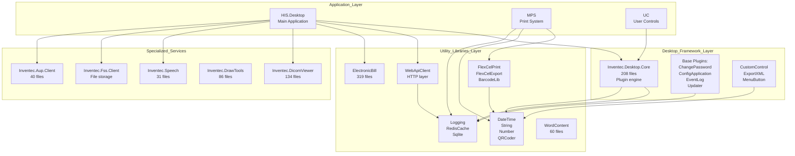
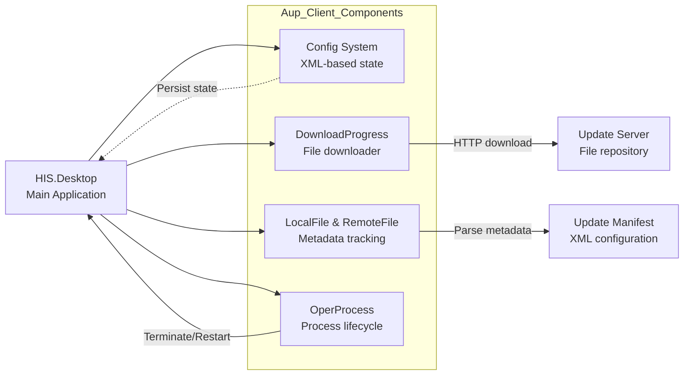
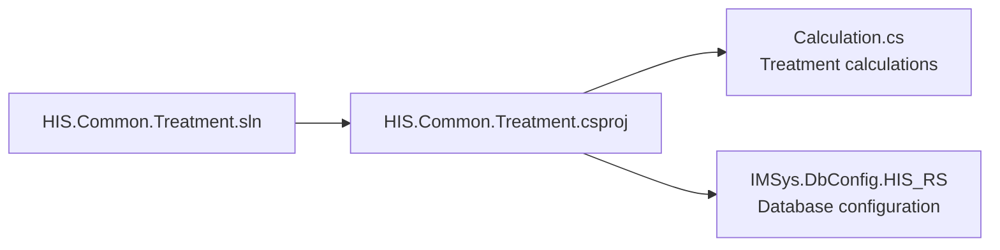
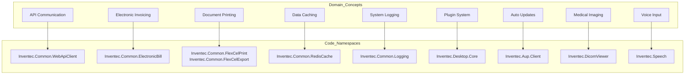
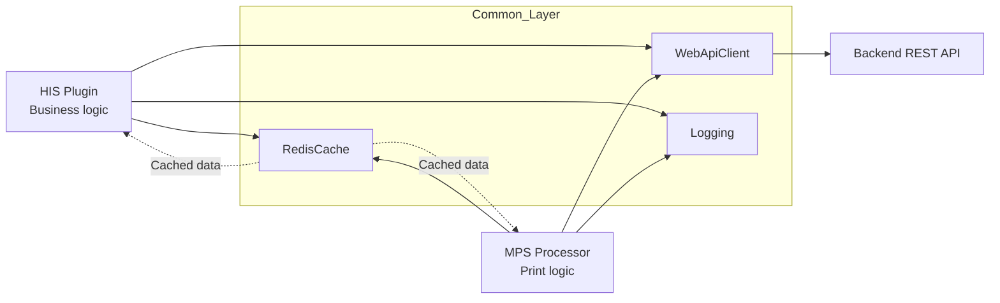
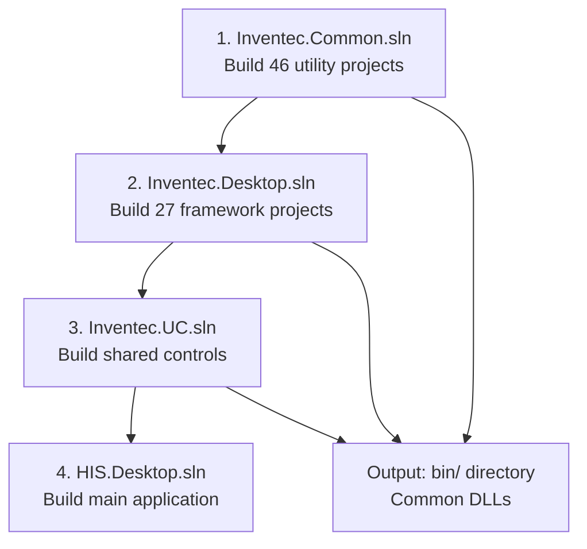

## Purpose and Scope

The `Common/` directory contains foundational utility libraries and frameworks that provide core functionality for all HIS modules. This page provides an overview of the 12 major component groups, their architecture, and dependencies. The Common libraries form a three-tier foundation: core utilities (Inventec.Common), desktop framework (Inventec.Desktop), and shared UI controls (Inventec.UC), plus specialized libraries for medical imaging, file storage, and voice recognition.

For detailed coverage of specific subsystems:
- Inventec.Common utilities (46 projects) - see [Inventec Common Utilities](../../02-modules/common-libraries/libraries.md#inventec-common)
- Inventec.Desktop framework (27 projects) - see [Inventec Desktop Framework](../../02-modules/common-libraries/libraries.md#inventec-desktop)  
- Inventec.UC shared controls (1,060 files) - see [Inventec UC Shared Controls](../../02-modules/common-libraries/libraries.md#inventec-uc)

## Component Inventory

The Common/ directory contains 12 major component groups organized by functionality:

| Component | File Count | Primary Purpose | Key Projects |
|-----------|------------|-----------------|--------------|
| `Inventec.UC` | 1,060 files | Shared UI controls foundation | TreatmentRecord, TreeSereServHein |
| `Inventec.Common` | 890 files (46 projects) | General-purpose utilities | ElectronicBill, QRCoder, FlexCelPrint, WebApiClient, Logging |
| `Inventec.Desktop` | 455 files (27 projects) | Desktop application framework | Core (208 files), plugin system, base plugins |
| `Inventec.DicomViewer` | 134 files | Medical imaging viewer | DICOM format support, image manipulation |
| `Inventec.DrawTools` | 86 files | Drawing and annotation tools | Graphics utilities |
| `Inventec.Aup.Client` | 40 files | Auto-update client | Download manager, version control, process lifecycle |
| `Inventec.Speech` | 31 files | Voice recognition | Speech-to-text for medical dictation |
| `Inventec.Fss.Client` | Variable | File storage service client | Remote file upload/download |
| `Inventec.WCF` | Variable | WCF communication layer | Service contracts |
| `HIS.Common.*` | Variable | HIS-specific utilities | Treatment calculations, domain logic |

Sources: [[`.devin/wiki.json:243-246`](../../../../.devin/wiki.json#L243-L246)](../../../../.devin/wiki.json#L243-L246)

## Architectural Layers

### Dependency Flow Between Layers



The diagram illustrates a bottom-up dependency structure:
- **Application modules** (HIS, MPS, UC) depend on both framework and utility layers
- **Desktop framework layer** provides plugin infrastructure and application lifecycle management
- **Utility libraries layer** supplies cross-cutting concerns (logging, caching, API communication)
- **Specialized services** are consumed directly by application modules for domain-specific needs

Sources: [[`.devin/wiki.json:240-247`](../../../../.devin/wiki.json#L240-L247)](../../../../.devin/wiki.json#L240-L247)

## Inventec.Common - Utility Libraries (46 Projects)

The `Inventec.Common` namespace contains 46 discrete projects totaling 890 files, providing general-purpose utilities across multiple domains.

### Communication & Integration

| Project | Files | Purpose |
|---------|-------|---------|
| `Inventec.Common.WebApiClient` | Variable | REST API client with authentication, retry logic, error handling |
| `Inventec.Common.ElectronicBill` | 319 files | Electronic invoice integration with Vietnam tax authorities |
| `Inventec.Common.RedisCache` | 26 files | Redis caching layer for performance optimization |
| `Inventec.Common.Sqlite` | 32 files | Local SQLite database utilities |
| `Inventec.Common.WitAI` | 25 files | Wit.ai natural language processing integration |

### Document Generation

| Project | Files | Purpose |
|---------|-------|---------|
| `Inventec.Common.FlexCelPrint` | 38 files | Print document generation using FlexCell library |
| `Inventec.Common.FlexCelExport` | 23 files | Excel/PDF export functionality |
| `Inventec.Common.WordContent` | 60 files | Microsoft Word document manipulation |
| `Inventec.Common.QRCoder` | 51 files | QR code generation and decoding |
| `Inventec.Common.BarcodeLib` | 32 files | Barcode generation (multiple formats) |

### Data Manipulation & Core Utilities

| Project | Purpose |
|---------|---------|
| `Inventec.Common.Logging` | System-wide logging framework with multiple output targets |
| `Inventec.Common.DateTime` | Date/time utilities with Vietnamese calendar support |
| `Inventec.Common.String` | String manipulation and validation |
| `Inventec.Common.Number` | Numeric formatting and calculations |

Sources: [[`.devin/wiki.json:250-256`](../../../../.devin/wiki.json#L250-L256)](../../../../.devin/wiki.json#L250-L256)

## Inventec.Desktop - Application Framework (27 Projects)

The `Inventec.Desktop` namespace provides the foundational framework for the desktop application, comprising 27 projects and 455 files.

### Core Framework Components

```mermaid
graph TB
    Desktop_Core["Inventec.Desktop.Core<br/>208 files"]
    
    subgraph "Core_Responsibilities"
        Discovery["Plugin Discovery<br/>Assembly scanning"]
        Registration["Plugin Registration<br/>Module registry"]
        Lifecycle["Lifecycle Management<br/>Init, Start, Stop"]
        Loading["Module Loading<br/>Dynamic assembly loading"]
    end
    
    subgraph "Base_Plugins"
        ChangePass["ChangePassword"]
        ConfigApp["ConfigApplication"]
        EventLog["EventLog"]
        Updater["Updater"]
        TrackUser["TrackingUser"]
        PrintLog["PrintLog"]
        ProductVer["ProductVersion"]
        Developer["Deverloper"]
    end
    
    subgraph "UI_Components"
        CustomControl["CustomControl<br/>26 files"]
        ExportXML["ExportXML<br/>30 files"]
        MenuButton["MenuButton"]
    end
    
    Desktop_Core --> Discovery
    Desktop_Core --> Registration
    Desktop_Core --> Lifecycle
    Desktop_Core --> Loading
    
    Desktop_Core --> ChangePass
    Desktop_Core --> ConfigApp
    Desktop_Core --> EventLog
    Desktop_Core --> Updater
    Desktop_Core --> TrackUser
    Desktop_Core --> PrintLog
    Desktop_Core --> ProductVer
    Desktop_Core --> Developer
    
    Desktop_Core --> CustomControl
    Desktop_Core --> ExportXML
    Desktop_Core --> MenuButton
```



### Base Plugins (8 Built-in Plugins)

| Plugin Name | Purpose |
|-------------|---------|
| `ChangePassword` | User password change interface |
| `ConfigApplication` | Application configuration management UI |
| `Deverloper` | Developer tools and debugging utilities |
| `EventLog` | System event logging viewer |
| `Plugin` | Plugin management interface |
| `PrintLog` | Print operation logging and history |
| `ProductVersion` | Version information display |
| `TrackingUser` | User activity tracking and audit |
| `Updater` | Application auto-update mechanism |

Sources: [[`.devin/wiki.json:260-267`](../../../../.devin/wiki.json#L260-L267)](../../../../.devin/wiki.json#L260-L267)

## Inventec.UC - Shared Control Library (1,060 Files)

The `Inventec.UC` project is the largest single Common component with 1,060 files, providing foundational UI controls used throughout the application.

### Key Components

| Component | Files | Purpose |
|-----------|-------|---------|
| `TreatmentRecord` | 29 files | Treatment record display and editing controls |
| `TreeSereServHein` | 29 files | Service tree with insurance information display |

These controls form the base layer upon which HIS-specific UC library builds. The HIS.UC.* projects (131 components) extend these foundation controls with domain-specific functionality.

For complete coverage of UC components, see [UC Components Library](../../02-modules/uc-controls/form-type-controls.md) and [Inventec UC Shared Controls](../../02-modules/common-libraries/libraries.md#inventec-uc).

Sources: [[`.devin/wiki.json:270-272`](../../../../.devin/wiki.json#L270-L272)](../../../../.devin/wiki.json#L270-L272)

## Specialized Components

### Inventec.DicomViewer (134 Files)

Medical imaging viewer supporting DICOM standard format:

**Capabilities:**
- DICOM image loading and rendering
- Windowing/leveling operations for contrast adjustment
- Measurement tools (distance, angle, area)
- Multi-frame and multi-series support
- Integration with PACS (Picture Archiving and Communication System)
- Annotation and markup tools

**Integration:** Used by HIS imaging plugins to display X-rays, CT scans, MRI, and other medical images.

### Inventec.Speech (31 Files)

Voice recognition integration for medical dictation workflows:

**Features:**
- Speech-to-text conversion
- Medical terminology vocabulary support
- Voice command recognition
- Dictation workflow integration
- Support for Vietnamese medical terminology

**Use Cases:** 
- Clinical note dictation
- Prescription entry via voice
- Diagnostic report generation

### Inventec.Fss.Client

File Storage Service client for remote file operations:

**Functionality:**
- File upload/download with progress tracking
- Metadata management (file size, type, upload date)
- Version control for document revisions
- Access permission handling
- Integration with backend FSS service

**Used By:** Document management plugins, EMR document storage, attachment handling

### Inventec.Aup.Client (40 Files)

Auto-update client system managing application updates:



**Update Process:**
1. Check for updates via manifest XML
2. Download new files with progress tracking
3. Terminate application
4. Replace files
5. Restart application

Sources: [[`.devin/wiki.json:243-246`](../../../../.devin/wiki.json#L243-L246)](../../../../.devin/wiki.json#L243-L246)

## HIS.Common Libraries

### HIS.Common.Treatment

Treatment calculation utilities providing domain-specific logic.

**Project Structure:**



**File Locations:**
- Solution: [[`Common/HIS.Common.Treatment/HIS.Common.Treatment.sln:1-20`](../../../../Common/HIS.Common.Treatment/HIS.Common.Treatment.sln#L1-L20)](../../../../Common/HIS.Common.Treatment/HIS.Common.Treatment.sln#L1-L20)
- Project: [[`Common/HIS.Common.Treatment/HIS.Common.Treatment/HIS.Common.Treatment.csproj:1-57`](../../../../Common/HIS.Common.Treatment/HIS.Common.Treatment/HIS.Common.Treatment.csproj#L1-L57)](../../../../Common/HIS.Common.Treatment/HIS.Common.Treatment/HIS.Common.Treatment.csproj#L1-L57)
- Assembly: [[`Common/HIS.Common.Treatment/HIS.Common.Treatment/Properties/AssemblyInfo.cs:1-37`](../../../../Common/HIS.Common.Treatment/HIS.Common.Treatment/Properties/AssemblyInfo.cs#L1-L37)](../../../../Common/HIS.Common.Treatment/HIS.Common.Treatment/Properties/AssemblyInfo.cs#L1-L37)

**Dependencies:**
- `IMSys.DbConfig.HIS_RS` - Database configuration access
- .NET Framework 4.5 ([[`Common/HIS.Common.Treatment/HIS.Common.Treatment/HIS.Common.Treatment.csproj:12`](../../../../Common/HIS.Common.Treatment/HIS.Common.Treatment/HIS.Common.Treatment.csproj#L12)](../../../../Common/HIS.Common.Treatment/HIS.Common.Treatment/HIS.Common.Treatment.csproj#L12))

**Purpose:** Provides treatment-related calculation logic (e.g., dosage calculations, treatment duration) used across HIS modules.

Sources: [[`Common/HIS.Common.Treatment/HIS.Common.Treatment.sln:1-20`](../../../../Common/HIS.Common.Treatment/HIS.Common.Treatment.sln#L1-L20)](../../../../Common/HIS.Common.Treatment/HIS.Common.Treatment.sln#L1-L20), [[`Common/HIS.Common.Treatment/HIS.Common.Treatment/HIS.Common.Treatment.csproj:1-57`](../../../../Common/HIS.Common.Treatment/HIS.Common.Treatment/HIS.Common.Treatment.csproj#L1-L57)](../../../../Common/HIS.Common.Treatment/HIS.Common.Treatment/HIS.Common.Treatment.csproj#L1-L57), [[`Common/HIS.Common.Treatment/HIS.Common.Treatment/Properties/AssemblyInfo.cs:1-37`](../../../../Common/HIS.Common.Treatment/HIS.Common.Treatment/Properties/AssemblyInfo.cs#L1-L37)](../../../../Common/HIS.Common.Treatment/HIS.Common.Treatment/Properties/AssemblyInfo.cs#L1-L37)

## Code Entity Mapping

### Natural Language to Code Entities



### Key Classes and Interfaces

| Domain Concept | Namespace | Key Classes/Interfaces |
|----------------|-----------|------------------------|
| API Communication | `Inventec.Common.WebApiClient` | `ApiConsumer`, `WebApiRequest`, `WebApiResponse` |
| Electronic Invoicing | `Inventec.Common.ElectronicBill` | `BillProcessor`, `TaxAuthorityClient`, `InvoiceData` |
| Document Printing | `Inventec.Common.FlexCelPrint` | `PrintManager`, `TemplateProcessor`, `ExportFormat` |
| Data Caching | `Inventec.Common.RedisCache` | `RedisCacheManager`, `CacheKey`, `CacheValue` |
| Logging | `Inventec.Common.Logging` | `LogSystem`, `LogAction`, `LogLevel` |
| Plugin System | `Inventec.Desktop.Core` | `IModule`, `ModuleLoader`, `PluginRegistry` |
| Auto Updates | `Inventec.Aup.Client` | `DownloadProgress`, `OperProcess`, `UpdateManifest` |
| Medical Imaging | `Inventec.DicomViewer` | `DicomImage`, `ViewerControl`, `ImageProcessor` |
| Voice Recognition | `Inventec.Speech` | `SpeechRecognizer`, `DictationEngine`, `VoiceCommand` |

Sources: [[`.devin/wiki.json:243-267`](../../../../.devin/wiki.json#L243-L267)](../../../../.devin/wiki.json#L243-L267)

## Integration Patterns

### Cross-Module Communication



**Communication Flow:**
1. HIS plugins and MPS processors use the same `WebApiClient` instance for consistent API communication
2. `RedisCache` provides shared cache accessible to all modules
3. `Logging` ensures unified logging across application boundaries

**Benefits:**
- Single point of API configuration (base URL, authentication)
- Shared cache reduces redundant API calls
- Centralized logging for troubleshooting

### Plugin Access to Common Libraries

Plugins access Common libraries through three mechanisms:

1. **Direct Reference:** Plugin project references Common DLL
   ```xml
   <Reference Include="Inventec.Common.Logging">
     <HintPath>..\..\Common\bin\Inventec.Common.Logging.dll</HintPath>
   </Reference>
   ```

2. **Static Access:** Singleton patterns for utilities
   ```csharp
   Inventec.Common.Logging.LogSystem.Info("Message");
   ```

3. **Dependency Injection:** Framework-provided instances
   ```csharp
   public MyPlugin(ILoggingService logger, IApiClient apiClient)
   {
       this.logger = logger;
       this.apiClient = apiClient;
   }
   ```

Sources: [[`.devin/wiki.json:240-247`](../../../../.devin/wiki.json#L240-L247)](../../../../.devin/wiki.json#L240-L247)

## External Dependencies

### Third-Party Libraries

Common libraries integrate with commercial and open-source components:

| Library | Version | Used By | Purpose |
|---------|---------|---------|---------|
| FlexCell | 5.7.6.0 | `FlexCelPrint`, `FlexCelExport` | Excel document generation |
| BarTender | 10.1.0 | `BarcodeLib` | Barcode printing |
| Redis | Variable | `RedisCache` | Distributed caching |
| SQLite | Variable | `Sqlite` | Local database |
| Wit.ai | Variable | `WitAI` | Natural language processing |

### External Services

| Service | Client Library | Purpose |
|---------|----------------|---------|
| Vietnam General Department of Taxation | `ElectronicBill` | Electronic invoice submission and validation |
| PACS Systems | `DicomViewer` | Medical imaging integration (DICOM protocol) |
| File Storage Service | `Fss.Client` | Remote file storage and retrieval |
| Update Server | `Aup.Client` | Application version management |

Sources: [[`.devin/wiki.json:12-14`](../../../../.devin/wiki.json#L12-L14)](../../../../.devin/wiki.json#L12-L14)

## Usage Examples

### API Communication

```csharp
// Using WebApiClient for REST API calls
using Inventec.Common.WebApiClient;

var apiClient = new ApiConsumer();
var result = await apiClient.Get<List<PatientDTO>>(
    endpoint: "/api/patients",
    parameters: new { page = 1, pageSize = 50 }
);

if (result.Success)
{
    var patients = result.Data;
    // Process patients
}
```

### Logging

```csharp
// System-wide logging using LogSystem
using Inventec.Common.Logging;

public class MyPlugin
{
    public void ProcessData()
    {
        LogSystem.Info("Processing started");
        
        try
        {
            // Business logic
            LogSystem.Debug("Processing patient record 12345");
        }
        catch (Exception ex)
        {
            LogSystem.Error("Processing failed", ex);
        }
    }
}
```

### Caching

```csharp
// Using RedisCache for data caching
using Inventec.Common.RedisCache;

public class DataService
{
    private RedisCacheManager cache;
    
    public async Task<List<Medicine>> GetMedicines()
    {
        var cacheKey = "medicines:all";
        var cached = await cache.GetAsync<List<Medicine>>(cacheKey);
        
        if (cached != null)
            return cached;
        
        var medicines = await LoadFromDatabase();
        await cache.SetAsync(cacheKey, medicines, TimeSpan.FromHours(1));
        
        return medicines;
    }
}
```

### Document Generation

```csharp
// Generate Excel report using FlexCelPrint
using Inventec.Common.FlexCelPrint;

public void GeneratePrescriptionReport(PrescriptionData data)
{
    var printManager = new PrintManager();
    var result = printManager.Print(
        templateFile: "Templates/Prescription.xls",
        data: data,
        outputFormat: ExportFormat.Pdf,
        outputPath: "Output/Prescription_12345.pdf"
    );
}
```

### Electronic Bill Creation

```csharp
// Generate e-invoice for tax authority
using Inventec.Common.ElectronicBill;

public void CreateElectronicInvoice(InvoiceData invoiceData)
{
    var processor = new BillProcessor();
    var result = processor.CreateBill(
        invoiceData: invoiceData,
        taxAuthorityCode: "VIETSENS-001",
        certificatePath: "certificates/tax-cert.pfx"
    );
    
    if (result.Success)
    {
        LogSystem.Info($"E-invoice created: {result.InvoiceNumber}");
    }
}
```

## Configuration Management

### Configuration Sources

Common libraries read configuration from multiple sources with the following precedence:

1. **Environment variables** (highest priority) - sensitive data like API keys
2. **XML configuration files** - application-level settings
3. **Database configuration** - user and system preferences
4. **Default values** (lowest priority) - built-in fallbacks

### Configuration Storage

| Configuration Type | Storage Location | Access Method |
|-------------------|------------------|---------------|
| Application settings | `HIS.Desktop.LocalStorage.ConfigApplication` | Static properties |
| System settings | `HIS.Desktop.LocalStorage.ConfigSystem` | Config keys |
| User preferences | Database via `BackendData` | API calls with caching |
| Sensitive data | Environment variables | `Environment.GetEnvironmentVariable()` |

For detailed configuration management, see [LocalStorage & Configuration](../../02-modules/his-desktop/core.md).

## Version Management

### Assembly Versioning

Common libraries follow semantic versioning with versions stored in [[`AssemblyInfo.cs`](../../../AssemblyInfo.cs)](../../../AssemblyInfo.cs) files:

```csharp
// Example from HIS.Common.Treatment
[assembly: AssemblyVersion("1.0.0.0")]
[assembly: AssemblyFileVersion("1.0.0.0")]
```

**Version Format:** `Major.Minor.Build.Revision`
- **Major:** Breaking API changes
- **Minor:** New features, backward compatible
- **Build:** Bug fixes
- **Revision:** Hotfixes

Example: [[`Common/HIS.Common.Treatment/HIS.Common.Treatment/Properties/AssemblyInfo.cs:35-36`](../../../../Common/HIS.Common.Treatment/HIS.Common.Treatment/Properties/AssemblyInfo.cs#L35-L36)](../../../../Common/HIS.Common.Treatment/HIS.Common.Treatment/Properties/AssemblyInfo.cs#L35-L36)

### Dependency Management

Common libraries maintain compatibility through:
- **Strong naming** - Assembly signing for versioning
- **NuGet packages** - External dependencies managed in `packages/` folder
- **Assembly redirects** - Binding redirects for version conflicts

Sources: [[`Common/HIS.Common.Treatment/HIS.Common.Treatment/Properties/AssemblyInfo.cs:1-37`](../../../../Common/HIS.Common.Treatment/HIS.Common.Treatment/Properties/AssemblyInfo.cs#L1-L37)](../../../../Common/HIS.Common.Treatment/HIS.Common.Treatment/Properties/AssemblyInfo.cs#L1-L37)

## Build Process

### Build Order

Common libraries build before dependent modules:



### Build Configuration

- **Target Framework:** .NET Framework 4.5 ([[`Common/HIS.Common.Treatment/HIS.Common.Treatment/HIS.Common.Treatment.csproj:12`](../../../../Common/HIS.Common.Treatment/HIS.Common.Treatment/HIS.Common.Treatment.csproj#L12)](../../../../Common/HIS.Common.Treatment/HIS.Common.Treatment/HIS.Common.Treatment.csproj#L12))
- **Platform:** AnyCPU
- **Configuration:** Debug or Release
- **Output:** Compiled DLLs in shared `bin/` directory

### Build Commands

```bash