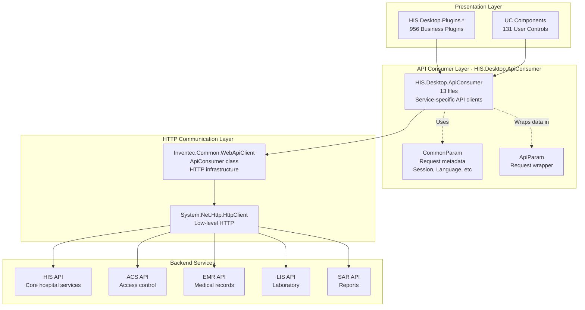
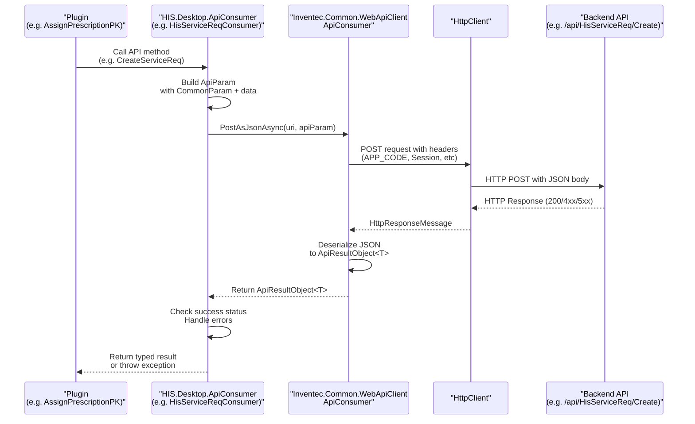
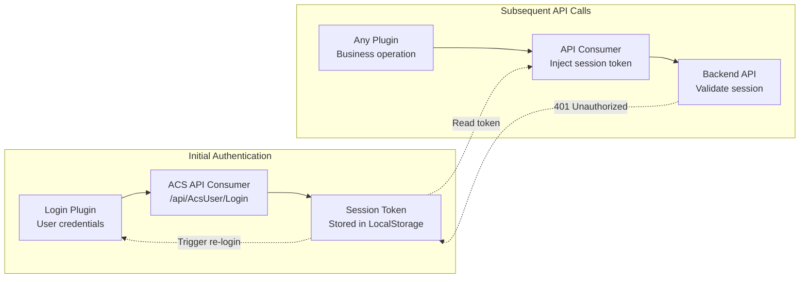
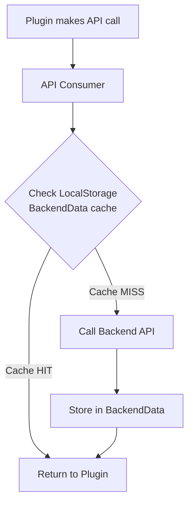

## Purpose and Scope

The API Consumer Layer provides a standardized abstraction for all backend API communication in the HIS Desktop application. Located in `HIS.Desktop.ApiConsumer/` (13 files), this layer handles REST API calls, response processing, error handling, and authentication flows between the desktop client and backend services.

This document covers the API communication infrastructure. For information about how API responses are cached locally, see [LocalStorage & Configuration](../../02-modules/his-desktop/core.md). For details on how plugins consume APIs, see [Plugin System Architecture](../../01-architecture/plugin-system.md).

---

## Architecture Overview

The API Consumer Layer acts as an intermediary between the presentation layer (plugins) and backend REST services, built on top of `Inventec.Common.WebApiClient`.



**Sources:** [`Common/Inventec.Aup.Client/Inventec.Aup.Client/ApiConsumerStore.cs:1-32`](../../../../Common/Inventec.Aup.Client/Inventec.Aup.Client/ApiConsumerStore.cs#L1-L32, [`Common/Inventec.Aup.Client/Inventec.Aup.Client/FileUpload.cs:1-150`](../../../../Common/Inventec.Aup.Client/Inventec.Aup.Client/FileUpload.cs#L1-L150)

---

## Core Components

### HIS.Desktop.ApiConsumer Structure

The `HIS.Desktop.ApiConsumer/` directory contains service-specific API client classes that encapsulate communication with different backend API domains:

| Component | Description |
|-----------|-------------|
| **HIS API Consumers** | Client classes for core hospital information system operations (treatment, prescription, billing) |
| **ACS API Consumer** | Client for access control and authentication services |
| **EMR API Consumer** | Client for electronic medical record operations |
| **LIS API Consumer** | Client for laboratory information system integration |
| **SAR API Consumer** | Client for report template and generation services |
| **SDA API Consumer** | Client for system data administration |

Each consumer class follows a consistent pattern of wrapping service endpoints and providing strongly-typed method calls.

### Inventec.Common.WebApiClient Integration

The foundation of all API communication is the `Inventec.Common.WebApiClient.ApiConsumer` class, which provides:

- **Base URI Configuration**: Each API consumer is initialized with a specific base URI
- **Application Code Header**: Automatic injection of `APP_CODE` for service identification
- **Timeout Management**: Configurable HTTP timeout settings
- **JSON Serialization**: Automatic serialization/deserialization using Newtonsoft.Json

Example instantiation pattern:

```csharp
// From ApiConsumerStore.cs
internal static Inventec.Common.WebApiClient.ApiConsumer AupConsumer 
{ 
    get { return new Inventec.Common.WebApiClient.ApiConsumer(
        AupConstant.BASE_URI, 
        AupConstant.APP_CODE
    ); } 
}
```

**Sources:** [`Common/Inventec.Aup.Client/Inventec.Aup.Client/ApiConsumerStore.cs:27-30`](../../../../Common/Inventec.Aup.Client/Inventec.Aup.Client/ApiConsumerStore.cs#L27-L30)

---

## API Communication Patterns

### Request Flow Architecture



**Sources:** [`Common/Inventec.Aup.Client/Inventec.Aup.Client/FileUpload.cs:43-93`](../../../../Common/Inventec.Aup.Client/Inventec.Aup.Client/FileUpload.cs#L43-L93)

### ApiParam Structure

All API requests are wrapped in a standardized `ApiParam` object:

```csharp
// Request wrapper pattern used throughout ApiConsumer
Inventec.Common.WebApiClient.ApiParam apiParam = 
    new Inventec.Common.WebApiClient.ApiParam();

apiParam.CommonParam = new CommonParam(); // Session, user, language metadata
apiParam.ApiData = dataObject;            // Actual business data
```

The `CommonParam` object carries cross-cutting request metadata:
- **Session Token**: User authentication token
- **Language Code**: Localization preference (e.g., "vi", "en")
- **User Context**: Current user ID and permissions
- **Branch/Location**: Facility and department context

**Sources:** [`Common/Inventec.Aup.Client/Inventec.Aup.Client/FileUpload.cs:54-62`](../../../../Common/Inventec.Aup.Client/Inventec.Aup.Client/FileUpload.cs#L54-L62)

### Response Handling

API responses follow the `ApiResultObject<T>` pattern:

| Property | Type | Description |
|----------|------|-------------|
| **Data** | `T` | Successful response payload (null on error) |
| **Param** | `CommonParam` | Response metadata including messages and errors |
| **Success** | `bool` | Indicates whether the operation succeeded |

Response processing pattern:

```csharp
// Typical response handling flow
if (message.IsSuccessStatusCode)
{
    string jsonString = message.Content.ReadAsStringAsync().Result;
    if (!String.IsNullOrWhiteSpace(jsonString))
    {
        var rsData = Newtonsoft.Json.JsonConvert
            .DeserializeObject<ApiResultObject<T>>(jsonString);
        return rsData != null ? rsData.Data : null;
    }
}
```

**Sources:** [`Common/Inventec.Aup.Client/Inventec.Aup.Client/FileUpload.cs:68-76`](../../../../Common/Inventec.Aup.Client/Inventec.Aup.Client/FileUpload.cs#L68-L76)

---

## Authentication and Session Management

### Authentication Flow



### Session Token Injection

Each API request includes the session token in the request headers. The token is managed by `HIS.Desktop.LocalStorage.ConfigApplication` and automatically injected by the API Consumer layer.

**Token lifecycle:**
1. User logs in via ACS Login API
2. Session token stored in `LocalStorage.ConfigApplication`
3. All subsequent API calls read token from LocalStorage
4. Token included in request headers automatically
5. On 401 Unauthorized response, trigger re-authentication

**Sources:** [`Common/Inventec.Aup.Client/Inventec.Aup.Client/FileUpload.cs:47-52`](../../../../Common/Inventec.Aup.Client/Inventec.Aup.Client/FileUpload.cs#L47-L52, [`.devin/wiki.json:45-52`](../../../../.devin/wiki.json#L45-L52)

---

## Error Handling Patterns

### HTTP Status Code Handling

The API Consumer layer distinguishes between different error categories:

| Status Code | Handling Strategy |
|-------------|-------------------|
| **200-299** | Success - deserialize response body |
| **400** | Bad Request - display validation errors to user |
| **401** | Unauthorized - trigger re-authentication flow |
| **403** | Forbidden - display permission denied message |
| **404** | Not Found - entity doesn't exist |
| **500-599** | Server Error - log error, display generic message |
| **Timeout** | Network timeout - retry mechanism |

### Exception Handling Pattern

```csharp
// Standard exception handling pattern
try
{
    // Make API call
    using (HttpResponseMessage message = client.PostAsJsonAsync(uri, apiParam).Result)
    {
        if (message.IsSuccessStatusCode)
        {
            // Process success response
        }
        else
        {
            throw new CustomApiException(message.StatusCode, message.ReasonPhrase);
        }
    }
}
catch (CustomApiException ex)
{
    // Specific API error - propagate to caller
    throw ex;
}
catch (Exception ex)
{
    // Unexpected error - wrap and log
    throw new CustomApiException("Exception when calling API", ex);
}
```

**Sources:** [`Common/Inventec.Aup.Client/Inventec.Aup.Client/FileUpload.cs:84-92`](../../../../Common/Inventec.Aup.Client/Inventec.Aup.Client/FileUpload.cs#L84-L92)

---

## HTTP Client Configuration

### Timeout Configuration

API calls use configurable timeouts to prevent indefinite blocking:

```csharp
client.Timeout = new TimeSpan(0, 0, AupConstant.TIME_OUT); // seconds
```

Default timeout values are stored in configuration constants and can be adjusted per API domain (e.g., longer timeouts for report generation, shorter for simple queries).

### Request Headers

Standard headers injected into all requests:

| Header | Purpose | Example |
|--------|---------|---------|
| **APP_CODE** | Application identifier | `"HIS_DESKTOP"` |
| **CLIENT_CODE** | Client/facility code | `"HOSPITAL_001"` |
| **Authorization** | Bearer token | `"Bearer {session_token}"` |
| **Accept-Language** | Localization | `"vi-VN"` |
| **Content-Type** | Request format | `"application/json"` |

**Sources:** [`Common/Inventec.Aup.Client/Inventec.Aup.Client/FileUpload.cs:47-52`](../../../../Common/Inventec.Aup.Client/Inventec.Aup.Client/FileUpload.cs#L47-L52, [`Common/Inventec.Aup.Client/Inventec.Aup.Client/FileUpload.cs:110-115`](../../../../Common/Inventec.Aup.Client/Inventec.Aup.Client/FileUpload.cs#L110-L115)

---

## Integration with LocalStorage

### Response Caching Strategy



The API Consumer layer integrates with `HIS.Desktop.LocalStorage.BackendData` to implement client-side caching:

**Cached data categories:**
- **Reference Data**: Rarely-changing system data (medicine types, departments, rooms)
- **Configuration**: System and user preferences
- **User Context**: Current user permissions and roles

**Cache invalidation:**
- Explicit cache clear on data modification operations
- Time-based expiration for volatile data
- Version-based invalidation for configuration changes

For detailed caching mechanisms, see [LocalStorage & Configuration](../../02-modules/his-desktop/core.md).

**Sources:** [`.devin/wiki.json:45-52`](../../../../.devin/wiki.json#L45-L52)

---

## Usage Examples in Plugins

### Example 1: Creating a Service Request

```
// Typical plugin API call pattern
// From any plugin in HIS.Desktop.Plugins.*

// 1. Prepare data object
var serviceReqData = new ServiceReqSDO 
{
    PatientId = currentPatient.Id,
    TreatmentId = currentTreatment.Id,
    ServiceIds = selectedServices
};

// 2. Call through ApiConsumer
var apiConsumer = new HisServiceReqConsumer();
var result = apiConsumer.Create(serviceReqData);

// 3. Handle result
if (result != null && result.Data != null)
{
    // Success - update UI
    RefreshServiceRequestList();
}
else
{
    // Error - display message from result.Param
    MessageBox.Show(result.Param.Messages);
}
```

### Example 2: File Upload Pattern

The file upload functionality demonstrates specialized API communication for binary data:

```csharp
// Upload files to update server
List<FileUploadInfo> files = new List<FileUploadInfo> 
{
    new FileUploadInfo { Url = "path/to/file.dll" },
    new FileUploadInfo { Url = "path/to/config.xml" }
};

var uploadedFiles = FileUpload.UploadFile(
    clientCode: "HIS_DESKTOP",
    files: files,
    baseUri: updateServerUri
);

foreach (var file in uploadedFiles) 
{
    // Process uploaded file info
    Console.WriteLine($"Uploaded: {file.Url}");
}
```

**Sources:** [`Common/Inventec.Aup.Client/Inventec.Aup.Client/FileUpload.cs:43-93`](../../../../Common/Inventec.Aup.Client/Inventec.Aup.Client/FileUpload.cs#L43-L93, [`Common/Inventec.Aup.Client/Inventec.Aup.Client/FileUpload.cs:106-146`](../../../../Common/Inventec.Aup.Client/Inventec.Aup.Client/FileUpload.cs#L106-L146)

---

## Service-Specific API Consumers

### Consumer Classes by Domain

The `HIS.Desktop.ApiConsumer/` directory contains specialized consumer classes for each backend service domain:

| Consumer Class | Backend API Domain | Key Operations |
|----------------|-------------------|----------------|
| **HisServiceReqConsumer** | `/api/HisServiceReq/*` | Create, Update, Delete service requests |
| **HisTreatmentConsumer** | `/api/HisTreatment/*` | Treatment CRUD, status changes |
| **HisPatientConsumer** | `/api/HisPatient/*` | Patient registration, updates |
| **HisPrescriptionConsumer** | `/api/HisPrescription/*` | Prescription management |
| **AcsUserConsumer** | `/api/AcsUser/*` | Authentication, user management |
| **EmrDocumentConsumer** | `/api/EmrDocument/*` | Medical record operations |
| **LisSampleConsumer** | `/api/LisSample/*` | Laboratory sample tracking |
| **SarReportConsumer** | `/api/SarReport/*` | Report generation requests |

Each consumer encapsulates:
- Endpoint URI construction
- Request/response type mappings
- Domain-specific error handling
- Retry logic for critical operations

**Sources:** [`.devin/wiki.json:55-57`](../../../../.devin/wiki.json#L55-L57)

---

## Performance Considerations

### Connection Pooling

The `HttpClient` instances are managed through the `ApiConsumer` factory pattern to leverage connection pooling and avoid socket exhaustion.

### Async/Await Pattern

While the current implementation uses `.Result` for synchronous operations:

```csharp
using (HttpResponseMessage message = client.PostAsJsonAsync(uri, apiParam).Result)
```

This pattern is used throughout the desktop application to maintain synchronous plugin execution flow. Modern refactoring could introduce async/await patterns for improved responsiveness.

### Request Batching

For operations requiring multiple API calls, the API Consumer layer supports batch requests to reduce network round-trips. However, individual plugins are responsible for implementing batching logic at the business layer.

**Sources:** [`Common/Inventec.Aup.Client/Inventec.Aup.Client/FileUpload.cs:66-81`](../../../../Common/Inventec.Aup.Client/Inventec.Aup.Client/FileUpload.cs#L66-L81)

---

## Logging and Diagnostics

All API calls are instrumented with logging through `Inventec.Common.Logging.LogSystem`:

```csharp
Inventec.Common.Logging.LogSystem.Debug(
    "clientCode=" + clientCode + "____" + 
    Inventec.Common.Logging.LogUtil.TraceData(
        Inventec.Common.Logging.LogUtil.GetMemberName(() => BASE_URI), 
        BASE_URI
    )
);
```

**Logged information:**
- Request URI and parameters
- Request/response timing
- Error details and stack traces
- Session context

For details on the logging system, see [Inventec Common Utilities](../../02-modules/common-libraries/libraries.md#inventec-common).

**Sources:** [`Common/Inventec.Aup.Client/Inventec.Aup.Client/FileUpload.cs:60-64`](../../../../Common/Inventec.Aup.Client/Inventec.Aup.Client/FileUpload.cs#L60-L64)

---

## Summary

The API Consumer Layer provides a robust, standardized interface for all backend communication in the HIS Desktop application. Key characteristics:

- **Centralized Communication**: All API calls flow through `HIS.Desktop.ApiConsumer/` (13 files)
- **Type Safety**: Strongly-typed request/response objects via `ApiParam` and `ApiResultObject<T>`
- **Session Management**: Automatic injection of authentication tokens
- **Error Handling**: Consistent exception handling and status code interpretation
- **Foundation**: Built on `Inventec.Common.WebApiClient.ApiConsumer`
- **Integration**: Seamless connection with LocalStorage caching layer

This architecture enables the 956 business plugins to communicate with backend services without implementing HTTP communication logic directly.