## Purpose and Scope

This document covers the **HIS.Desktop.Plugins.*** namespace plugins, which implement the core hospital business workflows in the HisNguonMo system. These plugins handle the primary clinical and administrative functions including patient registration, examination, treatment, prescription management, and care tracking.

This page focuses specifically on business logic plugins. For other plugin categories, see:
- Transaction and billing plugins: [Transaction & Billing Plugins](../../02-modules/his-desktop/business-plugins.md#transaction-billing)
- Medicine and material management: [Medicine & Material Plugins](../../03-business-domains/pharmacy/medicine-material.md)
- Access control and security: [ACS Access Control Plugins](../../03-business-domains/administration/access-control.md)
- Electronic medical records: [EMR Electronic Medical Record Plugins](../../02-modules/his-desktop/business-plugins.md#emr)
- Overall plugin architecture and communication: [Plugin System Architecture](../../01-architecture/plugin-system.md)

The HIS core business plugins represent approximately 600+ of the 956 total plugins in the system, making them the largest plugin category by count.

## Plugin Category Overview

The HIS core business plugins are organized into functional domains that mirror the hospital patient care workflow:

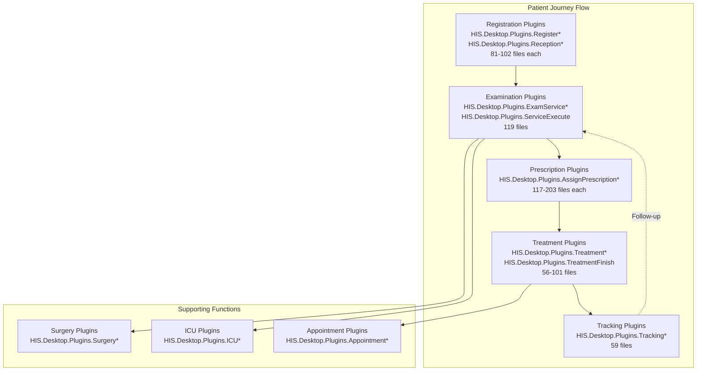

**Major Functional Groups:**

| Domain | Plugin Prefix | File Count Range | Primary Function |
|--------|--------------|------------------|------------------|
| Registration | `Register*`, `Reception*` | 81-102 | Patient admission and registration |
| Examination | `ExamService*`, `ServiceExecute` | 40-119 | Clinical examination and service execution |
| Prescription | `AssignPrescription*` | 117-203 | Medication ordering and clinical service orders |
| Treatment | `Treatment*`, `TreatmentFinish` | 56-101 | Inpatient care management and discharge |
| Tracking | `Tracking*` | 59 | Patient monitoring and care tracking |

Sources: [[`.devin/wiki.json:1-295`](../../../../.devin/wiki.json#L1-L295)](../../../../.devin/wiki.json#L1-L295)

## Registration and Admission Plugins

Registration plugins handle patient intake, demographic data capture, and initial case setup.

**Key Plugins:**

| Plugin Name | File Count | Function |
|-------------|-----------|----------|
| `HIS.Desktop.Plugins.Register` | 81-102 | New patient registration |
| `HIS.Desktop.Plugins.RegisterExamKiosk` | Variable | Self-service kiosk registration |
| `HIS.Desktop.Plugins.Reception` | 81-102 | Patient reception and check-in |
| `HIS.Desktop.Plugins.RegisterV2` | Variable | Enhanced registration interface |

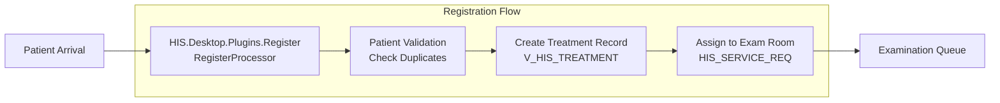

**Registration Process:**
1. Patient demographic data entry (name, DOB, address, insurance information)
2. Duplicate patient detection and merge handling
3. Treatment record creation with initial classification
4. Service room assignment based on availability and specialty
5. Queue position assignment for examination

The registration plugins interact heavily with:
- `HIS.UC.PatientSelect` - patient search and selection control
- `HIS.UC.UCHein` - insurance information entry (153 files)
- `HIS.Desktop.ADO` - patient and treatment data models
- Backend API endpoints for patient data persistence

Sources: [[`.devin/wiki.json:70-77`](../../../../.devin/wiki.json#L70-L77)](../../../../.devin/wiki.json#L70-L77)

## Treatment Management Plugins

Treatment plugins manage the full lifecycle of patient care episodes, from admission through discharge.

**Major Treatment Plugins:**

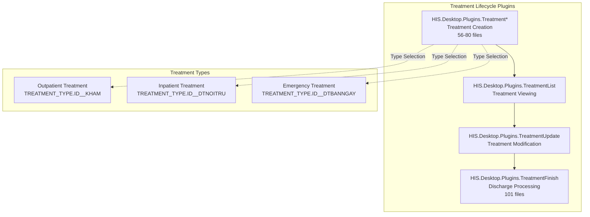

**Key Components:**

| Plugin | Files | Core Functionality |
|--------|-------|-------------------|
| `HIS.Desktop.Plugins.TreatmentFinish` | 101 | Discharge processing, outcome recording |
| `HIS.Desktop.Plugins.TreatmentLog` | 56 | Treatment event logging |
| `HIS.Desktop.Plugins.TreatmentList` | Variable | Treatment record browsing and search |

**Treatment Day Calculation:**

The system implements complex business rules for calculating treatment duration, as seen in `HIS.Common.Treatment.Calculation`:

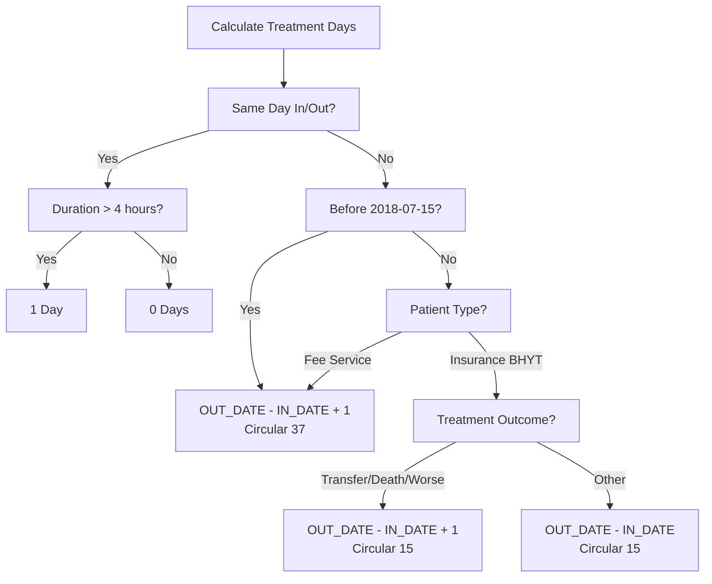

Treatment day calculation rules are defined in [[`Common/HIS.Common.Treatment/HIS.Common.Treatment/Calculation.cs:52-109`](../../../../Common/HIS.Common.Treatment/HIS.Common.Treatment/Calculation.cs#L52-L109)](../../../../Common/HIS.Common.Treatment/HIS.Common.Treatment/Calculation.cs#L52-L109):
- Same-day treatments with duration > 4 hours = 1 day
- Different calculation rules for pre/post July 15, 2018 (regulatory change)
- Insurance (BHYT) vs. fee-paying patients use different formulas
- Outcome-dependent calculations for transfers, deaths, or worsening conditions

Sources: [[`Common/HIS.Common.Treatment/HIS.Common.Treatment/Calculation.cs:1-178`](../../../../Common/HIS.Common.Treatment/HIS.Common.Treatment/Calculation.cs#L1-L178)](../../../../Common/HIS.Common.Treatment/HIS.Common.Treatment/Calculation.cs#L1-L178), [[`.devin/wiki.json:70-77`](../../../../.devin/wiki.json#L70-L77)](../../../../.devin/wiki.json#L70-L77)

## Examination and Service Execution Plugins

Examination plugins handle clinical encounters, diagnostic procedures, and service delivery.

**Primary Examination Plugins:**

| Plugin | Files | Purpose |
|--------|-------|---------|
| `HIS.Desktop.Plugins.ServiceExecute` | 119 | Service execution and result recording |
| `HIS.Desktop.Plugins.ExamServiceReqExecute` | Variable | Examination request processing |
| `HIS.Desktop.Plugins.ServiceReqList` | Variable | Service request queue management |

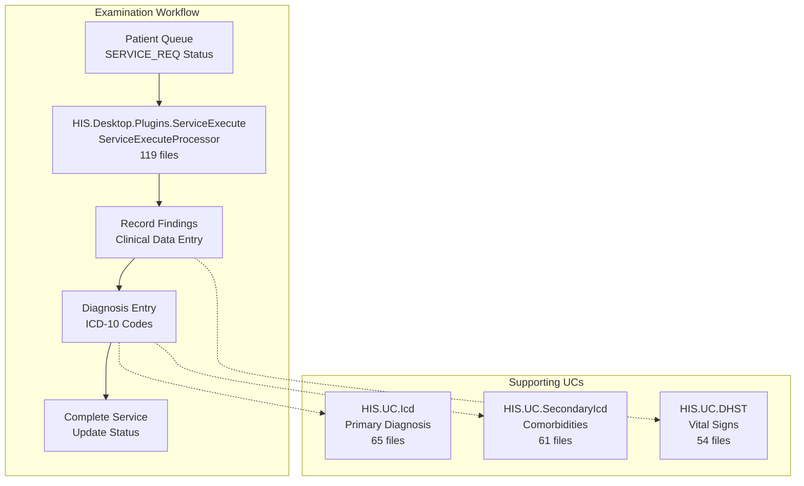

**Service Execution Process:**

1. **Queue Management**: Patients waiting for services are displayed in priority order
2. **Service Selection**: Clinician selects the service request to execute
3. **Clinical Data Entry**: 
   - Vital signs (DHST - Height, Weight, BP, Temperature)
   - Chief complaint and history
   - Physical examination findings
4. **Diagnosis Assignment**:
   - Primary diagnosis (ICD-10 code via `HIS.UC.Icd`)
   - Secondary diagnoses (comorbidities via `HIS.UC.SecondaryIcd`)
5. **Service Completion**: Status update and result documentation

The `ServiceExecute` plugin integrates with:
- `HIS.UC.ExamTreatmentFinish` (103 files) - examination completion controls
- `HIS.UC.FormType` (329 files) - dynamic form rendering for different service types
- `HIS.Desktop.ADO` - service request and execution data models

Sources: [[`.devin/wiki.json:70-77`](../../../../.devin/wiki.json#L70-L77)](../../../../.devin/wiki.json#L70-L77), [[`.devin/wiki.json:214-222`](../../../../.devin/wiki.json#L214-L222)](../../../../.devin/wiki.json#L214-L222), [[`.devin/wiki.json:225-232`](../../../../.devin/wiki.json#L225-L232)](../../../../.devin/wiki.json#L225-L232)

## Prescription and Medication Ordering Plugins

Prescription plugins are among the largest and most complex in the system, handling medication orders, clinical service orders, and specialized treatments.

**Major Prescription Plugins:**

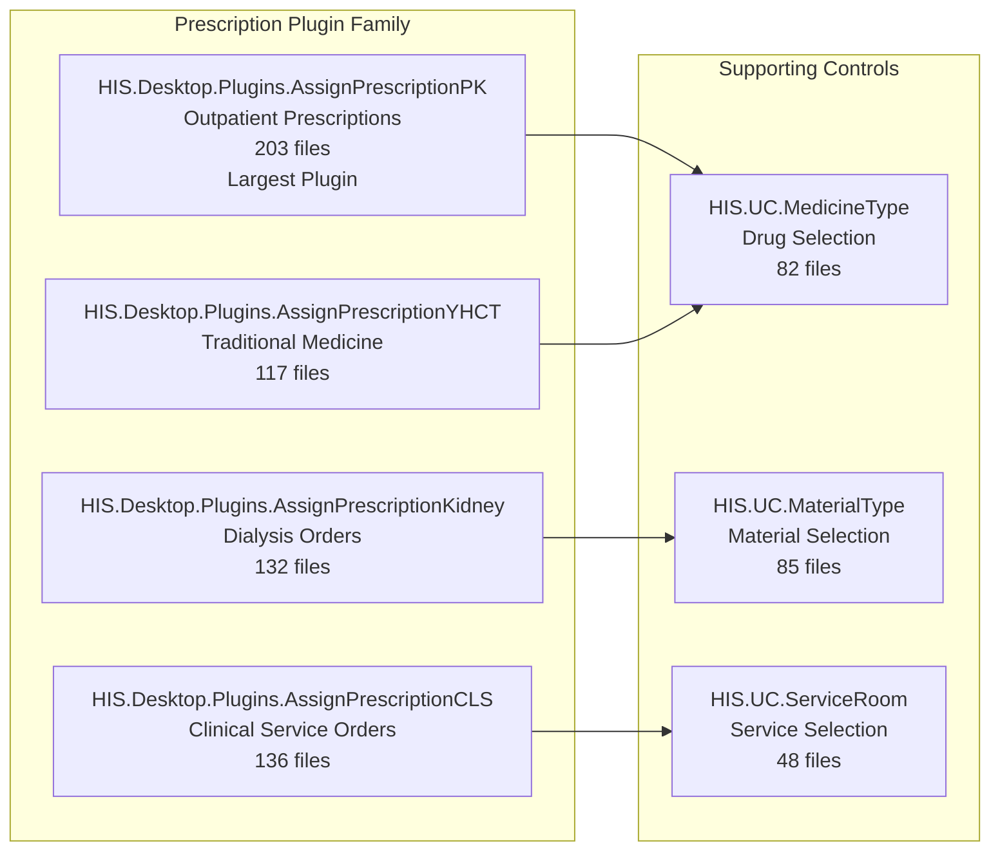

**Plugin Details:**

| Plugin | Files | Specialization | Key Features |
|--------|-------|----------------|--------------|
| `AssignPrescriptionPK` | 203 | Outpatient pharmacy | Drug selection, dosing, interaction checking, prescription printing |
| `AssignPrescriptionCLS` | 136 | Clinical lab/imaging services | Service ordering, sample collection, result tracking |
| `AssignPrescriptionKidney` | 132 | Hemodialysis | Dialysis schedules, machine assignment, treatment parameters |
| `AssignPrescriptionYHCT` | 117 | Traditional medicine | Herbal formulations, preparation methods |

**Prescription Workflow:**

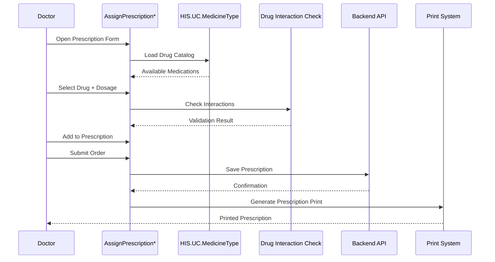

**Prescription Components:**

Each prescription plugin typically contains:
- **Run/** folder: Main execution logic and form initialization
- **ADO/** folder: Prescription-specific data objects
- **Base/** folder: Base classes and interfaces
- **Validation/** folder: Business rule validation
- **Print/** folder: Integration with MPS print system

The prescription plugins extensively use:
- `HIS.UC.MedicineInStock` - real-time inventory checking
- `HIS.UC.MaterialInStock` - consumable availability
- Drug interaction databases for clinical decision support
- Integration with pharmacy dispensing systems

Sources: [[`.devin/wiki.json:70-77`](../../../../.devin/wiki.json#L70-L77)](../../../../.devin/wiki.json#L70-L77)

## Patient Tracking and Monitoring Plugins

Tracking plugins provide longitudinal views of patient care and enable clinical surveillance.

**Tracking Plugin Structure:**

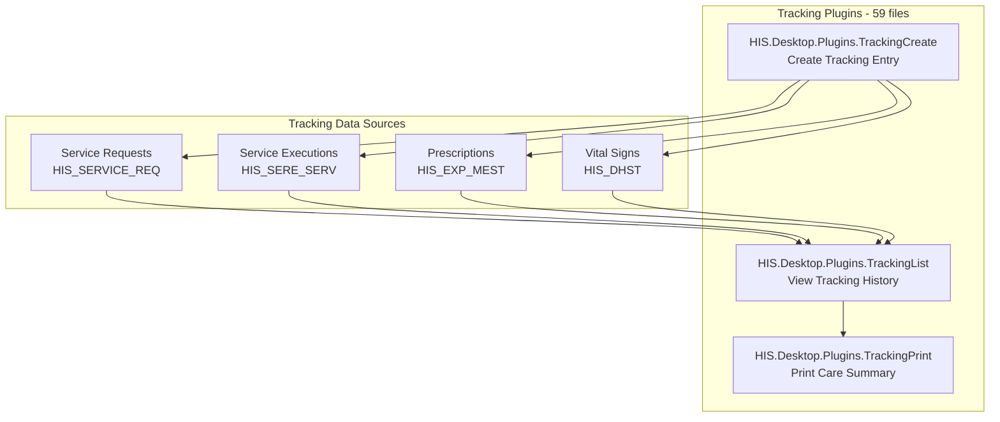

**Tracking Functions:**
- **Care Timeline**: Chronological view of all clinical events
- **Progress Notes**: Daily nursing and physician notes
- **Vital Sign Trends**: Graphical display of vital signs over time
- **Medication Administration Records**: Drug administration tracking
- **Care Plan Monitoring**: Track adherence to care protocols

Tracking plugins integrate with:
- `HIS.UC.TreatmentFinish` (94 files) - treatment summary generation
- `HIS.UC.PlusInfo` (147 files) - additional clinical information
- MPS print processors for tracking sheet generation

Sources: [[`.devin/wiki.json:70-77`](../../../../.devin/wiki.json#L70-L77)](../../../../.devin/wiki.json#L70-L77)

## Supporting Business Plugins

Beyond the core workflow plugins, numerous supporting plugins provide specialized functions:

**Specialty Area Plugins:**

| Category | Examples | Function |
|----------|----------|----------|
| Surgery | `HIS.Desktop.Plugins.SurgerySchedule` | Operating room scheduling and management |
| ICU | `HIS.Desktop.Plugins.IcuInfo` | Intensive care unit patient management |
| Obstetrics | `HIS.Desktop.Plugins.FetusBorn`, `HIS.Desktop.Plugins.FetusAbortion` | Maternal and fetal care |
| Emergency | `HIS.Desktop.Plugins.EmergencyWTime` | Emergency department workflow |
| Imaging | `HIS.Desktop.Plugins.HisImportDicom` | Medical imaging integration |

**Administrative Support Plugins:**

| Plugin | Purpose |
|--------|---------|
| `HIS.Desktop.Plugins.Appointment` | Appointment scheduling |
| `HIS.Desktop.Plugins.BedRoom` | Bed management |
| `HIS.Desktop.Plugins.RoomInfo` | Room configuration |
| `HIS.Desktop.Plugins.PatientInfo` | Patient information viewer |

Sources: [[`.devin/wiki.json:1-295`](../../../../.devin/wiki.json#L1-L295)](../../../../.devin/wiki.json#L1-L295)

## Inter-Plugin Communication Patterns

HIS core business plugins communicate using two primary mechanisms:

**1. DelegateRegister Pattern (Tight Coupling):**

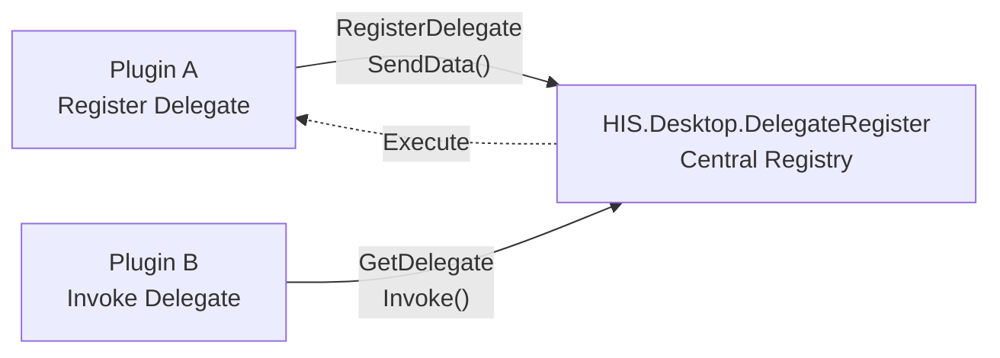

**2. PubSub Pattern (Loose Coupling):**

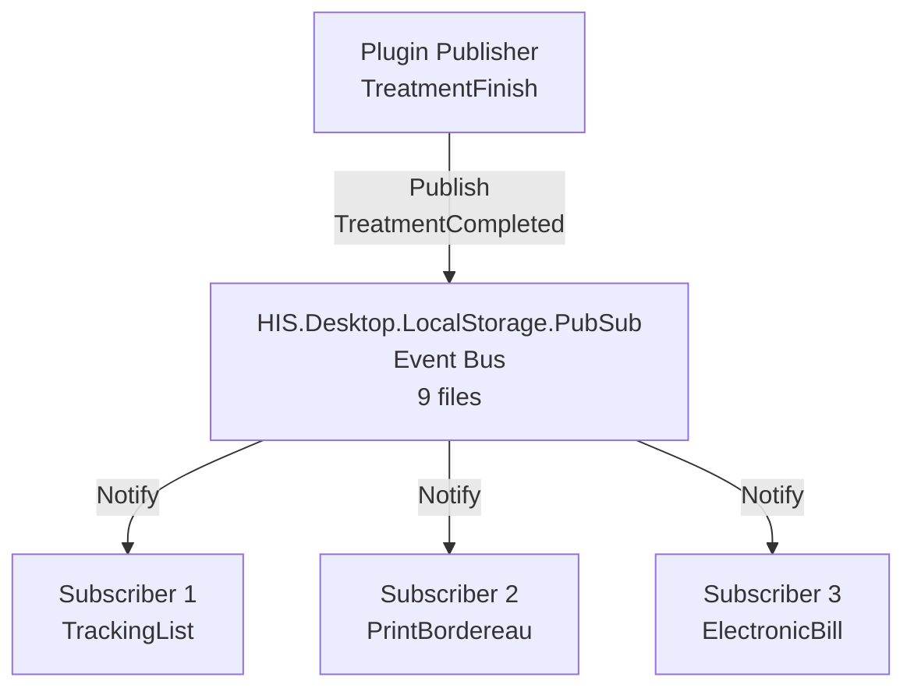

**Common Communication Events:**
- `PatientRegistered` - New patient admission
- `ExaminationComplete` - Exam service finished
- `PrescriptionCreated` - New medication order
- `TreatmentFinished` - Patient discharge
- `ServiceRequestUpdated` - Service status change

Plugins can:
- Register event handlers for specific domain events
- Publish events when state changes occur
- Invoke delegates for synchronous cross-plugin operations
- Access shared data through `HIS.Desktop.LocalStorage.BackendData` (69 files)

Sources: [[`.devin/wiki.json:60-68`](../../../../.devin/wiki.json#L60-L68)](../../../../.devin/wiki.json#L60-L68)

## Common Plugin Architecture Patterns

Most HIS core business plugins follow a consistent structure:

**Standard Plugin File Organization:**

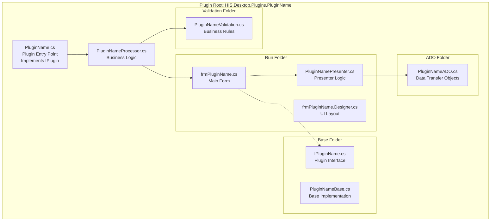

**Key Components:**

| Component | Purpose | Typical Location |
|-----------|---------|------------------|
| Plugin Entry | Implements `IPlugin` interface, registration point | [`[PluginName].cs`](../../../[PluginName].cs) |
| Processor | Core business logic, orchestrates operations | [`[PluginName]Processor.cs`](../../../[PluginName]Processor.cs) |
| Main Form | WinForms UI, typically DevExpress controls | [`Run/frm[PluginName].cs`](../../../Run/frm[PluginName].cs) |
| Presenter | MVP pattern presenter, separates UI from logic | [`Run/[PluginName]Presenter.cs`](../../../Run/[PluginName]Presenter.cs) |
| ADO | Plugin-specific data objects | [`ADO/*.cs`](../../../ADO/*.cs) |
| Validation | Business rule validation logic | [`Validation/*.cs`](../../../Validation/*.cs) |

**Typical Plugin Lifecycle:**

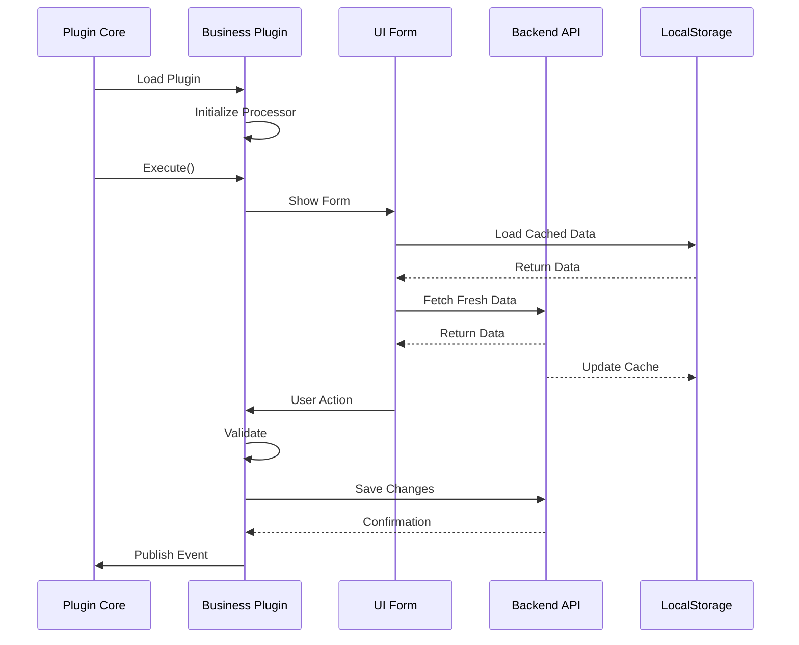

**Shared Dependencies:**

All HIS core business plugins typically reference:
- `HIS.Desktop.Common` - Common interfaces and base classes
- `HIS.Desktop.ADO` - Shared data models (74 files)
- `HIS.Desktop.Utility` - Helper functions (55 files)
- `HIS.Desktop.ApiConsumer` - Backend API client (13 files)
- `HIS.Desktop.LocalStorage.*` - Configuration and caching
- Multiple UC projects for reusable UI components
- DevExpress controls for rich UI elements
- `Inventec.Desktop.Core` - Plugin framework (208 files)

Sources: [[`.devin/wiki.json:34-43`](../../../../.devin/wiki.json#L34-L43)](../../../../.devin/wiki.json#L34-L43), [[`.devin/wiki.json:60-68`](../../../../.devin/wiki.json#L60-L68)](../../../../.devin/wiki.json#L60-L68)

## Integration with MPS Print System

HIS core business plugins extensively integrate with the MPS (Medical Print System) to generate clinical documents:

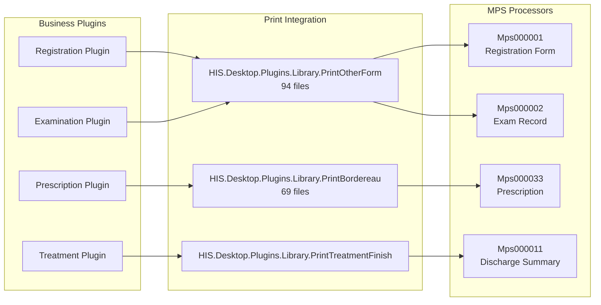

Each business plugin can trigger print operations for:
- Patient registration forms
- Examination records and reports
- Prescriptions and medication labels
- Treatment summaries and discharge papers
- Invoice and billing documents

The print library plugins (`HIS.Desktop.Plugins.Library.Print*`) serve as intermediaries, formatting data from business plugins into structures compatible with MPS print processors.

Sources: [[`.devin/wiki.json:170-178`](../../../../.devin/wiki.json#L170-L178)](../../../../.devin/wiki.json#L170-L178)

## Summary

HIS core business plugins implement the essential hospital workflows in the HisNguonMo system. The 600+ plugins in the `HIS.Desktop.Plugins.*` namespace represent:

- **Registration & Admission**: 81-102 files per major plugin
- **Examination & Services**: 119 files for `ServiceExecute`
- **Prescriptions**: 117-203 files, with `AssignPrescriptionPK` being the largest at 203 files
- **Treatment Management**: 56-101 files, with `TreatmentFinish` at 101 files
- **Patient Tracking**: 59 files for monitoring and surveillance

These plugins follow consistent architectural patterns:
- MVP (Model-View-Presenter) design pattern
- Plugin interface implementation
- Integration with shared UC components
- Communication via DelegateRegister and PubSub
- Backend API consumption through `HIS.Desktop.ApiConsumer`
- Print integration through MPS system

The modular design allows independent development and deployment of clinical features while maintaining system cohesion through well-defined interfaces and communication patterns.

Sources: [[`.devin/wiki.json:1-295`](../../../../.devin/wiki.json#L1-L295)](../../../../.devin/wiki.json#L1-L295), [[`Common/HIS.Common.Treatment/HIS.Common.Treatment/Calculation.cs:1-178`](../../../../Common/HIS.Common.Treatment/HIS.Common.Treatment/Calculation.cs#L1-L178)](../../../../Common/HIS.Common.Treatment/HIS.Common.Treatment/Calculation.cs#L1-L178)

# Transaction & Billing Plugins


## Purpose and Scope

This page documents the transaction and billing plugins within the HIS system, responsible for handling patient payments, deposit management, debt collection, invoice generation, and electronic billing integration. These plugins process financial transactions at various points in the patient care workflow, from registration deposits to final payment and electronic invoice transmission to tax authorities.

For information about core patient registration and treatment workflows, see [HIS Core Business Plugins](../../02-modules/his-desktop/business-plugins.md). For pharmacy and material inventory management, see [Medicine & Material Plugins](../../03-business-domains/pharmacy/medicine-material.md). For general plugin architecture patterns, see [Plugin System Architecture](../../01-architecture/plugin-system.md).

## Plugin Category Overview

The transaction and billing subsystem consists of approximately 20 specialized plugins organized into five functional categories:

| Category | Primary Plugins | File Count | Purpose |
|----------|----------------|------------|---------|
| Payment Transactions | `TransactionBill`, `TransactionBillKiosk` | 48, 36 | Process hospital fee payments at cashier and kiosk stations |
| Deposit Management | `TransactionDeposit`, `DepositRequest` | ~30, 30 | Handle patient deposits and prepayments |
| Debt Collection | `TransactionDebt`, `TransactionDebtCollect` | ~39 | Manage outstanding balances and debt recovery |
| Invoice Generation | `InvoiceCreate`, `EInvoiceCreate`, `ElectronicBillTotal` | ~40+ | Create and manage invoices, including electronic invoices |
| Pharmacy Cashier | `PharmacyCashier` | 31 | Process medication sales at pharmacy counters |

**Sources:** [HIS/Plugins/HIS.Desktop.Plugins.TransactionBill](), [HIS/Plugins/HIS.Desktop.Plugins.TransactionBillKiosk](), [HIS/Plugins/HIS.Desktop.Plugins.TransactionDebtCollect](), [HIS/Plugins/HIS.Desktop.Plugins.PharmacyCashier](), [HIS/Plugins/HIS.Desktop.Plugins.DepositRequest]()

## System Architecture

### Transaction Processing Flow

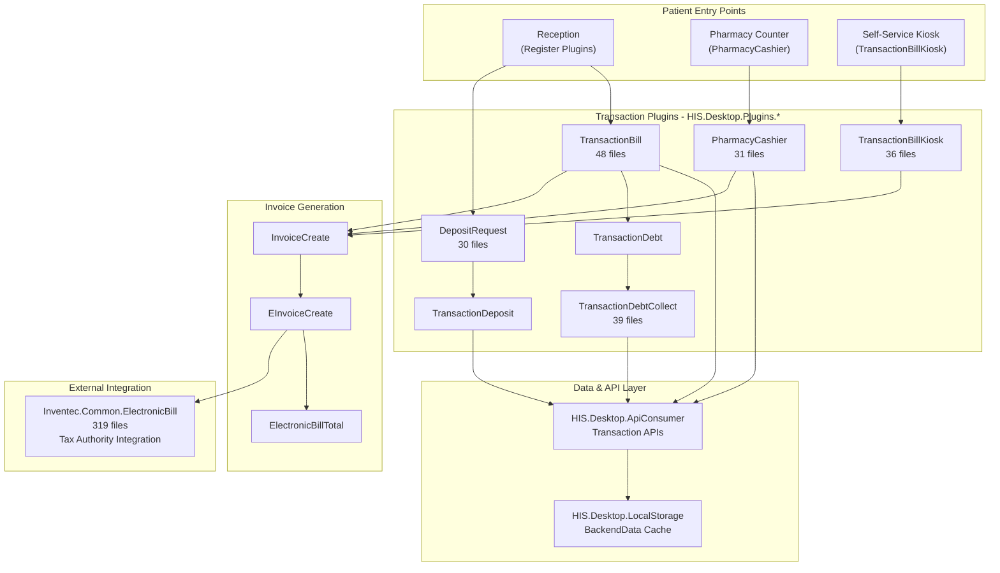

**Sources:** [HIS/Plugins/HIS.Desktop.Plugins.TransactionBill](), [HIS/Plugins/HIS.Desktop.Plugins.TransactionBillKiosk](), [HIS/Plugins/HIS.Desktop.Plugins.TransactionDeposit](), [HIS/Plugins/HIS.Desktop.Plugins.DepositRequest](), [HIS/Plugins/HIS.Desktop.Plugins.PharmacyCashier](), [HIS/Plugins/HIS.Desktop.Plugins.InvoiceCreate](), [HIS/Plugins/HIS.Desktop.Plugins.EInvoiceCreate](), [HIS/Desktop/HIS.Desktop.ApiConsumer](), [Common/Inventec.Common/Inventec.Common.ElectronicBill]()

### Plugin Communication Pattern

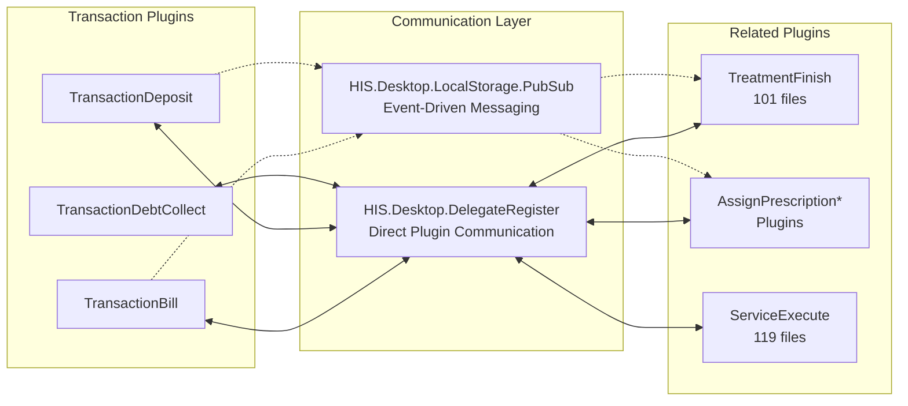

**Sources:** [HIS/Desktop/HIS.Desktop.Common/DelegateRegister](), [HIS/Desktop/HIS.Desktop.LocalStorage.PubSub](), [HIS/Plugins/HIS.Desktop.Plugins.TransactionBill](), [HIS/Plugins/HIS.Desktop.Plugins.TreatmentFinish]()

## Core Transaction Plugins

### TransactionBill Plugin (48 files)

The `TransactionBill` plugin is the primary cashier interface for processing hospital fee payments at reception desks and payment counters. This is the most comprehensive transaction plugin, handling complex payment scenarios including partial payments, insurance co-payments, and multi-service billing.

**Key Components:**

| Component | Purpose |
|-----------|---------|
| `TransactionBillProcessor` | Main payment processing logic |
| `frmTransactionBill` | Primary cashier UI form |
| `TransactionBillBehavior` | Business rule validation |
| ADO Models | Data transfer objects for transaction data |
| Run/ folder | Plugin entry point and initialization |

**Typical Workflow:**
1. Cashier selects patient treatment or service record
2. System calculates total charges from `ServiceExecute` records
3. Plugin displays itemized billing with insurance deductions
4. Cashier processes payment (cash, card, or mixed)
5. System generates receipt and updates patient balance
6. Triggers invoice creation if required

**Sources:** [HIS/Plugins/HIS.Desktop.Plugins.TransactionBill]()

### TransactionBillKiosk Plugin (36 files)

The `TransactionBillKiosk` plugin provides a simplified, touch-screen interface for self-service payment kiosks. It implements a subset of `TransactionBill` functionality optimized for patient self-service with minimal staff intervention.

**Kiosk-Specific Features:**
- Simplified UI with larger touch targets
- QR code payment integration
- Automatic receipt printing
- Patient verification via ID card or QR code
- Limited transaction types (final payments only, no partial payments)

**Integration Points:**
- Shares backend API calls with `TransactionBill`
- Uses same payment processing engine
- Integrates with peripheral hardware (card readers, printers, ID scanners)

**Sources:** [HIS/Plugins/HIS.Desktop.Plugins.TransactionBillKiosk]()

### PharmacyCashier Plugin (31 files)

The `PharmacyCashier` plugin handles point-of-sale transactions at hospital pharmacy counters, processing both dispensed prescriptions and over-the-counter medication sales.

**Pharmacy-Specific Processing:**
- Validates prescription approval before payment
- Checks medication inventory availability
- Calculates insurance coverage for medications
- Generates pharmacy-specific receipts with medication instructions
- Updates medication inventory via `ExpMest*` plugin integration

**Data Flow:**
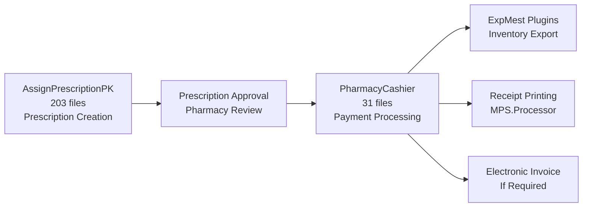

**Sources:** [HIS/Plugins/HIS.Desktop.Plugins.PharmacyCashier](), [HIS/Plugins/HIS.Desktop.Plugins.AssignPrescriptionPK]()

## Deposit and Debt Management

### Deposit Management Plugins

The deposit system uses two primary plugins working in tandem:

**DepositRequest Plugin (30 files)**
- Creates deposit requests during registration or admission
- Allows staff to specify required deposit amounts
- Generates deposit request documents
- Routes requests to payment processing

**TransactionDeposit Plugin**
- Processes actual deposit payments
- Tracks deposit balances by treatment
- Handles deposit refunds at discharge
- Applies deposits to final billing

**Deposit Workflow:**
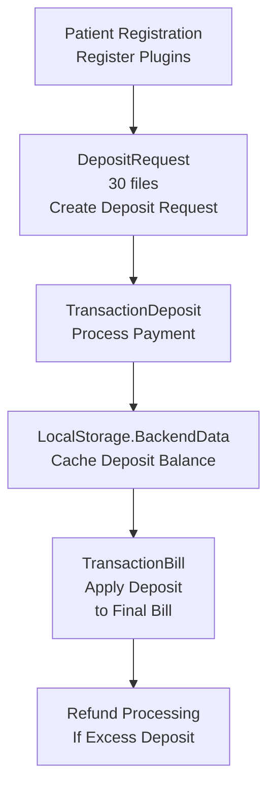

**Sources:** [HIS/Plugins/HIS.Desktop.Plugins.DepositRequest](), [HIS/Plugins/HIS.Desktop.Plugins.TransactionDeposit](), [HIS/Desktop/HIS.Desktop.LocalStorage.BackendData]()

### Debt Collection Plugins

**TransactionDebt Plugin**
- Tracks unpaid balances from completed treatments
- Records partial payments on outstanding debts
- Maintains debt aging reports
- Flags patients with outstanding balances

**TransactionDebtCollect Plugin (39 files)**
- Provides dedicated interface for debt collection activities
- Allows batch processing of debt payments
- Generates debt collection reports
- Supports payment plans and installment tracking

**Debt Management Features:**
- Automatic debt creation when patient leaves with unpaid balance
- Integration with patient registration (blocks new admissions if configured)
- Debt aging analysis
- Collection activity tracking
- Payment history by debt account

**Sources:** [HIS/Plugins/HIS.Desktop.Plugins.TransactionDebt](), [HIS/Plugins/HIS.Desktop.Plugins.TransactionDebtCollect]()

## Invoice Generation and Electronic Billing

### Invoice Plugin Architecture

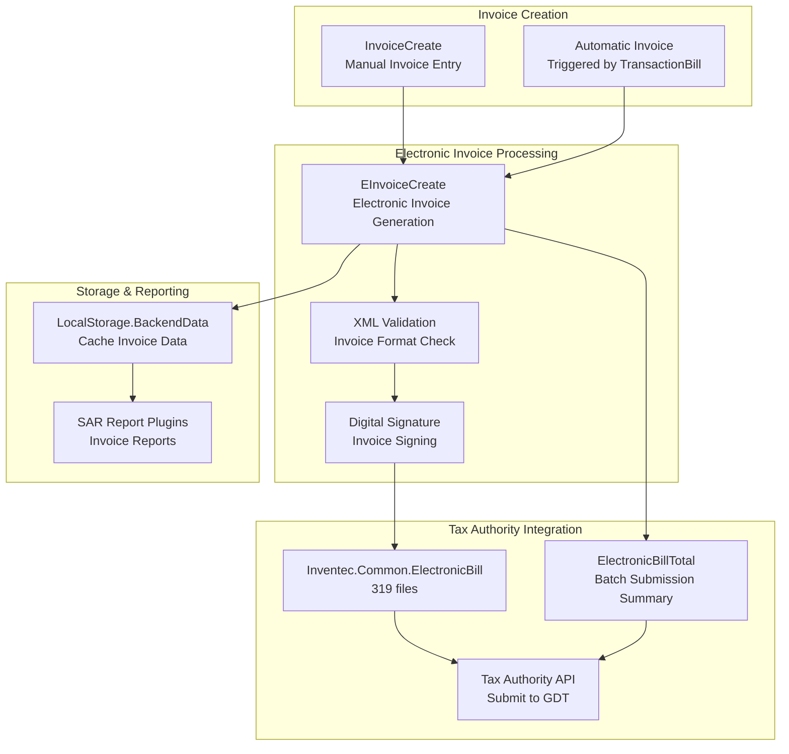

**Sources:** [HIS/Plugins/HIS.Desktop.Plugins.InvoiceCreate](), [HIS/Plugins/HIS.Desktop.Plugins.EInvoiceCreate](), [HIS/Plugins/HIS.Desktop.Plugins.Library.ElectronicBill](), [Common/Inventec.Common/Inventec.Common.ElectronicBill]()

### InvoiceCreate Plugin

The `InvoiceCreate` plugin provides manual invoice creation and management capabilities:

- **Manual Invoice Entry**: Staff can create invoices for services not processed through standard payment flow
- **Invoice Templates**: Supports multiple invoice formats (VAT, non-VAT, simplified)
- **Batch Invoicing**: Create multiple invoices for recurring services
- **Invoice Corrections**: Handle invoice cancellations and adjustments
- **Print Integration**: Generates invoice printouts via MPS system

**Sources:** [HIS/Plugins/HIS.Desktop.Plugins.InvoiceCreate]()

### EInvoiceCreate Plugin

The `EInvoiceCreate` plugin manages electronic invoice generation and submission to Vietnam's General Department of Taxation (GDT):

**Electronic Invoice Process:**
1. **Data Collection**: Gathers transaction data from `TransactionBill` or `InvoiceCreate`
2. **XML Generation**: Formats data per Ministry of Finance specifications
3. **Validation**: Validates XML against official schema
4. **Digital Signing**: Applies hospital's digital certificate
5. **Submission**: Transmits to tax authority via `Inventec.Common.ElectronicBill`
6. **Acknowledgment**: Receives and stores tax authority confirmation code

**Key Features:**
- Real-time invoice submission
- Batch processing for high-volume periods
- Automatic retry on submission failures
- Invoice lookup by tax code
- Electronic invoice cancellation workflow

**Sources:** [HIS/Plugins/HIS.Desktop.Plugins.EInvoiceCreate](), [Common/Inventec.Common/Inventec.Common.ElectronicBill]()

### ElectronicBillTotal Plugin

The `ElectronicBillTotal` plugin provides summary and reporting capabilities for electronic invoice submissions:

- Aggregates daily/monthly electronic invoice statistics
- Tracks submission success/failure rates
- Generates reports for tax compliance auditing
- Provides dashboard of electronic billing status
- Facilitates batch resubmission of failed invoices

**Sources:** [HIS/Plugins/HIS.Desktop.Plugins.Library.ElectronicBillTotal]()

### Inventec.Common.ElectronicBill Library (319 files)

This is the largest component in the `Inventec.Common` utilities, providing comprehensive electronic billing infrastructure:

**Library Components:**

| Component | Purpose |
|-----------|---------|
| XML Serialization | Convert transaction data to tax authority XML format |
| Schema Validation | Validate against Ministry of Finance XML schemas |
| Digital Signature | Sign invoices with hospital certificate |
| API Client | HTTP communication with tax authority servers |
| Error Handling | Process and classify submission errors |
| Invoice Storage | Cache submitted invoices locally |

**Supported Invoice Types:**
- VAT invoices (Hóa đơn GTGT)
- Sales invoices (Hóa đơn bán hàng)
- Service invoices (Hóa đơn dịch vụ)
- Adjustment invoices (Hóa đơn điều chỉnh)

**Sources:** [Common/Inventec.Common/Inventec.Common.ElectronicBill]()

## Plugin Structure and Development Patterns

### Standard Transaction Plugin Structure

All transaction plugins follow a consistent structural pattern:

```
HIS.Desktop.Plugins.TransactionXxx/
├── Run/
│   ├── TransactionXxxProcessor.cs          # Main processor class
│   └── TransactionXxxBehavior.cs           # Behavior implementation
├── ADO/
│   ├── TransactionXxxADO.cs                # Data transfer objects
│   └── TransactionXxxInputADO.cs           # Input parameters
├── Base/
│   ├── TransactionXxxBase.cs               # Base classes
│   └── TransactionXxxValidator.cs          # Validation logic
├── frmTransactionXxx.cs                     # Main UI form
├── frmTransactionXxx.Designer.cs            # Generated designer code
├── UCTransactionXxx.cs                      # User controls (if applicable)
└── Properties/
    └── Resources.resx                       # Localization resources
```

**Sources:** [HIS/Plugins/HIS.Desktop.Plugins.TransactionBill](), [HIS/Plugins/HIS.Desktop.Plugins.TransactionDeposit]()

### Common Base Classes and Interfaces

Transaction plugins typically implement or inherit from:

| Interface/Class | Purpose | Location |
|----------------|---------|----------|
| `IModule` | Plugin lifecycle interface | `Inventec.Desktop.Core` |
| `FormBase` | Base form with common UI features | `HIS.Desktop.Utility` |
| `ApiConsumerBase` | API communication base | `HIS.Desktop.ApiConsumer` |
| `ValidationRule` | Input validation framework | `DevExpress.XtraEditors.DXErrorProvider` |

**Sources:** [Common/Inventec.Desktop/Inventec.Desktop.Core](), [HIS/Desktop/HIS.Desktop.Utility](), [HIS/Desktop/HIS.Desktop.ApiConsumer]()

## API Integration

### Transaction API Endpoints

Transaction plugins communicate with backend services through `HIS.Desktop.ApiConsumer`:

**Common API Calls:**

```
ApiConsumer/
├── TransactionApiConsumer.cs
│   ├── GetTransaction()              # Retrieve transaction by ID
│   ├── CreateTransaction()           # Create new transaction
│   ├── UpdateTransaction()           # Update existing transaction
│   ├── DeleteTransaction()           # Cancel transaction
│   └── GetTransactionByTreatment()  # Get all transactions for treatment
│
├── DepositApiConsumer.cs
│   ├── CreateDeposit()               # Process deposit payment
│   ├── RefundDeposit()               # Refund excess deposit
│   └── GetDepositsByTreatment()     # Query deposit balance
│
└── InvoiceApiConsumer.cs
    ├── CreateInvoice()               # Generate invoice
    ├── CancelInvoice()               # Cancel invoice
    └── SubmitElectronicInvoice()    # Submit to tax authority
```

**Sources:** [HIS/Desktop/HIS.Desktop.ApiConsumer]()

### Response Handling and Caching

Transaction data is cached locally for offline operation and performance:

**Caching Strategy:**
- Recent transactions cached in `HIS.Desktop.LocalStorage.BackendData`
- Cache invalidation on successful API updates
- Offline queue for failed submissions with automatic retry
- Redis cache integration for multi-user scenarios via `Inventec.Common.RedisCache`

**Sources:** [HIS/Desktop/HIS.Desktop.LocalStorage.BackendData](), [Common/Inventec.Common/Inventec.Common.RedisCache]()

## Print Integration

Transaction plugins integrate with the MPS (Medical Print System) to generate receipts and financial documents:

### Common Print Templates

| Template ID | Purpose | Triggered By |
|-------------|---------|--------------|
| Mps000102 | Payment Receipt | `TransactionBill`, `TransactionBillKiosk` |
| Mps000106 | Deposit Receipt | `TransactionDeposit` |
| Mps000112 | Invoice | `InvoiceCreate` |
| Mps000129 | Debt Collection Receipt | `TransactionDebtCollect` |
| Mps000256 | Pharmacy Sales Receipt | `PharmacyCashier` |

**Print Invocation Pattern:**
```
Transaction Plugin
  → Prepare print data (PDO object)
  → Call MPS.Processor.MpsXXXXXX
  → Generate FlexCell template
  → Output to printer or PDF
```

**Sources:** [MPS/MPS.Processor](), [MPS/MPS.ProcessorBase](), [HIS/Plugins/HIS.Desktop.Plugins.TransactionBill]()

## Configuration and Customization

### Transaction Configuration Keys

Transaction behavior is controlled through system configuration stored in `HIS.Desktop.LocalStorage.HisConfig`:

**Key Configuration Options:**

| Config Key | Purpose | Plugin Impact |
|-----------|---------|---------------|
| `ALLOW_NEGATIVE_BALANCE` | Allow treatments with negative balance | `TransactionBill` |
| `AUTO_CREATE_EINVOICE` | Automatically generate e-invoices | `EInvoiceCreate` |
| `REQUIRE_DEPOSIT_AMOUNT` | Minimum deposit required | `DepositRequest` |
| `DEBT_COLLECTION_LIMIT` | Maximum outstanding debt before blocking | `TransactionDebt` |
| `KIOSK_PAYMENT_METHODS` | Allowed payment methods at kiosk | `TransactionBillKiosk` |

**Sources:** [HIS/Desktop/HIS.Desktop.LocalStorage.HisConfig](), [HIS/Desktop/HIS.Desktop.LocalStorage.SdaConfigKey]()

## Security and Permissions

Transaction plugins implement role-based access control through the ACS (Access Control System):

**Required Permissions:**

| Plugin | Required Module | Required Action |
|--------|----------------|-----------------|
| `TransactionBill` | `HIS.Desktop.Plugins.TransactionBill` | `CREATE`, `UPDATE`, `DELETE` |
| `TransactionDeposit` | `HIS.Desktop.Plugins.TransactionDeposit` | `CREATE`, `REFUND` |
| `TransactionDebtCollect` | `HIS.Desktop.Plugins.TransactionDebtCollect` | `CREATE`, `VIEW_HISTORY` |
| `EInvoiceCreate` | `HIS.Desktop.Plugins.EInvoiceCreate` | `CREATE`, `CANCEL`, `SUBMIT` |

**Audit Logging:**
- All financial transactions logged via `Inventec.Desktop.Plugins.EventLog`
- User actions tracked in `HIS.Desktop.LocalStorage.BackendData`
- Electronic invoice submissions logged to tax authority systems

**Sources:** [HIS/Plugins/ACS.Desktop.Plugins](), [Common/Inventec.Desktop/Inventec.Desktop.Plugins.EventLog]()

## Error Handling and Recovery

### Common Error Scenarios

Transaction plugins implement comprehensive error handling for financial operation safety:

**Error Categories:**

1. **Validation Errors**
   - Insufficient deposit balance
   - Invalid insurance coverage data
   - Missing required patient information
   - Blocked by outstanding debt

2. **API Communication Errors**
   - Backend service unavailable
   - Network timeout
   - Authentication failures
   - Transaction already processed

3. **Electronic Invoice Errors**
   - XML validation failures
   - Digital signature errors
   - Tax authority rejection
   - Certificate expiration

4. **Printing Errors**
   - Printer offline
   - Template missing
   - PDF generation failure

**Recovery Mechanisms:**
- Automatic API retry with exponential backoff
- Offline transaction queuing
- Manual transaction resubmission interface
- Transaction rollback on critical failures

**Sources:** [HIS/Desktop/HIS.Desktop.ApiConsumer](), [HIS/Plugins/HIS.Desktop.Plugins.EInvoiceCreate]()

## Related Documentation

For additional context on transaction and billing plugins:

- **[Plugin System Architecture](../../01-architecture/plugin-system.md)**: General plugin patterns and communication
- **[HIS Core Business Plugins](../../02-modules/his-desktop/business-plugins.md)**: Treatment and service execution workflows that generate billing data
- **[Medicine & Material Plugins](../../03-business-domains/pharmacy/medicine-material.md)**: Pharmacy inventory integration with `PharmacyCashier`
- **[MPS Print System](../../02-modules/his-desktop/business-plugins.md#mps-print)**: Receipt and invoice printing templates
- **[Inventec Common Utilities](../../02-modules/common-libraries/libraries.md#inventec-common)**: Electronic billing library and payment processing utilities