## Purpose and Scope

HIS Desktop Core is the main entry point and application host for the HisNguonMo Hospital Information System. This document covers the core desktop application structure located in `HIS/HIS.Desktop/`, including application initialization, session management, plugin loading mechanisms, and the foundational projects that support the 956+ business plugins.

**Related Pages:**
- For plugin architecture details and individual plugin categories, see [Plugin System Architecture](../../01-architecture/plugin-system.md)
- For LocalStorage, configuration, and caching systems, see [LocalStorage & Configuration](../../02-modules/his-desktop/core.md)
- For API communication layer, see [API Consumer Layer](#1.1.2)
- For data models, see [Data Models & ADO](#1.1.4)

## Project Structure Overview

HIS Desktop Core consists of multiple interconnected projects that form the foundation layer for the entire application:

| Project | Files | Purpose |
|---------|-------|---------|
| `HIS.Desktop` | 83 | Main application entry point, initialization, main form |
| `HIS.Desktop.ADO` | 74 | Active Data Objects - data models for UI layer |
| `HIS.Desktop.Utility` | 55 | Helper functions and utility classes |
| `HIS.Desktop.Common` | varies | Shared interfaces, base classes, constants |
| `HIS.Desktop.ApiConsumer` | 13 | REST API client wrappers |
| `HIS.Desktop.LocalStorage.*` | varies | Configuration and caching subsystems |
| `HIS.Desktop.Notify` | 25 | Notification system |
| `HIS.Desktop.IsAdmin` | - | Admin privilege checking |
| `HIS.Desktop.DelegateRegister` | - | Plugin communication registry |

**Architecture Pattern:** The HIS Desktop Core follows a layered plugin-host architecture where the core provides infrastructure services (API communication, caching, session management) and a plugin loader that discovers and initializes business logic plugins.

Sources: [[`.devin/wiki.json:35-43`](../../../../.devin/wiki.json#L35-L43)](../../../../.devin/wiki.json#L35-L43)

## HIS Desktop Core Architecture

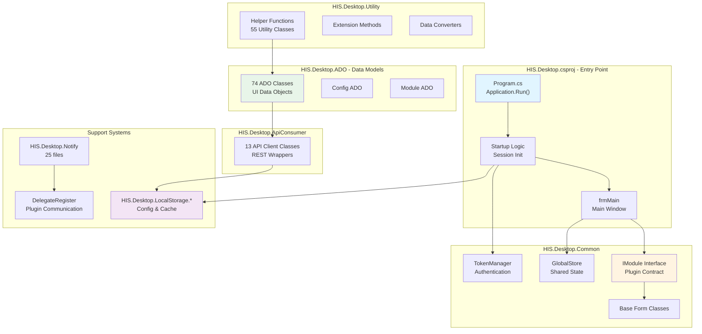

This diagram shows the core project dependencies. [[`HIS.Desktop.csproj`](../../../../HIS.Desktop.csproj)](../../../../HIS.Desktop.csproj) is the executable entry point that initializes the session and main form. `HIS.Desktop.Common` defines the plugin contract (`IModule` interface) that all plugins implement. `HIS.Desktop.ADO` provides 74 data model classes for the UI layer. `HIS.Desktop.ApiConsumer` wraps backend REST API calls. Supporting systems handle configuration, caching, and inter-plugin communication.

Sources: [[`.devin/wiki.json:35-43`](../../../../.devin/wiki.json#L35-L43)](../../../../.devin/wiki.json#L35-L43)

## Application Entry Point

### Program.cs and Application Startup

The [[`HIS.Desktop.csproj`](../../../../HIS.Desktop.csproj)](../../../../HIS.Desktop.csproj) project contains the [[`Program.cs`](../../../Program.cs)](../../../Program.cs) file which serves as the application entry point using the standard WinForms `Application.Run()` pattern.

**Key Initialization Steps:**
1. **Assembly loading** - Load required assemblies and dependencies
2. **Configuration loading** - Initialize configuration from `HIS.Desktop.LocalStorage.ConfigApplication` and `HIS.Desktop.LocalStorage.ConfigSystem`
3. **Authentication** - Establish session through login form, obtain authentication token
4. **Backend data cache** - Populate `HIS.Desktop.LocalStorage.BackendData` (69 files) with reference data from backend
5. **Plugin discovery** - Scan and register available plugins
6. **Main form display** - Show `frmMain` as the application shell

### Main Form (frmMain)

The main form acts as the application shell that hosts plugin content. It typically includes:
- Menu bar with dynamically loaded plugin menu items
- Tab control or MDI container for plugin windows
- Status bar showing session information
- Notification area for system messages

The main form communicates with plugins through the `HIS.Desktop.Common.IModule` interface and uses `HIS.Desktop.DelegateRegister` for cross-plugin communication.

Sources: [[`.devin/wiki.json:35-43`](../../../../.devin/wiki.json#L35-L43)](../../../../.devin/wiki.json#L35-L43)

## HIS.Desktop.Common - Shared Foundation

`HIS.Desktop.Common` contains shared interfaces, base classes, and constants used throughout the application and all plugins.

### Core Components

| Component Type | Purpose | Examples |
|----------------|---------|----------|
| **Interfaces** | Plugin contracts | `IModule` - plugin entry point interface |
| **Base Classes** | Form inheritance | Base forms with common functionality |
| **Constants** | System-wide values | Message codes, configuration keys |
| **Enums** | Type definitions | Status enums, action types |
| **GlobalStore** | Application state | Shared state accessible to all plugins |

### IModule Interface

The `IModule` interface is the fundamental contract that all plugins must implement:

```
IModule interface defines:
- Plugin metadata (name, version, room type)
- Execute() method for plugin activation
- Resource handling and disposal
```

Plugins are discovered and loaded based on this interface through reflection by the plugin loader system.

### GlobalStore Pattern

`GlobalStore` provides a centralized location for application-wide state including:
- Current logged-in user information
- Current branch/facility
- Current working room
- System configuration values

Plugins access `GlobalStore` to retrieve context information needed for their operations.

Sources: [[`.devin/wiki.json:35-43`](../../../../.devin/wiki.json#L35-L43)](../../../../.devin/wiki.json#L35-L43)

## HIS.Desktop.ADO - Data Models

`HIS.Desktop.ADO` contains 74 Active Data Object (ADO) classes that serve as data models for the UI layer. These are distinct from backend entity models and are optimized for UI binding and display.

### ADO Design Pattern

ADO classes in this project follow these patterns:
- **UI-optimized structure** - Fields arranged for grid/form binding
- **Calculated properties** - Derived values for display (e.g., full name from first/last name)
- **Validation attributes** - Data annotations for input validation
- **Conversion methods** - Transform backend DTOs to ADO objects

### Common ADO Categories

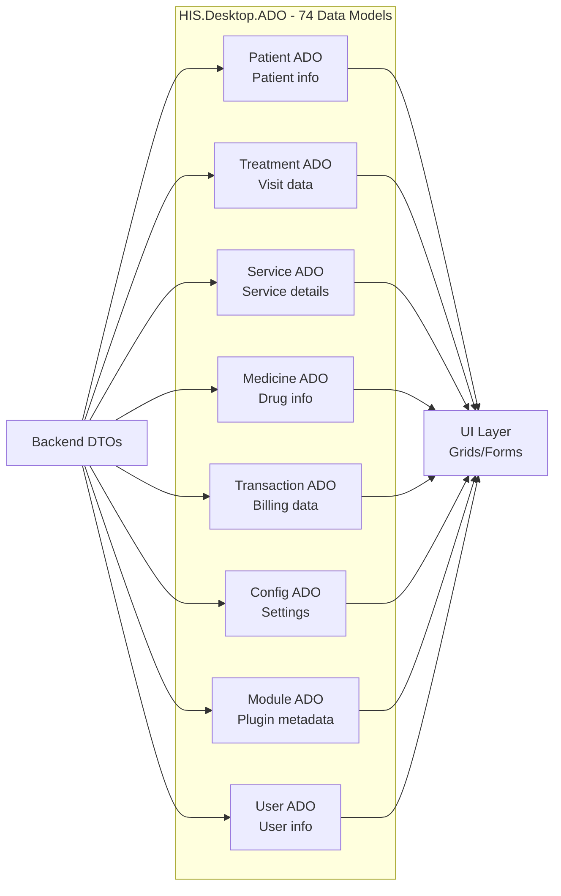

ADO classes act as an adapter layer between backend DTOs and UI components. They include display-specific logic like formatting, concatenation, and status derivation.

### Example ADO Usage

ADO objects are typically:
1. Created by `HIS.Desktop.ApiConsumer` classes after API calls
2. Stored in `HIS.Desktop.LocalStorage.BackendData` for caching
3. Bound to DevExpress grid controls in plugins
4. Modified by user interaction in forms
5. Converted back to backend DTOs for API updates

Sources: [[`.devin/wiki.json:35-43`](../../../../.devin/wiki.json#L35-L43)](../../../../.devin/wiki.json#L35-L43)

## HIS.Desktop.Utility - Helper Functions

`HIS.Desktop.Utility` contains 55 utility classes providing helper functions used throughout the application.

### Utility Categories

| Category | Purpose | Common Methods |
|----------|---------|----------------|
| **Data Converters** | Type conversions | String to decimal, date parsing |
| **Format Helpers** | Display formatting | Currency format, date/time display |
| **Validation** | Input validation | Phone number, email, ID card validation |
| **File Operations** | File handling | PDF export, Excel import/export |
| **Print Helpers** | Printing utilities | Print preview, printer selection |
| **Extension Methods** | Type extensions | String extensions, collection helpers |

### Common Patterns

Utility classes typically provide static methods that can be called from any plugin:

```
Example utility usage patterns:
- GlobalUtil.FormatCurrency(amount)
- DateTimeHelper.ConvertToDisplay(date)
- ValidationHelper.IsValidPhoneNumber(phone)
- FileHelper.ExportToExcel(data, path)
```

These utilities eliminate code duplication across the 956 plugins and ensure consistent behavior for common operations.

Sources: [[`.devin/wiki.json:35-43`](../../../../.devin/wiki.json#L35-L43)](../../../../.devin/wiki.json#L35-L43)

## HIS.Desktop.ApiConsumer - REST API Layer

`HIS.Desktop.ApiConsumer` contains 13 API client wrapper classes that abstract backend REST API communication. For detailed information, see [API Consumer Layer](#1.1.2).

### API Consumer Structure

Each API consumer class corresponds to a backend service domain:

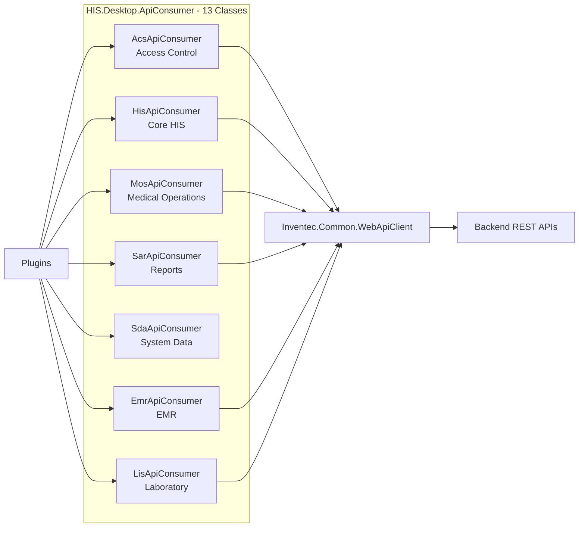

Each consumer provides strongly-typed methods for API endpoints, handles serialization/deserialization, and manages authentication tokens.

Sources: [[`.devin/wiki.json:55-58`](../../../../.devin/wiki.json#L55-L58)](../../../../.devin/wiki.json#L55-L58)

## Application Initialization Flow

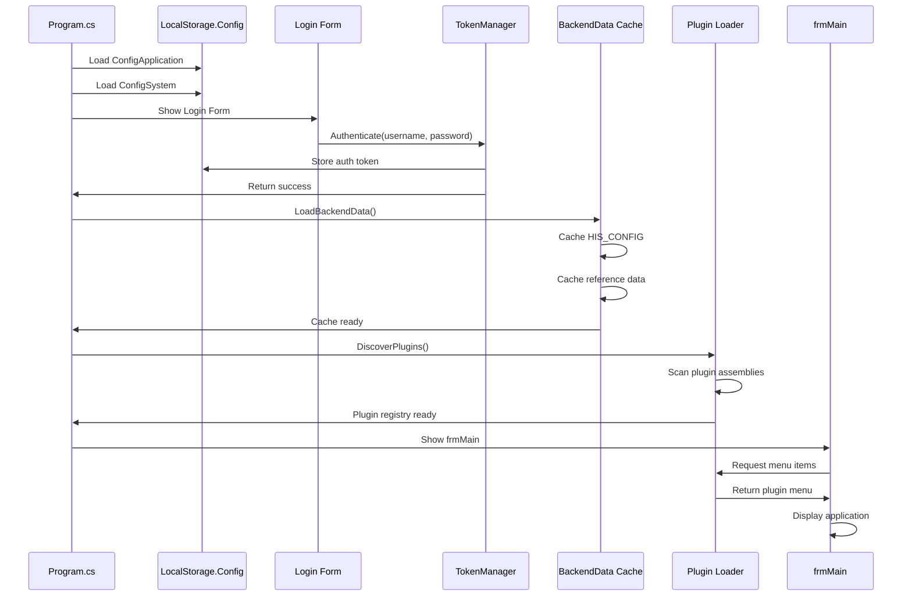

This sequence shows the startup flow from application launch to main form display. Configuration is loaded first, then authentication establishes a session, backend data is cached, plugins are discovered, and finally the main form is displayed.

**Key Points:**
1. Configuration must be loaded before login
2. Authentication token is required for all API calls
3. Backend data caching happens once at startup
4. Plugin discovery uses reflection to find `IModule` implementations
5. Main form dynamically builds menu from plugin registry

Sources: [[`.devin/wiki.json:35-43`](../../../../.devin/wiki.json#L35-L43)](../../../../.devin/wiki.json#L35-L43)

## Session Management

### Authentication Flow

Session management is handled through several components:

| Component | Responsibility |
|-----------|---------------|
| `TokenManager` | Stores and refreshes authentication token |
| `GlobalStore.UserAccount` | Current user information |
| `GlobalStore.HisBranch` | Current facility/branch |
| `GlobalStore.HisDepartment` | Current working department |
| `GlobalStore.HisRoom` | Current working room |

### Token Storage and Refresh

The authentication token is:
1. Obtained during login via `HIS.Desktop.ApiConsumer` authentication API
2. Stored in `TokenManager` 
3. Included in all subsequent API requests via `Inventec.Common.WebApiClient`
4. Automatically refreshed when approaching expiration
5. Cleared on logout or session timeout

### Session Context

Plugins access session context through `GlobalStore`:

```
Access patterns in plugins:
- var user = GlobalStore.UserAccount
- var branch = GlobalStore.HisBranch  
- var room = GlobalStore.HisRoom
```

This context determines what data and actions are available to the current user based on their role, department, and room assignment.

Sources: [[`.devin/wiki.json:35-43`](../../../../.devin/wiki.json#L35-L43)](../../../../.devin/wiki.json#L35-L43)

## Plugin Loading Mechanism

### Plugin Discovery Process

The plugin loader system discovers plugins through the following steps:

1. **Assembly Scanning** - Scan `HIS/Plugins/` directory for DLL files
2. **Interface Detection** - Use reflection to find classes implementing `IModule`
3. **Metadata Extraction** - Read plugin attributes (name, room type, module type)
4. **Dependency Resolution** - Verify plugin dependencies are available
5. **Registration** - Add plugin to internal registry with metadata

### Plugin Lifecycle

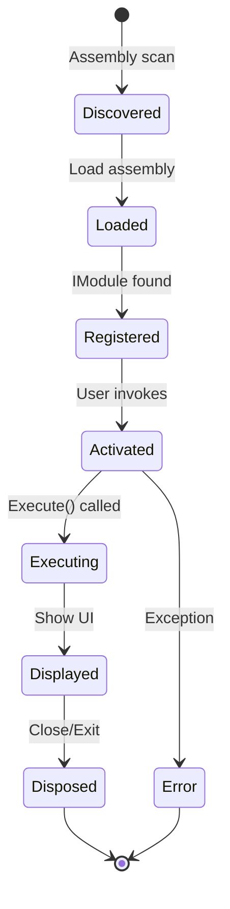

**Plugin States:**
- **Discovered** - DLL found in plugins directory
- **Loaded** - Assembly loaded into AppDomain
- **Registered** - Metadata stored, ready to activate
- **Activated** - Instance created by plugin loader
- **Executing** - `IModule.Execute()` method running
- **Displayed** - Plugin UI shown to user
- **Disposed** - Resources released, form closed

### Plugin Activation

When a user clicks a menu item or requests a plugin:

1. Plugin loader retrieves plugin metadata from registry
2. Creates new instance of plugin class via reflection
3. Calls `IModule.Execute()` passing module data
4. Plugin displays its UI (form, user control, etc.)
5. Plugin interacts with backend via `ApiConsumer`
6. Plugin communicates with other plugins via `DelegateRegister` or `PubSub`

Sources: [[`.devin/wiki.json:59-68`](../../../../.devin/wiki.json#L59-L68)](../../../../.devin/wiki.json#L59-L68)

## Inter-module Communication

### Communication Patterns

HIS Desktop Core supports two primary communication patterns between plugins:

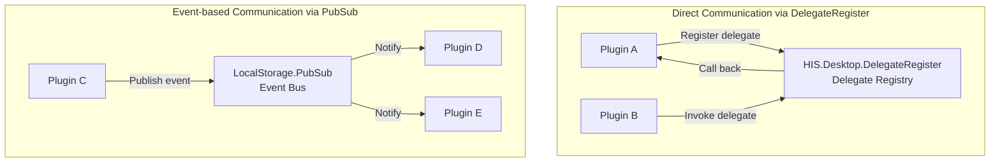

### DelegateRegister Pattern

`HIS.Desktop.DelegateRegister` enables tight coupling between plugins that need direct method invocation:

**Usage:**
- Plugin A registers a delegate: `DelegateRegister.Register("RefreshPatientList", RefreshMethod)`
- Plugin B invokes the delegate: `DelegateRegister.Invoke("RefreshPatientList", parameters)`
- Plugin A's `RefreshMethod` is called with parameters

This pattern is used when one plugin needs to trigger a specific action in another plugin.

### PubSub Pattern

`HIS.Desktop.LocalStorage.PubSub` (9 files) provides loose coupling through a publish-subscribe event bus:

**Usage:**
- Plugins subscribe to events: `PubSub.Subscribe("PatientUpdated", HandlePatientUpdate)`
- Plugins publish events: `PubSub.Publish("PatientUpdated", patientData)`
- All subscribers receive notification

This pattern is used for broadcasting state changes that multiple plugins may need to react to.

Sources: [[`.devin/wiki.json:44-53`](../../../../.devin/wiki.json#L44-L53)](../../../../.devin/wiki.json#L44-L53), [[`.devin/wiki.json:280-283`](../../../../.devin/wiki.json#L280-L283)](../../../../.devin/wiki.json#L280-L283)

## Core Data Flow Architecture

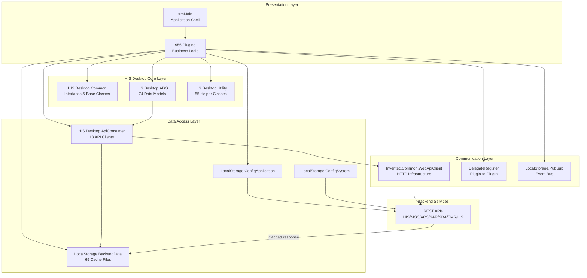

This comprehensive data flow diagram shows how the 956 plugins interact with HIS Desktop Core components. Plugins use `HIS.Desktop.Common` interfaces and `HIS.Desktop.ADO` models, call backend through `ApiConsumer`, cache data in `LocalStorage`, and communicate via `DelegateRegister` and `PubSub`. The `Utility` layer provides cross-cutting helper functions.

Sources: [[`.devin/wiki.json:35-43`](../../../../.devin/wiki.json#L35-L43)](../../../../.devin/wiki.json#L35-L43), [[`.devin/wiki.json:44-53`](../../../../.devin/wiki.json#L44-L53)](../../../../.devin/wiki.json#L44-L53), [[`.devin/wiki.json:55-58`](../../../../.devin/wiki.json#L55-L58)](../../../../.devin/wiki.json#L55-L58)

## Key Integration Points

### Integration with MPS Print System

Plugins invoke the MPS print system through:
1. Construct print data using `Mps000xxx.PDO` classes
2. Call MPS processor via `MPS.Processor.Mps000xxx`
3. Specify output format (PDF, Excel, printer)
4. MPS returns printed document or sends to printer

See [MPS Print System](../../02-modules/his-desktop/business-plugins.md#mps-print) for details.

### Integration with UC Components

Plugins embed reusable UI controls from the UC library:
1. Reference `HIS.UC.*` projects
2. Instantiate UC controls in plugin forms
3. Wire up UC events to plugin logic
4. UC controls handle their own data binding and validation

See [UC Components Library](../../02-modules/uc-controls/form-type-controls.md) for details.

### Integration with Common Libraries

HIS Desktop Core extensively uses `Inventec.Common.*` and `Inventec.Desktop.*` libraries:
- `Inventec.Desktop.Core` - Plugin discovery and lifecycle engine (208 files)
- `Inventec.Common.WebApiClient` - HTTP communication layer
- `Inventec.Common.Logging` - System-wide logging
- `Inventec.Common.FlexCelPrint` - Excel/PDF generation (38 files)
- `Inventec.Common.ElectronicBill` - E-invoice integration (319 files)

See [Common Libraries](../../02-modules/common-libraries/libraries.md) for details.

Sources: [[`.devin/wiki.json:240-273`](../../../../.devin/wiki.json#L240-L273)](../../../../.devin/wiki.json#L240-L273)

## Error Handling and Logging

### Exception Management

HIS Desktop Core implements structured exception handling:

1. **Plugin-level** - Each plugin handles its own business logic exceptions
2. **Core-level** - Core catches unhandled exceptions from plugins
3. **API-level** - `ApiConsumer` handles HTTP errors and timeouts
4. **Global handler** - Application-level exception handler logs crashes

### Logging System

Logging is provided by `Inventec.Common.Logging`:
- **Log levels** - Debug, Info, Warning, Error, Fatal
- **Log targets** - File, database, external logging service
- **Context** - User, module, action automatically included
- **Performance** - API call timing and performance metrics

Plugins access logging through:
```
LogSystem.Debug("Debug message")
LogSystem.Info("Info message")  
LogSystem.Error("Error message", exception)
```

Sources: [[`.devin/wiki.json:249-258`](../../../../.devin/wiki.json#L249-L258)](../../../../.devin/wiki.json#L249-L258)

## Summary

HIS Desktop Core provides the foundational infrastructure for the HisNguonMo system:

**Core Responsibilities:**
- Application entry point and initialization sequence
- Plugin discovery, loading, and lifecycle management
- Session and authentication token management
- REST API communication abstraction via `ApiConsumer`
- Data model layer with 74 ADO classes
- Utility functions with 55 helper classes
- Inter-plugin communication via `DelegateRegister` and `PubSub`
- Configuration and backend data caching

**Key Projects:**
- `HIS.Desktop` (83 files) - entry point
- `HIS.Desktop.ADO` (74 files) - data models
- `HIS.Desktop.Utility` (55 files) - utilities
- `HIS.Desktop.Common` - shared interfaces
- `HIS.Desktop.ApiConsumer` (13 files) - API layer

The architecture enables 956 plugins to function independently while sharing common services, ensuring consistency and reducing code duplication across the massive codebase.

Sources: [[`.devin/wiki.json:35-43`](../../../../.devin/wiki.json#L35-L43)](../../../../.devin/wiki.json#L35-L43)

# LocalStorage & Configuration


## Purpose & Scope

This document describes the **HIS.Desktop.LocalStorage** subsystem, which provides centralized configuration management and local data caching for the HIS Desktop application. The LocalStorage system serves as the foundational layer for:

- **Configuration management**: Application settings, system parameters, and module-specific configurations
- **Backend data caching**: Local storage of API responses to reduce network calls and enable offline capabilities
- **Inter-module communication**: PubSub event system for loose-coupled plugin communication
- **Session state**: Current user session, branch, and location context

For information about how plugins consume this configuration data, see [Plugin System Architecture](../../01-architecture/plugin-system.md). For API communication details, see [API Consumer Layer](#1.1.2).

---

## Architecture Overview

The LocalStorage subsystem is organized as a collection of specialized projects under the `HIS.Desktop.LocalStorage.*` namespace, each responsible for a specific domain of configuration or cached data.

```mermaid
graph TB
    subgraph "HIS Desktop Application"
        Plugins["956 Plugins<br/>(HIS.Desktop.Plugins.*)"]
        Core["HIS.Desktop Core"]
    end
    
    subgraph "LocalStorage Subsystem"
        ConfigApp["LocalStorage.ConfigApplication<br/>Application Settings"]
        ConfigSys["LocalStorage.ConfigSystem<br/>System Configuration"]
        HisConfig["LocalStorage.HisConfig<br/>HIS Module Config"]
        LisConfig["LocalStorage.LisConfig<br/>Laboratory Config"]
        EmrConfig["LocalStorage.EmrConfig<br/>EMR Config"]
        BackendData["LocalStorage.BackendData<br/>69 files<br/>API Response Cache"]
        PubSub["LocalStorage.PubSub<br/>9 files<br/>Event Bus"]
        Location["LocalStorage.Location<br/>Current Location Context"]
        Branch["LocalStorage.Branch<br/>Current Branch Context"]
        SdaConfigKey["LocalStorage.SdaConfigKey<br/>30 files<br/>System Data Keys"]
    end
    
    subgraph "API Layer"
        ApiConsumer["HIS.Desktop.ApiConsumer"]
        Backend["REST APIs"]
    end
    
    Plugins --> ConfigApp
    Plugins --> ConfigSys
    Plugins --> HisConfig
    Plugins --> LisConfig
    Plugins --> EmrConfig
    Plugins --> BackendData
    Plugins --> Location
    Plugins --> Branch
    Plugins --> PubSub
    
    Core --> ConfigApp
    Core --> ConfigSys
    Core --> Location
    Core --> Branch
    
    ApiConsumer --> BackendData
    Backend -.->|"Cache Response"| BackendData
    
    Plugins -.->|"Publish Events"| PubSub
    PubSub -.->|"Subscribe Events"| Plugins
```

**Sources:** Based on high-level architecture diagrams (Diagram 3: Data Flow & API Integration Architecture) and [[`wiki.json`](../../../wiki.json)](../../../wiki.json) page notes for section 1.1.1.

---

## LocalStorage Project Structure

The LocalStorage subsystem consists of the following projects:

| Project Name | Purpose | Estimated Size |
|-------------|---------|----------------|
| `HIS.Desktop.LocalStorage.ConfigApplication` | Application-level configuration settings (UI preferences, display options) | Small |
| `HIS.Desktop.LocalStorage.ConfigSystem` | System-level configuration (database connections, service URLs) | Small |
| `HIS.Desktop.LocalStorage.HisConfig` | HIS module-specific configuration parameters | Medium |
| `HIS.Desktop.LocalStorage.LisConfig` | Laboratory Information System configuration | Small |
| `HIS.Desktop.LocalStorage.EmrConfig` | Electronic Medical Record configuration | Small |
| `HIS.Desktop.LocalStorage.BackendData` | Cached backend data objects from API responses | 69 files (Large) |
| `HIS.Desktop.LocalStorage.PubSub` | Publish-Subscribe event communication system | 9 files |
| `HIS.Desktop.LocalStorage.Location` | Current location context (room, department) | Small |
| `HIS.Desktop.LocalStorage.Branch` | Current branch/facility context | Small |
| `HIS.Desktop.LocalStorage.SdaConfigKey` | System Data Administration configuration keys | 30 files |

**Sources:** [`.devin/wiki.json:45-52`](../../../../.devin/wiki.json#L45-L52)

---

## Configuration Management System

### Configuration Hierarchy

The LocalStorage system implements a three-tier configuration hierarchy:

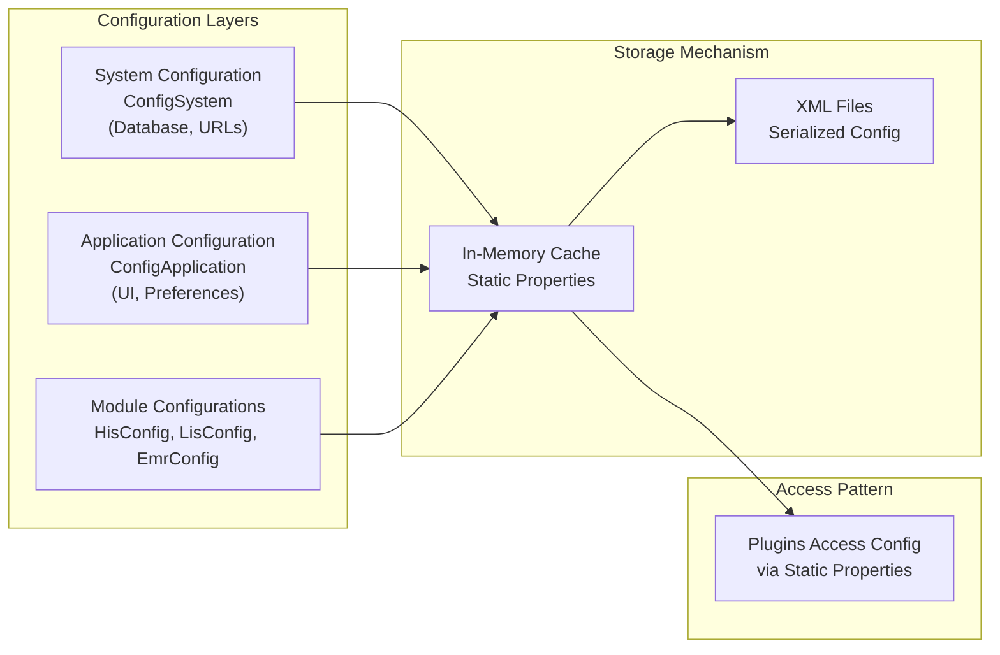

**Sources:** [`Common/Inventec.Aup.Client/Inventec.Aup.Client/AutoUpdater/AutoUpdateHelper/Config.cs:1-125`](../../../../Common/Inventec.Aup.Client/Inventec.Aup.Client/AutoUpdater/AutoUpdateHelper/Config.cs#L1-L125)

### ConfigApplication

The `ConfigApplication` project manages application-level settings that control UI behavior and user preferences. These settings are typically user-specific and persist across sessions.

**Typical configuration data:**
- UI theme and layout preferences
- Grid column visibility and ordering
- Default values for form fields
- Recent search history
- Window positions and sizes

**Access pattern:**
```csharp
// Plugins access configuration via static properties
var setting = HIS.Desktop.LocalStorage.ConfigApplication.SomeSetting;
```

### ConfigSystem

The `ConfigSystem` project stores system-wide configuration that affects all users and all modules. This includes infrastructure settings that rarely change.

**Typical configuration data:**
- Backend API base URLs
- Database connection strings
- Authentication endpoints
- Timeout values
- Retry policies

**Access pattern:**
```csharp
// System configuration is loaded at application startup
var apiUrl = HIS.Desktop.LocalStorage.ConfigSystem.ApiBaseUrl;
```

### Module-Specific Configurations

Three specialized configuration projects handle module-specific settings:

- **HisConfig**: Core HIS business logic parameters (treatment workflows, prescription rules)
- **LisConfig**: Laboratory module settings (machine connections, test parameters)
- **EmrConfig**: Electronic Medical Record settings (document templates, signing workflows)

**Configuration loading pattern:**
The system uses XML serialization for configuration persistence, as demonstrated in [[`Common/Inventec.Aup.Client/Inventec.Aup.Client/AutoUpdater/AutoUpdateHelper/Config.cs:87-111`](../../../../Common/Inventec.Aup.Client/Inventec.Aup.Client/AutoUpdater/AutoUpdateHelper/Config.cs#L87-L111)](../../../../Common/Inventec.Aup.Client/Inventec.Aup.Client/AutoUpdater/AutoUpdateHelper/Config.cs#L87-L111):

```csharp
// Configuration is serialized to/from XML files
public static Config LoadConfig(string file)
{
    XmlSerializer xs = new XmlSerializer(typeof(Config));
    StreamReader sr = new StreamReader(file);
    config = xs.Deserialize(sr) as Config;
    return config;
}

public void SaveConfig(string file)
{
    XmlSerializer xs = new XmlSerializer(typeof(Config));
    StreamWriter sw = new StreamWriter(file);
    xs.Serialize(sw, this);
}
```

**Sources:** [`Common/Inventec.Aup.Client/Inventec.Aup.Client/AutoUpdater/AutoUpdateHelper/Config.cs:41-111`](../../../../Common/Inventec.Aup.Client/Inventec.Aup.Client/AutoUpdater/AutoUpdateHelper/Config.cs#L41-L111)

---

## BackendData Caching System

### Purpose & Architecture

The `LocalStorage.BackendData` project (69 files) serves as the primary caching layer for backend API responses. This caching mechanism provides:

1. **Performance optimization**: Reduces redundant API calls
2. **Offline capability**: Allows plugins to function with cached data when backend is unavailable
3. **Consistency**: Ensures all plugins see the same cached data version

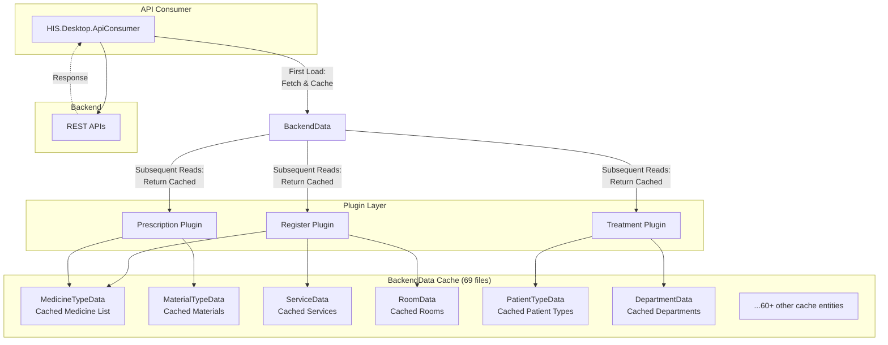

### Cache Data Structure

Each cached entity in BackendData follows a standard pattern:

**Entity storage:**
- Static collections (List, Dictionary) holding cached data
- Timestamp of last cache refresh
- Cache validity flag

**Typical cache entity pattern:**
```csharp
public static class MedicineTypeData
{
    public static List<MedicineTypeADO> DataList { get; set; }
    public static DateTime LastUpdate { get; set; }
    public static bool IsValid { get; set; }
}
```

### Cache Invalidation

Plugins can invalidate cache entries when data changes on the backend:

1. **Manual invalidation**: After data mutations (create, update, delete)
2. **Time-based expiration**: Cache expires after configured TTL
3. **Event-driven refresh**: PubSub events trigger cache refresh

**Sources:** High-level architecture diagram (Diagram 3), [`.devin/wiki.json:45-52`](../../../../.devin/wiki.json#L45-L52)

---

## PubSub Event Communication System

### Overview

The `LocalStorage.PubSub` project (9 files) implements a publish-subscribe event bus that enables loose-coupled communication between plugins without direct dependencies.

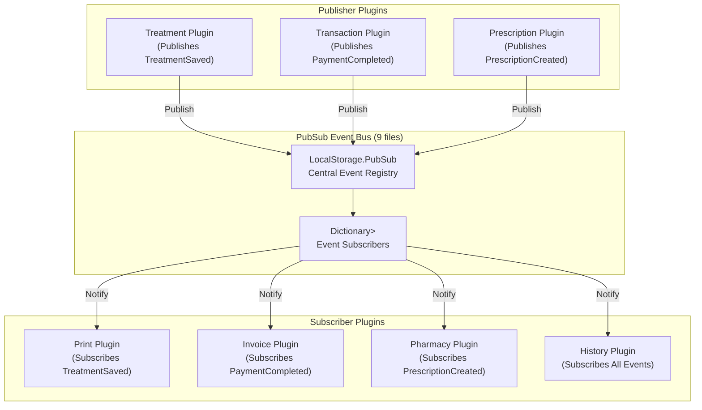

### Event Flow

**1. Subscription (Plugin Initialization):**
```csharp
// Plugin subscribes to events during initialization
HIS.Desktop.LocalStorage.PubSub.Subscribe("TreatmentSaved", OnTreatmentSaved);

private void OnTreatmentSaved(object data)
{
    // Handle event
    var treatment = data as TreatmentADO;
    RefreshDisplay(treatment);
}
```

**2. Publishing (Plugin Business Logic):**
```csharp
// Plugin publishes event after completing an action
var treatment = SaveTreatment();
HIS.Desktop.LocalStorage.PubSub.Publish("TreatmentSaved", treatment);
```

**3. Event Delivery:**
The PubSub system maintains a dictionary of event names to subscriber lists and invokes all registered handlers when an event is published.

### Common Events

Based on the plugin architecture, typical PubSub events include:

| Event Name | Published By | Purpose |
|-----------|--------------|---------|
| `TreatmentSaved` | Treatment plugins | Notify when treatment record is saved |
| `PatientRegistered` | Register plugins | Notify when new patient is registered |
| `PrescriptionCreated` | Prescription plugins | Notify when prescription is created |
| `PaymentCompleted` | Transaction plugins | Notify when payment is processed |
| `ConfigChanged` | Config plugins | Notify when configuration is updated |
| `CacheRefreshed` | BackendData | Notify when cached data is refreshed |

### Integration with Inventec.Common.WSPubSub

For inter-process or distributed events, the system integrates with `Inventec.Common.WSPubSub` (WebSocket PubSub) to enable communication between different application instances or services.

**Sources:** [`.devin/wiki.json:45-52`](../../../../.devin/wiki.json#L45-L52, [`.devin/wiki.json:280-283`](../../../../.devin/wiki.json#L280-L283)

---

## SdaConfigKey System

### Overview

The `LocalStorage.SdaConfigKey` project (30 files) provides a centralized registry of configuration keys used by the SDA (System Data Administration) module. These keys define configurable system behaviors and parameters.

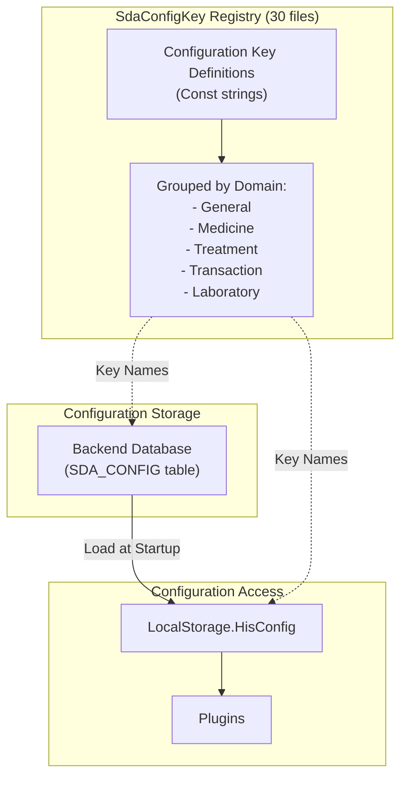

### Key Structure

Configuration keys follow a hierarchical naming convention:

**Key naming pattern:**
```
HIS.Desktop.[Module].[Category].[Parameter]
```

**Examples:**
- `HIS.Desktop.Treatment.AutoCreatePrescription`
- `HIS.Desktop.Transaction.RequireDepositBeforeTreatment`
- `HIS.Desktop.Laboratory.AutoApproveResults`
- `HIS.Desktop.Prescription.CheckDrugInteraction`

### Usage Pattern

**Defining keys in SdaConfigKey:**
```csharp
public static class TreatmentConfigKeys
{
    public const string AUTO_CREATE_PRESCRIPTION = "HIS.Desktop.Treatment.AutoCreatePrescription";
    public const string REQUIRE_ICD_ON_FINISH = "HIS.Desktop.Treatment.RequireIcdOnFinish";
    public const string MAX_TREATMENT_DAYS = "HIS.Desktop.Treatment.MaxTreatmentDays";
}
```

**Accessing configuration in plugins:**
```csharp
// Check if auto-create prescription is enabled
bool autoCreate = HIS.Desktop.LocalStorage.HisConfig.GetValue(
    SdaConfigKeys.TreatmentConfigKeys.AUTO_CREATE_PRESCRIPTION
);

if (autoCreate)
{
    CreatePrescription();
}
```

### Configuration Loading

Configuration values are loaded from the backend database at application startup and cached in LocalStorage for fast access. Plugins access these values via static properties or methods provided by the HisConfig project.

**Sources:** [`.devin/wiki.json:45-52`](../../../../.devin/wiki.json#L45-L52)

---

## Location & Branch Context

### Purpose

The `LocalStorage.Location` and `LocalStorage.Branch` projects maintain the current user's working context within the hospital system.

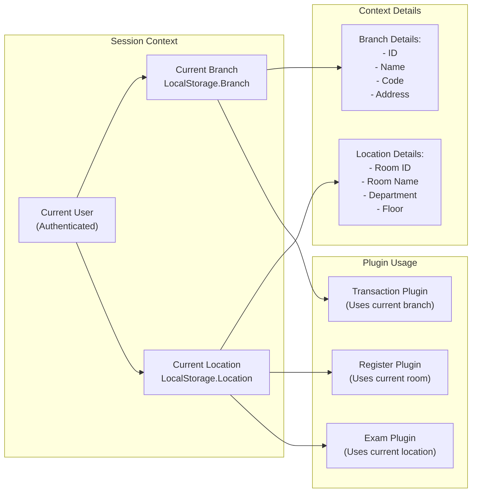

### Branch Context

**Branch** represents the hospital facility/campus where the user is working:
- Used for filtering data by facility
- Determines applicable price lists
- Controls inventory access
- Affects reporting scope

**Access pattern:**
```csharp
var currentBranch = HIS.Desktop.LocalStorage.Branch.CurrentBranch;
// currentBranch contains ID, Name, Code, Address, etc.
```

### Location Context

**Location** represents the specific room/department where the user is working:
- Determines which patients are visible
- Controls service assignment
- Affects workflow routing
- Used for room-specific configurations

**Access pattern:**
```csharp
var currentRoom = HIS.Desktop.LocalStorage.Location.CurrentRoom;
var currentDepartment = HIS.Desktop.LocalStorage.Location.CurrentDepartment;
```

### Context Switching

Users can switch context during a session:
1. **Branch switching**: Change working facility (requires re-authentication in some cases)
2. **Location switching**: Change working room/department (common during shift changes)

When context changes, the system:
- Updates LocalStorage.Branch and LocalStorage.Location
- Publishes context change event via PubSub
- Triggers cache refresh for context-dependent data
- Notifies all subscribed plugins to refresh their displays

**Sources:** [`.devin/wiki.json:45-52`](../../../../.devin/wiki.json#L45-L52)

---

## Integration Points

### Plugin Integration

All 956 plugins in the HIS system depend on LocalStorage for configuration and cached data access.

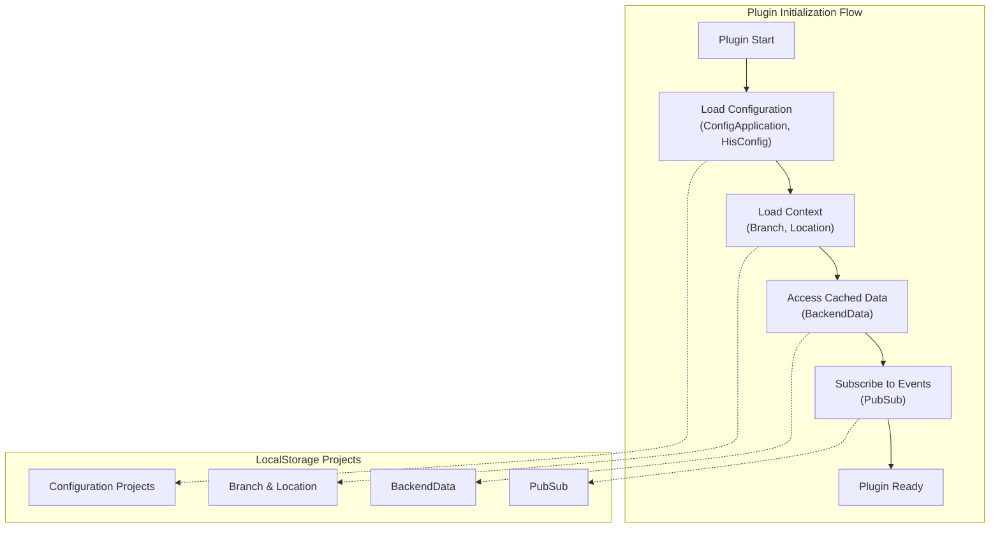

### API Consumer Integration

The API Consumer layer integrates with BackendData to provide transparent caching:

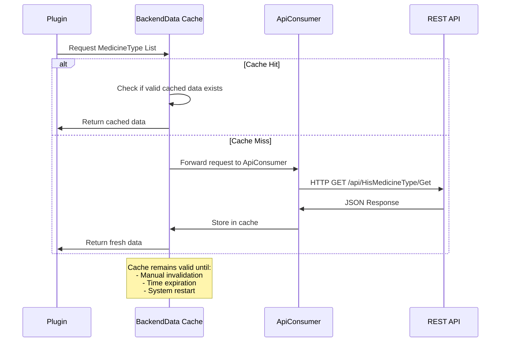

### Event-Driven Updates

When data changes, the system uses PubSub to notify all interested parties:

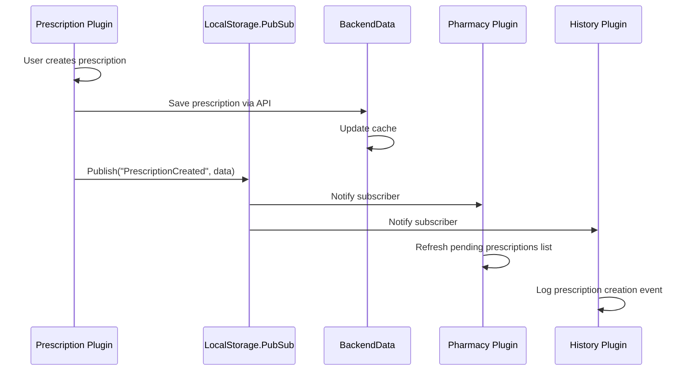

**Sources:** High-level architecture diagrams (Diagram 2, Diagram 3), [`.devin/wiki.json:45-52`](../../../../.devin/wiki.json#L45-L52)

---

## Configuration File Format

### XML Configuration Example

Based on the AutoUpdater configuration pattern seen in [[`Common/Inventec.Aup.Client/Inventec.Aup.Client/AutoUpdater/AutoUpdateHelper/Config.cs:41-122`](../../../../Common/Inventec.Aup.Client/Inventec.Aup.Client/AutoUpdater/AutoUpdateHelper/Config.cs#L41-L122)](../../../../Common/Inventec.Aup.Client/Inventec.Aup.Client/AutoUpdater/AutoUpdateHelper/Config.cs#L41-L122), LocalStorage configurations use XML serialization:

**Structure:**
```xml
<Config>
    <Enabled>true</Enabled>
    <ServerUrl>http://api.hospital.local</ServerUrl>
    <UserName>system</UserName>
    <PassWord>encrypted_value</PassWord>
    <UpdateFileList>
        <Files>
            <File>
                <Path>HIS.Desktop.exe</Path>
                <Version>1.0.0</Version>
                <LastUpdate>2024-01-01</LastUpdate>
            </File>
        </Files>
    </UpdateFileList>
</Config>
```

**Loading mechanism:**
The `Config.LoadConfig()` method demonstrates the standard loading pattern used throughout LocalStorage projects [[`Common/Inventec.Aup.Client/Inventec.Aup.Client/AutoUpdater/AutoUpdateHelper/Config.cs:87-103`](../../../../Common/Inventec.Aup.Client/Inventec.Aup.Client/AutoUpdater/AutoUpdateHelper/Config.cs#L87-L103)](../../../../Common/Inventec.Aup.Client/Inventec.Aup.Client/AutoUpdater/AutoUpdateHelper/Config.cs#L87-L103).

**File integrity:**
Configuration files can be validated using hash algorithms [[`Common/Inventec.Aup.Client/Inventec.Aup.Client/AutoUpdater/AutoUpdateHelper/Config.cs:113-120`](../../../../Common/Inventec.Aup.Client/Inventec.Aup.Client/AutoUpdater/AutoUpdateHelper/Config.cs#L113-L120)](../../../../Common/Inventec.Aup.Client/Inventec.Aup.Client/AutoUpdater/AutoUpdateHelper/Config.cs#L113-L120):

```csharp
public static string GetFileHash(string filePath)
{
    HashAlgorithm hash = HashAlgorithm.Create();
    FileStream file = new FileStream(filePath, FileMode.Open);
    byte[] hashByte = hash.ComputeHash(file);
    string str1 = BitConverter.ToString(hashByte);
    return str1;
}
```

**Sources:** [`Common/Inventec.Aup.Client/Inventec.Aup.Client/AutoUpdater/AutoUpdateHelper/Config.cs:1-125`](../../../../Common/Inventec.Aup.Client/Inventec.Aup.Client/AutoUpdater/AutoUpdateHelper/Config.cs#L1-L125)

---

## Summary

The LocalStorage & Configuration subsystem provides essential infrastructure for the HIS Desktop application:

| Component | Primary Function | Key Benefit |
|-----------|------------------|-------------|
| **ConfigApplication/ConfigSystem** | Centralized configuration management | Consistent settings across plugins |
| **BackendData (69 files)** | API response caching | Performance & offline capability |
| **PubSub (9 files)** | Event-driven communication | Loose coupling between plugins |
| **SdaConfigKey (30 files)** | System configuration registry | Type-safe configuration access |
| **Branch & Location** | Working context management | Multi-facility support |

This architecture enables the 956 plugins to operate efficiently with shared state while maintaining independence and modularity. The caching layer significantly reduces backend load, while the PubSub system allows plugins to react to system events without tight coupling.