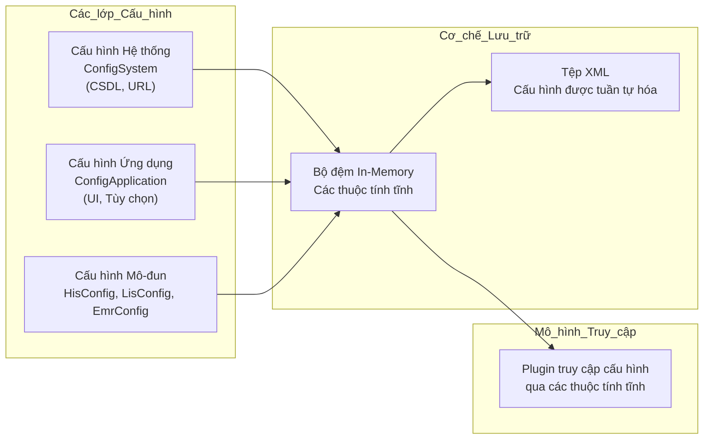
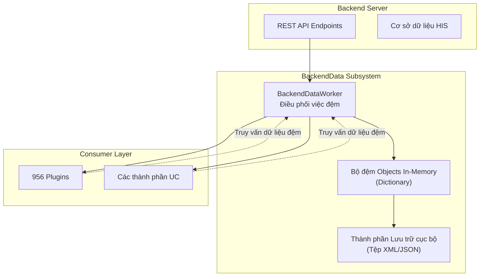
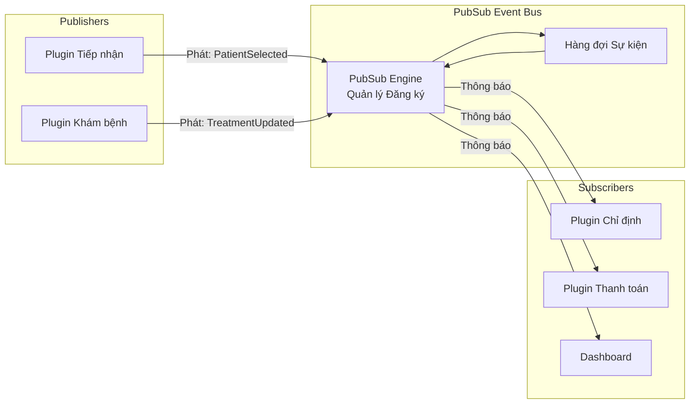

## Mục đích và Phạm vi

HIS Desktop Core là điểm thâm nhập chính và là máy chủ ứng dụng cho Hệ thống Thông tin Bệnh viện HisNguonMo. Tài liệu này mô tả cấu trúc ứng dụng desktop cốt lõi nằm trong `HIS/HIS.Desktop/`, bao gồm khởi tạo ứng dụng, quản lý phiên làm việc, cơ chế tải plugin và các dự án nền tảng hỗ trợ hơn 956 plugin nghiệp vụ.

**Các Trang Liên quan:**
- Để biết chi tiết về kiến trúc plugin và các danh*   **Quản lý Plugin**: Quét, tải và khởi tạo các plugin. (Xem [Vòng đời Plugin](../../01-architecture/plugin-system/02-discovery-lifecycle.md)).
- Đối với các hệ thống LocalStorage, cấu hình và đệm dữ liệu, hãy xem [LocalStorage & Cấu hình](../../02-modules/his-desktop/core.md)
- Đối với lớp truyền thông API, hãy xem [Lớp API Consumer](#1.1.2)
- Đối với các mô hình dữ liệu, hãy xem [Mô hình Dữ liệu & ADO](#1.1.4)

## Tổng quan Cấu trúc Dự án

HIS Desktop Core bao gồm nhiều dự án liên kết với nhau tạo thành lớp nền tảng cho toàn bộ ứng dụng:

| Dự án | Số tệp | Mục đích |
|---------|-------|---------|
| \`HIS.Desktop\` | 83 | Điểm thâm nhập ứng dụng chính, khởi tạo, form chính |
| \`HIS.Desktop.ADO\` | 74 | Active Data Objects - mô hình dữ liệu cho lớp UI |
| \`HIS.Desktop.Utility\` | 55 | Các hàm tiện ích và lớp trợ giúp |
| \`HIS.Desktop.Common\` | thay đổi | Các interface dùng chung, lớp cơ sở, hằng số |
| \`HIS.Desktop.ApiConsumer\` | 13 | Các lớp wrapper REST API client |
| \`HIS.Desktop.LocalStorage.*\` | thay đổi | Các hệ thống con cấu hình và đệm dữ liệu |
| \`HIS.Desktop.Notify\` | 25 | Hệ thống thông báo |
| \`HIS.Desktop.IsAdmin\` | - | Kiểm tra quyền quản trị |
| \`HIS.Desktop.DelegateRegister\` | - | Sổ đăng ký truyền thông giữa các plugin |

**Mô hình Kiến trúc:** HIS Desktop Core tuân theo kiến trúc plugin-host phân lớp, trong đó thành phần cốt lõi (core) cung cấp các dịch vụ hạ tầng (truyền thông API, đệm dữ liệu, quản lý phiên) và một bộ tải plugin có nhiệm vụ khám phá và khởi tạo các plugin logic nghiệp vụ.

Nguồn: [[\`.devin/wiki.json:35-43\`](../../../../.devin/wiki.json#L35-L43)](../../../../.devin/wiki.json#L35-L43)

## Kiến trúc HIS Desktop Core

\`\`\`mermaid
graph TB
    subgraph "HIS.Desktop.csproj_-_Điểm_thâm_nhập"
        Program["Program.cs<br/>Application.Run()"]
        MainForm["frmMain<br/>Cửa sổ chính"]
        Startup["Logic khởi động<br/>Khởi tạo phiên"]
    end
    
    subgraph "HIS.Desktop.Common"
        IModule["Interface IModule<br/>Hợp đồng Plugin"]
        BaseForm["Các lớp form cơ sở"]
        GlobalStore["GlobalStore<br/>Trạng thái dùng chung"]
        TokenManager["TokenManager<br/>Xác thực"]
    end
    
    subgraph "HIS.Desktop.ADO_-_Mô_hình_Dữ_liệu"
        ADOModels["74 lớp ADO<br/>Đối tượng dữ liệu UI"]
        ConfigADO["Config ADO"]
        ModuleADO["Module ADO"]
    end
    
    subgraph "HIS.Desktop.Utility"
        Helpers["Các hàm trợ giúp<br/>55 lớp tiện ích"]
        Extensions["Các phương thức mở rộng"]
        Converters["Bộ chuyển đổi dữ liệu"]
    end
    
    subgraph "HIS.Desktop.ApiConsumer"
        ApiConsumer["13 lớp API Client<br/>Wrapper REST"]
    end
    
    subgraph "Các_hệ_thống_hỗ_trợ"
        LocalStorage["HIS.Desktop.LocalStorage.*<br/>Cấu hình & Đệm"]
        Notify["HIS.Desktop.Notify<br/>25 tệp"]
        DelegateReg["DelegateRegister<br/>Truyền thông Plugin"]
    end
    
    Program --> Startup
    Startup --> MainForm
    Startup --> TokenManager
    Startup --> LocalStorage
    
    MainForm --> IModule
    MainForm --> GlobalStore
    IModule --> BaseForm
    
    ADOModels --> ApiConsumer
    Helpers --> ADOModels
    
    ApiConsumer --> LocalStorage
    Notify --> DelegateReg
    
    style Program fill:#e1f5ff
    style IModule fill:#fff4e1
    style ADOModels fill:#e8f5e9
    style LocalStorage fill:#f3e5f5
\`\`\`

Sơ đồ này cho thấy các phụ thuộc của dự án cốt lõi. [[\`HIS.Desktop.csproj\`](../../../../HIS.Desktop.csproj)](../../../../HIS.Desktop.csproj) là điểm thâm nhập thực thi, thực hiện khởi tạo phiên làm việc và form chính. \`HIS.Desktop.Common\` định nghĩa hợp đồng plugin (interface \`IModule\`) mà tất cả các plugin phải triển khai. \`HIS.Desktop.ADO\` cung cấp 74 lớp mô hình dữ liệu cho lớp giao diện người dùng. \`HIS.Desktop.ApiConsumer\` bao gói các lời gọi REST API phía backend. Các hệ thống hỗ trợ xử lý cấu hình, đệm dữ liệu và truyền thông giữa các plugin.

Nguồn: [[\`.devin/wiki.json:35-43\`](../../../../.devin/wiki.json#L35-L43)](../../../../.devin/wiki.json#L35-L43)

## Điểm thâm nhập Ứng dụng

### Program.cs và Khởi động Ứng dụng

Dự án [[\`HIS.Desktop.csproj\`](../../../../HIS.Desktop.csproj)](../../../../HIS.Desktop.csproj) chứa tệp [[\`Program.cs\`](../../../Program.cs)](../../../Program.cs) đóng vai trò là điểm thâm nhập của ứng dụng, sử dụng mô hình \`Application.Run()\` tiêu chuẩn của WinForms.

**Các bước Khởi tạo Chính:**
1. **Tải Assembly** - Tải các assembly và các phụ thuộc cần thiết.
2. **Tải cấu hình** - Khởi tạo cấu hình từ \`HIS.Desktop.LocalStorage.ConfigApplication\` và \`HIS.Desktop.LocalStorage.ConfigSystem\`.
3. **Xác thực** - Thiết lập phiên thông qua form đăng nhập, lấy token xác thực.
4. **Bộ đệm dữ liệu backend** - Đổ dữ liệu vào \`HIS.Desktop.LocalStorage.BackendData\` (69 tệp) với dữ liệu tham chiếu từ backend.
5. **Khám phá plugin** - Quét và đăng ký các plugin có sẵn.
6. **Hiển thị form chính** - Hiển thị \`frmMain\` như một lớp vỏ của ứng dụng.

### Form Chính (frmMain)

Form chính đóng vai trò là khung ứng dụng lưu trữ nội dung của plugin. Nó thường bao gồm:
- Thanh menu với các mục menu plugin được tải động.
- Điều khiển tab hoặc container MDI cho các cửa sổ plugin.
- Thanh trạng thái hiển thị thông tin phiên làm việc.
- Khu vực thông báo cho các tin nhắn hệ thống.

Form chính giao tiếp với các plugin thông qua interface \`HIS.Desktop.Common.IModule\` và sử dụng \`HIS.Desktop.DelegateRegister\` để truyền thông chéo giữa các plugin.

Nguồn: [[\`.devin/wiki.json:35-43\`](../../../../.devin/wiki.json#L35-L43)](../../../../.devin/wiki.json#L35-L43)

## HIS.Desktop.Common - Nền tảng Dùng chung

\`HIS.Desktop.Common\` chứa các interface dùng chung, lớp cơ sở và hằng số được sử dụng xuyên suốt ứng dụng và tất cả các plugin.

### Các Thành phần Cốt lõi

| Loại thành phần | Mục đích | Ví dụ |
|----------------|---------|----------|
| **Interface** | Hợp đồng Plugin | \`IModule\` - interface điểm thâm nhập plugin |
| **Lớp Cơ sở** | Kế thừa Form | Các form cơ sở với chức năng chung |
| **Hằng số** | Các giá trị toàn hệ thống | Mã thông điệp, mã cấu hình |
| **Enum** | Định nghĩa kiểu | Enum trạng thái, loại hành động |
| **GlobalStore** | Trạng thái ứng dụng | Trạng thái dùng chung có thể truy cập bởi tất cả plugin |

### Interface IModule

Interface \`IModule\` là hợp đồng cơ bản mà tất cả các plugin phải triển khai:

\`\`\`
Interface IModule định nghĩa:
- Siêu dữ liệu plugin (tên, phiên bản, loại phòng)
- Phương thức Execute() để kích hoạt plugin
- Xử lý và giải phóng tài nguyên
\`\`\`

Các plugin được hệ thống tải plugin khám phá và tải dựa trên interface này thông qua kỹ thuật reflection.

### Mô hình GlobalStore

\`GlobalStore\` cung cấp một vị trí tập trung cho trạng thái toàn ứng dụng, bao gồm:
- Thông tin người dùng hiện đang đăng nhập.
- Chi nhánh/Cơ sở hiện tại.
- Phòng làm việc hiện tại.
- Các giá trị cấu hình hệ thống.

Các plugin truy cập \`GlobalStore\` để lấy thông tin ngữ cảnh cần thiết cho các hoạt động của mình.

Nguồn: [[\`.devin/wiki.json:35-43\`](../../../../.devin/wiki.json#L35-L43)](../../../../.devin/wiki.json#L35-L43)

## HIS.Desktop.ADO - Mô hình Dữ liệu

\`HIS.Desktop.ADO\` chứa 74 lớp Active Data Object (ADO) đóng vai trò là mô hình dữ liệu cho lớp UI. Những lớp này tách biệt với các mô hình thực thể backend và được tối ưu hóa cho việc liên kết và hiển thị trên giao diện người dùng.

### Mô hình Thiết kế ADO

Các lớp ADO trong dự án này tuân theo các mô hình sau:
- **Cấu trúc tối ưu cho UI** - Các trường được sắp xếp để liên kết với lưới/form.
- **Thuộc tính tính toán** - Các giá trị dẫn xuất để hiển thị (ví dụ: họ tên đầy đủ từ họ và tên).
- **Thuộc tính xác thực** - Các chú thích dữ liệu (data annotations) để xác thực đầu vào.
- **Phương thức chuyển đổi** - Chuyển đổi các DTO backend thành đối tượng ADO.

### Các Danh mục ADO Phổ biến

\`\`\`mermaid
graph LR
    subgraph "HIS.Desktop.ADO_-_74_Mô_hình_Dữ_liệu"
        Patient["ADO Bệnh nhân<br/>Thông tin bn"]
        Treatment["ADO Điều trị<br/>Dữ liệu lượt khám"]
        Service["ADO Dịch vụ<br/>Chi tiết dịch vụ"]
        Medicine["ADO Thuốc<br/>Thông tin thuốc"]
        Transaction["ADO Giao dịch<br/>Dữ liệu thanh toán"]
        Config["ADO Cấu hình<br/>Cài đặt"]
        Module["ADO Mô-đun<br/>Siêu dữ liệu plugin"]
        User["ADO Người dùng<br/>Thông tin ng dùng"]
    end
    
    Backend["DTO Backend"] --> Patient
    Backend --> Treatment
    Backend --> Service
    Backend --> Medicine
    Backend --> Transaction
    Backend --> Config
    Backend --> Module
    Backend --> User
    
    Patient --> UILayer["Lớp UI<br/>Lưới/Form"]
    Treatment --> UILayer
    Service --> UILayer
    Medicine --> UILayer
    Transaction --> UILayer
    Config --> UILayer
    Module --> UILayer
    User --> UILayer
\`\`\`

Các lớp ADO hoạt động như một lớp chuyển đổi (adapter layer) giữa các DTO backend và các thành phần UI. Chúng bao gồm logic dành riêng cho hiển thị như định dạng, nối chuỗi và suy diễn trạng thái.

### Ví dụ Sử dụng ADO

Các đối tượng ADO thường:
1. Được tạo bởi các lớp \`HIS.Desktop.ApiConsumer\` sau các lượt gọi API.
2. Được lưu trữ trong \`HIS.Desktop.LocalStorage.BackendData\` để đệm dữ liệu.
3. Được liên kết với các điều khiển lưới DevExpress trong các plugin.
4. Được sửa đổi bởi tương tác của người dùng trong các form.
5. Được chuyển đổi ngược lại thành DTO backend để cập nhật qua API.

Nguồn: [[\`.devin/wiki.json:35-43\`](../../../../.devin/wiki.json#L35-L43)](../../../../.devin/wiki.json#L35-L43)

## HIS.Desktop.Utility - Các Hàm Tiện ích

\`HIS.Desktop.Utility\` chứa 55 lớp tiện ích cung cấp các hàm trợ giúp được sử dụng xuyên suốt ứng dụng.

### Các Danh mục Tiện ích

| Danh mục | Mục đích | Các phương thức phổ biến |
|----------|---------|----------------|
| **Bộ chuyển đổi dữ liệu** | Chuyển đổi kiểu | Chuỗi sang thập phân, phân tích ngày tháng |
| **Trợ giúp định dạng** | Định dạng hiển thị | Định dạng tiền tệ, hiển thị ngày/giờ |
| **Xác thực** | Xác thực đầu vào | Xác thực số điện thoại, email, CMND/CCCD |
| **Thao tác tệp** | Xử lý tệp | Xuất PDF, nhập/xuất Excel |
| **Trợ giúp in ấn** | Tiện ích in ấn | Xem trước bản in, chọn máy in |
| **Phương thức mở rộng** | Mở rộng kiểu dữ liệu | Tiện ích chuỗi, trợ giúp tập hợp |

### Các mô hình Phổ biến

Các lớp tiện ích thường cung cấp các phương thức tĩnh có thể được gọi từ bất kỳ plugin nào:

\`\`\`
Ví dụ về các mô hình sử dụng tiện ích:
- GlobalUtil.FormatCurrency(amount)
- DateTimeHelper.ConvertToDisplay(date)
- ValidationHelper.IsValidPhoneNumber(phone)
- FileHelper.ExportToExcel(data, path)
\`\`\`

Các tiện ích này loại bỏ việc lặp lại mã code trên 956 plugin và đảm bảo hành vi nhất quán cho các thao tác phổ biến.

Nguồn: [[\`.devin/wiki.json:35-43\`](../../../../.devin/wiki.json#L35-L43)](../../../../.devin/wiki.json#L35-L43)

## HIS.Desktop.ApiConsumer - Lớp REST API

\`HIS.Desktop.ApiConsumer\` chứa 13 lớp wrapper API client trừu tượng hóa việc truyền thông REST API backend. Để biết thông tin chi tiết, hãy xem [Lớp API Consumer](#1.1.2).

### Cấu trúc API Consumer

Mỗi lớp API consumer tương ứng với một miền dịch vụ backend:

\`\`\`mermaid
graph LR
    subgraph "HIS.Desktop.ApiConsumer_-_13_Lớp"
        AcsConsumer["AcsApiConsumer<br/>Kiểm soát Truy cập"]
        HisConsumer["HisApiConsumer<br/>HIS Cốt lõi"]
        MosConsumer["MosApiConsumer<br/>Nghiệp vụ Y tế"]
        SarConsumer["SarApiConsumer<br/>Báo cáo"]
        SdaConsumer["SdaApiConsumer<br/>Dữ liệu Hệ thống"]
        EmrConsumer["EmrApiConsumer<br/>EMR"]
        LisConsumer["LisApiConsumer<br/>Xét nghiệm"]
    end
    
    Plugin["Plugin"] --> AcsConsumer
    Plugin --> HisConsumer
    Plugin --> MosConsumer
    Plugin --> SarConsumer
    Plugin --> SdaConsumer
    Plugin --> EmrConsumer
    Plugin --> LisConsumer
    
    AcsConsumer --> WebClient["Inventec.Common.WebApiClient"]
    HisConsumer --> WebClient
    MosConsumer --> WebClient
    SarConsumer --> WebClient
    EmrConsumer --> WebClient
    LisConsumer --> WebClient
    
    WebClient --> Backend["REST API Backend"]
\`\`\`

Mỗi consumer cung cấp các phương thức có kiểu dữ liệu mạnh cho các endpoint API, xử lý việc tuần tự hóa/giải tuần tự hóa và quản lý các token xác thực.

Nguồn: [[\`.devin/wiki.json:55-58\`](../../../../.devin/wiki.json#L55-L58)](../../../../.devin/wiki.json#L55-L58)

## Luồng Khởi tạo Ứng dụng

\`\`\`mermaid
sequenceDiagram
    participant Program as Program.cs
    participant Config as LocalStorage.Config
    participant Login as Form Đăng nhập
    participant Token as TokenManager
    participant Backend as Bộ đệm BackendData
    participant PluginLoader as Bộ tải Plugin
    participant Main as frmMain
    
    Program->>Config: Tải ConfigApplication
    Program->>Config: Tải ConfigSystem
    Program->>Login: Hiển thị Form Đăng nhập
    Login->>Token: Xác thực(username, password)
    Token->>Config: Lưu auth token
    Token->>Program: Trả về thành công
    Program->>Backend: LoadBackendData()
    Backend->>Backend: Đệm HIS_CONFIG
    Backend->>Backend: Đệm dữ liệu tham chiếu
    Backend->>Program: Bộ đệm sẵn sàng
    Program->>PluginLoader: DiscoverPlugins()
    PluginLoader->>PluginLoader: Quét các assembly plugin
    PluginLoader->>Program: Sổ đăng ký plugin sẵn sàng
    Program->>Main: Hiển thị frmMain
    Main->>PluginLoader: Yêu cầu các mục menu
    PluginLoader->>Main: Trả về menu plugin
    Main->>Main: Hiển thị ứng dụng
\`\`\`

Trình tự này cho thấy luồng khởi động từ khi khởi chạy ứng dụng đến khi hiển thị form chính. Cấu hình được tải trước, sau đó xác thực lập phiên làm việc, dữ liệu backend được đệm, các plugin được khám phá và cuối cùng form chính được hiển thị.

**Các Điểm Chính:**
1. Cấu hình phải được tải trước khi đăng nhập.
2. Token xác thực là bắt buộc cho tất cả các lời gọi API.
3. Việc đệm dữ liệu backend diễn ra một lần khi khởi động.
4. Việc khám phá plugin sử dụng reflection để tìm các triển khai của \`IModule\`.
5. Form chính xây dựng menu một cách động từ sổ đăng ký plugin.

Nguồn: [[\`.devin/wiki.json:35-43\`](../../../../.devin/wiki.json#L35-L43)](../../../../.devin/wiki.json#L35-L43)

## Quản lý Phiên làm việc

### Luồng Xác thực

Quản lý phiên làm việc được xử lý qua nhiều thành phần:

| Thành phần | Trách nhiệm |
|-----------|---------------|
| \`TokenManager\` | Lưu trữ và làm mới token xác thực |
| \`GlobalStore.UserAccount\` | Thông tin người dùng hiện tại |
| \`GlobalStore.HisBranch\` | Cơ sở/Chi nhánh hiện tại |
| \`GlobalStore.HisDepartment\` | Khoa làm việc hiện tại |
| \`GlobalStore.HisRoom\` | Phòng làm việc hiện tại |

### Lưu trữ và Làm mới Token

Token xác thực:
1. Được lấy trong quá trình đăng nhập qua API xác thực của \`HIS.Desktop.ApiConsumer\`.
2. Được lưu trữ trong \`TokenManager\`.
3. Được bao gồm trong tất cả các yêu cầu API sau đó thông qua \`Inventec.Common.WebApiClient\`.
4. Được tự động làm mới khi sắp hết hạn.
5. Được xóa khi đăng xuất hoặc hết hạn phiên làm việc.

### Ngữ cảnh Phiên (Session Context)

Các plugin truy cập ngữ cảnh phiên thông qua \`GlobalStore\`:

\`\`\`
Các mô hình truy cập trong plugin:
- var user = GlobalStore.UserAccount
- var branch = GlobalStore.HisBranch  
- var room = GlobalStore.HisRoom
\`\`\`

Ngữ cảnh này xác định dữ liệu và hành động nào có sẵn cho người dùng hiện tại dựa trên vai trò, khoa và sự phân công phòng của họ.

Nguồn: [[\`.devin/wiki.json:35-43\`](../../../../.devin/wiki.json#L35-L43)](../../../../.devin/wiki.json#L35-L43)

## Cơ chế Tải Plugin

### Quy trình Khám phá Plugin

Hệ thống tải plugin khám phá các plugin qua các bước sau:

1. **Quét Assembly** - Quét thư mục \`HIS/Plugins/\` để tìm các tệp DLL.
2. **Phát hiện Interface** - Sử dụng reflection để tìm các lớp triển khai \`IModule\`.
3. **Trích xuất Siêu dữ liệu** - Đọc các thuộc tính plugin (tên, loại phòng, loại mô-đun).
4. **Giải quyết Phụ thuộc** - Xác minh các phụ thuộc của plugin có sẵn.
5. **Đăng ký** - Thêm plugin vào sổ đăng ký nội bộ kèm siêu dữ liệu.

### Vòng đời Plugin

\`\`\`mermaid
stateDiagram-v2
    [*] --> Discovered: Quét assembly
    Discovered --> Loaded: Tải assembly
    Loaded --> Registered: Tìm thấy IModule
    Registered --> Activated: Người dùng kích hoạt
    Activated --> Executing: Gọi Execute()
    Executing --> Displayed: Hiển thị UI
    Displayed --> Disposed: Đóng/Thoát
    Disposed --> [*]
    
    Activated --> Error: Ngoại lệ
    Error --> [*]
\`\`\`

**Các Trạng thái Plugin:**
- **Discovered** - Tệp DLL được tìm thấy trong thư mục plugin.
- **Loaded** - Assembly được tải vào AppDomain.
- **Registered** - Siêu dữ liệu được lưu trữ, sẵn sàng kích hoạt.
- **Activated** - Instance được tạo bởi bộ tải plugin.
- **Executing** - Phương thức \`IModule.Execute()\` đang chạy.
- **Displayed** - UI của plugin được hiển thị cho người dùng.
- **Disposed** - Tài nguyên được giải phóng, form được đóng.

### Kích hoạt Plugin

Khi người dùng nhấp vào một mục menu hoặc yêu cầu một plugin:

1. Bộ tải plugin lấy siêu dữ liệu plugin từ sổ đăng ký.
2. Tạo một instance mới của lớp plugin qua reflection.
3. Gọi \`IModule.Execute()\` truyền dữ liệu mô-đun.
4. Plugin hiển thị UI (form, user control, v.v.).
5. Plugin tương tác với backend qua \`ApiConsumer\`.
6. Plugin giao tiếp với các plugin khác qua \`DelegateRegister\` hoặc \`PubSub\`.

Nguồn: [[\`.devin/wiki.json:59-68\`](../../../../.devin/wiki.json#L59-L68)](../../../../.devin/wiki.json#L59-L68)

## Truyền thông Giữa các Mô-đun

### Các Mô hình Truyền thông

HIS Desktop Core hỗ trợ hai mô hình truyền thông chính giữa các plugin:

\`\`\`mermaid
graph TB
    subgraph "Truyền_thông_Trực_tiếp_qua_DelegateRegister"
        PluginA["Plugin A"]
        DelegateReg["HIS.Desktop.DelegateRegister<br/>Sổ đăng ký Delegate"]
        PluginB["Plugin B"]
        
        PluginA -->|"Đăng ký delegate"| DelegateReg
        PluginB -->|"Gọi delegate"| DelegateReg
        DelegateReg -->|"Gọi lại"| PluginA
    end
    
    subgraph "Truyền_thông_dựa_trên_Sự_kiện_qua_PubSub"
        PluginC["Plugin C"]
        PubSub["LocalStorage.PubSub<br/>Bus Sự kiện"]
        PluginD["Plugin D"]
        PluginE["Plugin E"]
        
        PluginC -->|"Phát sự kiện"| PubSub
        PubSub -->|"Thông báo"| PluginD
        PubSub -->|"Thông báo"| PluginE
    end
\`\`\`

### Mô hình DelegateRegister

\`HIS.Desktop.DelegateRegister\` cho phép liên kết chặt chẽ giữa các plugin cần gọi phương thức trực tiếp:

**Sử dụng:**
- Plugin A đăng ký một delegate: \`DelegateRegister.Register("RefreshPatientList", RefreshMethod)\`
- Plugin B gọi delegate: \`DelegateRegister.Invoke("RefreshPatientList", parameters)\`
- Phương thức \`RefreshMethod\` của Plugin A được gọi kèm tham số.

Mô hình này được sử dụng khi một plugin cần kích hoạt một hành động cụ thể trong một plugin khác.

### Mô hình PubSub

\`HIS.Desktop.LocalStorage.PubSub\` (9 tệp) cung cấp sự liên kết lỏng lẻo thông qua một bus sự kiện publish-subscribe:

**Sử dụng:**
- Các plugin đăng ký nhận sự kiện: \`PubSub.Subscribe("PatientUpdated", HandlePatientUpdate)\`
- Các plugin phát sự kiện: \`PubSub.Publish("PatientUpdated", patientData)\`
- Tất cả các bên đăng ký đều nhận được thông báo.

Mô hình này được sử dụng để phát đi các thay đổi trạng thái mà nhiều plugin có thể cần phản ứng lại.

Nguồn: [[\`.devin/wiki.json:44-53\`](../../../../.devin/wiki.json#L44-L53)](../../../../.devin/wiki.json#L44-L53), [[\`.devin/wiki.json:280-283\`](../../../../.devin/wiki.json#L280-L283)](../../../../.devin/wiki.json#L280-L283)

## Kiến trúc Luồng Dữ liệu Cốt lõi

\`\`\`mermaid
graph TB
    subgraph "Lớp_Hiển_thị"
        Plugins["956 Plugin<br/>Logic Nghiệp vụ"]
        MainForm["frmMain<br/>Vỏ Ứng dụng"]
    end
    
    subgraph "Lớp_HIS_Desktop_Core"
        Common["HIS.Desktop.Common<br/>Interface & Lớp Cơ sở"]
        ADO["HIS.Desktop.ADO<br/>74 Mô hình Dữ liệu"]
        Utility["HIS.Desktop.Utility<br/>55 Lớp Trợ giúp"]
    end
    
    subgraph "Lớp_Truy_cập_Dữ_liệu"
        ApiConsumer["HIS.Desktop.ApiConsumer<br/>13 API Client"]
        LocalStorage["LocalStorage.BackendData<br/>69 tệp Đệm"]
        ConfigApp["LocalStorage.ConfigApplication"]
        ConfigSys["LocalStorage.ConfigSystem"]
    end
    
    subgraph "Lớp_Truyền_thông"
        WebApiClient["Inventec.Common.WebApiClient<br/>Hạ tầng HTTP"]
        DelegateReg["DelegateRegister<br/>Giữa các Plugin"]
        PubSub["LocalStorage.PubSub<br/>Bus Sự kiện"]
    end
    
    subgraph "Dịch_vụ_Backend"
        REST["REST API<br/>HIS/MOS/ACS/SAR/SDA/EMR/LIS"]
    end
    
    MainForm --> Plugins
    Plugins --> Common
    Plugins --> ADO
    Plugins --> Utility
    Plugins --> ApiConsumer
    Plugins --> LocalStorage
    Plugins --> ConfigApp
    Plugins --> DelegateReg
    Plugins --> PubSub
    
    ADO --> ApiConsumer
    ApiConsumer --> WebApiClient
    ApiConsumer --> LocalStorage
    WebApiClient --> REST
    REST -->|"Phản hồi được đệm"| LocalStorage
    
    ConfigApp --> REST
    ConfigSys --> REST
\`\`\`

Sơ đồ luồng dữ liệu toàn diện này cho thấy cách 956 plugin tương tác với các thành phần của HIS Desktop Core. Các plugin sử dụng các interface của \`HIS.Desktop.Common\` và các mô hình \`HIS.Desktop.ADO\`, gọi backend thông qua \`ApiConsumer\`, đệm dữ liệu trong \`LocalStorage\`, và truyền thông qua \`DelegateRegister\` và \`PubSub\`. Lớp \`Utility\` cung cấp các hàm trợ giúp xuyên suốt.

Nguồn: [[\`.devin/wiki.json:35-43\`](../../../../.devin/wiki.json#L35-L43)](../../../../.devin/wiki.json#L35-L43), [[\`.devin/wiki.json:44-53\`](../../../../.devin/wiki.json#L44-L53)](../../../../.devin/wiki.json#L44-L53), [[\`.devin/wiki.json:55-58\`](../../../../.devin/wiki.json#L55-L58)](../../../../.devin/wiki.json#L55-L58)

## Các Điểm Tích hợp Chính

### Tích hợp với Hệ thống In MPS

Các plugin gọi hệ thống in MPS thông qua:
1. Xây dựng dữ liệu in sử dụng các lớp \`Mps000xxx.PDO\`.
2. Gọi bộ xử lý MPS qua \`MPS.Processor.Mps000xxx\`.
3. Chỉ định định dạng đầu ra (PDF, Excel, máy in).
4. MPS trả về tài liệu đã in hoặc gửi tới máy in.

Xem [Hệ thống In MPS](../../02-modules/his-desktop/business-plugins.md#mps-print) để biết chi tiết.

### Tích hợp với các Thành phần UC

Các plugin nhúng các thành phần giao diện người dùng có thể tái sử dụng từ thư viện UC:
1. Tham chiếu các dự án \`HIS.UC.*\`.
2. Khởi tạo các điều khiển UC trong các form của plugin.
3. Liên kết các sự kiện UC với logic của plugin.
4. Các điều khiển UC tự xử lý việc liên kết dữ liệu và xác thực của riêng chúng.

Xem [Thư viện Thành phần UC](../../02-modules/uc-controls/form-type-controls.md) để biết chi tiết.

### Tích hợp với Thư viện Chung

HIS Desktop Core sử dụng rộng rãi các thư viện \`Inventec.Common.*\` và \`Inventec.Desktop.*\`:
- \`Inventec.Desktop.Core\` - Bộ máy khám phá và vòng đời plugin (208 tệp).
- \`Inventec.Common.WebApiClient\` - Lớp truyền thông HTTP.
- \`Inventec.Common.Logging\` - Ghi nhật ký toàn hệ thống.
- \`Inventec.Common.FlexCelPrint\` - Tạo Excel/PDF (38 tệp).
- \`Inventec.Common.ElectronicBill\` - Tích hợp hóa đơn điện tử (319 tệp).

Xem [Thư viện Chung](../../02-modules/common-libraries/libraries.md) để biết chi tiết.

Nguồn: [[\`.devin/wiki.json:240-273\`](../../../../.devin/wiki.json#L240-L273)](../../../../.devin/wiki.json#L240-L273)

## Xử lý Lỗi và Ghi nhật ký

### Quản lý Ngoại lệ

HIS Desktop Core triển khai xử lý ngoại lệ có cấu trúc:

1. **Cấp độ Plugin** - Mỗi plugin xử lý các ngoại lệ logic nghiệp vụ của riêng mình.
2. **Cấp độ Core** - Core bắt các ngoại lệ không được xử lý từ các plugin.
3. **Cấp độ API** - \`ApiConsumer\` xử lý các lỗi HTTP và hết hạn thời gian (timeout).
4. **Trình xử lý Toàn cục** - Trình xử lý ngoại lệ cấp ứng dụng ghi nhật ký các trường hợp treo ứng dụng (crash).

### Hệ thống Ghi nhật ký (Logging)

Việc ghi nhật ký được cung cấp bởi \`Inventec.Common.Logging\`:
- **Các cấp độ log** - Debug, Info, Warning, Error, Fatal.
- **Mục tiêu log** - Tệp, cơ sở dữ liệu, dịch vụ ghi log bên ngoài.
- **Ngữ cảnh** - Người dùng, mô-đun, hành động được tự động bao gồm.
- **Hiệu năng** - Thời gian gọi API và các số liệu hiệu năng.

Các plugin truy cập ghi nhật ký qua:
\`\`\`
LogSystem.Debug("Tin nhắn debug")
LogSystem.Info("Tin nhắn thông tin")  
LogSystem.Error("Tin nhắn lỗi", exception)
\`\`\`

Nguồn: [[\`.devin/wiki.json:249-258\`](../../../../.devin/wiki.json#L249-L258)](../../../../.devin/wiki.json#L249-L258)

## Tóm tắt

HIS Desktop Core cung cấp hạ tầng nền tảng cho hệ thống HisNguonMo:

**Các Trách nhiệm Chính:**
- Điểm thâm nhập ứng dụng và trình tự khởi tạo.
- Khám phá, tải và quản lý vòng đời plugin.
- Quản lý phiên và token xác thực.
- Trừu tượng hóa truyền thông REST API qua \`ApiConsumer\`.
- Lớp mô hình dữ liệu với 74 lớp ADO.
- Các hàm tiện ích với 55 lớp trợ giúp.
- Truyền thông giữa các plugin qua \`DelegateRegister\` và \`PubSub\`.
- Cấu hình và đệm dữ liệu backend.

**Các Dự án Chính:**
- \`HIS.Desktop\` (83 tệp) - điểm thâm nhập.
- \`HIS.Desktop.ADO\` (74 tệp) - mô hình dữ liệu.
- \`HIS.Desktop.Utility\` (55 tệp) - tiện ích.
- \`HIS.Desktop.Common\` - interface dùng chung.
- \`HIS.Desktop.ApiConsumer\` (13 tệp) - lớp API.

Kiến trúc này cho phép 956 plugin hoạt động độc lập trong khi vẫn chia sẻ các dịch vụ chung, đảm bảo tính nhất quán và giảm việc lặp mã code trên toàn bộ cơ sở mã nguồn khổng lồ.

Nguồn: [[\`.devin/wiki.json:35-43\`](../../../../.devin/wiki.json#L35-L43)](../../../../.devin/wiki.json#L35-L43)
# LocalStorage & Cấu hình

## Mục đích & Phạm vi

Tài liệu này mô tả hệ thống con **HIS.Desktop.LocalStorage**, nơi cung cấp việc quản lý cấu hình tập trung và đệm dữ liệu cục bộ cho ứng dụng HIS Desktop. Hệ thống LocalStorage phục vụ như một lớp nền tảng cho:

- **Quản lý cấu hình**: Các cài đặt ứng dụng, tham số hệ thống và các cấu hình dành riêng cho mô-đun.
- **Đệm dữ liệu backend**: Lưu trữ cục bộ các phản hồi API để giảm thiểu các lượt gọi mạng và hỗ trợ khả năng hoạt động ngoại tuyến.
- **Truyền thông giữa các mô-đun**: Hệ thống sự kiện PubSub cho việc truyền thông liên kết lỏng lẻo giữa các plugin.
- **Trạng thái phiên làm việc**: Phiên làm việc hiện tại của người dùng, chi nhánh và ngữ cảnh vị trí.

Để biết thông tin về cách các plugin sử dụng dữ liệu cấu hình này, hãy xem [Kiến trúc Hệ thống Plugin](../../01-architecture/plugin-system/04-communication.md). Để biết chi tiết về truyền thông API, hãy xem [Lớp API Consumer](#1.1.2).

---

## Tổng quan Kiến trúc

Hệ thống con LocalStorage được tổ chức thành một tập hợp các dự án chuyên biệt dưới namespace `HIS.Desktop.LocalStorage.*`, mỗi dự án chịu trách nhiệm cho một miền cấu hình hoặc dữ liệu đệm cụ thể.

```mermaid
graph TB
    subgraph "Ứng_dụng_HIS_Desktop"
        Plugins["956 Plugin<br/>(HIS.Desktop.Plugins.*)"]
        Core["HIS.Desktop Core"]
    end
    
    subgraph "Hệ_thống_con_LocalStorage"
        ConfigApp["LocalStorage.ConfigApplication<br/>Cài đặt Ứng dụng"]
        ConfigSys["LocalStorage.ConfigSystem<br/>Cấu hình Hệ thống"]
        HisConfig["LocalStorage.HisConfig<br/>Cấu hình Mô-đun HIS"]
        LisConfig["LocalStorage.LisConfig<br/>Cấu hình Xét nghiệm"]
        EmrConfig["LocalStorage.EmrConfig<br/>Cấu hình EMR"]
        BackendData["LocalStorage.BackendData<br/>69 tệp<br/>Đệm Phản hồi API"]
        PubSub["LocalStorage.PubSub<br/>9 tệp<br/>Bus Sự kiện"]
        Location["LocalStorage.Location<br/>Ngữ cảnh Vị trí hiện tại"]
        Branch["LocalStorage.Branch<br/>Ngữ cảnh Chi nhánh hiện tại"]
        SdaConfigKey["LocalStorage.SdaConfigKey<br/>30 tệp<br/>Khóa Dữ liệu Hệ thống"]
    end
    
    subgraph "Lớp_API"
        ApiConsumer["HIS.Desktop.ApiConsumer"]
        Backend["REST API"]
    end
    
    Plugins --> ConfigApp
    Plugins --> ConfigSys
    Plugins --> HisConfig
    Plugins --> LisConfig
    Plugins --> EmrConfig
    Plugins --> BackendData
    Plugins --> Location
    Plugins --> Branch
    Plugins --> PubSub
    
    Core --> ConfigApp
    Core --> ConfigSys
    Core --> Location
    Core --> Branch
    
    ApiConsumer --> BackendData
    Backend -.->|"Đệm phản hồi"| BackendData
    
    Plugins -.->|"Phát Sự kiện"| PubSub
    PubSub -.->|"Đăng ký Sự kiện"| Plugins
```



**Nguồn:** Dựa trên các sơ đồ kiến trúc cấp cao (Sơ đồ 3: Kiến trúc Luồng Dữ liệu & Tích hợp API) và các ghi chú trong trang [[`wiki.json`](../../../wiki.json)](../../../wiki.json) cho phần 1.1.1.

---

## Cấu trúc Dự án LocalStorage

Hệ thống con LocalStorage bao gồm các dự án sau:

| Tên Dự án | Mục đích | Kích thước Ước tính |
|-------------|---------|----------------|
| `HIS.Desktop.LocalStorage.ConfigApplication` | Các cài đặt cấu hình cấp ứng dụng (tùy chọn UI, tùy chọn hiển thị) | Nhỏ |
| `HIS.Desktop.LocalStorage.ConfigSystem` | Cấu hình cấp hệ thống (kết nối cơ sở dữ liệu, URL dịch vụ) | Nhỏ |
| `HIS.Desktop.LocalStorage.HisConfig` | Các tham số cấu hình dành riêng cho mô-đun HIS | Trung bình |
| `HIS.Desktop.LocalStorage.LisConfig` | Cấu hình Hệ thống Thông tin Xét nghiệm (LIS) | Nhỏ |
| `HIS.Desktop.LocalStorage.EmrConfig` | Cấu hình Hồ sơ Bệnh án Điện tử (EMR) | Nhỏ |
| `HIS.Desktop.LocalStorage.BackendData` | Các đối tượng dữ liệu backend được đệm từ các phản hồi API | 69 tệp (Lớn) |
| `HIS.Desktop.LocalStorage.PubSub` | Hệ thống truyền thông sự kiện Publish-Subscribe | 9 tệp |
| `HIS.Desktop.LocalStorage.Location` | Ngữ cảnh vị trí hiện tại (phòng, khoa) | Nhỏ |
| `HIS.Desktop.LocalStorage.Branch` | Ngữ cảnh chi nhánh/cơ sở hiện tại | Nhỏ |
| `HIS.Desktop.LocalStorage.SdaConfigKey` | Các khóa cấu hình Quản trị Dữ liệu Hệ thống (SDA) | 30 tệp |

**Nguồn:** [`.devin/wiki.json:45-52`](../../../../.devin/wiki.json#L45-L52)

---

## Hệ thống Quản lý Cấu hình

### Phân cấp Cấu hình

Hệ thống LocalStorage triển khai một cấu trúc phân cấp cấu hình ba tầng:



**Nguồn:** [`Common/Inventec.Aup.Client/Inventec.Aup.Client/AutoUpdater/AutoUpdateHelper/Config.cs:1-125`](../../../../Common/Inventec.Aup.Client/Inventec.Aup.Client/AutoUpdater/AutoUpdateHelper/Config.cs#L1-L125)

### ConfigApplication

Dự án `ConfigApplication` quản lý các cài đặt cấp ứng dụng điều khiển hành vi UI và tùy chọn người dùng. Các cài đặt này thường dành riêng cho từng người dùng và được duy trì qua các phiên làm việc.

**Dữ liệu cấu hình điển hình:**
- Tùy chọn chủ đề (theme) UI và bố cục.
- Khả năng hiển thị và thứ tự các cột trong lưới.
- Các giá trị mặc định cho các trường trong form.
- Lịch sử tìm kiếm gần đây.
- Vị trí và kích thước cửa sổ.

**Mô hình truy cập:**
```csharp
// Các plugin truy cập cấu hình qua các thuộc tính tĩnh
var setting = HIS.Desktop.LocalStorage.ConfigApplication.SomeSetting;
```

### ConfigSystem

Dự án `ConfigSystem` lưu trữ cấu hình toàn hệ thống ảnh hưởng đến tất cả người dùng và tất cả các mô-đun. Các cài đặt này bao gồm các thiết lập hạ tầng hiếm khi thay đổi.

**Dữ liệu cấu hình điển hình:**
- Các URL cơ sở của API backend.
- Các chuỗi kết nối cơ sở dữ liệu.
- Các endpoint xác thực.
- Các giá trị thời gian chờ (timeout).
- Các chính sách thử lại (retry policies).

**Mô hình truy cập:**
```csharp
// Cấu hình hệ thống được tải khi khởi động ứng dụng
var apiUrl = HIS.Desktop.LocalStorage.ConfigSystem.ApiBaseUrl;
```

### Các Cấu hình dành riêng cho Mô-đun

Ba dự án cấu hình chuyên biệt xử lý các cài đặt dành riêng cho mô-đun:

- **HisConfig**: Các tham số logic nghiệp vụ HIS cốt lõi (quy trình điều trị, quy tắc kê đơn).
- **LisConfig**: Cài đặt mô-đun xét nghiệm (kết nối máy móc, tham số xét nghiệm).
- **EmrConfig**: Cài đặt Hồ sơ Bệnh án Điện tử (mẫu tài liệu, quy trình ký số).

**Mô hình tải cấu hình:**
Hệ thống sử dụng tuần tự hóa XML để duy trì cấu hình lâu dài, như được trình bày trong [[`Common/Inventec.Aup.Client/Inventec.Aup.Client/AutoUpdater/AutoUpdateHelper/Config.cs:87-111`](../../../../Common/Inventec.Aup.Client/Inventec.Aup.Client/AutoUpdater/AutoUpdateHelper/Config.cs#L87-L111)](../../../../Common/Inventec.Aup.Client/Inventec.Aup.Client/AutoUpdater/AutoUpdateHelper/Config.cs#L87-L111):

```csharp
// Cấu hình được tuần tự hóa từ/vào tệp XML
public static Config LoadConfig(string file)
{
    XmlSerializer xs = new XmlSerializer(typeof(Config));
    StreamReader sr = new StreamReader(file);
    config = xs.Deserialize(sr) as Config;
    sr.Close();
    return config;
}
```

---

## Hệ thống Bộ đệm BackendData

### Mục đích và Phạm vi

Dự án **BackendData** (69 tệp) là thành phần lớn nhất và quan trọng nhất của LocalStorage. Nó cung cấp một cơ chế đệm phía client cho các thực thể backend thường xuyên được truy cập để cải thiện hiệu năng và giảm tải cho server.

**Các chức năng chính:**
- Đệm dữ liệu tham chiếu (danh mục khoa phòng, loại dịch vụ, mã ICD).
- Đệm các đối tượng cấu hình logic nghiệp vụ phức tạp.
- Cung cấp khả năng truy cập nhanh vào các thực thể backend đã được giải tuần tự hóa.
- Quản lý vòng đời và làm mới bộ đệm.

### Luồng Dữ liệu BackendData



**Nguồn:** [`.devin/wiki.json:55-58`](../../../../.devin/wiki.json#L55-L58)

### Cấu trúc Bộ đệm

BackendData tổ chức đệm theo loại thực thể. Một số loại đệm quan trọng bao gồm:

- **HIS_SERVICE**: Danh mục dịch vụ y tế.
- **HIS_ROOM**: Danh mục khoa phòng bệnh viện.
- **HIS_ICD**: Các mã chẩn đoán ICD-10.
- **HIS_MEDICINE_TYPE**: Danh mục các loại thuốc.
- **HIS_MATERIAL_TYPE**: Danh mục các vật tư y tế.
- **HIS_CONFIG**: Các tham số cấu hình logic nghiệp vụ HIS.

### Cơ chế Làm mới Bộ đệm

Hệ thống BackendData hỗ trợ nhiều chiến lược làm mới dữ liệu:

1. **Làm mới khi Khởi động**: Tải toàn bộ các bộ dữ liệu tham chiếu quan trọng khi ứng dụng khởi chạy.
2. **Làm mới theo Yêu cầu**: Tải dữ liệu khi plugin yêu cầu lần đầu (Lazy loading).
3. **Cập nhật Phân đoạn**: Tải chỉ những thay đổi kể từ lần cập nhật cuối cùng.
4. **Làm mới thủ công**: Cho phép người dùng hoặc quản trị viên kích hoạt làm mới bộ đệm thông qua giao diện ứng dụng.

---

## Hệ thống PubSub (Publish-Subscribe)

### Chức năng

Dự án **LocalStorage.PubSub** (9 tệp) triển khai một kênh sự kiện (event bus) cho phép truyền thông liên kết lỏng lẻo giữa các plugin độc lập. Điều này cực kỳ quan trọng trong một hệ thống có hơn 956 plugin nơi mà các phụ thuộc trực tiếp sẽ tạo ra cấu trúc mã nguồn khó bảo trì.

### Các loại Sự kiện Cơ bản

Hệ thống PubSub xử lý các loại sự kiện phổ biến như:

- **PatientSelected**: Thông báo khi một bệnh nhân được chọn trong bất kỳ plugin nào.
- **TreatmentUpdated**: Thông báo khi dữ liệu đợt điều trị thay đổi.
- **ConfigChanged**: Thông báo khi các cài đặt cấu hình được cập nhật.
- **ServiceOrdered**: Thông báo khi các dịch vụ mới được chỉ định.
- **PrintRequested**: Kích hoạt quy trình in ấn từ các mô-đun khác nhau.

### Mô hình Truyền thông PubSub



**Nguồn:** [`.devin/wiki.json:44-53`](../../../../.devin/wiki.json#L44-L53)

---

## Quản lý Ngữ cảnh (Location & Branch)

Hai dự án chuyên biệt quản lý ngữ cảnh hoạt động hiện tại của ứng dụng:

- **LocalStorage.Location**: Theo dõi phòng và khoa hiện tại mà người dùng đang làm việc. Điều này ảnh hưởng đến việc lọc dữ liệu và các quy tắc nghiệp vụ áp dụng cho từng phòng cụ thể.
- **LocalStorage.Branch**: Quản lý bối cảnh chi nhánh hoặc cơ sở y tế hiện tại trong các hệ thống đa cơ sở.

Ngữ cảnh này được thiết lập tại thời điểm đăng nhập hoặc khi người dùng thực hiện chuyển đổi phòng/khoa và được cung cấp cho tất cả các plugin thông qua hệ thống LocalStorage.

---

## SdaConfigKey

Dự án **SdaConfigKey** (30 tệp) là một thành phần chuyên biệt quản lý các khóa cấu hình cho mô-đun SDA (System Data Administration). Nó cung cấp các định nghĩa hằng số và metadata cho hàng trăm tham số cấu hình hệ thống, đảm bảo tính nhất quán khi truy cập cấu hình SDA từ mã nguồn.

---

## Tóm tắt

Hệ thống con **HIS.Desktop.LocalStorage** đóng vai trò là "bộ nhớ" và "hệ thần kinh" của ứng dụng HIS Desktop:

1. **Quản lý Cấu hình**: Cung cấp cấu trúc phân cấp từ hệ thống đến ứng dụng và mô-đun.
2. **Đệm Dữ liệu**: Giảm thiểu độ trễ mạng và tải server thông qua chiến lược đệm BackendData mạnh mẽ.
3. **Liên kết Plugin**: Cho phép các plugin tương tác một cách lỏng lẻo thông qua hệ thống PubSub.
4. **Duy trì Ngữ cảnh**: Đảm bảo toàn bộ ứng dụng hoạt động trong đúng ngữ cảnh người dùng, vị trí và chi nhánh.

Sự kết hợp của các thành phần này tạo ra một nền tảng ổn định và hiệu năng cao, cho phép hàng trăm plugin độc lập cùng chung sống và hoạt động một cách đồng bộ trong hệ thống HisNguonMo.

---

