## Purpose and Scope

This document covers the `HIS.UC.FormType` component (329 files), which is the core form engine for all data entry operations in the HIS system. FormType provides a reusable, configurable framework for creating dynamic forms with standardized validation, data binding, and layout patterns.

FormType is one of 131 user control components in the UC library. For information about other patient-related controls, see [Patient & Treatment UCs](#1.3.2). For medicine and diagnosis-related controls, see [Medicine & ICD UCs](#1.3.3). For the overall UC library architecture, see [UC Components Library](../../02-modules/uc-controls/form-type-controls.md).

**Sources:** [`.devin/wiki.json:210-213`](../../../../.devin/wiki.json#L210-L213, [UC/HIS.UC.FormType/]()

---

## System Overview

`HIS.UC.FormType` is the largest and most complex user control component in the UC library, serving as the foundational form rendering engine for the entire HIS application. With 329 files, it provides:

- Dynamic form generation based on configurable metadata
- Standardized data validation and error handling
- Consistent layout and styling across all plugins
- Data binding between UI controls and domain models
- Form state management and lifecycle control
- Localization support for multilingual forms

FormType is consumed by 956 plugins across the system to create consistent data entry interfaces for hospital operations including patient registration, treatment tracking, prescription management, and administrative functions.

**Sources:** [UC/HIS.UC.FormType/](), [`.devin/wiki.json:203-207`](../../../../.devin/wiki.json#L203-L207)

---

## Architecture and Position in System

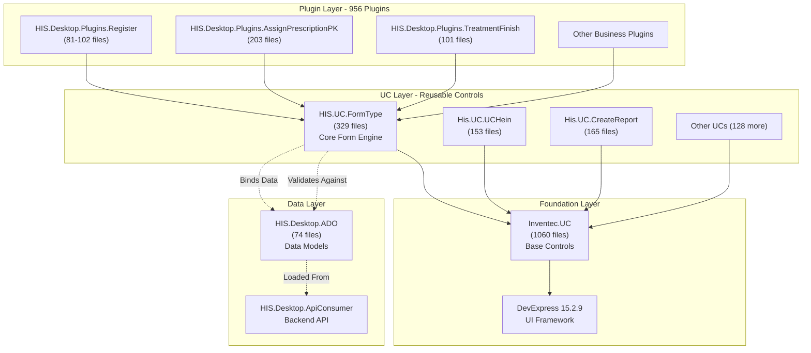

**Diagram: FormType Position in System Architecture**

This diagram shows how FormType sits between the plugin layer and the foundation layer, serving as the primary interface for all data entry operations. Plugins consume FormType to create consistent forms, which in turn build upon Inventec.UC base controls and bind to ADO data models.

**Sources:** [UC/HIS.UC.FormType/](), [HIS/Plugins/](), [Common/Inventec.UC/](), [HIS/HIS.Desktop/HIS.Desktop.ADO/]()

---

## Component Structure

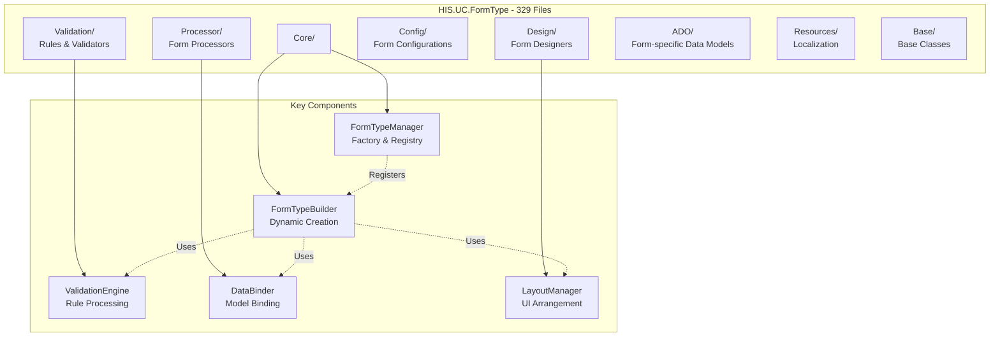

**Diagram: FormType Internal Component Structure**

The component is organized into specialized folders handling different aspects of form management. The Core provides the factory pattern for form creation, while Validation, Processor, and Design handle specialized concerns.

**Sources:** [UC/HIS.UC.FormType/]()

---

## Form Type Categories

Based on the file count (329 files) and typical hospital system requirements, FormType likely provides several categories of forms:

| Form Category | Purpose | Typical Use Cases |
|---------------|---------|-------------------|
| **Patient Forms** | Patient demographic and registration data | New patient registration, patient search, patient update |
| **Clinical Forms** | Medical data entry | Vital signs, diagnosis codes (ICD), examination notes |
| **Prescription Forms** | Medication and treatment orders | Drug prescriptions, medical procedures, lab orders |
| **Financial Forms** | Billing and payment | Invoice creation, deposit collection, payment processing |
| **Administrative Forms** | System configuration and master data | User management, room setup, service configuration |
| **Report Forms** | Data filtering and report parameters | Date range selection, department filters, report criteria |

**Sources:** [UC/HIS.UC.FormType/](), [HIS/Plugins/]()

---

## Form Creation and Lifecycle

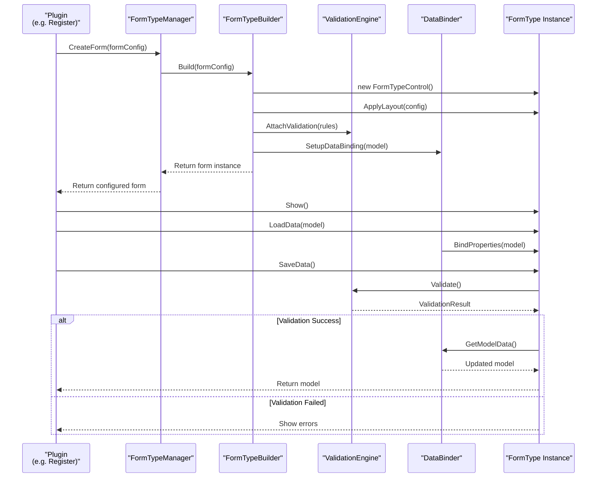

**Diagram: Form Creation and Data Flow Lifecycle**

This sequence shows the typical lifecycle of a FormType instance from creation through data binding to validation. Plugins interact with FormTypeManager to create and configure forms, which are then displayed and validated before data submission.

**Sources:** [UC/HIS.UC.FormType/Core/](), [UC/HIS.UC.FormType/Validation/](), [UC/HIS.UC.FormType/Processor/]()

---

## Data Binding Patterns

FormType implements a robust data binding system that connects UI controls to data models from `HIS.Desktop.ADO`. The binding system supports:

### Two-Way Binding

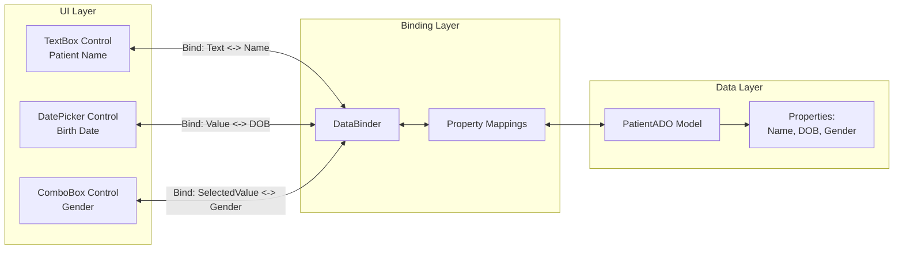

**Diagram: Two-Way Data Binding Architecture**

The DataBinder component creates bidirectional links between UI controls and model properties, automatically synchronizing changes in either direction with validation and type conversion.

**Sources:** [UC/HIS.UC.FormType/Processor/](), [HIS/HIS.Desktop/HIS.Desktop.ADO/]()

### Binding Features

| Feature | Description | Implementation |
|---------|-------------|----------------|
| **Property Mapping** | Automatic mapping between control properties and model fields | Uses reflection and attribute-based configuration |
| **Type Conversion** | Automatic conversion between UI types (string) and model types (int, DateTime, etc.) | Built-in converters with custom converter support |
| **Change Tracking** | Tracks which fields have been modified | Dirty flag system for efficient updates |
| **Validation Integration** | Validates data during binding process | Calls ValidationEngine before committing changes |
| **Null Handling** | Graceful handling of null values | Default values and nullable type support |

**Sources:** [UC/HIS.UC.FormType/Processor/]()

---

## Validation System

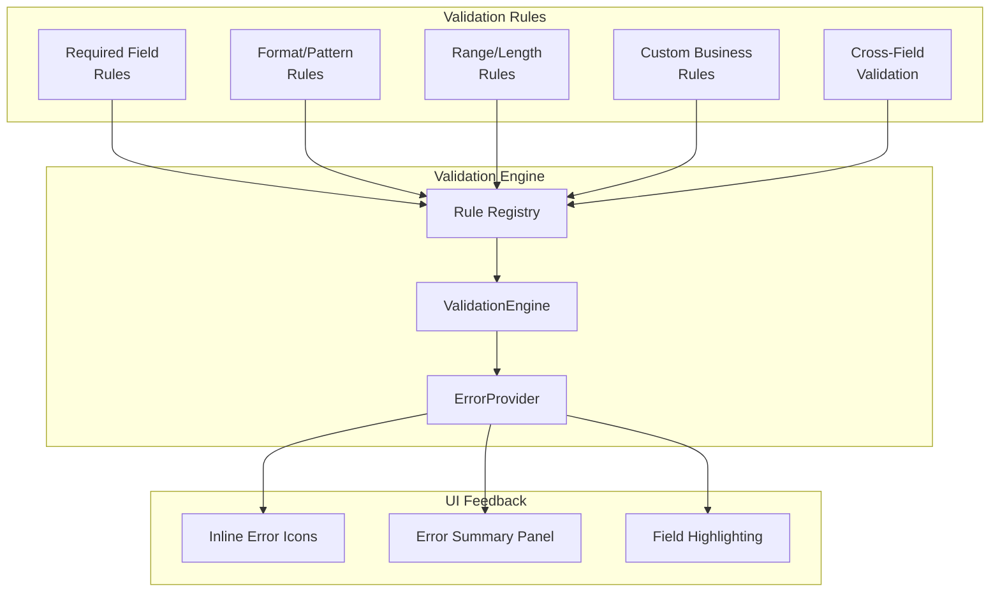

**Diagram: Validation System Architecture**

The validation system uses a rule-based approach where multiple validation rules can be attached to each form field. The ValidationEngine processes all rules and provides feedback through multiple UI mechanisms.

**Sources:** [UC/HIS.UC.FormType/Validation/]()

### Validation Rule Types

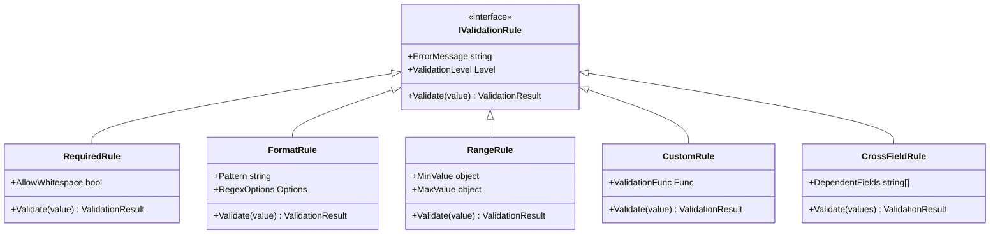

**Diagram: Validation Rule Class Hierarchy**

This hierarchy shows the different types of validation rules that can be applied to form fields. All rules implement the `IValidationRule` interface, allowing for consistent validation processing.

**Sources:** [UC/HIS.UC.FormType/Validation/]()

---

## Integration with Plugins

FormType is consumed by the 956 plugins throughout the system. The integration pattern follows a consistent approach:

### Plugin Integration Pattern

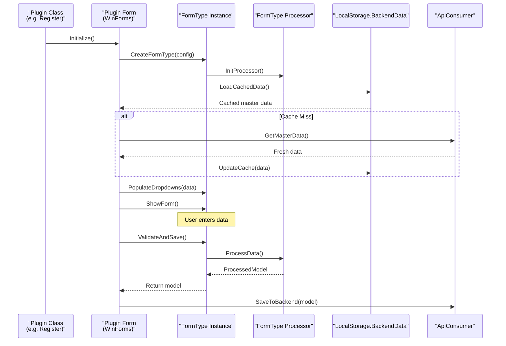

**Diagram: Plugin-FormType Integration Flow**

This sequence shows how plugins instantiate FormType components, load cached master data, and process user input before submitting to the backend API.

**Sources:** [UC/HIS.UC.FormType/Processor/](), [HIS/Plugins/](), [HIS/HIS.Desktop/HIS.Desktop.LocalStorage.BackendData/]()

### Common Integration Points

| Integration Point | Purpose | Example Usage |
|-------------------|---------|---------------|
| **FormType Factory** | Create form instances | `FormTypeManager.CreateForm(FormTypeEnum.PatientRegistration)` |
| **Data Loading** | Populate form with existing data | `formType.LoadData(patientADO)` |
| **Validation Trigger** | Validate before save | `if (formType.Validate()) { ... }` |
| **Data Retrieval** | Get user-entered data | `var model = formType.GetData<PatientADO>()` |
| **Event Handling** | React to form events | `formType.OnDataChanged += HandleDataChange` |
| **State Management** | Track form state | `formType.IsDirty`, `formType.IsValid` |

**Sources:** [UC/HIS.UC.FormType/Core/](), [HIS/Plugins/]()

---

## Configuration System

FormType uses a configuration-based approach to define form structure, allowing forms to be customized without code changes:

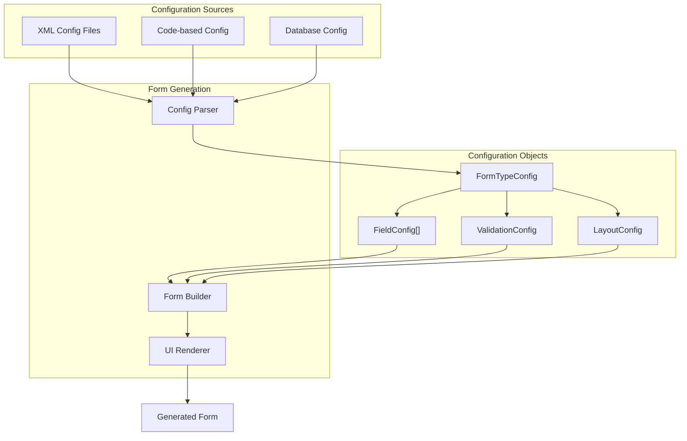

**Diagram: Configuration-Based Form Generation**

The configuration system allows forms to be defined declaratively through XML, code, or database configuration. The parser reads these configurations and the builder generates the corresponding UI.

**Sources:** [UC/HIS.UC.FormType/Config/](), [UC/HIS.UC.FormType/Design/]()

### Configuration Example Structure

A typical form configuration includes:

| Configuration Section | Elements | Purpose |
|----------------------|----------|---------|
| **Form Metadata** | Title, size, modal behavior | Define form appearance and behavior |
| **Field Definitions** | Field name, type, label, order | Define what fields appear on the form |
| **Validation Rules** | Required, format, range constraints | Define data validation requirements |
| **Layout Rules** | Rows, columns, grouping | Define how fields are arranged |
| **Data Binding** | Model property mappings | Define how fields map to data models |
| **Localization** | Resource keys for labels | Support multiple languages |

**Sources:** [UC/HIS.UC.FormType/Config/](), [UC/HIS.UC.FormType/Resources/]()

---

## Localization Support

FormType integrates with the system's localization infrastructure to support multiple languages:

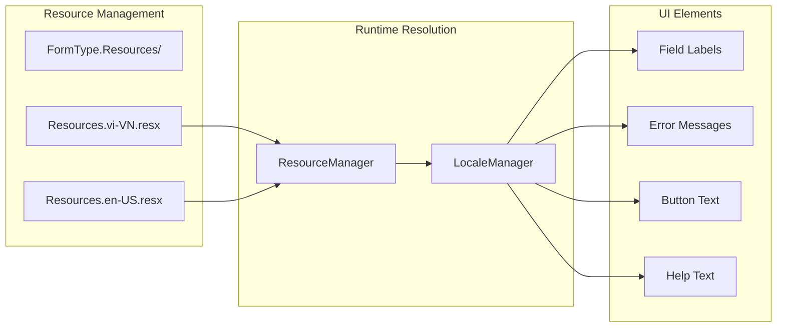

**Diagram: Localization System for FormType**

The localization system uses .resx resource files for different languages. At runtime, the LocaleManager selects the appropriate resource based on the current culture setting.

**Sources:** [UC/HIS.UC.FormType/Resources/](), [HIS/HIS.Desktop/HIS.Desktop.LocalStorage.ConfigApplication/]()

---

## Base Classes and Inheritance

FormType provides several base classes that can be extended for specific form types:

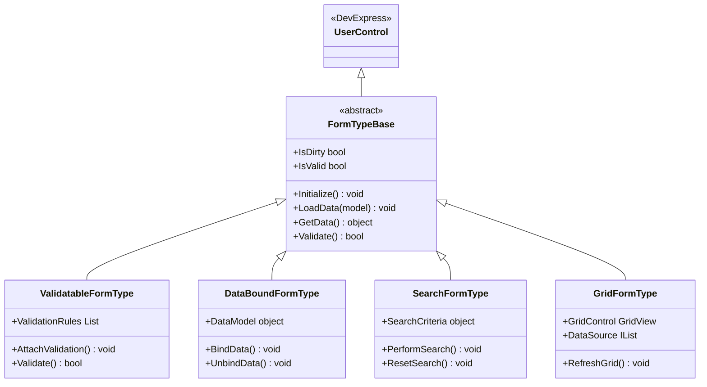

**Diagram: FormType Base Class Hierarchy**

This hierarchy shows the inheritance structure of FormType base classes. All form types inherit from `FormTypeBase`, which provides core functionality, and specialized classes add specific capabilities.

**Sources:** [UC/HIS.UC.FormType/Base/](), [Common/Inventec.UC/]()

---

## Common Form Patterns

### Master-Detail Forms

Many clinical forms use a master-detail pattern where a main form shows summary information and detail forms show related data:

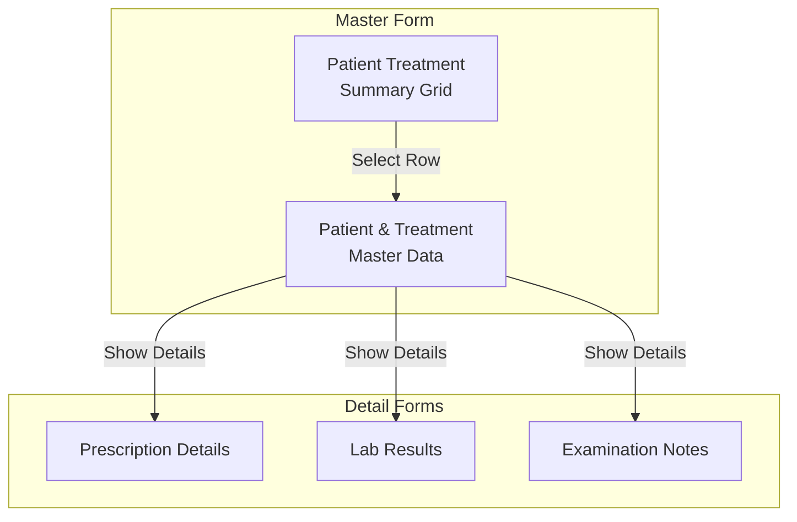

**Diagram: Master-Detail Form Pattern**

Master-detail forms allow users to navigate from summary views to detailed information. FormType provides specialized support for this pattern with synchronized data loading and change tracking.

**Sources:** [UC/HIS.UC.FormType/Design/]()

### Wizard Forms

Multi-step processes use wizard forms that guide users through sequential steps:

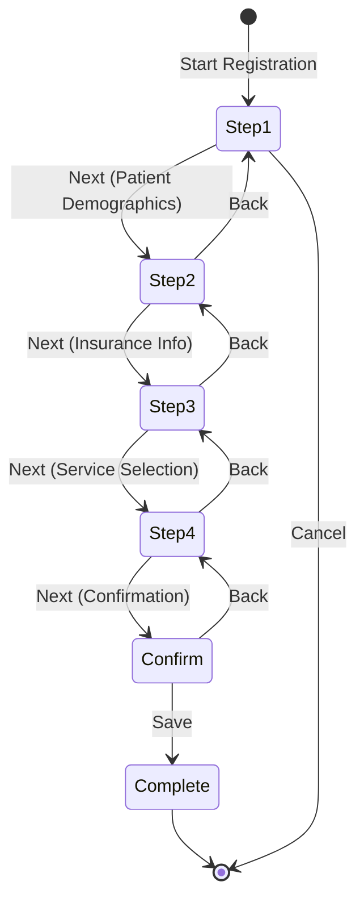

**Diagram: Wizard Form State Machine**

Wizard forms guide users through multi-step processes with forward/back navigation and validation at each step. FormType manages the wizard state and ensures data consistency across steps.

**Sources:** [UC/HIS.UC.FormType/Processor/]()

---

## Performance Optimizations

Given the scale of the system (956 plugins, 329 files in FormType alone), several performance optimizations are implemented:

| Optimization | Technique | Benefit |
|--------------|-----------|---------|
| **Lazy Loading** | Form components loaded on demand | Faster initial load time |
| **Control Pooling** | Reuse form instances instead of recreating | Reduced memory allocation |
| **Virtual Scrolling** | Load only visible rows in grids | Handle large datasets efficiently |
| **Cached Lookups** | Cache master data in LocalStorage.BackendData | Minimize API calls |
| **Deferred Validation** | Validate on save rather than on every keystroke | Improved responsiveness |
| **Async Operations** | Non-blocking API calls during form operations | Better user experience |

**Sources:** [UC/HIS.UC.FormType/](), [HIS/HIS.Desktop/HIS.Desktop.LocalStorage.BackendData/]()

---

## Extension Points

FormType provides several extension points for plugins to customize behavior:

### Custom Validators

Plugins can register custom validation rules:

```
IValidationRule customRule = new CustomValidationRule(value => {
    // Custom validation logic
    return isValid ? ValidationResult.Success : ValidationResult.Error("Custom error");
});

formType.AddValidationRule("fieldName", customRule);
```

### Custom Processors

Plugins can implement custom data processors:

```
IFormProcessor customProcessor = new CustomFormProcessor();
formType.RegisterProcessor(customProcessor);
```

### Event Hooks

Plugins can hook into form lifecycle events:

- `OnFormInitialized` - After form creation
- `OnDataLoading` - Before data load
- `OnDataLoaded` - After data load
- `OnValidating` - During validation
- `OnSaving` - Before save
- `OnSaved` - After save
- `OnError` - On error occurrence

**Sources:** [UC/HIS.UC.FormType/Core/](), [UC/HIS.UC.FormType/Processor/]()

---

## Integration with Backend Data

FormType integrates tightly with the caching and API layers:

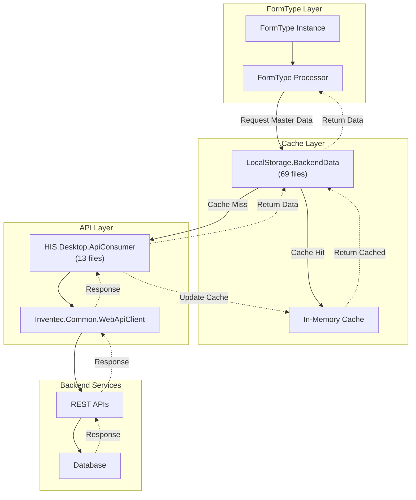

**Diagram: FormType Backend Integration with Caching**

This diagram shows how FormType accesses backend data through the LocalStorage.BackendData caching layer, which minimizes API calls by maintaining an in-memory cache of frequently accessed data.

**Sources:** [UC/HIS.UC.FormType/](), [HIS/HIS.Desktop/HIS.Desktop.LocalStorage.BackendData/](), [HIS/HIS.Desktop/HIS.Desktop.ApiConsumer/]()

---

## Typical Usage Examples

### Example 1: Patient Registration Form

A typical patient registration plugin would use FormType as follows:

1. **Create Form Instance**: Call `FormTypeManager.CreateForm()` with patient registration configuration
2. **Load Master Data**: Retrieve genders, ethnic groups, provinces from `BackendData` cache
3. **Populate Dropdowns**: Bind master data to combo boxes
4. **Show Form**: Display form to user
5. **Handle Input**: User enters patient demographic information
6. **Validate**: Call `formType.Validate()` when user clicks Save
7. **Get Data**: Retrieve validated data via `formType.GetData<PatientADO>()`
8. **Submit**: Send data to backend via `ApiConsumer`
9. **Handle Response**: Update UI based on success/failure

**Sources:** [UC/HIS.UC.FormType/](), [HIS/Plugins/HIS.Desktop.Plugins.Register*/]()

### Example 2: Prescription Entry Form

A prescription entry form demonstrates more complex usage:

1. **Create Master-Detail Form**: Main form shows treatment, detail shows medications
2. **Load Treatment Data**: Retrieve patient treatment from cache
3. **Load Medicine List**: Get available medicines from inventory
4. **Setup Grid**: Configure medication grid with columns for drug, dosage, frequency
5. **Add Rows**: User adds medications to grid
6. **Cross-Field Validation**: Validate drug interactions and dosage limits
7. **Calculate Totals**: Sum total medication costs
8. **Batch Validation**: Validate entire prescription
9. **Submit**: Save prescription to backend

**Sources:** [UC/HIS.UC.FormType/](), [HIS/Plugins/HIS.Desktop.Plugins.AssignPrescription*/]()

---

## Relationship to Other Components

FormType works in concert with several other major components:

| Component | Relationship | Integration Points |
|-----------|--------------|-------------------|
| **HIS.UC.UCHein (153 files)** | Insurance validation forms | FormType hosts UCHein control for insurance data entry |
| **His.UC.CreateReport (165 files)** | Report parameter forms | FormType creates report filter forms |
| **HIS.UC.Icd (65 files)** | Diagnosis code entry | FormType embeds ICD code selector |
| **HIS.Desktop.ADO (74 files)** | Data models | FormType binds to ADO models |
| **HIS.Desktop.ApiConsumer** | Backend communication | FormType uses ApiConsumer for save operations |
| **LocalStorage.BackendData** | Data caching | FormType retrieves cached master data |

**Sources:** [UC/HIS.UC.FormType/](), [UC/](), [HIS/HIS.Desktop/]()

---

## Development Guidelines

When working with FormType or creating new form types:

### Best Practices

1. **Reuse Existing Forms**: Check if a suitable form type already exists before creating a new one
2. **Follow Naming Conventions**: Use descriptive names that indicate form purpose
3. **Implement Validation**: Always add appropriate validation rules
4. **Handle Errors Gracefully**: Provide clear error messages to users
5. **Use Caching**: Leverage LocalStorage.BackendData for master data
6. **Test Thoroughly**: Validate all user input paths and edge cases
7. **Document Configuration**: Provide XML schema or code comments for form configs
8. **Respect Lifecycle**: Properly initialize and dispose form resources

### Anti-Patterns to Avoid

- **Direct API Calls**: Always go through ApiConsumer and BackendData
- **Hardcoded Strings**: Use resource files for all user-facing text
- **Tight Coupling**: Avoid direct dependencies between form types
- **Synchronous Blocking**: Use async operations for time-consuming tasks
- **Memory Leaks**: Always unsubscribe from events and dispose controls

**Sources:** [UC/HIS.UC.FormType/](), [HIS/HIS.Desktop/]()

---

## Summary

`HIS.UC.FormType` is the foundational form engine for the entire HIS system, providing:

- **Consistency**: Standardized form layout and behavior across 956 plugins
- **Reusability**: Common form patterns that reduce code duplication
- **Configurability**: XML/code-based form definitions for easy customization
- **Validation**: Comprehensive validation system with built-in and custom rules
- **Performance**: Optimized data binding and caching for large datasets
- **Localization**: Multi-language support through resource files
- **Extensibility**: Plugin points for custom validation and processing

With 329 files, FormType is one of the most complex components in the UC library, but its comprehensive feature set makes it the go-to solution for all data entry needs across the hospital information system.

**Sources:** [UC/HIS.UC.FormType/](), [`.devin/wiki.json:210-213`](../../../../.devin/wiki.json#L210-L213)

# Patient & Treatment UCs


## Purpose and Scope

This document covers the User Control (UC) components in the `UC/` module that handle patient information and treatment workflow interfaces. These reusable UI components are embedded into various HIS plugins to provide consistent patient selection, treatment management, hospitalization, and health insurance functionality across the application.

For general information about the UC library architecture, see [UC Components Library](../../02-modules/uc-controls/form-type-controls.md). For form-based controls, see [Form Type Controls](#1.3.1). For medicine and diagnosis controls, see [Medicine & ICD UCs](#1.3.3).

## Overview

The Patient & Treatment UC collection consists of 8 major user control projects that provide specialized interfaces for patient and treatment workflows:

| UC Component | Files | Primary Purpose |
|--------------|-------|-----------------|
| `HIS.UC.ExamTreatmentFinish` | 103 | Comprehensive treatment conclusion interface for examination workflows |
| `HIS.UC.TreatmentFinish` | 94 | Standard treatment finishing and discharge management |
| `HIS.UC.KskContract` | 59 | Health examination contract management |
| `HIS.UC.Hospitalize` | 53 | Hospital admission and transfer workflows |
| `HIS.UC.Death` | 47 | Patient death record and documentation |
| `HIS.UC.UCPatientRaw` | 47 | Raw patient data display and editing |
| `His.UC.UCHeniInfo` | 47 | Health insurance (BHYT) information display |
| `HIS.UC.PatientSelect` | 39 | Patient search and selection interface |

These components follow a consistent architecture pattern where each UC exposes a processor-based interface for initialization, data binding, and event handling. They are designed to be embedded in multiple plugins while maintaining centralized business logic.

**Sources:** [UC/HIS.UC.ExamTreatmentFinish](), [UC/HIS.UC.TreatmentFinish](), [UC/HIS.UC.PatientSelect](), [UC/HIS.UC.Hospitalize](), [UC/HIS.UC.Death](), [UC/HIS.UC.UCPatientRaw](), [UC/His.UC.UCHeniInfo](), [UC/HIS.UC.KskContract]()

## Architecture Overview

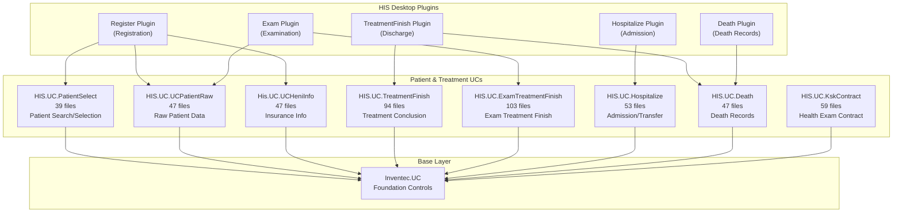

**Sources:** [UC/HIS.UC.PatientSelect](), [UC/HIS.UC.TreatmentFinish](), [UC/HIS.UC.ExamTreatmentFinish](), [UC/HIS.UC.Hospitalize](), [UC/HIS.UC.Death]()

## UC Component Structure Pattern

Each Patient & Treatment UC follows a consistent processor-based architecture:

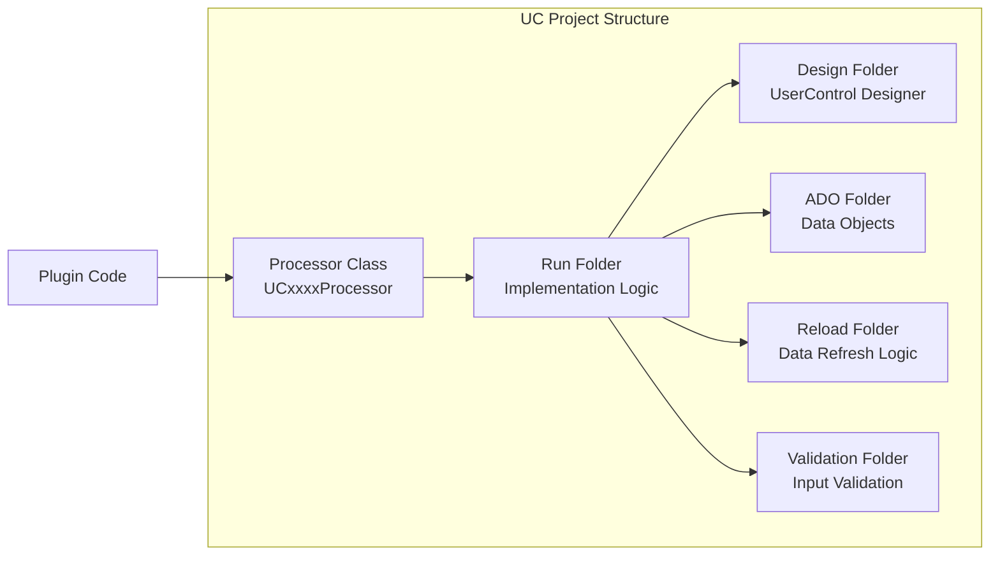

### Common Files in Each UC

| File/Folder | Purpose |
|-------------|---------|
| [[`UCxxxxProcessor.cs`](../../../UCxxxxProcessor.cs)](../../../UCxxxxProcessor.cs) | Main processor class exposing UC initialization and control methods |
| [[`Run/UCxxxx.cs`](../../../Run/UCxxxx.cs)](../../../Run/UCxxxx.cs) | Core UserControl implementation with UI logic |
| [[`Run/UCxxxx.Designer.cs`](../../../Run/UCxxxx.Designer.cs)](../../../Run/UCxxxx.Designer.cs) | Auto-generated designer code for the UserControl |
| `ADO/` | Application Data Objects specific to this UC |
| `Reload/` | Data refresh and reload delegates |
| `Validation/` | Input validation rules and logic |
| `Set/` | Setter methods for configuring UC behavior |
| `Get/` | Getter methods for retrieving UC state |

**Sources:** [UC/HIS.UC.PatientSelect](), [UC/HIS.UC.TreatmentFinish]()

## PatientSelect UC

The `HIS.UC.PatientSelect` component (39 files) provides patient search and selection interfaces used throughout the application for identifying and selecting patients in various workflows.

### Key Components

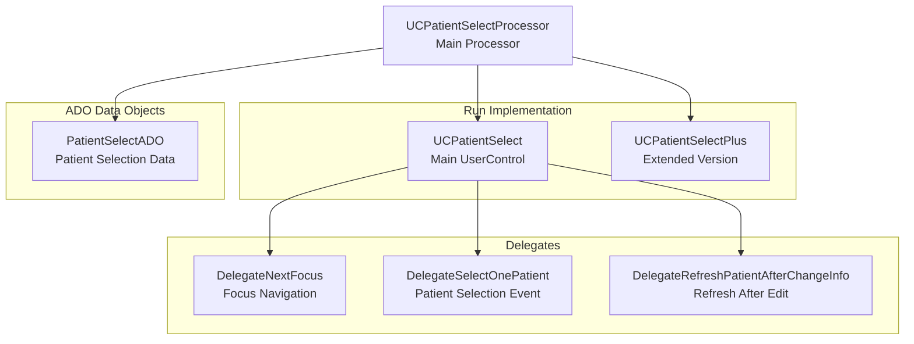

### Core Functionality

The PatientSelect UC provides:

- **Patient Search**: By patient code, name, phone number, ID card
- **Quick Selection**: Frequently accessed patients, recent patients
- **Patient Information Display**: Basic demographics and treatment history
- **New Patient Entry**: Inline patient registration capability
- **Validation**: Patient code format, duplicate checking

**Sources:** [`UC/HIS.UC.PatientSelect/UCPatientSelectProcessor.cs`](../../../UC/HIS.UC.PatientSelect/UCPatientSelectProcessor.cs)), [`UC/HIS.UC.PatientSelect/Run/UCPatientSelect.cs`](../../../UC/HIS.UC.PatientSelect/Run/UCPatientSelect.cs)), [`UC/HIS.UC.PatientSelect/ADO/PatientSelectADO.cs`](../../../UC/HIS.UC.PatientSelect/ADO/PatientSelectADO.cs))

## TreatmentFinish UC

The `HIS.UC.TreatmentFinish` component (94 files) handles the treatment conclusion workflow, including discharge planning, treatment summary, and final diagnosis confirmation.

### Architecture

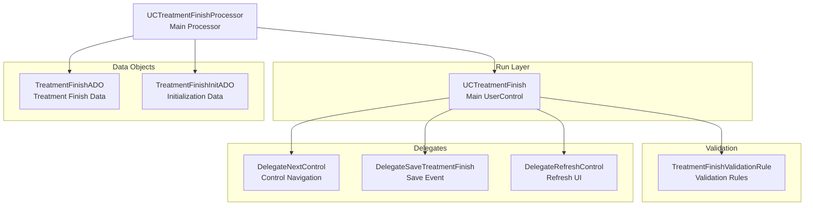

### Key Features

| Feature | Description |
|---------|-------------|
| **Treatment End Type** | Configure discharge type: discharge, transfer, death, etc. |
| **Treatment Result** | Record treatment outcome: cured, improved, unchanged, worse |
| **Appointment Scheduling** | Set follow-up appointment dates and instructions |
| **Medical Instructions** | Document discharge instructions and care plan |
| **Prescription Summary** | Review prescribed medications for discharge |
| **Treatment Summary** | Auto-generate treatment summary report |

### Configuration Options

The TreatmentFinish UC supports extensive configuration through `TreatmentFinishInitADO`:

- `IsShowAppointment`: Enable/disable appointment scheduling
- `IsShowTreatmentResult`: Show treatment result selection
- `IsShowTreatmentEndType`: Show treatment end type dropdown
- `IsShowEndTimeInDay`: Show end time in current day only
- `IsShowPrintButton`: Display print preview button
- `IsAutoCheckEndTime`: Auto-check end time validation

**Sources:** [`UC/HIS.UC.TreatmentFinish/UCTreatmentFinishProcessor.cs`](../../../UC/HIS.UC.TreatmentFinish/UCTreatmentFinishProcessor.cs)), [`UC/HIS.UC.TreatmentFinish/Run/UCTreatmentFinish.cs`](../../../UC/HIS.UC.TreatmentFinish/Run/UCTreatmentFinish.cs)), [`UC/HIS.UC.TreatmentFinish/ADO/TreatmentFinishADO.cs`](../../../UC/HIS.UC.TreatmentFinish/ADO/TreatmentFinishADO.cs)), [`UC/HIS.UC.TreatmentFinish/ADO/TreatmentFinishInitADO.cs`](../../../UC/HIS.UC.TreatmentFinish/ADO/TreatmentFinishInitADO.cs))

## ExamTreatmentFinish UC

The `HIS.UC.ExamTreatmentFinish` component (103 files) is the most comprehensive treatment finishing interface, combining examination results, treatment summary, and discharge planning in a unified workflow.

### Component Architecture

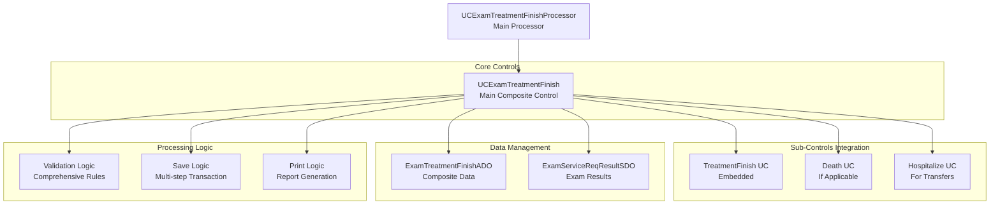

### Workflow Integration

The ExamTreatmentFinish UC integrates multiple sub-workflows:

1. **Examination Results Entry**: Clinical findings, diagnosis, treatment plan
2. **Treatment Conclusion**: Using embedded `TreatmentFinish` UC
3. **Conditional Workflows**:
   - If patient dies: Activate `Death` UC for death certificate
   - If patient transfers: Activate `Hospitalize` UC for transfer
   - If patient discharged: Standard discharge workflow
4. **Document Generation**: Auto-print relevant medical documents

### Key Data Objects

| Class | Purpose |
|-------|---------|
| `ExamTreatmentFinishADO` | Complete examination and treatment conclusion data |
| `ExamServiceReqResultSDO` | Examination service request results |
| `HisServiceReqExamResultSDO` | Detailed exam result data transfer object |
| `TreatmentFinishSDO` | Treatment finish service data object |

**Sources:** [`UC/HIS.UC.ExamTreatmentFinish/UCExamTreatmentFinishProcessor.cs`](../../../UC/HIS.UC.ExamTreatmentFinish/UCExamTreatmentFinishProcessor.cs)), [`UC/HIS.UC.ExamTreatmentFinish/Run/UCExamTreatmentFinish.cs`](../../../UC/HIS.UC.ExamTreatmentFinish/Run/UCExamTreatmentFinish.cs)), [UC/HIS.UC.ExamTreatmentFinish/ADO/]()

## Hospitalize UC

The `HIS.UC.Hospitalize` component (53 files) manages hospital admission and patient transfer workflows between departments or facilities.

### Functional Components

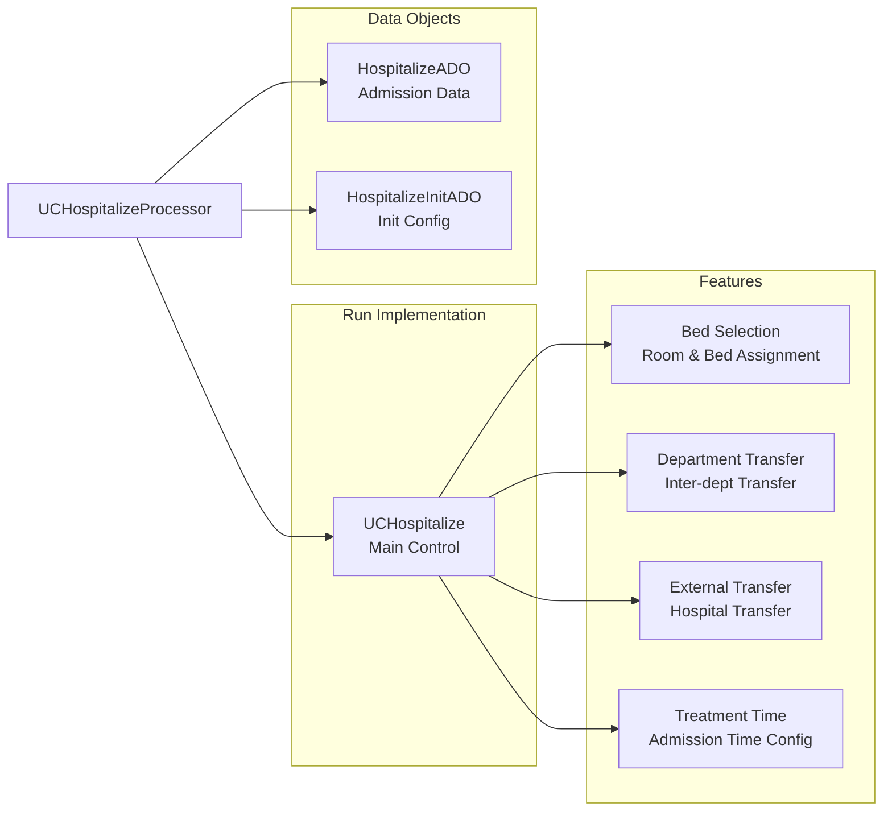

### Admission Types

The Hospitalize UC handles multiple admission scenarios:

| Type | Description | Data Required |
|------|-------------|---------------|
| **New Admission** | Patient admission to hospital | Department, room, bed, admission reason |
| **Department Transfer** | Move between departments | Source dept, target dept, bed assignment |
| **Hospital Transfer** | Transfer to external facility | Transfer hospital, reason, medical summary |
| **Emergency Admission** | Fast-track admission | Emergency dept, priority bed assignment |

### Configuration Options

- `IsShowBedRoom`: Display bed and room selection
- `IsShowDepartment`: Show department selection
- `IsShowTreatmentType`: Display treatment type (inpatient/outpatient)
- `IsAutoSelectBed`: Automatically select available bed
- `IsRequireBed`: Make bed selection mandatory
- `IsShowTime`: Show admission time configuration

**Sources:** [`UC/HIS.UC.Hospitalize/UCHospitalizeProcessor.cs`](../../../UC/HIS.UC.Hospitalize/UCHospitalizeProcessor.cs)), [`UC/HIS.UC.Hospitalize/Run/UCHospitalize.cs`](../../../UC/HIS.UC.Hospitalize/Run/UCHospitalize.cs)), [`UC/HIS.UC.Hospitalize/ADO/HospitalizeADO.cs`](../../../UC/HIS.UC.Hospitalize/ADO/HospitalizeADO.cs))

## Death UC

The `HIS.UC.Death` component (47 files) handles patient death record creation and death certificate documentation, ensuring proper medical and legal documentation.

### Component Structure

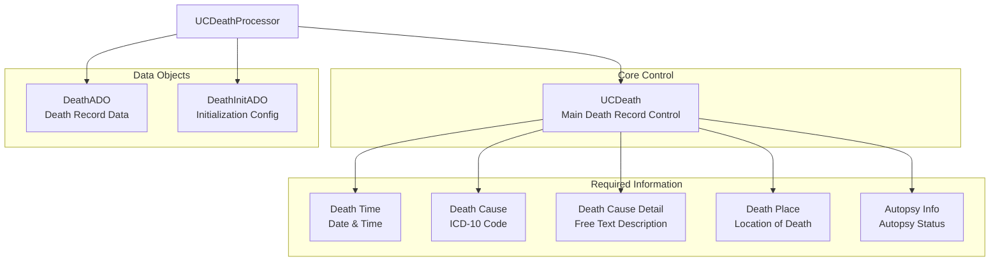

### Death Record Fields

| Field | Type | Required | Description |
|-------|------|----------|-------------|
| `DeathTime` | DateTime | Yes | Exact date and time of death |
| `DeathCauseId` | ICD-10 | Yes | Primary cause of death (ICD code) |
| `DeathCause` | String | No | Detailed cause description |
| `DeathWithin` | Enum | No | Death within 24h/48h of admission |
| `Surgery` | Boolean | No | Death related to surgery |
| `DeathMainCause` | String | No | Main underlying cause |
| `DeathDocumentTypeId` | Long | No | Type of death certificate |
| `DeathPlace` | String | No | Location where death occurred |
| `AutopsyRequest` | Boolean | No | Whether autopsy requested |

### Integration with TreatmentFinish

When a patient dies, the Death UC is typically embedded within the TreatmentFinish or ExamTreatmentFinish workflow. The death record automatically sets the treatment end type to "Death" and generates appropriate documentation.

**Sources:** [`UC/HIS.UC.Death/UCDeathProcessor.cs`](../../../UC/HIS.UC.Death/UCDeathProcessor.cs)), [`UC/HIS.UC.Death/Run/UCDeath.cs`](../../../UC/HIS.UC.Death/Run/UCDeath.cs)), [`UC/HIS.UC.Death/ADO/DeathADO.cs`](../../../UC/HIS.UC.Death/ADO/DeathADO.cs))

## UCPatientRaw UC

The `HIS.UC.UCPatientRaw` component (47 files) provides a comprehensive patient data display and editing interface, showing raw patient demographic and clinical information.

### Display Sections

```mermaid
graph TB
    Processor["UCPatientRawProcessor"]
    
    subgraph "Information Sections"
        Demographics["Demographics<br/>Name, DOB, Gender"]
        Contact["Contact Info<br/>Address, Phone"]
        Identity["Identity<br/>ID Card, Passport"]
        Insurance["Insurance<br/>BHYT Info"]
        Ethnic["Ethnic & Religion<br/>Ethnicity, Religion"]
        Relative["Relative Info<br/>Emergency Contact"]
        Other["Other Info<br/>Occupation, Workplace"]
    end
    
    Processor --> Demographics
    Processor --> Contact
    Processor --> Identity
    Processor --> Insurance
    Processor --> Ethnic
    Processor --> Relative
    Processor --> Other
```

### Key Features

- **Read-Only Mode**: Display patient information without editing capability
- **Edit Mode**: Allow inline editing of patient data fields
- **Required Field Validation**: Enforce required fields based on configuration
- **Format Validation**: Validate phone numbers, ID cards, etc.
- **History Tracking**: Show previous addresses and contact information
- **Data Sync**: Automatic synchronization with backend patient master data

**Sources:** [`UC/HIS.UC.UCPatientRaw/UCPatientRawProcessor.cs`](../../../UC/HIS.UC.UCPatientRaw/UCPatientRawProcessor.cs)), [`UC/HIS.UC.UCPatientRaw/Run/UCPatientRaw.cs`](../../../UC/HIS.UC.UCPatientRaw/Run/UCPatientRaw.cs))

## UCHeniInfo UC

The `His.UC.UCHeniInfo` component (47 files) displays Vietnamese health insurance (Bảo Hiểm Y Tế - BHYT) information and validates insurance eligibility.

### Insurance Information Display

```mermaid
graph LR
    Processor["UCHeniInfoProcessor"]
    
    subgraph "Insurance Data"
        HeinCard["BHYT Card<br/>Card Number & Validity"]
        Coverage["Coverage Info<br/>Coverage Level & Type"]
        RegisterPlace["Register Place<br/>Registration Hospital"]
        ValidPeriod["Valid Period<br/>From/To Dates"]
        RightRoute["Right Route<br/>Proper Referral Path"]
    end
    
    subgraph "Validation"
        CardValidation["Card Validation<br/>Check Card Format"]
        DateValidation["Date Validation<br/>Check Validity Period"]
        RouteCheck["Route Check<br/>Verify Treatment Path"]
    end
    
    Processor --> HeinCard
    Processor --> Coverage
    Processor --> RegisterPlace
    Processor --> ValidPeriod
    Processor --> RightRoute
    
    HeinCard --> CardValidation
    ValidPeriod --> DateValidation
    RightRoute --> RouteCheck
```

### BHYT Validation Rules

The UCHeniInfo component performs real-time validation:

- **Card Format**: Validates BHYT card number format (15-character format)
- **Validity Period**: Checks if treatment date falls within insurance validity
- **Right Route**: Verifies patient is following proper referral pathway
- **Coverage Level**: Determines co-payment percentage based on coverage
- **Registration Hospital**: Checks if patient is at registered hospital

### Integration with Registration

This UC is embedded in patient registration workflows to:
1. Capture insurance information during check-in
2. Validate insurance eligibility before service delivery
3. Calculate patient co-payment amounts
4. Generate insurance claim documentation

**Sources:** [`UC/His.UC.UCHeniInfo/UCHeniInfoProcessor.cs`](../../../UC/His.UC.UCHeniInfo/UCHeniInfoProcessor.cs)), [`UC/His.UC.UCHeniInfo/Run/UCHeniInfo.cs`](../../../UC/His.UC.UCHeniInfo/Run/UCHeniInfo.cs))

## KskContract UC

The `HIS.UC.KskContract` component (59 files) manages health examination contracts (Khám Sức Khỏe - KSK), typically for corporate health screening programs.

### Contract Management

```mermaid
graph TB
    Processor["UCKskContractProcessor"]
    
    subgraph "Contract Information"
        ContractDetails["Contract Details<br/>Contract Code, Period"]
        CompanyInfo["Company Info<br/>Organization Details"]
        ServicePackage["Service Package<br/>Exam Package Details"]
        EmployeeList["Employee List<br/>Contract Participants"]
    end
    
    subgraph "Exam Processing"
        Scheduling["Scheduling<br/>Appointment Booking"]
        ServiceExecution["Service Execution<br/>Exam Services"]
        ResultEntry["Result Entry<br/>Exam Results"]
        Reporting["Reporting<br/>Contract Reports"]
    end
    
    Processor --> ContractDetails
    Processor --> CompanyInfo
    Processor --> ServicePackage
    Processor --> EmployeeList
    
    ContractDetails --> Scheduling
    ServicePackage --> ServiceExecution
    ServiceExecution --> ResultEntry
    ResultEntry --> Reporting
```

### Contract Workflow

| Step | Description | UC Function |
|------|-------------|-------------|
| 1. Contract Setup | Create contract with company and service package | Contract creation interface |
| 2. Employee Registration | Register employees under contract | Employee list management |
| 3. Appointment Booking | Schedule examination appointments | Integration with scheduling system |
| 4. Examination Execution | Perform contracted health exams | Service execution tracking |
| 5. Result Management | Enter and review examination results | Result entry interface |
| 6. Report Generation | Generate individual and aggregate reports | Report compilation |

### Key Features

- **Bulk Registration**: Register multiple employees at once
- **Package Management**: Define examination packages with service bundles
- **Progress Tracking**: Monitor examination completion status
- **Result Aggregation**: Compile results across all contract participants
- **Invoice Generation**: Generate invoices based on contract terms

**Sources:** [`UC/HIS.UC.KskContract/UCKskContractProcessor.cs`](../../../UC/HIS.UC.KskContract/UCKskContractProcessor.cs)), [`UC/HIS.UC.KskContract/Run/UCKskContract.cs`](../../../UC/HIS.UC.KskContract/Run/UCKskContract.cs))

## Usage Patterns in Plugins

The Patient & Treatment UCs are consumed by plugins through the processor pattern:

```mermaid
graph LR
    subgraph "Plugin Code"
        PluginInit["Plugin Initialize"]
        PluginUI["Plugin Form"]
    end
    
    subgraph "UC Initialization"
        CreateProcessor["Create UC Processor"]
        InitData["Initialize with InitADO"]
        GenerateControl["Generate UserControl"]
        EmbedControl["Embed in Plugin Form"]
    end
    
    subgraph "Data Flow"
        SetData["Set UC Data<br/>via ADO objects"]
        GetData["Get UC Data<br/>from UC methods"]
        HandleEvents["Handle UC Events<br/>via Delegates"]
    end
    
    PluginInit --> CreateProcessor
    CreateProcessor --> InitData
    InitData --> GenerateControl
    GenerateControl --> EmbedControl
    
    PluginUI --> SetData
    PluginUI --> GetData
    PluginUI --> HandleEvents
```

### Typical Usage Example

A plugin using the TreatmentFinish UC follows this pattern:

1. **Initialization**: Create `UCTreatmentFinishProcessor` instance
2. **Configuration**: Set up `TreatmentFinishInitADO` with required options
3. **Generation**: Call `processor.Run(initADO)` to generate the UserControl
4. **Embedding**: Add returned UserControl to plugin's form
5. **Data Binding**: Load treatment data into UC using setter methods
6. **Event Handling**: Subscribe to UC events via delegates
7. **Data Retrieval**: Get final data from UC when user completes workflow

**Sources:** [HIS/Plugins/HIS.Desktop.Plugins.TreatmentFinish](), [HIS/Plugins/HIS.Desktop.Plugins.Hospitalize]()

## Common Integration Points

All Patient & Treatment UCs share common integration patterns:

| Integration Point | Purpose | Implementation |
|-------------------|---------|----------------|
| **HIS.Desktop.ADO** | Data transfer objects | UCs define ADO classes consumed by plugins |
| **HIS.Desktop.LocalStorage.BackendData** | Backend data cache | UCs access cached patient, treatment, and reference data |
| **HIS.Desktop.ApiConsumer** | API calls | UCs make API calls for CRUD operations |
| **Validation Rules** | Input validation | UCs implement `ValidationRule` classes for DevExpress validation |
| **Delegates** | Event callbacks | UCs expose delegates for plugin notification |
| **Resources** | Localization | UCs use resource files for multi-language support |

## UC Communication Patterns

Patient & Treatment UCs coordinate through several mechanisms:

```mermaid
graph TB
    subgraph "Plugin Container"
        PatientSelectUC["PatientSelect UC"]
        TreatmentFinishUC["TreatmentFinish UC"]
        HospitalizeUC["Hospitalize UC"]
        DeathUC["Death UC"]
    end
    
    subgraph "Communication Layer"
        DirectDelegate["Direct Delegates<br/>DelegateSelectPatient<br/>DelegateSaveTreatment"]
        SharedData["Shared ADO Objects<br/>PatientADO<br/>TreatmentADO"]
        ParentPlugin["Parent Plugin<br/>Mediator Logic"]
    end
    
    PatientSelectUC -->|"Patient Selected"| DirectDelegate
    DirectDelegate -->|"Update Treatment"| TreatmentFinishUC
    
    TreatmentFinishUC -->|"If Death"| ParentPlugin
    ParentPlugin -->|"Activate"| DeathUC
    
    TreatmentFinishUC -->|"If Transfer"| ParentPlugin
    ParentPlugin -->|"Activate"| HospitalizeUC
    
    PatientSelectUC -.->|"Share Data"| SharedData
    TreatmentFinishUC -.->|"Share Data"| SharedData
    HospitalizeUC -.->|"Share Data"| SharedData
```

### Delegate Pattern

Each UC exposes typed delegates for inter-component communication:

- `DelegateSelectOnePatient`: Fired when patient is selected
- `DelegateSaveTreatmentFinish`: Fired when treatment finish is saved
- `DelegateRefreshControl`: Fired when UC needs refresh
- `DelegateNextControl`: Fired when focus should move to next control

**Sources:** [UC/HIS.UC.PatientSelect/Delegate/](), [UC/HIS.UC.TreatmentFinish/Delegate/](), [UC/HIS.UC.ExamTreatmentFinish/Delegate/]()

## Data Validation Architecture

Patient & Treatment UCs implement comprehensive validation using the DevExpress validation framework:

| UC | Key Validation Rules | File References |
|----|---------------------|-----------------|
| `PatientSelect` | Patient code format, required name | [UC/HIS.UC.PatientSelect/Validation/]() |
| `TreatmentFinish` | End time >= start time, required end type | [UC/HIS.UC.TreatmentFinish/Validation/]() |
| `Death` | Death time <= current time, required cause | [UC/HIS.UC.Death/Validation/]() |
| `Hospitalize` | Required bed/room, valid department | [UC/HIS.UC.Hospitalize/Validation/]() |

Validation rules are applied at multiple levels:
- **Field-level**: Individual control validation on user input
- **Form-level**: Cross-field validation before submission
- **Business-level**: Server-side validation via API calls

**Sources:** [`UC/HIS.UC.TreatmentFinish/Validation/TreatmentFinishValidationRule.cs`](../../../UC/HIS.UC.TreatmentFinish/Validation/TreatmentFinishValidationRule.cs)), [UC/HIS.UC.Death/Validation/]()

## Summary

The Patient & Treatment UC collection provides a comprehensive, reusable foundation for patient management and treatment workflows throughout the HIS application. These 8 major components (totaling 530 files) encapsulate complex medical workflows while maintaining consistency across 956+ plugins. The processor-based architecture enables flexible embedding, while the delegate pattern ensures loose coupling between components. All UCs follow standardized patterns for initialization, data binding, validation, and event handling, making them predictable and maintainable.

**Sources:** [UC/HIS.UC.PatientSelect](), [UC/HIS.UC.TreatmentFinish](), [UC/HIS.UC.ExamTreatmentFinish](), [UC/HIS.UC.Hospitalize](), [UC/HIS.UC.Death](), [UC/HIS.UC.UCPatientRaw](), [UC/His.UC.UCHeniInfo](), [UC/HIS.UC.KskContract]()

# Medicine & ICD UCs


## Purpose and Scope

This document covers the User Control components in the `UC/` module that handle medicine, materials, and medical diagnosis (ICD) coding functionality. These UCs provide reusable UI components for selecting, displaying, and managing pharmaceutical items and disease classifications throughout the HIS application.

The primary UCs documented here are:
- **HIS.UC.MedicineType** (82 files) - Medicine selection and management controls
- **HIS.UC.MaterialType** (85 files) - Medical material/supplies controls
- **HIS.UC.Icd** (65 files) - Primary diagnosis (ICD-10) selection
- **HIS.UC.SecondaryIcd** (61 files) - Secondary/comorbidity diagnosis selection
- **Supporting UCs**: DHST (vital signs), DateEditor, TreeSereServ7V2 (service tree)

For general UC architecture and patterns, see [UC Components Library](../../02-modules/uc-controls/form-type-controls.md). For patient and treatment-focused UCs, see [Patient & Treatment UCs](#1.3.2). For service and room-related controls, see [Service & Room UCs](#1.3.4).

## Architecture Overview

The Medicine & ICD UCs form a cohesive set of controls used extensively in prescription plugins, exam plugins, and treatment management workflows. These components provide standardized interfaces for pharmaceutical and diagnostic data entry across the 956 plugins in the HIS system.

```mermaid
graph TB
    subgraph "Medicine & ICD UC Components"
        MedicineType["HIS.UC.MedicineType<br/>82 files<br/>Medicine Selection"]
        MaterialType["HIS.UC.MaterialType<br/>85 files<br/>Material Selection"]
        Icd["HIS.UC.Icd<br/>65 files<br/>Primary Diagnosis"]
        SecondaryIcd["HIS.UC.SecondaryIcd<br/>61 files<br/>Secondary Diagnosis"]
        DHST["HIS.UC.DHST<br/>54 files<br/>Vital Signs"]
        DateEditor["HIS.UC.DateEditor<br/>55 files<br/>Date/Time Input"]
        TreeSereServ["HIS.UC.TreeSereServ7V2<br/>52 files<br/>Service Tree"]
    end
    
    subgraph "Plugin Consumers"
        AssignPrescription["HIS.Desktop.Plugins<br/>AssignPrescriptionPK<br/>203 files"]
        AssignPrescriptionCLS["HIS.Desktop.Plugins<br/>AssignPrescriptionCLS<br/>136 files"]
        ServiceExecute["HIS.Desktop.Plugins<br/>ServiceExecute<br/>119 files"]
        TreatmentFinish["HIS.Desktop.Plugins<br/>TreatmentFinish<br/>101 files"]
    end
    
    subgraph "Data Layer"
        BackendData["HIS.Desktop.LocalStorage<br/>BackendData<br/>Cached Medicine/ICD Data"]
        ApiConsumer["HIS.Desktop.ApiConsumer<br/>REST API Calls"]
    end
    
    AssignPrescription --> MedicineType
    AssignPrescription --> MaterialType
    AssignPrescriptionCLS --> MedicineType
    ServiceExecute --> Icd
    ServiceExecute --> SecondaryIcd
    TreatmentFinish --> Icd
    TreatmentFinish --> SecondaryIcd
    TreatmentFinish --> DHST
    
    MedicineType --> BackendData
    MaterialType --> BackendData
    Icd --> BackendData
    SecondaryIcd --> BackendData
    
    BackendData --> ApiConsumer
    
    DateEditor -.->|"Used By"| MedicineType
    DateEditor -.->|"Used By"| MaterialType
    TreeSereServ -.->|"Used By"| ServiceExecute
```

**Sources:** [`.devin/wiki.json:225-232`](../../../../.devin/wiki.json#L225-L232, [`.devin/wiki.json:70-77`](../../../../.devin/wiki.json#L70-L77, [`.devin/wiki.json:200-208`](../../../../.devin/wiki.json#L200-L208)

## HIS.UC.MedicineType Component

The `HIS.UC.MedicineType` component (82 files) provides a comprehensive interface for selecting and managing medicines in the system. This UC is one of the most frequently used components in prescription-related plugins.

### Core Functionality

| Functionality | Description |
|--------------|-------------|
| Medicine Search | Auto-complete search by medicine name, active ingredient, or code |
| Inventory Display | Real-time stock level display from `BackendData` cache |
| Batch Selection | Support for selecting specific medicine batches with expiry dates |
| Dosage Input | Integrated dosage, frequency, and instruction entry |
| Price Calculation | Automatic price calculation based on quantity and unit price |
| Insurance Support | BHYT (health insurance) medicine marking and validation |

### Component Structure

```mermaid
graph LR
    subgraph "HIS.UC.MedicineType Project Structure"
        UCMedicine["UCMedicineType.cs<br/>Main Control Class"]
        Processor["Processor/<br/>Business Logic"]
        Run["Run/<br/>UC Initialization"]
        ADO["ADO/<br/>Data Objects"]
        Design["Design/<br/>UI Designer Files"]
        Resources["Resources/<br/>Icons & Strings"]
    end
    
    subgraph "Key Classes"
        UCMedicineControl["UCMedicineTypeControl<br/>Main User Control"]
        MedicineTypeADO["MedicineTypeADO<br/>Display Model"]
        MedicineProcessor["MedicineTypeProcessor<br/>Selection Logic"]
        GridPopulator["GridPopulator<br/>Data Binding"]
    end
    
    subgraph "External Dependencies"
        HisMedicineType["MOS.EFMODEL.DataModels<br/>HIS_MEDICINE_TYPE"]
        MedicineInStock["HIS_MEDICINE_IN_STOCK"]
        BackendMedicine["BackendDataWorker<br/>Medicine Cache"]
    end
    
    UCMedicine --> Processor
    UCMedicine --> ADO
    UCMedicine --> Design
    Processor --> MedicineProcessor
    ADO --> MedicineTypeADO
    Design --> UCMedicineControl
    
    UCMedicineControl --> GridPopulator
    MedicineTypeADO --> HisMedicineType
    MedicineProcessor --> BackendMedicine
    BackendMedicine --> MedicineInStock
```

### Integration Pattern

The `MedicineType` UC follows a standardized integration pattern used throughout the UC library:

1. **Initialization**: Plugins call `UCMedicineTypeProcessor.Run()` with configuration parameters
2. **Data Binding**: UC retrieves medicine data from `HIS.Desktop.LocalStorage.BackendData.BackendDataWorker`
3. **User Interaction**: User searches/selects medicine via auto-complete grid
4. **Event Callback**: Selected medicine data returned via delegate callback
5. **Validation**: UC performs stock availability and insurance eligibility checks

**Sources:** [`.devin/wiki.json:225-232`](../../../../.devin/wiki.json#L225-L232, [`.devin/wiki.json:200-208`](../../../../.devin/wiki.json#L200-L208)

## HIS.UC.MaterialType Component

The `HIS.UC.MaterialType` component (85 files) mirrors the structure of `MedicineType` but handles medical materials, supplies, and consumables. This is the largest UC in the medicine/material category.

### Material vs Medicine Distinction

| Aspect | Medicine (HIS_MEDICINE_TYPE) | Material (HIS_MATERIAL_TYPE) |
|--------|------------------------------|------------------------------|
| Database Table | `HIS_MEDICINE_TYPE` | `HIS_MATERIAL_TYPE` |
| Regulatory | Requires pharmaceutical license | General medical supplies |
| Tracking | Batch + Expiry + Serial number | Batch + Expiry (optional serial) |
| Insurance | BHYT coding required | Limited BHYT coverage |
| Prescription | Requires doctor prescription | May not require prescription |
| Stock Management | Pharmacy inventory (`MEDI_STOCK`) | General medical stock |

### Component Architecture

```mermaid
graph TB
    subgraph "MaterialType UC - 85 files"
        MaterialControl["UCMaterialTypeControl<br/>Main Control"]
        MaterialADO["MaterialTypeADO<br/>Display Model"]
        MaterialProcessor["MaterialTypeProcessor<br/>Business Logic"]
        MaterialGrid["MaterialGridView<br/>DevExpress Grid"]
        MaterialSearch["MaterialSearchEngine<br/>Filter & Search"]
    end
    
    subgraph "Data Sources"
        MaterialTypeTable["HIS_MATERIAL_TYPE<br/>Master Data"]
        MaterialInStockTable["HIS_MATERIAL_IN_STOCK<br/>Inventory Levels"]
        MaterialBeanTable["HIS_MATERIAL_BEAN<br/>Batch Details"]
    end
    
    subgraph "Consumer Plugins"
        ExpMestCreate["ExpMestSaleCreate<br/>Material Export"]
        ImpMestCreate["ImpMestCreate<br/>Material Import"]
        MediStockSummary["MediStockSummary<br/>Inventory Summary"]
    end
    
    MaterialControl --> MaterialProcessor
    MaterialControl --> MaterialGrid
    MaterialProcessor --> MaterialSearch
    MaterialProcessor --> MaterialADO
    
    MaterialSearch --> MaterialTypeTable
    MaterialSearch --> MaterialInStockTable
    MaterialADO --> MaterialBeanTable
    
    ExpMestCreate --> MaterialControl
    ImpMestCreate --> MaterialControl
    MediStockSummary --> MaterialControl
```

### Key Features

The `MaterialType` UC includes several advanced features:

- **Multi-column Search**: Search across material code, name, manufacturer, and specification
- **Stock Filtering**: Option to show only in-stock items or all materials
- **Unit Conversion**: Handles multiple units of measure (box, vial, piece, etc.)
- **Supplier Tracking**: Display supplier information and last purchase price
- **Expiry Warning**: Visual indicators for near-expiry materials

**Sources:** [`.devin/wiki.json:225-232`](../../../../.devin/wiki.json#L225-L232, [`.devin/wiki.json:90-97`](../../../../.devin/wiki.json#L90-L97)

## HIS.UC.Icd Component

The `HIS.UC.Icd` component (65 files) provides ICD-10 code selection for primary diagnoses. This UC is critical for medical coding compliance and statistical reporting.

### ICD-10 Classification Structure

```mermaid
graph TB
    subgraph "ICD UC Hierarchy"
        IcdMain["HIS.UC.Icd<br/>Primary Diagnosis<br/>65 files"]
        SecondaryIcd["HIS.UC.SecondaryIcd<br/>Secondary Diagnoses<br/>61 files"]
    end
    
    subgraph "ICD Data Model"
        IcdTable["HIS_ICD<br/>ICD-10 Master Table"]
        IcdChapter["ICD_CHAPTER<br/>Chapter Groups A00-Z99"]
        IcdGroup["ICD_GROUP<br/>Block Ranges"]
        IcdCode["ICD_CODE<br/>Individual Codes"]
    end
    
    subgraph "Usage Context"
        ExamPlugin["ServiceExecute Plugin<br/>Exam Diagnosis"]
        TreatmentPlugin["TreatmentFinish Plugin<br/>Discharge Diagnosis"]
        TrackingPlugin["Tracking Plugin<br/>Treatment Tracking"]
    end
    
    IcdMain --> IcdTable
    SecondaryIcd --> IcdTable
    IcdTable --> IcdChapter
    IcdTable --> IcdGroup
    IcdTable --> IcdCode
    
    ExamPlugin --> IcdMain
    ExamPlugin --> SecondaryIcd
    TreatmentPlugin --> IcdMain
    TreatmentPlugin --> SecondaryIcd
    TrackingPlugin --> IcdMain
```

### Component Features

| Feature | Implementation |
|---------|---------------|
| **Search Methods** | By ICD code, disease name (Vietnamese), disease name (English) |
| **Hierarchical View** | Tree structure showing chapters (A00-B99, C00-D48, etc.) |
| **Favorites** | Quick access to frequently used diagnoses |
| **History** | Recent ICD selections per user |
| **Validation** | Prevents invalid code combinations |
| **Multilingual** | Vietnamese and English disease names |
| **Related Codes** | Suggestions for related/similar diagnoses |

### Data Binding Pattern

The ICD UC uses a cached data approach for performance:

1. **Initial Load**: `BackendDataWorker.Get<HIS_ICD>()` loads all ICD codes into memory
2. **Indexing**: Creates search indexes by code and name for fast lookup
3. **Filtering**: Client-side filtering using LINQ for instant results
4. **Chapter Navigation**: Hierarchical tree structure for browsing by chapter
5. **Recent Selection**: Stores user's recent ICD selections in `LocalStorage`

**Sources:** [`.devin/wiki.json:225-232`](../../../../.devin/wiki.json#L225-L232, [`.devin/wiki.json:70-77`](../../../../.devin/wiki.json#L70-L77)

## HIS.UC.SecondaryIcd Component

The `HIS.UC.SecondaryIcd` component (61 files) handles secondary diagnoses and comorbidities. Unlike the primary ICD UC which allows single selection, this component supports multiple diagnosis selection.

### Secondary ICD Features

```mermaid
graph LR
    subgraph "SecondaryIcd UC Components"
        SecIcdControl["UCSecondaryIcdControl<br/>Main Control"]
        SecIcdList["SecondaryIcdList<br/>Selected Diagnoses"]
        SecIcdSearch["SecondaryIcdSearch<br/>ICD Lookup"]
        SecIcdValidator["SecondaryIcdValidator<br/>Validation Rules"]
    end
    
    subgraph "Validation Rules"
        MaxCount["Max 10 Secondary ICDs<br/>Per Treatment"]
        NoDuplicate["No Duplicate Codes<br/>In Same Treatment"]
        NoConflict["No Conflicting Diagnoses<br/>Based on Rules"]
        RequiredFields["Code + Name Required<br/>For Each Entry"]
    end
    
    subgraph "Data Storage"
        TreatmentIcd["HIS_TREATMENT<br/>ICD_CODE field"]
        TreatmentIcdName["HIS_TREATMENT<br/>ICD_NAME field"]
        TreatmentIcdSub["HIS_TREATMENT<br/>ICD_SUB_CODE field"]
        TreatmentIcdSubName["HIS_TREATMENT<br/>ICD_SUB_CODE_NAME field"]
    end
    
    SecIcdControl --> SecIcdList
    SecIcdControl --> SecIcdSearch
    SecIcdList --> SecIcdValidator
    
    SecIcdValidator --> MaxCount
    SecIcdValidator --> NoDuplicate
    SecIcdValidator --> NoConflict
    SecIcdValidator --> RequiredFields
    
    SecIcdList --> TreatmentIcdSub
    SecIcdList --> TreatmentIcdSubName
```

### Multiple Selection Workflow

The `SecondaryIcd` UC implements a multi-select pattern:

1. **Add Diagnosis**: User searches and selects ICD code
2. **Append to List**: Code added to grid of secondary diagnoses
3. **Validation Check**: System validates against business rules
4. **Edit/Remove**: User can modify or remove entries from list
5. **Concatenation**: On save, multiple codes concatenated with semicolon separator
6. **Storage**: Stored in `ICD_SUB_CODE` (codes) and `ICD_SUB_CODE_NAME` (names) fields

### String Format Convention

Secondary ICDs are stored as semicolon-delimited strings:

- **Codes**: `"J18.9;I10;E11.9"` (semicolon-separated ICD codes)
- **Names**: `"Viêm phổi;Tăng huyết áp;Đái tháo đường type 2"` (corresponding names)

This allows efficient storage while supporting multiple diagnoses per treatment.

**Sources:** [`.devin/wiki.json:225-232`](../../../../.devin/wiki.json#L225-L232)

## Supporting UCs

### HIS.UC.DHST - Vital Signs

The `HIS.UC.DHST` component (54 files) provides standardized vital signs data entry. DHST stands for "Dấu Hiệu Sinh Tồn" (Vital Signs).

| Vital Sign | Field | Unit | Validation |
|------------|-------|------|------------|
| Blood Pressure | `BLOOD_PRESSURE` | mmHg | Format: "120/80" |
| Pulse | `PULSE` | bpm | Range: 40-200 |
| Temperature | `TEMPERATURE` | °C | Range: 35-42 |
| Breathing Rate | `BREATH_RATE` | breaths/min | Range: 10-40 |
| Height | `HEIGHT` | cm | Range: 40-250 |
| Weight | `WEIGHT` | kg | Range: 0.5-300 |
| BMI | `BMI` | kg/m² | Auto-calculated |
| SpO2 | `SPO2` | % | Range: 50-100 |

The DHST UC is typically embedded in exam and treatment finish workflows, providing quick entry of patient vital signs.

**Sources:** [`.devin/wiki.json:225-232`](../../../../.devin/wiki.json#L225-L232)

### HIS.UC.DateEditor

The `HIS.UC.DateEditor` component (55 files) provides specialized date/time input controls used throughout medicine and material UCs.

Features include:
- **Date Only Mode**: For prescription start dates, material expiry dates
- **DateTime Mode**: For exact timestamps on medication orders
- **Date Range**: For filtering material batches by expiry date
- **Quick Shortcuts**: "Today", "Tomorrow", "Next Week" buttons
- **Vietnamese Calendar**: Lunar calendar support for traditional medicine
- **Validation**: Prevents past dates for prescriptions, future dates for history

### HIS.UC.TreeSereServ7V2

The `HIS.UC.TreeSereServ7V2` component (52 files) provides a hierarchical tree view of services with associated medicines and materials. The "7V2" indicates this is version 7.2 of the tree service UC.

```mermaid
graph TB
    subgraph "TreeSereServ7V2 Structure"
        TreeRoot["Service Tree Root"]
        ServiceGroup["Service Group Nodes"]
        ServiceDetail["Individual Services"]
        MedicineNode["Associated Medicines"]
        MaterialNode["Associated Materials"]
    end
    
    subgraph "Display Modes"
        ByType["Group By Service Type<br/>Exam/Test/Procedure"]
        ByDate["Group By Service Date<br/>Chronological"]
        ByRoom["Group By Room<br/>Department View"]
    end
    
    TreeRoot --> ServiceGroup
    ServiceGroup --> ServiceDetail
    ServiceDetail --> MedicineNode
    ServiceDetail --> MaterialNode
    
    TreeRoot -.->|"Mode 1"| ByType
    TreeRoot -.->|"Mode 2"| ByDate
    TreeRoot -.->|"Mode 3"| ByRoom
```

This UC is particularly important in the `ServiceExecute` plugin where services, medicines, and materials need to be displayed together in a hierarchical relationship.

**Sources:** [`.devin/wiki.json:225-232`](../../../../.devin/wiki.json#L225-L232)

## UC Integration Patterns

### Plugin Integration Flow

Medicine and ICD UCs follow a standardized integration pattern when embedded in plugins:

```mermaid
sequenceDiagram
    participant Plugin as Plugin Form
    participant UCProcessor as UC Processor
    participant UCControl as UC Control
    participant BackendData as BackendData Cache
    participant Delegate as Delegate Callback
    
    Plugin->>UCProcessor: Run(InitADO config)
    UCProcessor->>UCControl: Create & Initialize
    UCControl->>BackendData: Load Medicine/ICD Data
    BackendData-->>UCControl: Return Cached Data
    UCControl-->>Plugin: Return UC Instance
    
    Note over UCControl: User Interaction
    
    UCControl->>UCControl: User Selects Item
    UCControl->>Delegate: Fire Selection Event
    Delegate-->>Plugin: Return Selected Data
    Plugin->>Plugin: Process & Validate
```

### Common ADO Pattern

All Medicine & ICD UCs use ADO (Active Data Object) classes for data transfer:

| UC Component | ADO Class | Key Properties |
|--------------|-----------|----------------|
| MedicineType | `MedicineTypeADO` | `MEDICINE_TYPE_ID`, `MEDICINE_TYPE_CODE`, `MEDICINE_TYPE_NAME`, `AMOUNT`, `PRICE` |
| MaterialType | `MaterialTypeADO` | `MATERIAL_TYPE_ID`, `MATERIAL_TYPE_CODE`, `MATERIAL_TYPE_NAME`, `AMOUNT`, `SUPPLIER_ID` |
| Icd | `IcdADO` | `ICD_CODE`, `ICD_NAME`, `ICD_NAME_ENGLISH`, `CHAPTER_CODE` |
| SecondaryIcd | `SecondaryIcdADO` | `ICD_SUB_CODE`, `ICD_SUB_CODE_NAME`, `ICD_LIST` (collection) |

ADO classes extend base entity models with additional display and validation properties needed by the UI layer.

**Sources:** [`.devin/wiki.json:200-208`](../../../../.devin/wiki.json#L200-L208, [`.devin/wiki.json:225-232`](../../../../.devin/wiki.json#L225-L232)

## UC Configuration and Customization

### Initialization Parameters

Each UC accepts an initialization ADO with configuration options:

```mermaid
graph LR
    subgraph "UC Configuration Pattern"
        InitADO["InitADO<br/>Configuration Object"]
        DataSource["DataSource<br/>Custom Data or Cache"]
        DisplayMode["DisplayMode<br/>Grid/List/Tree"]
        ValidationRules["ValidationRules<br/>Custom Validators"]
        EventHandlers["EventHandlers<br/>Callbacks"]
        LayoutOptions["LayoutOptions<br/>Column Visibility"]
    end
    
    InitADO --> DataSource
    InitADO --> DisplayMode
    InitADO --> ValidationRules
    InitADO --> EventHandlers
    InitADO --> LayoutOptions
    
    DataSource -.->|"Option 1"| Cache["Use BackendData Cache"]
    DataSource -.->|"Option 2"| Custom["Custom Data List"]
    DataSource -.->|"Option 3"| Filtered["Pre-filtered Dataset"]
```

### Customization Points

| Customization | MedicineType | MaterialType | Icd | SecondaryIcd |
|---------------|--------------|--------------|-----|--------------|
| Custom Data Source | ✓ | ✓ | ✓ | ✓ |
| Column Visibility | ✓ | ✓ | ✓ | ✓ |
| Custom Validators | ✓ | ✓ | ✓ | ✓ |
| Event Callbacks | ✓ | ✓ | ✓ | ✓ |
| Search Filters | ✓ | ✓ | ✓ | ✓ |
| Multi-select | Limited | Limited | ✗ | ✓ |
| Read-only Mode | ✓ | ✓ | ✓ | ✓ |

**Sources:** [`.devin/wiki.json:200-208`](../../../../.devin/wiki.json#L200-L208)

## Usage in Major Plugins

### AssignPrescriptionPK Plugin

The `AssignPrescriptionPK` plugin (203 files) is the largest consumer of `MedicineType` UC:

- Embeds multiple instances for different prescription types (outpatient, inpatient, take-home)
- Uses `MedicineType` UC for medicine selection with real-time stock checking
- Integrates with `DateEditor` UC for prescription start/end dates
- Calculates total prescription cost based on selected medicines

Location: `HIS/Plugins/HIS.Desktop.Plugins.AssignPrescriptionPK/`

### ServiceExecute Plugin

The `ServiceExecute` plugin (119 files) uses both ICD UCs extensively:

- Primary diagnosis entry using `Icd` UC at exam conclusion
- Secondary diagnoses using `SecondaryIcd` UC for comorbidities
- Integrates with `TreeSereServ7V2` to show services with diagnoses
- Links diagnoses to specific service executions

Location: `HIS/Plugins/HIS.Desktop.Plugins.ServiceExecute/`

### TreatmentFinish Plugin

The `TreatmentFinish` plugin (101 files) uses the full suite of Medicine & ICD UCs:

- Discharge diagnosis using `Icd` and `SecondaryIcd` UCs
- Final prescription using `MedicineType` UC
- Vital signs at discharge using `DHST` UC
- Treatment summary with all diagnoses and medications

Location: `HIS/Plugins/HIS.Desktop.Plugins.TreatmentFinish/`

### ExpMestSaleCreate Plugin

The `ExpMestSaleCreate` plugin (78 files) uses `MaterialType` UC for retail sales:

- Material selection for over-the-counter sales
- Stock availability checking
- Pricing and payment calculation
- Invoice generation

Location: `HIS/Plugins/HIS.Desktop.Plugins.ExpMestSaleCreate/`

**Sources:** [`.devin/wiki.json:70-77`](../../../../.devin/wiki.json#L70-L77, [`.devin/wiki.json:90-97`](../../../../.devin/wiki.json#L90-L97)

## Data Caching Strategy

### BackendData Integration

All Medicine & ICD UCs rely on `HIS.Desktop.LocalStorage.BackendData` (69 files) for cached data access:

```mermaid
graph TB
    subgraph "Data Flow Architecture"
        API["Backend REST API<br/>HIS.Desktop.ApiConsumer"]
        BackendWorker["BackendDataWorker<br/>Cache Manager"]
        Cache["In-Memory Cache<br/>Dictionary&lt;Type, List&gt;"]
    end
    
    subgraph "Cached Entities"
        MedicineCache["HIS_MEDICINE_TYPE<br/>~5000-20000 records"]
        MaterialCache["HIS_MATERIAL_TYPE<br/>~3000-15000 records"]
        IcdCache["HIS_ICD<br/>~14000 records"]
        MedicineStockCache["HIS_MEDICINE_IN_STOCK<br/>Real-time inventory"]
        MaterialStockCache["HIS_MATERIAL_IN_STOCK<br/>Real-time inventory"]
    end
    
    subgraph "UC Access Pattern"
        UCMedicine["MedicineType UC"]
        UCMaterial["MaterialType UC"]
        UCIcd["Icd UC"]
        UCSecondaryIcd["SecondaryIcd UC"]
    end
    
    API -->|"Initial Load"| BackendWorker
    BackendWorker --> Cache
    Cache --> MedicineCache
    Cache --> MaterialCache
    Cache --> IcdCache
    Cache --> MedicineStockCache
    Cache --> MaterialStockCache
    
    UCMedicine --> MedicineCache
    UCMedicine --> MedicineStockCache
    UCMaterial --> MaterialCache
    UCMaterial --> MaterialStockCache
    UCIcd --> IcdCache
    UCSecondaryIcd --> IcdCache
```

### Cache Update Strategy

| Event | Update Mechanism | Components Affected |
|-------|------------------|---------------------|
| Application Start | Full cache load from API | All UCs |
| Medicine Added | Incremental update | MedicineType UC |
| Material Added | Incremental update | MaterialType UC |
| Stock Change | Real-time update via PubSub | MedicineType, MaterialType UCs |
| ICD Updated | Manual refresh (rare) | Icd, SecondaryIcd UCs |
| Session Timeout | Full cache reload | All UCs |

The cache strategy prioritizes performance over absolute real-time accuracy, with periodic refresh intervals configurable in `HIS.Desktop.LocalStorage.ConfigApplication`.

**Sources:** [`.devin/wiki.json:45-52`](../../../../.devin/wiki.json#L45-L52, [`.devin/wiki.json:200-208`](../../../../.devin/wiki.json#L200-L208)

## Performance Considerations

### Large Dataset Handling

The Medicine & ICD UCs handle potentially large datasets efficiently:

| Dataset | Typical Size | Loading Strategy | Search Performance |
|---------|-------------|------------------|-------------------|
| Medicine Types | 5,000-20,000 | Full cache on start | Indexed search O(log n) |
| Material Types | 3,000-15,000 | Full cache on start | Indexed search O(log n) |
| ICD Codes | ~14,000 | Full cache on start | Hash lookup O(1) |
| Medicine Stock | 10,000-50,000 | Lazy load by stock | Filtered query |
| Material Stock | 5,000-30,000 | Lazy load by stock | Filtered query |

### Optimization Techniques

1. **Virtual Scrolling**: DevExpress grid components use virtual scrolling for large datasets
2. **Lazy Loading**: Stock data loaded only when inventory detail requested
3. **Search Indexing**: Multi-column indexes for fast text search
4. **Client-side Filtering**: LINQ-based filtering avoids API calls
5. **Debounced Search**: 300ms delay on search input to reduce processing

**Sources:** [`.devin/wiki.json:200-208`](../../../../.devin/wiki.json#L200-L208, [`.devin/wiki.json:45-52`](../../../../.devin/wiki.json#L45-L52)

## Best Practices

### When to Use Each UC

| Scenario | Recommended UC | Rationale |
|----------|----------------|-----------|
| Prescription entry | `MedicineType` | Full medicine management with dosage |
| Material requisition | `MaterialType` | Supplies without prescription rules |
| Exam diagnosis | `Icd` | Primary diagnosis selection |
| Discharge summary | `Icd` + `SecondaryIcd` | Complete diagnosis picture |
| Vital signs recording | `DHST` | Standardized vital signs entry |
| Service-medicine link | `TreeSereServ7V2` | Hierarchical relationship display |

### Common Integration Patterns

1. **Single Medicine Selection**: Use `MedicineType` UC with single-select mode
2. **Bulk Prescription**: Use `MedicineType` UC with grid mode allowing multiple additions
3. **Primary + Secondary Diagnoses**: Embed both `Icd` and `SecondaryIcd` UCs side-by-side
4. **Stock-aware Selection**: Configure `MedicineType`/`MaterialType` to filter by available stock
5. **Historical Display**: Use read-only mode to show previous prescriptions/diagnoses

### Validation Guidelines

All Medicine & ICD UCs implement validation at multiple levels:

1. **UI-level**: Immediate feedback on invalid input (client-side)
2. **Business-level**: Rules enforced by UC processors (e.g., stock availability)
3. **Data-level**: Server-side validation on save (final authority)

Plugins should handle validation events from UCs and provide appropriate user feedback.

**Sources:** [`.devin/wiki.json:200-208`](../../../../.devin/wiki.json#L200-L208, [`.devin/wiki.json:225-232`](../../../../.devin/wiki.json#L225-L232)