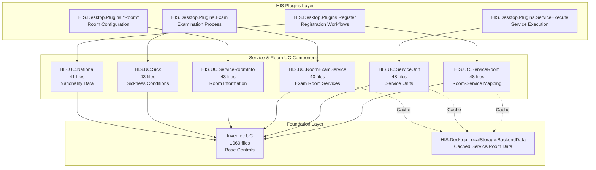
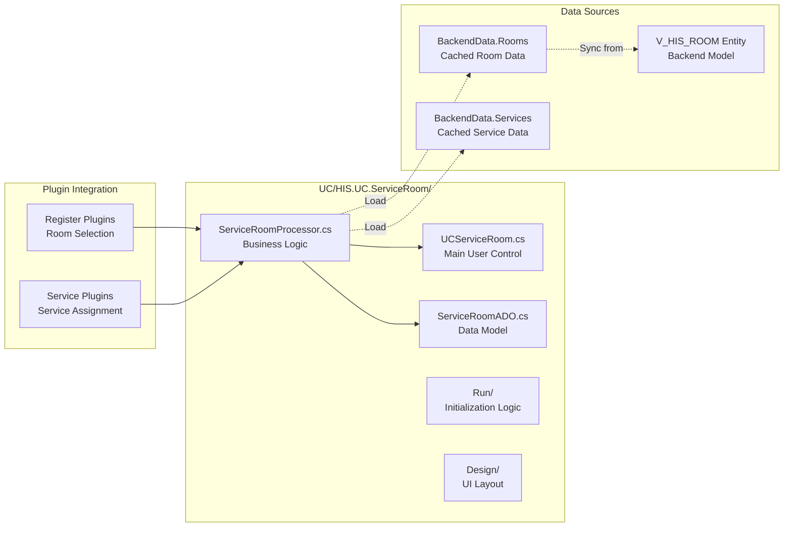
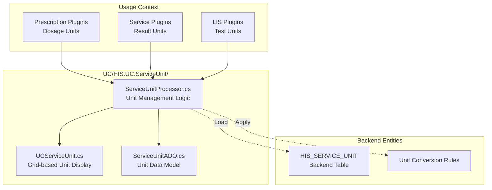
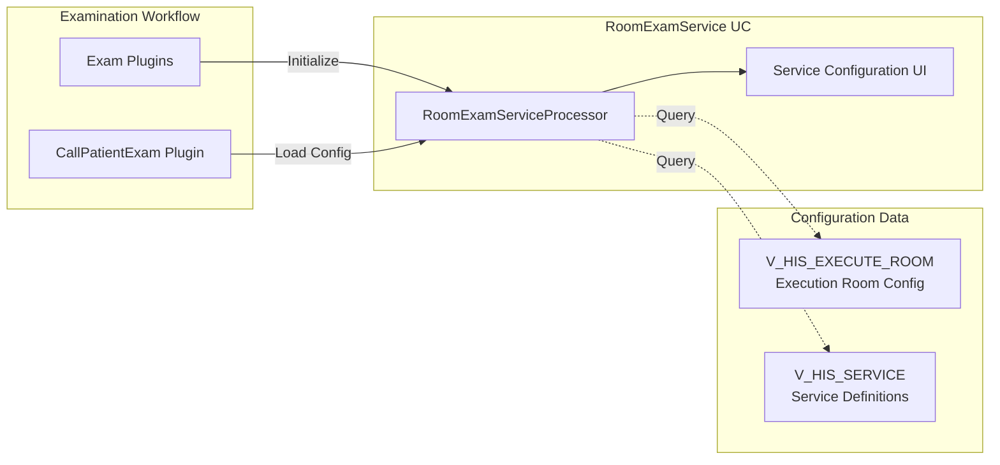
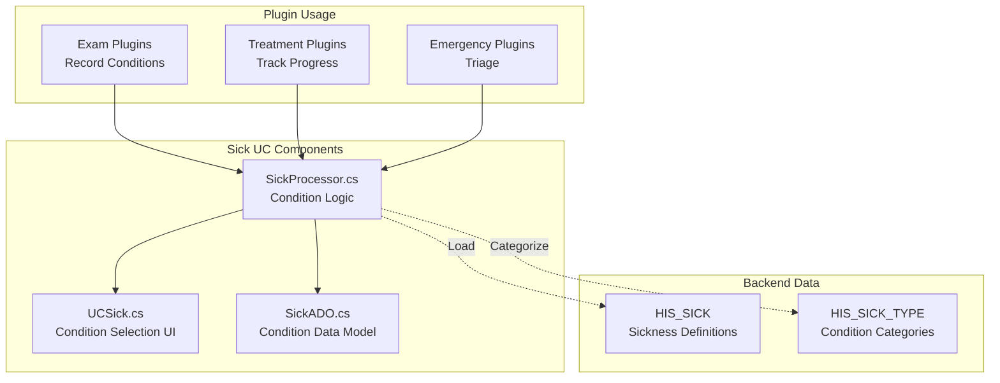
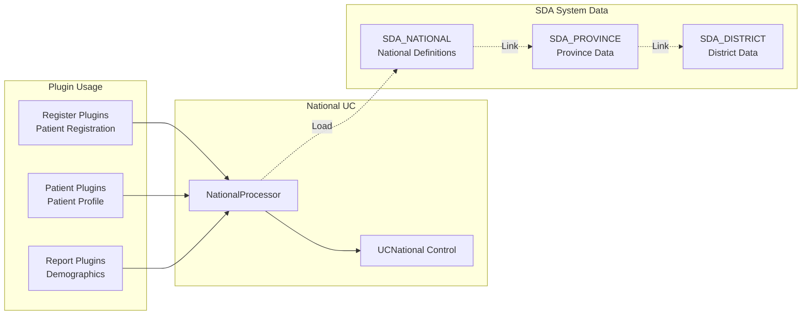
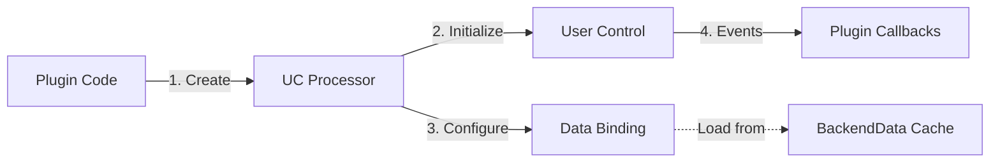
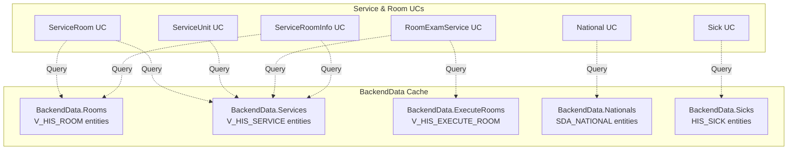

## Purpose and Scope

This document covers the User Control (UC) components in the `UC/` module that manage services, rooms, and related hospital infrastructure entities. These UCs provide reusable UI components for service selection, room management, examination service configuration, and patient nationality/condition tracking.

The primary components documented here are:
- `HIS.UC.ServiceRoom` (48 files) - Room-service association management
- `HIS.UC.ServiceUnit` (48 files) - Service unit configuration
- `HIS.UC.RoomExamService` (40 files) - Examination room service setup
- `HIS.UC.ServiceRoomInfo` (43 files) - Service room information display
- `HIS.UC.Sick` (43 files) - Patient sickness/condition tracking
- `HIS.UC.National` (41 files) - Patient nationality management

For medicine and material UCs, see [1.3.3](#1.3.3). For patient and treatment UCs, see [1.3.2](#1.3.2). For the form engine, see [1.3.1](#1.3.1).

Sources: [[`.devin/wiki.json:235-237`](../../../../.devin/wiki.json#L235-L237)](../../../../.devin/wiki.json#L235-L237)

## Architecture Overview

The Service & Room UCs form a mid-sized group within the 131-component UC library. These components are embedded in various plugins across the HIS system, particularly in registration, examination, and service execution workflows.



**Diagram 1: Service & Room UC Integration Architecture**

This diagram shows how service and room UCs are consumed by various HIS plugins. The UCs build on the `Inventec.UC` foundation layer and interact with `HIS.Desktop.LocalStorage.BackendData` for cached service and room metadata.

Sources: [[`.devin/wiki.json:200-207`](../../../../.devin/wiki.json#L200-L207)](../../../../.devin/wiki.json#L200-L207), [[`.devin/wiki.json:235-237`](../../../../.devin/wiki.json#L235-L237)](../../../../.devin/wiki.json#L235-L237)

## Component Structure

Each Service & Room UC follows a consistent internal structure:

| Component | Files | Primary Responsibility | Key Classes/Interfaces |
|-----------|-------|------------------------|------------------------|
| `HIS.UC.ServiceRoom` | 48 | Map services to rooms, manage availability | `UCServiceRoom`, `ServiceRoomProcessor`, `ServiceRoomADO` |
| `HIS.UC.ServiceUnit` | 48 | Configure service measurement units | `UCServiceUnit`, `ServiceUnitProcessor`, `ServiceUnitADO` |
| `HIS.UC.RoomExamService` | 40 | Examination room service configuration | `UCRoomExamService`, `RoomExamServiceProcessor` |
| `HIS.UC.ServiceRoomInfo` | 43 | Display service-room information | `UCServiceRoomInfo`, `ServiceRoomInfoProcessor` |
| `HIS.UC.Sick` | 43 | Track patient sickness conditions | `UCSick`, `SickProcessor`, `SickADO` |
| `HIS.UC.National` | 41 | Manage patient nationality data | `UCNational`, `NationalProcessor`, `NationalADO` |

Each UC typically contains:
- Main user control class ([`UC*.cs`](../../../UC*.cs))
- Processor class for business logic ([`*Processor.cs`](../../../*Processor.cs))
- ADO (Active Data Object) classes for data modeling ([`*ADO.cs`](../../../*ADO.cs))
- Design files ([[`.Designer.cs`](../../../.Designer.cs)](../../../.Designer.cs))
- Resource files (`Properties/`)
- Configuration and initialization logic

Sources: [[`.devin/wiki.json:235-237`](../../../../.devin/wiki.json#L235-L237)](../../../../.devin/wiki.json#L235-L237)

## ServiceRoom UC



**Diagram 2: ServiceRoom UC Component Architecture**

The `HIS.UC.ServiceRoom` component provides UI for mapping services to specific rooms and managing room-service availability. It loads data from `HIS.Desktop.LocalStorage.BackendData` which caches backend entities like `V_HIS_ROOM`.

### Key Responsibilities

- **Room-Service Mapping**: Display available services for selected rooms
- **Service Availability**: Show which services can be performed in which rooms
- **Room Selection UI**: Provide filterable, searchable room selection grids
- **Configuration Management**: Handle room-service relationship configuration

### Common Usage Pattern

Plugins typically initialize `ServiceRoom` UC through the processor pattern:

```
UC/HIS.UC.ServiceRoom/
├── ServiceRoomProcessor.cs - Entry point for plugins
├── UCServiceRoom.cs - Main control with grid/list UI
├── ServiceRoomADO.cs - Transfer object for room-service data
└── Run/
    └── UCServiceRoomRun.cs - Factory for control initialization
```

The processor exposes methods for:
- Loading room-service mappings
- Filtering by service type or room type
- Handling selection events
- Refreshing data from cache

Sources: [[`.devin/wiki.json:235-237`](../../../../.devin/wiki.json#L235-L237)](../../../../.devin/wiki.json#L235-L237)

## ServiceUnit UC

The `HIS.UC.ServiceUnit` component (48 files) manages service measurement units and unit conversions for medical services.

### Structure



**Diagram 3: ServiceUnit UC Data Flow**

### Key Features

- **Unit Display**: Show all configured measurement units (mg, ml, IU, etc.)
- **Unit Conversion**: Handle conversions between compatible units
- **Service Association**: Link units to specific service types
- **Validation**: Ensure valid unit selections for dosages and measurements

Sources: [[`.devin/wiki.json:235-237`](../../../../.devin/wiki.json#L235-L237)](../../../../.devin/wiki.json#L235-L237)

## RoomExamService UC

The `HIS.UC.RoomExamService` component (40 files) configures which examination services are available in specific examination rooms.

### Architecture

| File/Component | Purpose |
|----------------|---------|
| [[`UCRoomExamService.cs`](../../../UCRoomExamService.cs)](../../../UCRoomExamService.cs) | Main control with service-room grid |
| [[`RoomExamServiceProcessor.cs`](../../../RoomExamServiceProcessor.cs)](../../../RoomExamServiceProcessor.cs) | Load and filter exam service configurations |
| [[`RoomExamServiceADO.cs`](../../../RoomExamServiceADO.cs)](../../../RoomExamServiceADO.cs) | Data transfer object for room-service pairs |
| [[`Run/UCRoomExamServiceRun.cs`](../../../Run/UCRoomExamServiceRun.cs)](../../../Run/UCRoomExamServiceRun.cs) | Factory for control instantiation |
| `Reload/` | Data refresh logic |
| `Get/` | Query methods for retrieving configurations |

### Integration Points



**Diagram 4: RoomExamService Configuration Flow**

The `RoomExamService` UC is primarily used in examination room setup and exam workflow plugins to determine which services can be performed in each examination room.

Sources: [[`.devin/wiki.json:235-237`](../../../../.devin/wiki.json#L235-L237)](../../../../.devin/wiki.json#L235-L237)

## ServiceRoomInfo UC

The `HIS.UC.ServiceRoomInfo` component (43 files) displays detailed information about service-room associations, including schedules, availability, and capacity.

### Key Components

```
UC/HIS.UC.ServiceRoomInfo/
├── UCServiceRoomInfo.cs - Main information display control
├── ServiceRoomInfoProcessor.cs - Data loading and formatting
├── ServiceRoomInfoADO.cs - Extended room-service information model
├── Design/ - UI layout definitions
├── Validation/ - Data validation logic
└── Resources/ - Localization and images
```

### Display Features

- **Room Details**: Show room name, code, department, and room type
- **Service List**: Display all services available in the room
- **Schedule Information**: Show service availability by day/time
- **Capacity Info**: Display room capacity and current occupancy
- **Status Indicators**: Show room operational status

### Usage in Plugins

The `ServiceRoomInfo` UC is commonly used in:
- Dashboard plugins for room status overview
- Registration plugins for room selection
- Service execution plugins for room verification
- Reporting plugins for room utilization analysis

Sources: [[`.devin/wiki.json:235-237`](../../../../.devin/wiki.json#L235-L237)](../../../../.devin/wiki.json#L235-L237)

## Sick UC

The `HIS.UC.Sick` component (43 files) manages patient sickness conditions, symptoms, and severity tracking.

### Data Model



**Diagram 5: Sick UC Integration with Examination Workflow**

### Key Features

- **Condition Selection**: Provide searchable list of defined sickness conditions
- **Severity Levels**: Track condition severity (mild, moderate, severe, critical)
- **Multiple Conditions**: Support multiple concurrent conditions per patient
- **Category Filtering**: Filter conditions by type (infectious, chronic, acute, etc.)
- **History Tracking**: Maintain condition history throughout treatment

### Data Structure

The `SickADO` class typically contains:
- `SICK_CODE` - Unique condition identifier
- `SICK_NAME` - Condition display name
- `SICK_TYPE_CODE` - Category classification
- `SEVERITY_LEVEL` - Severity indicator
- `ONSET_DATE` - When condition was first recorded
- `RESOLUTION_DATE` - When condition was resolved (if applicable)

Sources: [[`.devin/wiki.json:235-237`](../../../../.devin/wiki.json#L235-L237)](../../../../.devin/wiki.json#L235-L237)

## National UC

The `HIS.UC.National` component (41 files) manages patient nationality data for registration and reporting purposes.

### Structure

```
UC/HIS.UC.National/
├── UCNational.cs - Nationality selection control
├── NationalProcessor.cs - Nationality data processing
├── NationalADO.cs - Nationality data model
├── Combo/ - Combo box implementations
├── Grid/ - Grid view implementations
└── Validation/ - Nationality validation logic
```

### Functionality

| Feature | Description |
|---------|-------------|
| **Nationality List** | Display all configured nationalities from `SDA_NATIONAL` |
| **Default Selection** | Auto-select default nationality (typically Vietnamese) |
| **Search/Filter** | Quick search by nationality name or code |
| **Multi-language Support** | Display nationality names in multiple languages |
| **Validation** | Ensure valid nationality selection for legal reporting |

### Integration with SDA System

The National UC integrates with the SDA (System Data Administration) module:



**Diagram 6: National UC Data Relationships**

### Common Usage Pattern

Plugins typically use the National UC in patient registration forms:

1. Initialize processor with current nationality data from `BackendData`
2. Display control in registration form
3. Handle selection changed events
4. Validate nationality before saving patient record
5. Store selected `NATIONAL_CODE` with patient data

Sources: [[`.devin/wiki.json:235-237`](../../../../.devin/wiki.json#L235-L237)](../../../../.devin/wiki.json#L235-L237), [[`.devin/wiki.json:160-168`](../../../../.devin/wiki.json#L160-L168)](../../../../.devin/wiki.json#L160-L168)

## Common Design Patterns

All Service & Room UCs follow consistent design patterns inherited from the UC library architecture:

### Processor Pattern



**Diagram 7: Standard UC Processor Pattern**

Each UC exposes a processor class that:
- Provides factory methods for control creation
- Handles data loading and caching
- Manages event subscriptions
- Provides methods for data refresh and validation

### ADO (Active Data Object) Pattern

ADO classes serve as data transfer objects between plugins and UCs:

- **Separation of Concerns**: ADOs decouple backend entities from UI models
- **Extended Properties**: Add UI-specific properties (selection state, display formatting)
- **Validation Logic**: Include business rules for data validation
- **Serialization**: Support JSON serialization for caching and logging

### Event Handling

Service & Room UCs typically expose these event types:

| Event Type | Purpose | Usage |
|------------|---------|-------|
| `SelectionChanged` | Item selected in grid/combo | Update dependent controls |
| `DataLoaded` | Data loaded from cache/backend | Enable/disable UI elements |
| `ValidationFailed` | Invalid data entry | Show error messages |
| `ConfigChanged` | Configuration modified | Trigger save actions |

Sources: [[`.devin/wiki.json:200-207`](../../../../.devin/wiki.json#L200-L207)](../../../../.devin/wiki.json#L200-L207)

## BackendData Integration

All Service & Room UCs interact with `HIS.Desktop.LocalStorage.BackendData` for cached data:



**Diagram 8: BackendData Cache Access Pattern**

### Cache Loading Sequence

1. Application startup: `BackendData` loads all entities from backend API
2. UC initialization: Processor queries `BackendData` collections
3. UI rendering: Control binds to filtered/sorted data
4. User interaction: Changes update local ADO objects
5. Save action: Plugin sends updates to backend API
6. Cache refresh: `BackendData` reloads affected entities

### Performance Considerations

- **In-Memory Filtering**: All filtering/sorting happens in-memory on cached data
- **Lazy Loading**: UCs only load data when control is visible
- **Refresh Strategy**: UCs subscribe to `PubSub` events for cache updates
- **Data Volume**: Room and service lists typically contain 100-1000 entries

Sources: [[`.devin/wiki.json:46-52`](../../../../.devin/wiki.json#L46-L52)](../../../../.devin/wiki.json#L46-L52), [[`.devin/wiki.json:235-237`](../../../../.devin/wiki.json#L235-L237)](../../../../.devin/wiki.json#L235-L237)

## Plugin Integration Examples

### Registration Plugin Integration

Registration plugins use multiple Service & Room UCs together:

```
HIS.Desktop.Plugins.Register (81-102 files)
├── Uses ServiceRoom UC for room selection
├── Uses National UC for patient nationality
├── Uses Sick UC for initial condition recording
└── Uses RoomExamService UC for available exam services
```

The registration workflow typically:
1. Load default room from user's assigned rooms
2. Display available examination services for selected room
3. Collect patient nationality during demographics entry
4. Record initial sickness conditions if emergency registration
5. Validate all selections before creating treatment record

### Examination Plugin Integration

Examination plugins rely heavily on these UCs:

```
HIS.Desktop.Plugins.Exam* plugins
├── RoomExamService UC - Show services available in current exam room
├── Sick UC - Record patient conditions during examination
├── ServiceUnit UC - Select measurement units for test results
└── ServiceRoomInfo UC - Display room capabilities and schedule
```

### Service Execution Integration

Service execution plugins use:

```
HIS.Desktop.Plugins.ServiceExecute (119 files)
├── ServiceRoom UC - Verify service can be performed in current room
├── ServiceUnit UC - Record results with appropriate units
└── RoomExamService UC - Load execution room configuration
```

Sources: [[`.devin/wiki.json:70-77`](../../../../.devin/wiki.json#L70-L77)](../../../../.devin/wiki.json#L70-L77), [[`.devin/wiki.json:235-237`](../../../../.devin/wiki.json#L235-L237)](../../../../.devin/wiki.json#L235-L237)

## Summary

The Service & Room UC components provide essential reusable UI functionality for:

1. **Service-Room Management**: Mapping services to physical rooms (`ServiceRoom`, `RoomExamService`)
2. **Service Configuration**: Managing service units and measurements (`ServiceUnit`, `ServiceRoomInfo`)
3. **Patient Data**: Tracking nationality and conditions (`National`, `Sick`)

These 261 files (combined total) form a critical part of the 131-component UC library, enabling consistent service and room management across 956 HIS plugins. They follow standard UC patterns (Processor, ADO, events) and integrate with the `BackendData` caching system for performance.

For more information on related UCs, see:
- Medicine and material UCs: [1.3.3](#1.3.3)
- Patient and treatment UCs: [1.3.2](#1.3.2)
- Form engine: [1.3.1](#1.3.1)

Sources: [[`.devin/wiki.json:200-207`](../../../../.devin/wiki.json#L200-L207)](../../../../.devin/wiki.json#L200-L207), [[`.devin/wiki.json:235-237`](../../../../.devin/wiki.json#L235-L237)](../../../../.devin/wiki.json#L235-L237)