## Mục đích và Phạm vi

Tài liệu này mô tả các plugin ACS (Access Control System - Hệ thống kiểm soát truy cập) trong ứng dụng HIS Desktop. 13 plugin này thực hiện kiểm soát truy cập dựa trên vai trò (RBAC) và quản lý quyền cho hệ thống thông tin bệnh viện. Các plugin ACS quản lý tài khoản người dùng, vai trò, quyền ứng dụng/module và các hạn chế truy cập ở cấp độ điều khiển UI (UI control).

Để biết thông tin về kiến trúc plugin tổng thể và vòng đời, hãy xem [Kiến trúc hệ thống Plugin](../../01-architecture/plugin-system/02-discovery-lifecycle.md). Đối với các thành phần giao diện người dùng liên quan đến kiểm soát truy cập, hãy xem [Thư viện thành phần UC](../../02-modules/uc-controls/form-type-controls.md). Đối với quản trị dữ liệu cấp hệ thống bao gồm cấu hình người dùng, hãy xem [Plugin dữ liệu hệ thống SDA](../../03-business-domains/administration/system-data.md).

---

## Tổng quan về Kiến trúc Plugin ACS

Phân hệ ACS bao gồm 13 plugin chuyên biệt cùng nhau quản lý hệ thống phân quyền trong ứng dụng HIS. Các plugin này nằm trong thư mục `HIS/Plugins/ACS.Desktop.Plugins.*` và tuân theo cấu trúc plugin tiêu chuẩn của framework HIS.Desktop.

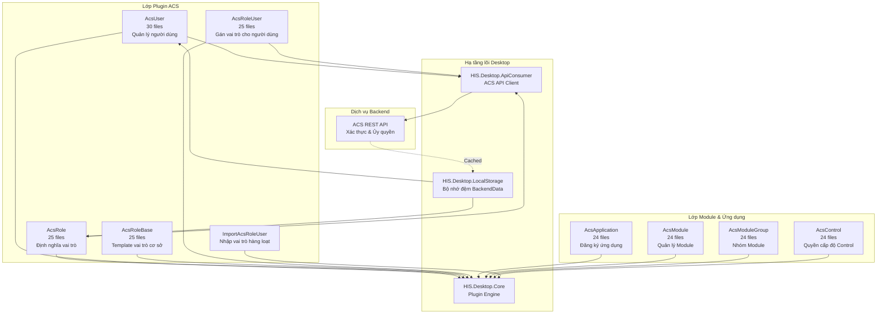

**Sơ đồ: Kiến trúc Plugin ACS và các phụ thuộc**

Sơ đồ này minh họa 13 plugin ACS được tổ chức thành hai lớp chức năng: quản lý người dùng/vai trò và quản lý ứng dụng/module. Tất cả các plugin tích hợp với hạ tầng lõi desktop cho vòng đời plugin, bộ nhớ đệm cục bộ và giao tiếp API backend.

Nguồn: [[`.devin/wiki.json:110-117`](../../../../.devin/wiki.json#L110-L117)](../../../../.devin/wiki.json#L110-L117), Sơ đồ kiến trúc cấp cao (Diagram 2: Plugin-Based Architecture)

---

## Mô hình Phân cấp Quyền hạn

Hệ thống ACS thực hiện mô hình phân cấp quyền bốn cấp độ để kiểm soát truy cập từ cấp độ ứng dụng xuống đến từng thành phần UI control đơn lẻ.


**Sơ đồ: Phân cấp quyền ACS bốn cấp độ**

Phân cấp này cho phép kiểm soát chi tiết trong đó:
- **Ứng dụng (Application)**: Toàn bộ ứng dụng HIS.Desktop
- **Nhóm Module (Module Group)**: Các nhóm logic của các plugin liên quan (ví dụ: "Quản lý bệnh nhân", "Dược")
- **Module**: Các plugin riêng lẻ (ví dụ: `HIS.Desktop.Plugins.Register`, `HIS.Desktop.Plugins.AssignPrescriptionPK`)
- **Control**: Các UI control cụ thể trong plugin (ví dụ: nút bấm, lưới dữ liệu, các trường trong form)

Nguồn: [[`.devin/wiki.json:110-117`](../../../../.devin/wiki.json#L110-L117)](../../../../.devin/wiki.json#L110-L117), Sơ đồ kiến trúc cấp cao (Diagram 2: Plugin-Based Architecture)

---

## Các Plugin ACS cốt lõi

### Quản lý người dùng: AcsUser

**Vị trí**: `HIS/Plugins/ACS.Desktop.Plugins.AcsUser/` (30 tệp)

Plugin `AcsUser` cung cấp chức năng quản lý tài khoản người dùng toàn diện. Đây là plugin ACS lớn nhất và đóng vai trò là giao diện chính cho các quản trị viên hệ thống để quản lý thông tin đăng nhập, hồ sơ và trạng thái tài khoản của người dùng.

**Trách nhiệm chính**:
- Tạo, cập nhật, xóa và tìm kiếm tài khoản người dùng
- Quản lý thông tin xác thực người dùng (tên đăng nhập, mật khẩu)
- Cấu hình thông tin hồ sơ người dùng (tên, email, phòng ban)
- Kích hoạt/vô hiệu hóa tài khoản người dùng
- Theo dõi lịch sử đăng nhập và quản lý phiên làm việc của người dùng
- Tích hợp với kho lưu trữ người dùng ACS ở backend

**Cấu trúc tệp điển hình**:
```
ACS.Desktop.Plugins.AcsUser/
├── AcsUser.cs                    # Điểm bắt đầu (Entry point) của plugin
├── Run/                          # Logic thực thi plugin
├── ADO/                          # Các đối tượng dữ liệu (Active Data Objects) cho model người dùng
├── Base/                         # Các lớp cơ sở và interface
├── Properties/                   # Thông tin assembly và tài nguyên
└── Resources/                    # Tài nguyên UI, bản dịch (localization)
```

Nguồn: [[`.devin/wiki.json:113-117`](../../../../.devin/wiki.json#L113-L117)](../../../../.devin/wiki.json#L113-L117)

---

### Quản lý vai trò: AcsRole & AcsRoleBase

**Vị trí**: 
- `HIS/Plugins/ACS.Desktop.Plugins.AcsRole/` (25 tệp)
- `HIS/Plugins/ACS.Desktop.Plugins.AcsRoleBase/` (25 tệp)

Các plugin này hoạt động cùng nhau để định nghĩa và quản lý các template kiểm soát truy cập dựa trên vai trò.

**Plugin AcsRole**:
- Tạo và chỉnh sửa các vai trò tùy chỉnh
- Định nghĩa quyền hạn của vai trò bằng cách chọn các module và control được phép
- Quản lý metadata của vai trò (tên, mô tả, độ ưu tiên)
- Sao chép các vai trò hiện có để tạo template
- Xóa hoặc lưu trữ các vai trò

**Plugin AcsRoleBase**:
- Quản lý các template vai trò cơ sở do hệ thống cung cấp
- Định nghĩa các vai trò tiêu chuẩn (ví dụ: "Bác sĩ", "Điều dưỡng", "Dược sĩ", "Quản trị viên")
- Cung cấp các template vai trò không thể thay đổi cho các quy trình bệnh viện phổ biến
- Đóng vai trò là điểm bắt đầu để tạo các vai trò tùy chỉnh

**Mô hình Định nghĩa Vai trò**:
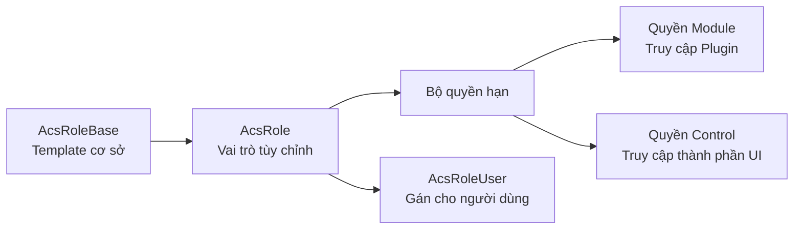

**Sơ đồ: Quy trình Định nghĩa và Gán vai trò**

Nguồn: [[`.devin/wiki.json:113-117`](../../../../.devin/wiki.json#L113-L117)](../../../../.devin/wiki.json#L113-L117)

---

### Gán vai trò: AcsRoleUser & ImportAcsRoleUser

**Vị trí**: 
- `HIS/Plugins/ACS.Desktop.Plugins.AcsRoleUser/` (25 tệp)
- `HIS/Plugins/ACS.Desktop.Plugins.ImportAcsRoleUser/`

**Plugin AcsRoleUser**:
- Gán vai trò cho tài khoản người dùng (mối quan hệ nhiều-nhiều)
- Xem các phân bổ vai trò hiện tại của người dùng
- Gỡ bỏ việc gán vai trò
- Kiểm tra xung đột và phụ thuộc của vai trò
- Kiểm tra lịch sử gán vai trò

**Plugin ImportAcsRoleUser**:
- Nhập hàng loạt việc gán vai trò từ các tệp bên ngoài (Excel, CSV)
- Xác thực dữ liệu nhập vào so với người dùng và vai trò hiện có
- Xem trước các thay đổi trước khi thực hiện
- Tạo báo cáo lỗi khi nhập dữ liệu
- Hoàn tác (rollback) nếu quá trình nhập thất bại

**Mô hình Gán vai trò-Người dùng**:
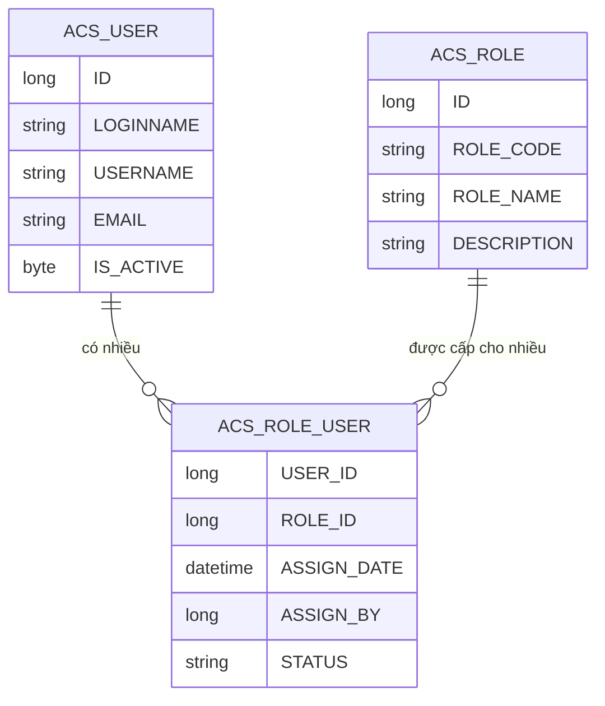

**Sơ đồ: Thực thể mối quan hệ Gán vai trò cho Người dùng**

Nguồn: [[`.devin/wiki.json:113-117`](../../../../.devin/wiki.json#L113-L117)](../../../../.devin/wiki.json#L113-L117)

---

### Quản lý Ứng dụng & Module

#### Plugin AcsApplication

**Vị trí**: `HIS/Plugins/ACS.Desktop.Plugins.AcsApplication/` (24 tệp)

Quản lý việc đăng ký và cấu hình các ứng dụng trong hệ sinh thái ACS. Trong bối cảnh HIS, việc này chủ yếu đăng ký chính ứng dụng `HIS.Desktop` và bất kỳ ứng dụng vệ tinh nào.

**Các chức năng chính**:
- Đăng ký metadata ứng dụng (mã, tên, phiên bản)
- Cấu hình quyền ở cấp độ ứng dụng
- Định nghĩa các endpoint của ứng dụng và yêu cầu xác thực
- Quản lý trạng thái ứng dụng và cấu hình triển khai

#### Plugin AcsModule

**Vị trí**: `HIS/Plugins/ACS.Desktop.Plugins.AcsModule/` (24 tệp)

Quản lý các module plugin riêng lẻ trong ứng dụng. Mỗi plugin trong hệ thống HIS (ví dụ: `AssignPrescriptionPK`, `Register`, `Transaction`) được đăng ký như một module ACS.

**Các chức năng chính**:
- Đăng ký plugin dưới dạng module ACS
- Định nghĩa metadata module (mã, tên, mô tả, icon)
- Cấu hình hiển thị và tính khả dụng của module
- Thiết lập các yêu cầu thực thi và phụ thuộc của module
- Ánh xạ module vào các nhóm module

#### Plugin AcsModuleGroup

**Vị trí**: `HIS/Plugins/ACS.Desktop.Plugins.AcsModuleGroup/` (24 tệp)

Tổ chức các module thành các nhóm logic để quản lý quyền và điều hướng dễ dàng hơn.

**Các chức năng chính**:
- Tạo và quản lý các nhóm module (ví dụ: "Ngoại trú", "Nội trú", "Dược", "Xét nghiệm")
- Gán các module vào nhóm
- Định nghĩa quyền ở cấp độ nhóm
- Cấu hình thứ tự sắp xếp và phân cấp nhóm

**Mối quan hệ Ứng dụng-Module-Nhóm**:
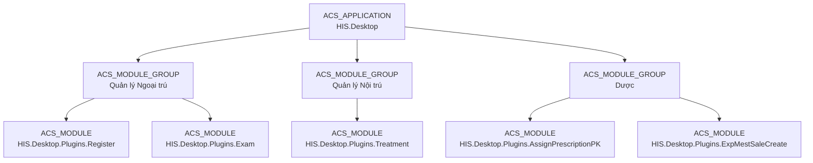

**Sơ đồ: Ví dụ về Phân cấp Ứng dụng - Nhóm Module - Module**

Nguồn: [[`.devin/wiki.json:113-117`](../../../../.devin/wiki.json#L113-L117)](../../../../.devin/wiki.json#L113-L117)

---

### Quyền cấp độ Control: AcsControl

**Vị trí**: `HIS/Plugins/ACS.Desktop.Plugins.AcsControl/` (24 tệp)

Plugin `AcsControl` cung cấp mức độ kiểm soát truy cập chi tiết nhất bằng cách quản lý quyền cho các UI control riêng lẻ trong các plugin.

**Các chức năng chính**:
- Đăng ký các UI control từ các plugin (nút bấm, lưới dữ liệu, ô nhập văn bản, hộp kiểm)
- Định nghĩa metadata của control (mã control, tên, module cha)
- Cấu hình hiển thị và trạng thái kích hoạt của control dựa trên vai trò
- Hỗ trợ kiểm tra (auditing) ở cấp độ control
- Tích hợp với `SdaHideControl` để tùy chỉnh giao diện người dùng

**Áp dụng quyền cho Control**:
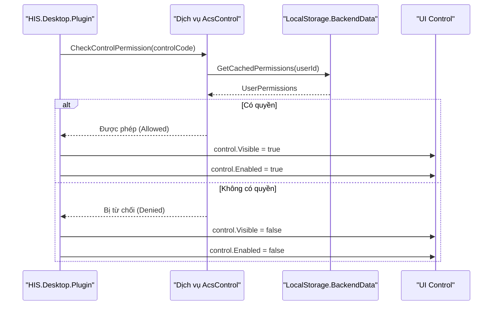

**Sơ đồ: Tuần tự kiểm tra quyền ở cấp độ Control**

**Các loại Control phổ biến được quản lý**:
- **btnSave**: Nút Lưu trong các form
- **btnDelete**: Nút Xóa trong các lưới dữ liệu
- **btnExport**: Nút Xuất dữ liệu
- **gridView**: Hiển thị lưới dữ liệu
- **txtSensitiveField**: Các trường nhập liệu nhạy cảm (ví dụ: lương, ghi chú bảo mật)

Nguồn: [[`.devin/wiki.json:113-117`](../../../../.devin/wiki.json#L113-L117)](../../../../.devin/wiki.json#L113-L117)

---

## Luồng Dữ liệu và Tích hợp API

Các plugin ACS tương tác với các dịch vụ backend thông qua lớp `HIS.Desktop.ApiConsumer` và lưu bộ nhớ đệm (cache) dữ liệu phân quyền cục bộ để tối ưu hiệu suất.

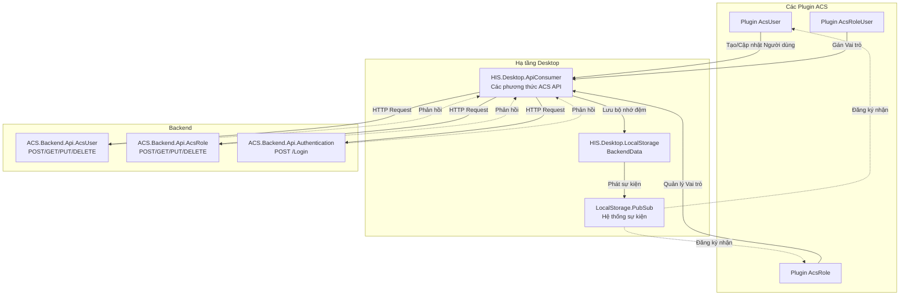

**Sơ đồ: Luồng dữ liệu ACS giữa Plugin, API Consumer và Backend**

### Chiến lược lưu bộ nhớ đệm (Caching)

Hệ thống ACS lưu trữ dữ liệu phân quyền trong `HIS.Desktop.LocalStorage.BackendData` để giảm thiểu các lần gọi API và cải thiện khả năng phản hồi của ứng dụng:

| Loại dữ liệu | Cache Key | Chiến lược làm mới |
|-----------|-----------|------------------|
| Quyền hiện tại của người dùng | `CurrentUserPermissions` | Khi đăng nhập, làm mới thủ công |
| Danh sách người dùng | `AcsUserList` | Khi có yêu cầu, TTL 5 phút |
| Định nghĩa vai trò | `AcsRoleList` | Khi có yêu cầu, TTL 10 phút |
| Đăng ký Module | `AcsModuleList` | Khi khởi động ứng dụng, làm mới thủ công |
| Gán Vai trò-Người dùng | `AcsRoleUserList` | Khi có yêu cầu, hủy khi có thay đổi |

Nguồn: [[`.devin/wiki.json:44-53`](../../../../.devin/wiki.json#L44-L53)](../../../../.devin/wiki.json#L44-L53), Sơ đồ kiến trúc cấp cao (Diagram 3: Data Flow & API Integration)

---

## Các mẫu giao tiếp Plugin

Các plugin ACS giao tiếp với các plugin HIS khác bằng hai mẫu chính:

### 1. Mẫu DelegateRegister

Được sử dụng cho giao tiếp trực tiếp giữa các plugin khi một plugin cần truy vấn hoặc sửa đổi dữ liệu ACS.

**Ví dụ**: Một plugin kiểm tra xem người dùng hiện tại có quyền truy cập vào một tính năng hay không:

```
// Mẫu được sử dụng trong các plugin
var hasPermission = HIS.Desktop.DelegateRegister.CheckModulePermission(moduleCode);
if (hasPermission) {
    // Thực thi tính năng
}
```

### 2. Mẫu sự kiện PubSub

Được sử dụng để phát các sự kiện liên quan đến ACS cho tất cả các plugin quan tâm.

**Các sự kiện ACS phổ biến**:
- `AcsUserChanged`: Được phát khi dữ liệu người dùng được cập nhật
- `AcsRoleAssigned`: Được phát khi các vai trò được gán/thu hồi
- `AcsPermissionRefreshed`: Được phát khi bộ nhớ đệm phân quyền bị vô hiệu hóa
- `AcsUserLoggedOut`: Được phát khi người dùng đăng xuất

**Luồng sự kiện**:
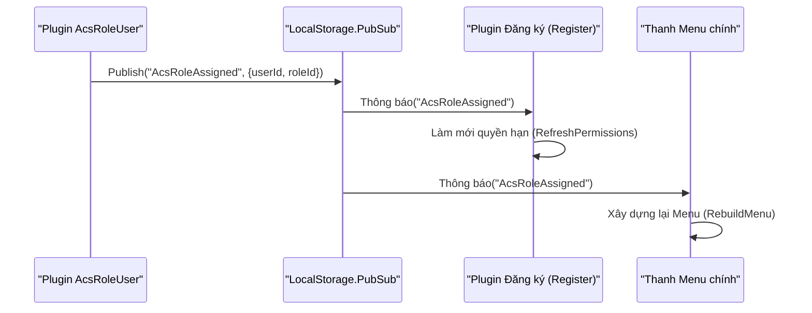

**Sơ đồ: Luồng sự kiện PubSub cho việc gán Vai trò**

Nguồn: [[`.devin/wiki.json:44-53`](../../../../.devin/wiki.json#L44-L53)](../../../../.devin/wiki.json#L44-L53), Sơ đồ kiến trúc cấp cao (Diagram 2: Plugin-Based Architecture)

---

## Tích hợp với HIS Desktop Core

Các plugin ACS tích hợp chặt chẽ với một số hệ thống cốt lõi của HIS Desktop:

### Quản lý phiên (Session Management)

Khi người dùng đăng nhập, hệ thống ACS:
1. Xác thực thông tin qua `ACS.Backend.Api.Authentication`
2. Lấy quyền và vai trò của người dùng
3. Lưu quyền vào bộ nhớ đệm trong `LocalStorage.BackendData`
4. Khởi tạo phiên làm việc với ngữ cảnh phân quyền
5. Phát sự kiện `UserLoggedIn` cho tất cả các plugin

### Khám phá và Đăng ký Plugin

Trong quá trình khởi động ứng dụng:
1. `Inventec.Desktop.Core` khám phá tất cả các plugin đã cài đặt
2. Mỗi plugin tự đăng ký với registry module ACS thông qua API `AcsModule`
3. Metadata của plugin (mã, tên, icon) được lưu trữ trong cơ sở dữ liệu ACS
4. Tính khả dụng của plugin được quyết định bởi quyền vai trò của người dùng

### Menu và Điều hướng

Menu ứng dụng chính được tạo động dựa trên:
- Các vai trò được gán cho người dùng (qua `AcsRoleUser`)
- Quyền Module (qua `AcsModule`)
- Phân cấp nhóm Module (qua `AcsModuleGroup`)

**Luồng tạo Menu**:


**Sơ đồ: Tạo Menu động dựa trên quyền ACS**

Nguồn: [[`.devin/wiki.json:34-43`](../../../../.devin/wiki.json#L34-L43)](../../../../.devin/wiki.json#L34-L43), Sơ đồ kiến trúc cấp cao (Diagram 1: Four-Module System Architecture)

---

## Tóm tắt các Plugin ACS

| Plugin | Tệp | Trách nhiệm chính |
|--------|-------|------------------------|
| **AcsUser** | 30 | Quản lý tài khoản người dùng, thông tin xác thực |
| **AcsRole** | 25 | Định nghĩa và quản lý vai trò tùy chỉnh |
| **AcsRoleBase** | 25 | Các template vai trò cơ sở do hệ thống cung cấp |
| **AcsRoleUser** | 25 | Quản lý và gán vai trò-người dùng |
| **ImportAcsRoleUser** | - | Nhập hàng loạt việc gán vai trò |
| **AcsApplication** | 24 | Đăng ký và cấu hình ứng dụng |
| **AcsModule** | 24 | Đăng ký plugin/module và phân quyền |
| **AcsModuleGroup** | 24 | Nhóm và tổ chức module |
| **AcsControl** | 24 | Quản lý quyền ở cấp độ UI control |
| **Khác** | - | Các tiện ích và trình hỗ trợ ACS bổ sung |

Tất cả các plugin ACS tuân theo kiến trúc plugin HIS tiêu chuẩn với các lớp entry point, thư mục `Run/` cho logic thực thi, thư mục `ADO/` cho các model dữ liệu và tích hợp với `HIS.Desktop.ApiConsumer` để giao tiếp với backend.

Nguồn: [[`.devin/wiki.json:110-117`](../../../../.devin/wiki.json#L110-L117)](../../../../.devin/wiki.json#L110-L117), Sơ đồ kiến trúc cấp cao (Diagram 2: Plugin-Based Architecture)

# Các Plugin EMR (Bệnh án Điện tử)

## Mục đích và Phạm vi

Tài liệu này bao gồm phân hệ plugin EMR (Electronic Medical Record - Bệnh án Điện tử) trong ứng dụng HIS Desktop. Các plugin EMR cung cấp chức năng quản lý bệnh án điện tử, bao gồm tạo tài liệu, tích hợp chữ ký số và quản lý quy trình phê duyệt. Phân hệ này bao gồm 16 plugin chuyên biệt nằm trong thư mục `HIS/Plugins/EMR.Desktop.Plugins.*`.

Để biết các mẫu kiến trúc plugin chung và cơ chế giao tiếp, hãy xem [Kiến trúc hệ thống Plugin](../../01-architecture/plugin-system/04-communication.md). Đối với các plugin logic nghiệp vụ liên quan tạo ra dữ liệu y tế được EMR tiêu thụ, hãy xem [Các plugin nghiệp vụ cốt lõi của HIS](../../02-modules/his-desktop/business-plugins.md).

**Nguồn:** [`.devin/wiki.json:120-127`](../../../../.devin/wiki.json#L120-L127)

---

## Tổng quan về Plugin EMR

Phân hệ EMR chứa 16 plugin cùng nhau quản lý vòng đời của bệnh án điện tử từ khi tạo cho đến quy trình ký số và phê duyệt.

### Danh mục Plugin EMR

| Tên Plugin | Tệp | Trách nhiệm chính |
|------------|-------|------------------------|
| `EmrDocument` | 42 | Giao diện tạo, chỉnh sửa và quản lý tài liệu |
| `EmrSignDocumentList` | 23 | Danh sách hiển thị các tài liệu yêu cầu chữ ký |
| `EmrSignerFlow` | 22 | Cấu hình và quản lý quy trình người ký |
| `EmrFlow` | 21 | Định nghĩa và thực thi quy trình phê duyệt |
| `EmrTreatmentList` | 21 | Danh sách tài liệu liên kết với điều trị |
| `EmrSign` | 18 | Giao diện thực thi chữ ký số |
| `EmrBusiness` | ~15 | Lớp logic nghiệp vụ cho các hoạt động EMR |
| `EmrConfig` | ~15 | Quản lý cấu hình EMR |
| `EmrDocumentList` | ~15 | Giao diện liệt kê tài liệu chung |
| 7 plugin bổ sung | ~10 mỗi cái | Các chức năng hỗ trợ cho quy trình EMR |

**Nguồn:** [`.devin/wiki.json:120-127`](../../../../.devin/wiki.json#L120-L127)

---

## Kiến trúc Plugin EMR

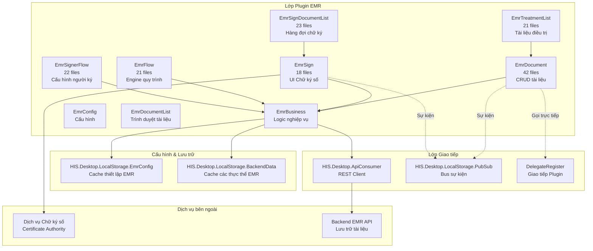

**Sơ đồ 1: Kiến trúc Plugin EMR và các Phụ thuộc**

Sơ đồ này cho thấy kiến trúc phân lớp của các plugin EMR. Lớp trên cùng chứa các plugin hướng tới người dùng, các plugin này ủy thác logic nghiệp vụ cho `EmrBusiness`. Việc cấu hình và lưu bộ nhớ đệm dữ liệu được cung cấp bởi các thành phần `LocalStorage`. Giao tiếp xảy ra thông qua REST API, PubSub dựa trên sự kiện và các cuộc gọi trực tiếp giữa các plugin qua `DelegateRegister`.

**Nguồn:** [`.devin/wiki.json:8-9`](../../../../.devin/wiki.json#L8-L9), [`.devin/wiki.json:64-67`](../../../../.devin/wiki.json#L64-L67), [`.devin/wiki.json:120-127`](../../../../.devin/wiki.json#L120-L127)

---

## Các Plugin EMR cốt lõi

### Plugin EmrDocument

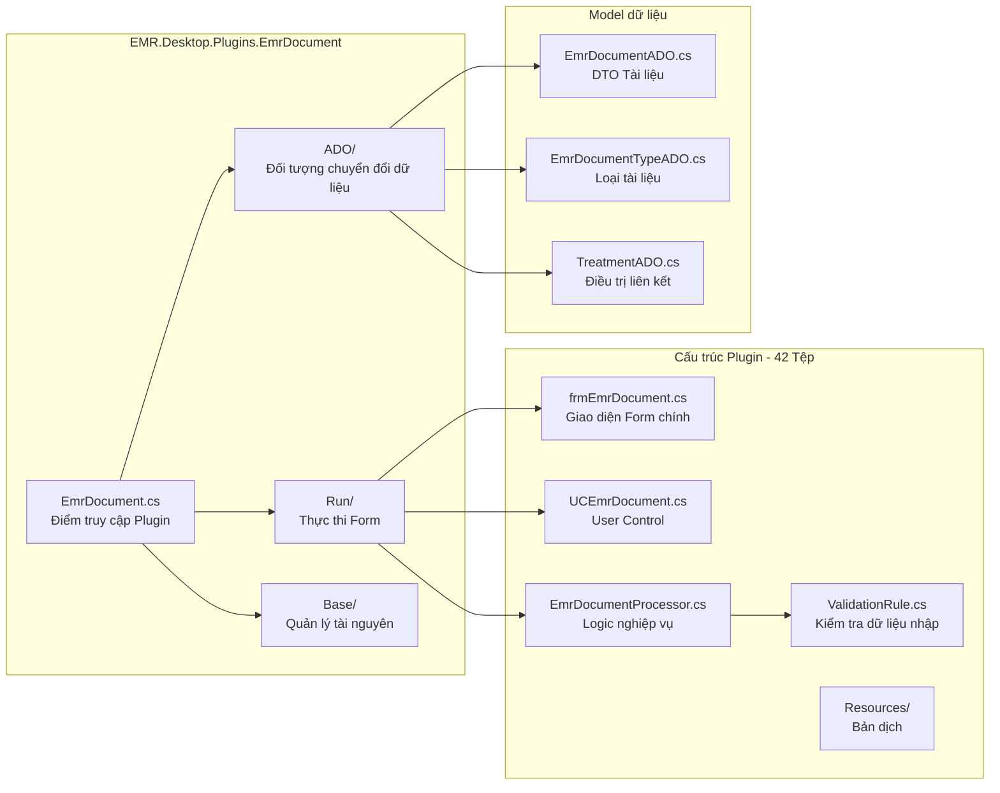

**Sơ đồ 2: Cấu trúc Plugin EmrDocument**

Plugin `EmrDocument` tuân theo mẫu kiến trúc plugin HIS tiêu chuẩn với 42 tệp được tổ chức thành các thư mục chức năng. Điểm bắt đầu (entry point) khởi tạo form chính, form này sử dụng các user control để chỉnh sửa tài liệu. Logic nghiệp vụ được tách biệt vào các lớp processor, với các đối tượng chuyển đổi dữ liệu (ADOs) định nghĩa hợp đồng dữ liệu.

**Các tệp chính (cấu trúc suy luận):**
- [[`HIS/Plugins/EMR.Desktop.Plugins.EmrDocument/EmrDocument.cs`](../../../../HIS/Plugins/EMR.Desktop.Plugins.EmrDocument/EmrDocument.cs)](../../../../HIS/Plugins/EMR.Desktop.Plugins.EmrDocument/EmrDocument.cs) - Điểm bắt đầu của plugin thực thi interface `Inventec.Desktop.Common.Modules.Module`
- [[`HIS/Plugins/EMR.Desktop.Plugins.EmrDocument/Run/frmEmrDocument.cs`](../../../../HIS/Plugins/EMR.Desktop.Plugins.EmrDocument/Run/frmEmrDocument.cs)](../../../../HIS/Plugins/EMR.Desktop.Plugins.EmrDocument/Run/frmEmrDocument.cs) - Form chỉnh sửa tài liệu chính
- [[`HIS/Plugins/EMR.Desktop.Plugins.EmrDocument/ADO/EmrDocumentADO.cs`](../../../../HIS/Plugins/EMR.Desktop.Plugins.EmrDocument/ADO/EmrDocumentADO.cs)](../../../../HIS/Plugins/EMR.Desktop.Plugins.EmrDocument/ADO/EmrDocumentADO.cs) - Đối tượng chuyển đổi dữ liệu tài liệu
- [[`HIS/Plugins/EMR.Desktop.Plugins.EmrDocument/Base/ResourceLangManager.cs`](../../../../HIS/Plugins/EMR.Desktop.Plugins.EmrDocument/Base/ResourceLangManager.cs)](../../../../HIS/Plugins/EMR.Desktop.Plugins.EmrDocument/Base/ResourceLangManager.cs) - Trình quản lý tài nguyên bản dịch

**Chức năng:**
- Tạo và chỉnh sửa các tài liệu bệnh án điện tử
- Liên kết tài liệu với hồ sơ điều trị
- Hỗ trợ nhiều loại tài liệu (ghi chú diễn tiến, tóm tắt xuất viện, báo cáo thủ thuật)
- Chỉnh sửa văn bản phong phú (rich text) với các template y tế
- Kiểm soát phiên bản tài liệu và theo dõi lịch sử

**Nguồn:** [`.devin/wiki.json:8-9`](../../../../.devin/wiki.json#L8-L9), [`.devin/wiki.json:64-67`](../../../../.devin/wiki.json#L64-L67), [`.devin/wiki.json:120-127`](../../../../.devin/wiki.json#L120-L127)

---

### Các Plugin Chữ ký số

Phân hệ EMR bao gồm ba plugin được liên kết với nhau để quản lý chữ ký số: `EmrSign`, `EmrSignDocumentList`, và `EmrSignerFlow`.

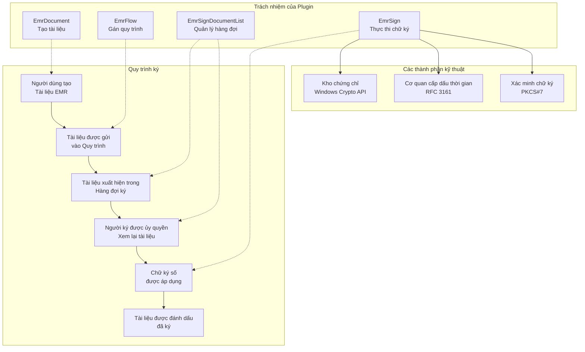

**Sơ đồ 3: Quy trình Chữ ký số**

#### Plugin EmrSign (18 tệp)

Plugin `EmrSign` cung cấp giao diện người dùng và triển khai kỹ thuật để áp dụng chữ ký số vào các tài liệu EMR.

**Các tính năng chính:**
- Chọn chứng chỉ từ Kho chứng chỉ Windows (Windows Certificate Store)
- Tích hợp với USB token/đầu đọc thẻ thông minh
- Định dạng chữ ký PKCS#7
- Tích hợp cơ quan cấp dấu thời gian (Timestamp Authority) RFC 3161
- Xác thực và kiểm tra chữ ký

**Các tệp chính (suy luận):**
- [[`HIS/Plugins/EMR.Desktop.Plugins.EmrSign/EmrSign.cs`](../../../../HIS/Plugins/EMR.Desktop.Plugins.EmrSign/EmrSign.cs)](../../../../HIS/Plugins/EMR.Desktop.Plugins.EmrSign/EmrSign.cs) - Điểm bắt đầu của plugin
- [[`HIS/Plugins/EMR.Desktop.Plugins.EmrSign/Run/frmEmrSign.cs`](../../../../HIS/Plugins/EMR.Desktop.Plugins.EmrSign/Run/frmEmrSign.cs)](../../../../HIS/Plugins/EMR.Desktop.Plugins.EmrSign/Run/frmEmrSign.cs) - Hộp thoại ký tên
- [[`HIS/Plugins/EMR.Desktop.Plugins.EmrSign/Crypto/DigitalSignatureHelper.cs`](../../../../HIS/Plugins/EMR.Desktop.Plugins.EmrSign/Crypto/DigitalSignatureHelper.cs)](../../../../HIS/Plugins/EMR.Desktop.Plugins.EmrSign/Crypto/DigitalSignatureHelper.cs) - Các hoạt động mã hóa
- [[`HIS/Plugins/EMR.Desktop.Plugins.EmrSign/Validation/CertificateValidator.cs`](../../../../HIS/Plugins/EMR.Desktop.Plugins.EmrSign/Validation/CertificateValidator.cs)](../../../../HIS/Plugins/EMR.Desktop.Plugins.EmrSign/Validation/CertificateValidator.cs) - Xác thực chứng chỉ

#### Plugin EmrSignDocumentList (23 tệp)

Cung cấp chế độ xem hàng đợi các tài liệu yêu cầu chữ ký, được tổ chức theo vai trò người dùng và trạng thái quy trình.

**Các tính năng chính:**
- Quản lý hàng đợi ký đa người dùng
- Lọc theo loại tài liệu, khoảng ngày, điều trị
- Các hoạt động ký hàng loạt
- Xem trước tài liệu trước khi ký
- Theo dõi trạng thái chữ ký

#### Plugin EmrSignerFlow (22 tệp)

Cấu hình quy trình ký, bao gồm vai trò người ký, thứ tự và logic điều kiện.

**Các tính năng chính:**
- Định nghĩa vai trò người ký (bác sĩ điều trị, trưởng khoa, v.v.)
- Cấu hình ký tuần tự so với ký song song
- Thiết lập quy tắc ký có điều kiện
- Quản lý ghi đè và ủy quyền

**Nguồn:** [`.devin/wiki.json:120-127`](../../../../.devin/wiki.json#L120-L127)

---

### Các Plugin Quy trình phê duyệt

#### Plugin EmrFlow (21 tệp)

Plugin `EmrFlow` thực hiện engine quy trình phê duyệt cho các tài liệu EMR, quản lý việc điều hướng tài liệu qua nhiều giai đoạn phê duyệt.

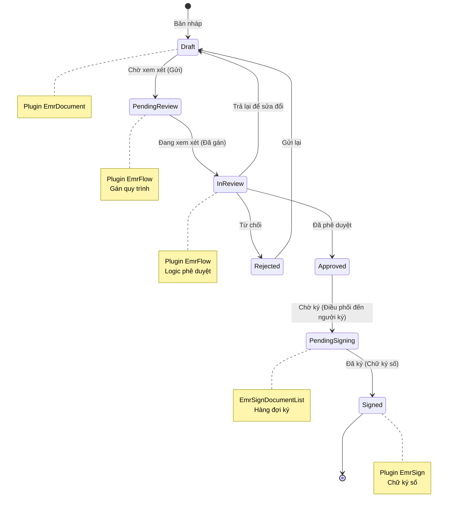

**Diagram 4: EMR Document State Machine**

**Cấu trúc Định nghĩa Quy trình:**
```
Thực thể EmrFlow:
- FlowId: Mã định danh duy nhất
- FlowName: Tên hiển thị
- DocumentTypeId: Các loại tài liệu áp dụng
- Steps: Danh sách các bước phê duyệt được sắp xếp
  - StepOrder: Số thứ tự
  - RoleId: Vai trò người phê duyệt yêu cầu
  - IsRequired: Bắt buộc so với tùy chọn
  - Conditions: Các quy tắc nghiệp vụ để thực thi bước
```

**Các hoạt động chính:**
- `CreateFlow()` - Định nghĩa quy trình phê duyệt mới
- `AssignDocument()` - Điều hướng tài liệu vào quy trình
- `GetPendingTasks()` - Lấy hàng đợi phê duyệt của người dùng
- `ApproveStep()` - Hoàn thành bước phê duyệt
- `RejectDocument()` - Trả lại để sửa đổi
- `OverrideFlow()` - Ghi đè quy trình quản trị

**Các tệp chính (suy luận):**
- [[`HIS/Plugins/EMR.Desktop.Plugins.EmrFlow/EmrFlow.cs`](../../../../HIS/Plugins/EMR.Desktop.Plugins.EmrFlow/EmrFlow.cs)](../../../../HIS/Plugins/EMR.Desktop.Plugins.EmrFlow/EmrFlow.cs) - Điểm bắt đầu của plugin
- [[`HIS/Plugins/EMR.Desktop.Plugins.EmrFlow/Run/frmEmrFlow.cs`](../../../../HIS/Plugins/EMR.Desktop.Plugins.EmrFlow/Run/frmEmrFlow.cs)](../../../../HIS/Plugins/EMR.Desktop.Plugins.EmrFlow/Run/frmEmrFlow.cs) - UI thiết kế quy trình
- [[`HIS/Plugins/EMR.Desktop.Plugins.EmrFlow/Engine/WorkflowEngine.cs`](../../../../HIS/Plugins/EMR.Desktop.Plugins.EmrFlow/Engine/WorkflowEngine.cs)](../../../../HIS/Plugins/EMR.Desktop.Plugins.EmrFlow/Engine/WorkflowEngine.cs) - Logic thực thi quy trình
- [[`HIS/Plugins/EMR.Desktop.Plugins.EmrFlow/ADO/EmrFlowADO.cs`](../../../../HIS/Plugins/EMR.Desktop.Plugins.EmrFlow/ADO/EmrFlowADO.cs)](../../../../HIS/Plugins/EMR.Desktop.Plugins.EmrFlow/ADO/EmrFlowADO.cs) - DTO định nghĩa quy trình

**Nguồn:** [`.devin/wiki.json:120-127`](../../../../.devin/wiki.json#L120-L127)

---

### Tích hợp Điều trị

#### Plugin EmrTreatmentList (21 tệp)

Cung cấp danh sách tài liệu được lọc theo hồ sơ điều trị, cho phép các bác sĩ lâm sàng xem tất cả các tài liệu EMR liên quan đến một đợt điều trị cụ thể của bệnh nhân.

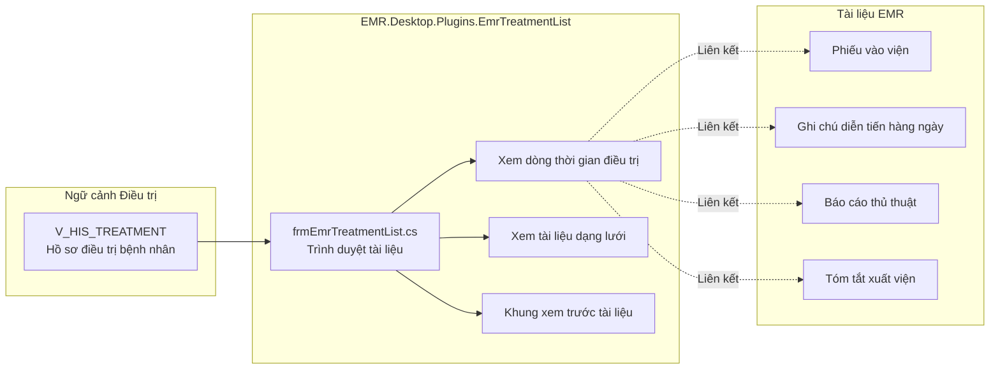

**Sơ đồ 5: Liên kết Điều trị-Tài liệu**

**Các tính năng chính:**
- Dòng thời gian tài liệu theo thứ tự thời gian của đợt điều trị
- Phân loại theo loại tài liệu
- Truy cập nhanh để tạo tài liệu mới
- Tích hợp với `EmrDocument` để chỉnh sửa
- In tất cả các tài liệu điều trị

**Các điểm tích hợp:**
- Nhận ngữ cảnh điều trị từ plugin gọi (ví dụ: `TreatmentFinish`, `ServiceExecute`)
- Khởi chạy plugin `EmrDocument` để tạo/chỉnh sửa tài liệu
- Giao tiếp các cập nhật tài liệu thông qua các sự kiện `PubSub`

**Nguồn:** [`.devin/wiki.json:120-127`](../../../../.devin/wiki.json#L120-L127)

---

## Model Dữ liệu và Giao tiếp

### Đối tượng chuyển đổi dữ liệu EMR (ADOs)

Các plugin EMR sử dụng các lớp ADO chuyên biệt để chuyển đổi dữ liệu giữa các lớp UI và logic nghiệp vụ:

| Lớp ADO | Mục đích | Các thuộc tính chính |
|-----------|---------|----------------|
| `EmrDocumentADO` | Thực thể tài liệu | DocumentId, DocumentTypeId, Content, TreatmentId, Status |
| `EmrDocumentTypeADO` | Định nghĩa loại tài liệu | TypeId, TypeCode, TypeName, IsRequiredSigning |
| `EmrFlowADO` | Định nghĩa quy trình | FlowId, Steps, Conditions |
| `EmrSignerADO` | Thông tin người ký | SignerId, SignerName, CertificateSerial, SignDate |
| `TreatmentDocumentADO` | Liên kết điều trị-tài liệu | TreatmentId, DocumentIds, DocumentStatuses |

**Nguồn:** [`.devin/wiki.json:38-42`](../../../../.devin/wiki.json#L38-L42)

---

### Các mẫu giao tiếp Plugin

Các plugin EMR sử dụng nhiều cơ chế giao tiếp để điều phối giữa các plugin:

#### 1. Các sự kiện PubSub

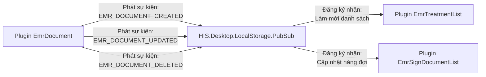

**Sơ đồ 6: Giao tiếp sự kiện PubSub**

**Các sự kiện EMR phổ biến:**
- `EMR_DOCUMENT_CREATED` - Tài liệu mới được tạo
- `EMR_DOCUMENT_UPDATED` - Tài liệu được sửa đổi
- `EMR_DOCUMENT_SIGNED` - Chữ ký đã được áp dụng
- `EMR_FLOW_ASSIGNED` - Tài liệu được điều hướng vào quy trình
- `EMR_APPROVAL_COMPLETED` - Bước phê duyệt đã hoàn thành

#### 2. Các cuộc gọi trực tiếp DelegateRegister

Đối với các hoạt động đồng bộ yêu cầu giá trị trả về, các plugin EMR sử dụng `DelegateRegister`:

```
// Ví dụ: Khởi chạy EmrDocument từ một plugin khác
DelegateRegister.OpenEmrDocument(treatmentId, documentTypeId);

// Ví dụ: Xác thực chữ ký trước khi lưu
bool isValid = DelegateRegister.ValidateEmrSignature(documentId);
```

**Nguồn:** [`.devin/wiki.json:46-51`](../../../../.devin/wiki.json#L46-L51), [`.devin/wiki.json:64-67`](../../../../.devin/wiki.json#L64-L67)

---

## Cấu hình và Tích hợp Backend

### EmrConfig LocalStorage

Dự án `HIS.Desktop.LocalStorage.EmrConfig` lưu bộ nhớ đệm (cache) các cấu hình đặc thù của EMR:

**Cấu hình được cache:**
- Các định nghĩa loại tài liệu
- Các template quy trình
- Ánh xạ vai trò người ký
- Các thiết lập chứng chỉ chữ ký số
- Chính sách lưu trữ tài liệu

**Các lớp chính (suy luận):**
- [[`HIS.Desktop.LocalStorage.EmrConfig/EmrConfigStore.cs`](../../../../HIS.Desktop.LocalStorage.EmrConfig/EmrConfigStore.cs)](../../../../HIS.Desktop.LocalStorage.EmrConfig/EmrConfigStore.cs) - Kho lưu trữ cache cấu hình
- [[`HIS.Desktop.LocalStorage.EmrConfig/DocumentTypeConfig.cs`](../../../../HIS.Desktop.LocalStorage.EmrConfig/DocumentTypeConfig.cs)](../../../../HIS.Desktop.LocalStorage.EmrConfig/DocumentTypeConfig.cs) - Các thiết lập loại tài liệu
- [[`HIS.Desktop.LocalStorage.EmrConfig/WorkflowConfig.cs`](../../../../HIS.Desktop.LocalStorage.EmrConfig/WorkflowConfig.cs)](../../../../HIS.Desktop.LocalStorage.EmrConfig/WorkflowConfig.cs) - Các thiết lập quy trình

### Tích hợp API

Các plugin EMR giao tiếp với các dịch vụ backend thông qua `HIS.Desktop.ApiConsumer`:

**Các endpoint EMR API (cấu trúc điển hình):**
- `POST /api/EmrDocument/Create` - Tạo tài liệu
- `PUT /api/EmrDocument/Update` - Cập nhật tài liệu
- `POST /api/EmrSign/Sign` - Áp dụng chữ ký số
- `GET /api/EmrFlow/GetByTreatment` - Truy xuất quy trình
- `POST /api/EmrFlow/Assign` - Gán tài liệu vào quy trình

**Xử lý lỗi:**
Tất cả các lệnh gọi EMR API đều bao gồm xử lý lỗi tiêu chuẩn cho:
- Lỗi mạng (logic thử lại - retry)
- Lỗi xác thực (yêu cầu đăng nhập lại)
- Lỗi xác thực dữ liệu (thông báo thân thiện với người dùng)
- Xung đột sửa đổi đồng thời (optimistic locking - khóa lạc quan)

**Nguồn:** [`.devin/wiki.json:54-58`](../../../../.devin/wiki.json#L54-L58), [`.devin/wiki.json:46-51`](../../../../.devin/wiki.json#L46-L51)

---

## Các Plugin EMR hỗ trợ

### Các chức năng EMR bổ sung

Bên ngoài sáu plugin chính đã được tài liệu hóa ở trên, phân hệ EMR bao gồm các plugin hỗ trợ bổ sung:

| Plugin | Tệp ước tính | Mục đích |
|--------|----------------|---------|
| `EmrBusiness` | ~15 | Lớp logic nghiệp vụ chung cho các hoạt động EMR |
| `EmrConfig` | ~15 | Giao diện quản lý cấu hình |
| `EmrDocumentList` | ~15 | Trình duyệt tài liệu chung (không cụ thể theo đợt điều trị) |
| `EmrDocumentType` | ~12 | Quản lý định nghĩa loại tài liệu |
| `EmrRole` | ~10 | Kiểm soát truy cập dựa trên vai trò cho EMR |
| `EmrTemplate` | ~10 | Quản lý template tài liệu |
| `EmrVersion` | ~10 | Theo dõi lịch sử phiên bản tài liệu |

### Phụ thuộc giữa các Plugin

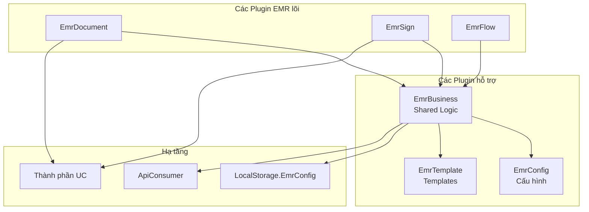

**Sơ đồ 7: Phụ thuộc giữa các Plugin EMR**

**Nguồn:** [`.devin/wiki.json:120-127`](../../../../.devin/wiki.json#L120-L127)

---

## Tích hợp với Hệ thống In MPS

Các tài liệu EMR có thể được in bằng MPS (Medical Print System). Quy trình tích hợp:

1. Người dùng chọn tài liệu trong `EmrDocumentList` hoặc `EmrTreatmentList`
2. Plugin gọi `DelegateRegister.PrintEmrDocument(documentId)`
3. Processor MPS truy xuất dữ liệu tài liệu qua API
4. Processor `Mps000xxx` phù hợp sẽ định dạng tài liệu
5. Kết quả được tạo ra qua FlexCell (PDF/Excel)

**Các Processor In EMR phổ biến:**
- Các dòng processor `Mps000xxx` cho các loại tài liệu EMR khác nhau
- Hỗ trợ tiêu đề thư, chữ ký và dấu mộc
- In hàng loạt cho các bộ tài liệu điều trị

**Nguồn:** [`.devin/wiki.json:14-18`](../../../../.devin/wiki.json#L14-L18), [`.devin/wiki.json:181-187`](../../../../.devin/wiki.json#L181-187)

---

## Tóm tắt

Phân hệ plugin EMR cung cấp khả năng quản lý bệnh án điện tử toàn diện thông qua 16 plugin chuyên biệt. Kiến trúc tách biệt các mối quan tâm thành quản lý tài liệu (`EmrDocument`, `EmrDocumentList`, `EmrTreatmentList`), chữ ký số (`EmrSign`, `EmrSignDocumentList`, `EmrSignerFlow`), và quy trình phê duyệt (`EmrFlow`). Các plugin này tận dụng hạ tầng HIS chung để giao tiếp API, lưu bộ nhớ đệm cục bộ và điều phối dựa trên sự kiện với các module hệ thống bệnh viện khác.

**Các nguyên tắc thiết kế chính:**
- **Tính modular dựa trên plugin** - Mỗi chức năng EMR là một plugin độc lập
- **Giao tiếp dựa trên sự kiện** - Sử dụng PubSub để giảm sự phụ thuộc lẫn nhau giữa các plugin
- **Kiến trúc phân lớp** - Các plugin UI ủy thác cho lớp logic nghiệp vụ
- **Dựa trên cấu hình** - Các quy trình và chữ ký có thể cấu hình mà không cần thay đổi mã nguồn
- **Tuân thủ tiêu chuẩn** - Chữ ký số PKCS#7, dấu thời gian RFC 3161

**Nguồn:** [`.devin/wiki.json:120-127`](../../../../.devin/wiki.json#L120-L127), [`.devin/wiki.json:8-9`](../../../../.devin/wiki.json#L8-L9), [`.devin/wiki.json:64-67`](../../../../.devin/wiki.json#L64-L67)