## Purpose and Scope

This document describes the ACS (Access Control System) plugins within the HIS Desktop application. These 13 plugins implement role-based access control (RBAC) and permission management for the hospital information system. The ACS plugins manage user accounts, roles, application/module permissions, and UI control-level access restrictions.

For information about the overall plugin architecture and lifecycle, see [Plugin System Architecture](../../01-architecture/plugin-system.md). For user interface components related to access control, see [UC Components Library](../../02-modules/uc-controls/form-type-controls.md). For system-level data administration including user configuration, see [SDA System Data Plugins](../../03-business-domains/administration/system-data.md).

---

## ACS Plugin Architecture Overview

The ACS subsystem consists of 13 specialized plugins that collectively manage the permission hierarchy within the HIS application. These plugins are located in `HIS/Plugins/ACS.Desktop.Plugins.*` directories and follow the standard plugin structure established by the HIS.Desktop framework.

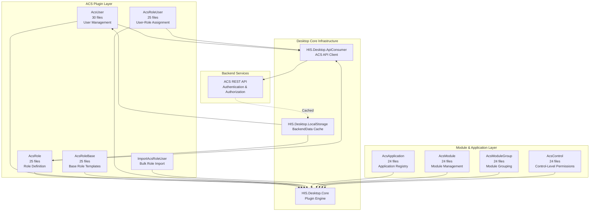

**Diagram: ACS Plugin Architecture and Dependencies**

This diagram illustrates the 13 ACS plugins organized into two functional layers: user/role management and application/module management. All plugins integrate with the desktop core infrastructure for plugin lifecycle, local caching, and backend API communication.

Sources: [[`.devin/wiki.json:110-117`](../../../../.devin/wiki.json#L110-L117)](../../../../.devin/wiki.json#L110-L117), High-level architecture diagrams (Diagram 2: Plugin-Based Architecture)

---

## Permission Hierarchy Model

The ACS system implements a four-level permission hierarchy that controls access from the application level down to individual UI controls.

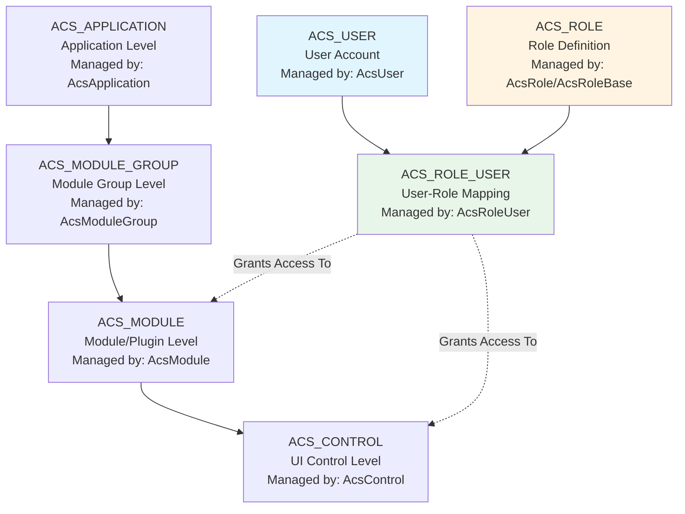

**Diagram: ACS Four-Level Permission Hierarchy**

This hierarchy allows fine-grained control where:
- **Application**: The entire HIS.Desktop application
- **Module Group**: Logical groupings of related plugins (e.g., "Patient Management", "Pharmacy")
- **Module**: Individual plugins (e.g., `HIS.Desktop.Plugins.Register`, `HIS.Desktop.Plugins.AssignPrescriptionPK`)
- **Control**: Specific UI controls within plugins (e.g., buttons, grids, form fields)

Sources: [[`.devin/wiki.json:110-117`](../../../../.devin/wiki.json#L110-L117)](../../../../.devin/wiki.json#L110-L117), High-level architecture diagrams (Diagram 2: Plugin-Based Architecture)

---

## Core ACS Plugins

### User Management: AcsUser

**Location**: `HIS/Plugins/ACS.Desktop.Plugins.AcsUser/` (30 files)

The `AcsUser` plugin provides comprehensive user account management functionality. This is the largest ACS plugin and serves as the primary interface for system administrators to manage user credentials, profiles, and account status.

**Key Responsibilities**:
- Create, update, delete, and search user accounts
- Manage user authentication credentials (username, password)
- Configure user profile information (name, email, department)
- Enable/disable user accounts
- Track user login history and session management
- Integration with backend ACS user repository

**Typical File Structure**:
```
ACS.Desktop.Plugins.AcsUser/
├── AcsUser.cs                    # Plugin entry point
├── Run/                          # Plugin execution logic
├── ADO/                          # Active Data Objects for user models
├── Base/                         # Base classes and interfaces
├── Properties/                   # Assembly info and resources
└── Resources/                    # UI resources, localization
```

Sources: [[`.devin/wiki.json:113-117`](../../../../.devin/wiki.json#L113-L117)](../../../../.devin/wiki.json#L113-L117)

---

### Role Management: AcsRole & AcsRoleBase

**Location**: 
- `HIS/Plugins/ACS.Desktop.Plugins.AcsRole/` (25 files)
- `HIS/Plugins/ACS.Desktop.Plugins.AcsRoleBase/` (25 files)

These plugins work together to define and manage role-based access control templates.

**AcsRole Plugin**:
- Create and edit custom roles
- Define role permissions by selecting allowed modules and controls
- Manage role metadata (name, description, priority)
- Clone existing roles to create templates
- Delete or archive roles

**AcsRoleBase Plugin**:
- Manage base role templates provided by the system
- Define standard roles (e.g., "Doctor", "Nurse", "Pharmacist", "Administrator")
- Provide immutable role templates for common hospital workflows
- Serve as starting points for custom role creation

**Role Definition Pattern**:
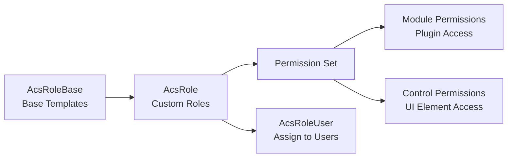

**Diagram: Role Definition and Assignment Flow**

Sources: [[`.devin/wiki.json:113-117`](../../../../.devin/wiki.json#L113-L117)](../../../../.devin/wiki.json#L113-L117)

---

### Role Assignment: AcsRoleUser & ImportAcsRoleUser

**Location**: 
- `HIS/Plugins/ACS.Desktop.Plugins.AcsRoleUser/` (25 files)
- `HIS/Plugins/ACS.Desktop.Plugins.ImportAcsRoleUser/`

**AcsRoleUser Plugin**:
- Assign roles to user accounts (many-to-many relationship)
- View current role assignments for users
- Remove role assignments
- Validate role conflicts and dependencies
- Audit role assignment history

**ImportAcsRoleUser Plugin**:
- Bulk import role assignments from external files (Excel, CSV)
- Validate import data against existing users and roles
- Preview import changes before committing
- Generate import error reports
- Rollback failed imports

**User-Role Assignment Model**:


**Diagram: User-Role Assignment Entity Relationship**

Sources: [[`.devin/wiki.json:113-117`](../../../../.devin/wiki.json#L113-L117)](../../../../.devin/wiki.json#L113-L117)

---

### Application & Module Management

#### AcsApplication Plugin

**Location**: `HIS/Plugins/ACS.Desktop.Plugins.AcsApplication/` (24 files)

Manages the registration and configuration of applications within the ACS ecosystem. In the HIS context, this primarily registers the `HIS.Desktop` application itself and any satellite applications.

**Key Functions**:
- Register application metadata (code, name, version)
- Configure application-level permissions
- Define application endpoints and authentication requirements
- Manage application status and deployment configuration

#### AcsModule Plugin

**Location**: `HIS/Plugins/ACS.Desktop.Plugins.AcsModule/` (24 files)

Manages individual plugin modules within the application. Each plugin in the HIS system (e.g., `AssignPrescriptionPK`, `Register`, `Transaction`) is registered as an ACS module.

**Key Functions**:
- Register plugins as ACS modules
- Define module metadata (code, name, description, icon)
- Configure module visibility and availability
- Set module execution requirements and dependencies
- Map modules to module groups

#### AcsModuleGroup Plugin

**Location**: `HIS/Plugins/ACS.Desktop.Plugins.AcsModuleGroup/` (24 files)

Organizes modules into logical groups for easier permission management and navigation.

**Key Functions**:
- Create and manage module groups (e.g., "Outpatient", "Inpatient", "Pharmacy", "Laboratory")
- Assign modules to groups
- Define group-level permissions
- Configure group ordering and hierarchy

**Application-Module-Group Relationship**:
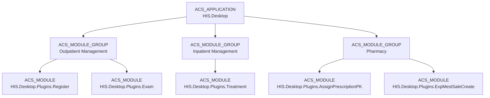

**Diagram: Application-Module Group-Module Hierarchy Example**

Sources: [[`.devin/wiki.json:113-117`](../../../../.devin/wiki.json#L113-L117)](../../../../.devin/wiki.json#L113-L117)

---

### Control-Level Permissions: AcsControl

**Location**: `HIS/Plugins/ACS.Desktop.Plugins.AcsControl/` (24 files)

The `AcsControl` plugin provides the most granular level of access control by managing permissions for individual UI controls within plugins.

**Key Functions**:
- Register UI controls from plugins (buttons, grids, text boxes, checkboxes)
- Define control metadata (control code, name, parent module)
- Configure control visibility and enabled state based on role
- Support control-level auditing
- Integration with `SdaHideControl` for UI customization

**Control Permission Application**:
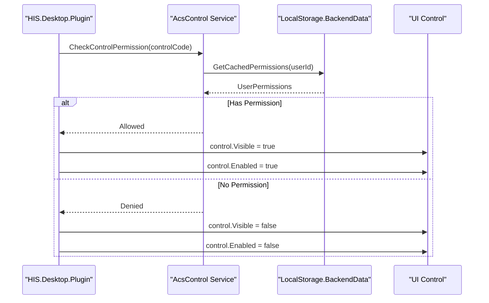

**Diagram: Control-Level Permission Check Sequence**

**Common Control Types Managed**:
- **btnSave**: Save button in forms
- **btnDelete**: Delete button in grids
- **btnExport**: Export data button
- **gridView**: Data grid visibility
- **txtSensitiveField**: Sensitive input fields (e.g., salary, confidential notes)

Sources: [[`.devin/wiki.json:113-117`](../../../../.devin/wiki.json#L113-L117)](../../../../.devin/wiki.json#L113-L117)

---

## Data Flow and API Integration

The ACS plugins interact with backend services through the `HIS.Desktop.ApiConsumer` layer and cache permission data locally for performance.

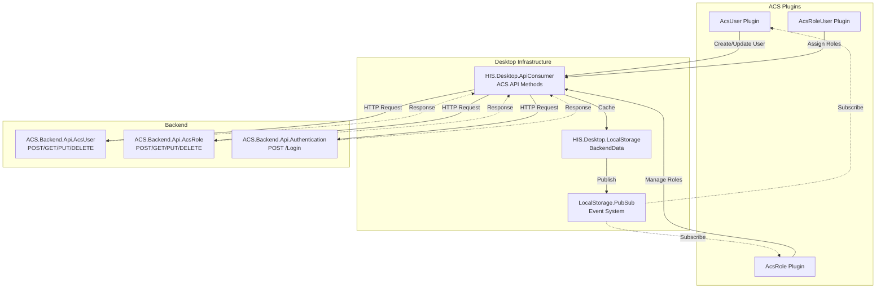

**Diagram: ACS Data Flow Between Plugins, API Consumer, and Backend**

### Caching Strategy

The ACS system caches permission data in `HIS.Desktop.LocalStorage.BackendData` to minimize API calls and improve application responsiveness:

| Data Type | Cache Key | Refresh Strategy |
|-----------|-----------|------------------|
| Current User Permissions | `CurrentUserPermissions` | On login, manual refresh |
| User List | `AcsUserList` | On demand, TTL 5 minutes |
| Role Definitions | `AcsRoleList` | On demand, TTL 10 minutes |
| Module Registry | `AcsModuleList` | Application startup, manual refresh |
| User-Role Assignments | `AcsRoleUserList` | On demand, invalidate on change |

Sources: [[`.devin/wiki.json:44-53`](../../../../.devin/wiki.json#L44-L53)](../../../../.devin/wiki.json#L44-L53), High-level architecture diagrams (Diagram 3: Data Flow & API Integration)

---

## Plugin Communication Patterns

ACS plugins communicate with other HIS plugins using two primary patterns:

### 1. DelegateRegister Pattern

Used for direct plugin-to-plugin communication when a plugin needs to query or modify ACS data.

**Example**: A plugin checking if the current user has permission to access a feature:

```
// Pattern used in plugins
var hasPermission = HIS.Desktop.DelegateRegister.CheckModulePermission(moduleCode);
if (hasPermission) {
    // Execute feature
}
```

### 2. PubSub Event Pattern

Used for broadcasting ACS-related events to all interested plugins.

**Common ACS Events**:
- `AcsUserChanged`: Published when user data is updated
- `AcsRoleAssigned`: Published when roles are assigned/revoked
- `AcsPermissionRefreshed`: Published when permission cache is invalidated
- `AcsUserLoggedOut`: Published on user logout

**Event Flow**:
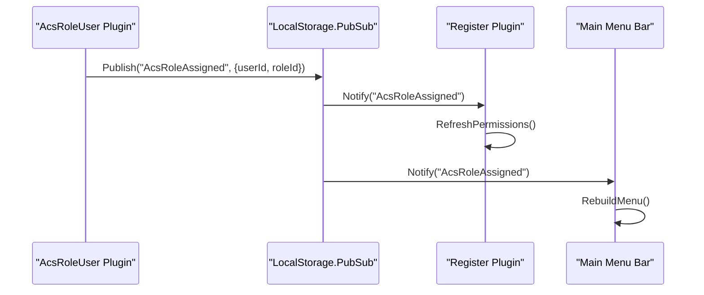

**Diagram: PubSub Event Flow for Role Assignment**

Sources: [[`.devin/wiki.json:44-53`](../../../../.devin/wiki.json#L44-L53)](../../../../.devin/wiki.json#L44-L53), High-level architecture diagrams (Diagram 2: Plugin-Based Architecture)

---

## Integration with HIS Desktop Core

The ACS plugins integrate tightly with several HIS Desktop core systems:

### Session Management

On user login, the ACS system:
1. Authenticates credentials via `ACS.Backend.Api.Authentication`
2. Retrieves user permissions and roles
3. Caches permissions in `LocalStorage.BackendData`
4. Initializes the session with permission context
5. Publishes `UserLoggedIn` event to all plugins

### Plugin Discovery and Registration

During application startup:
1. `Inventec.Desktop.Core` discovers all installed plugins
2. Each plugin registers itself with the ACS module registry via `AcsModule` API
3. Plugin metadata (code, name, icon) is stored in ACS database
4. Plugin availability is determined by user role permissions

### Menu and Navigation

The main application menu is dynamically generated based on:
- User's assigned roles (via `AcsRoleUser`)
- Module permissions (via `AcsModule`)
- Module group hierarchy (via `AcsModuleGroup`)

**Menu Generation Flow**:
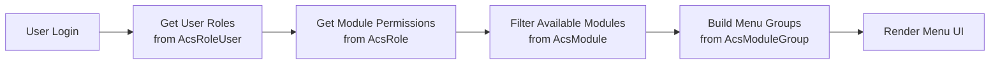

**Diagram: Dynamic Menu Generation Based on ACS Permissions**

Sources: [[`.devin/wiki.json:34-43`](../../../../.devin/wiki.json#L34-L43)](../../../../.devin/wiki.json#L34-L43), High-level architecture diagrams (Diagram 1: Four-Module System Architecture)

---

## Summary of ACS Plugins

| Plugin | Files | Primary Responsibility |
|--------|-------|------------------------|
| **AcsUser** | 30 | User account management, authentication credentials |
| **AcsRole** | 25 | Custom role definition and management |
| **AcsRoleBase** | 25 | System-provided base role templates |
| **AcsRoleUser** | 25 | User-to-role assignment and management |
| **ImportAcsRoleUser** | - | Bulk import role assignments |
| **AcsApplication** | 24 | Application registration and configuration |
| **AcsModule** | 24 | Plugin/module registration and permissions |
| **AcsModuleGroup** | 24 | Module grouping and organization |
| **AcsControl** | 24 | UI control-level permission management |
| **Others** | - | Additional ACS utilities and helpers |

All ACS plugins follow the standard HIS plugin architecture with entry point classes, `Run/` folders for execution logic, `ADO/` folders for data models, and integration with `HIS.Desktop.ApiConsumer` for backend communication.

Sources: [[`.devin/wiki.json:110-117`](../../../../.devin/wiki.json#L110-L117)](../../../../.devin/wiki.json#L110-L117), High-level architecture diagrams (Diagram 2: Plugin-Based Architecture)

# EMR Electronic Medical Record Plugins


## Purpose and Scope

This document covers the EMR (Electronic Medical Record) plugin subsystem within the HIS Desktop application. The EMR plugins provide functionality for managing electronic medical records, including document creation, digital signature integration, and approval workflow management. This subsystem consists of 16 specialized plugins located in `HIS/Plugins/EMR.Desktop.Plugins.*`.

For general plugin architecture patterns and communication mechanisms, see [Plugin System Architecture](../../01-architecture/plugin-system.md). For related business logic plugins that generate medical data consumed by EMR, see [HIS Core Business Plugins](../../02-modules/his-desktop/business-plugins.md).

**Sources:** [`.devin/wiki.json:120-127`](../../../../.devin/wiki.json#L120-L127)

---

## EMR Plugin Overview

The EMR subsystem contains 16 plugins that collectively manage the lifecycle of electronic medical records from creation through digital signature and approval workflows.

### EMR Plugin Inventory

| Plugin Name | Files | Primary Responsibility |
|------------|-------|------------------------|
| `EmrDocument` | 42 | Document creation, editing, and management interface |
| `EmrSignDocumentList` | 23 | List view for documents requiring signatures |
| `EmrSignerFlow` | 22 | Signer workflow configuration and management |
| `EmrFlow` | 21 | Approval workflow definition and execution |
| `EmrTreatmentList` | 21 | Treatment-linked document listing |
| `EmrSign` | 18 | Digital signature execution interface |
| `EmrBusiness` | ~15 | Business logic layer for EMR operations |
| `EmrConfig` | ~15 | EMR configuration management |
| `EmrDocumentList` | ~15 | General document listing interface |
| Additional 7 plugins | ~10 each | Supporting functionality for EMR workflows |

**Sources:** [`.devin/wiki.json:120-127`](../../../../.devin/wiki.json#L120-L127)

---

## EMR Plugin Architecture

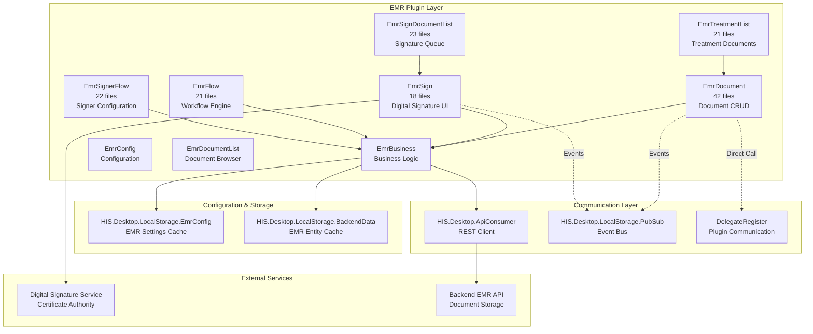

**Diagram 1: EMR Plugin Architecture and Dependencies**

This diagram shows the layered architecture of EMR plugins. The top layer contains user-facing plugins, which delegate business logic to `EmrBusiness`. Configuration and data caching are provided by `LocalStorage` components. Communication occurs through REST APIs, event-driven PubSub, and direct plugin-to-plugin calls via `DelegateRegister`.

**Sources:** [`.devin/wiki.json:8-9`](../../../../.devin/wiki.json#L8-L9, [`.devin/wiki.json:64-67`](../../../../.devin/wiki.json#L64-L67, [`.devin/wiki.json:120-127`](../../../../.devin/wiki.json#L120-L127)

---

## Core EMR Plugins

### EmrDocument Plugin

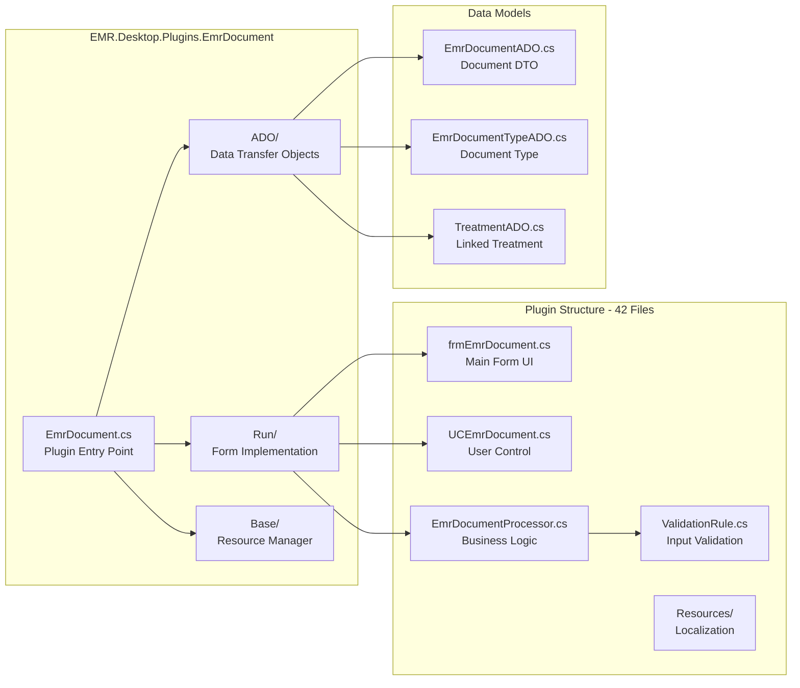

**Diagram 2: EmrDocument Plugin Structure**

The `EmrDocument` plugin follows the standard HIS plugin architecture pattern with 42 files organized into functional folders. The entry point instantiates the main form, which uses user controls for document editing. Business logic is separated into processor classes, with data transfer objects (ADOs) defining the data contract.

**Key Files (inferred structure):**
- [[`HIS/Plugins/EMR.Desktop.Plugins.EmrDocument/EmrDocument.cs`](../../../../HIS/Plugins/EMR.Desktop.Plugins.EmrDocument/EmrDocument.cs)](../../../../HIS/Plugins/EMR.Desktop.Plugins.EmrDocument/EmrDocument.cs) - Plugin entry point implementing `Inventec.Desktop.Common.Modules.Module` interface
- [[`HIS/Plugins/EMR.Desktop.Plugins.EmrDocument/Run/frmEmrDocument.cs`](../../../../HIS/Plugins/EMR.Desktop.Plugins.EmrDocument/Run/frmEmrDocument.cs)](../../../../HIS/Plugins/EMR.Desktop.Plugins.EmrDocument/Run/frmEmrDocument.cs) - Main document editing form
- [[`HIS/Plugins/EMR.Desktop.Plugins.EmrDocument/ADO/EmrDocumentADO.cs`](../../../../HIS/Plugins/EMR.Desktop.Plugins.EmrDocument/ADO/EmrDocumentADO.cs)](../../../../HIS/Plugins/EMR.Desktop.Plugins.EmrDocument/ADO/EmrDocumentADO.cs) - Document data transfer object
- [[`HIS/Plugins/EMR.Desktop.Plugins.EmrDocument/Base/ResourceLangManager.cs`](../../../../HIS/Plugins/EMR.Desktop.Plugins.EmrDocument/Base/ResourceLangManager.cs)](../../../../HIS/Plugins/EMR.Desktop.Plugins.EmrDocument/Base/ResourceLangManager.cs) - Localization resource manager

**Functionality:**
- Create and edit electronic medical record documents
- Link documents to treatment records
- Support multiple document types (progress notes, discharge summaries, procedure reports)
- Rich text editing with medical templates
- Document version control and history tracking

**Sources:** [`.devin/wiki.json:8-9`](../../../../.devin/wiki.json#L8-L9, [`.devin/wiki.json:64-67`](../../../../.devin/wiki.json#L64-L67, [`.devin/wiki.json:120-127`](../../../../.devin/wiki.json#L120-L127)

---

### Digital Signature Plugins

The EMR subsystem includes three interconnected plugins for digital signature management: `EmrSign`, `EmrSignDocumentList`, and `EmrSignerFlow`.

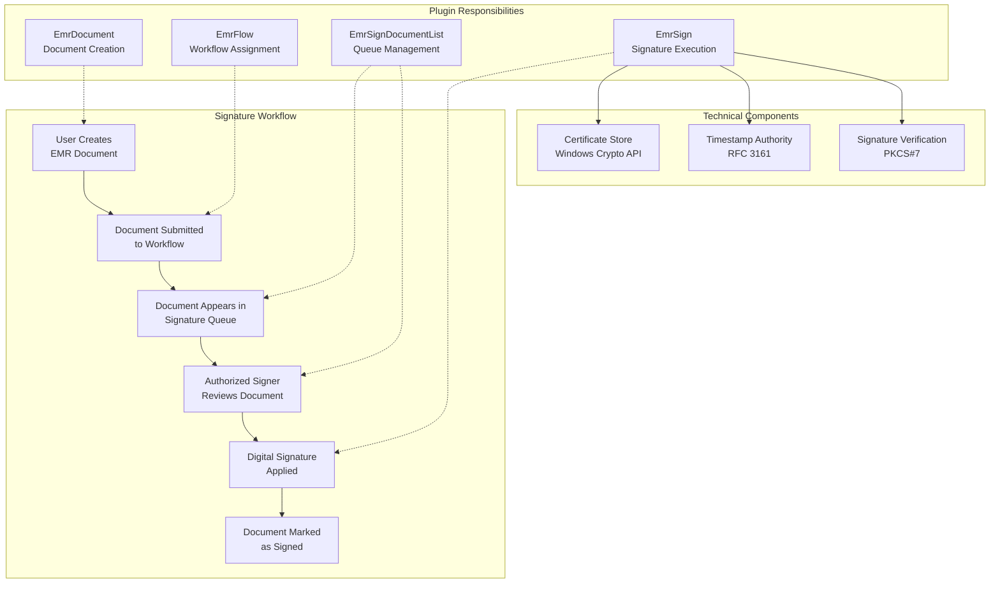

**Diagram 3: Digital Signature Workflow**

#### EmrSign Plugin (18 files)

The `EmrSign` plugin provides the user interface and technical implementation for applying digital signatures to EMR documents.

**Key Features:**
- Certificate selection from Windows Certificate Store
- Integration with USB token/smart card readers
- PKCS#7 signature format
- RFC 3161 timestamp authority integration
- Signature validation and verification

**Key Files (inferred):**
- [[`HIS/Plugins/EMR.Desktop.Plugins.EmrSign/EmrSign.cs`](../../../../HIS/Plugins/EMR.Desktop.Plugins.EmrSign/EmrSign.cs)](../../../../HIS/Plugins/EMR.Desktop.Plugins.EmrSign/EmrSign.cs) - Plugin entry
- [[`HIS/Plugins/EMR.Desktop.Plugins.EmrSign/Run/frmEmrSign.cs`](../../../../HIS/Plugins/EMR.Desktop.Plugins.EmrSign/Run/frmEmrSign.cs)](../../../../HIS/Plugins/EMR.Desktop.Plugins.EmrSign/Run/frmEmrSign.cs) - Signature dialog
- [[`HIS/Plugins/EMR.Desktop.Plugins.EmrSign/Crypto/DigitalSignatureHelper.cs`](../../../../HIS/Plugins/EMR.Desktop.Plugins.EmrSign/Crypto/DigitalSignatureHelper.cs)](../../../../HIS/Plugins/EMR.Desktop.Plugins.EmrSign/Crypto/DigitalSignatureHelper.cs) - Cryptographic operations
- [[`HIS/Plugins/EMR.Desktop.Plugins.EmrSign/Validation/CertificateValidator.cs`](../../../../HIS/Plugins/EMR.Desktop.Plugins.EmrSign/Validation/CertificateValidator.cs)](../../../../HIS/Plugins/EMR.Desktop.Plugins.EmrSign/Validation/CertificateValidator.cs) - Certificate validation

#### EmrSignDocumentList Plugin (23 files)

Provides a queue view of documents requiring signatures, organized by user role and workflow status.

**Key Features:**
- Multi-user signature queue management
- Filter by document type, date range, treatment
- Bulk signature operations
- Document preview before signing
- Signature status tracking

#### EmrSignerFlow Plugin (22 files)

Configures the signing workflow, including signer roles, sequence, and conditional logic.

**Key Features:**
- Define signer roles (attending physician, department head, etc.)
- Configure sequential vs. parallel signing
- Set conditional signing rules
- Override and delegation management

**Sources:** [`.devin/wiki.json:120-127`](../../../../.devin/wiki.json#L120-L127)

---

### Approval Workflow Plugins

#### EmrFlow Plugin (21 files)

The `EmrFlow` plugin implements the approval workflow engine for EMR documents, managing document routing through multiple approval stages.

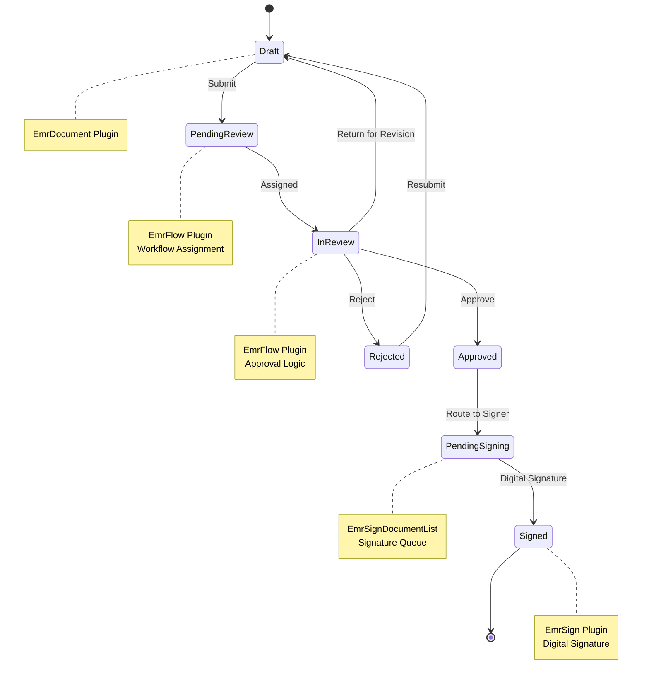

**Diagram 4: EMR Document State Machine**

**Flow Definition Structure:**
```
EmrFlow Entity:
- FlowId: Unique identifier
- FlowName: Display name
- DocumentTypeId: Applicable document types
- Steps: Ordered list of approval steps
  - StepOrder: Sequence number
  - RoleId: Required approver role
  - IsRequired: Mandatory vs. optional
  - Conditions: Business rules for step execution
```

**Key Operations:**
- `CreateFlow()` - Define new approval workflow
- `AssignDocument()` - Route document to workflow
- `GetPendingTasks()` - Retrieve user's approval queue
- `ApproveStep()` - Complete approval step
- `RejectDocument()` - Send back for revision
- `OverrideFlow()` - Administrative workflow override

**Key Files (inferred):**
- [[`HIS/Plugins/EMR.Desktop.Plugins.EmrFlow/EmrFlow.cs`](../../../../HIS/Plugins/EMR.Desktop.Plugins.EmrFlow/EmrFlow.cs)](../../../../HIS/Plugins/EMR.Desktop.Plugins.EmrFlow/EmrFlow.cs) - Plugin entry
- [[`HIS/Plugins/EMR.Desktop.Plugins.EmrFlow/Run/frmEmrFlow.cs`](../../../../HIS/Plugins/EMR.Desktop.Plugins.EmrFlow/Run/frmEmrFlow.cs)](../../../../HIS/Plugins/EMR.Desktop.Plugins.EmrFlow/Run/frmEmrFlow.cs) - Flow designer UI
- [[`HIS/Plugins/EMR.Desktop.Plugins.EmrFlow/Engine/WorkflowEngine.cs`](../../../../HIS/Plugins/EMR.Desktop.Plugins.EmrFlow/Engine/WorkflowEngine.cs)](../../../../HIS/Plugins/EMR.Desktop.Plugins.EmrFlow/Engine/WorkflowEngine.cs) - Flow execution logic
- [[`HIS/Plugins/EMR.Desktop.Plugins.EmrFlow/ADO/EmrFlowADO.cs`](../../../../HIS/Plugins/EMR.Desktop.Plugins.EmrFlow/ADO/EmrFlowADO.cs)](../../../../HIS/Plugins/EMR.Desktop.Plugins.EmrFlow/ADO/EmrFlowADO.cs) - Flow definition DTO

**Sources:** [`.devin/wiki.json:120-127`](../../../../.devin/wiki.json#L120-L127)

---

### Treatment Integration

#### EmrTreatmentList Plugin (21 files)

Provides document listing filtered by treatment record, enabling clinicians to view all EMR documents associated with a specific patient treatment episode.

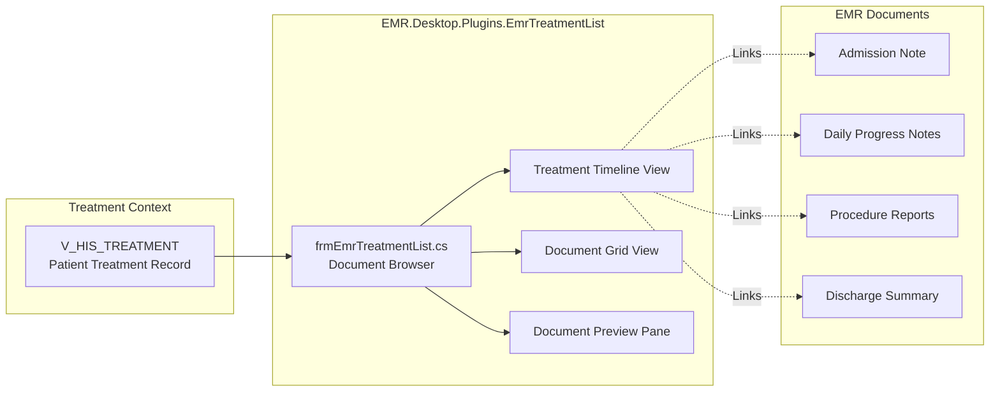

**Diagram 5: Treatment-Document Linking**

**Key Features:**
- Chronological document timeline by treatment
- Document type categorization
- Quick access to create new documents
- Integration with `EmrDocument` for editing
- Print all treatment documents

**Integration Points:**
- Receives treatment context from calling plugin (e.g., `TreatmentFinish`, `ServiceExecute`)
- Launches `EmrDocument` plugin for document creation/editing
- Communicates document updates via `PubSub` events

**Sources:** [`.devin/wiki.json:120-127`](../../../../.devin/wiki.json#L120-L127)

---

## Data Models and Communication

### EMR Data Transfer Objects (ADOs)

The EMR plugins use specialized ADO classes for data transfer between UI and business logic layers:

| ADO Class | Purpose | Key Properties |
|-----------|---------|----------------|
| `EmrDocumentADO` | Document entity | DocumentId, DocumentTypeId, Content, TreatmentId, Status |
| `EmrDocumentTypeADO` | Document type definition | TypeId, TypeCode, TypeName, IsRequiredSigning |
| `EmrFlowADO` | Workflow definition | FlowId, Steps, Conditions |
| `EmrSignerADO` | Signer information | SignerId, SignerName, CertificateSerial, SignDate |
| `TreatmentDocumentADO` | Treatment-document link | TreatmentId, DocumentIds, DocumentStatuses |

**Sources:** [`.devin/wiki.json:38-42`](../../../../.devin/wiki.json#L38-L42)

---

### Plugin Communication Patterns

EMR plugins use multiple communication mechanisms for inter-plugin coordination:

#### 1. PubSub Events

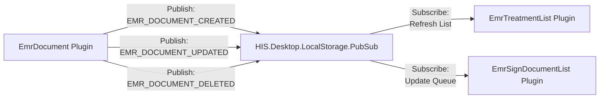

**Diagram 6: PubSub Event Communication**

**Common EMR Events:**
- `EMR_DOCUMENT_CREATED` - New document created
- `EMR_DOCUMENT_UPDATED` - Document modified
- `EMR_DOCUMENT_SIGNED` - Signature applied
- `EMR_FLOW_ASSIGNED` - Document routed to workflow
- `EMR_APPROVAL_COMPLETED` - Approval step finished

#### 2. DelegateRegister Direct Calls

For synchronous operations requiring return values, EMR plugins use `DelegateRegister`:

```
// Example: Launch EmrDocument from another plugin
DelegateRegister.OpenEmrDocument(treatmentId, documentTypeId);

// Example: Validate signature before saving
bool isValid = DelegateRegister.ValidateEmrSignature(documentId);
```

**Sources:** [`.devin/wiki.json:46-51`](../../../../.devin/wiki.json#L46-L51, [`.devin/wiki.json:64-67`](../../../../.devin/wiki.json#L64-L67)

---

## Configuration and Backend Integration

### EmrConfig LocalStorage

The `HIS.Desktop.LocalStorage.EmrConfig` project caches EMR-specific configuration:

**Cached Configuration:**
- Document type definitions
- Workflow templates
- Signer role mappings
- Digital signature certificate settings
- Document retention policies

**Key Classes (inferred):**
- [[`HIS.Desktop.LocalStorage.EmrConfig/EmrConfigStore.cs`](../../../../HIS.Desktop.LocalStorage.EmrConfig/EmrConfigStore.cs)](../../../../HIS.Desktop.LocalStorage.EmrConfig/EmrConfigStore.cs) - Configuration cache
- [[`HIS.Desktop.LocalStorage.EmrConfig/DocumentTypeConfig.cs`](../../../../HIS.Desktop.LocalStorage.EmrConfig/DocumentTypeConfig.cs)](../../../../HIS.Desktop.LocalStorage.EmrConfig/DocumentTypeConfig.cs) - Document type settings
- [[`HIS.Desktop.LocalStorage.EmrConfig/WorkflowConfig.cs`](../../../../HIS.Desktop.LocalStorage.EmrConfig/WorkflowConfig.cs)](../../../../HIS.Desktop.LocalStorage.EmrConfig/WorkflowConfig.cs) - Workflow settings

### API Integration

EMR plugins communicate with backend services through `HIS.Desktop.ApiConsumer`:

**EMR API Endpoints (typical structure):**
- `POST /api/EmrDocument/Create` - Create document
- `PUT /api/EmrDocument/Update` - Update document
- `POST /api/EmrSign/Sign` - Apply digital signature
- `GET /api/EmrFlow/GetByTreatment` - Retrieve workflow
- `POST /api/EmrFlow/Assign` - Assign document to flow

**Error Handling:**
All EMR API calls include standard error handling for:
- Network failures (retry logic)
- Authentication failures (re-login prompt)
- Validation errors (user-friendly messages)
- Concurrent modification conflicts (optimistic locking)

**Sources:** [`.devin/wiki.json:54-58`](../../../../.devin/wiki.json#L54-L58, [`.devin/wiki.json:46-51`](../../../../.devin/wiki.json#L46-L51)

---

## Supporting EMR Plugins

### Additional EMR Functionality

Beyond the six major plugins documented above, the EMR subsystem includes additional supporting plugins:

| Plugin | Estimated Files | Purpose |
|--------|----------------|---------|
| `EmrBusiness` | ~15 | Shared business logic layer for EMR operations |
| `EmrConfig` | ~15 | Configuration management interface |
| `EmrDocumentList` | ~15 | General document browser (not treatment-specific) |
| `EmrDocumentType` | ~12 | Document type definition management |
| `EmrRole` | ~10 | Role-based access control for EMR |
| `EmrTemplate` | ~10 | Document template management |
| `EmrVersion` | ~10 | Document version history tracking |

### Plugin Dependencies

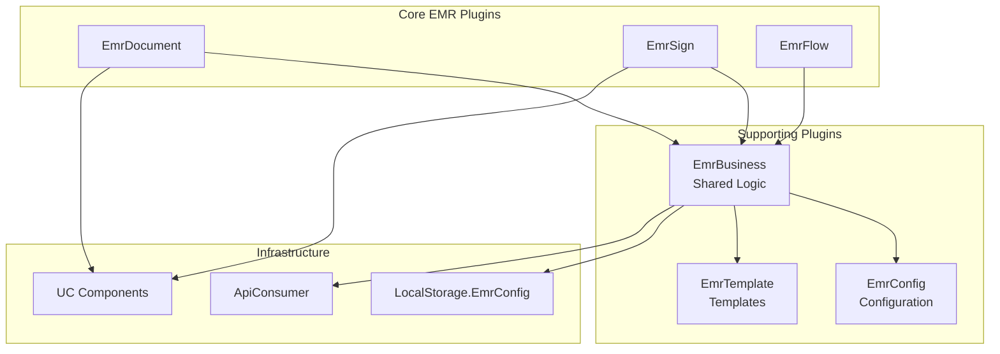

**Diagram 7: EMR Plugin Dependencies**

**Sources:** [`.devin/wiki.json:120-127`](../../../../.devin/wiki.json#L120-L127)

---

## Integration with MPS Print System

EMR documents can be printed using the MPS (Medical Print System). The integration flow:

1. User selects document in `EmrDocumentList` or `EmrTreatmentList`
2. Plugin calls `DelegateRegister.PrintEmrDocument(documentId)`
3. MPS processor retrieves document data via API
4. Appropriate `Mps000xxx` processor formats document
5. Output generated via FlexCell (PDF/Excel)

**Common EMR Print Processors:**
- `Mps000xxx` series processors for various EMR document types
- Support for letterhead, signatures, and stamps
- Batch printing for treatment document sets

**Sources:** [`.devin/wiki.json:14-18`](../../../../.devin/wiki.json#L14-L18, [`.devin/wiki.json:181-187`](../../../../.devin/wiki.json#L181-L187)

---

## Summary

The EMR plugin subsystem provides comprehensive electronic medical record management through 16 specialized plugins. The architecture separates concerns into document management (`EmrDocument`, `EmrDocumentList`, `EmrTreatmentList`), digital signatures (`EmrSign`, `EmrSignDocumentList`, `EmrSignerFlow`), and approval workflows (`EmrFlow`). These plugins leverage the common HIS infrastructure for API communication, local caching, and event-driven coordination with other hospital system modules.

**Key Design Principles:**
- **Plugin-based modularity** - Each EMR function is an independent plugin
- **Event-driven communication** - PubSub for loose coupling between plugins
- **Layered architecture** - UI plugins delegate to business logic layer
- **Configuration-driven** - Workflows and signatures configurable without code changes
- **Standards compliance** - PKCS#7 digital signatures, RFC 3161 timestamps

**Sources:** [`.devin/wiki.json:120-127`](../../../../.devin/wiki.json#L120-L127, [`.devin/wiki.json:8-9`](../../../../.devin/wiki.json#L8-L9, [`.devin/wiki.json:64-67`](../../../../.devin/wiki.json#L64-L67)