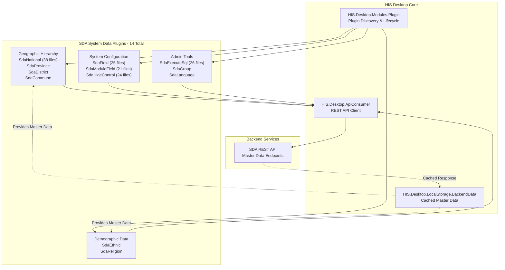
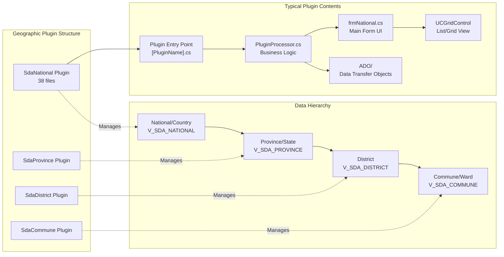
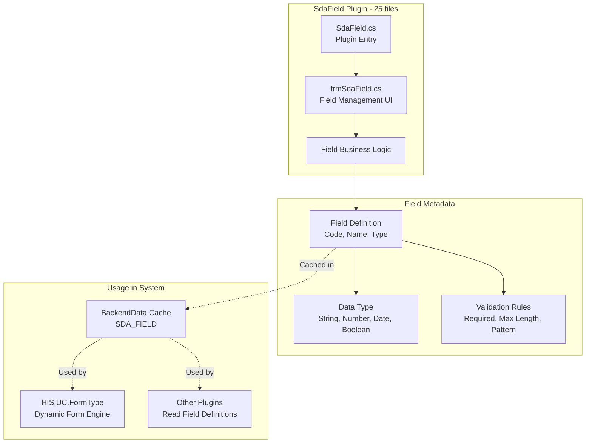
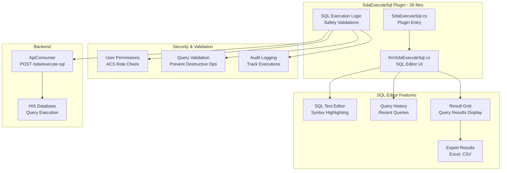
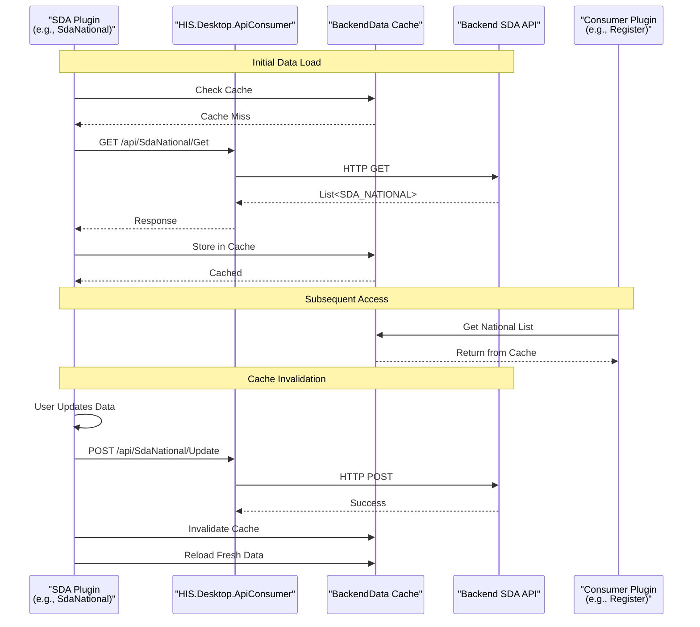
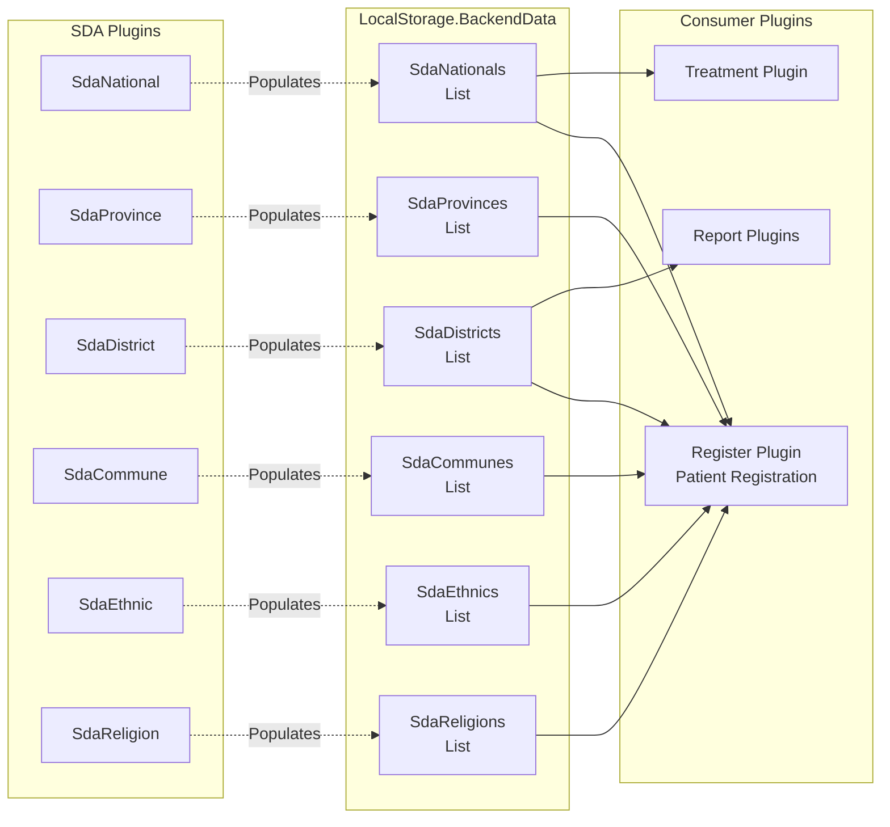

## Purpose and Scope

This document covers the SDA (System Data Administration) plugins located in [HIS/Plugins/SDA.Desktop.Plugins.*](). These 14 plugins manage system-level master data including geographical hierarchies (national, provincial, district, commune), demographic data (ethnicity, religion), system configuration fields, and administrative utilities like SQL execution and UI control visibility management.

For information about other plugin categories:
- Core hospital business logic plugins, see [HIS Core Business Plugins](../../02-modules/his-desktop/business-plugins.md)
- Access control and user management, see [ACS Access Control Plugins](../../03-business-domains/administration/access-control.md)
- Electronic medical records, see [EMR Electronic Medical Record Plugins](../../02-modules/his-desktop/business-plugins.md#emr)
- Configuration and caching systems, see [LocalStorage & Configuration](../../02-modules/his-desktop/core.md)

---

## SDA Plugin Architecture Overview

The SDA plugins form a specialized subsystem within the HIS plugin architecture, focused on managing reference data and system metadata that other plugins depend on.



**Diagram: SDA Plugin System Architecture**

Sources: [[`.devin/wiki.json:8-9`](../../../../.devin/wiki.json#L8-L9)](../../../../.devin/wiki.json#L8-L9), [[`.devin/wiki.json:159-167`](../../../../.devin/wiki.json#L159-L167)](../../../../.devin/wiki.json#L159-L167)

---

## Plugin Categories and File Structure

The 14 SDA plugins are organized into functional categories. Each plugin follows the standard HIS plugin structure with entry point, UI components, and data models.

| Plugin Name | Files | Primary Function | Key Features |
|------------|-------|------------------|--------------|
| **Geographic Hierarchy** |
| SdaNational | 38 | Manage country/nationality data | CRUD operations, search, filter |
| SdaProvince | ~20-25 | Manage province/state data | Hierarchical under national |
| SdaDistrict | ~20-25 | Manage district data | Hierarchical under province |
| SdaCommune | ~20-25 | Manage commune/ward data | Hierarchical under district |
| **Demographic Reference** |
| SdaEthnic | ~20-25 | Manage ethnic group data | Ethnicity codes, descriptions |
| SdaReligion | ~20-25 | Manage religion data | Religion codes, descriptions |
| **System Configuration** |
| SdaField | 25 | Manage system field definitions | Field metadata, data types |
| SdaModuleField | 21 | Manage module-field relationships | Field visibility per module |
| SdaHideControl | 24 | Control UI element visibility | Show/hide controls dynamically |
| **Administrative Tools** |
| SdaExecuteSql | 26 | Execute custom SQL queries | Admin SQL execution utility |
| SdaGroup | ~20-25 | Manage system groups | Group definitions |
| SdaLanguage | ~20-25 | Manage language/localization | Multi-language support |
| **Others** |
| SdaConfigApp | ~20-25 | Application configuration | System settings |
| SdaTranslate | ~20-25 | Translation management | Text translation keys |

Sources: [[`.devin/wiki.json:159-167`](../../../../.devin/wiki.json#L159-L167)](../../../../.devin/wiki.json#L159-L167)

---

## Geographic Hierarchy Plugin Structure

The geographic hierarchy plugins (National, Province, District, Commune) implement a four-level administrative division system used throughout Vietnam's healthcare system.



**Diagram: Geographic Plugin Hierarchy and Structure**

### SdaNational Plugin

The largest geographic plugin with 38 files, managing national/country master data.

**Key Components:**
- **Entry Point**: [[`HIS/Plugins/SDA.Desktop.Plugins.SdaNational/SdaNational.cs`](../../../../HIS/Plugins/SDA.Desktop.Plugins.SdaNational/SdaNational.cs)](../../../../HIS/Plugins/SDA.Desktop.Plugins.SdaNational/SdaNational.cs) - Plugin registration
- **Main Form**: [[`HIS/Plugins/SDA.Desktop.Plugins.SdaNational/Run/frmSdaNational.cs`](../../../../HIS/Plugins/SDA.Desktop.Plugins.SdaNational/Run/frmSdaNational.cs)](../../../../HIS/Plugins/SDA.Desktop.Plugins.SdaNational/Run/frmSdaNational.cs) - National data grid and CRUD operations
- **Processor**: [[`HIS/Plugins/SDA.Desktop.Plugins.SdaNational/PluginProcessor.cs`](../../../../HIS/Plugins/SDA.Desktop.Plugins.SdaNational/PluginProcessor.cs)](../../../../HIS/Plugins/SDA.Desktop.Plugins.SdaNational/PluginProcessor.cs) - Plugin lifecycle management
- **Data Models**: [HIS/Plugins/SDA.Desktop.Plugins.SdaNational/ADO/]() - Data transfer objects for national data

**Common Operations:**
- Create, read, update, delete (CRUD) national/country records
- Search and filter by national code or name
- Import/export national data
- Validation of national code uniqueness

### Province, District, Commune Plugins

These plugins follow similar patterns but manage different hierarchical levels. Each plugin:
- Maintains parent-child relationships (Province → National, District → Province, Commune → District)
- Provides dropdown/selection controls for other plugins
- Caches data in `HIS.Desktop.LocalStorage.BackendData` for performance
- Validates hierarchical integrity on create/update operations

Sources: [HIS/Plugins/SDA.Desktop.Plugins.SdaNational/](), [[`.devin/wiki.json:159-167`](../../../../.devin/wiki.json#L159-L167)](../../../../.devin/wiki.json#L159-L167)

---

## System Configuration Plugins

### SdaField Plugin

Manages system field definitions and metadata for dynamic form generation.



**Diagram: SdaField Plugin and Field Metadata System**

The `SdaField` plugin defines custom fields that can be added to various system forms. These field definitions include:
- Field code (unique identifier)
- Field name (display label)
- Data type (string, numeric, date, boolean)
- Validation constraints
- Default values

Sources: [HIS/Plugins/SDA.Desktop.Plugins.SdaField/](), [[`.devin/wiki.json:164-165`](../../../../.devin/wiki.json#L164-L165)](../../../../.devin/wiki.json#L164-L165)

### SdaModuleField Plugin

Links fields to specific modules, controlling which fields appear in which modules.

**Key Functions:**
- Define field visibility per module
- Map `SDA_FIELD` records to `HIS.Desktop.Plugins.*` modules
- Enable/disable fields dynamically based on module context
- Support for conditional field display logic

**Integration Points:**
- Reads from `HIS.Desktop.LocalStorage.BackendData` for cached field definitions
- Used by form rendering logic in [HIS.UC.FormType/]()
- Consulted by plugins during form initialization

Sources: [HIS/Plugins/SDA.Desktop.Plugins.SdaModuleField/](), [[`.devin/wiki.json:164-165`](../../../../.devin/wiki.json#L164-L165)](../../../../.devin/wiki.json#L164-L165)

### SdaHideControl Plugin

Provides administrative control over UI element visibility across the application.

**Capabilities:**
- Hide/show specific controls by control ID
- Apply visibility rules per user, role, or branch
- Override default control visibility at runtime
- Audit trail of control visibility changes

**Use Cases:**
- Customizing UI for different hospital departments
- Hiding features not licensed or configured
- Simplifying UI for basic users
- Compliance with regional requirements

Sources: [HIS/Plugins/SDA.Desktop.Plugins.SdaHideControl/](), [[`.devin/wiki.json:164-165`](../../../../.devin/wiki.json#L164-L165)](../../../../.devin/wiki.json#L164-L165)

---

## Administrative Tools: SdaExecuteSql Plugin

The `SdaExecuteSql` plugin (26 files) provides a powerful administrative interface for executing custom SQL queries against the backend database.



**Diagram: SdaExecuteSql Plugin Architecture**

**Security Considerations:**
- Requires elevated ACS permissions (typically admin-only)
- Validates queries to prevent DROP, TRUNCATE, DELETE without WHERE clause
- Logs all executions with user, timestamp, and query content
- Read-only mode available for non-destructive queries

**Common Administrative Uses:**
- Data migration scripts
- Emergency data corrections
- Custom reporting queries
- Database maintenance tasks
- Testing and debugging data issues

Sources: [HIS/Plugins/SDA.Desktop.Plugins.SdaExecuteSql/](), [[`.devin/wiki.json:164-165`](../../../../.devin/wiki.json#L164-L165)](../../../../.devin/wiki.json#L164-L165)

---

## Data Flow: Master Data Loading and Caching

SDA plugins implement an aggressive caching strategy for master data to improve application performance.



**Diagram: SDA Master Data Loading and Caching Flow**

**Cache Management:**
- Master data cached on first access in `HIS.Desktop.LocalStorage.BackendData`
- Cache invalidated on CRUD operations
- Automatic cache refresh on application startup
- Manual refresh available through UI

**Performance Impact:**
- Reduces API calls for frequently accessed reference data
- Geographic data (national, province, district, commune) used in almost every patient registration
- Demographic data (ethnic, religion) used in patient demographics
- Field definitions used in dynamic form rendering

Sources: [HIS/HIS.Desktop/LocalStorage/HIS.Desktop.LocalStorage.BackendData/](), [[`.devin/wiki.json:46-51`](../../../../.devin/wiki.json#L46-L51)](../../../../.devin/wiki.json#L46-L51)

---

## Common Plugin Pattern: CRUD Operations

All SDA plugins follow a consistent pattern for Create, Read, Update, Delete operations.

### Typical Plugin File Structure

```
SDA.Desktop.Plugins.[PluginName]/
├── [PluginName].cs                    # Plugin entry point, module registration
├── PluginProcessor.cs                 # Plugin lifecycle management
├── Run/
│   ├── frm[PluginName].cs            # Main form UI
│   ├── frm[PluginName].Designer.cs   # Form designer code
│   └── UCGrid[PluginName].cs         # Grid control component
├── ADO/
│   ├── [Entity]ADO.cs                # Data transfer object
│   └── [Entity]ImportADO.cs          # Import data object
├── Base/
│   └── RequestUri__.cs               # API endpoint constants
├── Validtion/
│   └── Validation[Action].cs         # Validation rules
├── Resources/
│   ├── Lang/
│   │   └── [PluginName]__*.resx     # Localization resources
│   └── Image/                        # Plugin icons/images
└── Properties/
    └── AssemblyInfo.cs               # Assembly metadata
```

### Standard API Consumer Pattern

Each SDA plugin uses `HIS.Desktop.ApiConsumer` to communicate with backend:

**GET Operations:**
- Endpoint pattern: `/api/Sda[Entity]/Get` - Retrieve all records
- Endpoint pattern: `/api/Sda[Entity]/GetView` - Retrieve with joins/views
- Cached in `BackendData` for repeated access

**CREATE Operations:**
- Endpoint pattern: `/api/Sda[Entity]/Create` - Create new record
- Validation performed client-side before API call
- Cache invalidated on success

**UPDATE Operations:**
- Endpoint pattern: `/api/Sda[Entity]/Update` - Update existing record
- Version checking for concurrent modifications
- Cache refresh after update

**DELETE Operations:**
- Endpoint pattern: `/api/Sda[Entity]/Delete` - Delete record
- Cascading delete checks for referential integrity
- Cache invalidation

Sources: [HIS/HIS.Desktop/ApiConsumer/HIS.Desktop.ApiConsumer/]()

---

## Integration with Other System Components

### Integration with ACS (Access Control System)

SDA plugins respect ACS permissions defined in [ACS Access Control Plugins](../../03-business-domains/administration/access-control.md):

- `SdaExecuteSql` requires `ACS_MODULE.EXECUTE_SQL` permission
- Administrative plugins require `ACS_ROLE.ADMIN` or specific module access
- CRUD operations check `ACS_CONTROL` permissions (Create, Update, Delete)
- UI controls disabled based on `SdaHideControl` and ACS rules

### Integration with LocalStorage

Master data from SDA plugins populates `HIS.Desktop.LocalStorage.BackendData`:



**Diagram: SDA Master Data Integration with LocalStorage and Consumer Plugins**

Sources: [HIS/HIS.Desktop/LocalStorage/HIS.Desktop.LocalStorage.BackendData/](), [[`.devin/wiki.json:46-51`](../../../../.devin/wiki.json#L46-L51)](../../../../.devin/wiki.json#L46-L51)

### Integration with UC Components

SDA data used in reusable User Controls:

- `HIS.UC.PatientSelect` uses geographic hierarchy for address selection
- `HIS.UC.FormType` uses `SdaField` definitions for dynamic form rendering
- Dropdown controls throughout application populated from SDA master data
- `HIS.UC.National` specifically designed for national selection

Sources: [UC/HIS.UC.PatientSelect/](), [UC/HIS.UC.FormType/](), [UC/HIS.UC.National/]()

---

## Configuration and Customization

### SdaConfigKey Integration

SDA plugins use configuration keys defined in `HIS.Desktop.LocalStorage.SdaConfigKey` (30 files):

- `SDA__SHOW_NATIONAL_CODE` - Display national codes in dropdowns
- `SDA__PROVINCE_IS_REQUIRED` - Require province in address fields  
- `SDA__ENABLE_COMMUNE_SEARCH` - Enable commune search functionality
- `SDA__DEFAULT_NATIONAL_CODE` - Default nationality (e.g., "VN")

Configuration values stored in database and cached locally for performance.

Sources: [HIS/HIS.Desktop/LocalStorage/HIS.Desktop.LocalStorage.SdaConfigKey/](), [[`.devin/wiki.json:46-51`](../../../../.devin/wiki.json#L46-L51)](../../../../.devin/wiki.json#L46-L51)

### Localization Support

SDA plugins support Vietnamese and English through resource files:
- Resource files pattern: `[PluginName]__Vi.resx`, `[PluginName]__En.resx`
- `SdaLanguage` plugin manages language preferences
- `SdaTranslate` plugin manages translation keys and values
- UI text loaded based on user's language preference

---

## Summary: SDA Plugin Responsibilities

The 14 SDA plugins serve as the **master data management backbone** of the HIS system:

| Responsibility | Plugins | Purpose |
|----------------|---------|---------|
| **Geographic Reference** | SdaNational, SdaProvince, SdaDistrict, SdaCommune | Four-level administrative division hierarchy for addresses |
| **Demographic Reference** | SdaEthnic, SdaReligion | Patient demographic classifications |
| **Dynamic Configuration** | SdaField, SdaModuleField, SdaHideControl | Runtime form and UI customization |
| **Administrative Tools** | SdaExecuteSql, SdaGroup, SdaLanguage | System maintenance and customization utilities |
| **Application Settings** | SdaConfigApp, SdaTranslate | Application configuration and localization |

**Key Design Principles:**
1. **Aggressive Caching**: Master data cached in `BackendData` for performance
2. **Hierarchical Integrity**: Parent-child relationships enforced in geographic data
3. **Permission-Based Access**: Administrative functions protected by ACS
4. **Standardized Patterns**: All plugins follow consistent CRUD patterns
5. **Localization Ready**: Multi-language support throughout

SDA plugins are typically accessed by administrators during system setup and configuration, but the data they manage is consumed by virtually every other plugin in the system for patient registration, treatment, reporting, and administrative operations.

Sources: [HIS/Plugins/SDA.Desktop.Plugins.*/](), [[`.devin/wiki.json:159-167`](../../../../.devin/wiki.json#L159-L167)](../../../../.devin/wiki.json#L159-L167), [[`.devin/wiki.json:8-9`](../../../../.devin/wiki.json#L8-L9)](../../../../.devin/wiki.json#L8-L9)