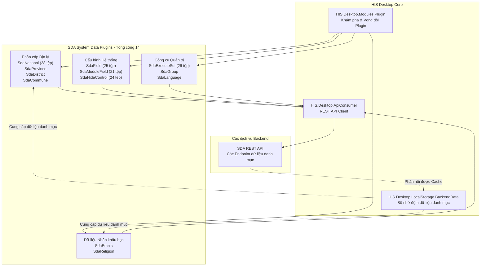
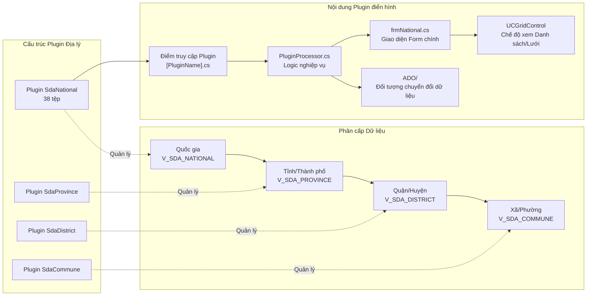
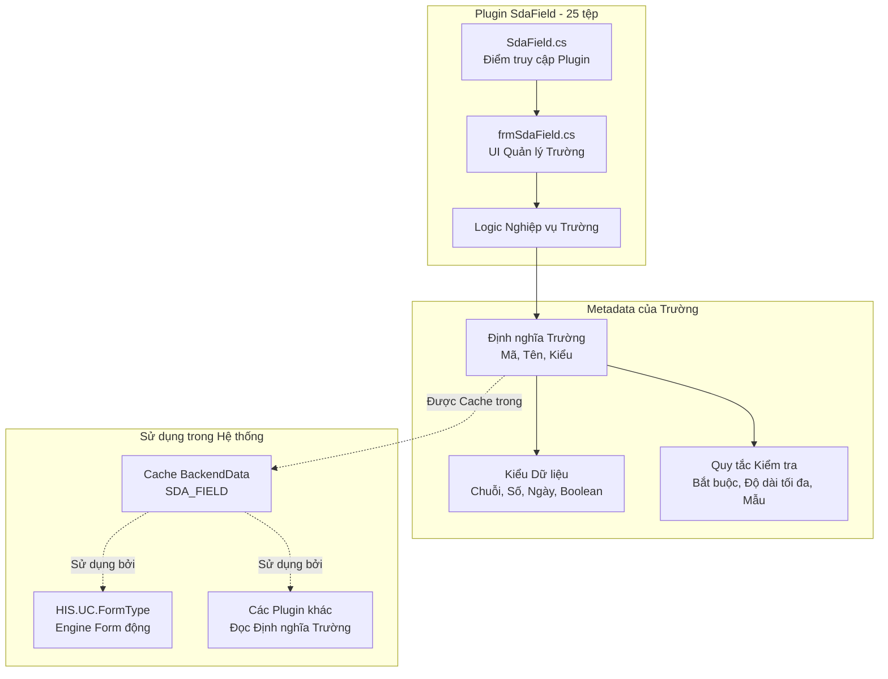
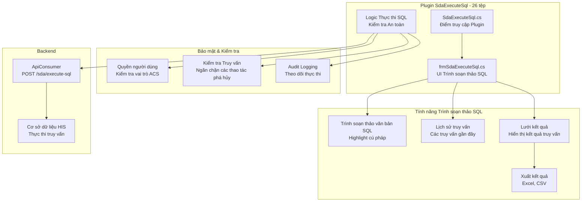
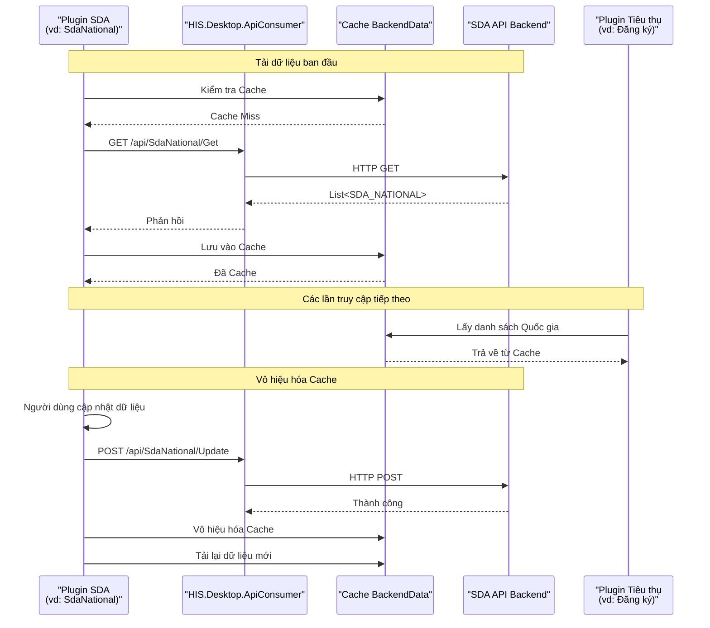
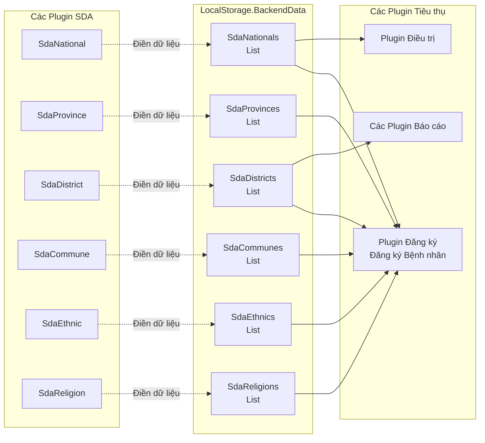

## Mục đích và Phạm vi

Tài liệu này bao gồm các plugin SDA (System Data Administration - Quản trị Dữ liệu Hệ thống) nằm trong [HIS/Plugins/SDA.Desktop.Plugins.*](). 14 plugin này quản lý dữ liệu danh mục cấp hệ thống bao gồm phân cấp địa lý (quốc gia, tỉnh, huyện, xã), dữ liệu nhân khẩu học (dân tộc, tôn giáo), các trường cấu hình hệ thống và các tiện ích quản trị như thực thi SQL và quản lý hiển thị điều khiển UI.

Để biết thông tin về các danh mục plugin khác:
- Các plugin logic nghiệp vụ cốt lõi của bệnh viện, xem [HIS Core Business Plugins](../../02-modules/his-desktop/business-plugins.md)
- Kiểm soát truy cập và quản lý người dùng, xem [ACS Access Control Plugins](../../03-business-domains/administration/access-control.md)
- Bệnh án điện tử, xem [EMR Electronic Medical Record Plugins](../../02-modules/his-desktop/business-plugins.md#emr)
- Hệ thống cấu hình và bộ nhớ đệm, xem [LocalStorage & Configuration](../../02-modules/his-desktop/core.md)

---

## Tổng quan Kiến trúc Plugin SDA

Các plugin SDA tạo thành một phân hệ chuyên biệt trong kiến trúc plugin HIS, tập trung vào việc quản lý dữ liệu tham chiếu và metadata hệ thống mà các plugin khác phụ thuộc vào.



**Sơ đồ: Kiến trúc Hệ thống Plugin SDA**

Nguồn: [[`.devin/wiki.json:8-9`](../../../../.devin/wiki.json#L8-L9)](../../../../.devin/wiki.json#L8-L9), [[`.devin/wiki.json:159-167`](../../../../.devin/wiki.json#L159-L167)](../../../../.devin/wiki.json#L159-L167)

---

## Các Danh mục Plugin và Cấu trúc Tệp

14 plugin SDA được tổ chức thành các danh mục chức năng. Mỗi plugin tuân theo cấu trúc plugin HIS tiêu chuẩn với điểm truy cập (entry point), các thành phần UI và model dữ liệu.

| Tên Plugin | Số tệp | Chức năng Chính | Các tính năng chính |
|------------|-------|------------------|--------------|
| **Phân cấp Địa lý** |
| SdaNational | 38 | Quản lý dữ liệu quốc gia/quốc tịch | Các thao tác CRUD, tìm kiếm, lọc |
| SdaProvince | ~20-25 | Quản lý dữ liệu tỉnh/thành phố | Phân cấp dưới quốc gia |
| SdaDistrict | ~20-25 | Quản lý dữ liệu quận/huyện | Phân cấp dưới tỉnh |
| SdaCommune | ~20-25 | Quản lý dữ liệu xã/phường | Phân cấp dưới huyện |
| **Tham chiếu Nhân khẩu học** |
| SdaEthnic | ~20-25 | Quản lý dữ liệu dân tộc | Mã dân tộc, mô tả |
| SdaReligion | ~20-25 | Quản lý dữ liệu tôn giáo | Mã tôn giáo, mô tả |
| **Cấu hình Hệ thống** |
| SdaField | 25 | Quản lý định nghĩa các trường hệ thống | Metadata của trường, kiểu dữ liệu |
| SdaModuleField | 21 | Quản lý mối quan hệ module-trường | Hiển thị trường theo từng module |
| SdaHideControl | 24 | Kiểm soát hiển thị thành phần UI | Ẩn/hiện các control một cách linh hoạt |
| **Công cụ Quản trị** |
| SdaExecuteSql | 26 | Thực thi các truy vấn SQL tùy chỉnh | Tiện ích thực thi SQL dành cho quản trị viên |
| SdaGroup | ~20-25 | Quản lý các nhóm hệ thống | Định nghĩa nhóm |
| SdaLanguage | ~20-25 | Quản lý ngôn ngữ/bản dịch | Hỗ trợ đa ngôn ngữ |
| **Khác** |
| SdaConfigApp | ~20-25 | Cấu hình ứng dụng | Các thiết lập hệ thống |
| SdaTranslate | ~20-25 | Quản lý dịch thuật | Các key dịch bản văn |

Nguồn: [[`.devin/wiki.json:159-167`](../../../../.devin/wiki.json#L159-L167)](../../../../.devin/wiki.json#L159-L167)

---

## Cấu trúc Plugin Phân cấp Địa lý

Các plugin phân cấp địa lý (Quốc gia, Tỉnh, Huyện, Xã) thực hiện hệ thống phân chia hành chính bốn cấp được sử dụng trong toàn bộ hệ thống y tế của Việt Nam.



**Sơ đồ: Cấu trúc và Phân cấp Plugin Địa lý**

### Plugin SdaNational

Plugin địa lý lớn nhất với 38 tệp, quản lý dữ liệu danh mục quốc gia.

**Các thành phần chính:**
- **Điểm truy cập**: [[`HIS/Plugins/SDA.Desktop.Plugins.SdaNational/SdaNational.cs`](../../../../HIS/Plugins/SDA.Desktop.Plugins.SdaNational/SdaNational.cs)](../../../../HIS/Plugins/SDA.Desktop.Plugins.SdaNational/SdaNational.cs) - Đăng ký plugin
- **Form chính**: [[`HIS/Plugins/SDA.Desktop.Plugins.SdaNational/Run/frmSdaNational.cs`](../../../../HIS/Plugins/SDA.Desktop.Plugins.SdaNational/Run/frmSdaNational.cs)](../../../../HIS/Plugins/SDA.Desktop.Plugins.SdaNational/Run/frmSdaNational.cs) - Lưới dữ liệu quốc gia và các thao tác CRUD
- **Processor**: [[`HIS/Plugins/SDA.Desktop.Plugins.SdaNational/PluginProcessor.cs`](../../../../HIS/Plugins/SDA.Desktop.Plugins.SdaNational/PluginProcessor.cs)](../../../../HIS/Plugins/SDA.Desktop.Plugins.SdaNational/PluginProcessor.cs) - Quản lý vòng đời plugin
- **Model dữ liệu**: [HIS/Plugins/SDA.Desktop.Plugins.SdaNational/ADO/]() - Các đối tượng chuyển đổi dữ liệu cho dữ liệu quốc gia

**Các thao tác phổ biến:**
- Tạo, đọc, cập nhật, xóa (CRUD) các bản ghi quốc gia
- Tìm kiếm và lọc theo mã hoặc tên quốc gia
- Nhập/xuất dữ liệu quốc gia
- Kiểm tra tính duy nhất của mã quốc gia

### Các Plugin Tỉnh, Huyện, Xã

Các plugin này tuân theo các mẫu tương tự nhưng quản lý các cấp bậc phân cấp khác nhau. Mỗi plugin:
- Duy trì mối quan hệ cha-con (Tỉnh → Quốc gia, Huyện → Tỉnh, Xã → Huyện)
- Cung cấp các control dropdown/chọn cho các plugin khác
- Cache dữ liệu trong `HIS.Desktop.LocalStorage.BackendData` để tăng hiệu suất
- Kiểm tra tính toàn vẹn của phân cấp khi thực hiện các thao tác tạo/cập nhật

Nguồn: [HIS/Plugins/SDA.Desktop.Plugins.SdaNational/](), [[`.devin/wiki.json:159-167`](../../../../.devin/wiki.json#L159-L167)](../../../../.devin/wiki.json#L159-L167)

---

## Các Plugin Cấu hình Hệ thống

### Plugin SdaField

Quản lý các định nghĩa trường hệ thống và metadata để tạo form động.



**Sơ đồ: Plugin SdaField và Hệ thống Metadata Trường**

Plugin `SdaField` định nghĩa các trường tùy chỉnh có thể được thêm vào các form hệ thống khác nhau. Các định nghĩa trường này bao gồm:
- Mã trường (mã định danh duy nhất)
- Tên trường (nhãn hiển thị)
- Kiểu dữ liệu (chuỗi, số, ngày, boolean)
- Các ràng buộc kiểm tra dữ liệu
- Các giá trị mặc định

Nguồn: [HIS/Plugins/SDA.Desktop.Plugins.SdaField/](), [[`.devin/wiki.json:164-165`](../../../../.devin/wiki.json#L164-L165)](../../../../.devin/wiki.json#L164-L165)

### Plugin SdaModuleField

Liên kết các trường với các module cụ thể, kiểm soát trường nào xuất hiện trong module nào.

**Các chức năng chính:**
- Định nghĩa hiển thị trường theo từng module
- Ánh xạ các bản ghi `SDA_FIELD` tới các module `HIS.Desktop.Plugins.*`
- Kích hoạt/vô hiệu hóa các trường một cách linh hoạt dựa trên ngữ cảnh module
- Hỗ trợ logic hiển thị trường có điều kiện

**Các điểm tích hợp:**
- Đọc từ `HIS.Desktop.LocalStorage.BackendData` cho các định nghĩa trường được cache
- Được sử dụng bởi logic render form trong [HIS.UC.FormType/]()
- Được các plugin tham vấn trong quá trình khởi tạo form

Nguồn: [HIS/Plugins/SDA.Desktop.Plugins.SdaModuleField/](), [[`.devin/wiki.json:164-165`](../../../../.devin/wiki.json#L164-L165)](../../../../.devin/wiki.json#L164-L165)

### Plugin SdaHideControl

Cung cấp quyền kiểm soát quản trị đối với việc hiển thị các thành phần UI trong toàn bộ ứng dụng.

**Khả năng:**
- Ẩn/hiện các control cụ thể theo ID của control
- Áp dụng các quy tắc hiển thị theo người dùng, vai trò hoặc chi nhánh
- Ghi đè hiển thị control mặc định tại thời điểm thực thi
- Lưu vết (audit trail) các thay đổi về hiển thị control

**Các trường hợp sử dụng:**
- Tùy chỉnh UI cho các khoa phòng bệnh viện khác nhau
- Ẩn các tính năng không được cấp phép hoặc không được cấu hình
- Đơn giản hóa UI cho người dùng cơ bản
- Tuân thủ các yêu cầu của khu vực/vùng miền

Nguồn: [HIS/Plugins/SDA.Desktop.Plugins.SdaHideControl/](), [[`.devin/wiki.json:164-165`](../../../../.devin/wiki.json#L164-L165)](../../../../.devin/wiki.json#L164-L165)

---

## Công cụ Quản trị: Plugin SdaExecuteSql

Plugin `SdaExecuteSql` (26 tệp) cung cấp một giao diện quản trị mạnh mẽ để thực thi các truy vấn SQL tùy chỉnh đối với cơ sở dữ liệu backend.



**Các cân nhắc về Bảo mật:**
- Yêu cầu quyền ACS nâng cao (thường chỉ dành cho quản trị viên)
- Kiểm tra các truy vấn để ngăn chặn `DROP`, `TRUNCATE`, `DELETE` mà không có mệnh đề `WHERE`
- Ghi nhật ký tất cả các lần thực thi với người dùng, dấu thời gian và nội dung truy vấn
- Có chế độ chỉ đọc (read-only) cho các truy vấn không phá hủy dữ liệu

**Các mục đích Quản trị phổ biến:**
- Các script di chuyển dữ liệu
- Sửa lỗi dữ liệu khẩn cấp
- Các truy vấn báo cáo tùy chỉnh
- Các tác vụ bảo trì cơ sở dữ liệu
- Kiểm tra và gỡ lỗi các vấn đề về dữ liệu

Nguồn: [HIS/Plugins/SDA.Desktop.Plugins.SdaExecuteSql/](), [[`.devin/wiki.json:164-165`](../../../../.devin/wiki.json#L164-L165)](../../../../.devin/wiki.json#L164-L165)

---

## Dòng dữ liệu: Tải và Caching Dữ liệu danh mục

Các plugin SDA thực hiện chiến lược bộ nhớ đệm (caching) mạnh mẽ cho dữ liệu danh mục để cải thiện hiệu suất ứng dụng.



**Sơ đồ: Dòng tải và Caching dữ liệu danh mục SDA**

**Quản lý Cache:**
- Dữ liệu danh mục được cache trong lần truy cập đầu tiên tại `HIS.Desktop.LocalStorage.BackendData`
- Cache bị vô hiệu hóa khi thực hiện các thao tác CRUD
- Tự động làm mới cache khi khởi động ứng dụng
- Có thể làm mới thủ công thông qua UI

**Tác động đến Hiệu suất:**
- Giảm các lệnh gọi API cho dữ liệu tham chiếu được truy cập thường xuyên
- Dữ liệu địa lý (quốc gia, tỉnh, huyện, xã) được sử dụng trong hầu hết các lượt đăng ký bệnh nhân
- Dữ liệu nhân khẩu học (dân tộc, tôn giáo) được sử dụng trong thông tin nhân khẩu học của bệnh nhân
- Định nghĩa các trường được sử dụng trong việc render form động

Nguồn: [HIS/HIS.Desktop/LocalStorage/HIS.Desktop.LocalStorage.BackendData/](), [[`.devin/wiki.json:46-51`](../../../../.devin/wiki.json#L46-L51)](../../../../.devin/wiki.json#L46-L51)

---

## Mẫu Plugin chung: Các thao tác CRUD

Tất cả các plugin SDA đều tuân theo một mẫu nhất quán cho các thao tác Tạo, Đọc, Cập nhật, Xóa (CRUD).

### Cấu trúc Tệp Plugin điển hình

```
SDA.Desktop.Plugins.[PluginName]/
├── [PluginName].cs                    # Điểm truy cập plugin, đăng ký module
├── PluginProcessor.cs                 # Quản lý vòng đời plugin
├── Run/
│   ├── frm[PluginName].cs            # UI form chính
│   ├── frm[PluginName].Designer.cs   # Mã designer của form
│   └── UCGrid[PluginName].cs         # Thành phần lưới điều khiển
├── ADO/
│   ├── [Entity]ADO.cs                # Đối tượng chuyển đổi dữ liệu
│   └── [Entity]ImportADO.cs          # Đối tượng nhập dữ liệu
├── Base/
│   └── RequestUri__.cs               # Các hằng số endpoint API
├── Validtion/
│   └── Validation[Action].cs         # Các quy tắc kiểm tra dữ liệu
├── Resources/
│   ├── Lang/
│   │   └── [PluginName]__*.resx     # Các tài nguyên bản dịch
│   └── Image/                        # Các icon/hình ảnh plugin
└── Properties/
    └── AssemblyInfo.cs               # Metadata của assembly
```

### Mẫu Tiêu thụ API Chuẩn

Mỗi plugin SDA sử dụng `HIS.Desktop.ApiConsumer` để giao tiếp với backend:

**Các thao tác GET:**
- Mẫu endpoint: `/api/Sda[Entity]/Get` - Lấy tất cả các bản ghi
- Mẫu endpoint: `/api/Sda[Entity]/GetView` - Lấy dữ liệu với các phép join/view
- Được cache trong `BackendData` để truy cập lặp lại

**Các thao tác CREATE:**
- Mẫu endpoint: `/api/Sda[Entity]/Create` - Tạo bản ghi mới
- Việc kiểm tra dữ liệu được thực hiện ở phía client trước khi gọi API
- Cache bị vô hiệu hóa khi thành công

**Các thao tác UPDATE:**
- Mẫu endpoint: `/api/Sda[Entity]/Update` - Cập nhật bản ghi hiện có
- Kiểm tra phiên bản (version checking) để xử lý các sửa đổi đồng thời
- Làm mới cache sau khi cập nhật

**Các thao tác DELETE:**
- Mẫu endpoint: `/api/Sda[Entity]/Delete` - Xóa bản ghi
- Kiểm tra xóa theo tầng (cascading delete) để đảm bảo tính toàn vẹn tham chiếu
- Vô hiệu hóa cache

Nguồn: [HIS/HIS.Desktop/ApiConsumer/HIS.Desktop.ApiConsumer/]()

---

## Tích hợp với các Thành phần khác trong Hệ thống

### Tích hợp với ACS (Hệ thống Kiểm soát Truy cập)

Các plugin SDA tuân thủ các quyền ACS được định nghĩa trong [ACS Access Control Plugins](../../03-business-domains/administration/access-control.md):

- `SdaExecuteSql` yêu cầu quyền `ACS_MODULE.EXECUTE_SQL`
- Các plugin quản trị yêu cầu vai trò `ACS_ROLE.ADMIN` hoặc quyền truy cập module cụ thể
- Các thao tác CRUD kiểm tra quyền `ACS_CONTROL` (Tạo, Cập nhật, Xóa)
- Các control UI được vô hiệu hóa dựa trên `SdaHideControl` và các quy tắc ACS

### Tích hợp với LocalStorage

Dữ liệu danh mục từ các plugin SDA đổ vào `HIS.Desktop.LocalStorage.BackendData`:



**Sơ đồ: Tích hợp dữ liệu danh mục SDA với LocalStorage và các Plugin tiêu thụ**

Nguồn: [HIS/HIS.Desktop/LocalStorage/HIS.Desktop.LocalStorage.BackendData/](), [[`.devin/wiki.json:46-51`](../../../../.devin/wiki.json#L46-L51)](../../../../.devin/wiki.json#L46-L51)

### Tích hợp với các Thành phần UC

Dữ liệu SDA được sử dụng trong các User Control có thể tái sử dụng:

- `HIS.UC.PatientSelect` sử dụng phân cấp địa lý để chọn địa chỉ
- `HIS.UC.FormType` sử dụng các định nghĩa `SdaField` để render form động
- Các control Dropdown trong toàn bộ ứng dụng được lấy dữ liệu từ danh mục SDA
- `HIS.UC.National` được thiết kế riêng cho việc chọn quốc gia

Nguồn: [UC/HIS.UC.PatientSelect/](), [UC/HIS.UC.FormType/](), [UC/HIS.UC.National/]()

---

## Cấu hình và Tùy chỉnh

### Tích hợp SdaConfigKey

Các plugin SDA sử dụng các key cấu hình được định nghĩa trong `HIS.Desktop.LocalStorage.SdaConfigKey` (30 tệp):

- `SDA__SHOW_NATIONAL_CODE` - Hiển thị mã quốc gia trong các dropdown
- `SDA__PROVINCE_IS_REQUIRED` - Bắt buộc nhập tỉnh/thành phố trong các trường địa chỉ
- `SDA__ENABLE_COMMUNE_SEARCH` - Kích hoạt tính năng tìm kiếm xã/phường
- `SDA__DEFAULT_NATIONAL_CODE` - Quốc tịch mặc định (vd: "VN")

Các giá trị cấu hình được lưu trữ trong cơ sở dữ liệu và được cache cục bộ để tăng hiệu suất.

Nguồn: [HIS/HIS.Desktop/LocalStorage/HIS.Desktop.LocalStorage.SdaConfigKey/](), [[`.devin/wiki.json:46-51`](../../../../.devin/wiki.json#L46-L51)](../../../../.devin/wiki.json#L46-L51)

### Hỗ trợ Bản dịch

Các plugin SDA hỗ trợ tiếng Việt và tiếng Anh thông qua các tệp resource:
- Mẫu tệp resource: `[PluginName]__Vi.resx`, `[PluginName]__En.resx`
- Plugin `SdaLanguage` quản lý các tùy chọn ngôn ngữ
- Plugin `SdaTranslate` quản lý các key và giá trị dịch
- Văn bản UI được tải dựa trên tùy chọn ngôn ngữ của người dùng

---

## Tóm tắt: Trách nhiệm của Plugin SDA

14 plugin SDA đóng vai trò là **xương sống quản lý dữ liệu danh mục** của hệ thống HIS:

| Trách nhiệm | Các Plugin | Mục đích |
|----------------|---------|---------|
| **Tham chiếu Địa lý** | SdaNational, SdaProvince, SdaDistrict, SdaCommune | Phân cấp hành chính bốn cấp cho địa chỉ |
| **Tham chiếu Nhân khẩu học** | SdaEthnic, SdaReligion | Các phân loại nhân khẩu học của bệnh nhân |
| **Cấu hình Động** | SdaField, SdaModuleField, SdaHideControl | Tùy chỉnh form và UI tại thời điểm thực thi |
| **Công cụ Quản trị** | SdaExecuteSql, SdaGroup, SdaLanguage | Các tiện ích bảo trì và tùy chỉnh hệ thống |
| **Thiết lập Ứng dụng** | SdaConfigApp, SdaTranslate | Cấu hình ứng dụng và địa phương hóa (bản dịch) |

**Các nguyên tắc thiết kế chính:**
1. **Caching mạnh mẽ**: Dữ liệu danh mục được cache trong `BackendData` để tăng hiệu suất
2. **Tính toàn vẹn Phân cấp**: Các mối quan hệ cha-con được thực thi trong dữ liệu địa lý
3. **Truy cập dựa trên Quyền**: Các chức năng quản trị được bảo vệ bởi ACS
4. **Các mẫu Standardized**: Tất cả các plugin đều tuân theo các mẫu CRUD nhất quán
5. **Sẵn sàng cho Bản dịch**: Hỗ trợ đa ngôn ngữ trong toàn bộ hệ thống

Các plugin SDA thường được các quản trị viên truy cập trong quá trình thiết lập và cấu hình hệ thống, nhưng dữ liệu mà chúng quản lý được tiêu thụ bởi hầu hết mọi plugin khác trong hệ thống để thực hiện các thao tác đăng ký bệnh nhân, điều trị, báo cáo và quản trị.

Nguồn: [HIS/Plugins/SDA.Desktop.Plugins.*/](), [[`.devin/wiki.json:159-167`](../../../../.devin/wiki.json#L159-L167)](../../../../.devin/wiki.json#L159-L167), [[`.devin/wiki.json:8-9`](../../../../.devin/wiki.json#L8-L9)](../../../../.devin/wiki.json#L8-L9)