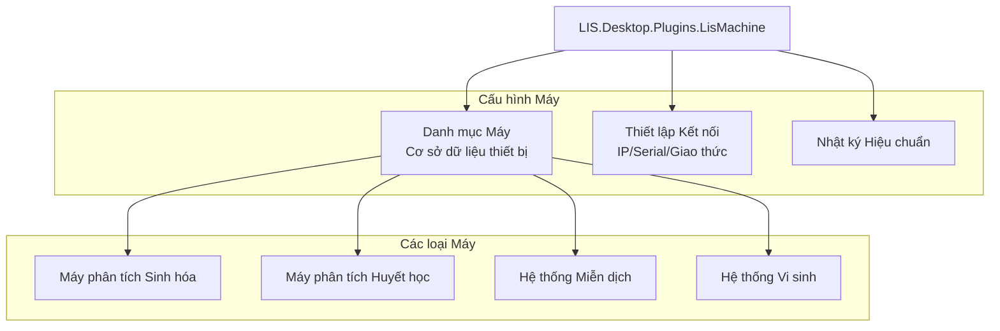
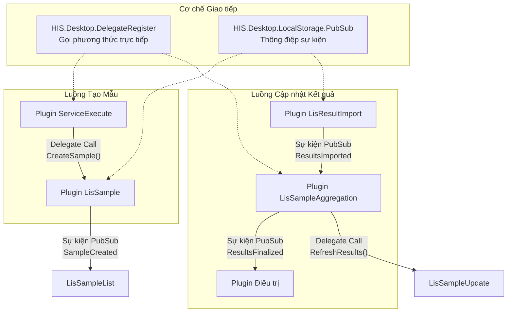
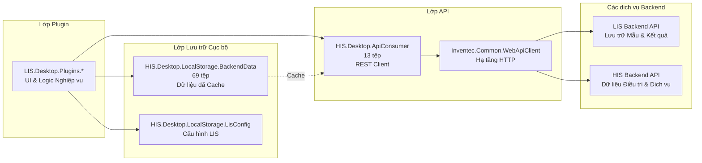
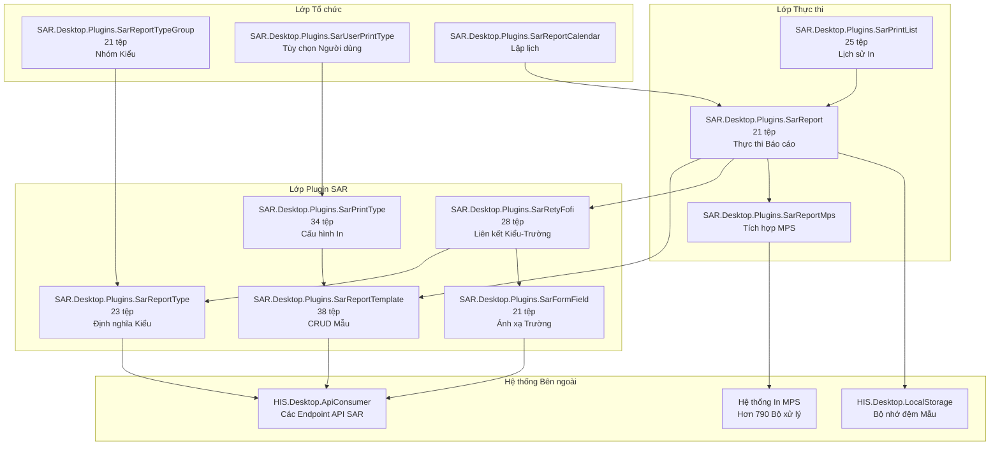
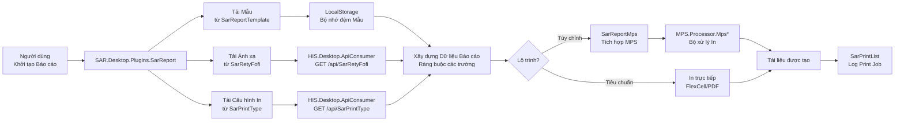
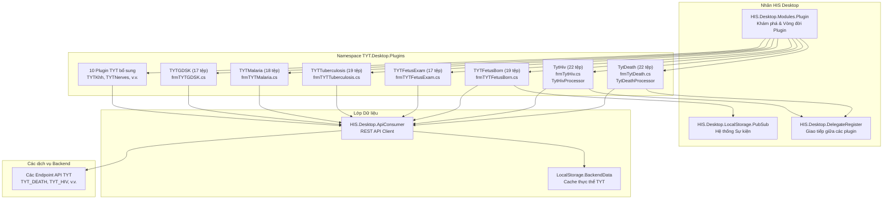
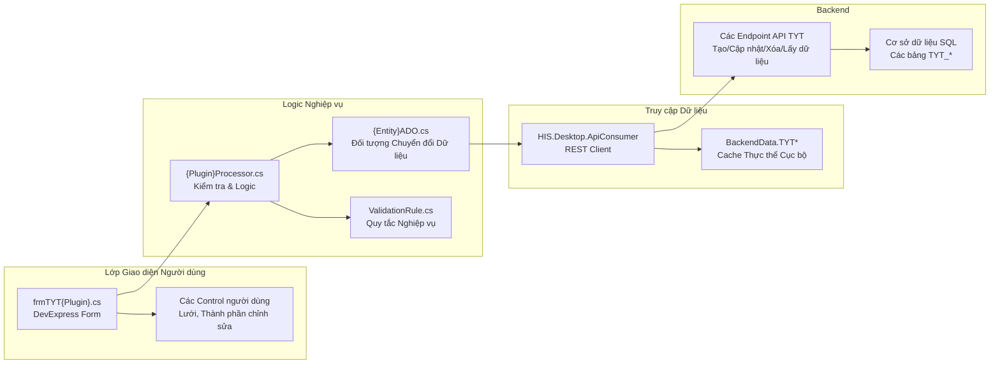
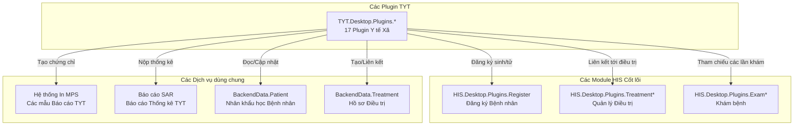

## Mục đích và Phạm vi

Tài liệu này bao gồm phân hệ plugin LIS (Laboratory Information System - Hệ thống thông tin Phòng xét nghiệm) trong ứng dụng HIS. Các plugin LIS quản lý quy trình xét nghiệm bao gồm thu thập mẫu, thực hiện xét nghiệm, tích hợp máy xét nghiệm, báo cáo kết quả và kiểm soát chất lượng. Có 12 plugin chuyên dụng nằm trong `HIS/Plugins/LIS.Desktop.Plugins.*` xử lý các khía cạnh khác nhau của hoạt động phòng xét nghiệm.

Để biết các khái niệm kiến trúc plugin chung, hãy xem [Kiến trúc Hệ thống Plugin](../../01-architecture/plugin-system/01-overview.md). Đối với các plugin lâm sàng liên quan đến chỉ định xét nghiệm và thực hiện dịch vụ, hãy xem [Các Plugin Nghiệp vụ Cốt lõi của HIS](../../02-modules/his-desktop/business-plugins.md). Đối với các mẫu in được sử dụng để tạo báo cáo xét nghiệm, hãy xem [Hệ thống in MPS](../../02-modules/his-desktop/business-plugins.md#mps-print).

---

## Tổng quan về Plugin LIS

Phân hệ LIS bao gồm 12 plugin chuyên dụng cùng nhau quản lý quy trình làm việc của phòng xét nghiệm từ thu thập mẫu đến báo cáo kết quả. Các plugin này tích hợp với cả hệ thống HIS nội bộ (điều trị, thực hiện dịch vụ) và các thiết bị xét nghiệm bên ngoài.

### Danh sách Plugin Đầy đủ

| Tên Plugin | Số lượng tệp | Trách nhiệm Chính |
|------------|-----------|------------------------|
| `LisSampleUpdate` | 36 tệp | Cập nhật và chỉnh sửa thông tin mẫu xét nghiệm |
| `LisSampleAggregation` | 27 tệp | Tổng hợp và hợp nhất kết quả mẫu |
| `LisWellPlate` | 26 tệp | Quản lý sơ đồ đĩa giếng (well plate) cho xét nghiệm hàng loạt |
| `LisSampleCondition` | 24 tệp | Cấu hình các điều kiện lấy mẫu và bảo quản |
| `LisMachine` | 24 tệp | Quản lý thiết bị phòng xét nghiệm và máy phân tích |
| `LisMachineIndex` | 22 tệp | Cấu hình các chỉ số và tham số xét nghiệm của máy |
| `LisSampleList` | 21 tệp | Xem và tìm kiếm các mẫu xét nghiệm |
| `LisSample` | ~20 tệp | Tạo và đăng ký mới các mẫu xét nghiệm |
| `LisAntibiotic` | ~20 tệp | Quản lý xét nghiệm kháng sinh đồ |
| `LisBacterium` | ~20 tệp | Quản lý kết quả xét nghiệm vi khuẩn |
| `LisDelivery` | ~18 tệp | Xử lý việc bàn giao và vận chuyển mẫu |
| `LisResultImport` | ~18 tệp | Nhập kết quả từ máy xét nghiệm |

**Nguồn:** [`.devin/wiki.json:130-137`](../../../../.devin/wiki.json#L130-L137)

---

## Kiến trúc Hệ thống

### Tích hợp Plugin LIS


**Nguồn:** [`.devin/wiki.json:8-9`](../../../../.devin/wiki.json#L8-L9), [`.devin/wiki.json:62-67`](../../../../.devin/wiki.json#L62-L67), [`.devin/wiki.json:130-137`](../../../../.devin/wiki.json#L130-L137)

---

## Quy trình Phòng xét nghiệm

### Quy trình Xử lý Mẫu

```mermaid
graph LR
    subgraph "Giai đoạn Thu thập Mẫu"
        TestOrder["Chỉ định Xét nghiệm<br/>ServiceExecute"]
        CreateSample["Đăng ký Mẫu<br/>LisSample"]
        SetCondition["Xác định Điều kiện<br/>LisSampleCondition"]
    end
    
    subgraph "Giai đoạn Xử lý Mẫu"
        ViewSamples["Tìm kiếm Mẫu<br/>LisSampleList"]
        UpdateSample["Cập nhật Thông tin<br/>LisSampleUpdate"]
        SetupPlate["Cấu hình Đĩa giếng<br/>LisWellPlate"]
    end
    
    subgraph "Giai đoạn Xét nghiệm"
        ConfigMachine["Thiết lập Thiết bị<br/>LisMachine"]
        ConfigIndex["Tham số Xét nghiệm<br/>LisMachineIndex"]
        RunTest["Thực hiện Xét nghiệm<br/>Máy phân tích xét nghiệm"]
        ImportResult["Nhập Kết quả<br/>LisResultImport"]
    end
    
    subgraph "Giai đoạn Xử lý Kết quả"
        Aggregate["Hợp nhất Kết quả<br/>LisSampleAggregation"]
        BactTest["Vi khuẩn học<br/>LisBacterium"]
        AntiTest["Thử nghiệm nhạy cảm<br/>LisAntibiotic"]
        FinalResult["Báo cáo Cuối cùng<br/>Plugin Điều trị"]
    end
    
    TestOrder --> CreateSample
    CreateSample --> SetCondition
    CreateSample --> ViewSamples
    ViewSamples --> UpdateSample
    UpdateSample --> SetupPlate
    
    ConfigMachine --> ConfigIndex
    UpdateSample --> RunTest
    SetupPlate --> RunTest
    ConfigIndex --> RunTest
    RunTest --> ImportResult
    
    ImportResult --> Aggregate
    Aggregate --> BactTest
    Aggregate --> AntiTest
    BactTest --> FinalResult
    AntiTest --> FinalResult
    Aggregate --> FinalResult
```



**Nguồn:** [`.devin/wiki.json:130-137`](../../../../.devin/wiki.json#L130-L137)

---

## Các Plugin LIS Cốt lõi

### Các Plugin Quản lý Mẫu

#### LisSample - Đăng ký Mẫu
Plugin chính để tạo và đăng ký các mẫu xét nghiệm từ chỉ định xét nghiệm. Plugin này liên kết các yêu cầu dịch vụ từ `HIS.Desktop.Plugins.ServiceExecute` với các mẫu xét nghiệm vật lý.

**Trách nhiệm chính:**
- Tạo bản ghi mẫu từ chỉ định xét nghiệm
- Gán mã định danh mẫu (mã vạch/mã số mẫu)
- Liên kết mẫu với quá trình điều trị của bệnh nhân
- Thiết lập trạng thái ban đầu của mẫu

**Vị trí điển hình:** `HIS/Plugins/LIS.Desktop.Plugins.LisSample/`

---

#### LisSampleList - Tìm kiếm và Hiển thị Mẫu
Cung cấp khả năng tìm kiếm, lọc và xem danh sách các mẫu xét nghiệm. Người dùng có thể truy vấn mẫu theo bệnh nhân, khoảng ngày, loại xét nghiệm, trạng thái hoặc ID mẫu.

**Trách nhiệm chính:**
- Hiển thị danh sách mẫu với các tùy chọn lọc
- Tìm kiếm theo nhiều tiêu chí
- Hiển thị trạng thái và tiến độ của mẫu
- Điều hướng đến màn hình chi tiết hoặc cập nhật mẫu

**Vị trí điển hình:** `HIS/Plugins/LIS.Desktop.Plugins.LisSampleList/`
**Số lượng tệp:** 21 tệp

**Nguồn:** [`.devin/wiki.json:134-136`](../../../../.devin/wiki.json#L134-L136)

---

#### LisSampleUpdate - Chỉnh sửa Mẫu
Plugin LIS lớn nhất với 36 tệp, cung cấp khả năng chỉnh sửa mẫu toàn diện bao gồm cập nhật trạng thái, nhập kết quả và ghi chú kiểm soát chất lượng.

**Trách nhiệm chính:**
- Chỉnh sửa metadata và thuộc tính mẫu
- Cập nhật trạng thái mẫu qua các giai đoạn quy trình
- Nhập kết quả xét nghiệm thủ công
- Thêm nhận xét và ghi chú kiểm soát chất lượng
- Liên kết đến các quy trình xét nghiệm chuyên biệt

**Vị trí điển hình:** `HIS/Plugins/LIS.Desktop.Plugins.LisSampleUpdate/`
**Số lượng tệp:** 36 tệp

**Nguồn:** [`.devin/wiki.json:134-136`](../../../../.devin/wiki.json#L134-L136)

---

#### LisSampleCondition - Điều kiện Lấy mẫu
Quản lý việc cấu hình các yêu cầu lấy mẫu bao gồm tình trạng nhịn ăn, yêu cầu về thời điểm và các hướng dẫn xử lý đặc biệt.

**Trách nhiệm chính:**
- Xác định điều kiện lấy mẫu cho các loại xét nghiệm
- Cấu hình yêu cầu nhịn ăn
- Thiết lập các ràng buộc về thời gian (lấy mẫu buổi sáng, lấy mẫu 24 giờ)
- Chỉ định các điều kiện bảo quản và vận chuyển
- Liên kết các điều kiện với định nghĩa xét nghiệm

**Vị trí điển hình:** `HIS/Plugins/LIS.Desktop.Plugins.LisSampleCondition/`
**Số lượng tệp:** 24 tệp

**Nguồn:** [`.devin/wiki.json:134-136`](../../../../.devin/wiki.json#L134-L136)

---

### Các Plugin Tích hợp Máy xét nghiệm

#### LisMachine - Quản lý Thiết bị Phòng xét nghiệm
Quản lý việc cấu hình và kết nối của các máy phân tích và thiết bị xét nghiệm. Duy trì danh mục thiết bị, các tham số kết nối và trạng thái hoạt động.

**Trách nhiệm chính:**
- Đăng ký và cấu hình các máy phân tích xét nghiệm
- Xác định các thiết lập kết nối máy (IP, cổng nối tiếp, giao thức)
- Theo dõi việc bảo trì và hiệu chuẩn thiết bị
- Giám sát trạng thái và tính sẵn sàng của máy
- Ánh xạ máy với các loại xét nghiệm

**Vị trí điển hình:** `HIS/Plugins/LIS.Desktop.Plugins.LisMachine/`
**Số lượng tệp:** 24 tệp



**Nguồn:** [`.devin/wiki.json:134-136`](../../../../.devin/wiki.json#L134-L136)

---

#### LisMachineIndex - Cấu hình Tham số Xét nghiệm
Cấu hình việc ánh xạ giữa mã xét nghiệm của máy và định nghĩa xét nghiệm của HIS. Mỗi máy phân tích xét nghiệm sử dụng các mã xét nghiệm nội bộ phải được ánh xạ tới các mã dịch vụ chuẩn của HIS.

**Trách nhiệm chính:**
- Ánh xạ mã xét nghiệm của máy tới mã dịch vụ HIS
- Cấu hình ánh xạ giá trị kết quả và đơn vị
- Xác định khoảng bình thường theo từng máy và xét nghiệm
- Thiết lập các tham số kiểm soát chất lượng
- Cấu hình định dạng truyền kết quả

**Vị trí điển hình:** `HIS/Plugins/LIS.Desktop.Plugins.LisMachineIndex/`
**Số lượng tệp:** 22 tệp

**Nguồn:** [`.devin/wiki.json:134-136`](../../../../.devin/wiki.json#L134-L136)

---

#### LisResultImport - Nhập Kết quả từ Máy
Xử lý việc nhập kết quả xét nghiệm từ các máy phân tích vào hệ thống HIS. Hỗ trợ các giao thức truyền thông và định dạng kết quả khác nhau.

**Trách nhiệm chính:**
- Kết nối tới các máy phân tích xét nghiệm
- Phân tích các định dạng kết quả của máy (HL7, ASTM, độc quyền)
- Khớp kết quả với các mẫu đang chờ
- Kiểm tra tính hợp lệ của kết quả đã nhập
- Xử lý lỗi và xung đột khi nhập dữ liệu
- Kích hoạt quy trình hợp nhất kết quả

**Vị trí điển hình:** `HIS/Plugins/LIS.Desktop.Plugins.LisResultImport/`

**Nguồn:** [`.devin/wiki.json:134-136`](../../../../.devin/wiki.json#L134-L136)

---

### Các Plugin Xử lý và Phân tích

#### LisSampleAggregation - Hợp nhất Kết quả
Tổng hợp và hợp nhất các kết quả xét nghiệm từ nhiều nguồn (nhập thủ công, nhập từ máy, các giá trị tính toán) thành kết quả báo cáo cuối cùng.

**Trách nhiệm chính:**
- Kết hợp kết quả từ nhiều lượt chạy xét nghiệm
- Tính toán các giá trị phái sinh và các bộ xét nghiệm (panels)
- Áp dụng các quy tắc kiểm soát chất lượng
- Đánh dấu các kết quả bất thường
- Chuẩn bị kết quả để báo cáo
- Kích hoạt thông báo cho các giá trị cảnh báo (critical values)

**Vị trí điển hình:** `HIS/Plugins/LIS.Desktop.Plugins.LisSampleAggregation/`
**Số lượng tệp:** 27 tệp

**Nguồn:** [`.devin/wiki.json:134-136`](../../../../.devin/wiki.json#L134-L136)

---

#### LisWellPlate - Quản lý Sơ đồ Đĩa giếng
Quản lý các cấu hình đĩa giếng cho các quy trình xét nghiệm hàng loạt, thường được sử dụng trong xét nghiệm miễn dịch và xét nghiệm phân tử.

**Trách nhiệm chính:**
- Xác định sơ đồ đĩa (96 giếng, 384 giếng)
- Gán mẫu vào các vị trí giếng
- Cấu hình vị trí cho mẫu chứng (control) và mẫu chuẩn (calibrator)
- Theo dõi trạng thái xử lý đĩa
- Xuất sơ đồ đĩa sang máy phân tích
- Nhập kết quả theo đĩa

**Vị trí điển hình:** `HIS/Plugins/LIS.Desktop.Plugins.LisWellPlate/`
**Số lượng tệp:** 26 tệp

**Nguồn:** [`.devin/wiki.json:134-136`](../../../../.devin/wiki.json#L134-L136)

---

### Các Plugin Vi sinh học

#### LisBacterium - Quản lý Vi khuẩn học
Quản lý kết quả xét nghiệm vi khuẩn học bao gồm định danh vi sinh vật, đếm số lượng khuẩn lạc và các phát hiện nuôi cấy.

**Trách nhiệm chính:**
- Ghi lại các vi sinh vật được phân lập
- Tài liệu hóa các đặc điểm khuẩn lạc
- Theo dõi sự phát triển của nuôi cấy
- Liên kết với xét nghiệm kháng sinh đồ
- Lưu trữ dữ liệu về phân loại vi sinh vật

**Vị trí điển hình:** `HIS/Plugins/LIS.Desktop.Plugins.LisBacterium/`

---

#### LisAntibiotic - Xét nghiệm Kháng sinh đồ
Quản lý kết quả xét nghiệm mức độ nhạy cảm với kháng sinh bao gồm các giá trị MIC (Minimum Inhibitory Concentration - Nồng độ ức chế tối thiểu) và phiên giải.

**Trách nhiệm chính:**
- Ghi lại kết quả xét nghiệm kháng sinh
- Lưu trữ các giá trị MIC/đường kính vòng vô khuẩn
- Áp dụng các quy tắc phiên giải (S/I/R)
- Theo dõi các bộ cấu hình kháng sinh (antibiotic panels)
- Tạo báo cáo kháng sinh đồ (antibiogram)

**Vị trí điển hình:** `HIS/Plugins/LIS.Desktop.Plugins.LisAntibiotic/`

**Nguồn:** [`.devin/wiki.json:134-136`](../../../../.devin/wiki.json#L134-L136)

---

## Các Mẫu Giao tiếp Plugin

### Giao tiếp giữa các Plugin

Các plugin LIS giao tiếp với nhau và với các plugin cốt lõi của HIS thông qua hai cơ chế chính:



**Các mẫu giao tiếp:**

1. **Mẫu Delegate** - Được sử dụng cho các thao tác đồng bộ yêu cầu phản hồi ngay lập tức
   - Tạo mẫu từ chỉ định xét nghiệm
   - Làm mới dữ liệu sau khi cập nhật
   - Kiểm tra dữ liệu đầu vào trước khi lưu

2. **Mẫu PubSub** - Được sử dụng cho các thông báo không đồng bộ
   - Thay đổi trạng thái mẫu
   - Thông báo có kết quả xét nghiệm
   - Cập nhật trạng thái kết nối máy

**Nguồn:** [`.devin/wiki.json:62-67`](../../../../.devin/wiki.json#L62-L67)

---

## Các Mô hình Dữ liệu và Tích hợp API

### Kiến trúc Luồng Dữ liệu LIS



**Các thành phần Mô hình Dữ liệu:**

- **Mô hình Mẫu LIS** - Được lưu trữ trong các thư mục ADO của plugin, đại diện cho các thực thể mẫu
- **Cấu hình Máy** - Được cache trong `BackendData` để truy cập khi ngoại tuyến
- **Tham số Xét nghiệm** - Được lấy từ `LisConfig` và API backend
- **Kết quả** - Được đồng bộ hóa thông qua `ApiConsumer` với sự kiểm tra từ máy chủ

**Nguồn:** [`.devin/wiki.json:46-52`](../../../../.devin/wiki.json#L46-L52), [`.devin/wiki.json:56-57`](../../../../.devin/wiki.json#L56-L57)

---

## Tích hợp với các Phân hệ khác

### Kết nối với Quy trình Cốt lõi của HIS

| Điểm Tích hợp | Plugin Nguồn | Plugin Đích | Mục đích |
|------------------|---------------|------------------|---------|
| Chỉ định Xét nghiệm | `ServiceExecute` | `LisSample` | Tạo mẫu từ các chỉ định dịch vụ |
| Ngữ cảnh Bệnh nhân | `Treatment`, `Exam` | Tất cả các plugin LIS | Liên kết mẫu với các đợt điều trị của bệnh nhân |
| Báo cáo Kết quả | `LisSampleAggregation` | `Treatment`, `ExamService` | Cung cấp kết quả xét nghiệm đã hoàn tất |
| In ấn | Tất cả các plugin LIS | `MPS.Processor.Mps*` | Tạo các báo cáo xét nghiệm |
| Thanh toán | `LisSample` | `Transaction*` | Liên kết xét nghiệm với các giao dịch thanh toán |

**Nguồn:** [`.devin/wiki.json:70-77`](../../../../.devin/wiki.json#L70-L77), [`.devin/wiki.json:181-187`](../../../../.devin/wiki.json#L181-L187)

---

## Cấu hình và LocalStorage

### Cấu hình Đặc thù của LIS

Phân hệ LIS sử dụng bộ lưu trữ cấu hình chuyên dụng:

**Các lớp Cấu hình:**
- `HIS.Desktop.LocalStorage.LisConfig` - Các thiết lập đặc thù của LIS
- `HIS.Desktop.LocalStorage.HisConfig` - Cấu hình HIS chung bao gồm các tham số phòng xét nghiệm

**Các mục Cấu hình Phổ biến:**
- Điều kiện lấy mẫu mặc định
- Lập lịch nhập kết quả tự động
- Thời gian chờ kết nối máy (timeout)
- Ngưỡng kiểm soát chất lượng
- Quy tắc cảnh báo giá trị cảnh báo (critical value)
- Quy trình phê duyệt kết quả

**Mẫu Lưu trữ:**
Cấu hình được cache cục bộ trong `BackendData` và đồng bộ hóa với backend thông qua `ApiConsumer`. Các thay đổi được công bố qua `PubSub` để thông báo cho các plugin đang hoạt động.

**Nguồn:** [`.devin/wiki.json:46-52`](../../../../.devin/wiki.json#L46-L52)

---

## Hướng dẫn Phát triển Plugin

### Tạo một Plugin LIS mới

Để thêm một plugin LIS mới vào hệ thống:

1. **Cấu trúc Plugin** - Tuân theo kiến trúc plugin tiêu chuẩn:
   - Lớp plugin chính thực hiện interface `IModule`
   - Thư mục Run chứa các triển khai form
   - Thư mục ADO cho các đối tượng chuyển đổi dữ liệu
   - Thư mục Base cho các tiện ích chung
   - Thư mục Properties cho metadata của plugin

2. **Quy ước Namespace** - Sử dụng mẫu `LIS.Desktop.Plugins.[PluginName]`

3. **Đăng ký** - Đăng ký với hệ thống khám phá plugin trong `Inventec.Desktop.Core`

4. **Giao tiếp** - Triển khai cả hai:
   - Các trình xử lý Delegate cho các thao tác đồng bộ
   - Đăng ký PubSub cho các thông báo không đồng bộ

5. **Tích hợp API** - Sử dụng `HIS.Desktop.ApiConsumer` để giao tiếp với backend

6. **Caching** - Tận dụng `BackendData` để tối ưu hóa hiệu suất

**Tham chiếu Kích thước Plugin:**
- Plugin nhỏ: ~18-21 tệp (các thao tác CRUD cơ bản)
- Plugin trung bình: ~24-27 tệp (UI phức tạp với logic nghiệp vụ)
- Plugin lớn: ~36 tệp (quy trình làm việc toàn diện với các tích hợp)

**Nguồn:** [`.devin/wiki.json:62-67`](../../../../.devin/wiki.json#L62-L67), [`.devin/wiki.json:130-137`](../../../../.devin/wiki.json#L130-L137)

---

## Tích hợp In ấn

Các plugin LIS tích hợp với MPS (Medical Print System) để tạo các báo cáo xét nghiệm, phiếu kết quả và nhãn mẫu.

### Các bộ xử lý in cho tài liệu phòng xét nghiệm

Các bộ xử lý MPS phổ biến được sử dụng bởi các plugin LIS:

- Dòng `Mps0001*` - Báo cáo kết quả xét nghiệm
- Dòng `Mps0002*` - Nhãn thu thập mẫu
- Dòng `Mps0003*` - Tổng hợp kết quả hàng loạt
- Dòng `Mps0004*` - Báo cáo kiểm soát chất lượng
- Dòng `Mps0005*` - Báo cáo nuôi cấy vi sinh

Mỗi bộ xử lý được gọi thông qua API MPS với một Đối tượng Dữ liệu In (PDO) chứa dữ liệu cần thiết.

**Nguồn:** [`.devin/wiki.json:181-187`](../../../../.devin/wiki.json#L181-L187)

---

## Tóm tắt

Phân hệ Plugin Phòng xét nghiệm LIS cung cấp việc quản lý thông tin phòng xét nghiệm toàn diện trong ứng dụng HIS. 12 plugin chuyên dụng bao gồm toàn bộ quy trình phòng xét nghiệm từ đăng ký mẫu đến báo cáo kết quả, với khả năng tích hợp máy mạnh mẽ.

**Các đặc điểm chính:**
- **Thiết kế Mô-đun** - Mỗi plugin xử lý một khía cạnh cụ thể của hoạt động phòng xét nghiệm
- **Tích hợp Máy** - Hỗ trợ nhiều loại máy phân tích và giao thức truyền thông
- **Kiểm soát Chất lượng** - Tích hợp các quy trình hợp nhất và kiểm tra (validation)
- **Tính mở rộng** - Kiến trúc plugin cho phép thêm các quy trình xét nghiệm mới mà không thay đổi hệ thống cốt lõi

**Các Danh mục Plugin:**
1. **Quản lý Mẫu** - LisSample, LisSampleList, LisSampleUpdate, LisSampleCondition
2. **Tích hợp Máy** - LisMachine, LisMachineIndex, LisResultImport
3. **Xử lý** - LisSampleAggregation, LisWellPlate
4. **Vi sinh học** - LisBacterium, LisAntibiotic
5. **Bàn giao** - LisDelivery

Để biết các mẫu giao tiếp plugin, hãy xem [Kiến trúc Hệ thống Plugin](../../01-architecture/plugin-system/04-communication.md). Để biết chi tiết mẫu in, hãy xem [Hệ thống in MPS](../../02-modules/his-desktop/business-plugins.md#mps-print).

**Nguồn:** [`.devin/wiki.json:130-137`](../../../../.devin/wiki.json#L130-L137), [`.devin/wiki.json:8-9`](../../../../.devin/wiki.json#L8-L9)

# 
---

## Danh mục Plugin SAR

Bảng dưới đây liệt kê tất cả 15 plugin SAR với số lượng tệp và trách nhiệm chính của chúng:

| Tên Plugin | Số tệp | Trách nhiệm Chính |
|-------------|-------|----------------------|
| `SAR.Desktop.Plugins.SarReportTemplate` | 38 | Quản lý các mẫu báo cáo, trình chỉnh sửa mẫu, phiên bản mẫu |
| `SAR.Desktop.Plugins.SarPrintType` | 34 | Cấu hình kiểu in, liên kết mẫu với máy in |
| `SAR.Desktop.Plugins.SarRetyFofi` | 28 | Ánh xạ kiểu báo cáo tới trường biểu mẫu (liên kết Rety-Fofi) |
| `SAR.Desktop.Plugins.SarPrintList` | 25 | Xem và quản lý lịch sử lệnh in |
| `SAR.Desktop.Plugins.SarReportType` | 23 | Định nghĩa và phân loại các kiểu báo cáo |
| `SAR.Desktop.Plugins.SarFormField` | 21 | Quản lý định nghĩa các trường biểu mẫu để ràng buộc động |
| `SAR.Desktop.Plugins.SarReport` | 21 | Thực thi và tạo báo cáo |
| `SAR.Desktop.Plugins.SarReportTypeGroup` | 21 | Nhóm và tổ chức các kiểu báo cáo theo phân cấp |
| `SAR.Desktop.Plugins.SarReportCalendar` | ~18 | Lập lịch tạo báo cáo |
| `SAR.Desktop.Plugins.SarReportMps` | ~18 | Cầu nối các báo cáo SAR tới các bộ xử lý MPS |
| `SAR.Desktop.Plugins.SarFormData` | ~16 | Quản lý các nguồn dữ liệu biểu mẫu |
| `SAR.Desktop.Plugins.SarReportMax` | ~15 | Tổng hợp báo cáo và các truy vấn giá trị lớn nhất |
| `SAR.Desktop.Plugins.SarReportType2` | ~15 | Cấu hình kiểu báo cáo thay thế |
| `SAR.Desktop.Plugins.SarUserPrintType` | ~14 | Các tùy chọn kiểu in cụ thể cho từng người dùng |
| `SAR.Desktop.Plugins.SarReportHoldReturn` | ~12 | Quản lý hàng đợi giữ và trả lại báo cáo |

Nguồn: [[`.devin/wiki.json:140-148`](../../../../.devin/wiki.json#L140-L148)](../../../../.devin/wiki.json#L140-L148)

---

## Kiến trúc Hệ thống SAR



**Sơ đồ 1: Kiến trúc Plugin SAR và các Phụ thuộc**

Sơ đồ này cho thấy cách các plugin SAR được tổ chức thành ba lớp logic. Lớp plugin quản lý dữ liệu cấu hình, lớp thực thi tạo ra các báo cáo, và lớp tổ chức cung cấp tính năng nhóm và tùy chọn người dùng.

Nguồn: [[`.devin/wiki.json:140-148`](../../../../.devin/wiki.json#L140-L148)](../../../../.devin/wiki.json#L140-L148)

---

## Các Thành phần Cốt lõi

### SarReportTemplate (38 tệp)

Plugin SAR lớn nhất, chịu trách nhiệm quản lý mẫu:

**Các thành phần chính:**
- Giao diện trình chỉnh sửa mẫu
- Hệ thống quản lý phiên bản mẫu
- Tính năng nhập/xuất mẫu
- Logic kiểm tra tính hợp lệ của mẫu

**Cấu trúc tệp điển hình:**
```
HIS/Plugins/SAR.Desktop.Plugins.SarReportTemplate/
├── Run/
│   ├── frmSarReportTemplate.cs          // Form chính trình chỉnh sửa mẫu
│   ├── frmSarReportTemplateList.cs      // Chế độ xem danh sách mẫu
│   └── UCTemplatePrint.cs               // Control xem trước mẫu
├── ADO/
│   └── SarReportTemplateADO.cs          // Các đối tượng chuyển đổi dữ liệu
├── Validations/
│   └── TemplateValidationRule.cs        // Kiểm tra tính hợp lệ của mẫu
└── SarReportTemplate.cs                  // Điểm truy cập plugin
```

Nguồn: [[`.devin/wiki.json:140-148`](../../../../.devin/wiki.json#L140-L148)](../../../../.devin/wiki.json#L140-L148)

### SarPrintType (34 tệp)

Quản lý các cấu hình và liên kết kiểu in:

**Trách nhiệm:**
- Định nghĩa các kiểu in (A4, A5, in nhiệt, in liên tục, v.v.)
- Liên kết mẫu với các cấu hình máy in
- Quản lý metadata kiểu in (khổ giấy, hướng in, lề)
- Cấu hình kiểu in mặc định cho mỗi kiểu báo cáo

**Các đường dẫn tệp chính:**
- [[`HIS/Plugins/SAR.Desktop.Plugins.SarPrintType/Run/frmSarPrintType.cs`](../../../../HIS/Plugins/SAR.Desktop.Plugins.SarPrintType/Run/frmSarPrintType.cs)](../../../../HIS/Plugins/SAR.Desktop.Plugins.SarPrintType/Run/frmSarPrintType.cs)
- [[`HIS/Plugins/SAR.Desktop.Plugins.SarPrintType/ADO/SarPrintTypeADO.cs`](../../../../HIS/Plugins/SAR.Desktop.Plugins.SarPrintType/ADO/SarPrintTypeADO.cs)](../../../../HIS/Plugins/SAR.Desktop.Plugins.SarPrintType/ADO/SarPrintTypeADO.cs)

Nguồn: [[`.devin/wiki.json:140-148`](../../../../.devin/wiki.json#L140-L148)](../../../../.devin/wiki.json#L140-L148)

### SarRetyFofi (28 tệp)

Triển khai hệ thống ánh xạ kiểu báo cáo tới các trường biểu mẫu:

**Chức năng Cốt lõi:**
- Ánh xạ kiểu báo cáo tới các trường biểu mẫu có sẵn
- Định nghĩa nguồn dữ liệu trường và các ràng buộc (bindings)
- Cấu hình hiển thị trường và các quy tắc định dạng
- Kiểm tra ánh xạ trường trước khi thực thi báo cáo

Cái tên "RetyFofi" là viết tắt của "Report Type - Form Field".

Nguồn: [[`.devin/wiki.json:140-148`](../../../../.devin/wiki.json#L140-L148)](../../../../.devin/wiki.json#L140-L148)

### SarFormField (21 tệp)

Quản lý hệ thống định nghĩa trường:

**Các kiểu trường:**
- Trường văn bản (Text fields)
- Trường số (Numeric fields)
- Trường ngày/giờ (Date/time fields)
- Trường tra cứu (Lookup fields - tham chiếu tới dữ liệu danh mục)
- Trường tính toán (Calculated fields - các biểu thức)

**Các lớp chính:**
- `FormFieldProcessor` - Xử lý các định nghĩa trường
- `FormFieldValidator` - Kiểm tra tính hợp lệ của dữ liệu trường
- `FormFieldDataBinder` - Ràng buộc các trường với nguồn dữ liệu

Nguồn: [[`.devin/wiki.json:140-148`](../../../../.devin/wiki.json#L140-L148)](../../../../.devin/wiki.json#L140-L148)

---

## Luồng Dữ liệu Tạo Báo cáo




This diagram illustrates the complete report generation process, showing how user requests flow through various SAR plugins to produce output documents. The system can route to either MPS processors for complex medical forms or direct print for simpler reports.

Sources: [[`.devin/wiki.json:140-148`](../../../../.devin/wiki.json#L140-L148)](../../../../.devin/wiki.json#L140-L148)

---

## Hệ thống Quản lý Mẫu

### Cấu trúc Mẫu
Các mẫu SAR thường được lưu trữ dưới dạng:
- **Định nghĩa Mẫu**: Cấu hình XML hoặc JSON
- **Thông tin Bố cục**: Khổ giấy, lề, hướng in
- **Ràng buộc Trường**: Ánh xạ các trường dữ liệu tới các vị trí in
- **Quy tắc Định dạng**: Phông chữ, kiểu dáng, định dạng có điều kiện

### Vòng đời của Mẫu

1. **Khởi tạo**: Người dùng tạo mẫu thông qua plugin `SarReportTemplate`
2. **Cấu hình**: Liên kết mẫu với kiểu báo cáo thông qua `SarReportType`
3. **Ánh xạ Trường**: Định nghĩa các ràng buộc trường thông qua `SarRetyFofi`
4. **Cấu hình In**: Thiết lập kiểu in thông qua `SarPrintType`
5. **Thực thi**: Tạo báo cáo thông qua `SarReport`
6. **Lịch sử**: Theo dõi việc thực thi trong `SarPrintList`

Nguồn: [[`.devin/wiki.json:140-148`](../../../../.devin/wiki.json#L140-L148)](../../../../.devin/wiki.json#L140-L148)

---

## Tích hợp với Hệ thống In MPS

### Plugin Cầu nối SarReportMps

Plugin `SarReportMps` đóng vai trò là một adapter (bộ chuyển đổi) giữa tính năng báo cáo động của SAR và các bộ xử lý in tĩnh của MPS:

**Các mẫu Tích hợp:**

1. **Ánh xạ Mẫu tới Bộ xử lý**: Các mẫu SAR có thể được cấu hình để gọi các bộ xử lý MPS cụ thể
2. **Chuyển đổi Dữ liệu**: Dữ liệu trường SAR được chuyển đổi sang định dạng MPS PDO (Print Data Object)
3. **Cơ chế Dự phòng (Fallback)**: Nếu không có bộ xử lý MPS nào khớp, SAR sẽ sử dụng tính năng in trực tiếp thông qua FlexCell

**Ví dụ Luồng xử lý:**
```
Người dùng chọn "Báo cáo Xét nghiệm Tùy chỉnh" 
→ SarReport tải mẫu 
→ Kiểm tra nếu template.UseMpsProcessor == true
→ Gọi MPS.Processor.Mps000123 với dữ liệu đã được chuyển đổi
→ MPS tạo tài liệu thông qua FlexCell
```

Nguồn: [[`.devin/wiki.json:16-18`](../../../../.devin/wiki.json#L16-L18)](../../../../.devin/wiki.json#L16-L18), [[`.devin/wiki.json:140-148`](../../../../.devin/wiki.json#L140-L148)](../../../../.devin/wiki.json#L140-L148)

---

## Tổ chức Kiểu Báo cáo

### SarReportTypeGroup (21 tệp)

Cung cấp việc tổ chức phân cấp các kiểu báo cáo:

**Ví dụ Phân cấp Nhóm:**
```
Báo cáo Lâm sàng
├── Xét nghiệm
│   ├── Xét nghiệm Máu
│   ├── Xét nghiệm Nước tiểu
│   └── Vi sinh
├── Chẩn đoán Hình ảnh
│   ├── X-Quang
│   └── Siêu âm
└── Giải phẫu bệnh

Báo cáo Quản trị
├── Tài chính
│   ├── Doanh thu
│   └── Nợ tồn đọng
└── Thống kê
    ├── Nhân khẩu học Bệnh nhân
    └── Sử dụng Dịch vụ
```

**Các Thao tác Chính:**
- Tạo/chỉnh sửa các nhóm kiểu báo cáo
- Gán các kiểu báo cáo vào nhóm
- Điều hướng phân cấp trên giao diện người dùng
- Lọc báo cáo theo nhóm

Nguồn: [[`.devin/wiki.json:140-148`](../../../../.devin/wiki.json#L140-L148)](../../../../.devin/wiki.json#L140-L148)

---

## Tùy chọn Người dùng và Lập lịch

### SarUserPrintType

Quản lý các tùy chọn in cụ thể cho từng người dùng:
- Các kiểu in mặc định của từng người dùng
- Các mẫu ưu tiên cho các báo cáo phổ biến
- Các thiết lập tự động in
- Các tùy chọn hàng đợi in

### SarReportCalendar

Cung cấp tính năng lập lịch tạo báo cáo:
- Định nghĩa lịch tạo báo cáo định kỳ (hàng ngày, hàng tuần, hàng tháng)
- Cấu hình tham số báo cáo cho các lượt chạy theo lịch
- Gửi báo cáo đã tạo qua email
- Quản lý hàng đợi cho các công việc đã lập lịch

Nguồn: [[`.devin/wiki.json:140-148`](../../../../.devin/wiki.json#L140-L148)](../../../../.devin/wiki.json#L140-L148)

---

## Các Mẫu Giao tiếp Plugin

Các plugin SAR giao tiếp thông qua nhiều cơ chế:

### Mẫu DelegateRegister

```
// Ví dụ: SarReport thông báo cho SarPrintList sau khi công việc in hoàn thành
HIS.Desktop.DelegateRegister.RegisterDelegate(
    "SAR_PRINT_COMPLETED", 
    PrintCompletedHandler
);
```

### Các sự kiện PubSub

```
// Ví dụ: Thông báo cập nhật mẫu
HIS.Desktop.LocalStorage.PubSub.Publish(
    "SAR_TEMPLATE_UPDATED",
    templateId
);
```

### Gọi trực tiếp giữa các Plugin

Một số plugin SAR trực tiếp tạo mới các form của plugin SAR khác để sử dụng các tính năng nhúng.

Nguồn: [[`.devin/wiki.json:60-67`](../../../../.devin/wiki.json#L60-L67)](../../../../.devin/wiki.json#L60-L67)

---

## Tích hợp API Consumer

Các plugin SAR tương tác với các dịch vụ backend thông qua `HIS.Desktop.ApiConsumer`:

### Các Endpoint API Phổ biến

| Kiểu Endpoint | Mục đích | Được sử dụng bởi |
|-----------------|---------|---------|
| `/api/SarReportTemplate/*` | Các thao tác CRUD mẫu | SarReportTemplate |
| `/api/SarReportType/*` | Quản lý kiểu báo cáo | SarReportType |
| `/api/SarFormField/*` | Định nghĩa trường | SarFormField |
| `/api/SarRetyFofi/*` | Ánh xạ kiểu-trường | SarRetyFofi |
| `/api/SarPrintType/*` | Cấu hình in | SarPrintType |
| `/api/SarReport/Generate` | Thực thi báo cáo | SarReport |

### Chiến lược Caching

Các plugin SAR tận dụng `HIS.Desktop.LocalStorage.BackendData` để cache:
- Các định nghĩa mẫu (truy cập thường xuyên)
- Metadata kiểu báo cáo
- Các định nghĩa trường biểu mẫu
- Các cấu hình kiểu in

Việc này giúp giảm số lượng gọi API và cải thiện hiệu suất tạo báo cáo.

Nguồn: [[`.devin/wiki.json:54-57`](../../../../.devin/wiki.json#L54-L57)](../../../../.devin/wiki.json#L54-L57), [[`.devin/wiki.json:44-52`](../../../../.devin/wiki.json#L44-L52)](../../../../.devin/wiki.json#L44-L52)

---

## So sánh: SAR và MPS

| Khía cạnh | Hệ thống SAR | Hệ thống MPS |
|--------|-----------|------------|
| **Cấu hình** | Các mẫu động, người dùng có thể cấu hình | Các bộ xử lý tĩnh, được định nghĩa bằng mã nguồn |
| **Số lượng** | 15 plugin quản lý | Hơn 790 bộ xử lý in |
| **Trường hợp sử dụng** | Các báo cáo tùy chỉnh, truy vấn tức thời | Các biểu mẫu y tế tiêu chuẩn |
| **Phát triển** | Không cần thay đổi mã nguồn | Yêu cầu phát triển bộ xử lý mới |
| **Tính linh hoạt** | Cao - các mẫu có thể chỉnh sửa lúc chạy | Thấp - yêu cầu biên dịch lại |
| **Độ phức tạp** | Thấp hơn cho mỗi báo cáo | Cao hơn cho mỗi bộ xử lý |
| **Tích hợp** | Có thể gọi các bộ xử lý MPS | Độc lập |

**Khi nào nên sử dụng SAR:**
- Các báo cáo tùy chỉnh đặc thù theo nhu cầu của cơ sở
- Các báo cáo thay đổi thường xuyên
- Trích xuất dữ liệu tức thời (ad-hoc)
- Các tóm tắt thống kê

**Khi nào nên sử dụng MPS:**
- Các biểu mẫu y tế bắt buộc theo quy định pháp luật
- Các biểu mẫu có bố cục phức tạp
- Các tài liệu tiêu chuẩn hóa số lượng lớn
- Các biểu mẫu yêu cầu tích hợp mã vạch

Nguồn: [[`.devin/wiki.json:16-18`](../../../../.devin/wiki.json#L16-L18)](../../../../.devin/wiki.json#L16-L18), [[`.devin/wiki.json:140-148`](../../../../.devin/wiki.json#L140-L148)](../../../../.devin/wiki.json#L140-L148), [[`.devin/wiki.json:180-197`](../../../../.devin/wiki.json#L180-L197)](../../../../.devin/wiki.json#L180-L197)

---

## Các Mẫu Phát triển

### Tạo một Plugin SAR mới

Mặc dù 15 plugin SAR hiện tại đã đáp ứng hầu hết các nhu cầu báo cáo, mẫu để mở rộng phân hệ SAR vẫn tuân theo cấu trúc plugin HIS tiêu chuẩn:

1. **Điểm truy cập Plugin**: Triển khai interface plugin trong tệp `PluginName.cs`
2. **Thư mục Run**: Chứa các triển khai form (`frmPluginName.cs`)
3. **Thư mục ADO**: Các đối tượng chuyển đổi dữ liệu (`PluginNameADO.cs`)
4. **Thư mục Base**: Các lớp cơ sở nếu cần thiết
5. **Validation**: Các quy tắc kiểm tra tính toàn vẹn dữ liệu

### Ví dụ: Cấu trúc Plugin SarReportTemplate

```
SAR.Desktop.Plugins.SarReportTemplate/
├── SarReportTemplate.cs              // Đăng ký plugin
├── Run/
│   ├── frmSarReportTemplate.cs      // Trình chỉnh sửa mẫu
│   ├── frmSarReportTemplateList.cs  // Chế độ xem danh sách
│   └── UCTemplatePrint.cs           // Control xem trước
├── ADO/
│   ├── SarReportTemplateADO.cs      // Đối trọng chuyển đổi
│   └── TemplateVersionADO.cs        // Thông tin phiên bản
├── Validations/

Để biết về in ấn biểu mẫu y tế tiêu chuẩn (đơn thuốc, báo cáo xét nghiệm, hóa đơn), hãy xem [Hệ thống in MPS](../../02-modules/his-desktop/business-plugins.md#mps-print). Để biết các khái niệm kiến trúc plugin chung, hãy xem [Kiến trúc Hệ thống Plugin](../../01-architecture/plugin-system/01-overview.md).

---

## Tổng quan

Phân hệ SAR bao gồm 15 plugin chuyên dụng quản lý vòng đời của các báo cáo tùy chỉnh:

- **Quản lý Mẫu**: Định nghĩa và duy trì các mẫu báo cáo
- **Cấu hình Kiểu**: Cấu hình các kiểu và danh mục báo cáo
- **Quản lý Kiểu in**: Liên kết các báo cáo với các cấu hình in
- **Thực thi**: Tạo và thực thi các báo cáo dựa trên mẫu
- **Ánh xạ Trường**: Ánh xạ các trường biểu mẫu tới các nguồn dữ liệu

Hệ thống SAR thu hẹp khoảng cách giữa các bộ xử lý in MPS tĩnh và nhu cầu báo cáo động, có thể cấu hình bởi người dùng.

Nguồn: [[`.devin/wiki.json:140-148`](../../../../.devin/wiki.json#L140-L148)](../../../../.devin/wiki.json#L140-L148)

# Các Plugin Trạm Y tế (TYT)

## Mục đích và Phạm vi

Tài liệu này mô tả phân hệ plugin TYT (Trạm Y Tế) trong ứng dụng HIS. Các plugin TYT cung cấp các chức năng chuyên biệt để quản lý các cơ sở y tế cấp xã và các chương trình sức khỏe cộng đồng trong mạng lưới chăm sóc sức khỏe ban đầu của Việt Nam.

Phân hệ TYT bao gồm 17 plugin nằm trong namespace `TYT.Desktop.Plugins.*`, bao gồm theo dõi sức khỏe bà mẹ, theo dõi bệnh truyền nhiễm (HIV, lao, sốt rét), đăng ký khai tử và các chương trình sức khỏe cộng đồng khác theo quy định của Bộ Y tế.

Để biết thông tin về các danh mục plugin khác, hãy xem:
- Các Plugin Nghiệp vụ Cốt lõi của HIS [#1.1.3.1](../../02-modules/his-desktop/business-plugins.md)
- Các plugin Kiểm soát Truy cập, xem Các Plugin Kiểm soát Truy cập ACS [#1.1.3.5](../../03-business-domains/administration/access-control.md)
- Các plugin Phòng xét nghiệm, xem Các Plugin Phòng xét nghiệm LIS [#1.1.3.7](../../03-business-domains/laboratory/lis-plugins.md)

Đối với các khái niệm kiến trúc plugin chung, hãy xem Kiến trúc Hệ thống Plugin [#1.1.3](../../01-architecture/plugin-system/01-overview.md).

---

## Tổng quan về Plugin TYT

Danh mục plugin TYT giải quyết các yêu cầu đặc thù của các trạm y tế xã, nơi đóng vai trò là điểm tiếp xúc đầu tiên trong việc chăm sóc sức khỏe tại các vùng nông thôn và ven đô của Việt Nam. Các cơ sở này chịu trách nhiệm:

- Ghi nhận các số liệu quan trọng (sinh, tử)
- Theo dõi sức khỏe bà mẹ và trẻ em
- Theo dõi và báo cáo các bệnh truyền nhiễm
- Quản lý các chương trình sức khỏe cộng đồng
- Báo cáo dữ liệu cho các cơ quan y tế cấp huyện và cấp tỉnh

Tất cả các plugin TYT đều tuân theo kiến trúc plugin HIS tiêu chuẩn, triển khai interface `IDesktopRoot` và giao tiếp thông qua hệ thống sự kiện `HIS.Desktop.DelegateRegister` và `HIS.Desktop.LocalStorage.PubSub`.

**Cấu trúc Namespace Plugin TYT:**

```
HIS/Plugins/TYT.Desktop.Plugins.*
├── TytDeath/                    (22 tệp - Đăng ký khai tử)
├── TytHiv/                      (22 tệp - Quản lý ca bệnh HIV)
├── TYTFetusBorn/               (19 tệp - Đăng ký khai sinh)
├── TYTTuberculosis/            (19 tệp - Theo dõi ca bệnh lao)
├── TYTMalaria/                 (18 tệp - Giám sát sốt rét)
├── TYTFetusExam/               (17 tệp - Khám thai)
├── TYTGDSK/                    (17 tệp - Kế hoạch hóa gia đình)
└── [10 plugin bổ sung]
```

Nguồn: [[`.devin/wiki.json:150-157`](../../../../.devin/wiki.json#L150-L157)](../../../../.devin/wiki.json#L150-L157)

---

## Danh mục Plugin TYT

### Danh sách Plugin Đầy đủ

Bảng dưới đây liệt kê tất cả 17 plugin TYT cùng với các chức năng chính của chúng:

| Tên Plugin | Số lượng tệp | Chức năng Chính | Các Loại Thực thể Chính |
|------------|-----------|------------------|------------------|
| `TytDeath` | 22 | Đăng ký và báo cáo giấy chứng tử | TYT_DEATH |
| `TytHiv` | 22 | Quản lý và giám sát ca bệnh HIV/AIDS | TYT_HIV |
| `TYTFetusBorn` | 19 | Đăng ký khai sinh cho trẻ sơ sinh | TYT_FETUS_BORN |
| `TYTTuberculosis` | 19 | Theo dõi và điều trị ca bệnh lao | TYT_TUBERCULOSIS |
| `TYTMalaria` | 18 | Giám sát và báo cáo ca bệnh sốt rét | TYT_MALARIA |
| `TYTFetusExam` | 17 | Hồ sơ khám thai chăm sóc trước sinh | TYT_FETUS_EXAM |
| `TYTGDSK` | 17 | Dịch vụ kế hoạch hóa gia đình (Giám Định Sức Khỏe) | TYT_GDSK |
| `TYTKhh` | ~15 | Chương trình sức khỏe sinh sản | TYT_KHH |
| `TYTNerves` | ~15 | Theo dõi bệnh thần kinh | TYT_NERVES |
| `TYTUninfect` | ~15 | Kiểm soát nhiễm khuẩn và tiêm chủng | TYT_UNINFECT |
| `TYTNewbornScreening` | ~15 | Chương trình sàng lọc sơ sinh | TYT_NEWBORN_SCREENING |
| `TYTMentalHealth` | ~15 | Dịch vụ sức khỏe tâm thần | TYT_MENTAL_HEALTH |
| `TYTEarlyChildhood` | ~15 | Phát triển trẻ thơ giai đoạn đầu | TYT_EARLY_CHILDHOOD |
| `TYTNcd` | ~15 | Theo dõi bệnh không lây nhiễm | TYT_NCD |
| `TYTVaccine` | ~15 | Sổ đăng ký tiêm chủng | TYT_VACCINE |
| `TYTNutrition` | ~15 | Quản lý chương trình dinh dưỡng | TYT_NUTRITION |
| `TYTHealthEducation` | ~15 | Theo dõi giáo dục sức khỏe | TYT_HEALTH_EDUCATION |

Nguồn: [[`.devin/wiki.json:150-157`](../../../../.devin/wiki.json#L150-L157)](../../../../.devin/wiki.json#L150-L157)

---

## Sơ đồ Kiến trúc Plugin

**Sơ đồ: Kiến trúc Tích hợp Plugin TYT**



Nguồn: [[`.devin/wiki.json:60-67`](../../../../.devin/wiki.json#L60-L67)](../../../../.devin/wiki.json#L60-L67), [[`.devin/wiki.json:150-157`](../../../../.devin/wiki.json#L150-L157)](../../../../.devin/wiki.json#L150-L157)

---

## Cấu trúc Plugin Chung

Mỗi plugin TYT đều tuân theo một mẫu cấu trúc nhất quán được thừa hưởng từ kiến trúc plugin HIS:

### Tổ chức Tệp Tiêu chuẩn

```
TYT.Desktop.Plugins.{PluginName}/
├── {PluginName}.cs                 # Điểm truy cập plugin (IDesktopRoot)
├── Run/
│   ├── frmTYT{PluginName}.cs      # UI form chính
│   ├── frmTYT{PluginName}.Designer.cs
│   └── UCProcessor.cs              # Bộ xử lý logic nghiệp vụ
├── ADO/
│   ├── {Entity}ADO.cs             # Các đối tượng chuyển đổi dữ liệu
│   └── {Entity}ImportADO.cs       # Các mô hình nhập/xuất dữ liệu
├── Base/
│   ├── GlobalStore.cs             # Trạng thái cấp plugin
│   └── ResourceMessage.cs         # Các tài nguyên nội hóa
├── Config/
│   └── HisConfigCFG.cs            # Các khóa cấu hình
└── Properties/
    ├── AssemblyInfo.cs
    └── Resources.resx
```

### Mẫu Điểm truy cập Plugin

Mỗi plugin TYT triển khai interface điểm truy cập tiêu chuẩn:

```csharp
namespace TYT.Desktop.Plugins.{PluginName}
{
    [ExtensionOf(typeof(DesktopRootExtensionPoint))]
    [Plugin(PluginName = "{PluginName}", 
            PluginId = "TYT.Desktop.Plugins.{PluginName}")]
    public class {PluginName} : IDesktopRoot
    {
        public ModuleBase Run(object[] args)
        {
            // Khởi tạo và trả về form chính
        }
    }
}
```

Nguồn: [[`.devin/wiki.json:60-67`](../../../../.devin/wiki.json#L60-L67)](../../../../.devin/wiki.json#L60-L67)

---

## Key TYT Plugins - Detailed Overview

### TytDeath - Death Registration

**File Count:** 22 files  
**Namespace:** `TYT.Desktop.Plugins.TytDeath`

The `TytDeath` plugin manages death certificate registration and vital statistics reporting for commune health stations.

**Key Components:**

| File/Class | Purpose |
|-----------|---------|
| [[`TytDeath.cs`](../../../TytDeath.cs)](../../../TytDeath.cs) | Plugin entry point and module registration |
| [[`frmTytDeath.cs`](../../../frmTytDeath.cs)](../../../frmTytDeath.cs) | Main death registration form with validation |
| [[`TytDeathProcessor.cs`](../../../TytDeathProcessor.cs)](../../../TytDeathProcessor.cs) | Business logic for death record processing |
| [[`TYT_DEATHADO.cs`](../../../TYT_DEATHADO.cs)](../../../TYT_DEATHADO.cs) | Data transfer object for death records |
| [[`ValidationRule.cs`](../../../ValidationRule.cs)](../../../ValidationRule.cs) | Death certificate validation rules |

**Core Functionality:**
- Death certificate creation and editing
- Cause of death classification (ICD-10 coding)
- Death time and location recording
- Family notification tracking
- Statistical reporting to health authorities

**API Integration:**
- `ApiConsumer.TytDeathCreate()` - Create death record
- `ApiConsumer.TytDeathUpdate()` - Update existing record
- `ApiConsumer.TytDeathGet()` - Retrieve death records
- `ApiConsumer.TytDeathDelete()` - Soft delete record

Sources: [[`.devin/wiki.json:150-157`](../../../../.devin/wiki.json#L150-L157)](../../../../.devin/wiki.json#L150-L157)

---

### TytHiv - HIV Case Management

**File Count:** 22 files  
**Namespace:** `TYT.Desktop.Plugins.TytHiv`

The `TytHiv` plugin provides comprehensive HIV/AIDS case tracking and monitoring functionality for commune health programs.

**Key Components:**

| File/Class | Purpose |
|-----------|---------|
| [[`TytHiv.cs`](../../../TytHiv.cs)](../../../TytHiv.cs) | Plugin entry point |
| [[`frmTytHiv.cs`](../../../frmTytHiv.cs)](../../../frmTytHiv.cs) | HIV case management form |
| [[`TytHivProcessor.cs`](../../../TytHivProcessor.cs)](../../../TytHivProcessor.cs) | HIV-specific business logic |
| [[`TYT_HIVADO.cs`](../../../TYT_HIVADO.cs)](../../../TYT_HIVADO.cs) | HIV case data transfer object |
| [[`TreatmentRegisterGrid.cs`](../../../TreatmentRegisterGrid.cs)](../../../TreatmentRegisterGrid.cs) | ARV treatment tracking grid |

**Core Functionality:**
- HIV case registration and patient demographics
- CD4 count and viral load tracking
- Antiretroviral therapy (ARV) management
- Treatment adherence monitoring
- Partner notification and contact tracing
- Integration with national HIV surveillance system

**Data Synchronization:**
- Supports offline data entry with later synchronization
- Exports data in MOH-specified formats
- Integrates with district-level HIV reporting systems

Sources: [[`.devin/wiki.json:150-157`](../../../../.devin/wiki.json#L150-L157)](../../../../.devin/wiki.json#L150-L157)

---

### TYTFetusBorn - Đăng ký Khai sinh

**Số lượng tệp:** 19 tệp  
**Namespace:** `TYT.Desktop.Plugins.TYTFetusBorn`

Plugin `TYTFetusBorn` xử lý việc đăng ký khai sinh cho trẻ sơ sinh và thu thập các số liệu thống kê quan trọng.

**Các thành phần chính:**

| Tệp/Lớp | Mục đích |
|-----------|---------|
| [[`TYTFetusBorn.cs`](../../../TYTFetusBorn.cs)](../../../TYTFetusBorn.cs) | Điểm truy cập plugin |
| [[`frmTYTFetusBorn.cs`](../../../frmTYTFetusBorn.cs)](../../../frmTYTFetusBorn.cs) | Form đăng ký khai sinh |
| [[`TYT_FETUS_BORNADO.cs`](../../../TYT_FETUS_BORNADO.cs)](../../../TYT_FETUS_BORNADO.cs) | Mô hình dữ liệu bản ghi khai sinh |
| [[`MotherInfoUC.cs`](../../../MotherInfoUC.cs)](../../../MotherInfoUC.cs) | Control người dùng cho thông tin người mẹ |
| [[`NewbornInfoUC.cs`](../../../NewbornInfoUC.cs)](../../../NewbornInfoUC.cs) | Control người dùng cho thông tin trẻ sơ sinh |

**Chức năng Cốt lõi:**
- Tạo bản sao giấy chứng sinh
- Thu thập dữ liệu nhân khẩu học của mẹ và trẻ sơ sinh
- Ghi nhận cân nặng, chiều dài khi sinh và điểm APGAR
- Phương pháp sinh và các biến chứng
- Liên kết với hồ sơ khám thai (TYTFetusExam)
- Thông báo khai sinh cho hệ thống hộ tịch

Nguồn: [[`.devin/wiki.json:150-157`](../../../../.devin/wiki.json#L150-L157)](../../../../.devin/wiki.json#L150-L157)

---

### TYTFetusExam - Khám thai

**Số lượng tệp:** 17 tệp  
**Namespace:** `TYT.Desktop.Plugins.TYTFetusExam`

Plugin `TYTFetusExam` quản lý các bản ghi lượt khám chăm sóc trước sinh và theo dịch sức khỏe bà mẹ.

**Các thành phần chính:**

| Tệp/Lớp | Mục đích |
|-----------|---------|
| [[`TYTFetusExam.cs`](../../../TYTFetusExam.cs)](../../../TYTFetusExam.cs) | Điểm truy cập plugin |
| [[`frmTYTFetusExam.cs`](../../../frmTYTFetusExam.cs)](../../../frmTYTFetusExam.cs) | Form khám thai |
| [[`TYT_FETUS_EXAMADO.cs`](../../../TYT_FETUS_EXAMADO.cs)](../../../TYT_FETUS_EXAMADO.cs) | Mô hình dữ liệu khám thai |
| [[`PregnancyHistoryGrid.cs`](../../../PregnancyHistoryGrid.cs)](../../../PregnancyHistoryGrid.cs) | Tiền sử thai nghén trước đó |
| [[`ExamScheduleUC.cs`](../../../ExamScheduleUC.cs)](../../../ExamScheduleUC.cs) | Lập lịch các lượt khám ANC (Antenatal Care) |

**Chức năng Cốt lõi:**
- Ghi chép các lượt khám chăm sóc trước sinh (ANC)
- Theo dõi các dấu hiệu sinh tồn và cân nặng của mẹ
- Giám sát sự phát triển của thai nhi
- Xác định các yếu tố nguy cơ
- Kết quả xét nghiệm phòng thí nghiệm (nhóm máu, Rh, v.v.)
- Theo dõi các biến chứng thai kỳ
- Tư vấn chuẩn bị sinh

**Các điểm tích hợp:**
- Liên kết với TYTFetusBorn cho kết quả sinh
- Kết nối với các dịch vụ khám bệnh tổng quát
- Tích hợp với các kết quả xét nghiệm phòng thí nghiệm

Nguồn: [[`.devin/wiki.json:150-157`](../../../../.devin/wiki.json#L150-L157)](../../../../.devin/wiki.json#L150-L157)

---

### TYTTuberculosis - Theo dõi Ca bệnh Lao

**Số lượng tệp:** 19 tệp  
**Namespace:** `TYT.Desktop.Plugins.TYTTuberculosis`

Plugin `TYTTuberculosis` hỗ trợ Chương trình Chống lao Quốc gia (NTP) tại cấp xã.

**Các thành phần chính:**

| Tệp/Lớp | Mục đích |
|-----------|---------|
| [[`TYTTuberculosis.cs`](../../../TYTTuberculosis.cs)](../../../TYTTuberculosis.cs) | Điểm truy cập plugin |
| [[`frmTYTTuberculosis.cs`](../../../frmTYTTuberculosis.cs)](../../../frmTYTTuberculosis.cs) | Form quản lý ca bệnh lao |
| [[`TYT_TUBERCULOSISADO.cs`](../../../TYT_TUBERCULOSISADO.cs)](../../../TYT_TUBERCULOSISADO.cs) | Mô hình dữ liệu ca bệnh lao |
| [[`TreatmentRegimenGrid.cs`](../../../TreatmentRegimenGrid.cs)](../../../TreatmentRegimenGrid.cs) | Theo dõi điều trị DOTS |
| [[`ContactTracingUC.cs`](../../../ContactTracingUC.cs)](../../../ContactTracingUC.cs) | Điều tra tiếp xúc |

**Chức năng Cốt lõi:**
- Phát hiện và đăng ký ca bệnh lao
- Phân loại (lao phổi/lao ngoài phổi, mới/điều trị lại)
- Theo dõi DOTS (Điều trị ngắn ngày có kiểm soát trực tiếp)
- Ghi nhận kết quả điều trị
- Quản lý sàng lọc tiếp xúc
- Giám sát tình trạng kháng thuốc
- Tích hợp với hệ thống báo cáo NTP

Nguồn: [[`.devin/wiki.json:150-157`](../../../../.devin/wiki.json#L150-L157)](../../../../.devin/wiki.json#L150-L157)

---

### TYTMalaria - Giám sát Sốt rét

**Số lượng tệp:** 18 tệp  
**Namespace:** `TYT.Desktop.Plugins.TYTMalaria`

Plugin `TYTMalaria` cung cấp tính năng giám sát ca bệnh sốt rét và theo dõi hoạt động kiểm soát truyền bệnh.

**Các thành phần chính:**

| Tệp/Lớp | Mục đích |
|-----------|---------|
| [[`TYTMalaria.cs`](../../../TYTMalaria.cs)](../../../TYTMalaria.cs) | Điểm truy cập plugin |
| [[`frmTYTMalaria.cs`](../../../frmTYTMalaria.cs)](../../../frmTYTMalaria.cs) | Form ca bệnh sốt rét |
| [[`TYT_MALARIAADO.cs`](../../../TYT_MALARIAADO.cs)](../../../TYT_MALARIAADO.cs) | Mô hình dữ liệu ca bệnh sốt rét |
| [[`ParasiteSpeciesGrid.cs`](../../../ParasiteSpeciesGrid.cs)](../../../ParasiteSpeciesGrid.cs) | Kết quả ký sinh trùng học |
| [[`VectorControlUC.cs`](../../../VectorControlUC.cs)](../../../VectorControlUC.cs) | Theo dõi các biện pháp can thiệp |

**Chức năng Cốt lõi:**
- Phát hiện và thông báo ca bệnh sốt rét
- Định danh loài ký sinh trùng (P. falciparum, P. vivax)
- Phác đồ điều trị theo hướng dẫn quốc gia
- Ghi nhận các biện pháp can thiệp kiểm soát vector (nằm màn, phun thuốc)
- Bản đồ hóa khu vực dịch tễ
- Hỗ trợ điều tra ổ dịch

Nguồn: [[`.devin/wiki.json:150-157`](../../../../.devin/wiki.json#L150-L157)](../../../../.devin/wiki.json#L150-L157)

---

### TYTGDSK - Dịch vụ Kế hoạch hóa Gia đình

**Số lượng tệp:** 17 tệp  
**Namespace:** `TYT.Desktop.Plugins.TYTGDSK`

Plugin `TYTGDSK` quản lý các dịch vụ kế hoạch hóa gia đình và tư vấn sức khỏe sinh sản (Giám Định Sức Khỏe).

**Các thành phần chính:**

| Tệp/Lớp | Mục đích |
|-----------|---------|
| [[`TYTGDSK.cs`](../../../TYTGDSK.cs)](../../../TYTGDSK.cs) | Điểm truy cập plugin |
| [[`frmTYTGDSK.cs`](../../../frmTYTGDSK.cs)](../../../frmTYTGDSK.cs) | Form dịch vụ kế hoạch hóa gia đình |
| [[`TYT_GDSKADO.cs`](../../../TYT_GDSKADO.cs)](../../../TYT_GDSKADO.cs) | Mô hình dữ liệu dịch vụ |
| [[`ContraceptiveMethodUC.cs`](../../../ContraceptiveMethodUC.cs)](../../../ContraceptiveMethodUC.cs) | UI lựa chọn phương pháp |
| [[`FollowUpScheduleGrid.cs`](../../../FollowUpScheduleGrid.cs)](../../../FollowUpScheduleGrid.cs) | Theo dõi lịch tái khám |

**Chức năng Cốt lõi:**
- Ghi chép tư vấn kế hoạch hóa gia đình
- Lựa chọn và cung cấp các phương pháp tránh thai
- Lập lịch các lượt thăm khám theo dõi
- Giám sát các tác dụng phụ
- Theo dõi việc thay đổi phương pháp
- Tích hợp với các dịch vụ sức khỏe bà mẹ

Nguồn: [[`.devin/wiki.json:150-157`](../../../../.devin/wiki.json#L150-L157)](../../../../.devin/wiki.json#L150-L157)

---

## Luồng Dữ liệu và Các Mẫu Giao tiếp

**Sơ đồ: Luồng Dữ liệu Plugin TYT**



Nguồn: [[`.devin/wiki.json:54-57`](../../../../.devin/wiki.json#L54-L57)](../../../../.devin/wiki.json#L54-L57), [[`.devin/wiki.json:60-67`](../../../../.devin/wiki.json#L60-L67)](../../../../.devin/wiki.json#L60-L67)

---

## Giao tiếp giữa các Plugin TYT và Nhân HIS

### Đăng ký Plugin

Các plugin TYT đăng ký với Nhân HIS Desktop thông qua cơ chế plugin tiêu chuẩn:

1. Khám phá plugin thông qua thuộc tính `ExtensionOf(typeof(DesktopRootExtensionPoint))`
2. Metadata của plugin được định nghĩa trong thuộc tính `[Plugin]` với một `PluginId` duy nhất
3. Khởi tạo module thông qua phương thức `IDesktopRoot.Run()`

### Giao tiếp Liên Plugin

Các plugin TYT giao tiếp với các module HIS khác thông qua hai cơ chế chính:

**1. Mẫu DelegateRegister:**

Được sử dụng để gọi các phương thức trực tiếp giữa các plugin:

```csharp
// Ví dụ: TytDeath gọi việc chọn bệnh nhân
HIS.Desktop.DelegateRegister.CallSelectPatient(patientId);
```

**2. Hệ thống Sự kiện PubSub:**

Được sử dụng cho các thông báo sự kiện lỏng lẻo:

```csharp
// Ví dụ: Công bố sự kiện đăng ký khai tử
HIS.Desktop.LocalStorage.PubSub.Publish(
    "TYT.DEATH_REGISTERED", 
    deathRecordADO
);

// Ví dụ: Đăng ký nhận cập nhật bệnh nhân
HIS.Desktop.LocalStorage.PubSub.Subscribe<PatientADO>(
    "HIS.PATIENT_UPDATED", 
    OnPatientUpdated
);
```

Nguồn: [[`.devin/wiki.json:44-52`](../../../../.devin/wiki.json#L44-L52)](../../../../.devin/wiki.json#L44-L52), [[`.devin/wiki.json:60-67`](../../../../.devin/wiki.json#L60-L67)](../../../../.devin/wiki.json#L60-L67)

---

## Tích hợp với các Chức năng Cốt lõi của HIS

**Sơ đồ: Tích hợp TYT với Nhân HIS**



Nguồn: [[`.devin/wiki.json:60-67`](../../../../.devin/wiki.json#L60-L67)](../../../../.devin/wiki.json#L60-L67), [[`.devin/wiki.json:150-157`](../../../../.devin/wiki.json#L150-L157)](../../../../.devin/wiki.json#L150-L157)

---

## Mẫu In cho các Plugin TYT

Mỗi plugin TYT tích hợp với MPS (Medical Print System) để tạo các tài liệu và báo cáo chính thức. Các mẫu in phổ biến bao gồm:

| Plugin | Mẫu In | Bộ xử lý MPS |
|--------|----------------|---------------|
| TytDeath | Giấy chứng tử, Thông báo tử vong | Dòng Mps0005xx |
| TytHiv | Báo cáo ca bệnh HIV, Thẻ điều trị ARV | Dòng Mps0006xx |
| TYTFetusBorn | Giấy chứng sinh, Thông báo khai sinh | Dòng Mps0007xx |
| TYTFetusExam | Thẻ chăm sóc trước sinh, Tóm tắt ANC | Dòng Mps0008xx |
| TYTTuberculosis | Thẻ điều trị lao, Thẻ DOTS | Dòng Mps0009xx |
| TYTMalaria | Malaria Case Report | Mps00010xx series |
| TYTGDSK | Family Planning Card | Mps00011xx series |

Print requests are made through the standard MPS integration:

```
// Example print invocation from TYT plugin
MPSProcessor.Run(
    Mps000xxx.PrintTypeCode,
    tytEntityADO,
    printConfig
);
```

Sources: [[`.devin/wiki.json:180-188`](../../../../.devin/wiki.json#L180-L188)](../../../../.devin/wiki.json#L180-L188)

---

## Configuration and Customization

### Plugin Configuration Keys

TYT plugins use configuration keys from `HIS.Desktop.LocalStorage.HisConfig` and plugin-specific `HisConfigCFG` classes:

| Configuration Key | Purpose | Example Value |
|------------------|---------|---------------|
| `TYT.DEATH.AUTO_NUMBER` | Auto-generate death certificate numbers | true/false |
| `TYT.HIV.REQUIRE_CD4` | Mandate CD4 count entry | true/false |
| `TYT.FETUS_BORN.LINK_TREATMENT` | Link birth to treatment record | true/false |
| `TYT.TB.DOTS_REMINDER` | Enable DOTS adherence reminders | true/false |
| `TYT.MALARIA.ENDEMIC_PROVINCE` | Province endemic status | true/false |

### Customization Points

Các plugin TYT hỗ trợ tùy chỉnh thông qua:

1. **Hệ thống HisConfig:** Cấu hình lúc chạy mà không cần biên dịch lại
2. **Mở rộng ADO:** Các trường tùy chỉnh thông qua việc kế thừa lớp ADO
3. **Các quy tắc Kiểm tra:** Logic kiểm tra tùy chỉnh trong tệp [[`ValidationRule.cs`](../../../ValidationRule.cs)](../../../ValidationRule.cs)
4. **Mẫu In:** Các mẫu MPS có thể tùy chỉnh theo từng cơ sở
5. **Định dạng Báo cáo:** Các sửa đổi mẫu báo cáo SAR

Nguồn: [`.devin/wiki.json:44-52`](../../../../.devin/wiki.json#L44-L52)

---

## Báo cáo và Thống kê

### Tích hợp Báo cáo Thống kê

Các plugin TYT tích hợp với phân hệ SAR (System of Advanced Reports) để tạo ra các báo cáo thống kê theo yêu cầu của các cơ quan quản lý y tế:

**Các Báo cáo TYT Phổ biến:**

| Loại Báo cáo | Tần suất | Plugin Nguồn Dữ liệu |
|-------------|-----------|---------------------|
| Tóm tắt Số liệu Quan trọng | Hàng tháng | TytDeath, TYTFetusBorn |
| Báo cáo Chương trình HIV/AIDS | Hàng quý | TytHiv |
| Báo cáo Chương trình Lao | Hàng quý | TYTTuberculosis |
| Báo cáo Sức khỏe Bà mẹ - Trẻ em | Hàng tháng | TYTFetusExam, TYTFetusBorn |
| Báo cáo Bệnh truyền nhiễm | Hàng tháng | TYTMalaria, TYTTuberculosis |
| Báo cáo Kế hoạch hóa Gia đình | Hàng quý | TYTGDSK |

### Định dạng Xuất Dữ liệu

Các plugin TYT hỗ trợ xuất dữ liệu theo các định dạng yêu cầu của Bộ Y tế:

- Bảng tính Excel (thông qua tích hợp FlexCell)
- XML để nộp hồ sơ điện tử
- CSV để trao đổi dữ liệu
- PDF cho các tài liệu chính thức

Nguồn: [[`.devin/wiki.json:140-148`](../../../../.devin/wiki.json#L140-L148)](../../../../.devin/wiki.json#L140-L148)

---

## Hướng dẫn Phát triển

### Tạo một Plugin TYT mới

Để thêm một plugin TYT mới vào hệ thống:

1. **Tạo Dự án Plugin:**
   - Tạo dự án mới: `TYT.Desktop.Plugins.{NewPlugin}`
   - Tham chiếu các assembly cần thiết: `HIS.Desktop.Common`, `HIS.Desktop.ADO`, `Inventec.Desktop.Core`

2. **Triển khai Điểm truy cập Plugin:**
   - Kế thừa từ `IDesktopRoot`
   - Thêm các thuộc tính `[ExtensionOf]` và `[Plugin]`
   - Triển khai phương thức `Run()`

3. **Tạo Form và Bộ xử lý:**
   - Form chính: [`frmTYT{NewPlugin}.cs`](../../../frmTYT{NewPlugin}.cs)
   - Logic nghiệp vụ: [`{NewPlugin}Processor.cs`](../../../{NewPlugin}Processor.cs)
   - Mô hình dữ liệu: [`TYT_{NEW_PLUGIN}ADO.cs`](../../../TYT_{NEW_PLUGIN}ADO.cs)

4. **Định nghĩa các Phương thức API Consumer:**
   - Thêm các phương thức trong `HIS.Desktop.ApiConsumer` cho các thao tác CRUD
   - Tuân theo quy ước đặt tên: `Tyt{Entity}Create()`, `Tyt{Entity}Update()`, v.v.

5. **Tạo các Mẫu In:**
   - Thêm bộ xử lý MPS trong `MPS.Processor.Mps00{xxx}/`
   - Định nghĩa PDO trong `MPS.Processor.Mps00{xxx}.PDO/`

6. **Đăng ký Plugin:**
   - Plugin được tự động khám phá thông qua MEF (Managed Extensibility Framework)
   - Thêm mục menu trong cấu hình ứng dụng

Nguồn: [[`.devin/wiki.json:60-67`](../../../../.devin/wiki.json#L60-L67)](../../../../.devin/wiki.json#L60-L67), [[`.devin/wiki.json:189-197`](../../../../.devin/wiki.json#L189-L197)](../../../../.devin/wiki.json#L189-L197)

---

## Các Phụ thuộc và Tham chiếu

### Các Assembly bắt buộc

Tất cả các plugin TYT đều phụ thuộc vào các assembly cốt lõi sau:

- `HIS.Desktop.Common.dll` - Các interface và lớp cơ sở chung
- `HIS.Desktop.ADO.dll` - Các đối tượng chuyển đổi dữ liệu
- `HIS.Desktop.ApiConsumer.dll` - Lớp client API
- `HIS.Desktop.LocalStorage.*.dll` - Cấu hình và lưu trữ đệm (caching)
- `Inventec.Desktop.Core.dll` - Khung làm việc plugin
- `Inventec.Common.dll` - Các thư viện tiện ích
- `DevExpress.*.dll` - Khung làm việc UI (v15.2.9)

### Phụ thuộc Bên ngoài

Các plugin TYT cũng có thể yêu cầu:

- `MPS.Processor.dll` - Tích hợp hệ thống in
- `SAR.*.dll` - Tích hợp hệ thống báo cáo
- `Inventec.Common.ElectronicBill.dll` - Để tạo chứng chỉ điện tử
- `Inventec.Common.QRCoder.dll` - Tạo mã QR cho các chứng chỉ

Nguồn: [[`.devin/wiki.json:11-14`](../../../../.devin/wiki.json#L11-L14)](../../../../.devin/wiki.json#L11-L14), [[`.devin/wiki.json:240-268`](../../../../.devin/wiki.json#L240-L268)](../../../../.devin/wiki.json#L240-L268)

---

## Tóm tắt

Phân hệ plugin Trạm Y tế TYT cung cấp các chức năng toàn diện để quản lý các dịch vụ chăm sóc sức khỏe ban đầu tại cấp xã ở Việt Nam. 17 plugin chuyên dụng bao gồm các số liệu quan trọng, giám sát bệnh truyền nhiễm, sức khỏe bà mẹ - trẻ em và các chương trình sức khỏe cộng đồng.

Các đặc điểm chính của các plugin TYT:

- **Kiến trúc Chuẩn hóa:** Tất cả các plugin đều tuân theo mẫu plugin HIS với cấu trúc nhất quán
- **Bao phủ các Chương trình Y tế:** Hỗ trợ cho các chương trình y tế quốc gia (Lao, HIV, sốt rét, MCH)
- **Tích hợp Báo cáo:** Hỗ trợ sẵn các yêu cầu báo cáo thống kê của Bộ Y tế
- **Tích hợp Hệ thống In:** Tạo các chứng chỉ và tài liệu chính thức
- **Đồng bộ hóa Dữ liệu:** Hỗ trợ nhập dữ liệu ngoại tuyến với tính năng đồng bộ hóa backend
- **Thiết kế Mô-đun:** Mỗi plugin hoạt động độc lập trong khi vẫn tích hợp với các chức năng cốt lõi của HIS

Để biết chi tiết triển khai của các plugin cụ thể, hãy tham khảo mã nguồn trong các thư mục `HIS/Plugins/TYT.Desktop.Plugins.*`.

Nguồn: [[`.devin/wiki.json:150-157`](../../../../.devin/wiki.json#L150-L157)](../../../../.devin/wiki.json#L150-L157)