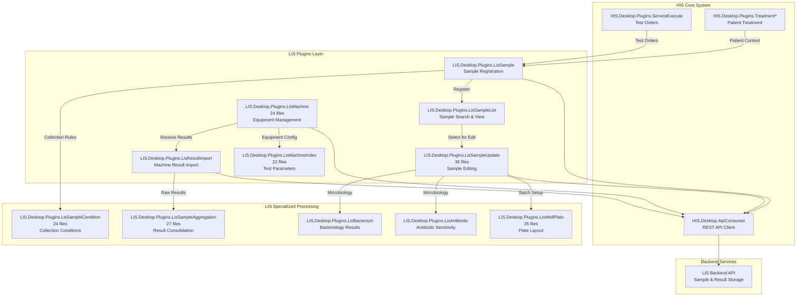
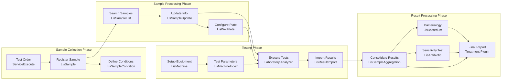
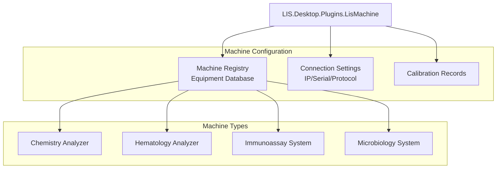
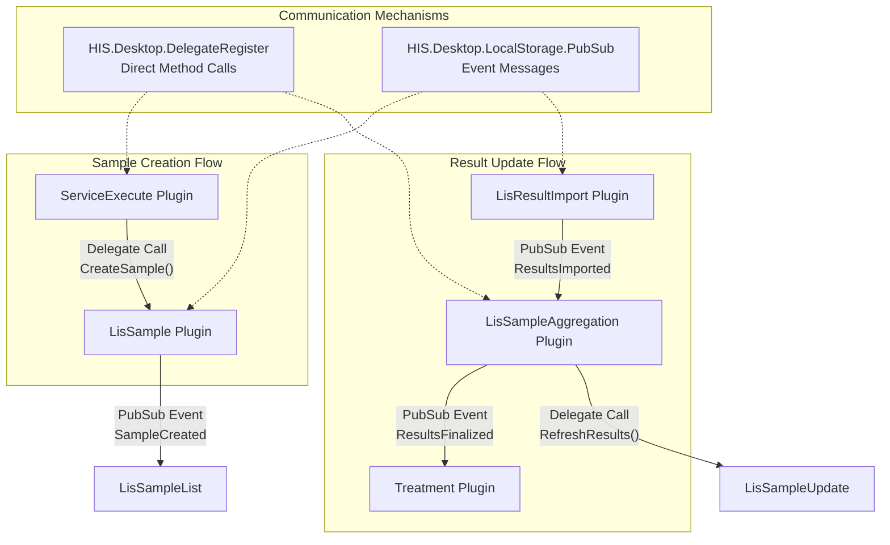
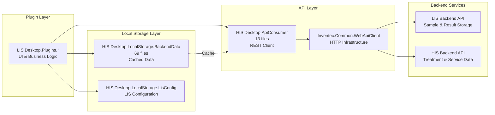
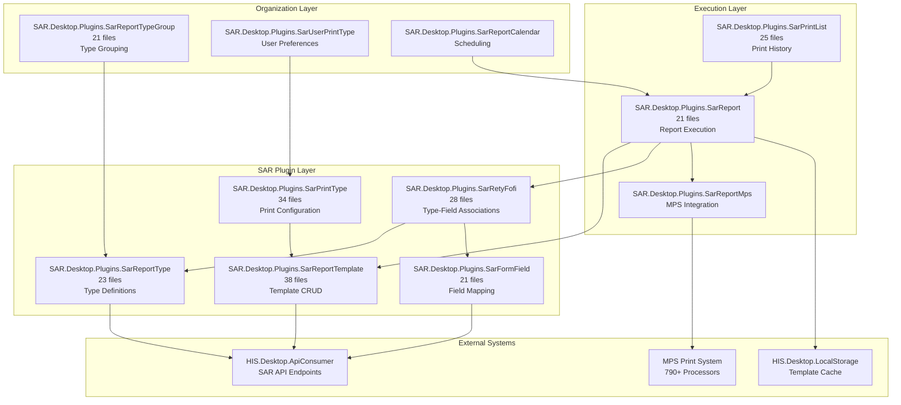
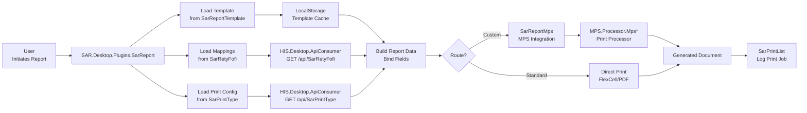
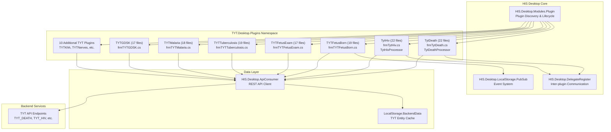
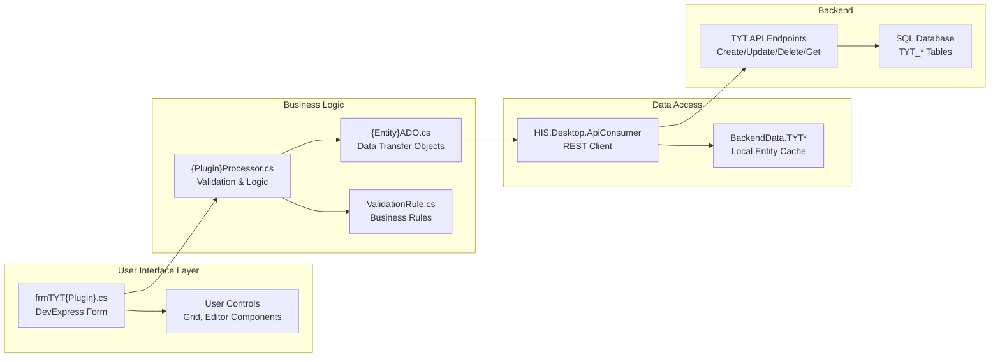
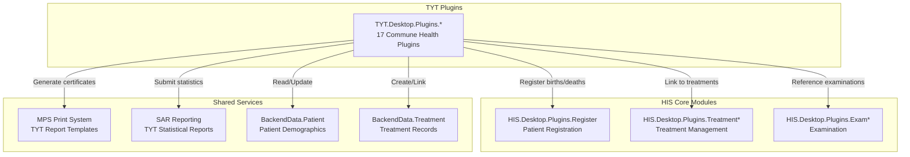

## Purpose and Scope

This document covers the LIS (Laboratory Information System) plugin subsystem within the HIS application. The LIS plugins manage laboratory test workflows including sample collection, test execution, machine integration, result reporting, and quality control. There are 12 specialized plugins located in `HIS/Plugins/LIS.Desktop.Plugins.*` that handle different aspects of laboratory operations.

For general plugin architecture concepts, see [Plugin System Architecture](../../01-architecture/plugin-system.md). For related clinical plugins dealing with test ordering and service execution, see [HIS Core Business Plugins](../../02-modules/his-desktop/business-plugins.md). For print templates used to generate laboratory reports, see [MPS Print System](../../02-modules/his-desktop/business-plugins.md#mps-print).

---

## LIS Plugin Overview

The LIS subsystem consists of 12 specialized plugins that collectively manage the laboratory workflow from sample collection through result reporting. These plugins integrate with both internal HIS systems (treatment, service execution) and external laboratory equipment.

### Complete Plugin List

| Plugin Name | File Count | Primary Responsibility |
|------------|-----------|------------------------|
| `LisSampleUpdate` | 36 files | Update and edit laboratory sample information |
| `LisSampleAggregation` | 27 files | Aggregate and consolidate sample results |
| `LisWellPlate` | 26 files | Manage well plate layouts for batch testing |
| `LisSampleCondition` | 24 files | Configure sample collection and storage conditions |
| `LisMachine` | 24 files | Manage laboratory equipment and analyzers |
| `LisMachineIndex` | 22 files | Configure machine test indices and parameters |
| `LisSampleList` | 21 files | View and search laboratory samples |
| `LisSample` | ~20 files | Create and register new laboratory samples |
| `LisAntibiotic` | ~20 files | Manage antibiotic sensitivity testing |
| `LisBacterium` | ~20 files | Manage bacteriology test results |
| `LisDelivery` | ~18 files | Handle sample delivery and transport |
| `LisResultImport` | ~18 files | Import results from laboratory machines |

**Sources:** [`.devin/wiki.json:130-137`](../../../../.devin/wiki.json#L130-L137)

---

## System Architecture

### LIS Plugin Integration



**Sources:** [`.devin/wiki.json:8-9`](../../../../.devin/wiki.json#L8-L9, [`.devin/wiki.json:62-67`](../../../../.devin/wiki.json#L62-L67, [`.devin/wiki.json:130-137`](../../../../.devin/wiki.json#L130-L137)

---

## Laboratory Workflow

### Sample Processing Flow



**Sources:** [`.devin/wiki.json:130-137`](../../../../.devin/wiki.json#L130-L137)

---

## Core LIS Plugins

### Sample Management Plugins

#### LisSample - Sample Registration
Primary plugin for creating and registering laboratory samples from test orders. This plugin links service requests from `HIS.Desktop.Plugins.ServiceExecute` to physical laboratory samples.

**Key Responsibilities:**
- Create sample records from test orders
- Assign sample identifiers (barcode/accession numbers)
- Associate samples with patient treatments
- Set initial sample status

**Typical Location:** `HIS/Plugins/LIS.Desktop.Plugins.LisSample/`

---

#### LisSampleList - Sample Search and Display
Provides search, filter, and list view capabilities for laboratory samples. Users can query samples by patient, date range, test type, status, or sample ID.

**Key Responsibilities:**
- Display sample list with filtering options
- Search by multiple criteria
- Show sample status and progress
- Navigate to sample detail or update screens

**Typical Location:** `HIS/Plugins/LIS.Desktop.Plugins.LisSampleList/`
**File Count:** 21 files

**Sources:** [`.devin/wiki.json:134-136`](../../../../.devin/wiki.json#L134-L136)

---

#### LisSampleUpdate - Sample Editing
The largest LIS plugin with 36 files, providing comprehensive sample editing capabilities including status updates, result entry, and quality control annotations.

**Key Responsibilities:**
- Edit sample metadata and attributes
- Update sample status through workflow stages
- Enter manual test results
- Add comments and quality control notes
- Link to specialized testing workflows

**Typical Location:** `HIS/Plugins/LIS.Desktop.Plugins.LisSampleUpdate/`
**File Count:** 36 files

**Sources:** [`.devin/wiki.json:134-136`](../../../../.devin/wiki.json#L134-L136)

---

#### LisSampleCondition - Collection Conditions
Manages the configuration of sample collection requirements including fasting status, timing requirements, and special handling instructions.

**Key Responsibilities:**
- Define collection conditions for test types
- Configure fasting requirements
- Set timing constraints (morning collection, 24-hour collection)
- Specify storage and transport conditions
- Associate conditions with test definitions

**Typical Location:** `HIS/Plugins/LIS.Desktop.Plugins.LisSampleCondition/`
**File Count:** 24 files

**Sources:** [`.devin/wiki.json:134-136`](../../../../.devin/wiki.json#L134-L136)

---

### Machine Integration Plugins

#### LisMachine - Laboratory Equipment Management
Manages the configuration and connectivity of laboratory analyzers and testing equipment. Maintains equipment inventory, connection parameters, and operational status.

**Key Responsibilities:**
- Register and configure laboratory analyzers
- Define machine connection settings (IP, serial port, protocol)
- Track equipment maintenance and calibration
- Monitor machine status and availability
- Map machines to test types

**Typical Location:** `HIS/Plugins/LIS.Desktop.Plugins.LisMachine/`
**File Count:** 24 files



**Sources:** [`.devin/wiki.json:134-136`](../../../../.devin/wiki.json#L134-L136)

---

#### LisMachineIndex - Test Parameter Configuration
Configures the mapping between machine test codes and HIS test definitions. Each laboratory analyzer uses internal test codes that must be mapped to standardized HIS service codes.

**Key Responsibilities:**
- Map machine test codes to HIS service codes
- Configure result value mappings and units
- Define normal ranges per machine and test
- Set up quality control parameters
- Configure result transmission formats

**Typical Location:** `HIS/Plugins/LIS.Desktop.Plugins.LisMachineIndex/`
**File Count:** 22 files

**Sources:** [`.devin/wiki.json:134-136`](../../../../.devin/wiki.json#L134-L136)

---

#### LisResultImport - Machine Result Import
Handles the import of test results from laboratory analyzers into the HIS system. Supports various communication protocols and result formats.

**Key Responsibilities:**
- Connect to laboratory analyzers
- Parse machine result formats (HL7, ASTM, proprietary)
- Match results to pending samples
- Validate imported results
- Handle import errors and conflicts
- Trigger result aggregation workflow

**Typical Location:** `HIS/Plugins/LIS.Desktop.Plugins.LisResultImport/`

**Sources:** [`.devin/wiki.json:134-136`](../../../../.devin/wiki.json#L134-L136)

---

### Processing and Analysis Plugins

#### LisSampleAggregation - Result Consolidation
Aggregates and consolidates test results from multiple sources (manual entry, machine import, calculated values) into final reportable results.

**Key Responsibilities:**
- Combine results from multiple test runs
- Calculate derived values and panels
- Apply quality control rules
- Flag abnormal results
- Prepare results for reporting
- Trigger notification for critical values

**Typical Location:** `HIS/Plugins/LIS.Desktop.Plugins.LisSampleAggregation/`
**File Count:** 27 files

**Sources:** [`.devin/wiki.json:134-136`](../../../../.devin/wiki.json#L134-L136)

---

#### LisWellPlate - Plate Layout Management
Manages well plate configurations for batch testing workflows, commonly used in immunoassay and molecular testing.

**Key Responsibilities:**
- Define plate layouts (96-well, 384-well)
- Assign samples to well positions
- Configure control and calibrator positions
- Track plate processing status
- Export plate layouts to analyzers
- Import plate results

**Typical Location:** `HIS/Plugins/LIS.Desktop.Plugins.LisWellPlate/`
**File Count:** 26 files

**Sources:** [`.devin/wiki.json:134-136`](../../../../.devin/wiki.json#L134-L136)

---

### Microbiology Plugins

#### LisBacterium - Bacteriology Management
Manages bacteriology test results including organism identification, colony counts, and culture findings.

**Key Responsibilities:**
- Record isolated organisms
- Document colony characteristics
- Track culture growth
- Link to antibiotic sensitivity testing
- Store organism taxonomy data

**Typical Location:** `HIS/Plugins/LIS.Desktop.Plugins.LisBacterium/`

---

#### LisAntibiotic - Antibiotic Sensitivity Testing
Manages antibiotic susceptibility test results including MIC (Minimum Inhibitory Concentration) values and interpretation.

**Key Responsibilities:**
- Record antibiotic test results
- Store MIC/disk diffusion values
- Apply interpretation rules (S/I/R)
- Track antibiotic panel configurations
- Generate antibiogram reports

**Typical Location:** `HIS/Plugins/LIS.Desktop.Plugins.LisAntibiotic/`

**Sources:** [`.devin/wiki.json:134-136`](../../../../.devin/wiki.json#L134-L136)

---

## Plugin Communication Patterns

### Inter-Plugin Communication

LIS plugins communicate with each other and with HIS core plugins through two primary mechanisms:



**Communication Patterns:**

1. **Delegate Pattern** - Used for synchronous operations requiring immediate response
   - Creating samples from test orders
   - Refreshing data after updates
   - Validating input before save

2. **PubSub Pattern** - Used for asynchronous notifications
   - Sample status changes
   - Result availability notifications
   - Machine connection status updates

**Sources:** [`.devin/wiki.json:62-67`](../../../../.devin/wiki.json#L62-L67)

---

## Data Models and API Integration

### LIS Data Flow Architecture



**Data Model Components:**

- **LIS Sample Models** - Stored in plugin ADO folders, represent sample entities
- **Machine Configuration** - Cached in `BackendData` for offline access
- **Test Parameters** - Retrieved from `LisConfig` and backend API
- **Results** - Synchronized through `ApiConsumer` with server validation

**Sources:** [`.devin/wiki.json:46-52`](../../../../.devin/wiki.json#L46-L52, [`.devin/wiki.json:56-57`](../../../../.devin/wiki.json#L56-L57)

---

## Integration with Other Subsystems

### Connection to Core HIS Workflows

| Integration Point | Source Plugin | Target Plugin(s) | Purpose |
|------------------|---------------|------------------|---------|
| Test Ordering | `ServiceExecute` | `LisSample` | Create samples from service orders |
| Patient Context | `Treatment`, `Exam` | All LIS plugins | Associate samples with patient episodes |
| Result Reporting | `LisSampleAggregation` | `Treatment`, `ExamService` | Deliver finalized test results |
| Printing | All LIS plugins | `MPS.Processor.Mps*` | Generate laboratory reports |
| Billing | `LisSample` | `Transaction*` | Link tests to billing transactions |

**Sources:** [`.devin/wiki.json:70-77`](../../../../.devin/wiki.json#L70-L77, [`.devin/wiki.json:181-187`](../../../../.devin/wiki.json#L181-L187)

---

## Configuration and LocalStorage

### LIS-Specific Configuration

The LIS subsystem uses dedicated configuration storage:

**Configuration Classes:**
- `HIS.Desktop.LocalStorage.LisConfig` - LIS-specific settings
- `HIS.Desktop.LocalStorage.HisConfig` - General HIS configuration including laboratory parameters

**Common Configuration Items:**
- Default sample collection conditions
- Automatic result import scheduling
- Machine communication timeouts
- Quality control thresholds
- Critical value alert rules
- Result approval workflows

**Storage Pattern:**
Configuration is cached locally in `BackendData` and synchronized with the backend through `ApiConsumer`. Changes are published via `PubSub` to notify active plugins.

**Sources:** [`.devin/wiki.json:46-52`](../../../../.devin/wiki.json#L46-L52)

---

## Plugin Development Guidelines

### Creating a New LIS Plugin

To add a new LIS plugin to the system:

1. **Plugin Structure** - Follow standard plugin architecture:
   - Main plugin class implementing `IModule` interface
   - Run folder containing form implementations
   - ADO folder for data transfer objects
   - Base folder for common utilities
   - Properties folder for plugin metadata

2. **Namespace Convention** - Use `LIS.Desktop.Plugins.[PluginName]` pattern

3. **Registration** - Register with plugin discovery system in `Inventec.Desktop.Core`

4. **Communication** - Implement both:
   - Delegate handlers for synchronous operations
   - PubSub subscriptions for asynchronous notifications

5. **API Integration** - Use `HIS.Desktop.ApiConsumer` for backend communication

6. **Caching** - Leverage `BackendData` for performance optimization

**Plugin Size Reference:**
- Small plugins: ~18-21 files (basic CRUD operations)
- Medium plugins: ~24-27 files (complex UI with business logic)
- Large plugins: ~36 files (comprehensive workflows with integrations)

**Sources:** [`.devin/wiki.json:62-67`](../../../../.devin/wiki.json#L62-L67, [`.devin/wiki.json:130-137`](../../../../.devin/wiki.json#L130-L137)

---

## Print Integration

LIS plugins integrate with the MPS (Medical Print System) to generate laboratory reports, result sheets, and sample labels.

### Print Processors for Laboratory Documents

Common MPS processors used by LIS plugins:

- `Mps0001*` series - Laboratory result reports
- `Mps0002*` series - Sample collection labels
- `Mps0003*` series - Batch result summaries
- `Mps0004*` series - Quality control reports
- `Mps0005*` series - Microbiology culture reports

Each processor is invoked through the MPS API with a Print Data Object (PDO) containing the required data.

**Sources:** [`.devin/wiki.json:181-187`](../../../../.devin/wiki.json#L181-L187)

---

## Summary

The LIS Laboratory Plugins subsystem provides comprehensive laboratory information management within the HIS application. The 12 specialized plugins cover the complete laboratory workflow from sample registration through result reporting, with robust machine integration capabilities.

**Key Characteristics:**
- **Modular Design** - Each plugin handles a specific aspect of laboratory operations
- **Machine Integration** - Supports multiple analyzer types and communication protocols
- **Quality Control** - Built-in aggregation and validation workflows
- **Extensibility** - Plugin architecture allows adding new laboratory workflows without core system changes

**Plugin Categories:**
1. **Sample Management** - LisSample, LisSampleList, LisSampleUpdate, LisSampleCondition
2. **Machine Integration** - LisMachine, LisMachineIndex, LisResultImport
3. **Processing** - LisSampleAggregation, LisWellPlate
4. **Microbiology** - LisBacterium, LisAntibiotic
5. **Delivery** - LisDelivery

For plugin communication patterns, see [Plugin System Architecture](../../01-architecture/plugin-system.md). For print template details, see [MPS Print System](../../02-modules/his-desktop/business-plugins.md#mps-print).

**Sources:** [`.devin/wiki.json:130-137`](../../../../.devin/wiki.json#L130-L137, [`.devin/wiki.json:8-9`](../../../../.devin/wiki.json#L8-L9)

# SAR Report Plugins


## Purpose and Scope

This document covers the SAR (System of Advanced Reports) plugin subsystem within the HIS application. SAR plugins provide advanced reporting capabilities, including template management, custom report configuration, print type management, and report execution. These 15 plugins enable users to create, configure, and execute customized medical reports beyond the standard 790+ MPS print processors.

For standard medical form printing (prescriptions, lab reports, invoices), see [MPS Print System](../../02-modules/his-desktop/business-plugins.md#mps-print). For general plugin architecture concepts, see [Plugin System Architecture](../../01-architecture/plugin-system.md).

---

## Overview

The SAR subsystem consists of 15 specialized plugins that manage the lifecycle of custom reports:

- **Template Management**: Define and maintain report templates
- **Type Configuration**: Configure report types and categories
- **Print Type Management**: Associate reports with print configurations
- **Execution**: Generate and execute reports based on templates
- **Field Mapping**: Map form fields to data sources

The SAR system bridges the gap between the static MPS print processors and dynamic, user-configurable reporting needs.

Sources: [[`.devin/wiki.json:140-148`](../../../../.devin/wiki.json#L140-L148)](../../../../.devin/wiki.json#L140-L148)

---

## SAR Plugin Inventory

The following table lists all 15 SAR plugins with their file counts and primary responsibilities:

| Plugin Name | Files | Primary Responsibility |
|-------------|-------|----------------------|
| `SAR.Desktop.Plugins.SarReportTemplate` | 38 | Manage report templates, template editor, template versioning |
| `SAR.Desktop.Plugins.SarPrintType` | 34 | Configure print types, associate templates with printers |
| `SAR.Desktop.Plugins.SarRetyFofi` | 28 | Report type to form field mapping (Rety-Fofi associations) |
| `SAR.Desktop.Plugins.SarPrintList` | 25 | View and manage print job history |
| `SAR.Desktop.Plugins.SarReportType` | 23 | Define and categorize report types |
| `SAR.Desktop.Plugins.SarFormField` | 21 | Manage form field definitions for dynamic binding |
| `SAR.Desktop.Plugins.SarReport` | 21 | Execute and generate reports |
| `SAR.Desktop.Plugins.SarReportTypeGroup` | 21 | Group and organize report types hierarchically |
| `SAR.Desktop.Plugins.SarReportCalendar` | ~18 | Schedule report generation |
| `SAR.Desktop.Plugins.SarReportMps` | ~18 | Bridge SAR reports to MPS processors |
| `SAR.Desktop.Plugins.SarFormData` | ~16 | Manage form data sources |
| `SAR.Desktop.Plugins.SarReportMax` | ~15 | Report aggregation and maximum value queries |
| `SAR.Desktop.Plugins.SarReportType2` | ~15 | Alternative report type configuration |
| `SAR.Desktop.Plugins.SarUserPrintType` | ~14 | User-specific print type preferences |
| `SAR.Desktop.Plugins.SarReportHoldReturn` | ~12 | Hold and return report queue management |

Sources: [[`.devin/wiki.json:140-148`](../../../../.devin/wiki.json#L140-L148)](../../../../.devin/wiki.json#L140-L148)

---

## SAR System Architecture



**Diagram 1: SAR Plugin Architecture and Dependencies**

This diagram shows how SAR plugins are organized into three logical layers. The plugin layer manages configuration data, the execution layer generates reports, and the organization layer provides grouping and user preferences.

Sources: [[`.devin/wiki.json:140-148`](../../../../.devin/wiki.json#L140-L148)](../../../../.devin/wiki.json#L140-L148)

---

## Core Components

### SarReportTemplate (38 files)

The largest SAR plugin, responsible for template management:

**Key Components:**
- Template editor interface
- Template versioning system
- Template import/export functionality
- Template validation logic

**Typical File Structure:**
```
HIS/Plugins/SAR.Desktop.Plugins.SarReportTemplate/
├── Run/
│   ├── frmSarReportTemplate.cs          // Main template editor form
│   ├── frmSarReportTemplateList.cs      // Template list view
│   └── UCTemplatePrint.cs               // Template preview control
├── ADO/
│   └── SarReportTemplateADO.cs          // Data transfer objects
├── Validations/
│   └── TemplateValidationRule.cs        // Template validation
└── SarReportTemplate.cs                  // Plugin entry point
```

Sources: [[`.devin/wiki.json:140-148`](../../../../.devin/wiki.json#L140-L148)](../../../../.devin/wiki.json#L140-L148)

### SarPrintType (34 files)

Manages print type configurations and associations:

**Responsibilities:**
- Define print types (A4, A5, thermal, continuous, etc.)
- Associate templates with printer configurations
- Manage print type metadata (paper size, orientation, margins)
- Configure default print types per report type

**Key File Paths:**
- [[`HIS/Plugins/SAR.Desktop.Plugins.SarPrintType/Run/frmSarPrintType.cs`](../../../../HIS/Plugins/SAR.Desktop.Plugins.SarPrintType/Run/frmSarPrintType.cs)](../../../../HIS/Plugins/SAR.Desktop.Plugins.SarPrintType/Run/frmSarPrintType.cs)
- [[`HIS/Plugins/SAR.Desktop.Plugins.SarPrintType/ADO/SarPrintTypeADO.cs`](../../../../HIS/Plugins/SAR.Desktop.Plugins.SarPrintType/ADO/SarPrintTypeADO.cs)](../../../../HIS/Plugins/SAR.Desktop.Plugins.SarPrintType/ADO/SarPrintTypeADO.cs)

Sources: [[`.devin/wiki.json:140-148`](../../../../.devin/wiki.json#L140-L148)](../../../../.devin/wiki.json#L140-L148)

### SarRetyFofi (28 files)

Implements the report type to form field mapping system:

**Core Functionality:**
- Map report types to available form fields
- Define field data sources and bindings
- Configure field visibility and formatting rules
- Validate field mappings before report execution

The name "RetyFofi" is an abbreviation for "Report Type - Form Field".

Sources: [[`.devin/wiki.json:140-148`](../../../../.devin/wiki.json#L140-L148)](../../../../.devin/wiki.json#L140-L148)

### SarFormField (21 files)

Manages the field definition system:

**Field Types:**
- Text fields
- Numeric fields
- Date/time fields
- Lookup fields (references to master data)
- Calculated fields (expressions)

**Key Classes:**
- `FormFieldProcessor` - Processes field definitions
- `FormFieldValidator` - Validates field data
- `FormFieldDataBinder` - Binds fields to data sources

Sources: [[`.devin/wiki.json:140-148`](../../../../.devin/wiki.json#L140-L148)](../../../../.devin/wiki.json#L140-L148)

---

## Report Generation Data Flow



**Diagram 2: Report Generation Data Flow Through SAR Components**

This diagram illustrates the complete report generation process, showing how user requests flow through various SAR plugins to produce output documents. The system can route to either MPS processors for complex medical forms or direct print for simpler reports.

Sources: [[`.devin/wiki.json:140-148`](../../../../.devin/wiki.json#L140-L148)](../../../../.devin/wiki.json#L140-L148)

---

## Template Management System

### Template Structure

SAR templates are typically stored as:
- **Template Definition**: XML or JSON configuration
- **Layout Information**: Paper size, margins, orientation
- **Field Bindings**: Mapping of data fields to print positions
- **Formatting Rules**: Fonts, styles, conditional formatting

### Template Lifecycle

1. **Creation**: User creates template via `SarReportTemplate` plugin
2. **Configuration**: Associate template with report type via `SarReportType`
3. **Field Mapping**: Define field bindings via `SarRetyFofi`
4. **Print Configuration**: Set print type via `SarPrintType`
5. **Execution**: Generate reports via `SarReport`
6. **History**: Track executions in `SarPrintList`

Sources: [[`.devin/wiki.json:140-148`](../../../../.devin/wiki.json#L140-L148)](../../../../.devin/wiki.json#L140-L148)

---

## Integration with MPS Print System

### SarReportMps Bridge Plugin

The `SarReportMps` plugin serves as an adapter between SAR's dynamic reporting and MPS's static print processors:

**Integration Patterns:**

1. **Template-to-Processor Mapping**: SAR templates can be configured to invoke specific MPS processors
2. **Data Transformation**: SAR field data is transformed into MPS PDO (Print Data Object) format
3. **Fallback Mechanism**: If no MPS processor matches, SAR uses direct print via FlexCell

**Example Flow:**
```
User selects "Custom Lab Report" 
→ SarReport loads template 
→ Checks if template.UseMpsProcessor == true
→ Invokes MPS.Processor.Mps000123 with transformed data
→ MPS generates document via FlexCell
```

Sources: [[`.devin/wiki.json:16-18`](../../../../.devin/wiki.json#L16-L18)](../../../../.devin/wiki.json#L16-L18), [[`.devin/wiki.json:140-148`](../../../../.devin/wiki.json#L140-L148)](../../../../.devin/wiki.json#L140-L148)

---

## Report Type Organization

### SarReportTypeGroup (21 files)

Provides hierarchical organization of report types:

**Group Hierarchy Example:**
```
Clinical Reports
├── Laboratory
│   ├── Blood Tests
│   ├── Urine Tests
│   └── Microbiology
├── Imaging
│   ├── X-Ray
│   └── Ultrasound
└── Pathology

Administrative Reports
├── Financial
│   ├── Revenue
│   └── Outstanding Debt
└── Statistical
    ├── Patient Demographics
    └── Service Utilization
```

**Key Operations:**
- Create/edit report type groups
- Assign report types to groups
- Navigate hierarchy in UI
- Filter reports by group

Sources: [[`.devin/wiki.json:140-148`](../../../../.devin/wiki.json#L140-L148)](../../../../.devin/wiki.json#L140-L148)

---

## User Preferences and Scheduling

### SarUserPrintType

Manages user-specific print preferences:
- Default print types per user
- Preferred templates for common reports
- Auto-print settings
- Print queue preferences

### SarReportCalendar

Provides scheduled report generation:
- Define recurring report schedules (daily, weekly, monthly)
- Configure report parameters for scheduled runs
- Email delivery of generated reports
- Queue management for scheduled jobs

Sources: [[`.devin/wiki.json:140-148`](../../../../.devin/wiki.json#L140-L148)](../../../../.devin/wiki.json#L140-L148)

---

## Plugin Communication Patterns

SAR plugins communicate through multiple mechanisms:

### DelegateRegister Pattern

```
// Example: SarReport notifies SarPrintList after print job
HIS.Desktop.DelegateRegister.RegisterDelegate(
    "SAR_PRINT_COMPLETED", 
    PrintCompletedHandler
);
```

### PubSub Events

```
// Example: Template update notification
HIS.Desktop.LocalStorage.PubSub.Publish(
    "SAR_TEMPLATE_UPDATED",
    templateId
);
```

### Direct Plugin-to-Plugin Calls

Some SAR plugins directly instantiate other SAR plugin forms for embedded functionality.

Sources: [[`.devin/wiki.json:60-67`](../../../../.devin/wiki.json#L60-L67)](../../../../.devin/wiki.json#L60-L67)

---

## API Consumer Integration

SAR plugins interact with backend services through `HIS.Desktop.ApiConsumer`:

### Common API Endpoints

| Endpoint Pattern | Purpose | Used By |
|-----------------|---------|---------|
| `/api/SarReportTemplate/*` | Template CRUD operations | SarReportTemplate |
| `/api/SarReportType/*` | Report type management | SarReportType |
| `/api/SarFormField/*` | Field definitions | SarFormField |
| `/api/SarRetyFofi/*` | Type-field mappings | SarRetyFofi |
| `/api/SarPrintType/*` | Print configurations | SarPrintType |
| `/api/SarReport/Generate` | Report execution | SarReport |

### Caching Strategy

SAR plugins leverage `HIS.Desktop.LocalStorage.BackendData` to cache:
- Template definitions (frequently accessed)
- Report type metadata
- Form field definitions
- Print type configurations

This reduces API calls and improves report generation performance.

Sources: [[`.devin/wiki.json:54-57`](../../../../.devin/wiki.json#L54-L57)](../../../../.devin/wiki.json#L54-L57), [[`.devin/wiki.json:44-52`](../../../../.devin/wiki.json#L44-L52)](../../../../.devin/wiki.json#L44-L52)

---

## Comparison: SAR vs MPS

| Aspect | SAR System | MPS System |
|--------|-----------|------------|
| **Configuration** | Dynamic, user-configurable templates | Static, code-defined processors |
| **Count** | 15 management plugins | 790+ print processors |
| **Use Case** | Custom reports, ad-hoc queries | Standard medical forms |
| **Development** | No code changes needed | Requires new processor development |
| **Flexibility** | High - templates editable at runtime | Low - requires recompilation |
| **Complexity** | Lower per report | Higher per processor |
| **Integration** | Can invoke MPS processors | Standalone |

**When to Use SAR:**
- Custom reports specific to facility needs
- Reports that change frequently
- Ad-hoc data extraction
- Statistical summaries

**When to Use MPS:**
- Legally-required medical forms
- Forms with complex layouts
- High-volume standardized documents
- Forms requiring barcode integration

Sources: [[`.devin/wiki.json:16-18`](../../../../.devin/wiki.json#L16-L18)](../../../../.devin/wiki.json#L16-L18), [[`.devin/wiki.json:140-148`](../../../../.devin/wiki.json#L140-L148)](../../../../.devin/wiki.json#L140-L148), [[`.devin/wiki.json:180-197`](../../../../.devin/wiki.json#L180-L197)](../../../../.devin/wiki.json#L180-L197)

---

## Development Patterns

### Creating a New SAR Plugin

While the existing 15 SAR plugins cover most reporting needs, the pattern for extending the SAR subsystem follows the standard HIS plugin structure:

1. **Plugin Entry Point**: [[`PluginName.cs`](../../../PluginName.cs)](../../../PluginName.cs) implementing plugin interface
2. **Run Folder**: Contains form implementations ([[`frmPluginName.cs`](../../../frmPluginName.cs)](../../../frmPluginName.cs))
3. **ADO Folder**: Data transfer objects ([[`PluginNameADO.cs`](../../../PluginNameADO.cs)](../../../PluginNameADO.cs))
4. **Base Folder**: Base classes if needed
5. **Validation**: Validation rules for data integrity

### Example: SarReportTemplate Plugin Structure

```
SAR.Desktop.Plugins.SarReportTemplate/
├── SarReportTemplate.cs              // Plugin registration
├── Run/
│   ├── frmSarReportTemplate.cs      // Template editor
│   ├── frmSarReportTemplateList.cs  // List view
│   └── UCTemplatePrint.cs           // Preview control
├── ADO/
│   ├── SarReportTemplateADO.cs      // Transfer object
│   └── TemplateVersionADO.cs        // Version info
├── Validations/
│   └── TemplateValidationRule.cs    // Validation logic
└── Properties/
    └── AssemblyInfo.cs
```

Sources: [[`.devin/wiki.json:60-67`](../../../../.devin/wiki.json#L60-L67)](../../../../.devin/wiki.json#L60-L67)

---

## Summary

The SAR (System of Advanced Reports) subsystem provides flexible, user-configurable reporting capabilities through 15 specialized plugins. It complements the MPS print system by enabling dynamic report creation without code changes, while still being able to leverage MPS processors when needed.

**Key Takeaways:**
- 15 plugins manage the complete report lifecycle from template creation to execution
- `SarReportTemplate` (38 files) is the largest, handling template management
- `SarRetyFofi` creates the critical mapping between report types and form fields
- SAR can route to MPS processors via `SarReportMps` for complex medical forms
- System supports scheduling, user preferences, and hierarchical organization
- Templates and configurations cached in `LocalStorage` for performance

Sources: [[`.devin/wiki.json:140-148`](../../../../.devin/wiki.json#L140-L148)](../../../../.devin/wiki.json#L140-L148)

# TYT Commune Health Station Plugins


## Purpose and Scope

This document describes the TYT (Trạm Y Tế - Commune Health Station) plugin subsystem within the HIS application. The TYT plugins provide specialized functionality for managing commune-level healthcare facilities and community health programs in Vietnam's primary healthcare network.

The TYT subsystem consists of 17 plugins located in the `TYT.Desktop.Plugins.*` namespace, covering maternal health monitoring, infectious disease tracking (HIV, tuberculosis, malaria), death registration, and other community health programs mandated by the Ministry of Health.

For information about other plugin categories, see:
- HIS Core Business Plugins [#1.1.3.1](../../02-modules/his-desktop/business-plugins.md)
- Access Control plugins, see ACS Access Control Plugins [#1.1.3.5](../../03-business-domains/administration/access-control.md)
- Laboratory plugins, see LIS Laboratory Plugins [#1.1.3.7](../../03-business-domains/laboratory/lis-plugins.md)

For general plugin architecture concepts, see Plugin System Architecture [#1.1.3](../../01-architecture/plugin-system.md).

---

## TYT Plugin Overview

The TYT plugin category addresses the unique requirements of commune health stations, which serve as the primary point of contact for healthcare in rural and peri-urban Vietnam. These facilities are responsible for:

- Recording vital statistics (births, deaths)
- Monitoring maternal and child health
- Tracking and reporting infectious diseases
- Managing community health programs
- Reporting data to district and provincial health authorities

All TYT plugins follow the standard HIS plugin architecture, implementing the `IDesktopRoot` interface and communicating via `HIS.Desktop.DelegateRegister` and `HIS.Desktop.LocalStorage.PubSub` event system.

**TYT Plugin Namespace Structure:**

```
HIS/Plugins/TYT.Desktop.Plugins.*
├── TytDeath/                    (22 files - Death registration)
├── TytHiv/                      (22 files - HIV case management)
├── TYTFetusBorn/               (19 files - Birth registration)
├── TYTTuberculosis/            (19 files - TB case tracking)
├── TYTMalaria/                 (18 files - Malaria surveillance)
├── TYTFetusExam/               (17 files - Prenatal examination)
├── TYTGDSK/                    (17 files - Family planning)
└── [10 additional plugins]
```

Sources: [[`.devin/wiki.json:150-157`](../../../../.devin/wiki.json#L150-L157)](../../../../.devin/wiki.json#L150-L157)

---

## TYT Plugin Catalog

### Complete Plugin List

The following table lists all 17 TYT plugins with their primary functions:

| Plugin Name | File Count | Primary Function | Key Entity Types |
|------------|-----------|------------------|------------------|
| `TytDeath` | 22 | Death certificate registration and reporting | TYT_DEATH |
| `TytHiv` | 22 | HIV/AIDS case management and monitoring | TYT_HIV |
| `TYTFetusBorn` | 19 | Newborn birth registration | TYT_FETUS_BORN |
| `TYTTuberculosis` | 19 | Tuberculosis case tracking and treatment | TYT_TUBERCULOSIS |
| `TYTMalaria` | 18 | Malaria case surveillance and reporting | TYT_MALARIA |
| `TYTFetusExam` | 17 | Prenatal care examination records | TYT_FETUS_EXAM |
| `TYTGDSK` | 17 | Family planning services (Giám Định Sức Khỏe) | TYT_GDSK |
| `TYTKhh` | ~15 | Reproductive health program | TYT_KHH |
| `TYTNerves` | ~15 | Neurological disease tracking | TYT_NERVES |
| `TYTUninfect` | ~15 | Infection control and immunization | TYT_UNINFECT |
| `TYTNewbornScreening` | ~15 | Newborn screening programs | TYT_NEWBORN_SCREENING |
| `TYTMentalHealth` | ~15 | Mental health services | TYT_MENTAL_HEALTH |
| `TYTEarlyChildhood` | ~15 | Early childhood development | TYT_EARLY_CHILDHOOD |
| `TYTNcd` | ~15 | Non-communicable disease monitoring | TYT_NCD |
| `TYTVaccine` | ~15 | Vaccination registry | TYT_VACCINE |
| `TYTNutrition` | ~15 | Nutrition program management | TYT_NUTRITION |
| `TYTHealthEducation` | ~15 | Health education tracking | TYT_HEALTH_EDUCATION |

Sources: [[`.devin/wiki.json:150-157`](../../../../.devin/wiki.json#L150-L157)](../../../../.devin/wiki.json#L150-L157)

---

## Plugin Architecture Diagram

**Diagram: TYT Plugin Integration Architecture**



Sources: [[`.devin/wiki.json:60-67`](../../../../.devin/wiki.json#L60-L67)](../../../../.devin/wiki.json#L60-L67), [[`.devin/wiki.json:150-157`](../../../../.devin/wiki.json#L150-L157)](../../../../.devin/wiki.json#L150-L157)

---

## Common Plugin Structure

Each TYT plugin follows a consistent structural pattern inherited from the HIS plugin architecture:

### Standard File Organization

```
TYT.Desktop.Plugins.{PluginName}/
├── {PluginName}.cs                 # Plugin entry point (IDesktopRoot)
├── Run/
│   ├── frmTYT{PluginName}.cs      # Main form UI
│   ├── frmTYT{PluginName}.Designer.cs
│   └── UCProcessor.cs              # Business logic processor
├── ADO/
│   ├── {Entity}ADO.cs             # Data transfer objects
│   └── {Entity}ImportADO.cs       # Import/export models
├── Base/
│   ├── GlobalStore.cs             # Plugin-level state
│   └── ResourceMessage.cs         # Localization resources
├── Config/
│   └── HisConfigCFG.cs            # Configuration keys
└── Properties/
    ├── AssemblyInfo.cs
    └── Resources.resx
```

### Plugin Entry Point Pattern

Each TYT plugin implements the standard entry point interface:

```
namespace TYT.Desktop.Plugins.{PluginName}
{
    [ExtensionOf(typeof(DesktopRootExtensionPoint))]
    [Plugin(PluginName = "{PluginName}", 
            PluginId = "TYT.Desktop.Plugins.{PluginName}")]
    public class {PluginName} : IDesktopRoot
    {
        public ModuleBase Run(object[] args)
        {
            // Initialize and return main form
        }
    }
}
```

Sources: [[`.devin/wiki.json:60-67`](../../../../.devin/wiki.json#L60-L67)](../../../../.devin/wiki.json#L60-L67)

---

## Key TYT Plugins - Detailed Overview

### TytDeath - Death Registration

**File Count:** 22 files  
**Namespace:** `TYT.Desktop.Plugins.TytDeath`

The `TytDeath` plugin manages death certificate registration and vital statistics reporting for commune health stations.

**Key Components:**

| File/Class | Purpose |
|-----------|---------|
| [[`TytDeath.cs`](../../../TytDeath.cs)](../../../TytDeath.cs) | Plugin entry point and module registration |
| [[`frmTytDeath.cs`](../../../frmTytDeath.cs)](../../../frmTytDeath.cs) | Main death registration form with validation |
| [[`TytDeathProcessor.cs`](../../../TytDeathProcessor.cs)](../../../TytDeathProcessor.cs) | Business logic for death record processing |
| [[`TYT_DEATHADO.cs`](../../../TYT_DEATHADO.cs)](../../../TYT_DEATHADO.cs) | Data transfer object for death records |
| [[`ValidationRule.cs`](../../../ValidationRule.cs)](../../../ValidationRule.cs) | Death certificate validation rules |

**Core Functionality:**
- Death certificate creation and editing
- Cause of death classification (ICD-10 coding)
- Death time and location recording
- Family notification tracking
- Statistical reporting to health authorities

**API Integration:**
- `ApiConsumer.TytDeathCreate()` - Create death record
- `ApiConsumer.TytDeathUpdate()` - Update existing record
- `ApiConsumer.TytDeathGet()` - Retrieve death records
- `ApiConsumer.TytDeathDelete()` - Soft delete record

Sources: [[`.devin/wiki.json:150-157`](../../../../.devin/wiki.json#L150-L157)](../../../../.devin/wiki.json#L150-L157)

---

### TytHiv - HIV Case Management

**File Count:** 22 files  
**Namespace:** `TYT.Desktop.Plugins.TytHiv`

The `TytHiv` plugin provides comprehensive HIV/AIDS case tracking and monitoring functionality for commune health programs.

**Key Components:**

| File/Class | Purpose |
|-----------|---------|
| [[`TytHiv.cs`](../../../TytHiv.cs)](../../../TytHiv.cs) | Plugin entry point |
| [[`frmTytHiv.cs`](../../../frmTytHiv.cs)](../../../frmTytHiv.cs) | HIV case management form |
| [[`TytHivProcessor.cs`](../../../TytHivProcessor.cs)](../../../TytHivProcessor.cs) | HIV-specific business logic |
| [[`TYT_HIVADO.cs`](../../../TYT_HIVADO.cs)](../../../TYT_HIVADO.cs) | HIV case data transfer object |
| [[`TreatmentRegisterGrid.cs`](../../../TreatmentRegisterGrid.cs)](../../../TreatmentRegisterGrid.cs) | ARV treatment tracking grid |

**Core Functionality:**
- HIV case registration and patient demographics
- CD4 count and viral load tracking
- Antiretroviral therapy (ARV) management
- Treatment adherence monitoring
- Partner notification and contact tracing
- Integration with national HIV surveillance system

**Data Synchronization:**
- Supports offline data entry with later synchronization
- Exports data in MOH-specified formats
- Integrates with district-level HIV reporting systems

Sources: [[`.devin/wiki.json:150-157`](../../../../.devin/wiki.json#L150-L157)](../../../../.devin/wiki.json#L150-L157)

---

### TYTFetusBorn - Birth Registration

**File Count:** 19 files  
**Namespace:** `TYT.Desktop.Plugins.TYTFetusBorn`

The `TYTFetusBorn` plugin handles newborn birth registration and vital statistics collection.

**Key Components:**

| File/Class | Purpose |
|-----------|---------|
| [[`TYTFetusBorn.cs`](../../../TYTFetusBorn.cs)](../../../TYTFetusBorn.cs) | Plugin entry point |
| [[`frmTYTFetusBorn.cs`](../../../frmTYTFetusBorn.cs)](../../../frmTYTFetusBorn.cs) | Birth registration form |
| [[`TYT_FETUS_BORNADO.cs`](../../../TYT_FETUS_BORNADO.cs)](../../../TYT_FETUS_BORNADO.cs) | Birth record data model |
| [[`MotherInfoUC.cs`](../../../MotherInfoUC.cs)](../../../MotherInfoUC.cs) | Mother information user control |
| [[`NewbornInfoUC.cs`](../../../NewbornInfoUC.cs)](../../../NewbornInfoUC.cs) | Newborn details user control |

**Core Functionality:**
- Birth certificate generation
- Mother and newborn demographic data
- Birth weight, length, and APGAR scores
- Delivery method and complications
- Links to prenatal examination records (TYTFetusExam)
- Birth notification to civil registration system

Sources: [[`.devin/wiki.json:150-157`](../../../../.devin/wiki.json#L150-L157)](../../../../.devin/wiki.json#L150-L157)

---

### TYTFetusExam - Prenatal Examination

**File Count:** 17 files  
**Namespace:** `TYT.Desktop.Plugins.TYTFetusExam`

The `TYTFetusExam` plugin manages prenatal care visit records and maternal health monitoring.

**Key Components:**

| File/Class | Purpose |
|-----------|---------|
| [[`TYTFetusExam.cs`](../../../TYTFetusExam.cs)](../../../TYTFetusExam.cs) | Plugin entry point |
| [[`frmTYTFetusExam.cs`](../../../frmTYTFetusExam.cs)](../../../frmTYTFetusExam.cs) | Prenatal examination form |
| [[`TYT_FETUS_EXAMADO.cs`](../../../TYT_FETUS_EXAMADO.cs)](../../../TYT_FETUS_EXAMADO.cs) | Examination data model |
| [[`PregnancyHistoryGrid.cs`](../../../PregnancyHistoryGrid.cs)](../../../PregnancyHistoryGrid.cs) | Previous pregnancy history |
| [[`ExamScheduleUC.cs`](../../../ExamScheduleUC.cs)](../../../ExamScheduleUC.cs) | ANC visit scheduling |

**Core Functionality:**
- Antenatal care (ANC) visit recording
- Maternal vital signs and weight tracking
- Fetal development monitoring
- Risk factor identification
- Laboratory test results (blood type, Rh, etc.)
- Pregnancy complications tracking
- Birth preparation counseling

**Integration Points:**
- Links to TYTFetusBorn for delivery outcomes
- Connects with general examination services
- Integrates with laboratory test results

Sources: [[`.devin/wiki.json:150-157`](../../../../.devin/wiki.json#L150-L157)](../../../../.devin/wiki.json#L150-L157)

---

### TYTTuberculosis - TB Case Tracking

**File Count:** 19 files  
**Namespace:** `TYT.Desktop.Plugins.TYTTuberculosis`

The `TYTTuberculosis` plugin supports the National Tuberculosis Control Program (NTP) at the commune level.

**Key Components:**

| File/Class | Purpose |
|-----------|---------|
| [[`TYTTuberculosis.cs`](../../../TYTTuberculosis.cs)](../../../TYTTuberculosis.cs) | Plugin entry point |
| [[`frmTYTTuberculosis.cs`](../../../frmTYTTuberculosis.cs)](../../../frmTYTTuberculosis.cs) | TB case management form |
| [[`TYT_TUBERCULOSISADO.cs`](../../../TYT_TUBERCULOSISADO.cs)](../../../TYT_TUBERCULOSISADO.cs) | TB case data model |
| [[`TreatmentRegimenGrid.cs`](../../../TreatmentRegimenGrid.cs)](../../../TreatmentRegimenGrid.cs) | DOTS treatment tracking |
| [[`ContactTracingUC.cs`](../../../ContactTracingUC.cs)](../../../ContactTracingUC.cs) | Contact investigation |

**Core Functionality:**
- TB case detection and registration
- Classification (pulmonary/extrapulmonary, new/retreatment)
- DOTS (Directly Observed Treatment, Short-course) tracking
- Treatment outcome recording
- Contact screening management
- Drug resistance monitoring
- Integration with NTP reporting system

Sources: [[`.devin/wiki.json:150-157`](../../../../.devin/wiki.json#L150-L157)](../../../../.devin/wiki.json#L150-L157)

---

### TYTMalaria - Malaria Surveillance

**File Count:** 18 files  
**Namespace:** `TYT.Desktop.Plugins.TYTMalaria`

The `TYTMalaria` plugin provides malaria case surveillance and vector control activity tracking.

**Key Components:**

| File/Class | Purpose |
|-----------|---------|
| [[`TYTMalaria.cs`](../../../TYTMalaria.cs)](../../../TYTMalaria.cs) | Plugin entry point |
| [[`frmTYTMalaria.cs`](../../../frmTYTMalaria.cs)](../../../frmTYTMalaria.cs) | Malaria case form |
| [[`TYT_MALARIAADO.cs`](../../../TYT_MALARIAADO.cs)](../../../TYT_MALARIAADO.cs) | Malaria case data model |
| [[`ParasiteSpeciesGrid.cs`](../../../ParasiteSpeciesGrid.cs)](../../../ParasiteSpeciesGrid.cs) | Parasitology results |
| [[`VectorControlUC.cs`](../../../VectorControlUC.cs)](../../../VectorControlUC.cs) | Intervention tracking |

**Core Functionality:**
- Malaria case detection and notification
- Parasite species identification (P. falciparum, P. vivax)
- Treatment regimen according to national guidelines
- Vector control intervention recording (bed nets, spraying)
- Endemic area mapping
- Outbreak investigation support

Sources: [[`.devin/wiki.json:150-157`](../../../../.devin/wiki.json#L150-L157)](../../../../.devin/wiki.json#L150-L157)

---

### TYTGDSK - Family Planning Services

**File Count:** 17 files  
**Namespace:** `TYT.Desktop.Plugins.TYTGDSK`

The `TYTGDSK` plugin manages family planning services and reproductive health counseling (Giám Định Sức Khỏe - Health Assessment).

**Key Components:**

| File/Class | Purpose |
|-----------|---------|
| [[`TYTGDSK.cs`](../../../TYTGDSK.cs)](../../../TYTGDSK.cs) | Plugin entry point |
| [[`frmTYTGDSK.cs`](../../../frmTYTGDSK.cs)](../../../frmTYTGDSK.cs) | Family planning service form |
| [[`TYT_GDSKADO.cs`](../../../TYT_GDSKADO.cs)](../../../TYT_GDSKADO.cs) | Service data model |
| [[`ContraceptiveMethodUC.cs`](../../../ContraceptiveMethodUC.cs)](../../../ContraceptiveMethodUC.cs) | Method selection UI |
| [[`FollowUpScheduleGrid.cs`](../../../FollowUpScheduleGrid.cs)](../../../FollowUpScheduleGrid.cs) | Follow-up visit tracking |

**Core Functionality:**
- Family planning counseling records
- Contraceptive method selection and provision
- Follow-up visit scheduling
- Side effect monitoring
- Method switching tracking
- Integration with maternal health services

Sources: [[`.devin/wiki.json:150-157`](../../../../.devin/wiki.json#L150-L157)](../../../../.devin/wiki.json#L150-L157)

---

## Data Flow and Communication Patterns

**Diagram: TYT Plugin Data Flow**



Sources: [[`.devin/wiki.json:54-57`](../../../../.devin/wiki.json#L54-L57)](../../../../.devin/wiki.json#L54-L57), [[`.devin/wiki.json:60-67`](../../../../.devin/wiki.json#L60-L67)](../../../../.devin/wiki.json#L60-L67)

---

## Communication Between TYT Plugins and HIS Core

### Plugin Registration

TYT plugins register with the HIS Desktop Core through the standard plugin mechanism:

1. Plugin discovery via `ExtensionOf(typeof(DesktopRootExtensionPoint))` attribute
2. Plugin metadata defined in `[Plugin]` attribute with unique `PluginId`
3. Module creation through `IDesktopRoot.Run()` method

### Inter-Plugin Communication

TYT plugins communicate with other HIS modules through two primary mechanisms:

**1. DelegateRegister Pattern:**

Used for direct plugin-to-plugin method invocation:

```
// Example: TytDeath calling patient selection
HIS.Desktop.DelegateRegister.CallSelectPatient(patientId);
```

**2. PubSub Event System:**

Used for loose-coupled event notifications:

```
// Example: Publishing death registration event
HIS.Desktop.LocalStorage.PubSub.Publish(
    "TYT.DEATH_REGISTERED", 
    deathRecordADO
);

// Example: Subscribing to patient updates
HIS.Desktop.LocalStorage.PubSub.Subscribe<PatientADO>(
    "HIS.PATIENT_UPDATED", 
    OnPatientUpdated
);
```

Sources: [[`.devin/wiki.json:44-52`](../../../../.devin/wiki.json#L44-L52)](../../../../.devin/wiki.json#L44-L52), [[`.devin/wiki.json:60-67`](../../../../.devin/wiki.json#L60-L67)](../../../../.devin/wiki.json#L60-L67)

---

## Integration with Core HIS Functions

**Diagram: TYT Integration with HIS Core**



Sources: [[`.devin/wiki.json:60-67`](../../../../.devin/wiki.json#L60-L67)](../../../../.devin/wiki.json#L60-L67), [[`.devin/wiki.json:150-157`](../../../../.devin/wiki.json#L150-L157)](../../../../.devin/wiki.json#L150-L157)

---

## Print Templates for TYT Plugins

Each TYT plugin integrates with the MPS (Medical Print System) to generate official documents and reports. Common print templates include:

| Plugin | Print Templates | MPS Processor |
|--------|----------------|---------------|
| TytDeath | Death Certificate, Death Notification | Mps0005xx series |
| TytHiv | HIV Case Report, ARV Treatment Card | Mps0006xx series |
| TYTFetusBorn | Birth Certificate, Birth Notification | Mps0007xx series |
| TYTFetusExam | Prenatal Care Card, ANC Summary | Mps0008xx series |
| TYTTuberculosis | TB Treatment Card, DOTS Card | Mps0009xx series |
| TYTMalaria | Malaria Case Report | Mps00010xx series |
| TYTGDSK | Family Planning Card | Mps00011xx series |

Print requests are made through the standard MPS integration:

```
// Example print invocation from TYT plugin
MPSProcessor.Run(
    Mps000xxx.PrintTypeCode,
    tytEntityADO,
    printConfig
);
```

Sources: [[`.devin/wiki.json:180-188`](../../../../.devin/wiki.json#L180-L188)](../../../../.devin/wiki.json#L180-L188)

---

## Configuration and Customization

### Plugin Configuration Keys

TYT plugins use configuration keys from `HIS.Desktop.LocalStorage.HisConfig` and plugin-specific `HisConfigCFG` classes:

| Configuration Key | Purpose | Example Value |
|------------------|---------|---------------|
| `TYT.DEATH.AUTO_NUMBER` | Auto-generate death certificate numbers | true/false |
| `TYT.HIV.REQUIRE_CD4` | Mandate CD4 count entry | true/false |
| `TYT.FETUS_BORN.LINK_TREATMENT` | Link birth to treatment record | true/false |
| `TYT.TB.DOTS_REMINDER` | Enable DOTS adherence reminders | true/false |
| `TYT.MALARIA.ENDEMIC_PROVINCE` | Province endemic status | true/false |

### Customization Points

TYT plugins support customization through:

1. **HisConfig System:** Runtime configuration without recompilation
2. **ADO Extensions:** Custom fields via ADO class inheritance
3. **Validation Rules:** Custom validation logic in [[`ValidationRule.cs`](../../../ValidationRule.cs)](../../../ValidationRule.cs)
4. **Print Templates:** Customizable MPS templates per facility
5. **Report Formats:** SAR report template modifications

Sources: [[`.devin/wiki.json:44-52`](../../../../.devin/wiki.json#L44-L52)](../../../../.devin/wiki.json#L44-L52)

---

## Reporting and Statistics

### Statistical Report Integration

TYT plugins integrate with the SAR (System of Advanced Reports) module to generate statistical reports required by health authorities:

**Common TYT Reports:**

| Report Type | Frequency | Data Source Plugins |
|-------------|-----------|---------------------|
| Vital Statistics Summary | Monthly | TytDeath, TYTFetusBorn |
| HIV/AIDS Program Report | Quarterly | TytHiv |
| TB Program Report | Quarterly | TYTTuberculosis |
| Maternal-Child Health Report | Monthly | TYTFetusExam, TYTFetusBorn |
| Communicable Disease Report | Monthly | TYTMalaria, TYTTuberculosis |
| Family Planning Report | Quarterly | TYTGDSK |

### Data Export Formats

TYT plugins support data export in formats required by the Ministry of Health:

- Excel workbooks (via FlexCell integration)
- XML for electronic submission
- CSV for data exchange
- PDF for official documentation

Sources: [[`.devin/wiki.json:140-148`](../../../../.devin/wiki.json#L140-L148)](../../../../.devin/wiki.json#L140-L148)

---

## Development Guidelines

### Creating a New TYT Plugin

To add a new TYT plugin to the system:

1. **Create Plugin Project:**
   - Create new project: `TYT.Desktop.Plugins.{NewPlugin}`
   - Reference required assemblies: `HIS.Desktop.Common`, `HIS.Desktop.ADO`, `Inventec.Desktop.Core`

2. **Implement Plugin Entry Point:**
   - Inherit from `IDesktopRoot`
   - Add `[ExtensionOf]` and `[Plugin]` attributes
   - Implement `Run()` method

3. **Create Form and Processor:**
   - Main form: [`frmTYT{NewPlugin}.cs`](../../../frmTYT{NewPlugin}.cs)
   - Business logic: [`{NewPlugin}Processor.cs`](../../../{NewPlugin}Processor.cs)
   - Data model: [`TYT_{NEW_PLUGIN}ADO.cs`](../../../TYT_{NEW_PLUGIN}ADO.cs)

4. **Define API Consumer Methods:**
   - Add methods in `HIS.Desktop.ApiConsumer` for CRUD operations
   - Follow naming convention: `Tyt{Entity}Create()`, `Tyt{Entity}Update()`, etc.

5. **Create Print Templates:**
   - Add MPS processor in `MPS.Processor.Mps00{xxx}/`
   - Define PDO in `MPS.Processor.Mps00{xxx}.PDO/`

6. **Register Plugin:**
   - Plugin is automatically discovered via MEF (Managed Extensibility Framework)
   - Add menu item in application configuration

Sources: [[`.devin/wiki.json:60-67`](../../../../.devin/wiki.json#L60-L67)](../../../../.devin/wiki.json#L60-L67), [[`.devin/wiki.json:189-197`](../../../../.devin/wiki.json#L189-L197)](../../../../.devin/wiki.json#L189-L197)

---

## Dependencies and References

### Required Assemblies

All TYT plugins depend on the following core assemblies:

- `HIS.Desktop.Common.dll` - Common interfaces and base classes
- `HIS.Desktop.ADO.dll` - Data transfer objects
- `HIS.Desktop.ApiConsumer.dll` - API client layer
- `HIS.Desktop.LocalStorage.*.dll` - Configuration and caching
- `Inventec.Desktop.Core.dll` - Plugin framework
- `Inventec.Common.dll` - Utility libraries
- `DevExpress.*.dll` - UI framework (v15.2.9)

### External Dependencies

TYT plugins may also require:

- `MPS.Processor.dll` - Print system integration
- `SAR.*.dll` - Reporting system integration
- `Inventec.Common.ElectronicBill.dll` - For electronic certificate generation
- `Inventec.Common.QRCoder.dll` - QR code generation for certificates

Sources: [[`.devin/wiki.json:11-14`](../../../../.devin/wiki.json#L11-L14)](../../../../.devin/wiki.json#L11-L14), [[`.devin/wiki.json:240-268`](../../../../.devin/wiki.json#L240-L268)](../../../../.devin/wiki.json#L240-L268)

---

## Summary

The TYT Commune Health Station plugin subsystem provides comprehensive functionality for managing primary healthcare services at the commune level in Vietnam. The 17 specialized plugins cover vital statistics, infectious disease surveillance, maternal-child health, and community health programs.

Key characteristics of TYT plugins:

- **Standardized Architecture:** All plugins follow the HIS plugin pattern with consistent structure
- **Health Program Coverage:** Support for national health programs (TB, HIV, malaria, MCH)
- **Reporting Integration:** Built-in support for MOH statistical reporting requirements
- **Print System Integration:** Generate official certificates and documents
- **Data Synchronization:** Support offline data entry with backend synchronization
- **Modular Design:** Each plugin operates independently while integrating with core HIS functions

For implementation details of specific plugins, refer to the source code in `HIS/Plugins/TYT.Desktop.Plugins.*` directories.

Sources: [[`.devin/wiki.json:150-157`](../../../../.devin/wiki.json#L150-L157)](../../../../.devin/wiki.json#L150-L157)