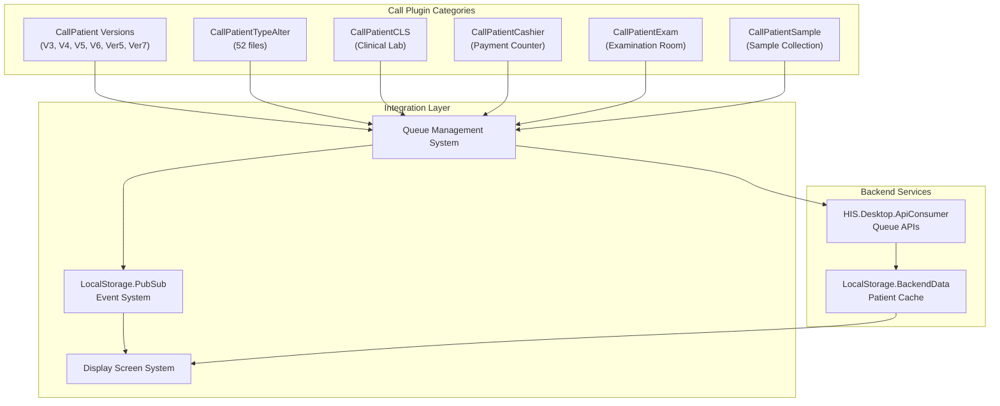
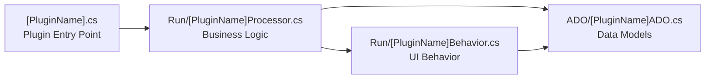
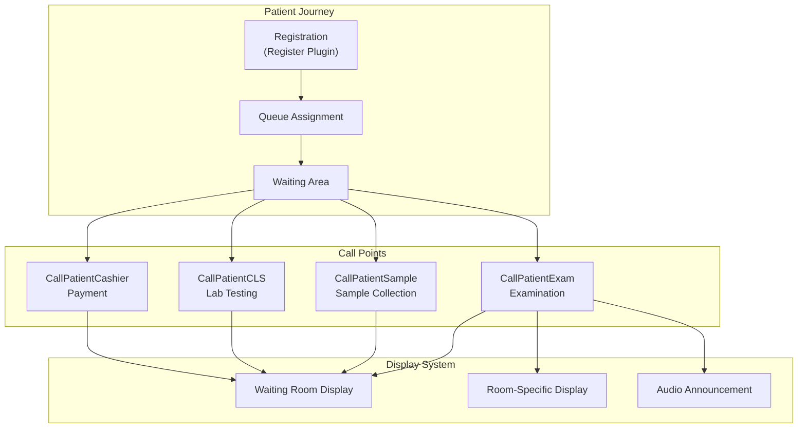
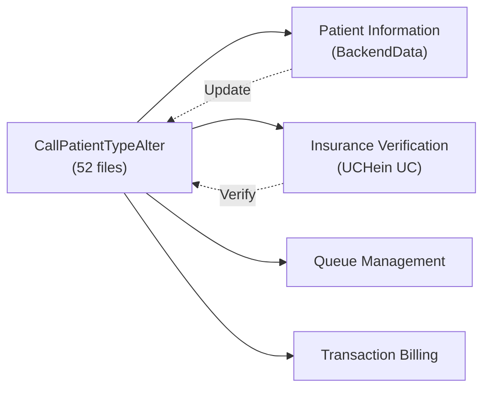
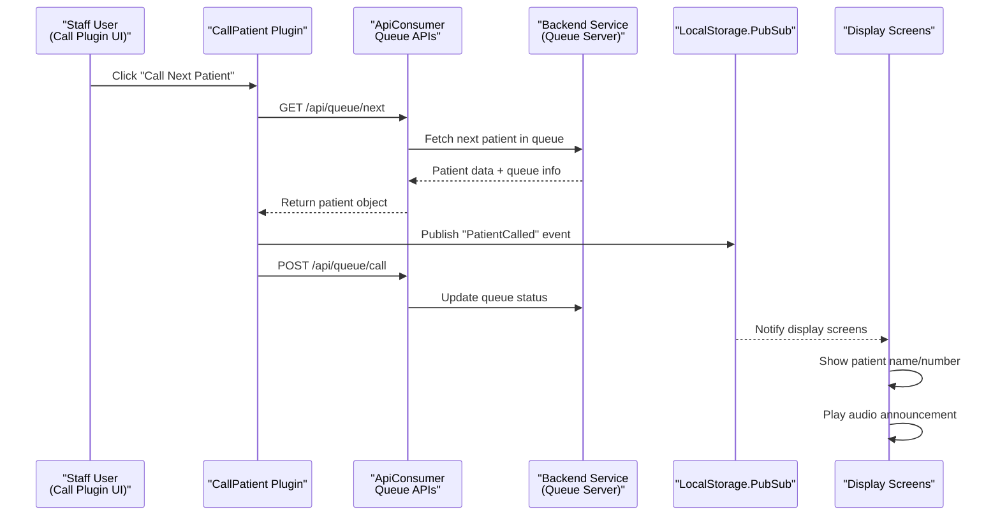
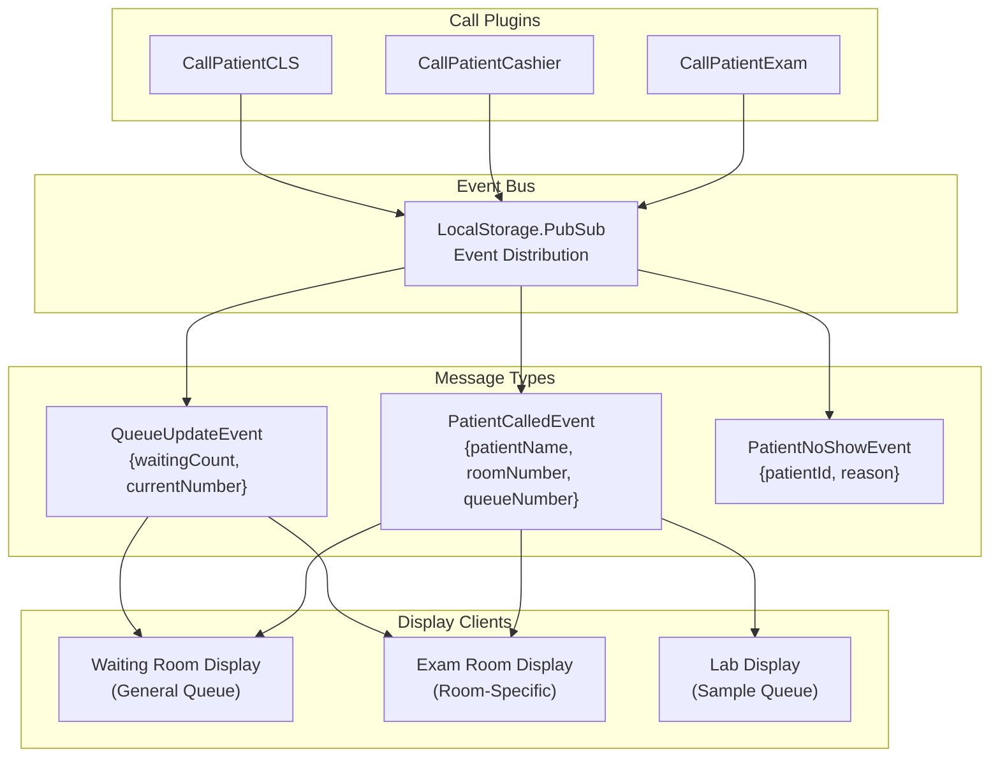
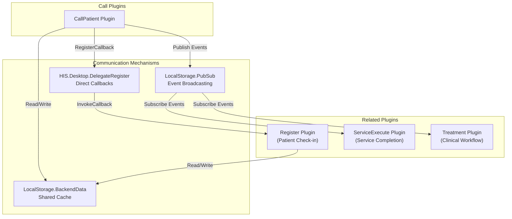
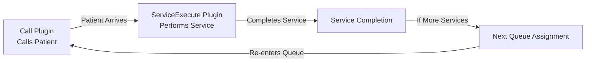

## Purpose and Scope

This document covers the patient call and display plugin subsystem within the HIS Desktop application. These plugins manage the queue system for calling patients to various service points (examination rooms, cashier counters, laboratory sample collection, etc.) and integrate with display screens to show patient information in waiting areas.

The plugins are located in [HIS/Plugins/]() under various `CallPatient*` prefixes. For information about other plugin categories, see [Plugin System Architecture](../../01-architecture/plugin-system.md). For service execution and room management, see [HIS Core Business Plugins](../../02-modules/his-desktop/business-plugins.md).

---

## Plugin Architecture Overview

The patient call system is implemented through multiple plugin variants, each serving specific use cases or representing different versions of the call system. The plugins follow the standard HIS plugin architecture pattern with entry points, ADO models, and UI components.



**Sources:** [HIS/Plugins/HIS.Desktop.Plugins.CallPatient*](), [`.devin/wiki.json:100-108`](../../../../.devin/wiki.json#L100-L108)

---

## CallPatient Plugin Versions

The system includes multiple versions of the `CallPatient` plugin, representing evolution of the call system functionality and potentially different implementations for different hospital configurations.

### Version Comparison

| Plugin Name | File Count | Primary Use Case |
|-------------|-----------|------------------|
| `CallPatientV3` | 24 files | Legacy implementation |
| `CallPatientV4` | 32 files | Enhanced queue integration |
| `CallPatientV5` | 26 files | Simplified interface |
| `CallPatientV6` | 26 files | Current stable version |
| `CallPatientVer5` | 39 files | Extended feature set |
| `CallPatientVer7` | 25 files | Latest version with modern UI |

### Version Architecture Pattern

Each version follows a consistent structure:



**Typical plugin structure:**
- Entry point: [`[PluginName].cs`](../../../[PluginName].cs) - implements plugin registration
- Processor: [`Run/[PluginName]Processor.cs`](../../../Run/[PluginName]Processor.cs) - handles call logic
- Behavior: [`Run/[PluginName]Behavior.cs`](../../../Run/[PluginName]Behavior.cs) - manages UI interactions
- ADO: [`ADO/*ADO.cs`](../../../ADO/*ADO.cs) - data transfer objects for patient queue data
- Base classes: `Base/` - shared infrastructure across versions

**Sources:** [HIS/Plugins/HIS.Desktop.Plugins.CallPatient*](), [`.devin/wiki.json:104-106`](../../../../.devin/wiki.json#L104-L106)

---

## Specialized Call Plugins

Beyond the general `CallPatient` versions, the system provides specialized plugins for specific service points:

### CallPatientCLS (Clinical Laboratory Service)

Handles patient calling for laboratory services including blood tests, urine tests, and other clinical diagnostics.

**Key responsibilities:**
- Queue management for sample collection rooms
- Integration with LIS (Laboratory Information System) plugins
- Display of test preparation instructions
- Sample barcode tracking

### CallPatientCashier (Payment Counter)

Manages patient calling at cashier/payment counters for billing and transaction processing.

**Key responsibilities:**
- Priority queue handling (emergency patients, elderly)
- Integration with transaction and billing plugins
- Display of outstanding balance information
- Multi-counter queue distribution

### CallPatientExam (Examination Room)

Controls patient flow into examination rooms and doctor consultation areas.

**Key responsibilities:**
- Room-specific queue management
- Doctor availability integration
- Patient preparation status checking
- Appointment schedule synchronization

### CallPatientSample (Sample Collection)

Specialized for phlebotomy and specimen collection areas.

**Key responsibilities:**
- Sample type-specific queuing
- Fasting status verification
- Sample collection tracking
- Integration with LIS sample workflow



**Sources:** [HIS/Plugins/HIS.Desktop.Plugins.CallPatientCLS](), [HIS/Plugins/HIS.Desktop.Plugins.CallPatientCashier](), [HIS/Plugins/HIS.Desktop.Plugins.CallPatientExam](), [HIS/Plugins/HIS.Desktop.Plugins.CallPatientSample]()

---

## CallPatientTypeAlter Plugin

The `CallPatientTypeAlter` plugin (52 files) is a specialized component for managing changes to patient type during their visit. This is the largest plugin in the call system category.

**Primary functions:**
- Modify patient classification (e.g., from regular to emergency)
- Update insurance status during visit
- Change service package assignments
- Adjust queue priority based on new patient type
- Trigger re-calculation of fees and billing

**Integration points:**


**Common patient type transitions:**
- Regular → Emergency (priority escalation)
- Self-pay → Insurance (insurance card discovered)
- Outpatient → Inpatient (admission required)
- Regular → VIP (service upgrade)

**Sources:** [HIS/Plugins/HIS.Desktop.Plugins.CallPatientTypeAlter](), [`.devin/wiki.json:104-106`](../../../../.devin/wiki.json#L104-L106)

---

## Queue Management Integration

The call plugins integrate with a queue management system that coordinates patient flow across the hospital.

### Queue Data Flow



### Queue State Management

The plugins maintain queue state through:

- **LocalStorage.BackendData**: Cached queue data for offline capability
- **PubSub events**: Real-time synchronization across workstations
- **ApiConsumer calls**: Persistent queue state on backend
- **Local queue models**: ADO objects for in-memory queue management

**Key queue operations:**
```
- FetchQueueList(): Get all waiting patients
- CallNextPatient(): Pop next from queue and notify
- CallSpecificPatient(patientId): Call patient out of order
- RecallPatient(patientId): Recall missed patient
- TransferPatient(patientId, newRoom): Move to different queue
- SetPatientNoShow(patientId): Mark as absent
```

**Sources:** [HIS.Desktop.ApiConsumer](), [HIS.Desktop.LocalStorage.PubSub](), [HIS.Desktop.LocalStorage.BackendData]()

---

## Display System Integration

Call plugins communicate with display screens in waiting areas to show patient information and call notifications.

### Display Communication Architecture



### Display Message Format

The plugins publish structured events via the PubSub system:

**PatientCalledEvent:**
- `PatientName`: Patient display name (with privacy masking)
- `QueueNumber`: Current queue number being called
- `RoomNumber`: Destination room/counter
- `ServiceType`: Type of service (exam, payment, lab, etc.)
- `Timestamp`: Call time for tracking

**QueueUpdateEvent:**
- `WaitingCount`: Number of patients still waiting
- `CurrentNumber`: Currently serving queue number
- `EstimatedWaitMinutes`: Calculated wait time

**Sources:** [HIS.Desktop.LocalStorage.PubSub](), [HIS/Plugins/HIS.Desktop.Plugins.CallPatient*]()

---

## Plugin Communication Patterns

Call plugins use multiple communication mechanisms to coordinate with other system components.

### Inter-Plugin Communication



### Event Subscription Pattern

Call plugins typically subscribe to:

- **PatientRegistered**: New patient enters queue
- **ServiceCompleted**: Patient ready for next step
- **TreatmentStarted**: Patient called successfully
- **RoomAvailable**: Service point ready for next patient
- **StaffLogout**: Queue reassignment needed

Call plugins typically publish:

- **PatientCalled**: Patient notification sent
- **PatientNoShow**: Patient did not respond to call
- **QueueUpdated**: Queue state changed
- **RoomBusy**: Service point occupied

**Sources:** [HIS.Desktop.DelegateRegister](), [HIS.Desktop.LocalStorage.PubSub]()

---

## Data Models and ADO Objects

Call plugins use ADO (Active Data Objects) to structure patient queue data.

### Common ADO Objects

**QueuePatientADO:**
- `PatientId`: Unique patient identifier
- `PatientCode`: Display patient code
- `PatientName`: Full name
- `QueueNumber`: Assigned queue number
- `ServiceType`: Type of service requested
- `RoomId`: Target room/counter
- `PriorityLevel`: Queue priority (0=normal, 1=priority, 2=emergency)
- `CheckInTime`: Queue entry timestamp
- `CallTime`: When patient was called (null if not yet called)
- `Status`: Queue status (waiting/called/in-service/completed/no-show)

**CallHistoryADO:**
- `CallId`: Unique call record identifier
- `PatientId`: Called patient
- `StaffId`: Staff who initiated call
- `RoomId`: Destination room
- `CallTimestamp`: When call was made
- `ResponseTime`: Patient arrival time at room
- `CallMethod`: Manual/automatic/recall

**RoomQueueADO:**
- `RoomId`: Room/counter identifier
- `RoomName`: Display name
- `ServiceType`: Service category
- `CurrentPatient`: Patient currently being served
- `WaitingCount`: Patients in queue
- `StaffOnDuty`: Current staff assigned
- `Status`: Room status (available/busy/closed)

### Data Validation and Business Rules

Plugins enforce business rules when processing queue operations:

- Priority patients (elderly, disabled, emergency) moved to front of queue
- Insurance verification status affects queue placement
- Time-based auto-reassignment for no-show patients
- Maximum wait time alerts for queue management
- Concurrent call prevention (same patient to multiple rooms)

**Sources:** [HIS.Desktop.ADO](), [HIS/Plugins/HIS.Desktop.Plugins.CallPatient*/ADO]()

---

## Configuration and Customization

Call plugins support configuration through the HIS configuration system.

### Configuration Keys

Common configuration parameters accessed via `HIS.Desktop.LocalStorage.HisConfig`:

- `QUEUE_AUTO_CALL_INTERVAL`: Seconds between automatic calls
- `QUEUE_RECALL_TIMEOUT`: Minutes before patient marked no-show
- `QUEUE_DISPLAY_PATIENT_NAME`: Privacy setting for full name display
- `QUEUE_AUDIO_ENABLE`: Enable/disable audio announcements
- `QUEUE_PRIORITY_RULES`: JSON configuration for priority algorithms
- `CALL_PATIENT_VERSION`: Which CallPatient plugin version to load

### Multi-Version Deployment

Hospitals can deploy different CallPatient versions for different departments:

- Outpatient clinics: `CallPatientV6` (standard interface)
- Emergency department: `CallPatientVer7` (enhanced priority handling)
- Laboratory: `CallPatientCLS` (specimen-specific features)
- Pharmacy: `CallPatientCashier` (integrated with dispensing)

Version selection is configured per workstation or per room through `LocalStorage.ConfigApplication`.

**Sources:** [HIS.Desktop.LocalStorage.HisConfig](), [HIS.Desktop.LocalStorage.ConfigApplication]()

---

## Integration with Related Systems

### Service Execution Integration



When a patient is called and arrives at the service point:

1. Call plugin updates queue status to "in-service"
2. ServiceExecute plugin (see [HIS Core Business Plugins](../../02-modules/his-desktop/business-plugins.md)) takes over
3. Upon completion, patient may enter new queue for next service
4. Call plugin notified via PubSub to update display

### Registration Integration

The patient registration process (Register plugins) creates initial queue entries:

1. Patient registered at front desk
2. Services assigned (examination, lab tests, etc.)
3. Queue entries created for each service
4. Call plugins receive queue data via BackendData cache
5. Patient appears in waiting list for each service point

**Sources:** [HIS/Plugins/HIS.Desktop.Plugins.ServiceExecute](), [HIS/Plugins/HIS.Desktop.Plugins.Register]()

---

## Summary

The Patient Call & Display plugin subsystem provides a comprehensive queue management solution with:

- **Multiple plugin versions** (V3-V7) for different hospital needs and configurations
- **Specialized plugins** for specific service points (exam, cashier, lab, sample collection)
- **CallPatientTypeAlter** for dynamic patient type modifications during visits
- **Event-based architecture** using PubSub for real-time synchronization
- **Display system integration** for waiting area screens and audio announcements
- **Flexible configuration** supporting multi-version deployments

The plugins integrate seamlessly with other HIS subsystems through `DelegateRegister`, `PubSub`, and shared `BackendData` caching, enabling coordinated patient flow management across the entire hospital.

**Sources:** [HIS/Plugins/HIS.Desktop.Plugins.CallPatient*](), [`.devin/wiki.json:100-108`](../../../../.devin/wiki.json#L100-L108)