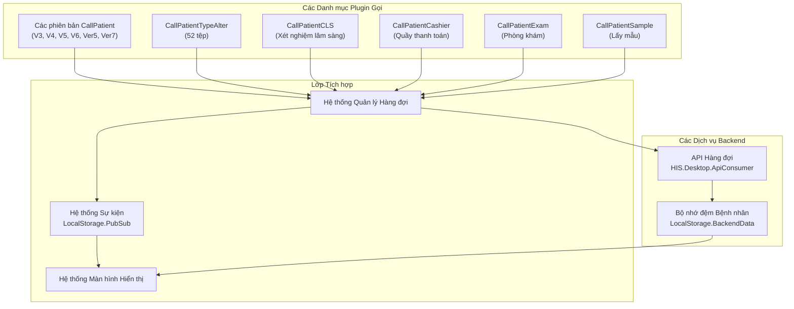
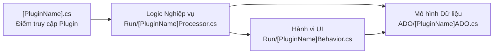
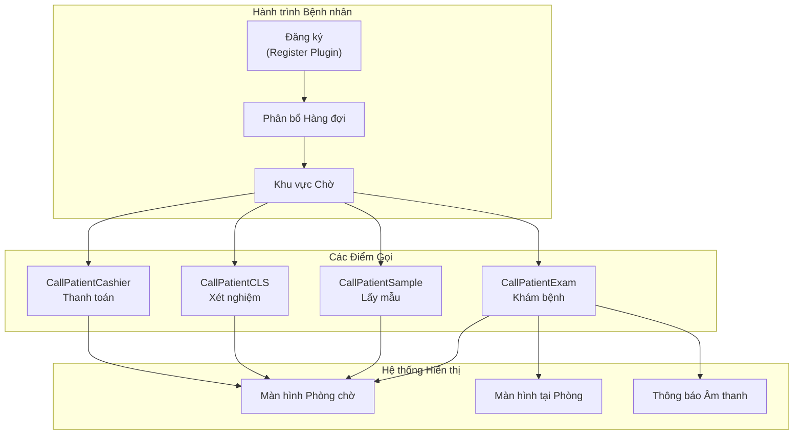
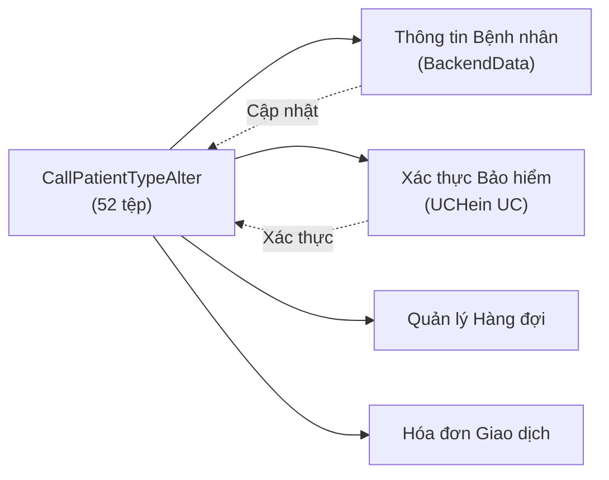
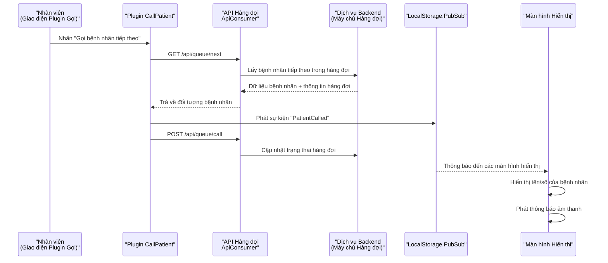
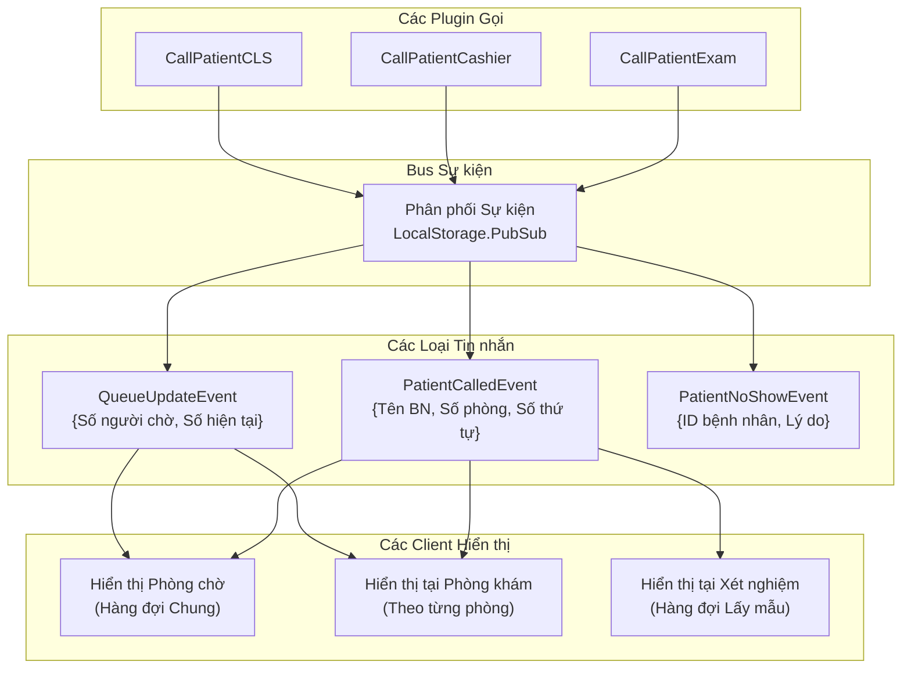
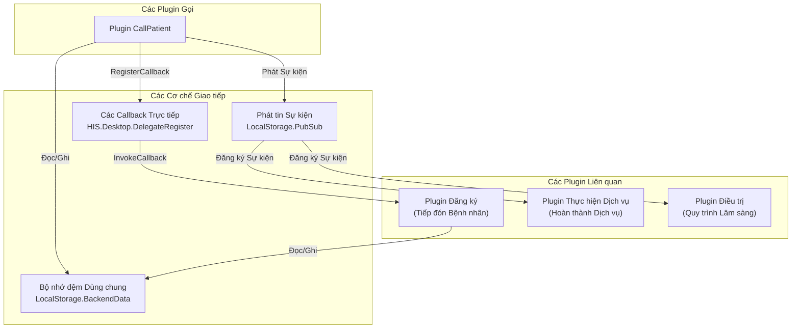

## Mục đích và Phạm vi

Tài liệu này trình bày về phân hệ plugin gọi bệnh nhân và hiển thị trong ứng dụng HIS Desktop. Các plugin này quản lý hệ thống hàng đợi để gọi bệnh nhân đến các điểm dịch vụ khác nhau (phòng khám, quầy thu ngân, nơi lấy mẫu xét nghiệm, v.v.) và tích hợp với các màn hình hiển thị để cho biết thông tin bệnh nhân tại các khu vực chờ.

Các plugin nằm trong thư mục [HIS/Plugins/]() với các tiền tố `CallPatient*` khác nhau. Để biết thông tin về các danh mục plugin khác, xem [Kiến trúc Hệ thống Plugin](../../01-architecture/plugin-system/01-overview.md). Để biết về việc thực hiện dịch vụ và quản lý phòng, xem [Các Plugin Nghiệp vụ Cốt lõi của HIS](../../02-modules/his-desktop/business-plugins.md).

---

## Tổng quan Kiến trúc Plugin

Hệ thống gọi bệnh nhân được triển khai thông qua nhiều biến thể plugin, mỗi biến thể phục vụ các trường hợp sử dụng cụ thể hoặc đại diện cho các phiên bản khác nhau của hệ thống gọi. Các plugin tuân theo mẫu kiến trúc plugin chuẩn của HIS với các điểm truy cập (entry point), mô hình ADO và các thành phần giao diện người dùng (UI).



**Nguồn:** [HIS/Plugins/HIS.Desktop.Plugins.CallPatient*](), [`.devin/wiki.json:100-108`](../../../../.devin/wiki.json#L100-L108)

---

## Các Phiên bản Plugin CallPatient

Hệ thống bao gồm nhiều phiên bản của plugin `CallPatient`, đại diện cho sự phát triển của các chức năng hệ thống gọi và có thể là các cách triển khai khác nhau cho các cấu hình bệnh viện khác nhau.

### So sánh các Phiên bản

| Tên Plugin | Số lượng Tệp | Trường hợp Sử dụng Chính |
|-------------|-----------|------------------|
| `CallPatientV3` | 24 tệp | Triển khai cũ (Legacy) |
| `CallPatientV4` | 32 tệp | Tích hợp hàng đợi nâng cao |
| `CallPatientV5` | 26 tệp | Giao diện đơn giản hóa |
| `CallPatientV6` | 26 tệp | Phiên bản ổn định hiện tại |
| `CallPatientVer5` | 39 tệp | Tập hợp tính năng mở rộng |
| `CallPatientVer7` | 25 tệp | Phiên bản mới nhất với UI hiện đại |

### Mẫu Kiến trúc Phiên bản

Mỗi phiên bản đều tuân theo một cấu trúc nhất quán:



**Cấu trúc plugin điển hình:**
- Điểm truy cập: [`[PluginName].cs`](../../../[PluginName].cs) - thực hiện đăng ký plugin
- Bộ xử lý (Processor): [`Run/[PluginName]Processor.cs`](../../../Run/[PluginName]Processor.cs) - xử lý logic gọi
- Hành vi (Behavior): [`Run/[PluginName]Behavior.cs`](../../../Run/[PluginName]Behavior.cs) - quản lý các tương tác UI
- ADO: [`ADO/*ADO.cs`](../../../ADO/*ADO.cs) - các đối tượng chuyển đổi dữ liệu cho dữ liệu hàng đợi bệnh nhân
- Các lớp cơ sở (Base classes): `Base/` - hạ tầng dùng chung giữa các phiên bản

**Nguồn:** [HIS/Plugins/HIS.Desktop.Plugins.CallPatient*](), [`.devin/wiki.json:104-106`](../../../../.devin/wiki.json#L104-L106)

---

## Các Plugin Gọi Chuyên biệt

Ngoài các phiên bản `CallPatient` chung, hệ thống cung cấp các plugin chuyên biệt cho các điểm dịch vụ cụ thể:

### CallPatientCLS (Dịch vụ Xét nghiệm Cận lâm sàng)

Xử lý việc gọi bệnh nhân cho các dịch vụ xét nghiệm bao gồm xét nghiệm máu, xét nghiệm nước tiểu và các chẩn đoán cận lâm sàng khác.

**Các nhiệm vụ chính:**
- Quản lý hàng đợi cho các phòng lấy mẫu
- Tích hợp với các plugin LIS (Laboratory Information System - Hệ thống thông tin phòng xét nghiệm)
- Hiển thị các hướng dẫn chuẩn bị xét nghiệm
- Theo dõi mã vạch mẫu xét nghiệm

### CallPatientCashier (Quầy Thu ngân)

Quản lý việc gọi bệnh nhân tại các quầy thu ngân/thanh toán để xử lý hóa đơn và giao dịch.

**Các nhiệm vụ chính:**
- Xử lý hàng đợi ưu tiên (bệnh nhân cấp cứu, người già)
- Tích hợp với các plugin giao dịch và lập hóa đơn
- Hiển thị thông tin số dư còn thiếu
- Phân bổ hàng đợi đa quầy

### CallPatientExam (Phòng khám)

Kiểm soát luồng bệnh nhân vào các phòng khám và khu vực tư vấn của bác sĩ.

**Các nhiệm vụ chính:**
- Quản lý hàng đợi theo từng phòng cụ thể
- Tích hợp tình trạng sẵn sàng của bác sĩ
- Kiểm tra trạng thái chuẩn bị của bệnh nhân
- Đồng bộ hóa lịch hẹn

### CallPatientSample (Lấy mẫu)

Chuyên dụng cho các khu vực lấy máu và lấy bệnh phẩm.

**Các nhiệm vụ chính:**
- Xếp hàng theo từng loại mẫu cụ thể
- Xác minh tình trạng nhịn ăn
- Theo dõi việc thu thập mẫu
- Tích hợp với quy trình làm việc của mẫu LIS



**Nguồn:** [HIS/Plugins/HIS.Desktop.Plugins.CallPatientCLS](), [HIS/Plugins/HIS.Desktop.Plugins.CallPatientCashier](), [HIS/Plugins/HIS.Desktop.Plugins.CallPatientExam](), [HIS/Plugins/HIS.Desktop.Plugins.CallPatientSample]()

---

## Plugin CallPatientTypeAlter

Plugin `CallPatientTypeAlter` (52 tệp) là một thành phần chuyên biệt để quản lý việc thay đổi đối tượng bệnh nhân trong quá trình thăm khám. Đây là plugin lớn nhất trong danh mục hệ thống gọi.

**Các chức năng chính:**
- Thay đổi phân loại bệnh nhân (ví dụ: từ thường sang cấp cứu)
- Cập nhật tình trạng bảo hiểm trong quá trình khám
- Thay đổi gói dịch vụ được chỉ định
- Điều chỉnh ưu tiên hàng đợi dựa trên đối tượng bệnh nhân mới
- Kích hoạt việc tính toán lại phí và hóa đơn

**Các điểm tích hợp:**


**Các chuyển đổi đối tượng bệnh nhân phổ biến:**
- Thường → Cấp cứu (nâng cấp mức độ ưu tiên)
- Tự trả → Bảo hiểm (khi tìm thấy thẻ bảo hiểm)
- Ngoại trú → Nội trú (khi có chỉ định nhập viện)
- Thường → VIP (nâng cấp dịch vụ)

**Nguồn:** [HIS/Plugins/HIS.Desktop.Plugins.CallPatientTypeAlter](), [`.devin/wiki.json:104-106`](../../../../.devin/wiki.json#L104-L106)

---

## Tích hợp Quản lý Hàng đợi

Các plugin gọi tích hợp với hệ thống quản lý hàng đợi để điều phối luồng bệnh nhân trong toàn bệnh viện.

### Luồng Dữ liệu Hàng đợi



### Quản lý Trạng thái Hàng đợi

Các plugin duy trì trạng thái hàng đợi thông qua:

- **LocalStorage.BackendData**: Dữ liệu hàng đợi được lưu đệm để có thể hoạt động ngoại tuyến
- **Các sự kiện PubSub**: Đồng bộ hóa thời gian thực giữa các máy trạm
- **Các lệnh gọi ApiConsumer**: Trạng thái hàng đợi bền vững trên backend
- **Các mô hình hàng đợi tại địa phương**: Các đối tượng ADO để quản lý hàng đợi trong bộ nhớ

**Các thao tác hàng đợi chính:**
```
- FetchQueueList(): Lấy danh sách tất cả bệnh nhân đang chờ
- CallNextPatient(): Lấy người tiếp theo từ hàng đợi và thông báo
- CallSpecificPatient(patientId): Gọi một bệnh nhân cụ thể không theo thứ tự
- RecallPatient(patientId): Gọi lại bệnh nhân đã lỡ lượt
- TransferPatient(patientId, newRoom): Chuyển đến một hàng đợi khác
- SetPatientNoShow(patientId): Đánh dấu bệnh nhân vắng mặt
```

**Nguồn:** [HIS.Desktop.ApiConsumer](), [HIS.Desktop.LocalStorage.PubSub](), [HIS.Desktop.LocalStorage.BackendData]()

---

## Tích hợp Hệ thống Hiển thị

Các plugin gọi giao tiếp với các màn hình hiển thị tại các khu vực chờ để cung cấp thông tin cho bệnh nhân và các thông báo gọi số.

### Kiến trúc Giao tiếp Hiển thị



### Định dạng Tin nhắn Hiển thị

Các plugin phát các sự kiện có cấu trúc thông qua hệ thống PubSub:

**PatientCalledEvent (Sự kiện Gọi Bệnh nhân):**
- `PatientName`: Tên hiển thị của bệnh nhân (có che thông tin nhạy cảm)
- `QueueNumber`: Số thứ tự hiện đang được gọi
- `RoomNumber`: Phòng hoặc quầy đích
- `ServiceType`: Loại dịch vụ (khám, thanh toán, xét nghiệm, v.v.)
- `Timestamp`: Thời điểm gọi để theo dõi

**QueueUpdateEvent (Sự kiện Cập nhật Hàng đợi):**
- `WaitingCount`: Số lượng bệnh nhân vẫn đang chờ
- `CurrentNumber`: Số thứ tự hiện đang được phục vụ
- `EstimatedWaitMinutes`: Thời gian chờ dự kiến đã được tính toán

**Nguồn:** [HIS.Desktop.LocalStorage.PubSub](), [HIS/Plugins/HIS.Desktop.Plugins.CallPatient*]()

---

## Các Mẫu Giao tiếp của Plugin

Các plugin gọi sử dụng nhiều cơ chế giao tiếp để điều phối với các thành phần hệ thống khác.

### Giao tiếp Giữa các Plugin



### Mẫu Đăng ký Sự kiện

Các plugin gọi thường đăng ký các sự kiện:

- **PatientRegistered**: Bệnh nhân mới vào hàng đợi
- **ServiceCompleted**: Bệnh nhân đã sẵn sàng cho bước tiếp theo
- **TreatmentStarted**: Bệnh nhân đã được gọi thành công
- **RoomAvailable**: Điểm dịch vụ đã sẵn sàng cho bệnh nhân tiếp theo
- **StaffLogout**: Cần phân bổ lại hàng đợi

Các plugin gọi thường phát các sự kiện:

- **PatientCalled**: Thông báo gọi bệnh nhân đã được gửi
- **PatientNoShow**: Bệnh nhân không phản hồi khi gọi
- **QueueUpdated**: Trạng thái hàng đợi đã thay đổi
- **RoomBusy**: Điểm dịch vụ đang bận

**Nguồn:** [HIS.Desktop.DelegateRegister](), [HIS.Desktop.LocalStorage.PubSub]()

---

## Mô hình Dữ liệu và các Đối tượng ADO

Các plugin gọi sử dụng ADO (Active Data Objects) để cấu trúc dữ liệu hàng đợi bệnh nhân.

### Các Đối tượng ADO Chung

**QueuePatientADO:**
- `PatientId`: Định danh duy nhất của bệnh nhân
- `PatientCode`: Mã bệnh nhân hiển thị
- `PatientName`: Họ và tên
- `QueueNumber`: Số thứ tự được cấp
- `ServiceType`: Loại dịch vụ được yêu cầu
- `RoomId`: Phòng hoặc quầy đích
- `PriorityLevel`: Mức độ ưu tiên hàng đợi (0=thường, 1=ưu tiên, 2=cấp cứu)
- `CheckInTime`: Dấu thời gian vào hàng đợi
- `CallTime`: Thời điểm bệnh nhân được gọi (null nếu chưa được gọi)
- `Status`: Trạng thái hàng đợi (đang chờ/đã gọi/đang phục vụ/đã hoàn thành/vắng mặt)

**CallHistoryADO:**
- `CallId`: Định danh duy nhất của bản ghi cuộc gọi
- `PatientId`: Bệnh nhân được gọi
- `StaffId`: Nhân viên thực hiện cuộc gọi
- `RoomId`: Phòng đích
- `CallTimestamp`: Thời điểm cuộc gọi được thực hiện
- `ResponseTime`: Thời điểm bệnh nhân đến phòng
- `CallMethod`: Thủ công/tự động/gọi lại

**RoomQueueADO:**
- `RoomId`: Định danh phòng hoặc quầy
- `RoomName`: Tên hiển thị
- `ServiceType`: Danh mục dịch vụ
- `CurrentPatient`: Bệnh nhân hiện đang được phục vụ
- `WaitingCount`: Số lượng bệnh nhân trong hàng đợi
- `StaffOnDuty`: Nhân viên hiện đang được phân công
- `Status`: Trạng thái phòng (sẵn sàng/đang bận/đã đóng)

### Kiểm tra Dữ liệu và Quy tắc Nghiệp vụ

Các plugin thực thi các quy tắc nghiệp vụ khi xử lý các thao tác hàng đợi:

- Bệnh nhân ưu tiên (người già, người khuyết tật, cấp cứu) được chuyển lên đầu hàng đợi
- Trạng thái xác thực bảo hiểm ảnh hưởng đến việc xếp hàng
- Tự động phân bổ lại dựa trên thời gian cho bệnh nhân vắng mặt (no-show)
- Cảnh báo thời gian chờ tối đa để quản lý hàng đợi
- Ngăn chặn gọi đồng thời (cùng một bệnh nhân đến nhiều phòng khác nhau)

**Nguồn:** [HIS.Desktop.ADO](), [HIS/Plugins/HIS.Desktop.Plugins.CallPatient*/ADO]()

---

## Cấu hình và Tùy chỉnh

Các plugin gọi hỗ trợ cấu hình thông qua hệ thống cấu hình của HIS.

### Các Khóa Cấu hình

Các tham số cấu hình chung được truy cập thông qua `HIS.Desktop.LocalStorage.HisConfig`:

- `QUEUE_AUTO_CALL_INTERVAL`: Số giây giữa các lần gọi tự động
- `QUEUE_RECALL_TIMEOUT`: Số phút trước khi bệnh nhân được đánh dấu là vắng mặt (no-show)
- `QUEUE_DISPLAY_PATIENT_NAME`: Thiết đặt quyền riêng tư cho việc hiển thị đầy đủ họ tên
- `QUEUE_AUDIO_ENABLE`: Bật/Tắt thông báo âm thanh
- `QUEUE_PRIORITY_RULES`: Cấu hình JSON cho các thuật toán ưu tiên
- `CALL_PATIENT_VERSION`: Phiên bản plugin CallPatient nào sẽ được tải

### Triển khai Đa phiên bản

Các bệnh viện có thể triển khai các phiên bản CallPatient khác nhau cho các khoa phòng khác nhau:

- Phòng khám ngoại trú: `CallPatientV6` (giao diện tiêu chuẩn)
- Khoa cấp cứu: `CallPatientVer7` (nâng cao khả năng xử lý ưu tiên)
- Phòng xét nghiệm: `CallPatientCLS` (các tính năng dành riêng cho bệnh phẩm)
- Nhà thuốc: `CallPatientCashier` (tích hợp với việc phát thuốc)

Việc lựa chọn phiên bản được cấu hình theo từng máy trạm hoặc theo từng phòng thông qua `LocalStorage.ConfigApplication`.

**Nguồn:** [HIS.Desktop.LocalStorage.HisConfig](), [HIS.Desktop.LocalStorage.ConfigApplication]()

---

## Tích hợp với các Hệ thống Liên quan

### Tích hợp Thực hiện Dịch vụ


Khi một bệnh nhân được gọi và đến điểm dịch vụ:

1. Plugin gọi cập nhật trạng thái hàng đợi thành "đang phục vụ" (in-service)
2. Plugin ServiceExecute (xem [Các Plugin Nghiệp vụ Cốt lõi của HIS](../../02-modules/his-desktop/business-plugins.md)) tiếp quản
3. Sau khi hoàn thành, bệnh nhân có thể vào hàng đợi mới cho dịch vụ tiếp theo
4. Plugin gọi được thông báo thông qua PubSub để cập nhật màn hình hiển thị

### Tích hợp Đăng ký

Quá trình đăng ký bệnh nhân (các plugin Đăng ký) tạo ra các mục hàng đợi ban đầu:

1. Bệnh nhân được đăng ký tại quầy tiếp đón
2. Các dịch vụ được chỉ định (khám bệnh, xét nghiệm, v.v.)
3. Các mục hàng đợi được tạo cho mỗi dịch vụ
4. Các plugin gọi nhận dữ liệu hàng đợi thông qua bộ nhớ đệm BackendData
5. Bệnh nhân xuất hiện trong danh sách chờ tại mỗi điểm dịch vụ

**Nguồn:** [HIS/Plugins/HIS.Desktop.Plugins.ServiceExecute](), [HIS/Plugins/HIS.Desktop.Plugins.Register]()

---

## Tóm tắt

Phân hệ plugin Gọi Bệnh nhân & Hiển thị cung cấp một giải pháp quản lý hàng đợi toàn diện với:

- **Nhiều phiên bản plugin** (V3-V7) cho các nhu cầu và cấu hình bệnh viện khác nhau
- **Các plugin chuyên biệt** cho các điểm dịch vụ cụ thể (phòng khám, thu ngân, xét nghiệm, lấy mẫu)
- **CallPatientTypeAlter** để thay đổi đối tượng bệnh nhân linh hoạt trong quá trình thăm khám
- **Kiến trúc dựa trên sự kiện** sử dụng PubSub để đồng bộ hóa thời gian thực
- **Tích hợp hệ thống hiển thị** cho các màn hình khu vực chờ và thông báo âm thanh
- **Cấu hình linh hoạt** hỗ trợ triển khai đa phiên bản

Các plugin tích hợp liền mạch với các phân hệ khác của HIS thông qua `DelegateRegister`, `PubSub` và bộ nhớ đệm `BackendData` dùng chung, cho phép quản lý luồng bệnh nhân có sự phối hợp trong toàn bộ bệnh viện.

**Nguồn:** [HIS/Plugins/HIS.Desktop.Plugins.CallPatient*](), [`.devin/wiki.json:100-108`](../../../../.devin/wiki.json#L100-L108)