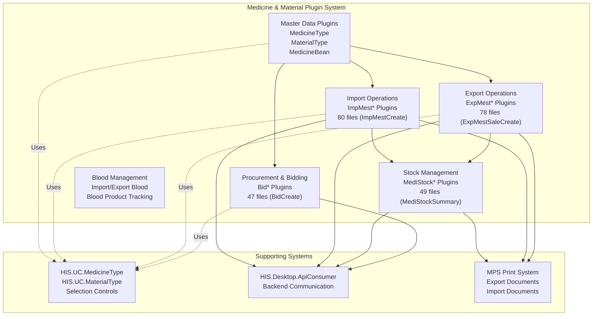
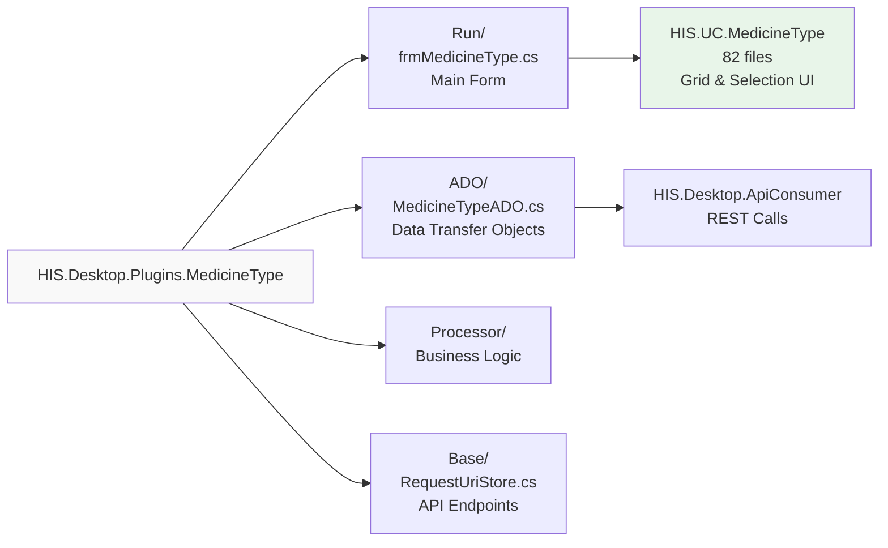
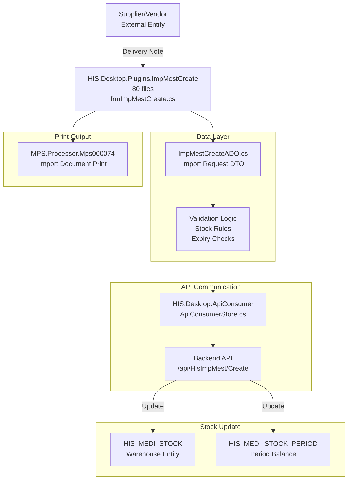
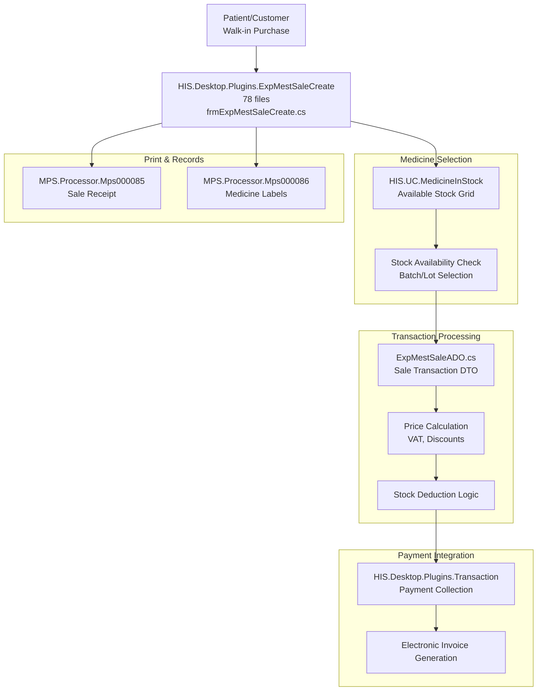
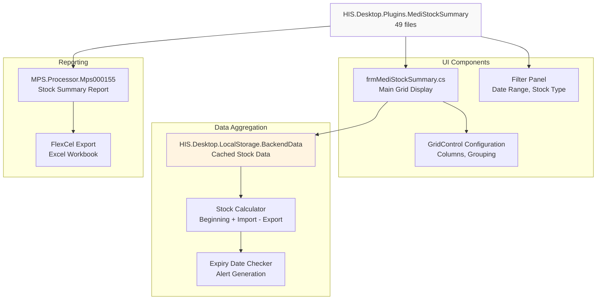
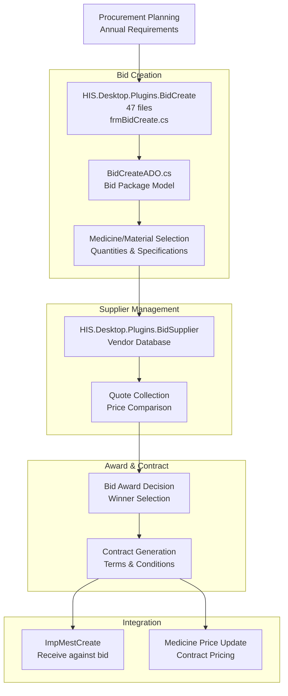
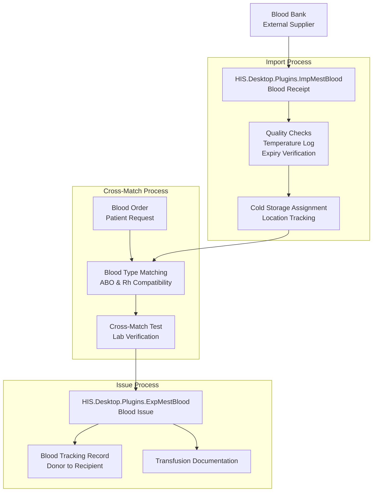
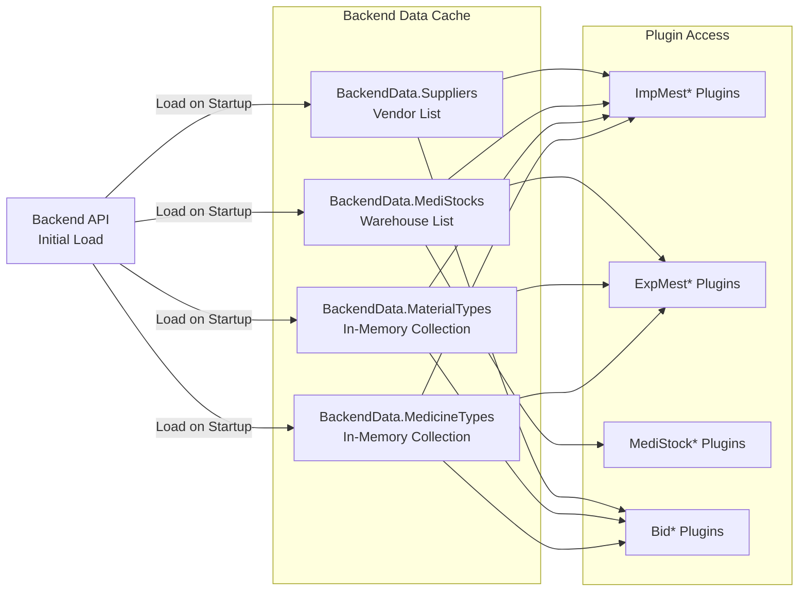

## Purpose and Scope

This document covers the plugins responsible for medicine and material management in the HIS system, located in `HIS/Plugins/`. These plugins handle pharmaceutical inventory operations including medicine type definitions, warehouse import/export transactions, stock management, procurement/bidding processes, and blood product operations.

This page focuses on inventory and pharmacy-related plugins. For prescription and medication administration workflows, see [HIS Core Business Plugins](../../02-modules/his-desktop/business-plugins.md). For billing and payment of medicine sales, see [Transaction & Billing Plugins](../../02-modules/his-desktop/business-plugins.md#transaction-billing). For reusable UI components related to medicine selection, see [Medicine & ICD UCs](#1.3.3).

## Plugin Categories Overview

The medicine and material management subsystem consists of approximately 40+ plugins organized into six functional categories:



**Sources:** [`.devin/wiki.json:90-97`](../../../../.devin/wiki.json#L90-L97)

## Master Data Management Plugins

These plugins manage the fundamental definitions of medicines and materials in the system:

| Plugin Name | File Count | Primary Function | Key Features |
|-------------|-----------|------------------|--------------|
| `MedicineType` | ~40-50 | Medicine catalog management | Type definitions, dosage forms, active ingredients |
| `MaterialType` | ~40-50 | Medical material catalog | Equipment, supplies, consumables |
| `MedicineBean` | ~30-40 | Medicine packaging units | Conversion ratios, packaging hierarchies |
| `MedicinePaty` | ~25-35 | Medicine patient type pricing | Patient type-specific pricing rules |
| `ActiveIngredient` | ~20-30 | Drug ingredient management | Active ingredient tracking |

### Medicine Type Structure



**Sources:** [`.devin/wiki.json:225-232`](../../../../.devin/wiki.json#L225-L232, high-level architecture diagrams

## Warehouse Import Operations (ImpMest*)

Import operations handle receiving medicines and materials into warehouse inventory. The `ImpMest*` plugin family manages various import scenarios:

### Major Import Plugins

| Plugin Name | Files | Purpose | Workflow Type |
|-------------|-------|---------|---------------|
| `ImpMestCreate` | 80 | General warehouse import | Purchase orders, donations, transfers |
| `ImpMestEdit` | ~50-60 | Modify import records | Edit quantities, expiry dates |
| `ImpMestView` | ~40-50 | View import history | Search, filter, detail view |
| `ImpMestApproval` | ~35-45 | Import approval workflow | Multi-level approval |
| `ImpMestDeduct` | ~30-40 | Import deductions | Damaged goods, returns |

### ImpMest Data Flow



### ImpMestCreate Plugin Structure

The `ImpMestCreate` plugin follows the standard plugin architecture with 80 files:

- `HIS.Desktop.Plugins.ImpMestCreate.Run/` - Main form implementation
  - [[`frmImpMestCreate.cs`](../../../frmImpMestCreate.cs)](../../../frmImpMestCreate.cs) - Primary UI form
  - [[`frmImpMestCreate.Designer.cs`](../../../frmImpMestCreate.Designer.cs)](../../../frmImpMestCreate.Designer.cs) - UI designer file
  - Grid configuration and event handlers
- `HIS.Desktop.Plugins.ImpMestCreate.ADO/` - Data objects
  - [[`ImpMestCreateADO.cs`](../../../ImpMestCreateADO.cs)](../../../ImpMestCreateADO.cs) - Import request model
  - [[`MedicineImportADO.cs`](../../../MedicineImportADO.cs)](../../../MedicineImportADO.cs) - Medicine line items
  - [[`MaterialImportADO.cs`](../../../MaterialImportADO.cs)](../../../MaterialImportADO.cs) - Material line items
- `HIS.Desktop.Plugins.ImpMestCreate.Processor/` - Business logic
  - Validation processors
  - Calculation logic (quantities, prices)
- `HIS.Desktop.Plugins.ImpMestCreate.Base/` - Configuration
  - [[`RequestUriStore.cs`](../../../RequestUriStore.cs)](../../../RequestUriStore.cs) - API endpoint definitions
  - [[`ResourceLangManager.cs`](../../../ResourceLangManager.cs)](../../../ResourceLangManager.cs) - Localization keys

**Sources:** [`.devin/wiki.json:90-97`](../../../../.devin/wiki.json#L90-L97)

## Warehouse Export Operations (ExpMest*)

Export operations handle dispensing medicines and materials from warehouse inventory. The `ExpMest*` plugin family manages various export scenarios:

### Major Export Plugins

| Plugin Name | Files | Purpose | Workflow Type |
|-------------|-------|---------|---------------|
| `ExpMestSaleCreate` | 78 | Direct pharmacy sales | Over-the-counter sales |
| `ExpMestDepaCreate` | ~60-70 | Department requisitions | Ward/department stock requests |
| `ExpMestChmsCreate` | ~55-65 | Consumables export | Medical supplies, equipment |
| `ExpMestActualCreate` | ~50-60 | Actual dispensing | Fulfill prescriptions |
| `ExpMestEdit` | ~45-55 | Modify export records | Quantity adjustments |

### ExpMestSaleCreate Flow



### Export Document Types

The export plugins support multiple document types mapped to different MPS processors:

| Export Type | Document Code | MPS Processor | Plugin Integration |
|-------------|---------------|---------------|-------------------|
| Prescription Export | `TT` | Mps000078-Mps000082 | `ExpMestActualCreate` |
| Sale Export | `BAN` | Mps000085-Mps000086 | `ExpMestSaleCreate` |
| Department Export | `DEPA` | Mps000088-Mps000090 | `ExpMestDepaCreate` |
| Return Export | `TRA` | Mps000091-Mps000092 | `ExpMestReturnCreate` |

**Sources:** [`.devin/wiki.json:90-97`](../../../../.devin/wiki.json#L90-L97, MPS architecture overview

## Stock Management & Inventory (MediStock*)

The `MediStock*` plugins provide comprehensive warehouse and inventory management:

### Core Stock Management Plugins

| Plugin Name | Files | Primary Function | Key Capabilities |
|-------------|-------|------------------|------------------|
| `MediStockSummary` | 49 | Inventory summary reports | Real-time balance, expiry alerts |
| `MedicalStoreV2` | 49 | Pharmacy store management | Multi-location inventory |
| `MediStockPeriod` | ~40-45 | Period closing/opening | Monthly reconciliation |
| `MediStockBalance` | ~35-40 | Stock balance inquiry | Batch-level tracking |
| `MediStockExport` | ~30-35 | Export stock data | Excel/CSV reporting |

### MediStockSummary Architecture



### MedicalStoreV2 Multi-Location Support

The `MedicalStoreV2` plugin (49 files) extends stock management to support multiple physical locations:

- **Branch Support**: `HIS.Desktop.LocalStorage.Branch` integration for multi-branch hospitals
- **Stock Transfer**: Inter-location transfer workflows
- **Location-Specific Inventory**: Separate balances per location
- **Consolidated Reporting**: Cross-location inventory views

**Key Classes:**
- [[`HIS/Plugins/HIS.Desktop.Plugins.MedicalStoreV2/Run/frmMedicalStoreV2.cs`](../../../../HIS/Plugins/HIS.Desktop.Plugins.MedicalStoreV2/Run/frmMedicalStoreV2.cs)](../../../../HIS/Plugins/HIS.Desktop.Plugins.MedicalStoreV2/Run/frmMedicalStoreV2.cs) - Main form
- [[`HIS/Plugins/HIS.Desktop.Plugins.MedicalStoreV2/ADO/MediStockADO.cs`](../../../../HIS/Plugins/HIS.Desktop.Plugins.MedicalStoreV2/ADO/MediStockADO.cs)](../../../../HIS/Plugins/HIS.Desktop.Plugins.MedicalStoreV2/ADO/MediStockADO.cs) - Stock location model
- `HIS/Plugins/HIS.Desktop.Plugins.MedicalStoreV2/Processor/` - Multi-location business logic

**Sources:** [`.devin/wiki.json:90-97`](../../../../.devin/wiki.json#L90-L97)

## Bidding & Procurement (Bid*)

The `Bid*` plugin family manages the procurement and bidding process for medicines and materials:

### Bid Management Plugins

| Plugin Name | Files | Purpose | Process Stage |
|-------------|-------|---------|---------------|
| `BidCreate` | 47 | Create bid packages | Planning & specification |
| `BidEdit` | ~35-40 | Modify bid details | Pre-award changes |
| `BidSupplier` | ~30-35 | Supplier management | Vendor selection |
| `BidMedicineType` | ~30-35 | Bid medicine mapping | Item specifications |
| `BidImport` | ~25-30 | Import bid data | Bulk upload |

### Bid Process Flow



### BidCreate Plugin Components

The `BidCreate` plugin structure (47 files):

- **Bid Header Management**:
  - Bid number, name, year
  - Budget allocation
  - Timeline and deadlines
- **Bid Line Items**:
  - Medicine types with specifications
  - Material types with specifications
  - Requested quantities
  - Estimated prices
- **Supplier Association**:
  - Multiple supplier quotes
  - Comparative analysis
  - Award recommendations
- **Document Generation**:
  - MPS processors for bid documents
  - Export to tender systems

**Sources:** [`.devin/wiki.json:90-97`](../../../../.devin/wiki.json#L90-L97)

## Blood Management Operations

Blood product management requires specialized tracking due to regulatory requirements:

### Blood-Related Plugins

| Plugin Name | Estimated Files | Purpose | Unique Features |
|-------------|----------------|---------|-----------------|
| `ImpMestBlood` | ~35-40 | Import blood products | Blood bank integration |
| `ExpMestBlood` | ~35-40 | Issue blood products | Cross-match verification |
| `BloodType` | ~25-30 | Blood type management | ABO, Rh tracking |
| `BloodTracking` | ~30-35 | Traceability | Donor to recipient chain |

### Blood Product Flow



**Special Considerations:**
- **Temperature Monitoring**: Integration with cold chain monitoring
- **Expiry Tracking**: Short shelf life (typically 35-42 days)
- **Regulatory Compliance**: MOH blood safety regulations
- **Audit Trail**: Complete donor-to-recipient traceability

**Sources:** [`.devin/wiki.json:90-97`](../../../../.devin/wiki.json#L90-L97, medical domain knowledge

## Integration with Other Systems

### API Consumer Integration

All medicine and material plugins communicate with the backend through `HIS.Desktop.ApiConsumer`:

| API Consumer Class | Endpoints Served | Plugin Usage |
|-------------------|------------------|--------------|
| `ApiConsumerStore` | General REST calls | All plugins |
| `MedicineTypeApiConsumer` | `/api/HisMedicineType/*` | MedicineType, ImpMest*, ExpMest* |
| `MaterialTypeApiConsumer` | `/api/HisMaterialType/*` | MaterialType, ImpMest*, ExpMest* |
| `MediStockApiConsumer` | `/api/HisMediStock/*` | MediStock*, Stock management |
| `ImpMestApiConsumer` | `/api/HisImpMest/*` | ImpMest* plugins |
| `ExpMestApiConsumer` | `/api/HisExpMest/*` | ExpMest* plugins |

**Sources:** [`.devin/wiki.json:54-58`](../../../../.devin/wiki.json#L54-L58, HIS.Desktop.ApiConsumer overview

### Local Storage & Caching

Medicine and material data is heavily cached in `HIS.Desktop.LocalStorage.BackendData`:



**Caching Benefits:**
- Reduces API calls during data entry
- Enables offline validation
- Improves autocomplete performance
- Faster grid filtering and sorting

**Cache Refresh:**
- Automatic on application startup
- Manual refresh via `BackendData.Reload()`
- PubSub event-driven updates when data changes

**Sources:** [`.devin/wiki.json:44-53`](../../../../.devin/wiki.json#L44-L53, LocalStorage documentation

### MPS Print Integration

Medicine and material transactions generate various print documents:

| Transaction Type | MPS Processor Range | Document Examples |
|-----------------|-------------------|-------------------|
| Import | Mps000070-Mps000079 | Import voucher, goods receipt |
| Export | Mps000080-Mps000099 | Export voucher, sale receipt, labels |
| Stock | Mps000150-Mps000159 | Stock report, inventory card |
| Bid | Mps000200-Mps000209 | Bid document, contract |

**Common Print Features:**
- Barcode generation for tracking
- QR codes for digital verification
- Multi-copy printing (original, copy, warehouse)
- Electronic signature support

**Sources:** [`.devin/wiki.json:180-198`](../../../../.devin/wiki.json#L180-L198, MPS Print System overview

## Common Plugin Patterns

### Standard Plugin Structure

Each medicine/material plugin typically follows this structure:

```
HIS.Desktop.Plugins.[PluginName]/
├── [PluginName].cs                    # Plugin entry point
├── Run/
│   ├── frm[PluginName].cs            # Main form
│   ├── frm[PluginName].Designer.cs   # Designer file
│   └── frm[PluginName].resx          # Resources
├── ADO/
│   └── [PluginName]ADO.cs            # Data transfer objects
├── Processor/
│   └── [PluginName]Processor.cs      # Business logic
├── Base/
│   ├── RequestUriStore.cs            # API endpoints
│   └── ResourceLangManager.cs        # Localization
├── Resources/
│   └── [Language].resx               # Resource files
└── Properties/
    └── AssemblyInfo.cs               # Assembly metadata
```

### Data Validation Patterns

Common validation across plugins:

- **Stock Availability**: Before export, verify sufficient stock
- **Expiry Date**: Warn on near-expiry, block expired items
- **Duplicate Prevention**: Check for duplicate transactions
- **Price Validation**: Ensure prices within allowed ranges
- **User Permissions**: Validate role-based access
- **Period Closure**: Prevent transactions in closed periods

### Error Handling

Standard error handling via:
- `Inventec.Common.Logging` for logging exceptions
- `MessageBox` for user notifications
- `ValidationResult` objects for business rule violations
- Rollback support for failed transactions

**Sources:** [`.devin/wiki.json:60-68`](../../../../.devin/wiki.json#L60-L68, Plugin System Architecture