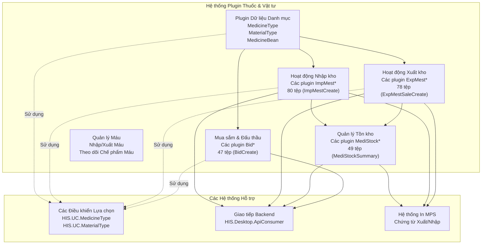
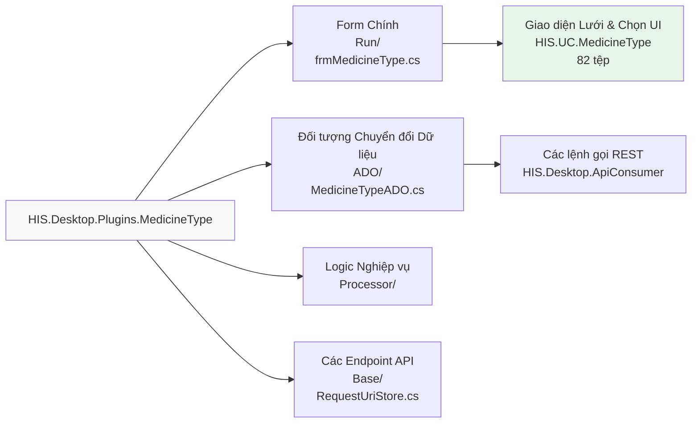
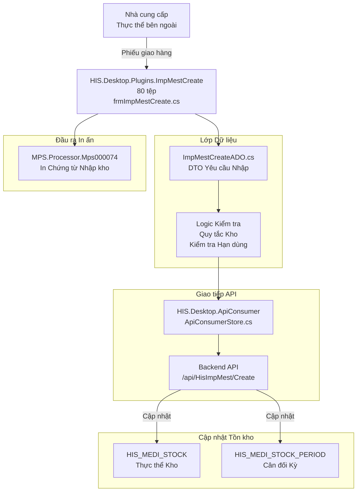
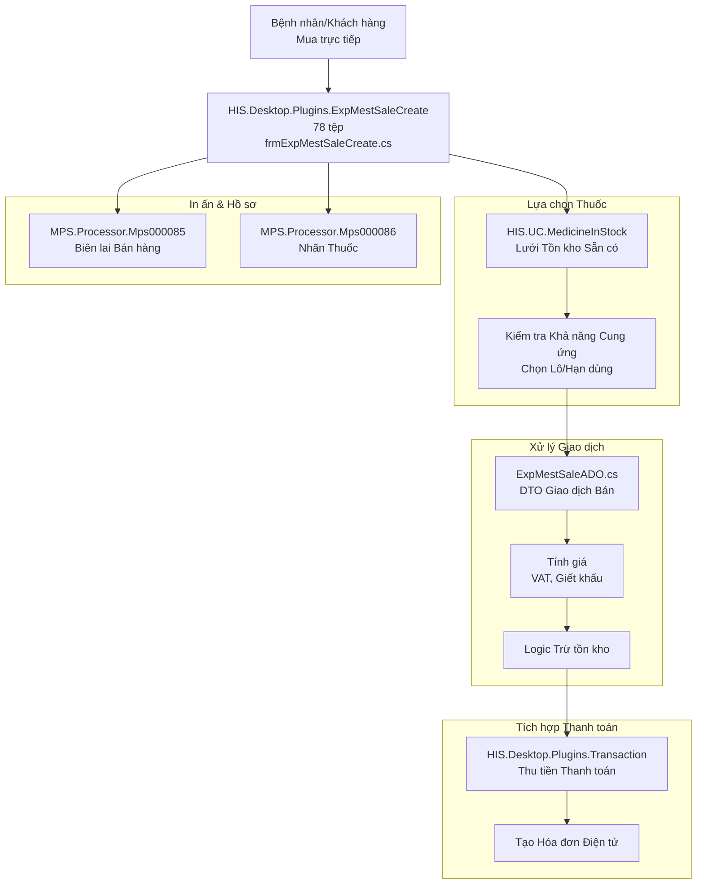
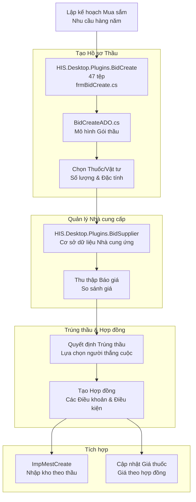
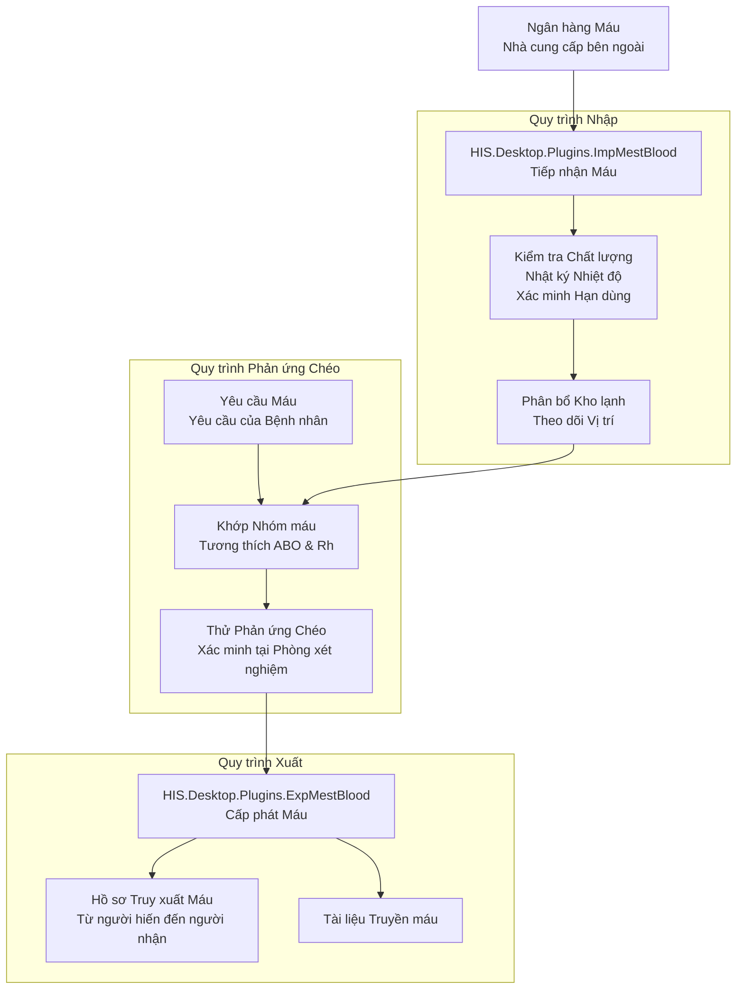
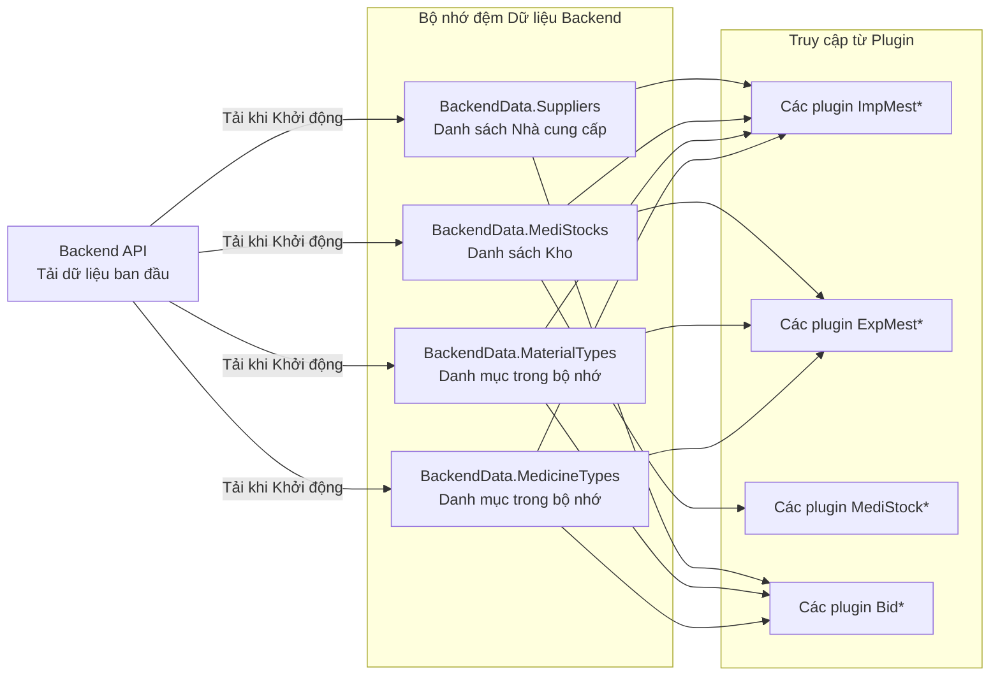

## Mục đích và Phạm vi

Tài liệu này trình bày về các plugin chịu trách nhiệm quản lý thuốc và vật tư y tế trong hệ thống HIS, nằm trong thư mục `HIS/Plugins/`. Các plugin này xử lý các hoạt động kho dược bao gồm định nghĩa loại thuốc, giao dịch nhập/xuất kho, quản lý tồn kho, quy trình đấu thầu/mua sắm và các hoạt động liên quan đến chế phẩm máu.

Trang này tập trung vào các plugin liên quan đến kho và dược. Để biết quy trình kê đơn và quản lý dùng thuốc, xem [Các Plugin Nghiệp vụ Cốt lõi của HIS](../../02-modules/his-desktop/business-plugins.md). Để biết về thanh toán và hóa đơn bán thuốc, xem [Các Plugin Giao dịch & Hóa đơn](../../02-modules/his-desktop/business-plugins.md#transaction-billing). Đối với các thành phần giao diện (UC) dùng chung liên quan đến chọn thuốc, xem [Các UC Thuốc & ICD](#1.3.3).

## Tổng quan các Danh mục Plugin

Phân hệ quản lý thuốc và vật tư y tế bao gồm khoảng hơn 40 plugin được tổ chức thành sáu danh mục chức năng:



**Nguồn:** [`.devin/wiki.json:90-97`](../../../../.devin/wiki.json#L90-L97)

## Các Plugin Quản lý Dữ liệu Danh mục (Master Data)

Các plugin này quản lý các định nghĩa cơ bản về thuốc và vật tư trong hệ thống:

| Tên Plugin | Số lượng Tệp | Chức năng Chính | Các Tính năng Key |
|-------------|-----------|------------------|--------------|
| `MedicineType` | ~40-50 | Quản lý danh mục thuốc | Định nghĩa loại, đường dùng, hoạt chất |
| `MaterialType` | ~40-50 | Danh mục vật tư y tế | Thiết bị, đồ dùng, vật tư tiêu hao |
| `MedicineBean` | ~30-40 | Đơn vị đóng gói thuốc | Tỷ lệ quy đổi, phân cấp đóng gói |
| `MedicinePaty` | ~25-35 | Giá thuốc theo đối tượng | Quy tắc giá cho từng loại bệnh nhân |
| `ActiveIngredient` | ~20-30 | Quản lý hoạt chất thuốc | Theo dõi các thành phần hoạt chất |

### Cấu trúc Loại Thuốc (Medicine Type)



**Nguồn:** [`.devin/wiki.json:225-232`](../../../../.devin/wiki.json#L225-L232), sơ đồ kiến trúc cấp cao

## Hoạt động Nhập kho (ImpMest*)

Hoạt động nhập kho xử lý việc tiếp nhận thuốc và vật tư vào kho lưu trữ. Nhóm plugin `ImpMest*` quản lý các kịch bản nhập kho khác nhau:

### Các Plugin Nhập kho Chính

| Tên Plugin | Số tệp | Mục đích | Loại Quy trình |
|-------------|-------|---------|---------------|
| `ImpMestCreate` | 80 | Nhập kho chung | Đơn mua hàng, tài trợ, điều chuyển |
| `ImpMestEdit` | ~50-60 | Sửa đổi bản ghi nhập | Sửa số lượng, hạn sử dụng |
| `ImpMestView` | ~40-50 | Xem lịch sử nhập | Tìm kiếm, lọc, xem chi tiết |
| `ImpMestApproval` | ~35-45 | Quy trình duyệt nhập | Phê duyệt nhiều cấp |
| `ImpMestDeduct` | ~30-40 | Giảm trừ nhập kho | Hàng hỏng, hàng trả lại |

### Luồng Dữ liệu ImpMest



### Cấu trúc Plugin ImpMestCreate

Plugin `ImpMestCreate` tuân theo kiến trúc plugin chuẩn với 80 tệp:

- `HIS.Desktop.Plugins.ImpMestCreate.Run/` - Triển khai form chính
  - [[`frmImpMestCreate.cs`](../../../frmImpMestCreate.cs)](../../../frmImpMestCreate.cs) - Form giao diện chính
  - [[`frmImpMestCreate.Designer.cs`](../../../frmImpMestCreate.Designer.cs)](../../../frmImpMestCreate.Designer.cs) - Tệp designer UI
  - Cấu hình lưới (Grid) và các trình xử lý sự kiện
- `HIS.Desktop.Plugins.ImpMestCreate.ADO/` - Các đối tượng dữ liệu
  - [[`ImpMestCreateADO.cs`](../../../ImpMestCreateADO.cs)](../../../ImpMestCreateADO.cs) - Mô hình yêu cầu nhập kho
  - [[`MedicineImportADO.cs`](../../../MedicineImportADO.cs)](../../../MedicineImportADO.cs) - Các dòng hàng hóa thuốc
  - [[`MaterialImportADO.cs`](../../../MaterialImportADO.cs)](../../../MaterialImportADO.cs) - Các dòng hàng hóa vật tư
- `HIS.Desktop.Plugins.ImpMestCreate.Processor/` - Logic nghiệp vụ
  - Các bộ xử lý kiểm tra (Validation)
  - Logic tính toán (số lượng, giá)
- `HIS.Desktop.Plugins.ImpMestCreate.Base/` - Cấu hình
  - [[`RequestUriStore.cs`](../../../RequestUriStore.cs)](../../../RequestUriStore.cs) - Định nghĩa các endpoint API
  - [[`ResourceLangManager.cs`](../../../ResourceLangManager.cs)](../../../ResourceLangManager.cs) - Các khóa đa ngôn ngữ

**Nguồn:** [`.devin/wiki.json:90-97`](../../../../.devin/wiki.json#L90-L97)

## Hoạt động Xuất kho (ExpMest*)

Hoạt động xuất kho xử lý việc cấp phát thuốc và vật tư từ kho lưu trữ. Nhóm plugin `ExpMest*` quản lý các kịch bản xuất kho khác nhau:

### Các Plugin Xuất kho Chính

| Tên Plugin | Số tệp | Mục đích | Loại Quy trình |
|-------------|-------|---------|---------------|
| `ExpMestSaleCreate` | 78 | Bán thuốc trực tiếp | Bán lẻ tại quầy |
| `ExpMestDepaCreate` | ~60-70 | Lĩnh về khoa phòng | Yêu cầu vật tư của khoa/phòng |
| `ExpMestChmsCreate` | ~55-65 | Xuất vật tư tiêu hao | Vật tư y tế, thiết bị |
| `ExpMestActualCreate` | ~50-60 | Cấp phát thực tế | Hoàn thành đơn thuốc |
| `ExpMestEdit` | ~45-55 | Sửa đổi bản ghi xuất | Điều chỉnh số lượng |

### Luồng ExpMestSaleCreate (Bán lẻ)



### Các Loại Chứng từ Xuất kho

Các plugin xuất hỗ trợ nhiều loại chứng từ tương ứng với các bộ xử lý MPS khác nhau:

| Loại Xuất | Mã Chứng từ | Bộ xử lý MPS | Tích hợp Plugin |
|-------------|---------------|---------------|-------------------|
| Xuất Đơn thuốc | `TT` | Mps000078-Mps000082 | `ExpMestActualCreate` |
| Xuất Bán | `BAN` | Mps000085-Mps000086 | `ExpMestSaleCreate` |
| Xuất Khoa phòng | `DEPA` | Mps000088-Mps000090 | `ExpMestDepaCreate` |
| Xuất Trả lại | `TRA` | Mps000091-Mps000092 | `ExpMestReturnCreate` |

**Nguồn:** [`.devin/wiki.json:90-97`](../../../../.devin/wiki.json#L90-L97), tổng quan kiến trúc MPS

## Quản lý Tồn kho & Kiểm kê (MediStock*)

Các plugin `MediStock*` cung cấp khả năng quản lý kho và tồn kho toàn diện:

### Các Plugin Quản lý Kho Chính

| Tên Plugin | Số tệp | Chức năng Chính | Các Khả năng Key |
|-------------|-------|------------------|------------------|
| `MediStockSummary` | 49 | Báo cáo tổng hợp tồn kho | Cân đối thời gian thực, cảnh báo hạn dùng |
| `MedicalStoreV2` | 49 | Quản lý cửa hàng dược | Tồn kho đa vị trí |
| `MediStockPeriod` | ~40-45 | Đóng/Mở kỳ kho | Đối soát hàng tháng |
| `MediStockBalance` | ~35-40 | Truy vấn số dư kho | Theo dõi theo từng lô |
| `MediStockExport` | ~30-35 | Xuất dữ liệu kho | Báo cáo Excel/CSV |

### Kiến trúc MediStockSummary


### Hỗ trợ Đa chi nhánh trong MedicalStoreV2

Plugin `MedicalStoreV2` (49 tệp) mở rộng việc quản lý kho để hỗ trợ nhiều vị trí vật lý:

- **Hỗ trợ Chi nhánh**: Tích hợp `HIS.Desktop.LocalStorage.Branch` cho các bệnh viện đa cơ sở
- **Điều chuyển Kho**: Quy trình điều chuyển giữa các vị trí
- **Tồn kho theo Vị trí**: Số dư riêng biệt cho mỗi vị trí
- **Báo cáo Hợp nhất**: Xem tồn kho trên toàn bộ các vị trí

**Các Lớp Chính:**
- [[`HIS/Plugins/HIS.Desktop.Plugins.MedicalStoreV2/Run/frmMedicalStoreV2.cs`](../../../../HIS/Plugins/HIS.Desktop.Plugins.MedicalStoreV2/Run/frmMedicalStoreV2.cs)](../../../../HIS/Plugins/HIS.Desktop.Plugins.MedicalStoreV2/Run/frmMedicalStoreV2.cs) - Form chính
- [[`HIS/Plugins/HIS.Desktop.Plugins.MedicalStoreV2/ADO/MediStockADO.cs`](../../../../HIS/Plugins/HIS.Desktop.Plugins.MedicalStoreV2/ADO/MediStockADO.cs)](../../../../HIS/Plugins/HIS.Desktop.Plugins.MedicalStoreV2/ADO/MediStockADO.cs) - Mô hình vị trí kho
- `HIS/Plugins/HIS.Desktop.Plugins.MedicalStoreV2/Processor/` - Logic nghiệp vụ đa vị trí

**Nguồn:** [`.devin/wiki.json:90-97`](../../../../.devin/wiki.json#L90-L97)

## Đấu thầu & Mua sắm (Bid*)

Nhóm plugin `Bid*` quản lý quy trình mua sắm và đấu thầu thuốc và vật tư y tế:

### Các Plugin Quản lý Thầu

| Tên Plugin | Số tệp | Mục đích | Giai đoạn Quy trình |
|-------------|-------|---------|---------------|
| `BidCreate` | 47 | Tạo gói thầu | Lập kế hoạch & đặc tính kỹ thuật |
| `BidEdit` | ~35-40 | Sửa chi tiết thầu | Thay đổi trước khi phê duyệt |
| `BidSupplier` | ~30-35 | Quản lý nhà cung cấp | Lựa chọn đơn vị cung ứng |
| `BidMedicineType` | ~30-35 | Ánh xạ thầu thuốc | Đặc tả chi tiết mặt hàng |
| `BidImport` | ~25-30 | Nhập dữ liệu thầu | Tải lên hàng loạt |

### Luồng Quy trình Đấu thầu



### Các Thành phần của Plugin BidCreate

Cấu trúc plugin `BidCreate` (47 tệp):

- **Quản lý Thông tin Chung về Thầu**:
  - Số thầu, tên thầu, năm
  - Phân bổ ngân sách
  - Mốc thời gian và thời hạn
- **Các Dòng Mặt hàng Thầu**:
  - Các loại thuốc kèm đặc tính kỹ thuật
  - Các loại vật tư kèm đặc tính kỹ thuật
  - Số lượng yêu cầu
  - Giá dự kiến
- **Liên kết Nhà cung cấp**:
  - Nhiều báo giá từ nhà cung cấp
  - Phân tích so sánh
  - Khuyến nghị trúng thầu
- **Tạo Tài liệu**:
  - Các bộ xử lý MPS cho hồ sơ thầu
  - Xuất dữ liệu ra hệ thống đấu thầu

**Nguồn:** [`.devin/wiki.json:90-97`](../../../../.devin/wiki.json#L90-L97)

## Hoạt động Quản lý Máu

Quản lý chế phẩm máu yêu cầu việc theo dõi chuyên biệt do các yêu cầu về quy định y tế:

### Các Plugin Liên quan đến Máu

| Tên Plugin | Ước tính số tệp | Mục đích | Các Tính năng Độc đáo |
|-------------|----------------|---------|-----------------|
| `ImpMestBlood` | ~35-40 | Nhập chế phẩm máu | Tích hợp ngân hàng máu |
| `ExpMestBlood` | ~35-40 | Xuất chế phẩm máu | Xác thực phản ứng chéo (Cross-match) |
| `BloodType` | ~25-30 | Quản lý nhóm máu | Theo dõi ABO, Rh |
| `BloodTracking` | ~30-35 | Khả năng truy xuất | Chuỗi từ người hiến đến người nhận |

### Luồng Chế phẩm Máu



**Các Lưu ý Đặc biệt:**
- **Giám sát Nhiệt độ**: Tích hợp với việc giám sát chuỗi cung ứng lạnh
- **Theo dõi Hạn dùng**: Thời gian bảo quản ngắn (thường là 35-42 ngày)
- **Tuân thủ Quy định**: Các quy định về an toàn truyền máu của Bộ Y tế
- **Dấu vết Kiểm toán**: Khả năng truy xuất hoàn toàn từ người hiến đến người nhận

**Nguồn:** [`.devin/wiki.json:90-97`](../../../../.devin/wiki.json#L90-L97), kiến thức nghiệp vụ y tế

## Tích hợp với các Hệ thống khác

### Tích hợp API Consumer

Tất cả các plugin thuốc và vật tư giao tiếp với backend thông qua `HIS.Desktop.ApiConsumer`:

| Lớp API Consumer | Các Endpoint phục vụ | Sử dụng trong Plugin |
|-------------------|------------------|--------------|
| `ApiConsumerStore` | Các lệnh gọi REST chung | Tất cả các plugin |
| `MedicineTypeApiConsumer` | `/api/HisMedicineType/*` | MedicineType, ImpMest*, ExpMest* |
| `MaterialTypeApiConsumer` | `/api/HisMaterialType/*` | MaterialType, ImpMest*, ExpMest* |
| `MediStockApiConsumer` | `/api/HisMediStock/*` | MediStock*, Quản lý kho |
| `ImpMestApiConsumer` | `/api/HisImpMest/*` | Các plugin ImpMest* |
| `ExpMestApiConsumer` | `/api/HisExpMest/*` | Các plugin ExpMest* |

**Nguồn:** [`.devin/wiki.json:54-58`](../../../../.devin/wiki.json#L54-L58), tổng quan về HIS.Desktop.ApiConsumer

### Lưu trữ Địa phương & Cơ chế Cache

Dữ liệu thuốc và vật tư được lưu đệm (cache) mạnh mẽ trong `HIS.Desktop.LocalStorage.BackendData`:



**Lợi ích của việc Caching:**
- Giảm thiểu các lệnh gọi API trong quá trình nhập dữ liệu
- Cho phép kiểm tra (validation) ngoại tuyến
- Cải thiện hiệu suất tự động hoàn thành (autocomplete)
- Lọc và sắp xếp lưới dữ liệu nhanh hơn

**Làm mới Bộ nhớ đệm (Cache Refresh):**
- Tự động khi khởi động ứng dụng
- Làm mới thủ công thông qua `BackendData.Reload()`
- Cập nhật dựa trên sự kiện PubSub khi dữ liệu thay đổi

**Nguồn:** [`.devin/wiki.json:44-53`](../../../../.devin/wiki.json#L44-L53), tài liệu LocalStorage

### Tích hợp Hệ thống In MPS

Các giao dịch thuốc và vật tư tạo ra nhiều chứng từ in ấn khác nhau:

| Loại Giao dịch | Dải bộ xử lý MPS | Ví dụ về Chứng từ |
|-----------------|-------------------|-------------------|
| Nhập kho | Mps000070-Mps000079 | Phiếu nhập kho, chứng từ nhận hàng |
| Xuất kho | Mps000080-Mps000099 | Phiếu xuất kho, biên lai bán hàng, nhãn |
| Tồn kho | Mps000150-Mps000159 | Báo cáo tồn kho, thẻ kho |
| Đấu thầu | Mps000200-Mps000209 | Hồ sơ thầu, hợp đồng |

**Các Tính năng In ấn Chung:**
- Tạo mã vạch để theo dõi
- Mã QR để xác thực kỹ thuật số
- In nhiều liên (bản gốc, bản sao, lưu kho)
- Hỗ trợ chữ ký điện tử

**Nguồn:** [`.devin/wiki.json:180-198`](../../../../.devin/wiki.json#L180-L198), tổng quan về Hệ thống in MPS

## Các Mẫu Plugin Chung

### Cấu trúc Plugin Tiêu chuẩn

Mỗi plugin thuốc/vật tư thường tuân theo cấu trúc sau:

```
HIS.Desktop.Plugins.[PluginName]/
├── [PluginName].cs                    # Điểm truy cập plugin
├── Run/
│   ├── frm[PluginName].cs            # Form chính
│   ├── frm[PluginName].Designer.cs   # Tệp Designer
│   └── frm[PluginName].resx          # Tài nguyên giao diện
├── ADO/
│   └── [PluginName]ADO.cs            # Các đối tượng chuyển đổi dữ liệu
├── Processor/
│   └── [PluginName]Processor.cs      # Logic nghiệp vụ
├── Base/
│   ├── RequestUriStore.cs            # Các endpoint API
│   └── ResourceLangManager.cs        # Đa ngôn ngữ
├── Resources/
│   └── [Language].resx               # Các tệp tài nguyên ngôn ngữ
└── Properties/
    └── AssemblyInfo.cs               # Metadata của assembly
```

### Các Mẫu Kiểm tra Dữ liệu (Validation Patterns)

Các bước kiểm tra chung giữa các plugin:

- **Khả năng cung ứng tồn kho**: Trước khi xuất, xác minh đủ tồn kho
- **Hạn dùng**: Cảnh báo khi sắp hết hạn, chặn các mặt hàng đã hết hạn
- **Ngăn chặn Trùng lặp**: Kiểm tra các giao dịch bị trùng
- **Kiểm tra Giá**: Đảm bảo giá nằm trong phạm vi cho phép
- **Quyền người dùng**: Xác thực truy cập dựa trên vai trò
- **Chốt Kỳ**: Ngăn chặn giao dịch trong các kỳ đã chốt

### Xử lý Lỗi

Xử lý lỗi tiêu chuẩn thông qua:
- `Inventec.Common.Logging` để ghi nhật ký ngoại lệ
- `MessageBox` để gửi thông báo cho người dùng
- Các đối tượng `ValidationResult` cho các vi phạm quy tắc nghiệp vụ
- Hỗ trợ Rollback cho các giao dịch bị lỗi

**Nguồn:** [`.devin/wiki.json:60-68`](../../../../.devin/wiki.json#L60-L68), Kiến trúc Hệ thống Plugin