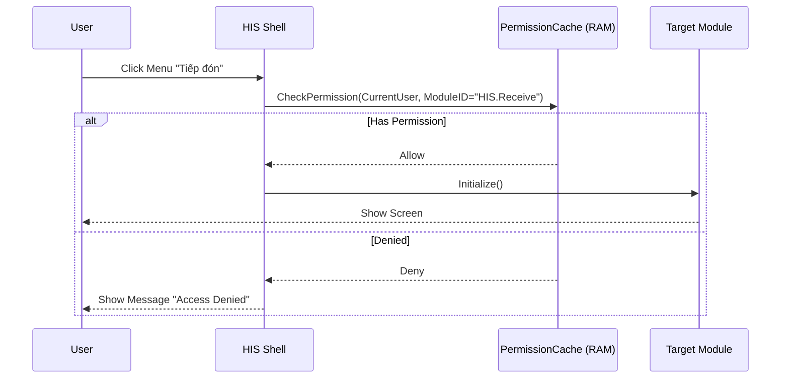

# Technical Spec: Quản lý Truy cập & Bảo mật (Access Control System - ACS)

## 1. Business Mapping
*   **Ref**: [Quản lý Truy cập & Phân quyền User](../../02-business-processes/administration/01-access-control-business.md)
*   **Scope**: Module này chịu trách nhiệm xác thực người dùng (Authentication), quản lý vai trò và phân quyền (Authorization) cho toàn bộ hệ thống HIS.
*   **Key Plugin**: `Global.ACS.Desktop.Plugins.AcsUser`.

## 2. Core Components (Codebase Mapping)
### 2.1. Plugin Main Structure
Hệ thống ACS được chia nhỏ thành nhiều plugin để quản lý từng đối tượng riêng biệt trong namespace `Global.ACS.Desktop.Plugins.*`:

| Plugin Name | Chức năng (Business) |
|:---|:---|
| `Global.ACS.Desktop.Plugins.AcsUser` | Quản lý người dùng, reset mật khẩu, khóa tài khoản. |
| `Global.ACS.Desktop.Plugins.AcsRole` | Định nghĩa nhóm quyền (Role). |
| `Global.ACS.Desktop.Plugins.AcsRoleUser` | Gán người dùng vào nhóm quyền. |
| `Global.ACS.Desktop.Plugins.AcsControl` | Phân quyền chi tiết đến từng button/grid column. |

### 2.2. User Interface (UI)
*   **Main Control**: `UcAcsUser` (trong plugin `AcsUser`).
*   **Sub-Forms**:
    *   `frmAcsUser_Update`: Form thêm/sửa người dùng.
    *   `frmChangePassword`: Form đổi mật khẩu cá nhân.
    *   `frmAuthorize`: Form ma trận phân quyền (User/Role vs Module/Function).

## 3. Process Flow (Technical Deep Dive)

### 3.1. Luồng Kiểm tra Quyền (Authorization Flow)
Cơ chế kiểm tra quyền được thực hiện tại tầng Core trước khi load bất kỳ Plugin nào.

### 3.2. Caching Strategy
Do tần suất kiểm tra quyền rất cao (mỗi thao tác click), hệ thống áp dụng chiến lược **Aggressive Caching**:
1.  **Load**: Khi Login thành công, toàn bộ quyền của User (từ bảng `ACS_ROLE_USER`, `ACS_USER_PERMISSION`) được tải một lần vào `GlobalCache.PermissionData`.
2.  **Usage**: Hàm `HasPermission(moduleID)` chỉ tra cứu trên RAM, không query DB.
3.  **Invalidate**: Khi Admin đổi quyền, Backend bắn tín hiệu PubSub `AcsPermissionChanged`. Client nhận tín hiệu -> Reload lại Cache ngầm.

## 4. Database Schema
Các bảng cốt lõi trong Schema `ACS`:

### 4.1. ACS_USER
Danh sách tài khoản.
*   `LOGIN_NAME` (PK): Tên đăng nhập.
*   `PASSWORD_HASH`: Mật khẩu (SHA-256 + Salt).
*   `IS_ACTIVE`: Trạng thái kích hoạt (1: Active, 0: Locked).
*   `DEPARTMENT_ID`: Khoa phòng mặc định.

### 4.2. ACS_ROLE
Danh sách nhóm quyền.
*   `ID` (PK): Mã nhóm quyền.
*   `ROLE_NAME`: Tên hiển thị (VD: Bác sĩ Nội trú).

### 4.3. ACS_PERMISSION
Bảng ma trận quyền.
*   `ID`: PK.
*   `ROLE_ID` / `USER_ID`: Đối tượng được cấp quyền.
*   `MODULE_ID`: Chức năng được cấp quyền.
*   `PERMISSION_BITMASK`: Quyền chi tiết (View/Add/Edit/Delete/Export).

## 5. Integration Points
Module ACS tích hợp chặt chẽ với tất cả module khác:
*   **Authentication**: Cung cấp `CurrentSession` chứa `UserID`, `DepartmentID` cho logic nghiệp vụ.
*   **Audit Logging**: Mọi hành vi sửa/xóa dữ liệu ở các module Clinic/Finance đều log kèm `UserID` lấy từ ACS.
*   **SSO**: Hỗ trợ tích hợp Single Sign-On (nếu có cấu hình) qua giao thức OAuth2 nội bộ.

## 6. Common Issues
*   **Quyền không cập nhật ngay**: Do độ trễ của PubSub hoặc Client mất kết nối SignalR -> Cần Logout/Login lại để refresh quyền.
*   **Mất quyền sau khi deploy**: Do thay đổi Module ID trong code nhưng chưa chạy tool cập nhật lại DB `ACS_MODULE`.
