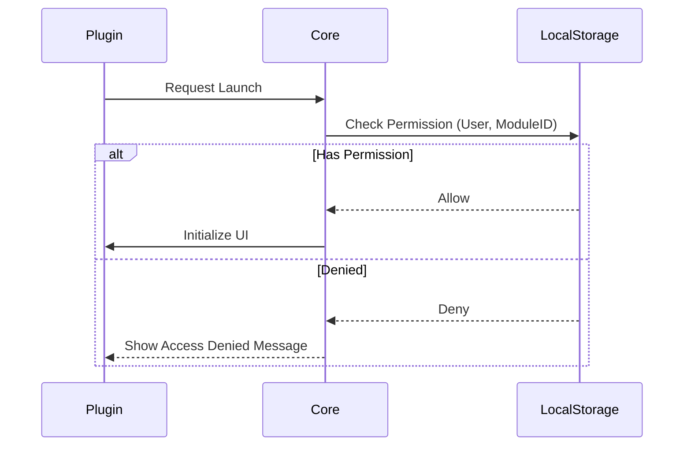

# Thiết kế Kỹ thuật: Phân hệ ACS

## 1. Tổng quan Architecture
Phân hệ ACS bao gồm 13 plugin trong namespace `Global.ACS.Desktop.Plugins.*`.
Các plugin này cung cấp dịch vụ xác thực (Authentication) và ủy quyền (Authorization) cho toàn bộ hệ thống.

## 2. Danh mục Plugin

| Plugin | Số file | Chức năng Kỹ thuật |
|:---|:---|:---|
| `AcsUser` | 30 | Quản lý bảng `ACS_USER`. CRUD người dùng. |
| `AcsRole` | 25 | Định nghĩa vai trò (`ACS_ROLE`). |
| `AcsRoleUser` | 25 | Bảng trung gian `ACS_ROLE_USER`. |
| `AcsModule` | 24 | Registry của tất cả Module trong hệ thống. |
| `AcsControl` | 24 | Quản lý quyền UI (`ACS_CONTROL`). |
| `ImportAcsRoleUser`| - | Tool import phân quyền từ Excel. |

## 3. Thiết kế Chi tiết

### 3.1. Luồng Kiểm tra Quyền (Authorization Flow)
Khi một Plugin nghiệp vụ (VD: `Register`) khởi chạy:

### 3.2. Caching Strategy
Do tần suất kiểm tra quyền rất cao (mỗi khi mở form, click nút), dữ liệu ACS được Cache triệt để tại `HIS.Desktop.LocalStorage.BackendData`.
*   **Cache Load**: Tải toàn bộ quyền của User khi đăng nhập thành công.
*   **Cache Invalidate**: Khi Admin thay đổi quyền, hệ thống bắn PubSub `AcsPermissionChanged` để Client tải lại Cache.

### 3.3. API Integation
Sử dụng `HIS.Desktop.ApiConsumer` để gọi tới `ACS.Backend.Api`.
*   `POST /api/AcsUser/Get`: Lấy danh sách user.
*   `POST /api/Authentication/Login`: Xác thực credential.

## 4. Database Schema (Key Tables)
*   `ACS_USER`: Thông tin tài khoản (`LoginName`, `PasswordHash`, `IsActive`).
*   `ACS_ROLE`: Danh mục vai trò.
*   `ACS_MODULE`: Danh mục module (tương ứng với DLL Plugin).
*   `ACS_CONTROL`: Danh mục UI Control (Button, GridColumn).

## 5. Security Context
Hệ thống duy trì `CurrentSession` chứa thông tin User và Token hiện tại. Mọi Request lên Backend đều đính kèm Token này để xác thực tại Server-side.
