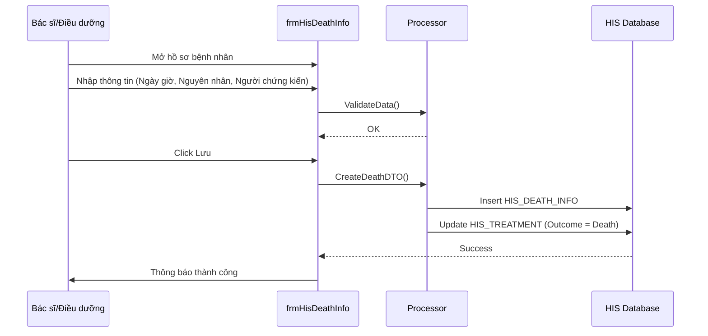

# Technical Spec: Quản lý Báo tử & Nhà đại thể (Death Management)

## 1. Business Mapping
*   **Ref**: [Quy trình Quản lý Báo tử](../../02-business-processes/administration/02-death-management.md)
*   **Scope**: Ghi nhận thông tin tử vong, in giấy báo tử, kiểm thảo tử vong và quản lý nhà đại thể.
*   **Key Plugins**:
    *   `HIS.Desktop.Plugins.HisDeathInfo`: Quản lý thông tin báo tử.
    *   `HIS.Desktop.Plugins.HisDeathCertBook`: Quản lý sổ báo tử.
    *   `HIS.Desktop.Plugins.InformationAllowGoHome`: (Sub-component) Xử lý cho về/tử vong.

## 2. Core Components
### 2.1. Plugin Main Structure
*   **Plugin Name**: `HIS.Desktop.Plugins.HisDeathInfo`
*   **Processor**: `HisDeathInfoProcessor` - Xử lý logic lưu trữ và validate dữ liệu tử vong.
*   **UI Components**:
    *   `frmHisDeathInfo.cs`: Form chính nhập liệu.
    *   `UCCauseOfDeath.cs`: UserControl nhập nguyên nhân tử vong (ICD-10).

### 2.2. Logic Nghiệp vụ
*   **Kiểm thảo Tử vong**: Bắt buộc phải có biên bản kiểm thảo trước khi kết thúc hồ sơ (Config: `DEATH_REVIEW_REQUIRED`).
*   **Nguyên nhân Tử vong**: Phải khớp với mã ICD-10 theo quy định của Bộ Y tế.
*   **Thời gian**: Validate ngày giờ tử vong `>=` thời gian vào viện và `<` thời gian hiện tại.

## 3. Process Flow
### 3.1. Luồng Ghi nhận Tử vong

## 4. Database Schema
### 4.1. HIS_DEATH_INFO
Bảng chính lưu thông tin tử vong.
*   `ID`: PK.
*   `TREATMENT_ID`: FK (Hồ sơ điều trị).
*   `DEATH_TIME`: Thời gian tử vong.
*   `MAIN_CAUSE`: Nguyên nhân chính (Text).
*   `ICD10_CODE`: Mã ICD nguyên nhân.
*   `DEATH_CERT_NUMBER`: Số giấy báo tử.

### 4.2. HIS_DEATH_WITHIN
Danh mục khoảng thời gian tử vong (Ví dụ: < 24h, > 24h).
*   `ID`: PK.
*   `DEATH_WITHIN_NAME`: Tên hiển thị.

## 5. Integration Points
*   **Treatment End**: Khi xác nhận tử vong, trạng thái hồ sơ điều trị (`HIS_TREATMENT`) chuyển sang `KET_THUC` với kết quả `TU_VONG`.
*   **Medical Record**: Hồ sơ được đánh dấu lưu trữ vĩnh viễn (hoặc theo quy định tử vong).
*   **EMR**: Đồng bộ giấy báo tử lên cổng dữ liệu quốc gia.

## 6. Common Issues
*   **Sai mã ICD**: Nguyên nhân tử vong không khớp với mã ICD danh mục. -> Cần update danh mục `HIS_ICD`.
*   **Lệch thời gian**: Thời gian tử vong trước thời gian nhập khoa. -> Validate chặt ở UI.
