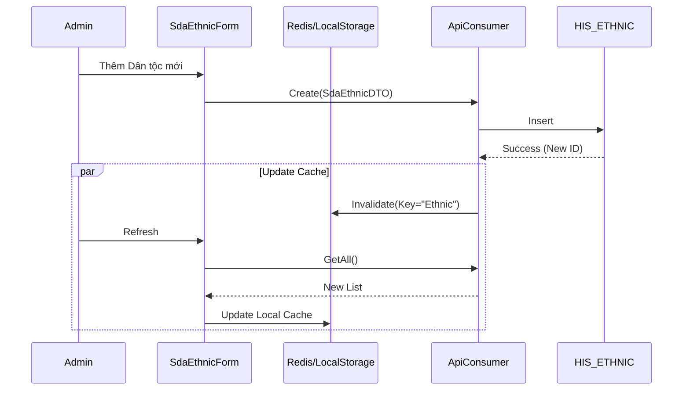

# Technical Spec: Quản trị Dữ liệu Hệ thống (System Data)

## 1. Business Mapping
*   **Ref**: [Quản trị Danh mục & Dữ liệu Hệ thống](../../02-business-processes/administration/03-system-data-business.md)
*   **Scope**: Quản lý các danh mục dùng chung (Admin), cấu hình tham số hệ thống.
*   **Key Plugins**:
    *   `HIS.Desktop.Plugins.SdaConfigApp`: Cấu hình ứng dụng.
    *   `HIS.Desktop.Plugins.SdaLanguage`: Đa ngôn ngữ.
    *   `HIS.Desktop.Plugins.Administrator` (Giả định): Quản lý danh mục tổng hợp.

## 2. Core Components
### 2.1. System Data Architecture (SDA)
SDA là namespace quản lý dữ liệu nền tảng.
*   **Dynamic Configuration**: Hệ thống cho phép add key cấu hình động mà không cần sửa code/DB schema cứng.
*   **Caching**: Hầu hết dữ liệu SDA được cache tại Client (`HIS.Desktop.LocalStorage`).

### 2.2. UI Components
*   `frmSdaConfigApp`: Form quản lý cấu hình.
*   `frmSdaLanguage`: Form dịch thuật ngữ.
*   `UcAdminBase`: Control cơ sở cho các danh mục (Thêm/Sửa/Xóa/Export).

## 3. Process Flow
### 3.1. Luồng Cập nhật Danh mục (Ví dụ: Dân tộc)

## 4. Database Schema
### 4.1. HIS_ETHNIC, HIS_PROVINCE, HIS_JOB
Các bảng danh mục đơn giản.
*   `ID`: PK.
*   `ETHNIC_NAME`: Tên.
*   `ETHNIC_CODE`: Mã quy định.

### 4.2. HIS_CONFIG
Bảng cấu hình hệ thống quan trọng nhất.
*   `KEY`: Tên tham số (VD: `ALLOWED_DISCOUNT_RATIO`).
*   `VALUE`: Giá trị.
*   `DEFAULT_VALUE`: Giá trị mặc định.
*   `DESCRIPTION`: Mô tả.
*   `MODULE_LINK`: Module sử dụng.

## 5. Integration Points
*   **All Modules**: Tất cả module đều đọc `HIS_CONFIG` và `HIS_ETHNIC/PROVINCE/...` khi khởi động.
*   **Deployment Tool**: Tool riêng để deploy master data khi triển khai bệnh viện mới.

## 6. Common Issues
*   **Cache Stale**: Admin sửa danh mục nhưng Client chưa thấy. -> Cần restart Client hoặc chờ chu kỳ refresh cache.
*   **Duplicate Code**: Trùng mã danh mục do không check kỹ trước khi insert.
