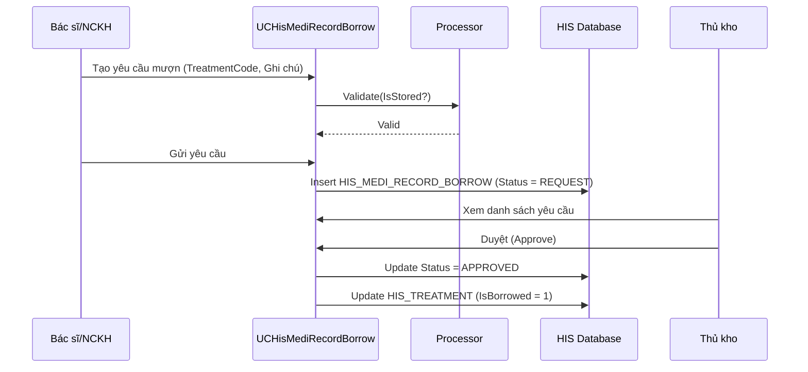

# Technical Spec: Lưu trữ & Quản lý Hồ sơ Bệnh án (Medical Record Storage)

## 1. Business Mapping
*   **Ref**: [Lưu trữ & Mượn trả Hồ sơ](../../02-business-processes/administration/03-medical-record-storage.md)
*   **Scope**: Quản lý kho hồ sơ, quy trình lưu trữ, mượn và trả hồ sơ bệnh án bản giấy/điện tử.
*   **Key Plugins**:
    *   `HIS.Desktop.Plugins.HisMediRecordBorrow`: Quản lý mượn/trả hồ sơ.
    *   `HIS.Desktop.Plugins.TreatmentBorrowList`: Danh sách theo dõi hồ sơ đang mượn.
    *   `HIS.Desktop.Plugins.TreatmentFinish`: (Integration) Xác nhận lưu trữ hồ sơ.

## 2. Core Components
### 2.1. Plugin Main Structure
*   **Borrow Plugin**: `HIS.Desktop.Plugins.HisMediRecordBorrow`.
    *   **UI**: `UCHisMediRecordBorrow` - Giao diện đăng ký mượn.
    *   **Processor**: `HisMediRecordBorrowProcessor` - Xử lý chuyển trạng thái mượn/trả.

### 2.2. Logic Nghiệp vụ
*   **Điều kiện Mượn**: Chỉ được mượn hồ sơ đã kết thúc (`IS_PAUSE = 1`) và đã được lưu trữ (`IS_LOCK = 1` hoặc trạng thái lưu trữ tương đương).
*   **Thời hạn**: Có thể cấu hình thời gian mượn tối đa (Deadline).
*   **Phê duyệt**: Yêu cầu mượn cần được duyệt bởi thủ kho (Role: `Librarian`).

## 3. Process Flow
### 3.1. Luồng Mượn Hồ sơ

## 4. Database Schema
### 4.1. HIS_MEDI_RECORD (Dự kiến)
Hoặc quản lý trực tiếp trên `HIS_TREATMENT`.
*   `STORE_CODE`: Mã kho lưu trữ.
*   `STORE_TIME`: Thời gian đưa vào kho.

### 4.2. HIS_MEDI_RECORD_BORROW
Lịch sử mượn trả.
*   `ID`: PK.
*   `TREATMENT_ID`: FK.
*   `BORROW_USER`: Người mượn.
*   `BORROW_TIME`: Thời gian mượn.
*   `RETURN_TIME`: Thời gian trả.
*   `STATUS`: Trạng thái (Request/Approved/Returned/Overdue).

## 5. Integration Points
*   **Treatment End**: Khi hồ sơ hoàn tất thủ tục thanh toán và xuất viện, hệ thống chuyển trạng thái sang "Chờ lưu trữ".
*   **EMR**: Với hồ sơ điện tử, việc "lưu trữ" đồng nghĩa việc ký số và khóa chỉnh sửa vĩnh viễn (Archived).

## 6. Common Issues
*   **Mất hồ sơ**: Hệ thống báo "Trong kho" nhưng thực tế không tìm thấy -> Cần quy trình kiểm kê định kỳ.
*   **Quên trả**: Cần job quét và cảnh báo email cho người mượn quá hạn.
