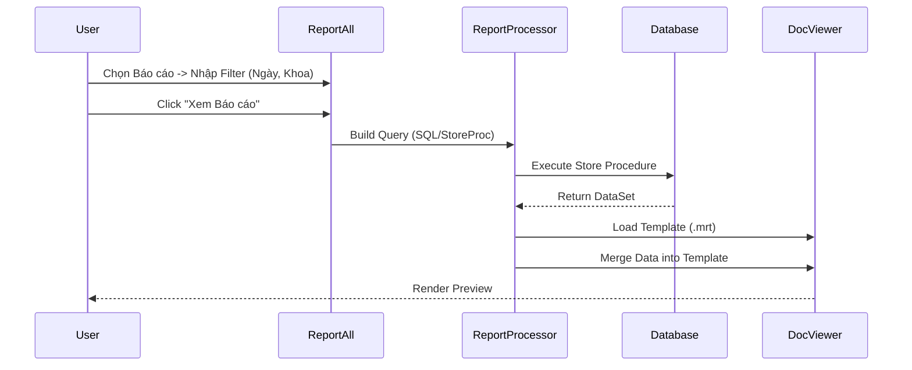

# Technical Spec: Hệ thống Báo cáo (Reporting System)

## 1. Business Mapping
*   **Ref**: [Hệ thống Báo cáo Quản trị](../../02-business-processes/administration/04-reporting-system.md)
*   **Scope**: Module nền tảng cung cấp khả năng chạy, xem và xuất dữ liệu báo cáo cho toàn bộ các phân hệ trong bệnh viện (Lâm sàng, Dược, Viện phí).
*   **Key Plugin**: `HIS.Desktop.Plugins.ReportAll`.

## 2. Core Components (Codebase Mapping)
### 2.1. Plugin Family
*   **`HIS.Desktop.Plugins.ReportAll`**: Plugin container chính, chứa TreeView danh sách báo cáo và DocumentViewer để hiển thị kết quả.
*   **`HIS.Desktop.Plugins.HisReportTypeCat`**: Quản lý danh mục loại báo cáo (Report Type Config).
*   **`HIS.Desktop.Plugins.MediStockSummary`**: (Ví dụ) Một số báo cáo kho dược được build riêng nhưng vẫn nhúng vào khung chung.

### 2.2. Reporting Engines
Hệ thống hỗ trợ đa dạng engine:
*   **MPS Report (Internal)**: Engine báo cáo nội bộ xử lý file XML Template (`.mrt`).
*   **Crystal Report**: Hỗ trợ các mẫu báo cáo cũ (`.rpt`).
*   **Excel Export**: Xuất dữ liệu thô ra Excel xử lý hậu kỳ.

## 3. Process Flow (Technical Deep Dive)

### 3.1. Luồng Chạy Báo cáo (Execution Flow)

### 3.2. Dynamic Filter
Bộ lọc báo cáo (Filter Control) được sinh động dựa trên cấu hình:
*   Nếu report cần chọn Khoa -> Hiển thị ComboBox Khoa.
*   Nếu report cần chọn Đối tượng -> Hiển thị Checklist Đối tượng.
Cấu hình nằm trong bảng `HIS_REPORT_TYPE_CAT`.

## 4. Database Schema
### 4.1. HIS_REPORT_TYPE_CAT
Danh mục báo cáo.
*   `ID` (PK).
*   `REPORT_CODE`: Mã báo cáo unique.
*   `REPORT_NAME`: Tên hiển thị.
*   `SQL_QUERY`: Câu lệnh SQL hoặc tên Store Procedure (nếu báo cáo Dynamic SQL).
*   `TEMPLATE_FILE`: Đường dẫn file mẫu.

## 5. Integration Points
*   **All Modules**: Mọi module (Tiếp đón, Khám, Dược) đều có thể gọi `ReportAll` để mở báo cáo in ấn phiếu/sổ sách.

## 6. Common Issues
*   **Timeout**: Báo cáo tổng hợp khối lượng dữ liệu lớn chạy quá 30s -> Cần tối ưu Index DB hoặc chạy background job.
*   **Sai Template**: Cập nhật mẫu báo cáo nhưng Client chưa tải mẫu mới về -> Cần cơ chế Versioning cho Template.
