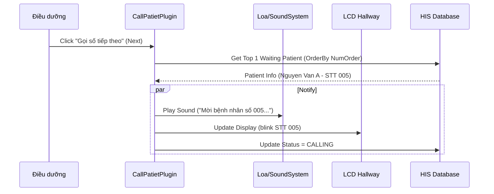

# Technical Spec: Quản lý Hàng đợi (Queue Management)

## 1. Business Mapping
*   **Ref**: [Quản lý Hàng đợi & QMS](../../02-business-processes/administration/05-queue-management.md)
*   **Scope**: Cấp số thứ tự, gọi số tại phòng khám/tiếp đón, hiển thị màn hình chờ.
*   **Key Plugins**:
    *   `HIS.Desktop.Plugins.CallPatientNumOrder`: Module gọi số (cho màn hình gọi).
    *   `HIS.Desktop.Plugins.GenerateRegisterOrder`: Module cấp số tự động.
    *   `HIS.Desktop.Plugins.HisNumOrderBlock`: Quản lý dải số (Block).

## 2. Core Components
### 2.1. Plugin Main Structure
*   **Call Patient**: `HIS.Desktop.Plugins.CallPatientNumOrder`.
    *   **UI**: `frmWaitingScreenNumOrder` - Màn hình hiển thị danh sách chờ.
    *   **Processor**: `CallPatientNumOrderProcessor` - Logic gọi loa, chuyển số.

### 2.2. Logic Cấp số
*   **Rule**: Số thứ tự được cấp dựa trên `ServiceId` (Loại dịch vụ) và `OrderDate` (Ngày).
*   **Reset**: Tự động reset về 1 vào đầu ngày mới.
*   **Priority**: Hỗ trợ số ưu tiên (người già, trẻ em) -> Chèn vào đầu hàng đợi hoặc quy tắc xen kẽ (1 thường - 1 ưu tiên).

## 3. Process Flow
### 3.1. Luồng Gọi số (Call Patient)

## 4. Database Schema
### 4.1. HIS_NUM_ORDER_ISSUE
Lịch sử cấp số.
*   `ID`: PK.
*   `ISSUE_TIME`: Thời gian cấp.
*   `NUM_ORDER`: Số thứ tự (Int).
*   `PATIENT_ID`: Bệnh nhân.
*   `OBJECT_ID`: Đối tượng (BHYT/Thu phí).

### 4.2. HIS_SERVICE_REQ
Lưu trạng thái gọi khám (trong ngữ cảnh phòng khám).
*   `NUM_ORDER`: STT khám.
*   `CALL_COUNT`: Số lần đã gọi.

## 5. Integration Points
*   **Reception**: Cấp số ngay khi đăng ký.
*   **Clinical**: Bác sĩ gọi số từ module Khám bệnh -> Trigger hệ thống QMS.
*   **Hardware**: Tích hợp với hệ thống Loa (TTS) và Bảng LED/TV qua COM Port hoặc API.

## 6. Common Issues
*   **Nhảy số**: Hai máy cùng cấp 1 số -> Cần Lock DB hoặc dùng Sequence.
*   **Mất tiếng**: Driver âm thanh lỗi hoặc file âm thanh bị thiếu -> Check folder `Resources/Sound`.
