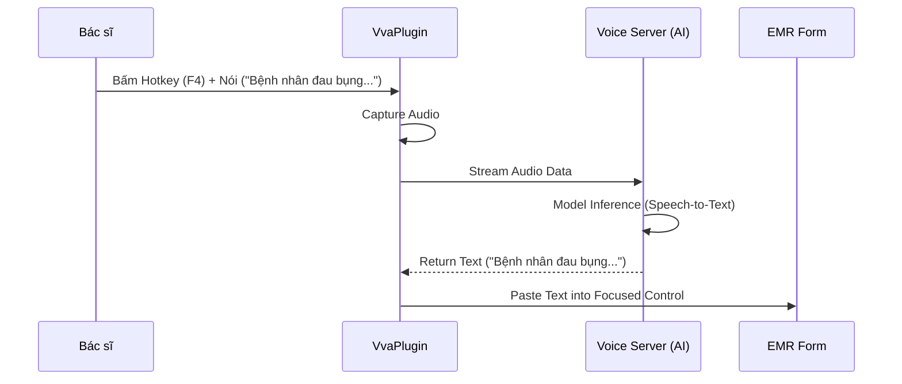

# Technical Spec: Trợ lý Giọng nói (Voice Assistant)

## 1. Business Mapping
*   **Ref**: [Trợ lý Giọng nói & Nhập liệu thông minh](../../02-business-processes/administration/06-voice-assistant.md)
*   **Scope**: Nhập liệu bằng giọng nói (Speech-to-Text) cho bệnh án, ra lệnh giọng nói (Voice Command).
*   **Key Plugin**: `VVA.Desktop.Plugins.VvaVoiceCommand`.

## 2. Core Components
### 2.1. Plugin Main Structure
*   **Plugin Name**: `VVA.Desktop.Plugins.VvaVoiceCommand`.
*   **Namespace**: `VVA` (Vietsens Voice Assistant).
*   **Processors**:
    *   `VvaVoiceCommandProcessor`: Xử lý tín hiệu audio và gửi lên Server nhận dạng.
    *   `VoiceTextValidationRule`: Validate văn bản nhận dạng được.

### 2.2. Integration Flow
*   **Microphone**: Capture audio stream từ client.
*   **Server AI**: Gửi stream tới server AI (Python/FastAPI wrapper for Whisper/Wav2Vec).
*   **Response**: Nhận text trả về và điền vào ô textbox đang focus (SendKeys).

## 3. Process Flow
### 3.1. Luồng Nhập liệu Giọng nói

## 4. Integration Points
*   **Global Hotkey**: Plugin đăng ký Global Keyhook để lắng nghe phím tắt ngay cả khi không focus.
*   **EMR**: Tích hợp sâu vào các form bệnh án (Mô tả, Tiền sử, Diễn biến) để tăng tốc độ nhập liệu.

## 5. Common Issues
*   **Microphone Permission**: Windows chặn quyền truy cập Mic của ứng dụng. -> Check Privacy Settings.
*   **Noise**: Môi trường ồn làm giảm độ chính xác. -> Khuyến nghị dùng Mic định hướng.
