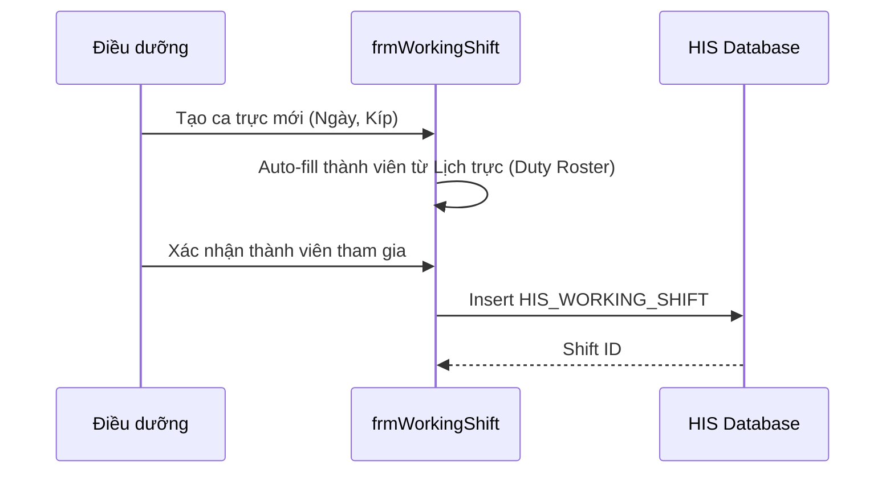

# Technical Spec: Bàn giao Ca trực (Shift Handover)

## 1. Business Mapping
*   **Ref**: [Bàn giao Ca trực](../../02-business-processes/administration/07-shift-handover.md)
*   **Scope**: Quản lý các phiên trực, bàn giao người bệnh, tài sản, thuốc giữa các kíp trực.
*   **Key Plugin**: `HIS.Desktop.Plugins.HisWorkingShift`.

## 2. Core Components
### 2.1. Plugin Main Structure
*   **Plugin Name**: `HIS.Desktop.Plugins.HisWorkingShift`.
*   **UI**: `frmWorkingShift` - Form quản lý phiên trực.
*   **Sub-components**:
    *   `UCKidneyShift` (trong `KidneyShiftSchedule`): Module bàn giao chuyên biệt cho Thận nhân tạo.

### 2.2. Logic Nghiệp vụ
*   **Shift Status**: Open (Đang trực) -> Locked (Đã chốt sổ) -> HandedOver (Đã bàn giao).
*   **Data Scope**: Khi bàn giao, hệ thống snapshot dữ liệu tồn kho thuốc tại tủ trực và danh sách bệnh nhân hiện diện.

## 3. Process Flow
### 3.1. Luồng Tạo Ca trực Mới

## 4. Database Schema
### 4.1. HIS_WORKING_SHIFT
Lưu thông tin phiên trực.
*   `ID`: PK.
*   `SHIFT_TIME`: Thời gian bắt đầu.
*   `DEPARTMENT_ID`: Khoa.
*   `CREATOR`: Người tạo.

### 4.2. HIS_SHIFT_MEMBER
Danh sách thành viên kíp trực.
*   `SHIFT_ID`: FK.
*   `EMPLOYEE_ID`: Nhân viên.
*   `ROLE_ID`: Vai trò (Trưởng kíp/Thành viên).

## 5. Integration Points
*   **Duty Roster**: Lấy dữ liệu dự kiến từ phân lịch trực (`HIS.Desktop.Plugins.DutyRostering` - *Dự kiến*).
*   **MediStock**: Kiểm kê tủ trực khi giao ca.

## 6. Common Issues
*   **Quên chốt ca**: Ca trực treo không đóng được -> Ảnh hưởng báo cáo chấm công.
