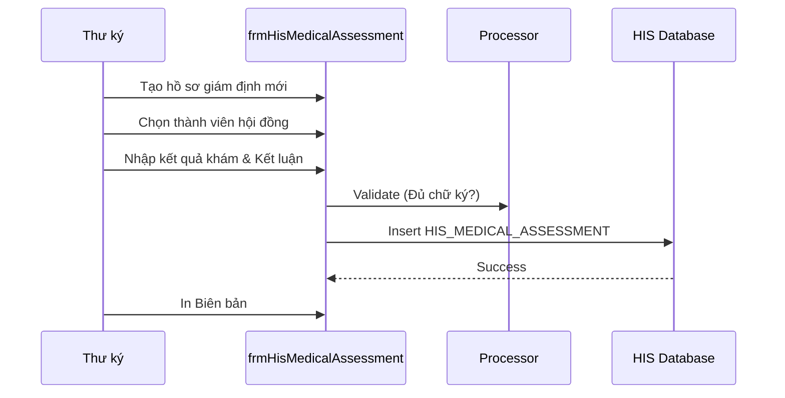

# Technical Spec: Giám định Y khoa (Medical Assessment)

## 1. Business Mapping
*   **Ref**: [Giám định Y khoa & Thương tật](../../02-business-processes/administration/12-medical-assessment.md)
*   **Scope**: Quản lý hội đồng giám định y khoa, giám định thương tật, khả năng lao động.
*   **Key Plugin**: `HIS.Desktop.Plugins.HisMedicalAssessment`.

## 2. Core Components
### 2.1. Plugin Main Structure
*   **Plugin Name**: `HIS.Desktop.Plugins.HisMedicalAssessment`.
*   **UI Components**: `frmHisMedicalAssessment`.
*   **Processor**: `HisMedicalAssessmentProcessor`.

### 2.2. Logic Nghiệp vụ
*   **Hội đồng**: Cần định nghĩa thành phần hội đồng (Chủ tịch, Thư ký, Ủy viên) từ danh sách nhân viên (`HIS_EMPLOYEE`).
*   **Quyết định**: In biên bản giám định theo mẫu của Bộ Y tế / BHXH.

## 3. Process Flow
### 3.1. Luồng Giám định

## 4. Database Schema
### 4.1. HIS_MEDICAL_ASSESSMENT
*   `ID`: PK.
*   `TREATMENT_ID`: FK.
*   `ASSESSMENT_DATE`: Ngày giám định.
*   `CONCLUSION`: Kết luận (Tỷ lệ thương tật, Xếp hạng).
*   `PRESIDENT_ID`, `SECRETARY_ID`: Các thành viên hội đồng.

## 5. Integration Points
*   **Treatment**: Hồ sơ phải ở trạng thái đã điều trị ổn định hoặc có giấy giới thiệu giám định.
*   **Fees**: Tích hợp thu phí giám định (nếu có).
