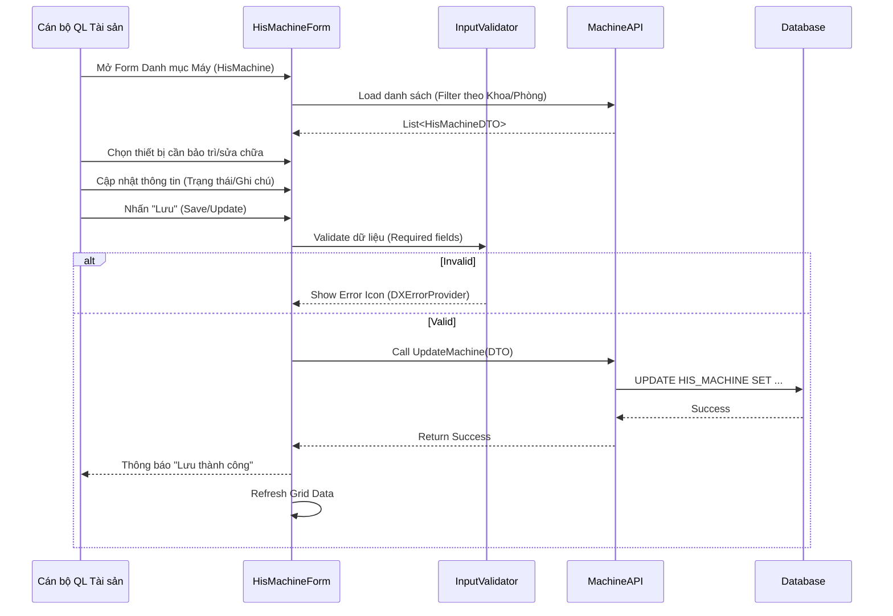

# Đặc tả Kỹ thuật: Quy trình Bảo trì Trang thiết bị (Maintenance Cycle)

## 1. Tổng quan
Tài liệu này mô tả kỹ thuật cho quy trình quản lý vòng đời và bảo trì trang thiết bị y tế. Do hệ thống hiện tại chưa có module Bảo trì chuyên sâu (Maintenance Schedule/Log), quy trình này tập trung vào việc quản lý thông tin trạng thái và cập nhật hồ sơ thiết bị trên phần mềm HIS.

## 2. Phạm vi Kỹ thuật
*   **Module**: `HIS.Desktop.Plugins.HisMachine`
*   **Chức năng**:
    *   Xem danh sách thiết bị.
    *   Cập nhật trạng thái thiết bị (Tốt, Hỏng, Đang sửa chữa).
    *   Cập nhật vị trí (Phòng ban).
    *   Ghi chú thông tin bảo dưỡng (thông qua các trường mô tả hoặc mở rộng).

## 3. Mapping Source Code

| Thành phần UI/Logic | Source Code Path | Mô tả |
| :--- | :--- | :--- |
| **Main Form** | `HIS.Desktop.Plugins.HisMachine.HisMachineForm` | Màn hình chính quản lý danh sách và chi tiết thiết bị. |
| **Grid List** | `gridControl1` / `gridView1` (trong `HisMachineForm`) | Hiển thị danh sách thiết bị với khả năng lọc/tìm kiếm. |
| **Status Update** | `SaveProcess()` method | Logic lưu thông tin cập nhật xuống DB. |
| **Room/Location** | `cboRoom` (ComboBox) | Chọn vị trí phòng đặt thiết bị (`HIS_ROOM`). |
| **DTO Mapping** | `HIS.Desktop.Plugins.HisMachine.Items.HisMachineDTO` (Dự kiến) | Object chuyển đổi dữ liệu giữa UI và API. |

## 4. Thiết kế Chi tiết

### 4.1. Cấu trúc dữ liệu liên quan (Entities)
Dựa trên `HIS.Desktop.Plugins.HisMachine`, các trường thông tin quan trọng hỗ trợ quy trình bảo trì/quản lý:

*   **`HIS_MACHINE` Table Support**:
    *   `MACHINE_CODE` / `MACHINE_NAME`: Định danh thiết bị cần bảo trì.
    *   `ROOM_ID`: Xác định khoa phòng quản lý (nơi thực hiện bảo trì).
    *   `STATUS` (hoặc trường tương đương `IS_ACTIVE`/`IS_DELETE`): Đánh dấu thiết bị có đang hoạt động hay không.
    *   `NOTE` (Ghi chú): Có thể sử dụng để ghi log ngắn gọn về lần bảo trì cuối hoặc tình trạng hiện tại.

### 4.2. Luồng Xử lý (Sequence Diagram - Cập nhật Trạng thái)

## 5. Phân tích GAP (Hạn chế)
Hiện tại, module `HIS.Desktop.Plugins.HisMachine` tập trung vào **Quản lý Danh mục (Master Data)** hơn là **Quản lý Quy trình (Process Management)**.
*   **Thiếu**: Chức năng lập lịch bảo dưỡng định kỳ (Scheduler).
*   **Thiếu**: Lịch sử sửa chữa chi tiết (Maintenance Log/History) gắn liền với từng máy (cần kiểm tra thêm nếu có bảng con `HIS_MACHINE_LOG` nhưng chưa thấy trên UI chính).
*   **Thiếu**: Cảnh báo tự động khi đến hạn bảo trì.

> **Khuyến nghị**: Đối với quy trình Bảo trì chuyên sâu được mô tả trong tài liệu nghiệp vụ, hệ thống hiện tại đáp ứng ở mức **Quản lý Hồ sơ**. Các bước lập kế hoạch và theo dõi chi tiết có thể cần thực hiện ngoài hệ thống hoặc phát triển thêm Module `Maintenance`.
