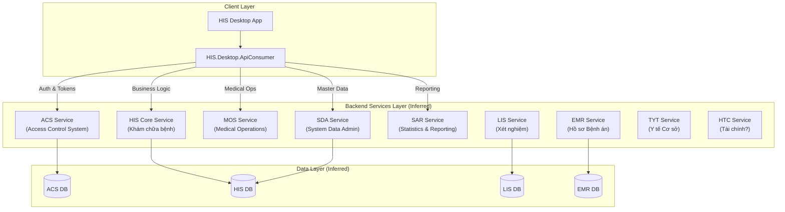

# Hạ tầng Server (Backend Infrastructure)

> [!CAUTION]
> **CẢNH BÁO QUAN TRỌNG: THIẾU SOURCE CODE BACKEND**
> 
> Bộ source code hiện tại trong repository này **CHỈ BAO GỒM PHẦN CLIENT (DESKTOP APP)**.
> 
> Toàn bộ phần Hạ tầng Server (Backend API, Database, Deployment Scripts) **KHÔNG TỒN TẠI** trong repository này. Các thông tin dưới đây là **SUY LUẬN** dựa trên cấu trúc của Client (`HIS.Desktop.ApiConsumer`) và các tài liệu kiến trúc liên quan.

## 1. Tổng quan Kiến trúc Giả định

Hệ thống HIS Backend được thiết kế theo mô hình **Service-Oriented Architecture (SOA)** hoặc **Microservices**, phân chia thành các cụm dịch vụ nghiệp vụ riêng biệt.

Client (HIS Desktop) giao tiếp với các dịch vụ này thông qua **RESTful API** và được định tuyến bởi lớp `ApiConsumer`.

## 2. Các Dịch vụ Server Chính (Server Services)

Dựa trên `ApiConsumers.cs`, hệ thống bao gồm các Service Endpoint chính sau:

| Mã Dịch vụ | Tên đầy đủ (Dự đoán) | Vai trò Chính (Suy luận từ API Store) | API Prefixes Điển hình |
|:---|:---|:---|:---|
| **ACS** | Access Control System | **Xác thực & Phân quyền**. Quản lý User, Role, Token, Session. | `api/AcsUser/*`, `api/AcsToken/*` |
| **SDA** | System Data Administration | **Quản trị Danh mục dùng chung**. Quản lý ICD, Dân tộc, Tỉnh/Huyện, Cấu hình hệ thống. | `api/SdaProvince/*`, `api/SdaConfig/*` |
| **HIS** | Hospital Information System | **Nghiệp vụ Cốt lõi**. Quản lý Tiếp đón, Khám bệnh, Viện phí, Dược, Nội trú. Service lớn nhất. | `api/HisPatient/*`, `api/HisTreatment/*`, `api/HisBill/*` |
| **MOS** | Medical Operation System | **Vận hành Y tế**. Nghiệp vụ y tế chuyên sâu, có thể tách từ HIS? | *(Dùng chung cấu trúc API với HIS)* |
| **SAR** | Statistics And Reporting | **Báo cáo Thống kê**. Tổng hợp số liệu, xuất báo cáo BHYT, báo cáo Bộ Y tế. | `api/SarReport/*` |
| **EMR** | Electronic Medical Record | **Hồ sơ Bệnh án Điện tử**. Ký số, lưu trữ văn bản bệnh án chuẩn HL7/CDA. | `api/EmrDocument/*` |
| **LIS** | Laboratory Info System | **Hệ thống Xét nghiệm**. Kết nối máy xét nghiệm, quản lý mẫu bệnh phẩm. | `api/LisSample/*` |
| **HTC** | *(Unknown - Finance?)* | Khả năng cao là module Tài chính Kế toán hoặc Vật tư (High Tech?). | `api/Htc*` |
| **TYT** | Tram Y Te | Hệ thống dành cho Trạm Y tế xã/phường. | `api/Tyt*` |

## 3. Cơ chế Giao tiếp & Dữ liệu

### 3.1. Authentication (Xác thực)
*   **Token-based Auth**: `AcsConsumer` chịu trách nhiệm lấy Token (`TokenCode`) sau khi đăng nhập.
*   **Propagation**: Token này được inject vào **Header** của tất cả các request đến các Service khác (HIS, MOS, SDA...) để xác thực người dùng.

### 3.2. Data Payload
*   **Format**: JSON.
*   **Cấu trúc Request**: Thường gửi object DTO (Data Transfer Object) lên server.
*   **Cấu trúc Response**: Server trả về JSON, Client dùng `Newtonsoft.Json` để deserialize ra các object ADO/DTO tương ứng.

### 3.3. Các "Store" URI Quan trọng
Các file `*RequestUriStore.cs` trong `HIS.Desktop.ApiConsumer` đóng vai trò là "Bản đồ API" (API Dictionary):
*   `HisRequestUriStore.cs`: Chứa hàng trăm endpoint cho nghiệp vụ khám chữa bệnh (lớn nhất).
*   `SdaRequestUriStore.cs`: Chứa các endpoint danh mục (Tỉnh, Huyện, Dân tộc...).
*   `AcsRequestUriStore.cs`: Chứa các endpoint đăng nhập, lấy thông tin user.

## 4. Tình trạng Database (Cơ sở dữ liệu)

Mặc dù không có script tạo bảng, tên các API Endpoint gợi ý rất rõ về cấu trúc bảng (Table Schema) phía sau.

**Quy tắc đặt tên:** `api/{EntityName}/{Action}` thường tương ứng với bảng `HIS_{ENTITY_NAME}` hoặc `SDA_{ENTITY_NAME}` trong Oracle/SQL Server.

**Ví dụ Mapping:**
*   API `api/HisPatient/Get` -> Khả năng cao truy vấn bảng **`HIS_PATIENT`**.
*   API `api/HisTreatment/Get` -> Bảng **`HIS_TREATMENT`** (Lượt điều trị).
*   API `api/HisSereServ/Get` -> Bảng **`HIS_SERE_SERV`** (Service Request & Service - Dịch vụ chỉ định).
*   API `api/HisExpMest/Create` -> Bảng **`HIS_EXP_MEST`** (Export Medicine Store - Phiếu xuất kho).

> [!TIP]
> **Dev Tip**: Khi cần biết cấu trúc dữ liệu của một bảng, hãy tìm class DTO tương ứng trong `HIS.Desktop.ADO` (ví dụ `HisPatientADO`) hoặc xem tham số đầu vào của hàm gọi API trong `ApiConsumer`.

## 5. Khuyến nghị cho Developer

Do thiếu Backend, quy trình làm việc (WorkfloW) nên là:
1.  **Coi API là "Hộp đen" (Blackbox)**: Chỉ quan tâm Input (Request) và Output (Response).
2.  **Sử dụng `ApiConsumer` có sẵn**: Đừng cố viết lại HTTP Client. Hãy dùng các hàm static trong `ApiConsumers.MosConsumer`, `ApiConsumers.HisConsumer`...
3.  **Debug qua Log**: Nếu gọi API lỗi, hãy check log (`Inventec.Common.Logging`) để xem URL thực tế và Body request bị lỗi là gì.
4.  **Mocking (nếu cần)**: Nếu muốn dev offline, cần viết một Mock Server giả lập lại các endpoint trong `RequestUriStore` trả về JSON mẫu.
