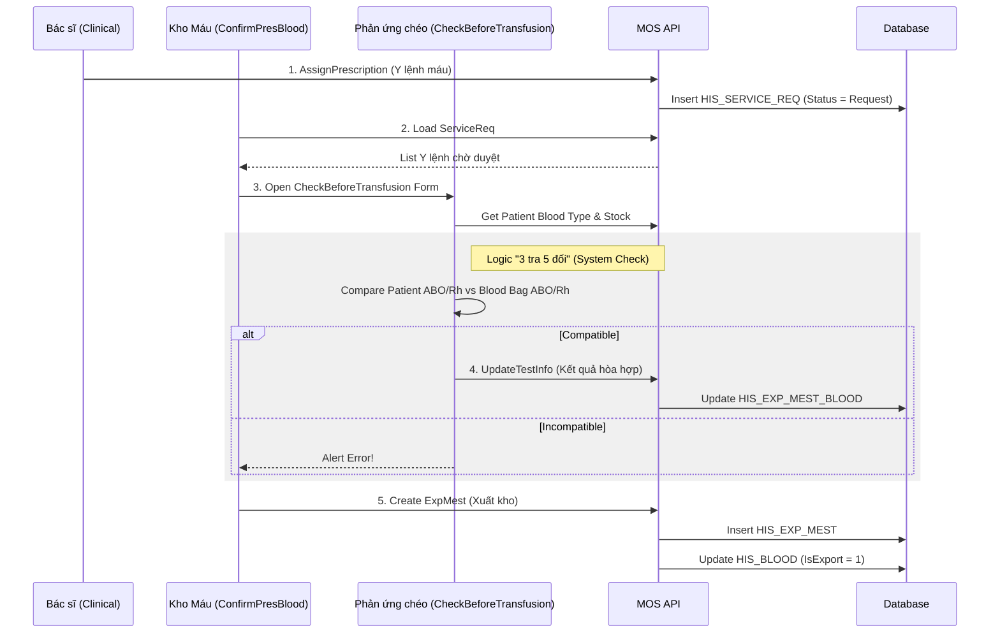
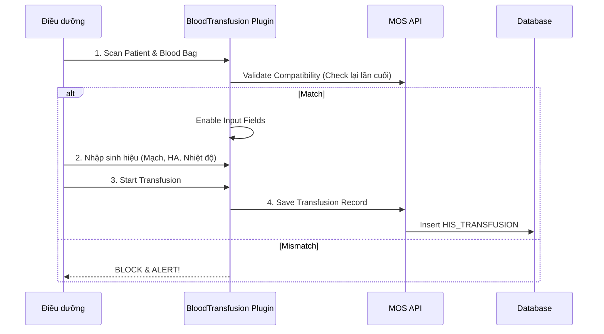

# Technical Spec: Quy trình Quản lý Máu (Blood Transfusion)

## 1. Business Mapping
*   **Ref**: [Quy trình Quản lý Máu & Truyền máu](../../02-business-processes/blood-bank/01-blood-transfusion.md)
*   **Scope**: Mô tả chi tiết kỹ thuật cho toàn bộ vòng đời của túi máu: Nhập kho, Lưu trữ, Định nhóm/Phản ứng chéo, Cấp phát, và Truyền máu tại lâm sàng.
*   **Key Plugins**:
    *   `HIS.Desktop.Plugins.ImportBlood`
    *   `HIS.Desktop.Plugins.BloodTypeInStock`
    *   `HIS.Desktop.Plugins.ConfirmPresBlood`
    *   `HIS.Desktop.Plugins.HisCheckBeforeTransfusionBlood`
    *   `HIS.Desktop.Plugins.BloodTransfusion`

## 2. Core Components (Codebase Mapping)

### 2.1. Nhập Máu (Blood Import)
*   **Plugin Name**: `HIS.Desktop.Plugins.ImportBlood`
*   **Extension Point**: `DesktopRootExtensionPoint` (PointName: `HIS.Desktop.Plugins.ImportBlood`).
*   **Processor**: `ImportBloodProcessor.cs`.
*   **Main UI**: `UCImportBloodPlus.cs` -> `frmImportBlood.cs`.
*   **API**:
    *   `api/HisImpMest/ManuCreate`: Tạo phiếu nhập.
    *   `api/HisImpMest/DonationCreate`: Nhập từ nguồn hiến máu.

### 2.2. Kiểm kê & Tồn kho (Inventory)
*   **Plugin Name**: `HIS.Desktop.Plugins.BloodTypeInStock`
*   **Extension Point**: `DesktopRootExtensionPoint` (PointName: `HIS.Desktop.Plugins.BloodTypeInStock`).
*   **Processor**: `BloodTypeInStockProcessor.cs`.
*   **Main UI**: `UCBloodTypeInStock.cs`.
*   **Logic**: Sử dụng `BloodTypeInStockFactory` để khởi tạo behavior hiển thị tồn kho theo chế phẩm/nhóm máu.

### 2.3. Duyệt Dự trù & Xuất kho (Confirm & Dispense)
*   **Plugin Name**: `HIS.Desktop.Plugins.ConfirmPresBlood`
*   **Extension Point**: `DesktopRootExtensionPoint` (PointName: `HIS.Desktop.Plugins.ConfirmPresBlood`).
*   **Processor**: `ConfirmPresBloodProcessor.cs`.
*   **Main UI**: `frmConfirmPresBlood.cs`.
*   **Data Model**: `VHisBloodADO` (Map từ `V_HIS_BLOOD`).

### 2.4. Phản ứng chéo (Cross-Matching)
*   **Plugin Name**: `HIS.Desktop.Plugins.HisCheckBeforeTransfusionBlood`
*   **Extension Point**: `DesktopRootExtensionPoint` (PointName: `HIS.Desktop.Plugins.HisCheckBeforeTransfusionBlood`).
*   **Processor**: `HisCheckBeforeTransfusionBloodProcesser.cs`.
*   **Main UI**: `frmHisCheckBeforeTransfusionBlood.cs`.
*   **API**:
    *   `api/HisExpMest/UpdateTestInfo`: Cập nhật kết quả hòa hợp.
    *   `api/HisExpMestBlood/Get`: Lấy thông tin máu chờ cấp phát.

### 2.5. Truyền máu (Clinical Transfusion)
*   **Plugin Name**: `HIS.Desktop.Plugins.BloodTransfusion`
*   **Extension Point**: `DesktopRootExtensionPoint` (PointName: `HIS.Desktop.Plugins.BloodTransfusion`).
*   **Processor**: `BloodTransfusionProcessor.cs`.
*   **Main UI**: `frmBloodTransfusion.cs`.
*   **Data Model**: `TransfusionADO` (Map từ `HIS_TRANSFUSION`).

## 3. Process Flow (Technical Deep Dive)

### 3.1. Quy trình Phản ứng chéo & Cấp phát (Cross-match & Dispense)
Quy trình này đảm bảo an toàn tuyệt đối trước khi túi máu rời kho.

### 3.2. Quy trình Truyền máu tại Lâm sàng (Clinical Transfusion)
Ghi nhận thực tế việc truyền máu cho bệnh nhân.

## 4. Database Schema

### 4.1. HIS_BLOOD (Túi Máu Detail)
Lưu thông tin chi tiết từng đơn vị máu.
*   `ID`: PK.
*   `BLOOD_CODE`: Mã túi máu (Barcode).
*   `BLOOD_ABO_ID`: FK `HIS_BLOOD_ABO` (A, B, O, AB).
*   `BLOOD_RH_ID`: FK `HIS_BLOOD_RH` (+, -).
*   `BLOOD_TYPE_ID`: FK `HIS_BLOOD_TYPE` (Toàn phần, Hồng cầu khối...).
*   `IMP_MEST_ID`: FK phiếu nhập.
*   `EXP_MEST_ID`: FK phiếu xuất (Nullable - nếu chưa xuất).
*   `IS_EXPEND`: Trạng thái đã xuất.

### 4.2. HIS_TRANSFUSION (Hồ sơ Truyền máu)
Lưu lịch sử truyền máu lâm sàng.
*   `ID`: PK.
*   `TREATMENT_ID`: FK Hồ sơ điều trị.
*   `EXP_MEST_BLOOD_ID`: FK Túi máu được truyền.
*   `MEASURE_TIME`: Thời điểm đo sinh hiệu.
*   `PULSE`, `TEMPERATURE`, `BLOOD_PRESSURE_MAX/MIN`: Sinh hiệu.
*   `TRANSFUSION_RESULT`: Kết quả/Phản ứng.

### 4.3. HIS_EXP_MEST (Phiếu Xuất)
Dùng chung với Dược, nhưng có `EXP_MEST_TYPE_ID` riêng cho Máu.
*   `ID`: PK.
*   `EXP_MEST_CODE`: Mã phiếu.
*   `SERVICE_REQ_ID`: ID y lệnh dự trù tương ứng.

## 5. Integration Points
*   **Pharmacy Module**: Chia sẻ cấu trúc `HIS_IMP_MEST` và `HIS_EXP_MEST` nhưng khác xử lý logic (Máu quản lý theo từng túi `Serial/Barcode`, Thuốc quản lý theo Lô).
*   **Clinical Module**:
    *   Input: `HIS_SERVICE_REQ` (Y lệnh dự trù máu từ bác sĩ).
    *   Output: `HIS_TRANSFUSION` (Kết quả truyền máu hiển thị trên bệnh án).
*   **Laboratory (LIS)**: (Optional) Nhận kết quả định nhóm máu bệnh nhân tự động.
