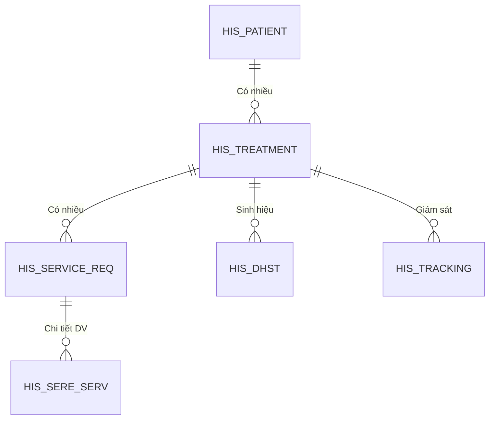

# Thiết kế Kỹ thuật: Phân hệ Lâm sàng (Clinical)

## 1. Tổng quan Architecture
Phân hệ Clinical là trung tâm của hệ thống HIS, hoạt động dựa trên mô hình **Plugin-based Architecture** của HIS Desktop.
Tất cả các nghiệp vụ được đóng gói thành các `Module` (UserControl) hoặc `Form` độc lập, giao tiếp với Core qua `IDesktopRoot` interface.

### 1.1. Technology Stack
*   **Frontend**: Windows Forms (DevExpress).
*   **Backend**: .NET WebAPI (RESTful).
*   **Data Access**: Entity Framework (Database First).
*   **Caching**: `HIS.Desktop.LocalStorage` (In-Memory caching cho Master Data).

## 2. Danh sách Plugin Chính
Dưới đây là mapping giữa các nhóm nghiệp vụ và Plugin thực tế (được đào sâu trong các tài liệu chi tiết).

| Nghiệp vụ | Plugin Prefix | Namespace Chính | Ghi chú |
| :--- | :--- | :--- | :--- |
| **Khám bệnh (Outpatient)** | `ExamServiceReq*` | `HIS.Desktop.Plugins.ExamServiceReqExecute` | Màn hình bác sĩ |
| **Nội trú (Inpatient)** | `TreatmentBedRoom*` | `HIS.Desktop.Plugins.TreatmentBedRoomList` | Khoa lâm sàng |
| **Tiếp đón (Reception)** | `Register*` | `HIS.Desktop.Plugins.RegisterV3` | Đăng ký khám |
| **Chỉ định (Indication)** | `AssignService*` | `HIS.Desktop.Plugins.AssignService` | CLS, XNH |
| **Dược (Prescription)** | `AssignPrescription*`| `HIS.Desktop.Plugins.AssignPrescription` | Kê đơn thuốc |
| **Hồ sơ (EMR)** | `HisTreatmentFile` | `HIS.Desktop.Plugins.HisTreatmentFile` | Hồ sơ bệnh án |

## 3. Kiến trúc Dữ liệu (Core Schema)
### 3.1. Entity Map

### 3.2. Quy ước API
*   **Prefix**: `/api/[EntityName]/[Action]`
*   **Common EntityNames**: `HisTreatment`, `HisServiceReq`, `HisSereServ`.
*   **Common Actions**: `GetView` (Search), `Create`, `Update`, `Delete`.
*   **SDO Pattern**: Dữ liệu gửi đi thường đóng gói dạng `SDO` (Service Data Object) chứa logic validate phía Server.

## 4. Tài liệu Chi tiết
Vui lòng tham khảo các tài liệu kỹ thuật chi tiết cho từng quy trình:
*   [01. Khám bệnh Ngoại trú](./01-outpatient-examination.md)
*   [02. Chỉ định Dịch vụ](./02-service-indication.md)
*   [03. Nhập viện Nội trú](./03-inpatient-admission.md)
*   [04. Điều trị Hàng ngày](./04-daily-treatment.md)
*   [05. Xuất viện & Chuyển tuyến](./05-discharge-transfer.md)
