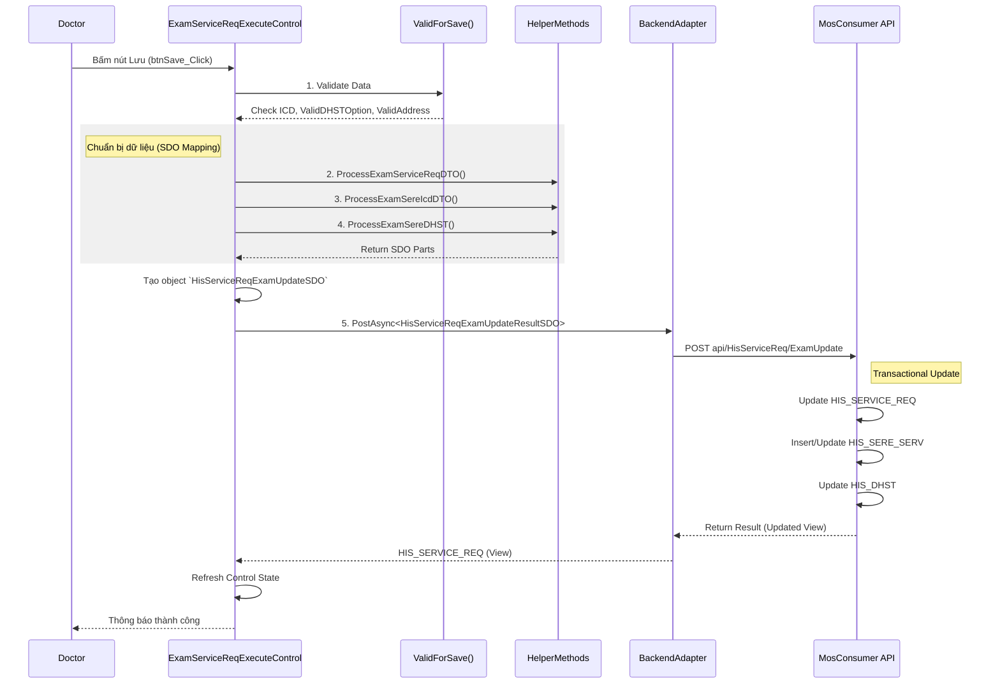

# Technical Spec: Khám bệnh Ngoại trú (Outpatient Examination)

## 1. Business Mapping
*   **Ref**: [Quy trình Khám bệnh Ngoại trú](../../02-business-processes/clinical/01-outpatient-examination.md)
*   **Scope**: Tài liệu này mô tả chi tiết kỹ thuật cho module Phòng Khám (Doctor Station), nơi bác sĩ thực hiện khám, kê đơn và kết thúc khám.
*   **Key Plugin**: `HIS.Desktop.Plugins.ExamServiceReqExecute`.

## 2. Core Components (Codebase Mapping)
### 2.1. Plugin Main Structure
*   **Plugin Name**: `HIS.Desktop.Plugins.ExamServiceReqExecute`
*   **Extension Point**: `DesktopRootExtensionPoint` (PointName: `HIS.Desktop.Plugins.ExamServiceReqExecute`).
*   **Processor**: `ExamServiceReqExecuteProcessor.cs` - Class điều phối chính.
    *   **Logic Enable**: Kiểm tra `GlobalVariables.CurrentRoomTypeCode`.

### 2.2. User Interface (UI)
*   **Main Control**: `ExamServiceReqExecuteControl.cs` (Partial class, split into many files due to complexity).
*   **Key Partial Files**:
    *   `__Process.cs`: Chứa logic xử lý nghiệp vụ chính (Save, API Call).
    *   `__InitUC.cs`: Khởi tạo các UserControl con (ICD, DHST, Thuốc).
    *   `__ValidateExam.cs`: Logic validate dữ liệu trước khi lưu.
*   **Sub-Forms**:
    *   `frmSecondaryIcd.cs`: Form chọn bệnh kèm theo.
    *   `frmXemGiayChuyenTuyen.cs`: Form xem thông tin chuyển tuyến.

## 3. Process Flow (Technical Deep Dive)

### 3.1. Luồng Lưu Kết quả Khám (Save Examination)
Đây là luồng quan trọng nhất, trigger khi bác sĩ bấm nút "Lưu" hoặc chuyển bệnh nhân.

### 3.2. Logic Validate (Client-Side)
Logic validate nằm trong `__ValidateExam.cs` và `__Process.cs`:
*   **ICD Validation**: Kiểm tra mã ICD có tồn tại trong danh mục không (`currentIcds`).
*   **Hospitalization Reason**: Bắt buộc nhập lý do khám nếu config `HOSPITALIZATION_REASON__REQUIRED == 1`.
*   **Vital Signs (DHST)**: Kiểm tra Mạch/Nhiệt/Huyết áp nếu config yêu cầu (CodeConfig: `DHST_REQUIRED_OPTION`).

## 4. Database Schema
Các bảng dữ liệu chịu tác động trực tiếp trong quá trình này:

### 4.1. HIS_SERVICE_REQ (Header)
Bảng chính lưu trữ thông tin phiếu khám.
*   `ID`: PK.
*   `ICD_CODE`: Mã bệnh chính (Update).
*   `ICD_SUB_CODE`: Mã bệnh phụ (Update).
*   `ICD_TEXT`: Chẩn đoán text.
*   `TREATMENT_INSTRUCTION`: Hướng điều trị/Lời dặn.
*   `HOSPITALIZATION_REASON`: Lý do khám.

### 4.2. HIS_DHST (Vital Signs)
Lưu thông tin sinh hiệu.
*   `ID`: PK.
*   `TREATMENT_ID`: FK.
*   `TEMPERATURE`: Nhiệt độ.
*   `BREATH_RATE`: Nhịp thở.
*   `PULSE`: Mạch.
*   `BLOOD_PRESSURE_MAX` / `MIN`: Huyết áp.

### 4.3. HIS_SERE_SERV (Services)
Lưu các dịch vụ công khám (Exam Fee).
*   Dịch vụ công khám thường được insert tự động khi đăng ký, nhưng có thể update trạng thái tại đây.

## 5. Integration Points
Module này tích hợp với nhiều module khác thông qua `PluginInstance`:
*   **`HIS.Desktop.Plugins.AppointmentService`**: Đặt lịch hẹn (Trigger: `onClickDichVuHenKham`).
*   **`HIS.Desktop.Plugins.HisAssignBlood`**: Chỉ định máu (Trigger: `onClickAssBlood`).
*   **`HIS.Desktop.Plugins.EmrDocument`**: Xem hồ sơ EMR (Trigger: `onClickChiTietBenhAn`).
*   **`HIS.Desktop.Plugins.DebateDiagnostic`**: Hội chẩn (Trigger: `onClickDebateDiagnostic`).

## 6. Common Issues & Troubleshooting
*   **Lỗi Validate ICD**: Thường do mã ICD bị inactive trong danh mục nhưng bác sĩ vẫn gõ tay.
*   **Lỗi DHST**: Config bắt buộc nhập nhưng user để trống -> Chặn lưu.
*   **Mất kết nối API**: Xử lý qua `try/catch` trong `onClickSaveFormAsyncForOtherButtonClick`, log vào `LogSystem`.
