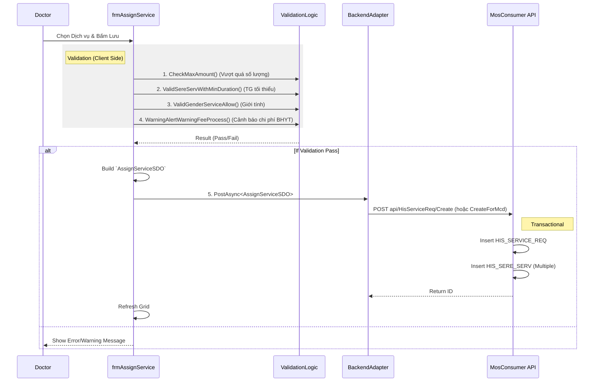

# Technical Spec: Chỉ định Dịch vụ (Service Indication)

## 1. Business Mapping
*   **Ref**: [Quy trình Chỉ định Dịch vụ](../../02-business-processes/clinical/02-service-indication.md)
*   **Scope**: Mô tả kỹ thuật cho việc chỉ định CLS (Xét nghiệm, CĐHA, Thăm dò chức năng) và các dịch vụ kỹ thuật khác.
*   **Key Plugin**: `HIS.Desktop.Plugins.AssignService`.

## 2. Core Components (Codebase Mapping)
### 2.1. Plugin Main Structure
*   **Plugin Name**: `HIS.Desktop.Plugins.AssignService`
*   **Extension Point**: `DesktopRootExtensionPoint`.
*   **Processor**: `AssignServiceProcessor.cs`.

### 2.2. User Interface (UI)
*   **Main Form**: `frmAssignService.cs`.
    *   **Partial `__Load.cs`**: Load danh sách dịch vụ (`api/HisSereServ/Get`), Load danh mục (`api/HisService/Get`).
    *   **Partial `__Save.cs`**: Logic validate, kiểm tra BHYT và gọi API lưu.
    *   **Partial `__Validate.cs`**: Các hàm kiểm tra điều kiện (Tuổi, Giới tính, Tương tác).
*   **Grid Control**: `gridViewServiceProcess` hiển thị danh sách dịch vụ đã chọn.

## 3. Process Flow (Technical Deep Dive)

### 3.1. Luồng Chỉ định & Lưu (Assign & Save)
Luồng này xử lý việc tạo mới `HIS_SERVICE_REQ` và các `HIS_SERE_SERV` con.

### 3.2. Logic Cảnh báo & Validate (Complex Logic)
*   **CheckMaxAmount**: Kiểm tra số lượng dịch vụ đã chỉ định trong đợt điều trị so với giới hạn.
    *   *Source*: `frmAssignService__Save.cs` -> `CheckMaxAmount`.
*   **CheckFee**: Kiểm tra bệnh nhân có đủ tiền tạm ứng không (nếu là đối tượng Thu phí).
    *   *Source*: `VerifyCheckFeeWhileAssign`.
*   **BHYT Limit**: Kiểm tra trần chi phí BHYT.
    *   *Source*: `GetHeinLimitPrice`.

## 4. Database Schema
### 4.1. Entity Relationships
*   `HIS_SERVICE_REQ`: Yêu cầu chung (1 record).
*   `HIS_SERE_SERV`: Chi tiết từng dịch vụ (N records).
    *   `SERVICE_ID`: FK to `HIS_SERVICE`.
    *   `PATIENT_TYPE_ID`: Đối tượng thanh toán (BHYT/Dịch vụ).
    *   `AMOUNT`: Số lượng.
    *   `ORIGINAL_PRICE`, `DISCOUNT`, `VAT_RATIO`.

### 4.2. Key Tables Referenced
*   `HIS_SERVICE_PATY`: Giá dịch vụ theo đối tượng (Dùng để tính tiền `GetFullTotalPriceServiceSelected`).
*   `HIS_SERVICE_MACHINE`: Máy thực hiện (nếu có).

## 5. Integration Points
*   **LIS/PACS Integration**: Khi `HIS_SERVICE_REQ` được tạo với trạng thái `SEND`, hệ thống integration sẽ quét và gửi bản tin HL7 sang LIS/PACS.
*   **Material Management**: Nếu dịch vụ có vật tư tiêu hao đi kèm (Định mức), hệ thống sẽ tự động tạo phiếu xuất (`HIS_EXP_MEST`) tương ứng (Server-side logic).

## 6. Common Issues
*   **Sai giá**: Do cấu hình `HIS_SERVICE_PATY` chưa đúng thời gian hiệu lực.
*   **Không hiện dịch vụ**: Do `HIS_SERVICE_ROOM` chưa phân quyền dịch vụ cho phòng hiện tại.
