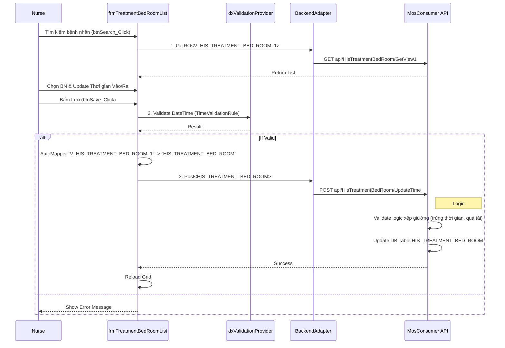

# Technical Spec: Tiếp nhận Nội trú (Inpatient Admission)

## 1. Business Mapping
*   **Ref**: [Quy trình Tiếp nhận Nội trú](../../02-business-processes/clinical/03-inpatient-admission.md)
*   **Scope**: Mô tả kỹ thuật cho việc tiếp nhận bệnh nhân vào khoa điều trị nội trú, bao gồm xếp giường và xác nhận thông tin chuyển khoa/chuyển tuyến.
*   **Key Plugin**: `HIS.Desktop.Plugins.TreatmentBedRoomList` (Quản lý buồng giường) và `HIS.Desktop.Plugins.HisTranPatiToInfo` (Thông tin chuyển tuyến).

## 2. Core Components (Codebase Mapping)
### 2.1. Plugin Main Structure
*   **Plugin Name**: `HIS.Desktop.Plugins.TreatmentBedRoomList`
*   **Extension Point**: `DesktopRootExtensionPoint`.
*   **Processor**: `TreatmentBedRoomListProcessor.cs`.

### 2.2. User Interface (UI)
*   **Main Form**: `frmTreatmentBedRoomList.cs` (Quản lý danh sách người bệnh tại khoa và xếp giường).
    *   **Features**: Tìm kiếm bệnh nhân, gán buồng giường, cập nhật thời gian vào/ra.
*   **Sub Form**: `frmHisTranPatiToInfo.cs` (Xem/Sửa thông tin chuyển tuyến/chuyển khoa).
    *   **Functions**: Update `HIS_TREATMENT` với thông tin `TRANSFER_IN`.

## 3. Process Flow (Technical Deep Dive)

### 3.1. Luồng Xếp Giường (Bed Assignment)
Đây là nghiệp vụ chính của điều dưỡng hành chính khi bệnh nhân vào khoa.

### 3.2. Luồng Cập nhật Thông tin Chuyển đến (Update Transfer In Info)
*   **Form**: `frmHisTranPatiToInfo`.
*   **API**: `POST api/HisTreatment/UpdateTranPatiInfo`.
*   **Logic**:
    *   Cập nhật các trường `TRANSFER_IN_MEDI_ORG_CODE` (Nơi chuyển đến), `TRANSFER_IN_TIME_FROM` (Thời gian bắt đầu BHYT), `TRANSFER_IN_ICD_CODE` (Chẩn đoán tuyến dưới).
    *   Sử dụng `HisTreatmentTranPatiSDO` để đóng gói dữ liệu.

## 4. Database Schema
### 4.1. HIS_TREATMENT_BED_ROOM (Quản lý Buồng Giường)
Bảng trung gian quan trọng theo dõi vị trí bệnh nhân.
*   `ID`: PK.
*   `TREATMENT_ID`: FK `HIS_TREATMENT`.
*   `BED_ROOM_ID`: FK `HIS_BED_ROOM` (Buồng bệnh).
*   `ADD_TIME`: Thời gian vào buồng (Num 14).
*   `REMOVE_TIME`: Thời gian ra buồng (Num 14, Nullable nếu đang nằm).
*   `DEPARTMENT_ID`: Khoa quản lý.

### 4.2. HIS_TREATMENT_TYPE (Loại Điều Trị)
*   `ID`: PK.
*   Trạng thái bệnh nhân chuyển đổi từ `Kham` (Outpatient Exam) sang `NoiTru` (Inpatient) thông qua việc thay đổi `TDL_TREATMENT_TYPE_ID`.

## 5. Integration Points
*   **Billing (Vien Phi)**: Thời gian nằm giường (`ADD_TIME` đến `REMOVE_TIME`) được dùng để tính tiền giường tự động nếu có cấu hình `AutoCalculateBedPrice`.
*   **Medical Record (Benh An)**: Thông tin xếp giường được hiển thị trên tờ điều trị và bệnh án chi tiết.

## 6. Common Issues
*   **Lỗi trùng thời gian**: Không thể xếp 1 bệnh nhân vào 2 giường cùng 1 khoảng thời gian. API backend sẽ chặn.
*   **Không thấy buồng**: Do chưa cấu hình `HIS_BED_ROOM` thuộc khoa hiện tại hoặc chưa phân quyền.
