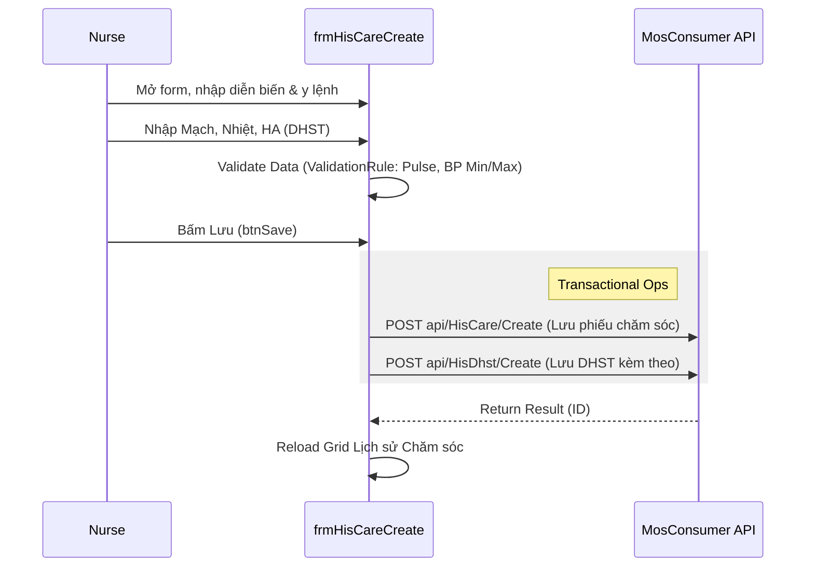

# Technical Spec: Điều trị & Chăm sóc Hàng ngày (Daily Treatment)

## 1. Business Mapping
*   **Ref**: [Quy trình Điều trị Hàng ngày](../../02-business-processes/clinical/04-daily-treatment.md)
*   **Scope**: Mô tả kỹ thuật cho việc ra y lệnh (Doctor) và chăm sóc (Nurse) tại khoa nội trú.
*   **Key Plugins**:
    *   `HIS.Desktop.Plugins.ServiceExecute` (Xử lý Y lệnh / Cận lâm sàng).
    *   `HIS.Desktop.Plugins.CareCreate` (Lập phiếu chăm sóc).

## 2. Core Components (Codebase Mapping)
### 2.1. Service Execution (Doctor/Technician View)
*   **Plugin Name**: `HIS.Desktop.Plugins.ServiceExecute`.
*   **Main Control**: `UCServiceExecute.cs`.
    *   **Functions**: Xem danh sách dịch vụ chỉ định, nhập kết quả (nếu là CLS tại chỗ), xem PACS/LIS.
    *   **Logic**:
        *   Load danh sách dịch vụ: `api/HisSereServ/Get`.
        *   Tích hợp PACS: `UCServiceExecute_PlusCamera.cs`, `UCServiceExecute_PlusViewImage.cs`.
        *   Xử lý Ekip thực hiện: `UCServiceExecute_PlusEkip.cs`.

### 2.2. Nursing Care (Care Sheet)
*   **Plugin Name**: `HIS.Desktop.Plugins.CareCreate`.
*   **Main Form**: `frmHisCareCreate.cs`.
    *   **Features**:
        *   Ghi phiếu chăm sóc (`HIS_CARE`).
        *   Ghi dấu hiệu sinh tồn (`HIS_DHST`).
        *   Đánh giá dinh dưỡng và y lệnh chăm sóc.

## 3. Process Flow (Technical Deep Dive)

### 3.1. Luồng Lập Phiếu Chăm sóc (Create Care Slip)

### 3.2. Luồng Xử lý Dịch vụ (Service Execute)
*   **Load Data**:
    *   `GetDataFromRam()`: Load Cache danh mục (`HIS_SERVICE`, `HIS_DEPARTMENT`, `HIS_EXECUTE_ROLE`).
    *   `GetDataDefaultHisBedLog()`: Lấy lịch sử nằm giường để hiển thị ngữ cảnh (`api/HisBedLog/GetView`).
    *   `GetDataDefaultHisDHST()`: Lấy sinh hiệu mới nhất (`api/HisDhst/Get`).
*   **Logic Ekip**:
    *   Hỗ trợ `Timer` để load thông tin Ekip (`timerLoadEkip`).
    *   Lưu thông tin Ekip vào `HIS_EKIP_USER`.

## 4. Database Schema
### 4.1. HIS_CARE (Phiếu chăm sóc)
*   `ID`: PK.
*   `TREATMENT_ID`: FK `HIS_TREATMENT`.
*   `CARE_TIME`: Thời gian chăm sóc.
*   `AWARENESS_CONDITION`: Tình trạng ý thức (Tỉnh, Mê...).
*   `HAVE_DRUG`: Có dùng thuốc không (1/0).

### 4.2. HIS_DHST (Dấu hiệu sinh tồn)
*   `ID`: PK.
*   `CARE_ID`: FK `HIS_CARE` (Optional - DHST có thể độc lập hoặc gắn với phiếu chăm sóc).
*   `TEMPERATURE`, `PULSE`, `BLOOD_PRESSURE_MAX`, `BLOOD_PRESSURE_MIN`.
*   `HEIGHT`, `WEIGHT` (Dùng tính BMI).

### 4.3. HIS_SERE_SERV (Chi tiết chỉ định)
*   Bảng trung tâm lưu trữ mọi dịch vụ (Thuốc, CLS, Giường) của bệnh nhân.
*   `HIS_SERE_SERV_EXT`: Bảng mở rộng lưu thông tin trả kết quả (Mô tả, Kết luận).

## 5. Integration Points
*   **EMR**: Dữ liệu `HIS_CARE` và `HIS_DHST` được đồng bộ sang hồ sơ bệnh án điện tử (EMR) để ký số.
*   **PACS**: `UCServiceExecute` tích hợp trực tiếp xem ảnh DICOM từ PACS server thông qua cấu hình `ConnectPacsByFss`.

## 6. Common Issues
*   **DHST Validation**: Nhập huyết áp Min > Max sẽ bị chặn bởi `SpinEditValidationRule`.
*   **Ekip Lag**: Khi load danh sách Ekip cho nhiều dịch vụ cùng lúc có thể gây chậm (`timerLoadEkip`).
