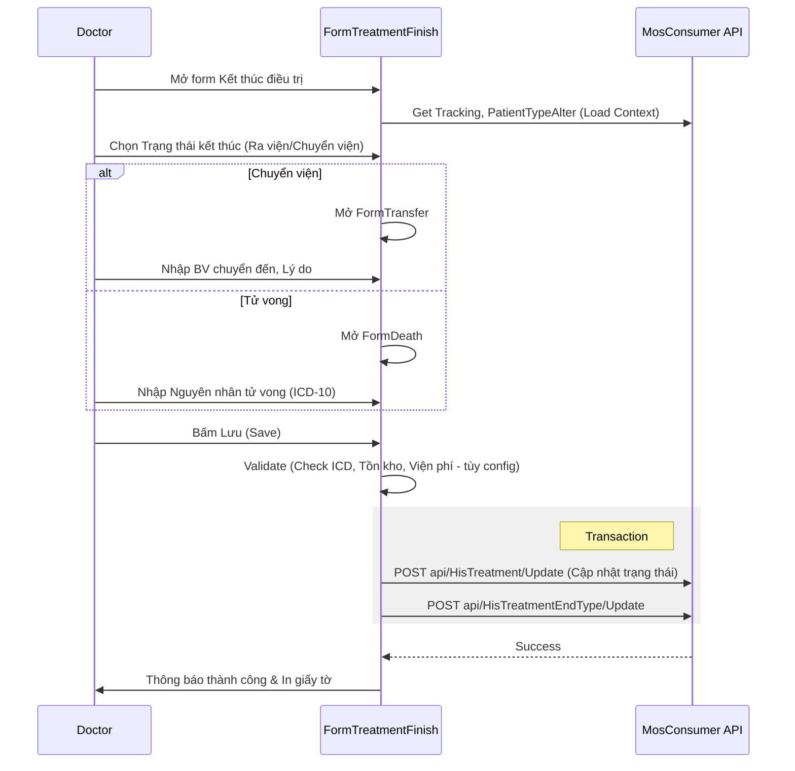

# Technical Spec: Xuất viện & Chuyển viện (Discharge & Transfer)

## 1. Business Mapping
*   **Ref**: [Quy trình Xuất viện & Chuyển viện](../../02-business-processes/clinical/05-discharge-transfer.md)
*   **Scope**: Mô tả kỹ thuật cho các quy trình kết thúc điều trị, bao gồm: Ra viện, Chuyển viện, Tử vong, Chuyển khoa.
*   **Key Plugins**:
    *   `HIS.Desktop.Plugins.TreatmentFinish` (Xử lý Kết thúc Điều trị).
    *   `HIS.Desktop.Plugins.TreatmentEndType` (Chọn lý do kết thúc).
    *   `HIS.Desktop.Plugins.TranPatiTech` (Danh mục Kỹ thuật chuyển tuyến - Configuration).
    *   `HIS.Desktop.Plugins.TranPatiToInfo` (Thông tin Chuyển tuyến).

## 2. Core Components (Codebase Mapping)
### 2.1. Treatment Finish (Main Controller)
*   **Plugin Name**: `HIS.Desktop.Plugins.TreatmentFinish`.
*   **Main Form**: `FormTreatmentFinish.cs`.
    *   **Functions**: Màn hình tổng hợp để bác sĩ/điều dưỡng chốt hồ sơ, chọn loại kết thúc (Ra viện/Chuyển viện/Tử vong).
    *   **Sub-Forms**:
        *   `CloseTreatment.FormTransfer`: Form xử lý chuyển viện (gọi `TranPatiToInfo`).
        *   `CloseTreatment.FormDeath`: Form xử lý tử vong (gọi `DeathInformation`).
        *   `CloseTreatment.FormAppointment`: Form hẹn khám lại.

### 2.2. Transfer Information (Chuyển tuyến)
*   **Plugin Name**: `HIS.Desktop.Plugins.TranPatiToInfo`.
*   **Logic**:
    *   Lưu thông tin vào `HIS_TREATMENT.TRANSFER_IN_...` (nếu chuyển đến) hoặc `HIS_TREATMENT.TRANSFER_OUT_...` (nếu chuyển đi).
    *   Validate mã bệnh viện chuyển đến (MediOrgCode).

## 3. Process Flow (Technical Deep Dive)

### 3.1. Luồng Kết thúc Điều trị (Finish Treatment)

### 3.2. Data Loading Logic
*   **Multi-threading Loading**:
    *   `CreateThreadGetData1()`: Load `Treatment`, `Tracking`, `ICD` song song.
    *   `CreateThreadGetData2()`: Load `Patient`, `PatientProgram`, `DataStore`.
*   **Validation Check**:
    *   Check ICD: `IcdProcessor`.
    *   Check Viện phí/Tồn kho: `ProcessCheckMaterialInvoice`.

## 4. Database Schema
### 4.1. HIS_TREATMENT (Hồ sơ điều trị)
*   `TREATMENT_END_TYPE_ID`: Loại kết thúc (FK `HIS_TREATMENT_END_TYPE`).
*   `IS_PAUSE`: Trạng thái tạm dừng/kết thúc (1 = Kết thúc).
*   `OUT_TIME`: Thời gian ra viện.
*   `TRANSFER_IN/OUT_MEDI_ORG_CODE`: Mã BV chuyển đến/đi.

### 4.2. HIS_DEATH_INFORMATION (Thông tin tử vong)
*   Lưu trữ chi tiết nếu `TREATMENT_END_TYPE` là Tử vong.
*   `DEATH_TIME`: Thời gian tử vong.
*   `MAIN_CAUSE`, `SUB_CAUSE`: Nguyên nhân (ICD).

## 5. Integration Points
*   **BHYT (Health Insurance)**: Dữ liệu chuyển tuyến và ra viện được ánh xạ trực tiếp sang XML 4210 để giám định BHYT.
*   **Medical Record (Lưu trữ)**: Sau khi kết thúc, hồ sơ chuyển sang trạng thái chờ Lưu trữ (Medical Record Store).
*   **Inventory**: Kiểm tra thuốc/vật tư chưa phát (`DataStore`) trước khi cho phép ra viện.

## 6. Common Issues
*   **ICD Lock**: Hệ thống yêu cầu bắt buộc nhập ICD chẩn đoán xác định trước khi chọn Chuyển viện/Ra viện.
*   **Time Validation**: Thời gian ra viện phải >= Thời gian vào viện và thời gian y lệnh cuối cùng.
