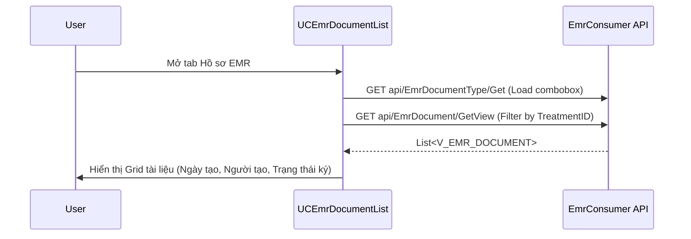

# Technical Spec: Hồ sơ Bệnh án Điện tử (EMR)

## 1. Business Mapping
*   **Ref**: [Quản lý Hồ sơ Bệnh án Điện tử](../../02-business-processes/clinical/06-electronic-medical-record.md)
*   **Scope**: Quản lý toàn bộ tài liệu EMR, ký số, lưu trữ và kết xuất.
*   **Key Plugins**:
    *   `EMR.Desktop.Plugins.EmrDocumentList` (Danh sách tài liệu EMR).
    *   `EMR.Desktop.Plugins.DocumentEdit` (Soạn thảo và Ký số).
    *   `HIS.Desktop.Plugins.EmrForm` (Danh mục biểu mẫu).

## 2. Core Components (Codebase Mapping)

### 2.1. EMR Document List (Danh sách tài liệu)
*   **Plugin Name**: `EMR.Desktop.Plugins.EmrDocumentList`.
*   **UI Control**: `UCEmrDocumentList.cs`.
    *   **Function**: Hiển thị danh sách các tài liệu trong hồ sơ điều trị hiện tại (Filter theo `TreatmentId`).
    *   **API Calls**:
        *   `GET api/EmrDocument/GetView`: Lấy danh sách tài liệu (`V_EMR_DOCUMENT`).
        *   `GET api/EmrDocumentType/Get`: Lấy danh mục loại tài liệu.
    *   **Logic**:
        *   Phân trang (Paging) sử dụng `CommonParam`.
        *   Filter theo trạng thái ký (Đang ký, Đã ký, Bị từ chối).

### 2.2. Document Editor (Soạn thảo)
*   **Plugin Name**: `EMR.Desktop.Plugins.DocumentEdit`.
*   **Function**: Editor rich-text hoặc form-based (dựa trên cấu hình `EmrForm`).
*   **Digital Signature**: Tích hợp `Inventec.Common.SignLibrary` để ký số (USB Token/SimPKI).

## 3. Process Flow (Technical Deep Dive)

### 3.1. Luồng Xem Danh sách Tài liệu

### 3.2. Luồng Ký số (Sign Flow)
*   **Trigger**: User bấm nút "Ký" trên `DocumentEdit`.
*   **Process**:
    1.  Tạo file PDF từ dữ liệu XML/HTML.
    2.  Hash file PDF.
    3.  Gửi Hash xuống thiết bị Token (Client-side).
    4.  Nhận chữ ký số (Signature).
    5.  Embed chữ ký vào PDF.
    6.  Upload file đã ký lên FileServer (`api/File/Upload`).
    7.  Cập nhật trạng thái `EMR_DOCUMENT.NEXT_SIGNER` hoặc `IS_FINISH`.

## 4. Database Schema
### 4.1. EMR_DOCUMENT (Tài liệu EMR)
*   `ID`: Primary Key.
*   `TREATMENT_ID`: FK to `HIS_TREATMENT`.
*   `DOCUMENT_TYPE_ID`: FK to `EMR_DOCUMENT_TYPE`.
*   `DATA`: Nội dung tài liệu (XML/JSON clob).
*   `FILE_URL`: Đường dẫn file PDF đã ký (nếu có).
*   `NEXT_SIGNER`: Username người cần ký tiếp theo (cho luồng trình ký).

### 4.2. EMR_DOCUMENT_TYPE (Loại tài liệu)
*   `DOCUMENT_TYPE_CODE`: Mã loại (e.g., `PHIEU_DIEU_TRI`).
*   `TEMPLATE_CODE`: Mã template dùng để render.

## 5. Integration Points
*   **HIS Core**: Dữ liệu hành chính bệnh nhân lấy từ `HIS_TREATMENT` và `HIS_PATIENT`.
*   **File Storage**: Lưu trữ file PDF đã ký.
*   **Gateway**: Gửi dữ liệu EMR sang Cổng BHXH/Bộ Y tế qua `EmrConnector`.

## 6. Common Notes
*   **Delete Logic**: Việc xóa tài liệu EMR (`IS_DELETE=1`) cần kiểm tra kỹ quyền hạn (người tạo mới được xóa, và chưa ký).
*   **Versioning**: Mỗi lần sửa tài liệu đã ký có thể tạo ra một phiên bản mới (tùy cấu hình).
