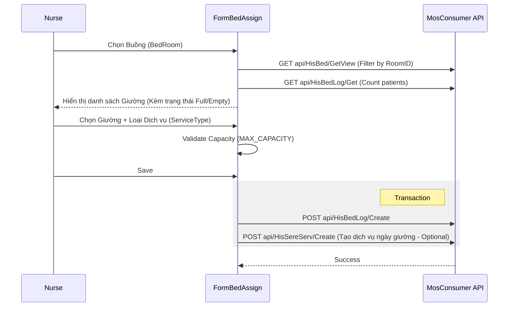

# Technical Spec: Quản lý Buồng/Giường (Bed Management)

## 1. Business Mapping
*   **Ref**: [Quản lý Buồng/Giường](../../02-business-processes/clinical/07-bed-management.md)
*   **Scope**: Quản lý gán giường, bản đồ giường, và tính toán ngày giường.
*   **Key Plugins**:
    *   `HIS.Desktop.Plugins.BedAssign` (Gán giường & Dịch vụ).
    *   `HIS.Desktop.Plugins.BedMapView` (Bản đồ buồng bệnh).
    *   `HIS.Desktop.Plugins.TreatmentBedRoomList` (Quản lý lịch sử nằm giường).

## 2. Core Components (Codebase Mapping)

### 2.1. Bed Assignment (Gán Giường)
*   **Plugin Name**: `HIS.Desktop.Plugins.BedAssign`.
*   **Main Form**: `FormBedAssign.cs`.
*   **Key Functions**:
    *   `LoadDataCboBed`: Load danh sách giường trong buồng (`V_HIS_BED`).
        *   *Capacity Check*: Đếm số lượng bệnh nhân đang nằm trong `HIS_BED_LOG` (`count`). Nếu `count >= MAX_CAPACITY`, đánh dấu `IsKey = 2` (Đầy).
    *   `SSVsFromTime`: Cảnh báo nếu gán giường thường cho bệnh nhân vừa phẫu thuật (PTTT logic).

### 2.2. Bed Map (Bản đồ Giường)
*   **Plugin Name**: `HIS.Desktop.Plugins.BedMapView`.
*   **Logic**:
    *   Hiển thị trực quan danh sách buồng (`HIS_BED_ROOM`) và giường (`HIS_BED`).
    *   Sử dụng tọa độ `X`, `Y` trong `HIS_BED` để vẽ vị trí giường.

## 3. Process Flow (Technical Deep Dive)

### 3.1. Luồng Gán Giường (Bed Assign Flow)

## 4. Database Schema
### 4.1. HIS_BED_LOG (Lịch sử nằm giường)
*   `ID`: Primary Key.
*   `TREATMENT_ID`: FK to `HIS_TREATMENT`.
*   `BED_ID`: FK to `HIS_BED`.
*   `START_TIME`: Thời gian bắt đầu nằm.
*   `FINISH_TIME`: Thời gian kết thúc (Null nếu đang nằm).
*   `BED_SERVICE_TYPE_ID`: FK to `HIS_BED_SERVICE_TYPE` (Dịch vụ giường áp dụng).

### 4.2. HIS_BED (Danh mục Giường)
*   `MAX_CAPACITY`: Sức chứa tối đa (Thường là 1, giường ghép có thể > 1).
*   `X`, `Y`: Tọa độ hiển thị trên BedMap.

## 5. Integration Points
*   **Billing (Viện phí)**: Mỗi bản ghi `HIS_BED_LOG` sẽ được job ngầm định (hoặc khi chốt) tính toán thành `HIS_SERE_SERV` (Dịch vụ ngày giường) để thu tiền.
*   **Admission**: Gắn kết chặt chẽ với quy trình Nhập khoa (`TreatmentBedRoomList`).

## 6. Common Issues
*   **Over Capacity**: Cố tình gán thêm bệnh nhân vào giường đã đầy (Nằm ghép). Hệ thống cho phép nhưng cảnh báo (`ResourceMessage.GiuongVuotQuaSoLuong`).
*   **Conflict Time**: Thời gian gán giường chồng chéo với thời gian nằm giường khác của cùng bệnh nhân.
