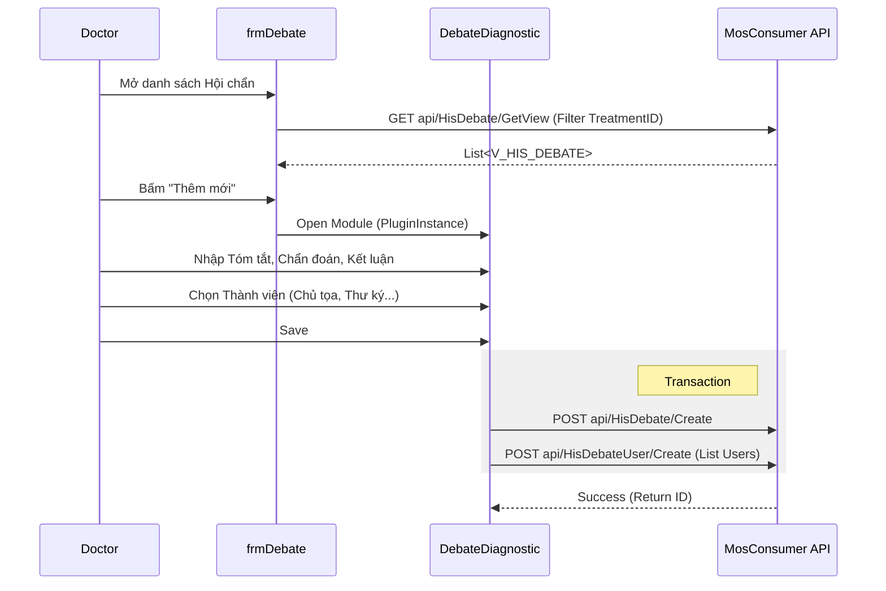

# Technical Spec: Quy trình Hội chẩn (Consultation / Debate)

## 1. Business Mapping
*   **Ref**: [Quy trình Hội chẩn](../../02-business-processes/clinical/08-consultation.md)
*   **Scope**: Quản lý yêu cầu hội chẩn, biên bản hội chẩn và thành viên tham gia hội chẩn.
*   **Key Plugins**:
    *   `HIS.Desktop.Plugins.Debate` (Quản lý danh sách & In ấn).
    *   `HIS.Desktop.Plugins.DebateDiagnostic` (Chi tiết biên bản & Chẩn đoán).
    *   `HIS.Desktop.Plugins.ConfigAppUser` (Chọn bác sĩ tham gia).

## 2. Core Components (Codebase Mapping)

### 2.1. Debate Manager (Quản lý Hội chẩn)
*   **Plugin Name**: `HIS.Desktop.Plugins.Debate`.
*   **Main Form**: `frmDebate.cs`.
*   **Key Functions**:
    *   `LoadGridDebate`: Lấy danh sách phiếu hội chẩn theo `TreatmentId` hoặc khoảng thời gian.
        *   API: `GET api/HisDebate/GetView`.
    *   `btnnew_Click`: Mở Form chi tiết `DebateDiagnostic` để tạo mới.
        *   Logic: Dùng `PluginInstance.GetPluginInstance` để gọi Module `HIS.Desktop.Plugins.DebateDiagnostic`.
    *   `PrintDebate`: In biên bản hội chẩn (Report merge field).

### 2.2. Debate Detail (Chi tiết Biên bản)
*   **Plugin Name**: `HIS.Desktop.Plugins.DebateDiagnostic`.
*   **Function**: Ghi nhận nội dung chi tiết.
    *   **Thành phần chính**:
        *   Tóm tắt bệnh sử (History).
        *   Kết quả CLS (Paraclinical).
        *   Chẩn đoán (Diagnostic - ICD10).
        *   Kết luận & Hướng điều trị (Conclusion).
    *   **Thành viên**: Lưu trữ danh sách bác sĩ tham gia trong bảng `HIS_DEBATE_USER`.

## 3. Process Flow (Technical Deep Dive)

### 3.1. Tạo & Ghi nhận Hội chẩn

## 4. Database Schema
### 4.1. HIS_DEBATE (Biên bản Hội chẩn)
*   `ID`: Primary Key.
*   `TREATMENT_ID`: FK to `HIS_TREATMENT`.
*   `DEPARTMENT_ID`: Khoa thực hiện hội chẩn.
*   `DIAGNOSIS_MAIN_CODE`: Chẩn đoán chính (ICD).
*   `CONCLUSION`: Kết luận hội chẩn.
*   `DEBATE_TIME`: Thời gian hội chẩn.

### 4.2. HIS_DEBATE_USER (Thành viên tham gia)
*   `DEBATE_ID`: FK to `HIS_DEBATE`.
*   `LOGINNAME`: Tên đăng nhập bác sĩ tham gia.
*   `DEBATE_ROLE_ID`: Vai trò (Chủ tọa, Thư ký, Thành viên).

### 4.3. HIS_DEBATE_EKIP (Ekip phẫu thuật - nếu có)
*   Map ekip mổ dự kiến (nếu hội chẩn duyệt mổ).

## 5. Integration Points
*   **Treatment**: Kết luận hội chẩn có thể cập nhật lại chẩn đoán chính của hồ sơ điều trị (`HIS_TREATMENT.ICD_CODE`).
*   **Surgery**: Biên bản hội chẩn là điều kiện bắt buộc để lập lịch phẫu thuật (đối với mổ phiên).
*   **EMR**: Ký số biên bản hội chẩn để lưu vào hồ sơ điện tử.

## 6. Common Notes
*   **Phân quyền**: Bác sĩ điều trị hoặc Lãnh đạo khoa mới có quyền tạo/sửa hội chẩn.
*   **Mẫu in**: Cần cấu hình đúng Template XML cho từng loại hội chẩn (Liên khoa, Toàn viện).
