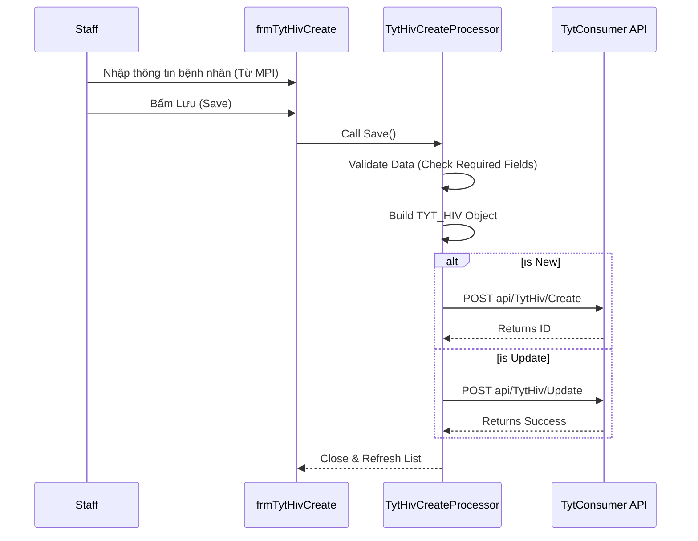

# Technical Spec: Chương trình Mục tiêu Quốc gia (National Health Programs)

## 1. Business Mapping
*   **Ref**: [Quy trình Quản lý Chương trình Mục tiêu](../../02-business-processes/commune-health/02-national-programs.md)
*   **Scope**: Module này quản lý các bệnh thuộc chương trình mục tiêu quốc gia tại tuyến xã (HIV, Lao, Sốt rét, Tâm thần).
*   **Key Plugins**: `TYT.Desktop.Plugins.TytHiv`, `TYT.Desktop.Plugins.TYTTuberculosis`, `TYT.Desktop.Plugins.TYTMalaria`.

## 2. Core Components (Codebase Mapping)
### 2.1. HIV Management
*   **Plugin Name**: `TYT.Desktop.Plugins.TytHiv` (Danh sách) & `TYT.Desktop.Plugins.TytHivCreate` (Thêm mới/Sửa).
*   **Extension Point**: `DesktopRootExtensionPoint`.
*   **Base Classes**: `TytHivBehavior`, `TytHivCreateBehavior`.
*   **Entity**: `TYT_HIV`.

### 2.2. Tuberculosis (Lao) Management
*   **Plugin Name**: `TYT.Desktop.Plugins.TYTTuberculosis` (Danh sách) & `TYT.Desktop.Plugins.TYTTuberculosisList`.
*   **Entity**: `TYT_TUBERCULOSIS`.

## 3. Process Flow (Technical Deep Dive)

### 3.1. Đăng ký & Quản lý Bệnh nhân HIV
Quy trình thêm mới hoặc cập nhật thông tin bệnh nhân HIV.

### 3.2. Data Validation
*   **Patient Info**: Bắt buộc phải chọn bệnh nhân từ danh mục HIS (`HIS_PATIENT`).
*   **Date Fields**: Ngày phát hiện, Ngày bắt đầu điều trị phải hợp lệ (< CurrentDate).

## 4. Database Schema
Các bảng dữ liệu chính trong schema `TYT`:

### 4.1. TYT_HIV
Lưu trữ hồ sơ quản lý HIV.
*   `ID`: PK.
*   `PATIENT_ID`: FK to `HIS_PATIENT` (Thông tin hành chính).
*   `DETECT_DATE`: Ngày phát hiện.
*   `START_TREATMENT_DATE`: Ngày bắt đầu điều trị.
*   `IS_MANAGED`: Trạng thái quản lý (1: Đang quản lý).
*   `HIV_STAGE_ID`: Giai đoạn bệnh.

### 4.2. TYT_TUBERCULOSIS
Lưu trữ hồ sơ bệnh Lao.
*   `ID`: PK.
*   `PATIENT_ID`: FK to `HIS_PATIENT`.
*   `DIAGNOSE_DATE`: Ngày chẩn đoán.
*   `TUBERCULOSIS_TYPE_ID`: Thể lao.

## 5. Integration Points
*   **MPI (Master Patient Index)**: Tất cả module chương trình đều link với `HIS_PATIENT` để lấy thông tin nhân khẩu học.
*   **Reporting**: Dữ liệu từ các bảng `TYT_*` được tổng hợp vào các báo cáo 11/CP, 12/CP của Y tế dự phòng.
