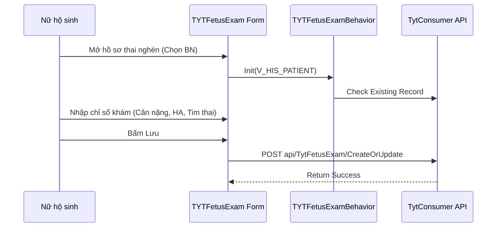

# Technical Spec: Sức khỏe Sinh sản (Reproductive Health)

## 1. Business Mapping
*   **Ref**: [Quy trình Chăm sóc Sức khỏe Sinh sản](../../02-business-processes/commune-health/03-reproductive-health.md)
*   **Scope**: Module này quản lý toàn bộ quy trình chăm sóc thai sản, kế hoạch hóa gia đình và sức khỏe bà mẹ trẻ em tại tuyến xã.
*   **Key Plugins**: `TYT.Desktop.Plugins.TYTFetusExam`, `TYT.Desktop.Plugins.TYTKhh`, `HIS.Desktop.Plugins.TYTFetusBorn`.

## 2. Core Components (Codebase Mapping)

### 2.1. Fetus Examination (Khám thai)
*   **Plugin Name**: `TYT.Desktop.Plugins.TYTFetusExam` (Quản lý khám thai).
*   **Entity**: `TYT_FETUS_EXAM`.
*   **Base Class**: `TYTFetusExamBehavior`.
*   **Extension Point**: `DesktopRootExtensionPoint`.

### 2.2. Family Planning (KHHGĐ)
*   **Plugin Name**: `TYT.Desktop.Plugins.TYTKhh`.
*   **Entity**: `TYT_KHH`.
*   **Base Class**: `TYTKhhBehavior`.

### 2.3. Childbirth & Newborn (Sinh & Sơ sinh)
*   **Plugin Name**: `HIS.Desktop.Plugins.TYTFetusBorn` (Quản lý sinh).
*   **Entity**: `TYT_FETUS_BORN` (Inferred).
*   **UI Controls**: `frmTYTFetusBorn`, `UCTYTFetusBornList`.

## 3. Process Flow (Technical Deep Dive)

### 3.1. Quy trình Quản lý Thai nghén
Quy trình từ lúc lập sổ khám thai đến khi kết thúc thai kỳ.

### 3.2. Data Integration
*   **Logic**: Module này hoạt động độc lập với module khám bệnh ngoại trú (HIS Core) nhưng chia sẻ cùng ID bệnh nhân (`PATIENT_ID`).
*   **Reporting**: Dữ liệu tự động đổ về Sổ A6 (Sổ khám thai), Báo cáo B02/TYT.

## 4. Database Schema
Các bảng dữ liệu chính trong schema `TYT`:

### 4.1. TYT_FETUS_EXAM
Lưu kết quả các lần khám thai.
*   `ID`: PK.
*   `PATIENT_ID`: FK.
*   `EXAM_DATE`: Ngày khám.
*   `GESTATIONAL_AGE`: Tuổi thai (Tuần).
*   `WEIGHT`: Cân nặng mẹ.
*   `FETAL_HEART_BEAT`: Tim thai.

### 4.2. TYT_KHH
Lưu hồ sơ Kế hoạch hóa gia đình.
*   `ID`: PK.
*   `METHOD_CODE`: Mã biện pháp tránh thai (Vòng, Thuốc, Bao cao su...).
*   `START_DATE`: Ngày bắt đầu.

## 5. Integration Points
*   **Tiêm chủng**: Tích hợp với module `TYT.Desktop.Plugins.Vaccination` để lên lịch tiêm uốn ván cho mẹ.
*   **Dược**: Nếu có cấp thuốc (Sắt/Acid Folic), hệ thống sẽ tạo phiếu xuất dược (`HIS_EXP_MEST`) tương ứng.
