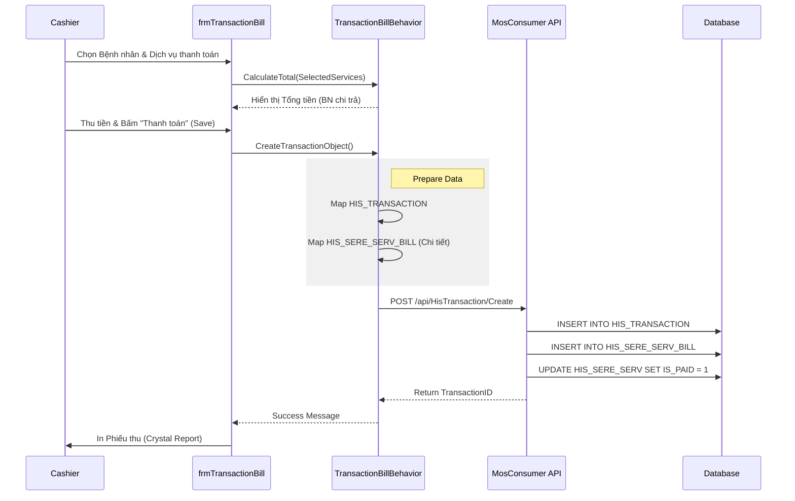

# Technical Spec: Thu viện phí & Thu ngân (Cashier Payment)

## 1. Business Mapping
*   **Ref**: [Quy trình Viện phí & Thu ngân](../../02-business-processes/finance/01-cashier-payment.md)
*   **Scope**: Tài liệu này mô tả kỹ thuật cho module Thu ngân (`TransactionBill`), nơi thực hiện các giao dịch thanh toán chi phí khám chữa bệnh, tạm ứng và quyết toán ra viện.
*   **Key Plugin**: `HIS.Desktop.Plugins.TransactionBill`.

## 2. Core Components (Codebase Mapping)
### 2.1. Plugin Main Structure
*   **Plugin Name**: `HIS.Desktop.Plugins.TransactionBill`
*   **Extension Point**: `DesktopRootExtensionPoint`.
*   **Processor**: `TransactionBillProcessor.cs`
    *   **Role**: Khởi tạo và điều phối các behavior của module.
*   **Behavior**: `TransactionBillBehavior.cs`
    *   **Logic**: Xử lý logic nghiệp vụ, gọi UI `frmTransactionBill`.

### 2.2. User Interface (UI)
*   **Main Form**: `frmTransactionBill.cs`
    *   Giao diện chính để thu ngân thao tác.
    *   Được chia nhỏ thành nhiều partial class để dễ quản lý:
        *   `__Plus__FillInfoPatient.cs`: Load thông tin hành chính bệnh nhân.
        *   `__Plus__GridFund.cs`: Grid hiển thị các khoản quỹ/nguồn chi trả.
        *   `__Plus__TreeSereServ.cs`: TreeView hiển thị danh sách dịch vụ cần thanh toán.
        *   `__Plus__Button.cs`: Xử lý sự kiện các nút bấm (Lưu, In, Hủy).

## 3. Process Flow (Technical Deep Dive)

### 3.1. Luồng Thanh toán (Payment Transaction)
Trigger khi thu ngân bấm nút "Lưu" (Save/Payment) trên màn hình.

### 3.2. Logic Tính toán (Billing Calculation)
Client-side tính toán số tiền dựa trên dữ liệu API trả về:
*   `PatientAmount` (Bệnh nhân trả) = `TotalAmount` (Tổng) - `HeinAmount` (Bảo hiểm) - `DiscountAmount` (Miễn giảm) - `DepositAmount` (Tạm ứng đã trừ).
*   Logic này được xử lý trong các hàm helper của `TransactionBillBehavior` để hiển thị realtime khi user check/uncheck các dịch vụ.

## 4. Database Schema
Các bảng chính liên quan đến giao dịch thanh toán:

### 4.1. HIS_TRANSACTION (Transaction Header)
*   `ID`: PK.
*   `ACCOUNT_BOOK_ID`: Quyển biên lai sử dụng.
*   `NUM_ORDER`: Số biên lai (Tăng tự động).
*   `PAY_FORM_ID`: Hình thức thanh toán (01: Tiền mặt, 02: Chuyển khoản...).
*   `KC_AMOUNT`: Khoản tiền kết chuyển (từ đợt điều trị trước - hiếm dùng).
*   `TREATMENT_TYPE_ID`: Loại điều trị (Nội trú/Ngoại trú).

### 4.2. HIS_SERE_SERV_BILL (Transaction Detail)
*   `BILL_ID`: FK -> HIS_TRANSACTION.
*   `SERE_SERV_ID`: FK -> HIS_SERE_SERV (Dịch vụ).
*   `PRICE`: Giá dịch vụ.
*   `VAT_RATIO`: Thuế suất (nếu có).

## 5. Integration Points
*   **Hóa đơn điện tử**: Sau khi thanh toán thành công, hệ thống có thể trigger `HIS.Desktop.Plugins.EInvoiceCreate` để xuất hóa đơn ngay lập tức nếu cấu hình `AUTO_CREATE_EINVOICE = 1`.
*   **Kho Dược**: Khi thanh toán xong thuốc ngoại trú, hệ thống gửi tín hiệu xuất kho (Duyệt phiếu xuất) nếu quy trình là "Thu tiền trước - Xuất thuốc sau".

## 6. Common Issues & Troubleshooting
*   **Lệch tiền (Payment Mismatch)**: Tổng tiền chi tiết (`sum(HIS_SERE_SERV_BILL.AMOUNT)`) không khớp với header (`HIS_TRANSACTION.AMOUNT`). Thường do làm tròn số học (Rounding issue).
*   **Trùng giao dịch**: Do mạng lag, thu ngân bấm nút Lưu nhiều lần. Hệ thống cần có cơ chế `Lock` button hoặc check `Idempotency` key.
