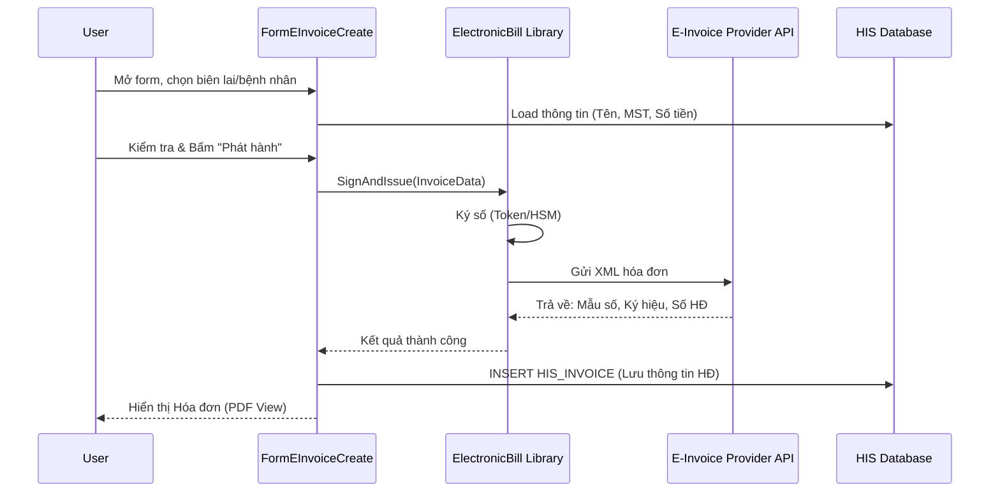

# Technical Spec: Quản lý Hóa đơn Điện tử (Invoice Management)

## 1. Business Mapping
*   **Ref**: [Quản lý Hóa đơn Điện tử](../../02-business-processes/finance/02-invoice-management.md)
*   **Scope**: Mô tả kỹ thuật cho việc tạo lập, ký số và phát hành hóa đơn điện tử.
*   **Key Plugin**: `HIS.Desktop.Plugins.EInvoiceCreate`.

## 2. Core Components
### 2.1. Plugin Main Structure
*   **Plugin Name**: `HIS.Desktop.Plugins.EInvoiceCreate`
*   **Processor**: `EInvoiceCreateProcessor.cs`
*   **UI**: `FormEInvoiceCreate.cs`
    *   Form chính hiển thị thông tin hóa đơn (Người mua, Chi tiết tiền, Thuế suất).
    *   Tương tác với các thư viện của nhà cung cấp (VNPT, Viettel, BKAV).

### 2.2. Integration Libraries
*   **`HIS.Desktop.Plugins.Library.ElectronicBill`**: Thư viện Wrapper để gọi API của các nhà mạng.
    *   `ProviderBehavior`: Factory pattern để chọn behavior theo nhà cung cấp (VNPTBehavior, ViettelBehavior...).

## 3. Process Flow

### 3.1. Luồng Tạo Hóa đơn (Create Invoice)
Trigger từ màn hình Thu ngân hoặc Menu Hóa đơn.

## 4. Database Schema
### 4.1. HIS_INVOICE
Lưu trữ meta-data của hóa đơn đã phát hành.
*   `ID`: PK.
*   `INVOICE_CODE`: Mã tra cứu hóa đơn.
*   `TEMPLATE_CODE`: Mẫu số.
*   `SYMBOL_CODE`: Ký hiệu.
*   `INVOICE_NUM`: Số hóa đơn (Do nhà cung cấp cấp).
*   `AMOUNT`: Tổng tiền.
*   `BUYER_TAX_CODE`: Mã số thuế người mua.

### 4.2. HIS_INVOICE_DETAIL
Lưu chi tiết dịch vụ trong hóa đơn.

## 5. Configuration
*   **`EINVOICE_PROVIDER`**: Cấu hình nhà cung cấp (1=VNPT, 2=Viettel, 3=BKAV...).
*   **`EINVOICE_ACCOUNT`**: Tài khoản webservice kết nối.
*   **`EINVOICE_PATTERN`**: Mẫu số đang sử dụng.

## 6. Common Issues
*   **Lỗi Ký số**: Cắm Token nhưng chưa cài driver hoặc Token hết hạn.
*   **Sai thông tin người mua**: Cần hủy hóa đơn cũ và lập hóa đơn thay thế.
*   **Mất kết nối Webservice**: Timeout khi gọi sang nhà cung cấp.
