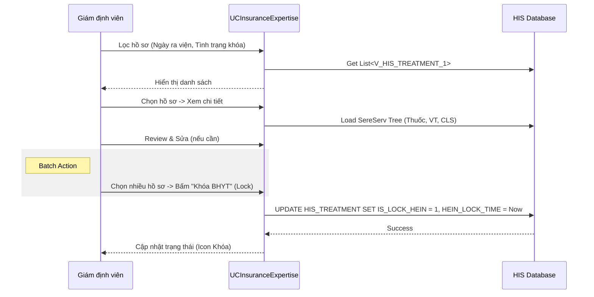

# Technical Spec: Bảo hiểm Y tế (Health Insurance)

## 1. Business Mapping
*   **Ref**: [Quy trình Bảo hiểm Y tế](../../02-business-processes/finance/03-health-insurance.md)
*   **Scope**: Tài liệu kỹ thuật cho việc kiểm tra thẻ, giám định BHYT tại bệnh viện và chốt dữ liệu.
*   **Key Plugin**: `HIS.Desktop.Plugins.InsuranceExpertise` (Giám định), `HIS.Desktop.Plugins.CheckInfoBHYT` (Check thẻ).

## 2. Core Components
### 2.1. Plugin Giám định (InsuranceExpertise)
*   **UI**: `UCInsuranceExpertise.cs`
    *   UserControl phức tạp chứa Grid danh sách bệnh nhân (`gridControlTreatment`) và TreeView chi tiết dịch vụ (`ucSereServTree`).
    *   Sử dụng `SereServTreeProcessor` để render cây dịch vụ.
*   **Filter Logic**: `HisTreatmentView1Filter` được sử dụng để lọc hồ sơ theo các tiêu chí: `IS_LOCK_HEIN` (Đã khóa), `HAS_HEIN_APPROVAL` (Đã duyệt), `FEE_LOCK_TIME` (Thời gian khóa viện phí).

### 2.2. Plugin Check thẻ (CheckInfoBHYT)
*   **Function**: Gọi API cổng BHYT để lấy thông tin `MaThe`, `HoTen`, `NgaySinh`, `GioiTinh`, `DiaChi`, `MaDKBD`, `GtTheTu`, `GtTheDen`.
*   **Comparison**: So sánh thông tin trả về với DB HIS, cảnh báo nếu sai lệch.

## 3. Process Flow

### 3.1. Luồng Giám định & Khóa dữ liệu (Advisor & Lock)
Quy trình này thực hiện bởi phòng Giám định BHYT.

## 4. Database Schema
### 4.1. HIS_TREATMENT (Header)
*   `IS_LOCK_HEIN`: Trạng thái khóa (1=Locked). Dữ liệu đã khóa không thể sửa đổi y lệnh.
*   `HEIN_LOCK_TIME`: Thời gian khóa.
*   `HEIN_CARD_NUMBER`: Số thẻ BHYT chính.

### 4.2. HIS_HEIN_APPROVAL (Hồ sơ Giám định)
Bảng lưu thông tin các đợt giám định/duyệt.
*   `ID`: PK.
*   `TREATMENT_ID`: FK.
*   `EXECUTE_TIME`: Thời gian duyệt.
*   `EXECUTE_LOGINNAME`: Người duyệt.

## 5. Key Logic
*   **Hein Approval**: Cơ chế duyệt hồ sơ nội bộ trước khi xuất XML.
*   **Validation**: Hệ thống tự động kiểm tra các lỗi logic (VD: Ngày chỉ định < Ngày vào viện, Tổng liều > Quy cách đóng gói) thông qua `HIS.Desktop.Plugins.InsuranceExpertise.Validation`.

## 6. Common Issues
*   **Un-lock**: Để sửa hồ sơ đã khóa, phải có quyền Admin để Mở khóa (`IS_LOCK_HEIN = 0`).
*   **Rate Limiting**: Khi check thẻ BHYT số lượng lớn, có thể bị chặn bởi cổng BHXH.
