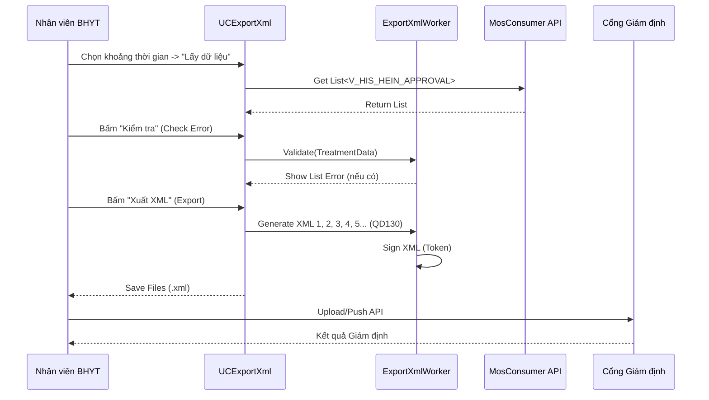

# Technical Spec: Xuất Dữ liệu Giám định BHYT (XML Export)

## 1. Business Mapping
*   **Ref**: [Quy trình Xuất Dữ liệu Giám định BHYT](../../02-business-processes/finance/04-xml-data-export.md)
*   **Scope**: Tài liệu kỹ thuật cho việc trích xuất, kiểm tra và gửi dữ liệu hồ sơ bệnh án BHYT lên cổng giám định.
*   **Key Plugin**: `HIS.Desktop.Plugins.ExportXmlQD130` (Chuẩn 130), `ExportXmlQD4210` (Chuẩn 4210).

## 2. Core Components
### 2.1. Plugin Main Structure
*   **Plugin Name**: `HIS.Desktop.Plugins.ExportXmlQD130`
*   **Processor**: `ExportXmlProcessor.cs`
*   **UI**: `UCExportXml.cs`
    *   Màn hình chính liệt kê danh sách hồ sơ cần xuất.
    *   Đươc chia thành các Tab: "Chưa gửi", "Đã gửi", "Lỗi".

### 2.2. Processing Logic
*   **Data Source**: Lấy dữ liệu từ các view `V_HIS_HEIN_APPROVAL` (Hồ sơ đã duyệt).
*   **Validation Engine**: `CheckError130` class.
    *   Chạy hàng loạt rule kiểm tra: Mã bệnh ICD, Mã thuốc, Thời gian, Logic chỉ định.
    *   Mapping lỗi vào bảng `HIS_XML_ERROR`.

## 3. Process Flow

### 3.1. Luồng Xuất XML (Export Flow)

## 4. Database Schema
### 4.1. HIS_HEIN_APPROVAL (Input Data)
*   Dữ liệu đầu vào chính là các hồ sơ đã được duyệt giám định tại bệnh viện.

### 4.2. HIS_XML_130 (Output Log)
Lưu log quá trình xuất XML.
*   `ID`: PK.
*   `TREATMENT_ID`: FK.
*   `FILE_NAME`: Tên file đã xuất.
*   `IS_SENT`: Trạng thái đã gửi cổng.
*   `SEND_TIME`: Thời gian gửi.

## 5. Data Standards (QD130)
Cấu trúc bộ XML 130 bao gồm 12 bảng (XML1 -> XML12):
*   **XML1**: Tổng hợp khám chữa bệnh.
*   **XML2**: Chỉ tiêu thuốc.
*   **XML3**: Chỉ tiêu dịch vụ kỹ thuật.
*   **XML4**: Chỉ tiêu cận lâm sàng.
*   **XML5**: Theo dõi diễn biến lâm sàng.
*   ...

## 6. Common Issues
*   **Lỗi định dạng**: Dữ liệu ngày tháng không đúng format `yyyyMMddHHmm`.
*   **Thiếu thông tin bắt buộc**: Thiếu mã bác sĩ, mã khoa phòng hoặc mã bệnh kèm theo.
*   **Sai mã danh mục**: Mã thuốc/Dịch vụ không khớp với danh mục trên cổng giám định.
