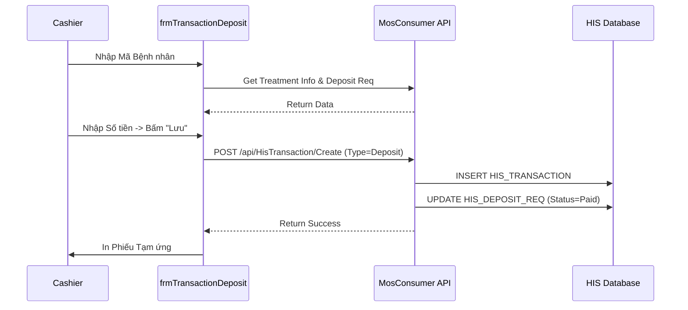

# Technical Spec: Quản lý Tạm ứng & Công nợ (Debt & Deposit)

## 1. Business Mapping
*   **Ref**: [Quản lý Tạm ứng & Công nợ](../../02-business-processes/finance/05-debt-deposit.md)
*   **Scope**: Tài liệu kỹ thuật cho các giao dịch tạm ứng, hoàn ứng và quản lý nợ đọng của bệnh nhân.
*   **Key Plugin**: `HIS.Desktop.Plugins.TransactionDeposit`, `HIS.Desktop.Plugins.DebtManager`.

## 2. Core Components
### 2.1. TransactionDeposit (Tạm ứng)
*   **Plugin Name**: `HIS.Desktop.Plugins.TransactionDeposit`
*   **UI**: `frmTransactionDeposit.cs`
*   **Logic**:
    *   `CreateDeposit`: Tạo phiếu thu tạm ứng (`HIS_TRANSACTION` type `Deposit`).
    *   `Repay`: Tạo phiếu chi hoàn ứng (`HIS_TRANSACTION` type `Repay`).

### 2.2. DebtManager (Công nợ)
*   **Plugin Name**: `HIS.Desktop.Plugins.DebtManager`
*   **UI**: `UCDebtManager.cs` (Trong `Run` folder).
*   **Logic**:
    *   Hiển thị danh sách bệnh nhân có `IsDebt = 1` hoặc còn dư nợ.
    *   Thực hiện thu nợ (`TransactionDebtCollect`).

## 3. Process Flow

### 3.1. Luồng Thu Tạm ứng (Deposit Flow)

## 4. Database Schema
### 4.1. HIS_DEPOSIT_REQ
Bảng yêu cầu tạm ứng từ khoa lâm sàng.
*   `ID`: PK.
*   `AMOUNT`: Số tiền đề nghị.
*   `DEPOSIT_REQ_STT_ID`: 1=Chưa thu, 2=Đã thu.

### 4.2. HIS_TRANSACTION (Deposit Type)
*   `TRANSACTION_TYPE_ID`:
    *   `1`: Thanh toán.
    *   `2`: Tạm ứng (`Deposit`).
    *   `3`: Hoàn ứng (`Repay`).
    *   `4`: Thanh toán nợ.

## 5. Accounting Logic
*   **Số dư khả dụng (`Advancement`)**: Tổng tiền tạm ứng đã đóng - Tổng chi phí đã phát sinh. Module Lâm sàng dùng giá trị này để cảnh báo đóng thêm tiền.
*   **Kết chuyển (`Transfer`)**: Khi bệnh nhân chuyển đợt điều trị (ví dụ: Ngoại trú -> Nội trú), số dư tạm ứng có thể được kết chuyển sang hồ sơ mới.

## 6. Common Issues
*   **Hủy tạm ứng**: Không thể hủy phiếu tạm ứng nếu kế toán đã chốt sổ (Khóa ngày). Phải làm thủ tục hoàn ứng.
*   **Hoàn ứng âm**: Hệ thống không cho phép hoàn ứng nhiều hơn số tiền đang có (tránh thất thoát).
