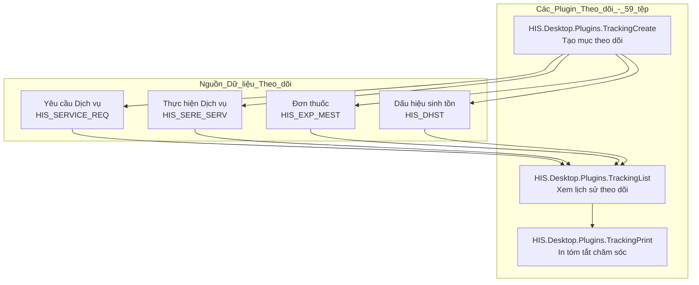
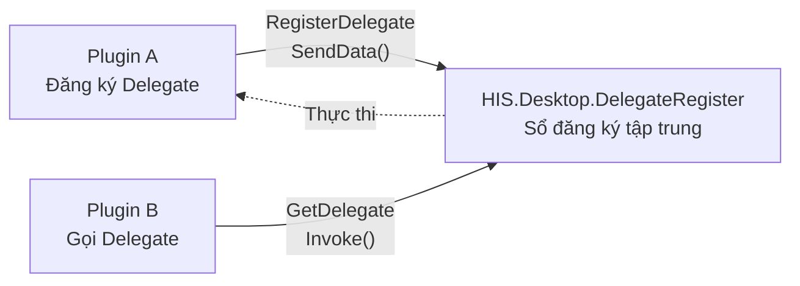
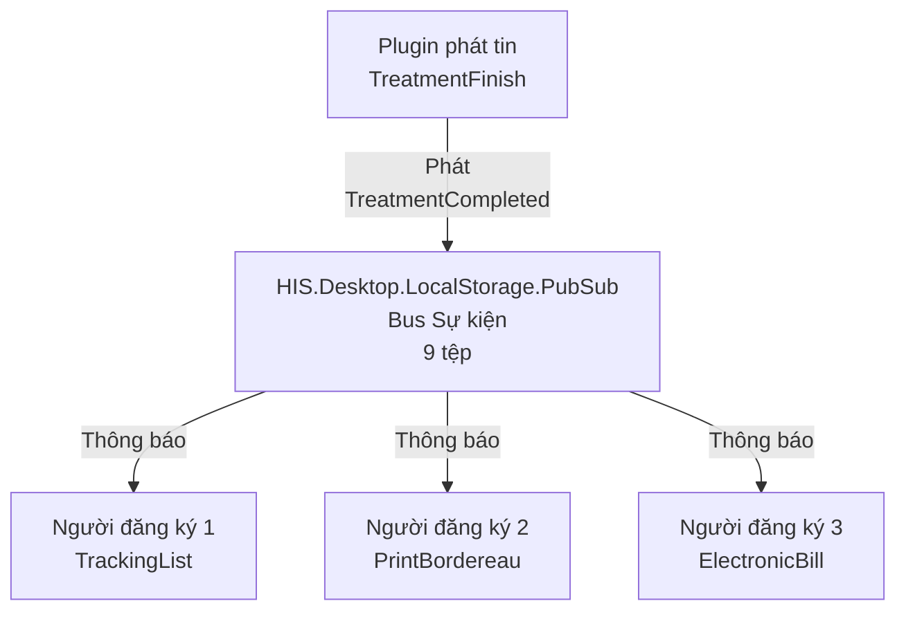
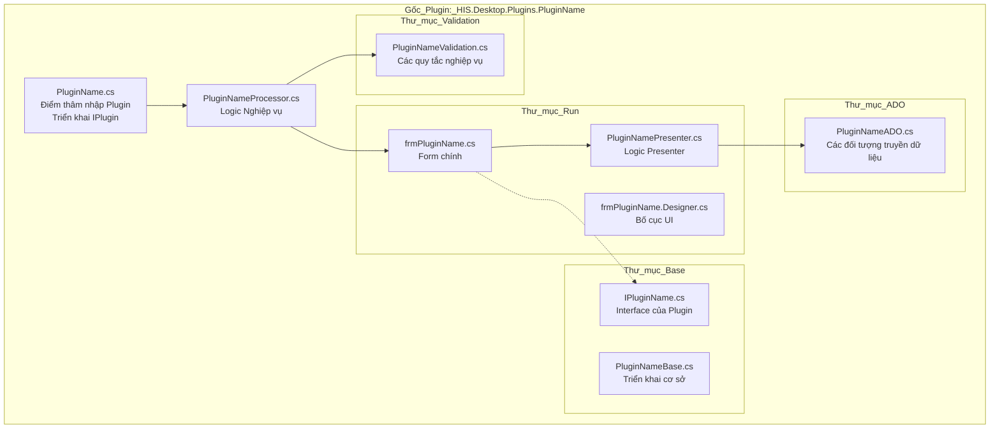
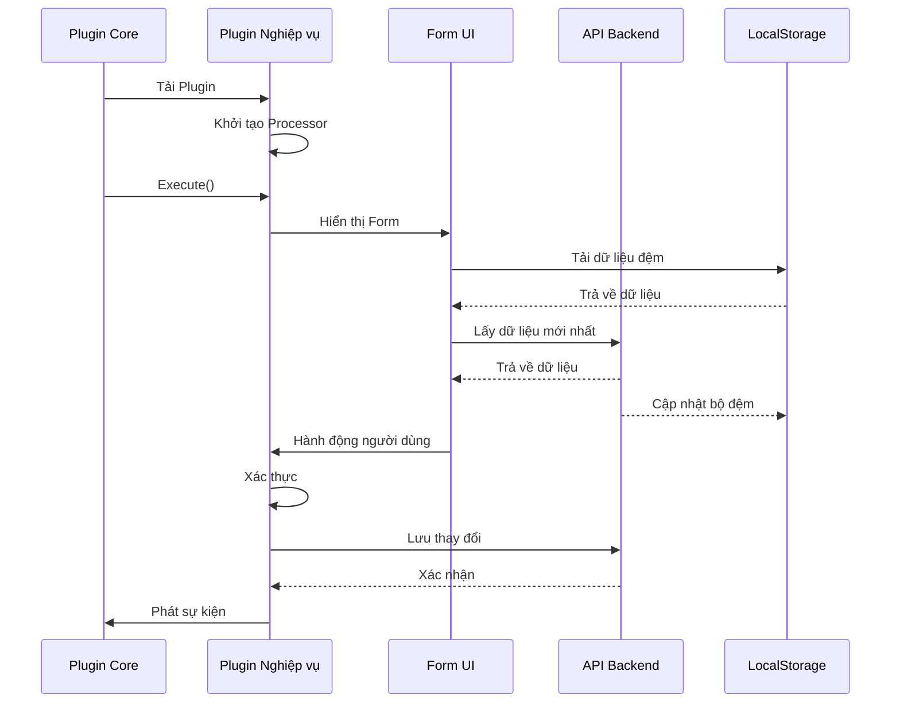
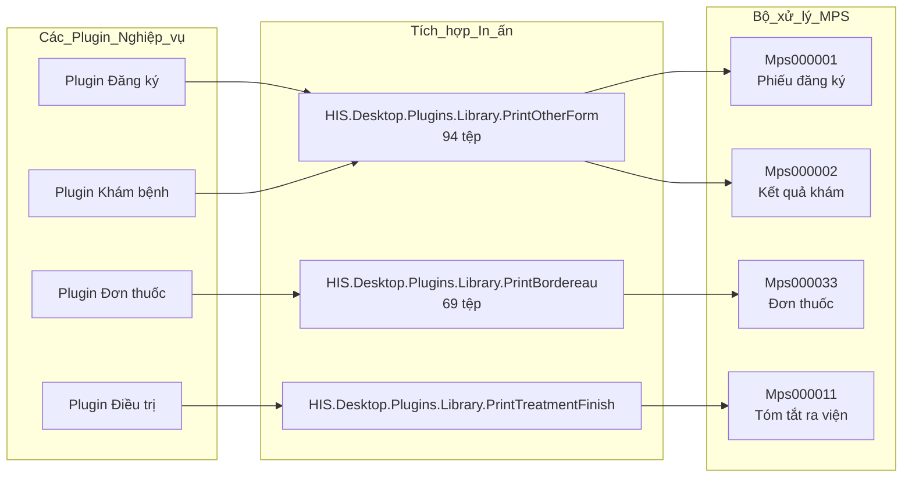
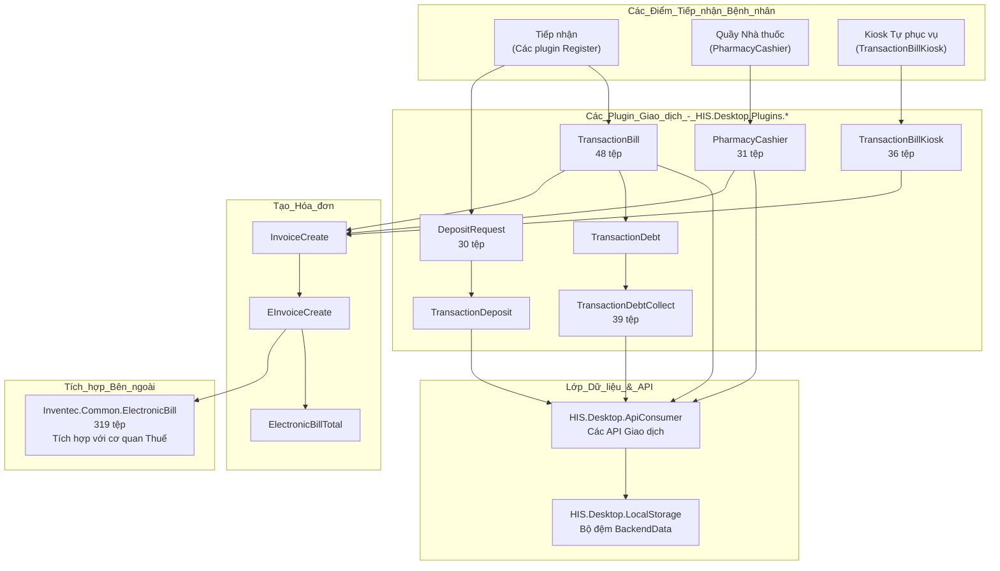
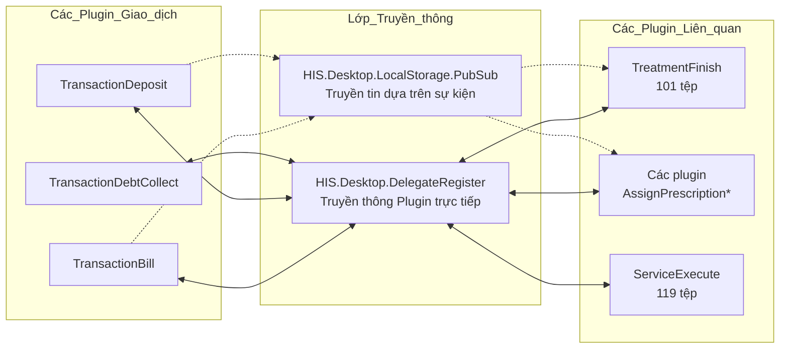
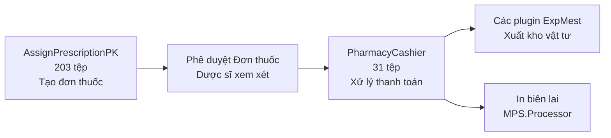

## Mục đích và Phạm vi

Tài liệu này đề mục các plugin nằm trong namespace **HIS.Desktop.Plugins.***, thực hiện các quy trình nghiệp vụ cốt lõi của bệnh viện trong hệ thống HisNguonMo. Các plugin này xử lý các chức năng lâm sàng và hành chính chính, bao gồm đăng ký bệnh nhân, khám bệnh, điều trị, quản lý đơn thuốc và theo dõi chăm sóc.

Trang này tập trung cụ thể vào các plugin logic nghiệp vụ. Đối với các danh mục plugin khác, hãy xem:
- Các plugin giao dịch và thanh toán: [Các Plugin Giao dịch & Thanh toán](../../03-technical-specs/his-desktop/business-plugins.md#transaction-billing)
- Quản lý thuốc và vật tư: [Các Plugin Thuốc & Vật tư](../../02-business-processes/pharmacy/01-business-overview.md)
- Kiểm soát truy cập và bảo mật: [Các Plugin Kiểm soát Truy cập ACS](../../02-business-processes/administration/01-access-control-business.md)
- Hồ sơ bệnh án điện tử: [Các Plugin Hồ sơ Bệnh án Điện tử EMR](../../03-technical-specs/his-desktop/business-plugins.md#emr)
- Kiến trúc plugin tổng thể và truyền thông: [Kiến trúc Hệ thống Plugin](../../01-architecture/plugin-system/01-overview.md)

Các plugin nghiệp vụ cốt lõi của HIS chiếm khoảng hơn 600 trong tổng số 956 plugin của hệ thống, khiến chúng trở thành danh mục plugin lớn nhất về số lượng.

---

## Tổng quan Danh mục Plugin

Các plugin nghiệp vụ cốt lõi của HIS được tổ chức thành các miền chức năng phản ánh quy trình chăm sóc bệnh nhân tại bệnh viện:

\`\`\`mermaid
graph TB
    subgraph "Luồng_Hành_trình_Bệnh_nhân"
        Register["Các Plugin Đăng ký HIS.Desktop.Plugins.Register* HIS.Desktop.Plugins.Reception* 81-102 tệp mỗi plugin"]
        Exam["Các Plugin Khám bệnh HIS.Desktop.Plugins.ExamService* HIS.Desktop.Plugins.ServiceExecute 119 tệp"]
        Prescription["Các Plugin Đơn thuốc HIS.Desktop.Plugins.AssignPrescription* 117-203 tệp mỗi plugin"]
        Treatment["Các Plugin Điều trị HIS.Desktop.Plugins.Treatment* HIS.Desktop.Plugins.TreatmentFinish 56-101 tệp"]
        Tracking["Các Plugin Theo dõi HIS.Desktop.Plugins.Tracking* 59 tệp"]
    end
    
    Register --> Exam
    Exam --> Prescription
    Prescription --> Treatment
    Treatment --> Tracking
    Tracking -.->|Tái khám| Exam
    
    subgraph "Các_Chức_năng_Hỗ_trợ"
        Surgery["Các Plugin Phẫu thuật HIS.Desktop.Plugins.Surgery*"]
        ICU["Các Plugin ICU HIS.Desktop.Plugins.ICU*"]
        Appointment["Các Plugin Hẹn khám HIS.Desktop.Plugins.Appointment*"]
    end
    
    Exam --> Surgery
    Exam --> ICU
    Treatment --> Appointment
\`\`\`

**Các Nhóm Chức năng Chính:**

| Miền | Tiền tố Plugin | Khoảng Số lượng Tệp | Chức năng Chính |
|--------|--------------|------------------|------------------|
| Đăng ký | \`Register*\`, \`Reception*\` | 81-102 | Tiếp nhận và đăng ký bệnh nhân |
| Khám bệnh | \`ExamService*\`, \`ServiceExecute\` | 40-119 | Khám lâm sàng và thực hiện dịch vụ |
| Đơn thuốc | \`AssignPrescription*\` | 117-203 | Kê đơn thuốc và chỉ định dịch vụ lâm sàng |
| Điều trị | \`Treatment*\`, \`TreatmentFinish\` | 56-101 | Quản lý chăm sóc nội trú và ra viện |
| Theo dõi | \`Tracking*\` | 59 | Giám sát bệnh nhân và theo dõi chăm sóc |

Nguồn: [[\`.devin/wiki.json:1-295\`](../../../../.devin/wiki.json#L1-295)](../../../../.devin/wiki.json#L1-295)

---

## Các Plugin Đăng ký và Tiếp nhận

Các plugin đăng ký xử lý việc tiếp nhận bệnh nhân, thu thập dữ liệu nhân khẩu học và thiết lập hồ sơ bệnh ban đầu.

**Các Plugin Chính:**

| Tên Plugin | Số lượng Tệp | Chức năng |
|-------------|-----------|----------|
| \`HIS.Desktop.Plugins.Register\` | 81-102 | Đăng ký bệnh nhân mới |
| \`HIS.Desktop.Plugins.RegisterExamKiosk\` | thay đổi | Đăng ký tại kiosk tự phục vụ |
| \`HIS.Desktop.Plugins.Reception\` | 81-102 | Tiếp nhận và check-in bệnh nhân |
| \`HIS.Desktop.Plugins.RegisterV2\` | thay đổi | Giao diện đăng ký nâng cao |

\`\`\`mermaid
graph LR
    Patient["Bệnh nhân đến"]
    
    subgraph "Luồng_Đăng_ký"
        Register["HIS.Desktop.Plugins.Register RegisterProcessor"]
        ValidatePatient["Xác thực Bệnh nhân Kiểm tra trùng lặp"]
        CreateTreatment["Tạo hồ sơ điều trị V_HIS_TREATMENT"]
        AssignRoom["Gán vào phòng khám HIS_SERVICE_REQ"]
    end
    
    Patient --> Register
    Register --> ValidatePatient
    ValidatePatient --> CreateTreatment
    CreateTreatment --> AssignRoom
    
    AssignRoom --> ExamQueue["Hàng đợi Khám bệnh"]
\`\`\`

**Quy trình Đăng ký:**
1. Nhập dữ liệu nhân khẩu học bệnh nhân (tên, ngày sinh, địa chỉ, thông tin bảo hiểm).
2. Phát hiện bệnh nhân trùng lặp và xử lý hợp nhất hồ sơ.
3. Tạo hồ sơ điều trị với phân loại ban đầu.
4. Gán phòng dịch vụ dựa trên tính sẵn có và chuyên khoa.
5. Gán vị trí trong hàng đợi khám bệnh.

Các plugin đăng ký tương tác mạnh mẽ với:
- \`HIS.UC.PatientSelect\` - điều khiển tìm kiếm và chọn bệnh nhân.
- \`HIS.UC.UCHein\` - nhập thông tin bảo hiểm y tế (153 tệp).
- \`HIS.Desktop.ADO\` - mô hình dữ liệu bệnh nhân và điều trị.
- Các endpoint API backend để lưu trữ dữ liệu bệnh nhân.

Nguồn: [[\`.devin/wiki.json:70-77\`](../../../../.devin/wiki.json#L70-L77)](../../../../.devin/wiki.json#L70-L77)

---

## Các Plugin Quản lý Điều trị

Các plugin điều trị quản lý toàn bộ vòng đời của các lượt chăm sóc bệnh nhân, từ lúc nhập viện đến khi ra viện.

**Các Plugin Điều trị Chính:**

\`\`\`mermaid
graph TB
    subgraph "Các_Plugin_Vòng_đời_Điều_trị"
        TreatmentCreate["HIS.Desktop.Plugins.Treatment* Tạo điều trị 56-80 tệp"]
        TreatmentView["HIS.Desktop.Plugins.TreatmentList Xem danh sách điều trị"]
        TreatmentUpdate["HIS.Desktop.Plugins.TreatmentUpdate Cập nhật điều trị"]
        TreatmentFinish["HIS.Desktop.Plugins.TreatmentFinish Xử lý ra viện 101 tệp"]
    end
    
    subgraph "Loại_Điều_trị"
        Outpatient["Điều trị Ngoại trú TREATMENT_TYPE.ID__KHAM"]
        Inpatient["Điều trị Nội trú TREATMENT_TYPE.ID__DTNOITRU"]
        Emergency["Điều trị Cấp cứu TREATMENT_TYPE.ID__DTBANNGAY"]
    end
    
    TreatmentCreate --> TreatmentView
    TreatmentView --> TreatmentUpdate
    TreatmentUpdate --> TreatmentFinish
    
    TreatmentCreate -.->|Chọn Loại| Outpatient
    TreatmentCreate -.->|Chọn Loại| Inpatient
    TreatmentCreate -.->|Chọn Loại| Emergency
\`\`\`

**Các Thành phần Chính:**

| Plugin | Số tệp | Chức năng Cốt lõi |
|--------|-------|-------------------|
| \`HIS.Desktop.Plugins.TreatmentFinish\` | 101 | Xử lý ra viện, ghi nhận kết quả |
| \`HIS.Desktop.Plugins.TreatmentLog\` | 56 | Ghi nhật ký sự kiện điều trị |
| \`HIS.Desktop.Plugins.TreatmentList\` | thay đổi | Duyệt và tìm kiếm hồ sơ điều trị |

**Tính toán Ngày Điều trị:**

Hệ thống triển khai các quy tắc nghiệp vụ phức tạp để tính toán thời gian điều trị, như được thấy trong \`HIS.Common.Treatment.Calculation\`:

\`\`\`mermaid
graph TD
    Start["Tính ngày điều trị"]
    CheckSameDay["Vào/Ra cùng ngày?"]
    CheckDuration["Thời gian > 4 giờ?"]
    CheckDate["Trước ngày 15/07/2018?"]
    CheckPatientType["Loại Bệnh nhân?"]
    CheckOutcome["Kết quả Điều trị?"]
    
    Start --> CheckSameDay
    CheckSameDay -->|Có| CheckDuration
    CheckSameDay -->|Không| CheckDate
    
    CheckDuration -->|Có| Result1["1 Ngày"]
    CheckDuration -->|Không| Result0["0 Ngày"]
    
    CheckDate -->|Có| OldRule["NGÀY_RA - NGÀY_VÀO + 1 Thông tư 37"]
    CheckDate -->|Không| CheckPatientType
    
    CheckPatientType -->|Dịch vụ/Viện phí| OldRule
    CheckPatientType -->|Bảo hiểm (BHYT)| CheckOutcome
    
    CheckOutcome -->|Chuyển viện/Tử vong/Nặng hơn| NewRulePlus1["NGÀY_RA - NGÀY_VÀO + 1 Thông tư 15"]
    CheckOutcome -->|Khác| NewRule["NGÀY_RA - NGÀY_VÀO Thông tư 15"]
\`\`\`

Các quy tắc tính ngày điều trị được định nghĩa trong [[\`Common/HIS.Common.Treatment/HIS.Common.Treatment/Calculation.cs:52-109\`](../../../../Common/HIS.Common.Treatment/HIS.Common.Treatment/Calculation.cs#L52-L109)](../../../../Common/HIS.Common.Treatment/HIS.Common.Treatment/Calculation.cs#L52-L109):
- Điều trị cùng ngày với thời gian > 4 giờ = 1 ngày.
- Các quy tắc tính toán khác nhau cho giai đoạn trước/sau ngày 15/07/2018 (thay đổi quy định).
- Bệnh nhân BHYT và bệnh nhân viện phí sử dụng các công thức khác nhau.
- Các tính toán phụ thuộc vào kết quả cho các trường hợp chuyển viện, tử vong hoặc tình trạng nặng hơn.

Nguồn: [[\`Common/HIS.Common.Treatment/HIS.Common.Treatment/Calculation.cs:1-178\`](../../../../Common/HIS.Common.Treatment/HIS.Common.Treatment/Calculation.cs#L1-L178)](../../../../Common/HIS.Common.Treatment/HIS.Common.Treatment/Calculation.cs#L1-L178), [[\`.devin/wiki.json:70-77\`](../../../../.devin/wiki.json#L70-L77)](../../../../.devin/wiki.json#L70-L77)

---

## Các Plugin Khám bệnh và Thực hiện Dịch vụ

Các plugin khám bệnh xử lý các lượt gặp gỡ lâm sàng, các thủ thuật chẩn đoán và cung cấp dịch vụ.

**Các Plugin Khám bệnh Chính:**

| Plugin | Số tệp | Mục đích |
|--------|-------|---------|
| \`HIS.Desktop.Plugins.ServiceExecute\` | 119 | Thực hiện dịch vụ và ghi nhận kết quả |
| \`HIS.Desktop.Plugins.ExamServiceReqExecute\` | thay đổi | Xử lý yêu cầu khám bệnh |
| \`HIS.Desktop.Plugins.ServiceReqList\` | thay đổi | Quản lý hàng đợi yêu cầu dịch vụ |

\`\`\`mermaid
graph TB
    subgraph "Quy_trình_Khám_bệnh"
        Queue["Hàng đợi Bệnh nhân Trạng thái SERVICE_REQ"]
        Execute["HIS.Desktop.Plugins.ServiceExecute ServiceExecuteProcessor 119 tệp"]
        Record["Ghi nhận Kết luận Nhập dữ liệu lâm sàng"]
        Diagnose["Nhập Chẩn đoán Mã ICD-10"]
        Complete["Hoàn thành Dịch vụ Cập nhật trạng thái"]
    end
    
    subgraph "Các_UC_Hỗ_trợ"
        ICDControl["HIS.UC.Icd Chẩn đoán chính 65 tệp"]
        SecondaryICD["HIS.UC.SecondaryIcd Bệnh kèm theo 61 tệp"]
        DHST["HIS.UC.DHST Dấu hiệu sinh tồn 54 tệp"]
    end
    
    Queue --> Execute
    Execute --> Record
    Record --> Diagnose
    Diagnose --> Complete
    
    Diagnose -.-> ICDControl
    Diagnose -.-> SecondaryICD
    Record -.-> DHST
\`\`\`

**Quy trình Thực hiện Dịch vụ:**

1. **Quản lý Hàng đợi**: Các bệnh nhân đang chờ dịch vụ được hiển thị theo thứ tự ưu tiên.
2. **Chọn Dịch vụ**: Lâm sàng viên chọn yêu cầu dịch vụ để thực hiện.
3. **Nhập Dữ liệu Lâm sàng**:
   - Dấu hiệu sinh tồn (DHST - Chiều cao, Cân nặng, Huyết áp, Nhiệt độ).
   - Lý do khám và tiền sử.
   - Kết quả khám thực thể.
4. **Gán Chẩn đoán**:
   - Chẩn đoán chính (mã ICD-10 qua \`HIS.UC.Icd\`).
   - Các chẩn đoán phụ (bệnh kèm theo qua \`HIS.UC.SecondaryIcd\`).
5. **Hoàn thành Dịch vụ**: Cập nhật trạng thái và lưu trữ kết quả.

Plugin \`ServiceExecute\` tích hợp với:
- \`HIS.UC.ExamTreatmentFinish\` (103 tệp) - các điều khiển hoàn thành khám bệnh.
- \`HIS.UC.FormType\` (329 tệp) - hiển thị form động cho các loại dịch vụ khác nhau.
- \`HIS.Desktop.ADO\` - mô hình dữ liệu yêu cầu và thực hiện dịch vụ.

Nguồn: [[\`.devin/wiki.json:70-77\`](../../../../.devin/wiki.json#L70-L77)](../../../../.devin/wiki.json#L70-L77), [[\`.devin/wiki.json:214-222\`](../../../../.devin/wiki.json#L214-L222)](../../../../.devin/wiki.json#L214-L222), [[\`.devin/wiki.json:225-232\`](../../../../.devin/wiki.json#L225-L232)](../../../../.devin/wiki.json#L225-L232)

---

## Các Plugin Đơn thuốc và Chỉ định Dịch vụ

Các plugin đơn thuốc nằm trong số những plugin lớn nhất và phức tạp nhất trong hệ thống, xử lý các đơn thuốc, chỉ định dịch vụ lâm sàng và các điều trị chuyên biệt.

**Các Plugin Đơn thuốc Chính:**

\`\`\`mermaid
graph LR
    subgraph "Họ_Plugin_Kê_đơn"
        AssignPK["HIS.Desktop.Plugins.AssignPrescriptionPK Đơn thuốc Ngoại trú 203 tệp Plugin lớn nhất"]
        AssignCLS["HIS.Desktop.Plugins.AssignPrescriptionCLS Chỉ định Cận lâm sàng 136 tệp"]
        AssignKidney["HIS.Desktop.Plugins.AssignPrescriptionKidney Chỉ định Chạy thận 132 tệp"]
        AssignYHCT["HIS.Desktop.Plugins.AssignPrescriptionYHCT Y học cổ truyền 117 tệp"]
    end
    
    subgraph "Các_Điều_khiển_Hỗ_trợ"
        MedicineType["HIS.UC.MedicineType Chọn thuốc 82 tệp"]
        MaterialType["HIS.UC.MaterialType Chọn vật tư 85 tệp"]
        ServiceRoom["HIS.UC.ServiceRoom Chọn dịch vụ 48 tệp"]
    end
    
    AssignPK --> MedicineType
    AssignYHCT --> MedicineType
    AssignCLS --> ServiceRoom
    AssignKidney --> MaterialType
\`\`\`

**Chi tiết Plugin:**

| Plugin | Số tệp | Chuyên khoa | Các Tính năng Chính |
|--------|-------|----------------|--------------|
| \`AssignPrescriptionPK\` | 203 | Dược ngoại trú | Chọn thuốc, liều dùng, kiểm tra tương tác, in đơn thuốc |
| \`AssignPrescriptionCLS\` | 136 | Dịch vụ xét nghiệm/chẩn đoán hình ảnh | Chỉ định dịch vụ, lấy mẫu, theo dõi kết quả |
| \`AssignPrescriptionKidney\` | 132 | Chạy thận nhân tạo | Lịch chạy thận, gán máy, các tham số điều trị |
| \`AssignYHCT\` | 117 | Y học cổ truyền | Các công thức thảo dược, phương pháp bào chế |

**Quy trình Kê đơn:**

\`\`\`mermaid
sequenceDiagram
    participant Doctor as Bác sĩ
    participant AssignPlugin as Plugin AssignPrescription*
    participant MedicineUC as HIS.UC.MedicineType
    participant Validation as Kiểm tra Tương tác thuốc
    participant API as API Backend
    participant Printer as Hệ thống In
    
    Doctor->>AssignPlugin: Mở Form Kê đơn
    AssignPlugin->>MedicineUC: Tải danh mục thuốc
    MedicineUC-->>AssignPlugin: Các loại thuốc có sẵn
    
    Doctor->>AssignPlugin: Chọn Thuốc + Liều dùng
    AssignPlugin->>Validation: Kiểm tra tương tác
    Validation-->>AssignPlugin: Kết quả xác thực
    
    Doctor->>AssignPlugin: Thêm vào Đơn thuốc
    Doctor->>AssignPlugin: Gửi y lệnh
    
    AssignPlugin->>API: Lưu đơn thuốc
    API-->>AssignPlugin: Xác nhận
    
    AssignPlugin->>Printer: Tạo bản in đơn thuốc
    Printer-->>Doctor: Đơn thuốc đã in
\`\`\`

**Các Thành phần của Đơn thuốc:**

Mỗi plugin kê đơn thường chứa:
- Thư mục **Run/**: Logic thực thi chính và khởi tạo form.
- Thư mục **ADO/**: Các đối tượng dữ liệu dành riêng cho đơn thuốc.
- Thư mục **Base/**: Các lớp cơ sở và interface.
- Thư mục **Validation/**: Xác thực các quy tắc nghiệp vụ.
- Thư mục **Print/**: Tích hợp với hệ thống in MPS.

Các plugin đơn thuốc sử dụng rộng rãi:
- \`HIS.UC.MedicineInStock\` - kiểm tra tồn kho theo thời gian thực.
- \`HIS.UC.MaterialInStock\` - tính sẵn có của hàng tiêu dùng.
- Cơ sở dữ liệu tương tác thuốc để hỗ trợ quyết định lâm sàng.
- Tích hợp với hệ thống cấp phát của nhà thuốc.

Nguồn: [[\`.devin/wiki.json:70-77\`](../../../../.devin/wiki.json#L70-L77)](../../../../.devin/wiki.json#L70-L77)
---

## Các Plugin Theo dõi và Giám sát Bệnh nhân

Các plugin theo dõi cung cấp các góc nhìn tổng quát về quá trình chăm sóc bệnh nhân và cho phép giám sát lâm sàng.

**Cấu trúc Plugin Theo dõi:**

**Các Chức năng Theo dõi:**
- **Dòng thời gian Chăm sóc**: Chế độ xem theo trình tự thời gian của tất cả các sự kiện lâm sàng.
- **Ghi chú Tiến triển**: Các ghi chú điều dưỡng và bác sĩ hàng ngày.
- **Xu hướng Dấu hiệu sinh tồn**: Hiển thị đồ thị các dấu hiệu sinh tồn theo thời gian.
- **Hồ sơ Thực hiện Thuốc**: Theo dõi việc sử dụng thuốc.
- **Giám sát Phác đồ Chăm sóc**: Theo dõi việc tuân thủ các quy trình chăm sóc.

Các plugin theo dõi tích hợp với:
- `HIS.UC.TreatmentFinish` (94 tệp) - tạo tóm tắt điều trị.
- `HIS.UC.PlusInfo` (147 tệp) - các thông tin lâm sàng bổ sung.
- Các bộ xử lý in MPS để tạo các tờ theo dõi.

Nguồn: [[`.devin/wiki.json:70-77`](../../../../.devin/wiki.json#L70-L77)](../../../../.devin/wiki.json#L70-L77)

---

## Các Plugin Nghiệp vụ Hỗ trợ

Bên cạnh các plugin quy trình cốt lõi, nhiều plugin hỗ trợ cung cấp các chức năng chuyên biệt:

**Các Plugin Khu vực Chuyên khoa:**

| Danh mục | Ví dụ | Chức năng |
|----------|----------|----------|
| Phẫu thuật | `HIS.Desktop.Plugins.SurgerySchedule` | Lập lịch và quản lý phòng mổ |
| ICU | `HIS.Desktop.Plugins.IcuInfo` | Quản lý bệnh nhân đơn vị hồi sức tích cực |
| Sản khoa | `HIS.Desktop.Plugins.FetusBorn`, `HIS.Desktop.Plugins.FetusAbortion` | Chăm sóc bà mẹ và thai nhi |
| Cấp cứu | `HIS.Desktop.Plugins.EmergencyWTime` | Quy trình khoa cấp cứu |
| Hình ảnh | `HIS.Desktop.Plugins.HisImportDicom` | Tích hợp hình ảnh y tế (DICOM) |

**Các Plugin Hỗ trợ Hành chính:**

| Plugin | Mục đích |
|--------|---------|
| `HIS.Desktop.Plugins.Appointment` | Hẹn lịch khám bệnh |
| `HIS.Desktop.Plugins.BedRoom` | Quản lý giường bệnh |
| `HIS.Desktop.Plugins.RoomInfo` | Cấu hình phòng/buồng |
| `HIS.Desktop.Plugins.PatientInfo` | Trình xem thông tin bệnh nhân |

Nguồn: [[`.devin/wiki.json:1-295`](../../../../.devin/wiki.json#L1-295)](../../../../.devin/wiki.json#L1-295)

---

## Các Mô hình Truyền thông Giữa các Plugin

Các plugin nghiệp vụ cốt lõi của HIS giao tiếp bằng hai cơ chế chính:

**1. Mô hình DelegateRegister (Liên kết Chặt chẽ):**

**2. Mô hình PubSub (Liên kết Lỏng lẻo):**

**Các Sự kiện Truyền thông Phổ biến:**
- `PatientRegistered` - Đăng ký bệnh nhân mới.
- `ExaminationComplete` - Hoàn thành dịch vụ khám.
- `PrescriptionCreated` - Kê đơn thuốc mới.
- `TreatmentFinished` - Kết thúc điều trị bệnh nhân.
- `ServiceRequestUpdated` - Thay đổi trạng thái yêu cầu dịch vụ.

Các plugin có thể:
- Đăng ký các trình xử lý sự kiện cho các sự kiện thuộc miền cụ thể.
- Phát các sự kiện khi có thay đổi trạng thái xảy ra.
- Gọi các delegate cho các thao tác đồng bộ giữa các plugin.
- Truy cập dữ liệu dùng chung thông qua `HIS.Desktop.LocalStorage.BackendData` (69 tệp).

Nguồn: [[`.devin/wiki.json:60-68`](../../../../.devin/wiki.json#L60-L68)](../../../../.devin/wiki.json#L60-L68)

---

## Các Mô hình Kiến trúc Plugin Chung

Hầu hết các plugin nghiệp vụ cốt lõi của HIS tuân theo một cấu trúc nhất quán:

**Tổ chức Tệp Plugin Tiêu chuẩn:**

**Các Thành phần Chính:**

| Thành phần | Mục đích | Vị trí Điển hình |
|-----------|---------|------------------|
| Plugin Entry | Triển khai interface `IPlugin`, điểm đăng ký | [`[PluginName].cs`](../../../[PluginName].cs) |
| Processor | Logic nghiệp vụ cốt lõi, điều phối hoạt động | [`[PluginName]Processor.cs`](../../../[PluginName]Processor.cs) |
| Form chính | UI WinForms, thường dùng điều khiển DevExpress | [`Run/frm[PluginName].cs`](../../../Run/frm[PluginName].cs) |
| Presenter | Presenter của mô hình MVP, tách biệt UI khỏi logic | [`Run/[PluginName]Presenter.cs`](../../../Run/[PluginName]Presenter.cs) |
| ADO | Các đối tượng dữ liệu dành riêng cho plugin | [`ADO/*.cs`](../../../ADO/*.cs) |
| Validation | Logic xác thực các quy tắc nghiệp vụ | [`Validation/*.cs`](../../../Validation/*.cs) |

**Vòng đời Plugin Điển hình:**

**Các Phụ thuộc dùng chung:**

Tất cả các plugin nghiệp vụ cốt lõi của HIS thường tham chiếu đến:
- `HIS.Desktop.Common` - Các interface và lớp cơ sở dùng chung.
- `HIS.Desktop.ADO` - Các mô hình dữ liệu dùng chung (74 tệp).
- `HIS.Desktop.Utility` - Các hàm trợ giúp (55 tệp).
- `HIS.Desktop.ApiConsumer` - Client API backend (13 tệp).
- `HIS.Desktop.LocalStorage.*` - Cấu hình và đệm dữ liệu.
- Nhiều dự án UC cho các thành phần UI có thể tái sử dụng.
- Các điều khiển DevExpress cho các phần tử UI phong phú.
- `Inventec.Desktop.Core` - Khung làm việc plugin (208 tệp).

Nguồn: [[`.devin/wiki.json:34-43`](../../../../.devin/wiki.json#L34-L43)](../../../../.devin/wiki.json#L34-L43), [[`.devin/wiki.json:60-68`](../../../../.devin/wiki.json#L60-L68)](../../../../.devin/wiki.json#L60-L68)

---

## Tích hợp với Hệ thống In MPS

Các plugin nghiệp vụ cốt lõi của HIS tích hợp sâu rộng với MPS (Medical Print System) để tạo ra các tài liệu lâm sàng:

Mỗi plugin nghiệp vụ có thể kích hoạt các thao tác in cho:
- Biểu mẫu đăng ký bệnh nhân.
- Hồ sơ và báo cáo kết quả khám.
- Đơn thuốc và nhãn thuốc.
- Tóm tắt điều trị và giấy ra viện.
- Hóa đơn và các tài liệu thanh toán.

Các plugin thư viện in (`HIS.Desktop.Plugins.Library.Print*`) đóng vai trò trung gian, định dạng lại dữ liệu từ các plugin nghiệp vụ thành các cấu trúc tương thích với các bộ xử lý in MPS.

Nguồn: [[`.devin/wiki.json:170-178`](../../../../.devin/wiki.json#L170-L178)](../../../../.devin/wiki.json#L170-L178)

---

## Các Plugin Giao dịch & Thanh toán

### Mục đích và Phạm vi

Phần này giới thiệu các plugin giao dịch và thanh toán trong hệ thống HIS, chịu trách nhiệm xử lý việc thanh toán của bệnh nhân, quản lý tạm ứng, thu nợ, tạo hóa đơn và tích hợp hóa đơn điện tử. Các plugin này xử lý các giao dịch tài chính tại các điểm khác nhau trong quy trình chăm sóc bệnh nhân, từ tạm ứng khi đăng ký đến thanh toán cuối cùng và truyền hóa đơn điện tử tới cơ quan thuế.

Để biết thông tin về quy trình đăng ký và điều trị cốt lõi của bệnh nhân, hãy xem [Các Plugin Nghiệp vụ Cốt lõi của HIS](../../03-technical-specs/his-desktop/business-plugins.md). Đối với quản lý tồn kho dược và vật tư, hãy xem [Các Plugin Thuốc & Vật tư](../../02-business-processes/pharmacy/01-business-overview.md). Để biết chi tiết về kiến trúc (cách tải plugin, giao tiếp), xem [Tổng quan Hệ thống Plugin](../01-architecture/plugin-system/01-overview.md).

### Tổng quan Danh mục Plugin

Hệ thống con giao dịch và thanh toán bao gồm khoảng 20 plugin chuyên biệt được tổ chức thành năm danh mục chức năng:

| Danh mục | Các Plugin Chính | Số lượng Tệp | Mục đích |
|----------|----------------|------------|---------|
| Thanh toán Giao dịch | `TransactionBill`, `TransactionBillKiosk` | 48, 36 | Xử lý thanh toán viện phí tại quầy thu ngân và kiosk |
| Quản lý Tạm ứng | `TransactionDeposit`, `DepositRequest` | ~30, 30 | Xử lý các khoản tạm ứng và thanh toán trước của bệnh nhân |
| Thu hồi Nợ | `TransactionDebt`, `TransactionDebtCollect` | ~39 | Quản lý số dư còn nợ và thu hồi nợ |
| Tạo Hóa đơn | `InvoiceCreate`, `EInvoiceCreate`, `ElectronicBillTotal` | ~40+ | Tạo và quản lý hóa đơn, bao gồm hóa đơn điện tử |
| Thu ngân Nhà thuốc | `PharmacyCashier` | 31 | Xử lý bán thuốc tại quầy nhà thuốc |

---

### Kiến trúc Hệ thống

#### Luồng Xử lý Giao dịch

---

#### Mô hình Truyền thông Plugin

---

### Các Plugin Giao dịch Cốt lõi

#### Plugin TransactionBill (48 tệp)

Plugin `TransactionBill` là giao diện thu ngân chính để xử lý việc thanh toán viện phí tại quầy đăng ký và quầy thanh toán. Đây là plugin giao dịch toàn diện nhất, xử lý các tình huống thanh toán phức tạp bao gồm thanh toán từng phần, đồng chi trả bảo hiểm và thanh toán nhiều dịch vụ.

**Các Thành phần Chính:**

| Thành phần | Mục đích |
|-----------|---------|
| `TransactionBillProcessor` | Logic xử lý thanh toán chính |
| `frmTransactionBill` | Form UI thu ngân chính |
| `TransactionBillBehavior` | Xác thực các quy tắc nghiệp vụ |
| Các mô hình ADO | Các đối tượng truyền dữ liệu cho dữ liệu giao dịch |
| Thư mục Run/ | Điểm thâm nhập plugin và khởi tạo |

**Quy trình Điển hình:**
1. Thu ngân chọn hồ sơ điều trị hoặc dịch vụ của bệnh nhân.
2. Hệ thống tính toán tổng chi phí từ hồ sơ `ServiceExecute`.
3. Plugin hiển thị chi tiết thanh toán kèm theo các khoản khấu trừ bảo hiểm.
4. Thu ngân xử lý thanh toán (tiền mặt, thẻ, hoặc hỗn hợp).
5. Hệ thống tạo biên lai và cập nhật số dư bệnh nhân.
6. Kích hoạt việc tạo hóa đơn nếu được yêu cầu.

#### Plugin TransactionBillKiosk (36 tệp)

Plugin `TransactionBillKiosk` cung cấp một giao diện màn hình cảm ứng đơn giản cho các kiosk thanh toán tự phục vụ. Nó triển khai một tập con các chức năng của `TransactionBill` được tối ưu hóa cho việc tự phục vụ của bệnh nhân với sự can thiệp tối thiểu của nhân viên.

**Các Tính năng Dành riêng cho Kiosk:**
- UI đơn giản hóa với các mục tiêu cảm ứng lớn hơn.
- Tích hợp thanh toán qua mã QR.
- Tự động in biên lai.
- Xác thực bệnh nhân qua thẻ căn cước hoặc mã QR.
- Các loại giao dịch bị hạn chế (chỉ thanh toán cuối cùng, không thanh toán từng phần).

**Các Điểm Tích hợp:**
- Chia sẻ các lời gọi API backend với `TransactionBill`.
- Sử dụng cùng một bộ máy xử lý thanh toán.
- Tích hợp với các phần cứng ngoại vi (máy đọc thẻ, máy in, máy quét ID).

#### Plugin PharmacyCashier (31 tệp)

Plugin `PharmacyCashier` xử lý các giao dịch tại điểm bán hàng ở quầy thuốc bệnh viện, xử lý cả đơn thuốc được cấp phát và bán thuốc không kê đơn.

**Xử lý Dành riêng cho Nhà thuốc:**
- Xác thực phê duyệt đơn thuốc trước khi thanh toán.
- Kiểm tra tính sẵn có của tồn kho thuốc.
- Tính toán mức hưởng bảo hiểm cho các loại thuốc.
- Tạo biên lai dành riêng cho nhà thuốc kèm theo hướng dẫn sử dụng thuốc.
- Cập nhật tồn kho thuốc thông qua tích hợp với các plugin `ExpMest*`.

**Luồng Dữ liệu:**

---

## Tóm tắt

Các plugin nghiệp vụ cốt lõi của HIS triển khai các quy trình bệnh viện thiết yếu trong hệ thống HisNguonMo. Hơn 600 plugin trong namespace `HIS.Desktop.Plugins.*` đại diện cho:

- **Đăng ký & Tiếp nhận**: 81-102 tệp cho mỗi plugin lớn.
- **Khám bệnh & Dịch vụ**: 119 tệp cho `ServiceExecute`.
- **Đơn thuốc**: 117-203 tệp, với `AssignPrescriptionPK` là plugin lớn nhất với 203 tệp.
- **Quản lý Điều trị**: 56-101 tệp, với `TreatmentFinish` có 101 tệp.
- **Theo dõi Bệnh nhân**: 59 tệp cho việc giám sát và theo dõi chăm sóc.
- **Giao dịch & Thanh toán**: ~20 plugin xử lý các khía cạnh tài chính từ tạm ứng đến hóa đơn điện tử.

Các plugin này tuân theo các mô hình kiến trúc nhất quán:
- Mô hình thiết kế MVP (Model-View-Presenter).
- Triển khai interface plugin.
- Tích hợp với các thành phần UC dùng chung.
- Truyền thông qua DelegateRegister và PubSub.
- Sử dụng API backend thông qua `HIS.Desktop.ApiConsumer`.
- Tích hợp in ấn qua hệ thống MPS.

Thiết kế mô-đun cho phép phát triển và triển khai độc lập các tính năng lâm sàng và tài chính trong khi vẫn duy trì sự gắn kết của hệ thống thông qua các interface và mô hình truyền thông được định nghĩa rõ ràng.

---

