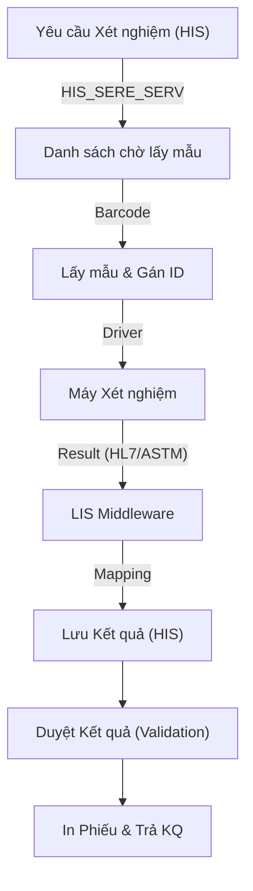

# Technical Overview: Phân hệ Xét nghiệm (LIS)

## 1. Tổng quan Kiến trúc
Phân hệ LIS (Laboratory Information System) trong HIS được thiết kế theo kiến trúc Modular, tách biệt giữa tầng xử lý nghiệp vụ (Business Logic) và tầng giao tiếp thiết bị (Device Driver).
Toàn bộ các Plugin được đặt trong namespace `LIS.Desktop.Plugins.*` (cho quy trình xét nghiệm) và `HIS.Desktop.Plugins.*` (cho tích hợp HIS).

### 1.1. Luồng dữ liệu tổng quát

## 2. Core Components
Các thành phần chính của hệ thống LIS:

### 2.1. Quản lý Mẫu (Sample Management)
*   **Plugins**: `LIS.Desktop.Plugins.LisSample`, `LIS.Desktop.Plugins.LisSampleList`.
*   **Chức năng**:
    *   Mapping chỉ định từ HIS sang Sample ID của LIS.
    *   In Barcode dán ống nghiệm.
    *   Theo dõi trạng thái mẫu (Đã lấy, Đang chạy, Đã có KQ).

### 2.2. Kết nối Máy (Analyzer Integration)
*   **Plugins**: `HIS.Desktop.Plugins.LisMachine`, `HIS.Desktop.Plugins.LisResultImport`.
*   **Giao thức**:
    *   **TCP/IP**: Sử dụng socket để nhận data stream.
    *   **RS232**: Giao tiếp qua cổng COM (Legacy).
    *   **File Shared**: Đọc file kết quả (CSV/XML) từ thư mục share (ít dùng).

### 2.3. Vi sinh (Microbiology)
*   **Plugins**: `HIS.Desktop.Plugins.ReturnMicrobiologicalResults`.
*   **Đặc thù**: Quy trình nuôi cấy dài ngày, kết quả định tính (Dương/Âm) và Kháng sinh đồ (S/R/I).

### 2.4. Quản lý Chất lượng (QC)
*   **Plugins**: `QCS.Desktop.Plugins.QcsQuery`.
*   **Logic**: Kiểm soát nội kiểm (Internal QC) theo quy tắc Westgard.

## 3. Database Schema Overview
Mô hình dữ liệu LIS chia sẻ chung DB với HIS nhưng có các bảng đặc thù:

### 3.1. Danh mục (Master Data)
*   `HIS_SUIM_INDEX`: Chỉ số xét nghiệm (Test Code).
*   `HIS_MACHINE`: Danh sách máy.
*   `HIS_SERVICE_MACHINE`: Mapping Dịch vụ HIS <-> Máy.

### 3.2. Transaction Data
*   `HIS_SERE_SERV`: Dịch vụ chỉ định (Header).
*   `HIS_SERE_SERV_TE`: Kết quả chi tiết (Result).
*   `HIS_SERVICE_REQ`: Phiếu yêu cầu.

## 4. Integration Points
*   **HIS Core**: Đồng bộ `PatientID`, `TreatmentID` để lấy thông tin hành chính.
*   **SmartCard**: Quẹt thẻ BHYT để lấy thông tin bệnh nhân nhanh.
*   **EMR**: Đẩy kết quả ký số lên hồ sơ bệnh án điện tử.
