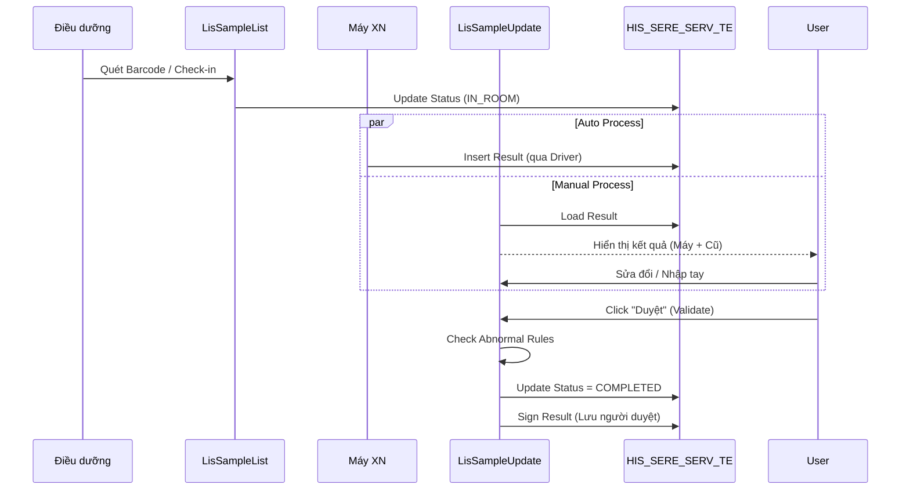

# Technical Spec: Xét nghiệm Thường quy (Routine Test)

## 1. Business Mapping
*   **Ref**: [Quy trình Xét nghiệm Tổng quan](../../02-business-processes/laboratory/01-business-overview.md)
*   **Scope**: Áp dụng cho các xét nghiệm Huyết học, Sinh hóa, Miễn dịch, Nước tiểu (không bao gồm Vi sinh).
*   **Key Plugins**: `LIS.Desktop.Plugins.LisSampleList` & `HIS.Desktop.Plugins.LisSampleUpdate`.

## 2. Core Components
### 2.1. Quản lý Mẫu & Tiếp nhận (Sample Management)
*   **Plugin**: `LIS.Desktop.Plugins.LisSampleList`.
*   **Chức năng**:
    *   Hiển thị danh sách bệnh nhân có chỉ định xét nghiệm.
    *   In Barcode (gọi thư viện `SAR.Desktop.Plugins.SarPrintList`).
    *   Xác nhận đã lấy mẫu (`IsSampled = 1`).
    *   Chuyển trạng thái mẫu vào phòng (Check-in).

### 2.2. Nhập & Duyệt Kết quả (Result Entry & Validation)
*   **Plugin**: `HIS.Desktop.Plugins.LisSampleUpdate`.
*   **UI Components**:
    *   `frmUpdateLisSample.cs`: Form chính nhập kết quả tay hoặc sửa kết quả máy.
    *   `UCLisSampleUpdate`: UserControl nhúng.
*   **Logic**:
    *   **Auto-Calculate**: Tự động tính toán các chỉ số dẫn xuất (Ví dụ: `GLOBULIN = PROTEIN - ALBUMIN`).
    *   **Flagging**: Đánh dấu H/L (High/Low) dựa trên `HIS_GENDER` và `HIS_AGE`.

## 3. Process Flow (Technical Deep Dive)

### 3.1. Luồng Xử lý Xét nghiệm Thường quy

## 4. Database Schema
Cấu trúc dữ liệu lưu trữ kết quả chi tiết:

### 4.1. HIS_SERE_SERV_TE (Test Result Detail)
Bảng quan trọng nhất lưu giá trị từng chỉ số.
*   `ID`: PK.
*   `SERE_SERV_ID`: FK to HIS_SERE_SERV (Dịch vụ chỉ định).
*   `TEST_INDEX_ID`: FK to HIS_TEST_INDEX (Chỉ số xét nghiệm, e.g., GLU, WBC).
*   `VALUE`: Giá trị kết quả (String để lưu cả định lượng và định tính).
*   `RESULT_DATE`: Thời gian có kết quả.
*   `MACHINE_ID`: Máy thực hiện.
*   `LEVER_VALUE`: Giá trị H/L/Normal.
*   `OLD_VALUE`: Lưu vết giá trị cũ nếu có sửa đổi.

### 4.2. HIS_TEST_INDEX (Danh mục Chỉ số)
*   `TEST_INDEX_CODE`: Mã chỉ số (Mapping với máy).
*   `NORMAL_VALUE`: Giá trị bình thường (Text hiển thị).
*   `LOWER_LIMIT`, `UPPER_LIMIT`: Giới hạn dưới/trên để bắt flag.

## 5. Integration Points
*   **Billing**: Khi kết quả được duyệt (`Status = COMPLETED`), hệ thống tự động trigger sự kiện để update trạng thái thanh toán hoặc chốt chi phí (nếu cấu hình).
*   **Mobile App**: Kết quả duyệt xong sẽ được đẩy notification về App người bệnh (qua `HIS.API`).

## 6. Common Issues
*   **Lệch dải tham chiếu**: Do chưa cấu hình `HIS_TEST_INDEX_RANGE` cho từng độ tuổi/giới tính cụ thể.
*   **Mất kết quả**: Do 2 máy cùng đẩy kết quả vào 1 `SampleID` nhưng không phân biệt được `TestCode` trùng nhau.
