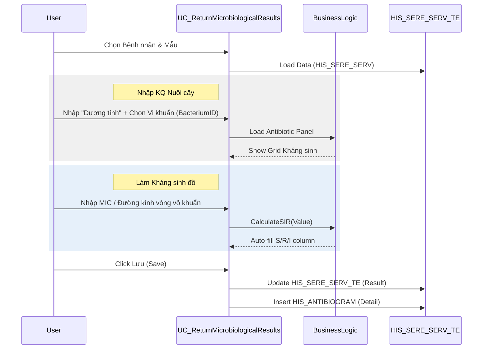

# Technical Spec: Xét nghiệm Vi sinh (Microbiology)

## 1. Business Mapping
*   **Ref**: [Quy trình Xét nghiệm Vi sinh](../../02-business-processes/laboratory/02-microbiology.md)
*   **Scope**: Module này quản lý toàn bộ quy trình vi sinh từ Nuôi cấy, Định danh đến làm Kháng sinh đồ (AST).
*   **Key Plugin**: `HIS.Desktop.Plugins.ReturnMicrobiologicalResults`.

## 2. Core Components
### 2.1. Plugin Main Structure
*   **Plugin Name**: `HIS.Desktop.Plugins.ReturnMicrobiologicalResults`
*   **UI Controls**:
    *   `UC_ReturnMicrobiologicalResults.cs`: Màn hình chính xử lý kết quả.
    *   `UC_ReturnMicrobiologicalResults__CheckAll.cs`: Logic chọn nhiều mẫu.
    *   `UC_ReturnMicrobiologicalResults_PlusPrint.cs`: Xử lý in ấn.

### 2.2. Logic Nghiệp vụ (Business Logic)
*   **Nuôi cấy (Culture)**:
    *   Ghi nhận kết quả Âm tính/Dương tính sơ bộ.
    *   Nếu Dương tính -> Kích hoạt quy trình Định danh.
*   **Kháng sinh đồ (Antibiogram)**:
    *   Load danh sách kháng sinh theo `AntibioticPanel` (Bộ kháng sinh mẫu).
    *   Nhập giá trị MIC (Minimum Inhibitory Concentration).
    *   Hệ thống tự động suggest S (Sensitive)/I (Intermediate)/R (Resistant) dựa trên giới hạn cấu hình.

## 3. Process Flow (Codebase Mapping)

### 3.1. Luồng Trả Kết quả Vi sinh

## 4. Database Schema
Các bảng dữ liệu đặc thù cho Vi sinh:

### 4.1. HIS_ANTIBIOGRAM (Kết quả KSĐ)
Lưu chi tiết kết quả kháng sinh đồ cho từng loại vi khuẩn.
*   `ID`: PK.
*   `SERVICE_REQ_ID`: FK to HIS_SERVICE_REQ.
*   `BACTERIUM_ID`: Mã vi khuẩn định danh.
*   `ANTIBIOTIC_ID`: Mã kháng sinh.
*   `VALUE`: Giá trị đo được (MIC).
*   `CONCLUSION`: Kết luận (S/R/I).

### 4.2. Danh mục Vi sinh
*   `HIS_BACTERIUM`: Danh mục Vi khuẩn.
*   `HIS_ANTIBIOTIC`: Danh mục Kháng sinh.
*   `HIS_BACTERIUM_FAMILY`: Họ vi khuẩn.

## 5. Integration Points
Module này tích hợp chặt chẽ với:
*   **LIS Sample**: Để lấy trạng thái mẫu chuyển sang.
*   **EMR**: Kết quả KSĐ được hiển thị đặc biệt trên EMR (dạng bảng ma trận) thay vì text đơn thuần.

## 6. Common Issues
*   **Mapping Kháng sinh**: Lỗi thường gặp là chưa cấu hình `AntibioticPanel` cho loại vi khuẩn mới, dẫn đến không hiện danh sách kháng sinh để nhập.
*   **Logic S/R/I**: Cần cập nhật thường xuyên theo chuẩn CLSI/EUCAST mới nhất trong bảng cấu hình `HIS_ANTIBIOTIC_RANGE`.
